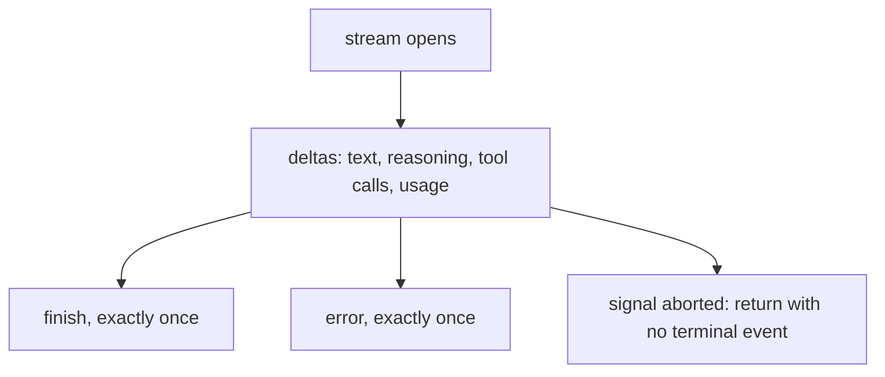

# Writing a provider adapter

A `ProviderAdapter` turns one provider's wire dialect into Rulvar's canonical vocabulary: a `ChatRequest` in, a stream of `ChatEvent` out. It is one of the six SPI seams frozen at 1.0, so an adapter you write today keeps working across engine releases. The division of labor is strict: the engine absorbs no provider quirks, and your adapter absorbs all of them invisibly. Multi round continuation dances, streamed JSON tool arguments, cache breakpoint compilation, usage normalization, refusal surfacing: all of it stays behind the seam.

Before writing one from scratch, check the shipped surfaces on [Providers](/guide/providers): `openaiCompatible` covers any endpoint speaking the Chat Completions dialect with an explicit id and a caps override, and `bridgeAiSdk` wraps any Vercel AI SDK `LanguageModelV4`. A new adapter is worth building when the provider speaks neither. Reference implementations, smallest first: `@rulvar/bridge-ai-sdk` (one file over an existing abstraction), then `@rulvar/openai` and `@rulvar/anthropic` (full first class adapters with capability tables, continuation absorption, and retention).

## The contract

```ts
import type { ChatEvent, ChatRequest, Effort, ModelCaps, Pricing } from "@rulvar/core";

interface ProviderAdapter {
  /** Stable adapter id; the left segment of ModelRef "adapterId:model". */
  id: string;
  /** Provider family for provider-raw retention and projection; default = id. */
  provider?: string;
  caps(model: string): ModelCaps;
  /** Optional: refresh the capability table from live model lists. */
  refreshCaps?(): Promise<void>;
  stream(req: ChatRequest, signal?: AbortSignal): AsyncIterable<ChatEvent>;
  countTokens?(req: ChatRequest): Promise<number>;
}

type ModelCaps = {
  structuredOutput: "native" | "forced-tool" | "prompt";
  supportsTemperature: boolean;
  supportsParallelTools: boolean;
  reasoningEfforts: Effort[];
  contextWindow: number;
  maxOutputTokens: number;
  pricing?: Pricing;
};
```

Every adapter has the same two halves: request compilation (canonical `ChatRequest` to your wire dialect) and stream mapping (your wire events to `ChatEvent`). The rest of this page is the obligations on those two halves, in the order you will hit them.

## Wire mapping obligations

### Messages, parts, and canonical ids

Canonical messages are `Msg` values: a role plus an ordered list of `Part`s (text, image, tool call, tool result, and `provider-raw` for opaque provider blocks). Two rules:

- Parts are ordered. Preserve part order in both directions: compilation and stream assembly.
- The library, not the provider, mints tool call ids. A `CanonicalId` is an engine minted ULID; your adapter keeps a bijective map between canonical ids and your wire ids (`toolu_*`, `call_*`, whatever your provider uses) in both directions, for the lifetime of a canonical history. The canonical history never contains a wire id, which is what lets one conversation move between providers without id format collisions. Mint incoming ids with `createCanonicalIdMinter` from `@rulvar/core`; `@rulvar/anthropic` exports its small `IdMap` class if you want a template to copy.

### The event stream

`stream` yields the canonical event union: `text-delta`, `reasoning-delta`, `tool-call-start`, `tool-call-delta`, `tool-call-end`, `usage`, `finish`, `error`. The [Providers](/guide/providers) page tables the vocabulary; these are the emission obligations:

- **Yield incrementally, never buffer the turn.** Each canonical event is yielded as its provider event is consumed, with the consumer's pull as the only pacing (an async generator over the wire stream gives you this for free). Buffering the complete response before yielding breaks live `agent:stream` delivery, blinds the stream-idle watchdog into severing healthy long generations, loses partial usage on aborts, and holds every delta in memory. Do not push events into an array a detached task fills; a slow consumer must slow the wire read, not grow a queue.
- **Exactly one terminal event per stream**: `finish` or `error`. A stream that drains without either is a provider fault your adapter surfaces as a retryable transport error, never a silent return.
- **Abort is the one exception.** When the caller's `signal` fires (cooperative cancellation, a budget ceiling, a timeout), abort the wire call promptly and return without a terminal event. Do not emit an `error` for an abort you were asked for.
- **Assemble tool arguments.** Providers stream tool arguments as JSON text fragments; your adapter accumulates them per call and emits `tool-call-end` with parsed args. Arguments that never parse are a typed error, never a silent `{}`.
- **Surface refusals typed.** A content filter or refusal stop is `finish` with `{ reason: "refusal", refusal: { provider, stopDetails } }`, where `provider` is your adapter id. Projecting a refusal to a null output silently is forbidden: it would blind ladders, escalation, and evals.
- **Emit incremental `usage` events** where your wire provides them. They may repeat and may be partial; the terminal `finish` carries the authoritative totals. When a stream is cut at the budget ceiling, the engine journals the delta accumulated usage with `usageApprox: true`, so the more you emit, the tighter that approximation.
- **Absorb continuation quirks.** If your provider pauses a turn server side (the Anthropic `pause_turn` pattern), continue internally and never surface the pause as a canonical finish. Callers only ever see complete turns.



### providerOptions and providerMetadata

`ChatRequest.providerOptions` is namespaced by adapter id: `{ anthropic: {...}, myadapter: {...} }`. Read only your own namespace and ignore unknown namespaces without error. Namespaced options are escape hatches: canonical fields always win where both express the same thing, and a namespaced option that silently contradicts a canonical field is a typed `ConfigError`, not a quiet override.

Symmetrically, report provider specific response facts (matched stop sequence, response ids, service tier) under your namespace in `finish.providerMetadata`.

The engine populates one reserved namespace, `rulvar`, on every request with spawn telemetry (`agentType`, `label`). It is telemetry, not configuration: you may consume it, must otherwise ignore it, and it never enters journal identity.

### Effort mapping

Canonical effort is exactly five levels: `low | medium | high | xhigh | max`. Map them to your wire per a documented table, the way the first class adapters do:

| Canonical | `@rulvar/anthropic` wire | `@rulvar/openai` wire |
|---|---|---|
| `low` | `low` | `low` |
| `medium` | `medium` | `medium` |
| `high` | `high` | `high` |
| `xhigh` | `xhigh` | `xhigh` |
| `max` | `max` (passthrough) | `xhigh` (documented lossy downmap) |

Three rules travel with the table. A lossy downmap is recorded under your namespace in `providerMetadata`; journal identity always keeps the requested canonical effort, so replay is stable regardless of what the wire received. Efforts you cannot serve stay out of `caps.reasoningEfforts`, so the router scrubs them visibly (a warning event) instead of your adapter guessing. And a wire level that has no canonical equivalent is reachable only through your `providerOptions` namespace, never through the canonical `effort` field.

### cacheHint

`ChatRequest.cacheHint` declares intended prompt cache boundaries in provider neutral form. Compile it best effort into your provider's cache mechanism; providers without one ignore it silently. It is a transport level cost optimization only: it never changes response semantics and never enters journal identity. If your provider caps the number of breakpoints, keep the deepest and drop the shallowest, deterministically.

## Errors: transport, never task

Adapters never throw raw errors across the seam. Everything is projected into `WireError`, the JSON serializable form `{ code, message, retryable, data? }` that journals and crosses process boundaries.

The taxonomy split you must get right is transport versus task:

- **Transport class failures are retryable.** Network faults, 5xx, 429 rate limits, and overload responses set `retryable: true`. The retry engine distinguishes three classes (`transport`, `rate-limit`, `overloaded`) via `data.kind`; anything retryable without a specific kind classifies as `transport` (`retryClassOf` in `@rulvar/core` is the classifier). A 429 surfaces the provider's retry delay as `retryAfterMs` in `data`, plus any rate limit bucket headers.
- **Task class failures are never retryable by construction.** Mark them `retryable: false`: an invalid request, a schema the provider rejects, an authentication failure. Retrying them burns money on a deterministic failure.
- **Model level outcomes are not errors at all.** Refusals, `max-tokens` stops, and context window exhaustion are typed `finish` outcomes; the agent runtime, ladders, and fallbacks react to them semantically.

Retries themselves belong to the core. Disable your SDK's autoretries (`max_retries: 0` or the equivalent client option), never sleep inside the adapter, and let the engine's `RetryPolicy` schedule backoff; a provider supplied `retryAfterMs` replaces the computed delay. SDK internal retries are forbidden because they are invisible to the journal, the budget ledger, and timeouts. See [Model routing](/guide/model-routing) for how retries and failover compose above your adapter.

## The usage invariant

```ts
type Usage = {
  inputTokens: number;      // the FULL prompt, cache reads and cache writes included
  outputTokens: number;
  cacheReadTokens: number;
  cacheWriteTokens: number;
  reasoningTokens?: number;
};
```

The engine verifies usage at the adapter boundary, and cost attribution is only provider neutral because every adapter normalizes to the same invariant. Before publishing, confirm every line:

- `inputTokens` is the full prompt size, including cache reads and cache writes. Providers that report non cached input separately (Anthropic does) are normalized by addition.
- `cacheReadTokens` and `cacheWriteTokens` are always present: `0` when the provider has no cache, never absent.
- `outputTokens` covers everything billed as output, reasoning included where the provider folds it in; `reasoningTokens` is the optional breakdown.
- The terminal `finish` event carries the authoritative totals; incremental `usage` events may repeat and may be partial.
- Unpriced models are legitimate (`caps.pricing` absent): they surface as unpriced in the cost report, never as silent zeros. See [Budgets and termination](/guide/budgets).

## Replay obligations

Two mechanisms depend on your adapter being byte stable.

**Provider raw retention.** Some provider blocks must survive round trips byte exact: thinking blocks with signatures, reasoning items with encrypted content. Ship the turn's blocks to retain, in stream order, via `finish.providerMetadata[<your adapter id>].retainedParts`. The runtime lifts each into a `provider-raw` part (`liftRetainedParts`) tagged with your provider family and stores it in the canonical history unconditionally; on every outgoing request the history projector (`projectHistory`) includes a retained part exactly when the target's family matches, and omits foreign ones. Your compilation half must reinsert same family blocks verbatim: byte exact, in order, unmodified. The family tag is `ProviderAdapter.provider`, not the adapter id, so two adapters of the same family (say, two differently keyed gateways) share retained blocks, and a custom id never splits the family. Adapters whose dialect retains nothing simply never ship the key.

**Deterministic request compilation.** Cassette replay (below) keys each recorded exchange by a hash of the canonical request, with the engine's telemetry namespace excluded. Keep compilation a pure function of the `ChatRequest`: no timestamps, no random request ids, no environment dependent fields feeding the wire request beyond what the canonical request carries. Nondeterministic compilation shows up as cassette misses and unstable contract tests. The same discipline is what makes journal [replay](/guide/determinism) reliable above you: the content key hashes the requested model spec, so a byte stable adapter never perturbs identity.

## Declaring capabilities

`caps(model)` feeds the router, and every field drives a concrete decision:

| `ModelCaps` field | What the router does with it |
|---|---|
| `structuredOutput` | Selects the structured output tier: `native` json schema, `forced-tool`, or `prompt`. |
| `supportsTemperature` | Scrubs sampling parameters the model rejects instead of letting the provider return a 400. |
| `supportsParallelTools` | Gates parallel tool calls. |
| `reasoningEfforts` | Canonical efforts the model accepts after mapping; anything else is scrubbed visibly. |
| `contextWindow` | Compaction threshold and context accounting. |
| `maxOutputTokens` | Output budget ceiling. |
| `pricing` | Fallback only; the engine's versioned price table wins when both exist. |

Be honest and be conservative. Declaring a capability the provider cannot serve produces live 400s; declaring less than the truth merely costs a tier. When you cannot introspect the target (gateways, long tail hosts), take the posture `openaiCompatible` takes and let callers override per model: `structuredOutput: "prompt"`, `supportsTemperature: true`, `supportsParallelTools: false`, empty `reasoningEfforts`, no pricing (exported as `CONSERVATIVE_COMPATIBLE_CAPS` from `@rulvar/openai`). `refreshCaps` and `countTokens` are optional: implement them when your provider has a live model list or a token counting endpoint.

## The adapter skeleton

The skeleton compiles against the public SPI and shows the two halves. The four `declare`d functions are the actual work: replace them with your wire dialect.

```ts
import {
  createCanonicalIdMinter,
  type CanonicalId,
  type ChatEvent,
  type ChatRequest,
  type ModelCaps,
  type ProviderAdapter,
  type WireError,
} from "@rulvar/core";

const CONSERVATIVE_CAPS: ModelCaps = {
  structuredOutput: "prompt",
  supportsTemperature: true,
  supportsParallelTools: false,
  reasoningEfforts: [],
  contextWindow: 8_192,
  maxOutputTokens: 4_096,
};

export interface ExampleAdapterOptions {
  id: string; // explicit and mandatory, like openaiCompatible
  baseURL: string;
  apiKey?: string;
  caps?: (model: string) => Partial<ModelCaps>;
}

// The four functions you actually write:
declare function compileRequest(req: ChatRequest): unknown; // your dialect; SDK autoretries OFF
declare function callProvider(
  wire: unknown,
  options: ExampleAdapterOptions,
  signal?: AbortSignal,
): AsyncIterable<unknown>;
declare function mapWireEvents(
  wireEvent: unknown,
  mint: () => CanonicalId,
): ChatEvent[]; // mint canonical ids; assemble tool arg JSON; normalize usage
declare function toWireError(thrown: unknown): WireError; // 429 => retryable rate-limit with retryAfterMs

export function exampleAdapter(options: ExampleAdapterOptions): ProviderAdapter {
  const mintCanonicalId = createCanonicalIdMinter();
  return {
    id: options.id,
    provider: options.id,
    caps(model) {
      return { ...CONSERVATIVE_CAPS, ...options.caps?.(model) };
    },
    async *stream(req: ChatRequest, signal?: AbortSignal): AsyncIterable<ChatEvent> {
      const wire = compileRequest(req);
      try {
        for await (const wireEvent of callProvider(wire, options, signal)) {
          // One wire event may map to zero or several canonical events;
          // exactly one terminal finish carries normalized usage.
          yield* mapWireEvents(wireEvent, mintCanonicalId);
        }
      } catch (thrown) {
        if (signal?.aborted === true) {
          return; // an aborted stream ends without a terminal event
        }
        yield { type: "error", error: toWireError(thrown) };
      }
    },
  };
}
```

## Contract tests with cassettes

The cassette tooling in `@rulvar/testing` makes your adapter testable forever with one paid run. `record` wraps live adapters so that every completed stream appends one redacted row to a cassette JSONL file (authorization material never reaches cassette bytes; pass a custom `redact` for provider specific secret shapes). You commit the cassette, and CI replays it hermetically: `replay` with `onMiss: "throw"` turns any drift into a loud typed failure with zero live calls.

```bash
pnpm add -D @rulvar/testing
```

```ts
import { describe, expect, it } from "vitest";
import { createEngine, defineWorkflow, InMemoryStore, type ProviderAdapter } from "@rulvar/core";
import { record, replay } from "@rulvar/testing";
import { exampleAdapter } from "./adapter.js";

const CASSETTE = new URL("./contract.cassette.jsonl", import.meta.url).pathname;
const MODEL = "exampleprov:small-1";
const wf = defineWorkflow({ name: "contract" }, (ctx) => ctx.agent("Reply with the word ok."));

function engineOver(adapters: ProviderAdapter[]) {
  return createEngine({
    adapters,
    stores: { journal: new InMemoryStore() },
    defaults: { routing: { loop: MODEL, extract: MODEL } },
  });
}

describe("exampleAdapter contract", () => {
  // Recording leg: run once with a real key to (re)produce the cassette.
  it.skipIf(process.env.EXAMPLEPROV_API_KEY === undefined)("records", async () => {
    const live = exampleAdapter({
      id: "exampleprov",
      baseURL: "https://api.exampleprov.example",
      apiKey: process.env.EXAMPLEPROV_API_KEY,
    });
    const outcome = await engineOver(record({ adapters: [live], cassette: CASSETTE }))
      .run(wf, undefined)
      .result;
    expect(outcome.status).toBe("ok");
  });

  // Hermetic leg: the committed cassette IS the contract; CI never goes live.
  it("replays hermetically", async () => {
    const outcome = await engineOver(replay({ cassette: CASSETTE, onMiss: "throw" }))
      .run(wf, undefined)
      .result;
    expect(outcome.status).toBe("ok");
    expect(outcome.usage.inputTokens).toBeGreaterThanOrEqual(
      outcome.usage.cacheReadTokens + outcome.usage.cacheWriteTokens,
    );
  });
});
```

Grow the recorded corpus toward what the first class adapters cover: a plain reply, a tool calling turn, structured output at your declared tier, a refusal, a 429 with a retry delay, and a `max-tokens` stop. `onMiss: "passthrough"` forwards unrecorded requests to a matching live adapter, which is convenient while developing and wrong in CI. For provider free unit tests of the machinery above your adapter, `FakeAdapter` and the rest of the harness are covered in [Testing](/guide/testing).

## Packaging and publishing

Match the conventions of the shipped adapters: ESM only, Node 22.12.0 or newer, types shipped next to the build, and a regular dependency on `@rulvar/core` for the SPI types. Publish under your own name or scope; `@rulvar/*` is the project's namespace.

```json
{
  "name": "rulvar-adapter-exampleprov",
  "version": "0.1.0",
  "type": "module",
  "license": "Apache-2.0",
  "engines": { "node": ">=22.12.0" },
  "exports": {
    ".": { "types": "./dist/index.d.ts", "default": "./dist/index.js" }
  },
  "files": ["dist"],
  "sideEffects": false,
  "dependencies": { "@rulvar/core": "^1.9.0" },
  "devDependencies": { "@rulvar/testing": "^1.9.0", "vitest": "^4.1.10" }
}
```

Before you publish, walk the checklist:

- SDK autoretries disabled; retry delays surfaced as `retryAfterMs`; no internal sleeps.
- The usage invariant checklist fully green; the replay leg of your contract test asserts it.
- Exactly one terminal event per stream, proven by a drained stream test; abort returns without a terminal event.
- Canonical ids minted and mapped bijectively; a two turn tool round trip replays byte identically.
- `caps()` honest: nothing declared that the provider cannot serve; efforts you cannot map stay undeclared so the scrub is visible.
- Committed cassettes redacted (the kit's default redaction plus your provider's secret shapes).
- The README documents your `providerOptions` namespace, your effort mapping table, and any lossy downmaps.

## Next steps

- [Providers](/guide/providers): the shipped adapters and the registration surface your adapter plugs into.
- [Model routing](/guide/model-routing): how caps, effort, retries, and failover compose above the seam.
- [Testing](/guide/testing): the full test harness, from `FakeAdapter` to strict replay.
- [Determinism and replay](/guide/determinism): why byte stable adapters matter to the journal.
- API reference: [@rulvar/core](/api/@rulvar/core/), [@rulvar/testing](/api/@rulvar/testing/), [@rulvar/anthropic](/api/@rulvar/anthropic/) as a worked example.
