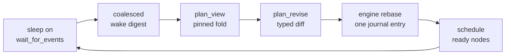

# PlanRunner and extensions

`@rulvar/plan` ships PlanRunner, the opt-in extension of the dynamic orchestrator ([mode (c)](/guide/orchestration-modes)). It exists for one workload shape: wide fan-out where the plan must change mid-run. The design position is deliberate: mid-run replanning is the only real justification for an LLM orchestrator, and if the plan never changes, a script is strictly better. For most workloads the documented default remains a phase chain with replanning between phases; reach for PlanRunner when dozens of children run in parallel, some of them escalate, and the plan has to absorb what they report without redoing paid work.

```bash
pnpm add @rulvar/core @rulvar/anthropic @rulvar/plan @rulvar/store-sqlite
```

The extension holds a hard line everywhere: the plan is typed data owned by the engine, never prose in a transcript. The orchestrator model proposes typed diffs; the engine mints identifiers, admits spawns, schedules ready nodes, and journals every dynamic decision strictly before its effects. Nondeterminism is eliminated not by forbidding dynamism but by recording it.

## Quick start

```ts
import { createEngine, orchestrate } from '@rulvar/core';
import { anthropic } from '@rulvar/anthropic';
import { SqliteStore } from '@rulvar/store-sqlite';
import { planRunner } from '@rulvar/plan';

const engine = createEngine({
  adapters: [anthropic()],
  stores: { journal: new SqliteStore({ path: './runs.db' }) },
  defaults: {
    routing: {
      orchestrate: 'anthropic:claude-opus-4-8',
      loop: 'anthropic:claude-sonnet-5',
    },
    profiles: {
      researcher: { description: 'Finds and cites primary sources.' },
      migrator: {
        description: 'Applies one codemod to one package.',
        escalation: { flavor: 'A' },
      },
    },
  },
});

const handle = orchestrate(engine, 'Migrate all 40 packages to the new config format', {
  budget: { capUsd: 2, finalizeTurns: 2 },
  extension: planRunner({
    maxRevisionsPerRun: 32,
    limits: { maxTotalSpawns: 64, maxDepth: 1 },
    guards: { fallback: 'finish-with-partial' },
  }),
});

const outcome = await handle.result;
```

`orchestratePlanned(engine, goal, { plan })` from `@rulvar/plan` is the same thing as one call. Either way, the extension appends four tools to the base orchestrator toolset:

| Tool | Purpose |
|---|---|
| `plan_view` | A pure-fold render of the plan, pinned to the last wake digest: nodes, lineage stats, termination balances, abandoned-spend totals. Costs nothing against the orchestrator budget. |
| `plan_revise` | A typed diff of plan operations, rebased by the engine against the current plan head. |
| `ledger_append` | One authored run-ledger op (see [the run ledger](#the-run-ledger)). |
| `ledger_read` | The pinned ledger render for the current turn. |

## The plan is engine-owned data

A plan node carries a `NodeId` (a ULID minted by the engine inside the decision entry that adds it, never by the model), a logical task identity, a dependency list forming a DAG, a priority, and a status from a closed machine:

`pending -> ready -> running -> done | failed | cancelled`, plus `parked`, `escalated`, and `skipped`. `done` is immutable. The engine, not the model, promotes `pending` nodes to `ready` when their dependencies are satisfied and schedules ready nodes through the same per-run semaphore and budget admission as every other spawn.

Several parties author plan mutations, but exactly one applier consumes them: a pure fold over a totally ordered stream of plan-mutating entries in one sequential journal scope. Two entry kinds exist:

| Entry kind | Author | Written when |
|---|---|---|
| `plan.revision` | The orchestrator, via `plan_revise` | The one kind that needs rebase, because only the orchestrator authors against a pinned (possibly stale) snapshot. |
| `plan.decision` | The engine, at the current plan head | Child results landing, escalation resolutions, no-progress aborts, park and cancel requests landing at turn boundaries. |

Every plan-mutating entry carries `planHashBefore`, `planHashAfter`, and its hash version. On append the engine asserts the before-hash equals the current fold head; on replay the fold recomputes every after-hash under that entry's own hash profile. A mismatch is a typed error (`PlanInvariantError` live, `ReplayPlanHashMismatch` on resume), never a silent brick, and a stale revision can never corrupt the plan because its rebase outcome is what gets recorded.



## Revisions rebase instead of failing

A `plan_revise` call must name its `base`: the digest sequence and plan hash of the wake digest its `plan_view` was pinned to. The engine then applies the requested ops sequentially against the real plan head, and each op lands as exactly one of three outcomes:

- `applied`: the op took effect as requested.
- `transformed`: a deterministic rewrite; the applied form is recorded next to the requested one.
- `dropped`: a journaled no-op with a machine reason code and, where relevant, a `blockingRef` pointing at the entry that caused the conflict.

The whole result is one durable `plan.revision` entry, appended strictly before any effect executes, and the tool result the orchestrator sees is a deterministic render of that entry: byte-identical on replay. The full conflict table is closed and normative; these rows convey its flavor:

| Requested op | State at the plan head | Outcome |
|---|---|---|
| `add_task` | Admission rejects | Dropped `admission_denied`, verdict embedded in the entry |
| `add_task` | Byte-identical key of a completed abandoned branch | Transformed `reuse_by_reference`: linked, zero live cost |
| `amend_task` | Node running | Dropped `node_running`: amending running work means paying twice; the sanctioned path is `cancel_task` plus `add_task` |
| `amend_task` | Node parked | Transformed `checkpoint_discarded`: the amendment applies and unpark becomes a restart |
| `park_task` | Node running | Applied as a park request; the park lands at the turn boundary via a `plan.decision` |
| `cancel_task` | Node done | Dropped `node_already_done`: done is immutable and paid for; cancel the dependents instead |
| `cancel_task` | Node escalated, undecided | Transformed `resolved_escalation`: becomes an escalation resolution with verdict cancel |
| `rewire_deps` | Resulting graph has a cycle | Whole op dropped `dep_cycle`; the op is atomic |
| `waive_dep` | Upstream failed or cancelled | Applied: the dependency is dead, not resolved, and the waive unblocks the node |
| Any op | Plan frozen at the orchestrator cap | Dropped `plan_frozen` |
| Whole revision | `base` does not match the referenced wake digest | All ops dropped `bad_base`; the revision budget is still debited |

Without `rewire_deps` and `waive_dep` the DAG would deadlock on a failed dependency; both ops exist for exactly that reason. Cancellation cascades are computed by the engine at apply time; `cancel_task` takes no cascade parameter.

## Guards and terminating fallbacks

Every guard in the machinery terminates without a human. The fallback chain is `reject-revision -> finish-with-partial -> fail-run`, default `finish-with-partial`, chosen via `fallback` on the `guards` option (`RevisionGuardsOptions`):

- The revision budget `maxRevisionsPerRun` (default 32, a top-level `planRunner` option) is absolute and non-replenishable: every journaled `plan_revise` debits one unit, including fully dropped ones, so conflict spam is never a free retry.
- Three consecutive fully dropped revisions (`droppedRevisionLimit` on `guards`, default 3) trip the fallback: a hallucinated-base loop terminates instead of spinning.
- The oscillation guard watches coarse approach signatures across logical-task boundaries: cancel and re-add churn of content-identical work is detected even under a fresh lineage, and the third re-add of one spawn key (`maxOscillationsPerKey` on the `reuse` option, default 2) is rejected outright.
- An optional `maxAbandonedNetUsdFraction` on `guards` trips the same fallback when net lost spend crosses a fraction of the starting budget.

## Wake digests

The orchestrator sleeps on `wait_for_events` and is woken exclusively by coalesced wake digests: summaries, never raw transcripts, so its context grows with the number of wakes rather than the number of children. All events since the previous wake coalesce into one digest, ordered by spawn ordinal, never by wall-clock completion order. The digest is part of the wake snapshot: a turn re-executed after a crash reads exactly the same bytes, and `plan_view` and `ledger_read` inside that turn are pinned to the same snapshot.

Each digest carries the completed task digests (each `outputSummary` clamped to 400 characters by default; override with `renderBudgetChars`), pending and newly decided escalations, the termination balances, a passive budget block, and reuse statistics, including which results arrived by reference.

The trigger vocabulary is closed:

| Trigger | Fires when |
|---|---|
| `quiescence` | Nothing running and nothing ready. Always armed regardless of what was requested: a plan that runs dry always wakes the orchestrator. |
| `child_terminal` | A child (optionally from a handle list) settles. |
| `escalation` | A child files an escalation report. |
| `budget_threshold` | Run spend crosses 50 or 80 percent. |

A `wait_for_events` call whose requested triggers can never fire fails immediately with a typed error: an embedded run cannot hang unrecoverably. And there is deliberately no wake trigger on the orchestrator's own spend, because waking the orchestrator about its own spending means spending more.

## Admission: one gate for every spawn

The AdmissionController is the single admission point for all spawns of any origin: orchestrator tools, workflow children, escalation decompositions, ladder retries, and reuse links. Admission runs before the decision entry is journaled, and the verdict, the budget reserve, and the stats it was computed from are embedded in the entry, so replay never re-evaluates admission against a live budget.

| Limit | Default |
|---|---|
| `maxDepth` | 1 (hard ceiling 4) |
| Children per node | 16 |
| `childBudgetFraction` of the parent remainder | 0.3, computed after subtracting the parent's finalize reserve |
| Engine lifetime spawn cap | 500 per run |
| `maxTotalSpawns` (frozen at start) | 128 |
| `maxAttemptsPerLogicalTask` | 8 |
| `maxEscalationsPerLogicalTask` | 2 |
| Live attempts per logical task | 1: a competing admit is rejected `lineage_busy` |

### Reuse by reference: revisions never redo paid work

Every spawn has a spawn key: the content key of its root entry. Matching is strict byte equality, never fuzzy. When an `add_task` matches the key of a branch that was cancelled or abandoned, the admission verdict is computed once, live, and embedded in the carrying entry:

- `reuse_full`: the donor's root finished `ok` or `escalated`. The new node links to the donor by reference (a `node.link` entry), reserves zero budget, and the whole subtree costs zero live calls.
- `admit_graft`: the donor was severed mid-flight with at least one completed paid entry. The new node grafts onto the donor's subtree; completed work forward-matches through the alias and only the interrupted remainder runs live.
- Plain admit: the donor has no paid entries or grafting is unsafe; the spawn runs fresh, with a dedup note for telemetry.

A linked node inherits the donor's logical task identity, so escalation counters, stall streaks, and lessons survive rebirth and are never reset by re-adoption. Reclaimed value never replenishes anything: not budget reserves, not the revision budget, not the oscillation counter. The orchestrator always sees that a result arrived by reference and can consciously force re-execution with `fresh: true` on a specific `add_task`, or disable reuse entirely via the `reuse` option of `planRunner`.

This is the plan-level face of the engine-wide never-pay-twice invariant: see [Journal](/guide/journal) for the underlying abandon and link mechanics.

## Escalations: children propose, the controller disposes

A child agent never spawns its own children. What it can do, if its profile or spawn opts in, is file a typed escalation report: the task is bigger than scoped (`scope_bigger`), different than scoped (`scope_different`), or blocked with evidence (`blocked_with_evidence`), together with a revised estimate and an optional proposed decomposition. `costToDate` and `salvage` are filled by the runtime; model-authored values for them are rejected at validation.

```ts
import type { AgentProfile } from '@rulvar/core';

const migrator: AgentProfile = {
  description: 'Applies one codemod to one package.',
  escalation: {
    flavor: 'B',
    deadlineMs: 120_000,
    defaultDecision: { kind: 'accept', note: 'deadline passed; keep the partial work' },
  },
};
```

Flavor A (the default) terminates the child with status `escalated` carrying the report; the entry replays as ok, because re-running it would re-pay all the exploration it already did. Flavor B gives the child an `escalate` tool that suspends it under a deadline; the orchestrator decides while the child waits, and on timeout the journaled `defaultDecision` applies. Decisions are a closed union: `retry` (optionally with an amended prompt or a higher start tier), `decompose` into proposed children, `cancel`, or `accept`. Exactly one decision per report wins; a racing timeout and live decision are never both applied.

Caps are counted per logical task, not per node: `maxEscalationsPerLogicalTask` (default 2) follows the lineage chain across respawns, and only `scope_bigger` reports debit the counter. When the cap is exceeded, the child still terminates `escalated` with a `capExceeded` flag and the final report, because a bare limit status would discard exactly the signal the protocol exists for. For correlated storms, one class-level decision resolves a coherent set of reports in a single entry carrying per-lineage debits: a storm costs one expensive turn.

## Model ladders

A profile can declare its model as a ladder: rungs ordered cheap to strong, each with binding per-rung caps.

```ts
import type { AgentProfile } from '@rulvar/core';

const fixer: AgentProfile = {
  description: 'Fixes one failing package.',
  model: {
    ladder: {
      rungs: [
        { model: 'anthropic:claude-haiku-4-5', maxTurns: 8, maxTokens: 8192 },
        { model: 'anthropic:claude-sonnet-5', maxTurns: 12, maxTokens: 16384 },
        { model: 'anthropic:claude-opus-4-8', maxTurns: 16, maxTokens: 32768, maxCostUsd: 2 },
      ],
      startTier: 0,
      escalateOn: ['verify-failed', 'schema-exhausted', 'no-progress'],
      acceptance: [{ kind: 'mechanical', profile: 'tests-pass' }],
    },
  },
};
```

Acceptance gates run per attempt and every verdict journals as a decision entry. Mechanical gates are engine-registered named pure functions over the attempt's artifacts (`defaults.gates` on `createEngine`); judge gates run a model on the declared rung against journaled values only; spot-check gates select siblings via the journaled random source, so selection replays. A failed gate is the `verify-failed` trigger; if the ladder declares it, the next attempt executes one rung higher.

The orchestrator never sees or names concrete models. Its only model influence is `model_hint: { startTier }` on a task spec, clamped to the declared ladder. Every rung attempt is an ordinary agent scope whose identity includes the concrete model, so tier N+1 is a new content key and exactly one live attempt, while all attempts share one logical task. Rung movement is strictly monotone: no demotions, no runtime start-tier promotion. Ladder execution is owned by the plan extension; under a plain `spawn_agent` without it, ladder-declaring profiles are declaration-only and the spawn is rejected with a typed error before any admission slot is burned. See [Model routing](/guide/model-routing) for the resolution chain and role quality floors.

## Lineage: one task, many attempts

The engine answers "is this the same logical task across rebirths" with a `LogicalTaskId`: a ULID minted by the engine inside the decision entry that authorizes the spawn, never by the model, and never part of the child's content key. The inheritance rules are mechanical: a fresh `add_task` mints a new root; an `add_task` with a `lineage.continues` block is a respawn of the same task and must cite the entry that caused the rebirth; ladder retries and unpark restarts inherit; decomposition children get fresh identities with recorded ancestry; a reuse link continues the donor's identity.

Attempts also carry an approach signature computed from the agent type, toolset, schema, isolation, and an optional normalized `approach` slug, with prompt prose deliberately excluded: paraphrases of the same approach collide by construction, not by heuristic. The coarse signature feeds the stall detector and the oscillation guard; the full signature keys lessons in the run ledger. Set `approachVocabulary` on `planRunner` to force the orchestrator's tags into a closed set (an out-of-vocabulary tag is a typed tool error with a bounded re-prompt, never run death). Per-lineage stats (attempts used, escalations used, stall streak, per-approach outcomes) render in every `plan_view`.

## The run ledger

The RunLedger is the orchestrator's working memory: run-scoped, single-writer (only the orchestrator scope writes), journaled, and strictly advisory. It is never a second source of truth; where the ledger contradicts the journal about what is paid and completed, the render flags the discrepancy instead of resolving it.

| Section | Authorship | Cap |
|---|---|---|
| Mission brief | `brief_set`, exactly once | 1 |
| Facts with provenance and confidence | `fact_add` / `fact_supersede` | 64 |
| Lessons keyed by (logical task, approach signature) | `lesson_add` | 32 |
| Model observations (knowledge phase only) | `observation_add` | 16 |
| Revision history, task digests, world-delta index | Auto-derived pure folds | n/a |

The authored vocabulary is closed, every write is a journaled `ledger.op` entry, and a `lesson_add` whose key matches no journaled attempt is rejected. The `ledger_read` render is bounded to 65536 characters; over budget, rows drop deterministically oldest-first and every drop renders as a flagged line. The one outward seam is `exportLedger`, a draft-versioned JSON projection. Vector stores, multiple writers, and cross-run memory are deliberately rejected; the sole sanctioned cross-run channel is [Model knowledge](/guide/model-knowledge).

## Termination is arithmetic, not hope

At run start PlanRunner freezes a limits vector into a `termination.init` journal entry: the revision budget, the spawn budget, per-lineage escalation and rung units, the depth ceiling, and the immutable run budget ceiling. The account is debit-only by construction: no API, no entry kind, and no operator decision can credit it. Every debit is atomic with the decision entry that carries it, with the balance-after embedded, and a debit that would go below zero is denied with a journaled record strictly before the typed error surfaces.

Because every edge of the composite loop (a failed gate raises a rung, a rung limit produces an escalation, an escalation wakes a replan, a replan spawns, the child escalates again) contains exactly one debiting entry, a finite variant function strictly decreases on every iteration: the loop provably terminates, in a bounded number of live calls, at spend no higher than the ceiling plus at most one in-flight turn per agent. On resume the journal always wins over live configuration; doubling a knob in config after the fact emits a drift warning and changes nothing.

The orchestrator itself is bounded the same way. It gets its own budget sub-account with an effective cap of `min(capUsd, capFraction * runCeiling)` (default fraction 0.2) minus a finalize reserve sized for `finalizeTurns` final turns (default 2). At the cap the engine journals one cap decision, and the plan freezes for adaptation but not for work: admitted nodes run to completion, running children are not killed (killing overpays), and new revisions drop as `plan_frozen`. On quiescence the orchestrator gets one final wake, paid from the reserve, holding a single tool: `finish`. If even that fails, the engine synthesizes a deterministic partial result by pure fold, without a single model call; exhaustion never returns null. See [Budgets](/guide/budgets) for the three-layer budget this rides on.

## The extension seam

PlanRunner is not privileged: it implements the public `OrchestratorExtension` contract from `@rulvar/core`, and `OrchestrateOptions.extension` accepts any implementation. An extension declares a `name` and contributes `tools` (the only two mandatory members), and can hook `boot` (strictly before the orchestrator's first entry; on resume it rebuilds state from the journal), `onActivity` (the scheduling edge after every child settlement), `quiescent` (participation in the mandatory quiescence trigger), `digestExtras`, `onWake`, and `promptLines` (extra orchestrator prompt lines describing the extension's protocol). If you build your own, hold the same discipline PlanRunner does: state as a pure fold of journal entries, decisions journaled before effects.

## Next steps

- [Orchestration modes](/guide/orchestration-modes): the base mode (c) toolset PlanRunner extends.
- [Budgets](/guide/budgets): the three-layer budget, reserves, and the run ceiling.
- [Journal](/guide/journal): entry identity, folds, abandons, and reuse links underneath the plan.
- [Testing](/guide/testing): replaying the adaptive machinery from recorded journals.
- [API reference for @rulvar/plan](/api/@rulvar/plan/): `planRunner`, `orchestratePlanned`, the `PlanOp` union, and every other symbol this package exports. Core symbols such as `createEngine`, `orchestrate`, and `OrchestratorExtension` live in the [@rulvar/core reference](/api/@rulvar/core/).
