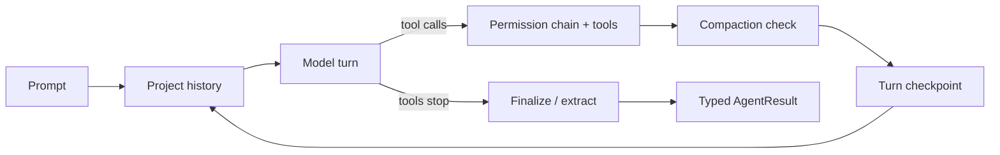

# Agents

An agent in Rulvar is a journaled model-plus-tools loop. You spawn one with `ctx.agent(prompt, opts)` inside a [workflow](/guide/workflows), or the dynamic orchestrator spawns one for you through its `spawn_agent` tool. Either way the same Agent Runtime runs the loop: it resolves the model per invocation role, projects the conversation into the target provider's wire view, executes tool calls through the permission chain, checkpoints every turn boundary, and lands a typed result. Every model turn is paid at most once; that is the never-pay-twice invariant, enforced by the [journal](/guide/journal), not by your code.

## Defining agents

An agent is defined per call: a prompt plus options. Reusable defaults live in an `AgentProfile`, a named bundle of per-spawn defaults registered per engine under `defaults.profiles` and selected by `AgentOpts.agentType`:

```ts
import { createEngine } from '@rulvar/core';
import { anthropic } from '@rulvar/anthropic';
import { openai } from '@rulvar/openai';

const engine = createEngine({
  adapters: [anthropic(), openai()],
  defaults: {
    profiles: {
      reviewer: {
        description: 'Reviews a diff and reports concrete risks.',
        model: 'anthropic:claude-sonnet-5',
        routing: { extract: 'openai:gpt-5.4-mini' },
        effort: 'high',
        limits: { maxTurns: 12 },
        estCost: 0.4,
      },
    },
  },
});
```

| Profile field | What it defaults |
|---|---|
| `model` | The model for all roles of this agent; a `ModelRef` like `'anthropic:claude-sonnet-5'`, a `ModelChoice`, or a ladder. |
| `routing` | Per-role model overrides, keyed by any of the seven [invocation roles](#invocation-roles). |
| `effort` | Canonical reasoning effort: `low`, `medium`, `high`, `xhigh`, or `max`. |
| `tools` | The default toolset: `ToolDef` values, tool sources, or registered toolset names from `defaults.toolsets` ([tools guide](/guide/tools#attaching-tools-to-agents)). |
| `limits` | `UsageLimits` merged below per-call limits and above engine defaults. |
| `retry` | Transport `RetryPolicy`; runs under the journal, so a retried-then-successful call is one entry. |
| `permissions`, `isolation` | Tool permission layers and worktree isolation defaults ([tools guide](/guide/tools)). |
| `escalation` | Opt-in escalation config; without it the `escalated` status is unproducible. |
| `compaction` | Per-profile compaction threshold; default 0.8 of the loop model's context window. |
| `taskClass`, `estCost` | Model-knowledge bridge and the admission reserve hint in USD. |

Two rules keep profiles predictable. A profile never carries a prompt or a schema; both are strictly per call. And profiles are data, registered per engine (there is no global registry), so `engine.profileCard()` can render them into a deterministic vocabulary card: the same text teaches the planner in planned mode and populates the `spawn_agent` enum in orchestrator mode.

## Spawning agents from workflows

`ctx.agent` is the workflow-side entry point:

```ts
import { defineWorkflow } from '@rulvar/core';

interface Verdict {
  risks: string[];
  approve: boolean;
}

const reviewPr = defineWorkflow(
  { name: 'review-pr' },
  async (ctx, args: { diff: string }) => {
    const verdict = await ctx.agent(`Review this diff and list the risks:\n${args.diff}`, {
      agentType: 'reviewer',
      schema: {
        jsonSchema: {
          type: 'object',
          properties: {
            risks: { type: 'array', items: { type: 'string' } },
            approve: { type: 'boolean' },
          },
          required: ['risks', 'approve'],
          additionalProperties: false,
        },
        validate: (v): v is Verdict => typeof v === 'object' && v !== null,
      },
    });
    return verdict; // typed as Verdict
  },
);

const handle = engine.run(reviewPr, { diff: myDiffText }, { budgetUsd: 5 });
const outcome = await handle.result;
```

The options split into two groups, and the split is what makes replay stable:

- **Identity fields** enter the entry's content key: the prompt, `agentType`, the requested model spec including canonical `effort`, `schema`, `tools`, and `isolation`. The explicit `key` discriminator, when set, replaces the prompt in the content key, so the prompt bears identity only when no `key` is given. Change any identity field and the call is new work.
- **Policy and telemetry fields** never re-key entries: `onError`, `retry`, `fallback`, `replay`, `memoizeOutcome`, `limits`, `estCost`, `result`, `label`, `stream`. You can tighten a retry policy or rename a label between resumes without re-paying a single paid call.

By default the call resolves with the typed value and throws a typed `AgentError` on failure. Pass `result: 'full'` to receive the complete `AgentResult` for every terminal status and branch yourself:

```ts
const r = await ctx.agent('Summarize the changelog since v1.0', {
  agentType: 'reviewer',
  result: 'full',
});

if (r.status === 'ok') {
  console.log(r.output, r.costUsd, r.turns, r.servedBy);
} else if (r.status === 'limit') {
  // Paid partial work stays addressable: r.transcriptRef, r.usage
}
```

| Status | Meaning |
|---|---|
| `ok` | The loop finished and the output validated. |
| `error` | Typed failure (`transport`, `rate-limit`, `schema-mismatch`, `tool`, `budget`, `terminal`). Under the default `onError: 'throw'` the value form rejects; under `'null'` it resolves `null` and the loss is recorded in `run.dropped`, never silently. |
| `limit` | A `UsageLimits` cap expired (turns, tool calls, wall clock, no-progress), or the turn was cut at its output token allowance with nothing visible ([output truncation](#output-truncation)). Partial work is paid and kept. |
| `cancelled` | Host cancellation or sibling abort; always reruns on resume. |
| `skipped` | Derived during replay of abandoned branches; only observable through `result: 'full'` or settled `ctx.parallel` branches. |
| `escalated` | The child filed a typed escalation report; requires the `escalation` opt-in and is never an error. |

Beyond the configured policy the runtime never throws: failures become typed statuses. The one uniform exception is `BudgetExhaustedError`, which every ctx primitive throws at the run ceiling ([budgets](/guide/budgets)).

## The agent loop and turns

A **turn** is one model invocation cycle: one assistant response together with its tool calls. The loop repeats turns while the model keeps calling tools, then produces the final output:



### Invocation roles

Every model invocation in a run carries exactly one invocation role, and each stage of an agent's life resolves its model through its role, so one agent can mix models per stage. This table is the complete `InvocationRole` union, four worker-stage roles plus three control-plane roles, and a docs check fails CI when a new role appears in core without a row here:

| Role | Belongs to | Fires |
|---|---|---|
| `loop` | Worker-agent execution | Every turn while tools are available to the model. |
| `extract` | Worker-agent execution | A separate final structured-output call, only when a schema is set and the loop turn cannot carry it (see below). |
| `finalize` | Worker-agent execution | Only if configured in routing: after tools stop, one synthesis call with tool choice `none` over the full transcript. |
| `summarize` | Worker-agent execution | At the compaction threshold, and for `ctx.brief`. |
| `plan` | The [planner](/guide/planner) | Each turn of the planning conversation that writes a frozen script; never during the planned run itself. |
| `orchestrate` | The [dynamic orchestrator](/guide/adaptive-orchestration) | Every turn of the orchestrator agent, which is an ordinary agent whose toolset spawns other agents ([below](#agents-under-the-dynamic-orchestrator)). |
| `synthesize` | The [dynamic orchestrator](/guide/adaptive-orchestration) | Only when `OrchestrateOptions.synthesis` is configured: one fresh post-fan-in invocation that composes the final run result from the coordination draft and the settled child digest ([orchestration modes](/guide/orchestration-modes#the-synthesis-invocation)). The routing key picks its model and never summons it. |

Four boundaries keep this taxonomy honest. `agentType` is the name of a registered `AgentProfile`, and the registry is yours: it is an open namespace, not a built-in catalog of agent kinds. An [eval judge](/guide/evals) is an ordinary agent invocation on the same engine, not an eighth role. Reviewer, critic, and panel members are likewise profiles or [recipes](/guide/examples), never roles. And human-written workflows, the planner, and the dynamic orchestrator are the three control-flow authoring modes from [orchestration modes](/guide/orchestration-modes); modes decide who writes the control flow, roles label the model invocations it makes.

Turns are bounded by `UsageLimits`, merged per spawn (call over profile over engine): `maxTurns` (default 32), `maxToolCalls`, `maxOutputTokensPerTurn`, `timeoutMs`, and the no-progress detector (default 3 consecutive turns without tool calls or artifact deltas). Expiry of any of these lands the terminal status `limit`, with the paid partial work kept. `streamIdleTimeoutMs` (default 120000) is different: a stalled stream is severed and surfaces as a retryable transport error under the retry policy, not as `limit`. Five further opt-in fields (`toolBudgetNotices`, `maxRepeatedToolSignature`, `maxNoNewEvidenceCalls`, `maxCallsPerTool`, `toolUnits`) guard how the tool budget is spent; see [exploration guards](#exploration-guards).

Every layer is validated at its intake (`createEngine`, the profile registry, `engine.run`, the call options) with a typed `ConfigError`, so a malformed field never reaches a merge or a provider: counts are positive integers (`maxToolCalls` may be 0, a spawn that must not call tools), `timeoutMs` is a positive integer with no upper bound (a wall-clock comparison, not a timer), and `streamIdleTimeoutMs` must be an integer between 1 and 2147483647 ms, the Node timer maximum, mirroring the retry policy bound. `validateUsageLimits(limits, site)` is exported for hosts that want the same check at their own intake, for example an HTTP boundary.

Tools can also ask the model to try again: throwing `ModelRetry` from a tool's `execute` converts into an error-flagged tool result the model sees and can self-correct from, bounded to 2 attempts per call chain by default. See the [tools guide](/guide/tools).

## Exploration guards

A hard `maxToolCalls` bounds spend, but it cannot see how the budget is spent: an agent that repeats the byte-identical search, or keeps re-reading pages it has already seen, burns the whole allowance and dies as a bare `limit` with nothing to distinguish oscillation from honest work. The no-progress detector never helps here, because tool calls reset it. Five opt-in `UsageLimits` fields make how the budget is spent visible and boundable; all of them merge and validate like every other limit, and an invocation that configures none of them behaves byte-identically to before.

- `toolBudgetNotices: true` surfaces soft 50% and 80% thresholds over `maxToolCalls` to the model as a plain user message with the exact counts (`Tool budget notice: 5 of 10 tool calls used; 5 remaining. ...`), so the model can pace itself before the hard cap. Each threshold fires once; a turn that crosses both produces a single message with the final counts. The notice is part of the conversation: it rides checkpoints and transcripts, so a resume never re-fires a threshold, and enabling the flag changes the requests a recorded cassette would match. Without `maxToolCalls` the flag is inert and says so with a `log` warning.
- `maxRepeatedToolSignature: N` caps how many times the same signature (tool name plus RFC 8785 canonical args, so key order does not matter) may execute per invocation. The call that would exceed it is never dispatched: the model receives an error tool result naming the count and the limit, the denial does not consume `maxToolCalls`, and the `tool:end` event carries `outcome: 'denied'` with `guard: 'repeated-signature'`. The loop continues; a model that keeps issuing the denied call is still bounded by `maxTurns`.
- `maxNoNewEvidenceCalls: N` trips when N consecutive successful executions return only already-seen result digests (duplicate-page detection over the canonical serialization of results). The invocation aborts as status `limit` with `abortClass: 'exploration'`; the executed work is kept, the terminal memoizes like the other engine-decided aborts, and the abort message names the guard and this section. Error results neither lengthen nor reset the chain (repeated failing calls are the signature guard's job), and a result that cannot be canonically serialized counts as fresh evidence, so the guard fails open, never spuriously.
- `maxCallsPerTool: { name: cap }` bounds each tool by NAME instead of only the total: `{ read_file: 30, search_files: 20 }` lets reads dominate without letting them run away. The call that would exceed its tool's cap is denied exactly like the signature guard (an error tool result naming the guard, `tool:end` with `guard: 'per-tool-cap'`, no budget or unit consumed); a cap of `0` bans the tool for the invocation, and names absent from the record are unlimited. Per layer the whole record replaces, like every other `UsageLimits` field.
- `toolUnits: { max, costs? }` is the weighted tool budget: every EXECUTED call of tool T costs `costs[T] ?? 1` units (a cost of `0` makes bookkeeping tools such as `record_evidence` or `report_progress` free), and once the spent units reach `max` the invocation terminates as a plain `limit` exactly like `maxToolCalls`, paid partial work kept. Denied calls cost nothing. On resume the spent units rebuild from the restored transcript's successful executions, the same conservative window the other guards use.

Whenever any of these fields is configured, the full `AgentResult` (and the live `agent:end` event) carries `exploration`: `{ toolCallsUsed, distinctSignatures, repeatedCalls, duplicateResultCalls, deniedRepeats, byTool }`, plus `deniedToolCap` when `maxCallsPerTool` is set and `toolUnitsUsed` when `toolUnits` is set. The plan-level acceptance gate for research agents (repeated search/read at most 10% of calls) is computable from these counters, and the [benchmark kit](/guide/evals#the-benchmark-kit) can extract them per run through its metric extractors. For an invocation the guard merely observed the summary is live telemetry, exactly like `transportRetries`; only the guard's own abort journals it (inside the terminal error payload, beside `abortClass`), so a replayed guard abort reports the same typed evidence with zero live calls. On a mid-run resume the guard rebuilds its state from the restored checkpoint messages, counting the successful executions the surviving history still shows, which is the same window the model itself sees after a compaction.

## Output truncation

A schema-less turn (no schema, no required terminal tool) whose provider completion ends with finish reason `max-tokens` and no visible text settles `limit` with `abortClass: 'output-truncated'`, never `ok` with an empty value. An empty truncated turn usually means the whole allowance went to reasoning: high-effort adaptive thinking shares the output-token allowance with the visible answer. When a `finalize` role is routed the check moves to the synthesis invocation, because its text, not the loop turn's, is the schema-less answer. A max-tokens turn **with** visible text still settles `ok` and keeps the partial text.

The effective cap can come from `limits.maxOutputTokensPerTurn`, from the budget clamp (the remaining budget affords fewer tokens than requested), or from the adapter's own default. Recovery is explicit, never automatic: raise `maxOutputTokensPerTurn`, reduce the reasoning `effort`, or free budget. A configured `fallback: { model, on: ['limit'] }` composes as the one explicit second attempt, and in plan mode an escalation ladder rung on `limit` does the same.

Like the no-progress abort, the truncation memoizes: the engine stamps `memoizeOutcome` on the terminal entry, so every resume replays the typed outcome with zero provider calls and the paid work is never re-paid. Limits are not part of agent identity, so re-running the same prompt on the same store after raising the limit still replays the memoized abort. To actually retry, unpin the entry with resume's `invalidate` knob ([durability](/guide/durability)), use a fresh store or run id, or change the prompt.

## Model preferences

Model resolution runs on every model invocation, not once per agent: a layered merge in the order call override, agent profile, workflow defaults, engine defaults, with the invocation role attached. `AgentOpts.model` overrides all roles at once; `AgentOpts.routing` overrides per role and wins over `profile.routing`. Role effort defaults fill gaps: `orchestrate` and `plan` default to `high`, `summarize` and `extract` to `low`; `loop`, `finalize`, and `synthesize` have no default, so the provider default applies when nothing resolves one.

After resolution the router reads the model's capabilities and scrubs illegal parameters visibly (a warning event, never a silent translation), and hard per-role quality floors from engine config can allowlist or denylist models for critical roles. The full chain, failover, and pricing live in [model routing](/guide/model-routing).

## Structured output tiers and the bounded re-prompt

`schema` accepts three forms: a Standard Schema (Zod, ArkType, Valibot, ...), an explicit `{ jsonSchema, validate }` pair, or a bare JSON Schema literal. The first two give you a typed return; the bare literal types as `unknown`.

How the schema reaches the model depends on the target model's capabilities. The router selects one of three tiers:

| Tier | Mechanism |
|---|---|
| `native` | The provider's native JSON schema output. Requires a strict-compatible schema (every object closed with `additionalProperties: false` and full `required`); otherwise degrades to `forced-tool`. |
| `forced-tool` | A synthesized `emit_result` tool with tool choice pinned to it. |
| `prompt` | The schema is injected into the last user message. |

`native` and `prompt` ride the last loop turn with no extra call. `forced-tool` pins the tool choice and therefore cannot ride a turn on which the agent's tools must remain available, so a separate `extract` invocation fires. The separate extract also fires when routing sends `extract` to a different model, or when `finalize` is routed (the structured output then runs over the full transcript including the synthesis).

When the model's answer fails validation, the runtime sends a bounded re-prompt carrying the concrete validation issues, 2 attempts by default. Exhaustion is a typed `AgentError` of kind `schema-mismatch`; there is never a silent cast. If you want a stronger model to take one second attempt after exhaustion, declare it as the degenerate fallback:

```ts
const data = await ctx.agent('Extract the verdict from the review above.', {
  agentType: 'reviewer',
  schema: verdictSchema, // any of the three schema forms
  fallback: { model: 'anthropic:claude-fable-5', on: ['schema-exhausted'] },
});
```

The fallback is an agent-level second attempt with a new content key and exactly one journaled decision entry, distinct from transport failover, which never changes the content key at all.

## Turn-boundary checkpoints

At every turn boundary the runtime writes a checkpoint: the canonical history up to the boundary, turns already paid, accumulated usage, tool calls used, schema attempts, compaction points, and any approval that is holding the turn open. This is the `CheckpointState` blob, stored next to the agent's two-phase journal entry.

Under a durable journal store this buys you mid-agent crash recovery: a run that dies at turn 7 of a 12-turn agent resumes at turn 7, not turn 1. On resume, the journal replays completed entries for free, finds the dangling dispatch, decodes its checkpoint, and continues the same turn; the paid prefix of the loop is never re-bought. A checkpoint that cannot be parsed is never trusted: the dispatch reruns from the top, which is the documented at-least-once floor.

The default `InMemoryStore` disables resume with a loud warning; wire a durable store for anything you care about. See [durability](/guide/durability) and [stores](/guide/stores).

## Cross-provider history correctness

The runtime keeps one canonical conversation history and projects it per request. Three mechanisms make that projection correct across providers:

- **Canonical tool-call ids.** The library, not the provider, mints tool-call ids. Each adapter keeps a bijective map between canonical ids and its wire ids, so a history that has touched two providers never leaks one provider's id format into the other's request.
- **Provider-raw retention.** Opaque provider blocks that must survive round trips (thinking blocks with signatures, encrypted reasoning items) are retained in canonical history unconditionally as provider-raw parts.
- **The projection rule.** On projection, a provider-raw part is included exactly when the target model's provider family matches the part's provider; other providers' raw parts are omitted from the projection, never from retention.

This is the HistoryProjector, and it runs on every outgoing request, loop turns included. It is what makes per-role provider mixing inside one agent correct: the loop can run on Anthropic while `extract` runs on OpenAI, and each request sees a valid wire history. The same property keeps a checkpointed or failover-mixed history valid on any target after resume. The projection itself is exposed as a pure function:

```ts
import { projectHistory } from '@rulvar/core';

const anthropicView = projectHistory(messages, 'anthropic');
```

Adapter-side details live in the [providers guide](/guide/providers).

## Compaction

Long tool loops outgrow context windows, so compaction is on by default for every agent. At each tool turn boundary, before the checkpoint, the runtime estimates the context as the last loop turn's input plus output tokens and compares it against the threshold (default 0.8 of the loop model's context window; per-profile override via `compaction.threshold`). Over the threshold it runs a summarize invocation under role `summarize` (resolved through the ordinary chain, falling back to the loop model), then replaces everything after the first message with one user-role summary message.

Compaction is durable by construction: it happens before the boundary checkpoint, so a crash after compaction resumes compact, and the checkpoint records the turns at which compaction fired, so a resumed run never re-summarizes already-compacted history. A failed or empty summarize disables compaction for the rest of the run with a warning rather than looping.

## Approval suspensions

A tool whose permission verdict is `ask` does not fail and does not proceed: the agent suspends mid-turn. The runtime writes the turn checkpoint with the pending tool state, journals a suspended approval entry, and parks. When every in-flight branch of a run is blocked this way, the run completes with status `suspended` and the outcome lists the open keys:

```ts
import { tool, defineWorkflow } from '@rulvar/core';

const deployTool = tool({
  name: 'deploy_service',
  description: 'Deploys a service to production.',
  parameters: {
    type: 'object',
    properties: { service: { type: 'string' } },
    required: ['service'],
    additionalProperties: false,
  },
  needsApproval: true,
  execute: async (input) => ({ deployed: true, input }),
});

const release = defineWorkflow({ name: 'release' }, async (ctx) => {
  return ctx.agent('Deploy the api service if the checks pass.', {
    tools: [deployTool],
  });
});

const handle = engine.run(release, undefined, { budgetUsd: 3 });
const outcome = await handle.result;

if (outcome.status === 'suspended') {
  for (const pending of outcome.pending) {
    await handle.resolveExternal(pending.key, { decision: 'allow' });
  }
  const resumed = engine.resume(handle.runId, release);
  console.log(await resumed.result);
}
```

Approvals never fail open: any resolution that is not an explicit allow is a deny. On resume the agent continues the same turn from its checkpoint, without re-paying turns and without re-running tools that already ran; an approval resolved while the process was down applies immediately and is never re-suspended. Resolutions can arrive through `RunHandle.resolveExternal`, the HTTP server shell, or the CLI. The permission chain that produces `allow`, `deny`, and `ask` verdicts is documented in the [tools guide](/guide/tools).

## Agent-as-tool: the single cross-agent primitive

Rulvar has exactly one way for agents to interact: invoke a specialist and return its result. That is agent-as-tool, and it is a load-bearing design decision, not a missing feature. Handoffs, chat rooms, blackboard coordination, and emergent topologies are rejected because they destroy budget attribution (whose sub-account paid for that message?) and scope identity (which call site does this work replay under?).

Call-and-return composition takes three shapes, all journaled the same way:

- `ctx.agent(prompt, opts)` spawns a specialist and returns its typed result.
- `ctx.workflow(child, args)` runs a whole child workflow under a nested journal scope and a hierarchical budget sub-account whose spend propagates to every ancestor.
- `spawn_agent` inside the dynamic orchestrator spawns by profile name and returns a handle; the child's result digest is delivered through `await_any` or `await_all`.

Because every cross-agent edge is a call with a typed result, cost folds cleanly up the account tree and every piece of work has one address in the journal.

## Agents under the dynamic orchestrator

The dynamic orchestrator is itself an ordinary agent, running under role `orchestrate`, whose toolset happens to spawn other agents:

```ts
import { orchestrate } from '@rulvar/core';

const handle = orchestrate(
  engine,
  'Audit the billing module and summarize the risks',
  { profiles: ['reviewer', 'researcher'], maxSpawns: 24 },
  { budgetUsd: 10 },
);
const outcome = await handle.result;
```

The optional fourth argument is the run's ordinary `RunOptions`: `budgetUsd` there is the root hard ceiling over the whole tree (see [budgets](/guide/budgets)); without it the run starts uncapped.

Its typed spawn tools are the whole cross-agent surface of mode (c):

| Tool | Purpose |
|---|---|
| `spawn_agent` | Spawn one child by `agentType` with a prompt; returns a handle. |
| `parallel_agents` | Spawn several children at once. |
| `await_any` / `await_all` | Block on in-flight handles; deliver per-child digests. |
| `cancel_agent` | Cancel an in-flight child. |
| `wait_for_events` | Sleep until a coalesced wake digest: quiescence (always armed), child terminal, escalation, or a budget threshold; a trigger set that can never fire is a typed error. |
| `finish` | Terminal: deliver the final result. |

The `spawn_agent` vocabulary is the profile card: the orchestrator picks a registered `agentType`, never a raw model name. When a profile declares a model ladder, the orchestrator may pass `model_hint.startTier`, clamped to the declared ladder; naming models stays a host decision.

Two execution properties matter for durability. Orchestrator turns are checkpointed mandatorily at every turn boundary. And every spawn is an ordinary agent journal entry whose handle is a journal-derived stable id, so a crashed orchestrator resumes by restoring its own history from the checkpoint and finding child results by content keys, without regenerating spawn decisions and without re-paying children. The orchestrator also runs under its own capped budget sub-account (default 0.2 of the run ceiling) with a protected finalize reserve, so it can always afford to call `finish`; see [budgets](/guide/budgets).

Nested use is the same machinery: `ctx.orchestrate(goal, opts)` runs the identical implementation under the admission controller, clamped by the parent's budget. The opt-in adaptive extension (plan revision, wake digests, escalation) is covered in [adaptive orchestration](/guide/adaptive-orchestration), and the three modes are compared in [orchestration modes](/guide/orchestration-modes).

## Next steps

- [Tools](/guide/tools): defining typed tools, the permission chain, isolation.
- [Model routing](/guide/model-routing): the resolution chain, failover, pricing, quality floors.
- [Journal](/guide/journal): content keys, replay, and why identity fields re-key entries.
- [Durability](/guide/durability): stores, resume semantics, and queue workers.
- [API reference for @rulvar/core](/api/@rulvar/core/): every symbol on this page.
