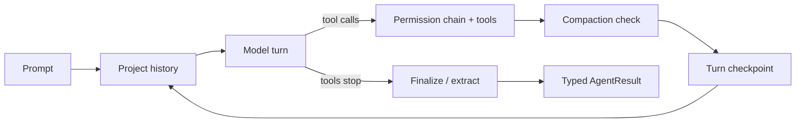

# Agents

An agent in Rulvar is a journaled model-plus-tools loop. You spawn one with `ctx.agent(prompt, opts)` inside a [workflow](/guide/workflows), or the dynamic orchestrator spawns one for you through its `spawn_agent` tool. Either way the same Agent Runtime runs the loop: it resolves the model per invocation role, projects the conversation into the target provider's wire view, executes tool calls through the permission chain, checkpoints every turn boundary, and lands a typed result. Every checkpointed turn is paid at most once; that is the never-pay-twice invariant, enforced by the [journal](/guide/journal), not by your code. The bound is exact rather than absolute: dispatch is at-least-once, and a crash inside a turn repays that one partial turn on resume, the worst case [durability](/guide/durability) documents.

## Defining agents

An agent is defined per call: a prompt plus options. Reusable defaults live in an `AgentProfile`, a named bundle of per-spawn defaults registered per engine under `defaults.profiles` and selected by `AgentOpts.agentType`:

```ts
import { createEngine } from '@rulvar/core';
import { anthropic } from '@rulvar/anthropic';
import { openai } from '@rulvar/openai';

const engine = createEngine({
  adapters: [anthropic(), openai()],
  defaults: {
    profiles: {
      reviewer: {
        description: 'Reviews a diff and reports concrete risks.',
        model: 'anthropic:claude-sonnet-5',
        routing: { extract: 'openai:gpt-5.4-mini' },
        effort: 'high',
        limits: { maxTurns: 12 },
        estCost: 0.4,
      },
    },
  },
});
```

| Profile field | What it defaults |
|---|---|
| `model` | The model for all roles of this agent; a `ModelRef` like `'anthropic:claude-sonnet-5'`, a `ModelChoice`, or a ladder. |
| `routing` | Per-role model overrides, keyed by any of the <!-- roles:count -->seven<!-- /roles --> [invocation roles](#invocation-roles). |
| `effort` | Canonical reasoning effort: `low`, `medium`, `high`, `xhigh`, or `max`. |
| `tools` | The default toolset: `ToolDef` values, tool sources, or registered toolset names from `defaults.toolsets` ([tools guide](/guide/tools#attaching-tools-to-agents)). |
| `limits` | `UsageLimits` merged below per-call limits and above engine defaults. |
| `retry` | Transport `RetryPolicy`; runs under the journal, so a retried-then-successful call is one entry. |
| `permissions`, `isolation` | Tool permission layers and worktree isolation defaults ([tools guide](/guide/tools)). |
| `escalation` | Opt-in escalation config; without it the `escalated` status is unproducible. |
| `compaction` | Per-profile compaction threshold; default 0.8 of the loop model's context window. |
| `taskClass`, `estCost` | Model-knowledge bridge and the admission reserve hint in USD. |

Two rules keep profiles predictable. A profile never carries a prompt or a schema; both are strictly per call. And profiles are data, registered per engine (there is no global registry), so `engine.profileCard()` can render them into a deterministic vocabulary card: the same text teaches the planner in planned mode and populates the `spawn_agent` enum in orchestrator mode.

## Spawning agents from workflows

`ctx.agent` is the workflow-side entry point:

```ts
import { defineWorkflow } from '@rulvar/core';

interface Verdict {
  risks: string[];
  approve: boolean;
}

const reviewPr = defineWorkflow(
  { name: 'review-pr' },
  async (ctx, args: { diff: string }) => {
    const verdict = await ctx.agent(`Review this diff and list the risks:\n${args.diff}`, {
      agentType: 'reviewer',
      schema: {
        jsonSchema: {
          type: 'object',
          properties: {
            risks: { type: 'array', items: { type: 'string' } },
            approve: { type: 'boolean' },
          },
          required: ['risks', 'approve'],
          additionalProperties: false,
        },
        validate: (v): v is Verdict => typeof v === 'object' && v !== null,
      },
    });
    return verdict; // typed as Verdict
  },
);

const handle = engine.run(reviewPr, { diff: myDiffText }, { budgetUsd: 5 });
const outcome = await handle.result;
```

The options split into two groups, and the split is what makes replay stable:

- **Identity fields** enter the entry's content key: the prompt, `agentType`, the requested model spec including canonical `effort`, `schema`, `tools`, and `isolation`. The explicit `key` discriminator, when set, replaces the prompt in the content key, so the prompt bears identity only when no `key` is given. Change any identity field and the call is new work.
- **Policy and telemetry fields** never re-key entries: `onError`, `retry`, `fallback`, `replay`, `memoizeOutcome`, `limits`, `estCost`, `result`, `label`, `stream`. You can tighten a retry policy or rename a label between resumes without re-paying a single paid call.

By default the call resolves with the typed value and throws a typed `AgentError` on failure. Pass `result: 'full'` to receive the complete `AgentResult` for every terminal status and branch yourself:

```ts
const r = await ctx.agent('Summarize the changelog since v1.0', {
  agentType: 'reviewer',
  result: 'full',
});

if (r.status === 'ok') {
  console.log(r.output, r.costUsd, r.turns, r.servedBy);
} else if (r.status === 'limit') {
  // Paid partial work stays addressable: r.transcriptRef, r.usage
}
```

| Status | Meaning |
|---|---|
| `ok` | The loop finished and the output validated. |
| `error` | Typed failure (`transport`, `rate-limit`, `schema-mismatch`, `tool`, `budget`, `terminal`). Under the default `onError: 'throw'` the value form rejects; under `'null'` it resolves `null` and the loss is recorded in `run.dropped`, never silently. |
| `limit` | A `UsageLimits` cap expired (turns, tool calls, wall clock, no-progress), or the turn was cut at its output token allowance with nothing visible ([output truncation](#output-truncation)). Partial work is paid and kept. |
| `cancelled` | Host cancellation or sibling abort; always reruns on resume. |
| `skipped` | Derived during replay of abandoned branches; only observable through `result: 'full'` or settled `ctx.parallel` branches. |
| `escalated` | The child filed a typed escalation report; requires the `escalation` opt-in and is never an error. |

Beyond the configured policy the runtime never throws: failures become typed statuses. The one uniform exception is `BudgetExhaustedError`, which every ctx primitive throws at the run ceiling ([budgets](/guide/budgets)).

## The agent loop and turns

A **turn** is one model invocation cycle: one assistant response together with its tool calls. The loop repeats turns while the model keeps calling tools, then produces the final output:


```mermaid
flowchart LR
    A[Prompt] --> B[Project history]
    B --> C[Model turn]
    C -->|tool calls| D[Permission chain + tools]
    D --> E[Compaction check]
    E --> F[Turn checkpoint]
    F --> B
    C -->|tools stop| G[Finalize / extract]
    G --> H[Typed AgentResult]
```

Tool arguments face the tool's schema before anything executes; a failure returns to the model as an error tool result naming the issues, never a throw. One class gets a deterministic second chance first (the v1.74 comparison review): when an adapter's single strict `JSON.parse` rejects the arguments string, the shipped wires (both first class adapters and the AI SDK bridge) deliver it wrapped as `{__unparsed: raw}`, and before rejecting on schema the loop re-parses the raw string strictly and then through one bounded normalization pass (a markdown fence stripped, the first balanced top-level object kept, raw control characters escaped inside string literals; models writing markdown documents into arguments emit real newlines, which strict JSON forbids). A recovered object still faces the tool schema, executes as if it had parsed on the wire, and emits a warn log naming the pass; anything unrecoverable (a true truncation, an imitated wrapper) keeps the exact old error result. The pass is a pure function of the durable arguments, so replay and resume recover identically and nothing journals; a schema that legitimately accepts the wrapper shape validates first and is never rewritten. On re-projection the OpenAI wire and the AI SDK bridge show the model the ORIGINAL raw string it wrote, not the internal wrapper, so a model can no longer learn to imitate `{"__unparsed": ...}` from its own rewritten history. The exchanges that still die at the gate are counted when the invocation carries a terminal tool (v1.77): the full `AgentResult` reports `schemaRejectedTerminalExchanges` (absent when zero), derived from the message window exactly like the repair-reserve grants so live and resumed segments agree, and an [orchestration folds both windows](/guide/orchestration-modes#the-synthesis-invocation) into the `schemaRejectedFinishExchanges` field of its typed failures. The recovered exchanges are durable too (v1.81): `schemaRecoveredTerminalExchanges` counts the terminal calls the second chance salvaged, a live process counter like `transportRetries` (a resumed segment counts only its own recoveries, and nothing downstream feeds on it), folded by orchestrations into `schemaRecoveredFinishExchanges` on the ok envelope and the failure data.

### Invocation roles

Every model invocation in a run carries exactly one invocation role, and each stage of an agent's life resolves its model through its role, so one agent can mix models per stage. This table is the complete `InvocationRole` union, four worker-stage roles plus three control-plane roles, and a docs check fails CI when a new role appears in core without a row here:

| Role | Belongs to | Fires |
|---|---|---|
| `loop` | Worker-agent execution | Every turn while tools are available to the model. |
| `extract` | Worker-agent execution | A separate final structured-output call, only when a schema is set and the loop turn cannot carry it (see below). |
| `finalize` | Worker-agent execution | Only if configured in routing: after tools stop, one synthesis call with tool choice `none` over the full transcript. |
| `summarize` | Worker-agent execution | At the compaction threshold, and for `ctx.brief`. |
| `plan` | The [planner](/guide/planner) | Each turn of the planning conversation that writes a frozen script; never during the planned run itself. |
| `orchestrate` | The [dynamic orchestrator](/guide/adaptive-orchestration) | Every turn of the orchestrator agent, which is an ordinary agent whose toolset spawns other agents ([below](#agents-under-the-dynamic-orchestrator)). |
| `synthesize` | The [dynamic orchestrator](/guide/adaptive-orchestration) | Only when `OrchestrateOptions.synthesis` is configured: one fresh post-fan-in invocation that composes the final run result from the coordination draft and the settled child digest ([orchestration modes](/guide/orchestration-modes#the-synthesis-invocation)). The routing key picks its model and never summons it. |

The `finalize` invocation can additionally carry the run's own observed evidence (RV709): the opt-in `policyFacts: true` on `runAgent` prepends ONE request-only user message before the synthesis instruction, a deterministic digest of what the loop lived through, quota denials and recoveries (when a limiter is wired), tool budget pressure (`used of cap`, extension grants when the extension is configured), whether the finalization window entered (when one is configured), and the recorded spend with its cost basis (an `aggregate-estimate` basis names itself an estimate). A live run's final answer used to underclaim exactly these facts because the model composing it never saw them. Line inclusion follows configuration, so the digest shape is stable per config and only the numbers move; like the instruction itself it exists only on the wire, never in the durable transcript, never in spawn identity, and the finalize request stays byte identical when unset. The dynamic orchestrator has the symmetric opt-in for its synthesis invocation, `synthesis.policyFacts` ([orchestration modes](/guide/orchestration-modes#the-synthesis-invocation)), folded there from replay-stable settled child facts only.

Four boundaries keep this taxonomy honest. `agentType` is the name of a registered `AgentProfile`, and the registry is yours: it is an open namespace, not a built-in catalog of agent kinds. An [eval judge](/guide/evals) is an ordinary agent invocation on the same engine, not an eighth role. Reviewer, critic, and panel members are likewise profiles or [recipes](/guide/examples), never roles. And human-written workflows, the planner, and the dynamic orchestrator are the three control-flow authoring modes from [orchestration modes](/guide/orchestration-modes); modes decide who writes the control flow, roles label the model invocations it makes.

Turns are bounded by `UsageLimits`, merged per spawn (call over profile over engine): `maxTurns` (default 32), `maxToolCalls`, `maxOutputTokensPerTurn`, `timeoutMs`, and the no-progress detector (default 3 consecutive turns without tool calls or artifact deltas). Expiry of any of these lands the terminal status `limit`, with the paid partial work kept. The orchestration `finish` tool is exempt from the tool budget in both directions (v1.79): a terminal call never consumes `maxToolCalls` or `toolUnits`, and an exhausted budget does not block it either; the call is admitted, validated, and on rejection repairable exactly as below the cap, while non-terminal calls in the same batch stay cut, each answered with a typed skipped result. An agent that spent its whole budget gathering evidence can therefore still deliver (and repair) its final answer; the fifth comparison experiment lost a complete 3984 word answer to exactly this starvation. `streamIdleTimeoutMs` (default 120000) is different: a stalled stream is severed and surfaces as a retryable transport error under the retry policy, not as `limit`. Five further opt-in fields (`toolBudgetNotices`, `maxRepeatedToolSignature`, `maxNoNewEvidenceCalls`, `maxCallsPerTool`, `toolUnits`) guard how the tool budget is spent; see [exploration guards](#exploration-guards). A sixth, `finalizationReserve`, guarantees the model one summary turn when the tool budget expires; see [the finalization reserve](#the-finalization-reserve). A seventh, `toolBudgetExtension`, converts remaining budget headroom into more tool calls at the expiry instead of settling `limit`; see [the tool budget extension](#the-tool-budget-extension). An eighth, `finalizationWindow`, reserves the last calls of the budget for bookkeeping tools so evidence is recorded before the cap, not mourned after it; see [the finalization window](#the-finalization-window). A ninth, `checkpointEveryToolCalls`, bounds how much of one parallel tool batch a kill can force a resume to re-pay; see [the mid-batch checkpoint boundary](#the-mid-batch-checkpoint-boundary). A tenth, `finalizationTurns`, extends the finalization-window regime to the turns axis, so a `maxTurns` expiry gets a reserved finalization tail instead of a mid-work cut; see [the finalization window](#the-finalization-window).

Every layer is validated at its intake (`createEngine`, the profile registry, `engine.run`, the call options) with a typed `ConfigError`, so a malformed field never reaches a merge or a provider: counts are positive integers (`maxToolCalls` may be 0, a spawn that must not call tools), `timeoutMs` is a positive integer with no upper bound (a wall-clock comparison, not a timer), and `streamIdleTimeoutMs` must be an integer between 1 and 2147483647 ms, the Node timer maximum, mirroring the retry policy bound. `validateUsageLimits(limits, site)` is exported for hosts that want the same check at their own intake, for example an HTTP boundary.

Tools can also ask the model to try again: throwing `ModelRetry` from a tool's `execute` converts into an error-flagged tool result the model sees and can self-correct from, bounded to 2 attempts per call chain by default. See the [tools guide](/guide/tools).

## Exploration guards

A hard `maxToolCalls` bounds spend, but it cannot see how the budget is spent: an agent that repeats the byte-identical search, or keeps re-reading pages it has already seen, burns the whole allowance and dies as a bare `limit` with nothing to distinguish oscillation from honest work. The no-progress detector never helps here, because tool calls reset it. Five opt-in `UsageLimits` fields make how the budget is spent visible and boundable; all of them merge and validate like every other limit, and an invocation that configures none of them behaves byte-identically to before.

- `toolBudgetNotices: true` surfaces soft 50% and 80% thresholds over `maxToolCalls` to the model as a plain user message with the exact counts (`Tool budget notice: 5 of 10 tool calls used; 5 remaining. ...`), so the model can pace itself before the hard cap. Each threshold fires once; a turn that crosses both produces a single message with the final counts. The notice is part of the conversation: it rides checkpoints and transcripts, so a resume never re-fires a threshold, and enabling the flag changes the requests a recorded cassette would match. Without `maxToolCalls` the flag is inert and says so with a `log` warning.
- `maxRepeatedToolSignature: N` caps how many times the same signature (tool name plus RFC 8785 canonical args, so key order does not matter) may execute per invocation. The call that would exceed it is never dispatched: the model receives an error tool result naming the count and the limit, the denial does not consume `maxToolCalls`, and the `tool:end` event carries `outcome: 'denied'` with `guard: 'repeated-signature'`. The loop continues; a model that keeps issuing the denied call is still bounded by `maxTurns`.
- `maxNoNewEvidenceCalls: N` trips when N consecutive successful executions return only already-seen result digests (duplicate-page detection over the canonical serialization of results). The invocation aborts as status `limit` with `abortClass: 'exploration'`; the executed work is kept, the terminal memoizes like the other engine-decided aborts, and the abort message names the guard and this section. Error results neither lengthen nor reset the chain (repeated failing calls are the signature guard's job), and a result that cannot be canonically serialized counts as fresh evidence, so the guard fails open, never spuriously.
- `maxCallsPerTool: { name: cap }` bounds each tool by NAME instead of only the total: `{ read_file: 30, search_files: 20 }` lets reads dominate without letting them run away. The call that would exceed its tool's cap is denied exactly like the signature guard (an error tool result naming the guard, `tool:end` with `guard: 'per-tool-cap'`, no budget or unit consumed); a cap of `0` bans the tool for the invocation, and names absent from the record are unlimited. Per layer the whole record replaces, like every other `UsageLimits` field.
- `toolUnits: { max, costs? }` is the weighted tool budget: every EXECUTED call of tool T costs `costs[T] ?? 1` units (a cost of `0` makes bookkeeping tools such as `record_evidence` or `report_progress` free), and once the spent units reach `max` the invocation terminates as a plain `limit` exactly like `maxToolCalls`, paid partial work kept. Denied calls cost nothing. On resume the spent units rebuild from the restored transcript's successful executions, the same conservative window the other guards use.

Whenever any of these fields is configured, the full `AgentResult` (and the live `agent:end` event) carries `exploration`: `{ toolCallsUsed, distinctSignatures, repeatedCalls, duplicateResultCalls, deniedRepeats, byTool }`, plus `deniedToolCap` when `maxCallsPerTool` is set and `toolUnitsUsed` when `toolUnits` is set. The plan-level acceptance gate for research agents (repeated search/read at most 10% of calls) is computable from these counters, and the [benchmark kit](/guide/evals#the-benchmark-kit) can extract them per run through its metric extractors. For an invocation the guard merely observed the summary is live telemetry, exactly like `transportRetries`; only the guard's own abort journals it (inside the terminal error payload, beside `abortClass`), so a replayed guard abort reports the same typed evidence with zero live calls. On a mid-run resume the guard rebuilds its state from the restored checkpoint messages, counting the successful executions the surviving history still shows, which is the same window the model itself sees after a compaction.

## The finalization reserve

A tool budget bounds spend, but its expiry has a sharp edge: when the cap trips inside a tool batch, the remaining non-terminal calls of that batch cannot run (a terminal `finish` in the batch is admitted budget free since v1.79), and by default the invocation settles `limit` immediately, before any further model turn. For a research agent this is the worst ending available: the expensive reads are already paid for, the evidence sits in the transcript, and the final specialist report was never written. The opt-in `limits.finalizationReserve` (an object; `{}` enables it) closes that edge with three guarantees at a `maxToolCalls` or `toolUnits` expiry:

- **The batch tail closes explicitly.** Every call the budget did not admit gets a typed error tool result, `{ error: 'skipped: the tool budget is exhausted; the call was not executed', limiter, skipped: true }`, instead of vanishing. The transcript stays well formed (providers reject tool calls without matching results), and both the model and any transcript reader see exactly which calls never executed.
- **The model always gets one summary turn.** One request on the loop chain (failover and the retry policy included, usage attributed to the loop role) with tools withheld (`toolChoice: 'none'`) and a request-only instruction naming the limiter, its counts, and the skipped calls; the reply is durable, the instruction is not, mirroring the summarize and finalize instructions. `finalizationReserve.maxOutputTokens` bounds this turn alone; absent, the ordinary per-turn output policy applies. The budget still gates the turn: a run at its USD ceiling skips the summary with a `log` warning rather than overspending.
- **The terminal names the exact limiter.** The `limit` result carries `error: { kind: 'terminal' }` and an `errorMessage` such as `tool budget exhausted: maxToolCalls (72/72); skipped tool calls: 3`, so a caller can tell which limiter ended the invocation without diffing configuration.

The summary becomes the limit result's `output` for schema-less agents. When the schema [rides the loop turn](#structured-output-tiers-and-the-bounded-re-prompt), the summary is validated once against it (no re-prompt), and a parsing summary lands as typed output, still under status `limit`; with a separate extract phase routed, the summary stays in the transcript (the [structured terminal partial](/guide/tools#the-progress-contract-and-the-structured-terminal-partial) still derives beside it), so typed output at the limit needs the ride tier. The terminal journals the value, so a replayed or recovered result reads the same final report with zero live calls. Everything else is best effort in the reserve's favor: a transport failure on the summary turn keeps the earned `limit` terminal with a `log` warning, host cancellation and the budget ceiling keep their own semantics, and the reserve fires for the two tool-budget limiters and, since RV2204, for a mid-work exposure drain (a spawned seat refused with no live hold left spends one turn clamped to `finalizationReserve.maxOutputTokens`, the [finalization window](#the-finalization-window) allowlist as its only tools, before its typed `exposure-drained` terminal; a seat with no completed turns keeps dying free), never for `maxTurns`, `timeoutMs`, or the exploration aborts, which keep their existing shapes. An invocation without the field behaves byte-identically to before: the skip results and the instruction enter the conversation, so enabling the reserve changes the requests a recorded cassette would match, exactly like `toolBudgetNotices`. Under an orchestrator, a limit child's validated reserve output surfaces in its digest (`final: {...}`) and through `get_child_result`, and [acceptance can salvage the child by it](/guide/orchestration-modes#partial-child-salvage-and-profile-templates) with `acceptance.acceptValidatedTerminalOutputOnLimit`.

## The tool budget extension

A fixed `maxToolCalls` protects money the run may not need protecting: the seventh comparison experiment starved two of four mandatory workers at a fixed 84-call cap while 38% of the run's USD ceiling sat unspent, and both settled `limit` into salvage. The opt-in `limits.toolBudgetExtension: { increment, maxExtensions, minHeadroomUsd?, requireNewEvidence?, coverEvidenceDeficit? }` closes that gap at the expiry itself: instead of ending the invocation, the runtime grants `increment` more executed calls, up to `maxExtensions` grants, and the batch continues.

A grant is admitted only when all three admission conditions hold, and a denied grant simply restores the pre-extension expiry (the finalization reserve, then `limit`):

- **Money remains.** The remaining chain headroom (the same arithmetic the per-turn output clamp prices: every capped account on the agent's chain, minus spend and the synthesis reserve) is above zero, or at or above `minHeadroomUsd` when declared. An uncapped chain is unlimited headroom by definition.
- **Progress is real.** Unless `requireNewEvidence: false`, at least one novel successful tool-result digest arrived since the previous grant, read from the [exploration guard](#exploration-guards)'s evidence chain (configuring the extension turns tracking on, so the `exploration` summary appears too). A result the canonical serialization cannot digest never counts: a grant fails closed where the guards fail open, because its denial only ends the extension, not the work.
- **Grants remain.** `maxExtensions` bounds the invocation, and the quota and checkpoint projections in [preflight](/guide/budgets#the-preflight-estimator) already assume the fully extended cap, so the worst case is declared, never discovered.

The expiry is not the only trigger. With `coverEvidenceDeficit: true` AND an evidence contract declared on the invocation (`evidenceContract: { minEntries }`, see [the recommended tool budget posture](#the-recommended-tool-budget-posture)) (RV809, the twelfth comparison run: a limited child at 7 of 11 declared evidence entries has no good ending at a fixed cap), the extension also grants at a tool-turn boundary whenever the remaining call budget cannot cover the declared floor's outstanding deficit: recorded `record_evidence` entries short of `minEntries`, counted by exactly the window-derived counter the enforcement refusal reads, so live and resumed segments agree. Every admission gate above applies unchanged (money, progress, `maxExtensions`), the at-expiry site stays the backstop, the grant's journaled decision carries `trigger: 'evidence-deficit'`, and its announcement gains one sentence naming the exact deficit so the model spends the granted calls on the missing entries. Off by default: the earlier notice changes recorded requests, exactly like the extension itself.

Each grant is announced to the model as a plain user message with the exact new counts (`Tool budget extended: grant 1 of 3; ...`), flushed with the budget notices after the batch's results, and a `log` info event names the new cap. The extension raises `maxToolCalls` only, never `toolUnits`, and a terminal `finish` never spends a grant: it already rides the [budget exemption](#the-agent-loop-and-turns). Each grant also journals a decision entry the moment it is admitted, bound to the agent's dispatch, carrying the grant ordinal and the new cap: the announcement above is a promise, and the journal is what keeps it across a crash. That entry is written **before** the grant takes effect (RV601): a grant authorizes tool calls whose effects leave the process, so the loop awaits the append, and only then lifts the expiry and queues the announcement. A store that refuses the append therefore issues no grant at all (the expiry stands, nothing the grant would have funded runs) and the failure surfaces exactly like a failed boundary checkpoint rather than being swallowed. On resume the grants restore from those entries, with the conservative executed-call derivation (calls beyond the base cap can only have been admitted by grants) as the floor beneath a journal tail the crash lost, so a granted-but-unspent extension is honored rather than silently revoked and nothing is re-announced. The journaled **cap** anchors the resumed ceiling too (RV602): `maxToolCalls` and `increment` are not part of the dispatch identity and a host may legitimately change them between segments, so recomputing the cap from live limits would revoke a raise the model was already promised on one recovery path while a pure replay honored it on the other. A restored cap that is not an integer at or above the base cap is ignored with a warning, and grants taken after the restore point measure the current `increment` from the anchor. An invocation without the field behaves byte-identically to before, and one that never grants journals nothing new; enabling it changes the requests a recorded cassette would match, exactly like `toolBudgetNotices`. Preflight adds two findings: `inert-tool-budget-extension` (warning) for an extension with no `maxToolCalls` to extend, and `tool-budget-extension-exposure` (info) naming the worst-case extra calls.

Whenever `maxToolCalls`, `toolUnits`, the extension, or the turns reserve (`finalizationTurns`, RV1405: pressure configuration too, and `finalizationWindowEntered` needs a home in a turns-only run) is configured, the full `AgentResult` (and the live `agent:end` event, and the invocation table's agent rows) carries the `toolBudget` pressure snapshot: `{ used, cap?, unitsUsed?, unitsMax?, extensionsGranted?, noticesFired?, finalizationReserveUsed?, finalizationWindowEntered?, limiter? }`, with `cap` the effective cap after grants and `limiter` present only on a tool-budget `limit`. The snapshot has a durable subset. Since RV3002 the terminal entry journals `used` and the effective `cap` at settle whenever the live result carried the snapshot, so a replayed result restores them unconditionally on new journals, grant-free runs included, and journal folds can read the executed count without touching checkpoint blobs; the grant and window-entry decision entries (RV509) remain its other journal-backed fields and merge into the restored summary as `extensionsGranted` and `finalizationWindowEntered`. A journal written before the entry field shipped keeps the RV509 behavior byte for byte: `used` from the terminal checkpoint plus the decision-backed fields, present exactly when the invocation journaled at least one such decision. Every other field (`unitsUsed`/`unitsMax`, `noticesFired`, `finalizationReserveUsed`, `limiter`) is live-only fidelity, exactly like `transportRetries`, and stays absent on replay: a host that wants the soft pressure signals in a durable audit trail must export the live `agent:end` events (or the [invocation table](/guide/observability#the-invocation-model) built from them) into its own telemetry sink as they happen.

## The finalization window

The [finalization reserve](#the-finalization-reserve) guarantees one summary turn after the budget expires, but one turn cannot dump an evidence backlog: in the seventh comparison experiment a starved worker had recorded only 10 of its 14 evidence entries when the cap tripped, and no summary turn restores the missing four. The opt-in `limits.finalizationWindow: { reserveCalls, allow? }` shifts the agent into a bookkeeping phase BEFORE expiry: once the remaining tool budget (executed calls against the effective `maxToolCalls`, or remaining weighted units against `toolUnits.max`, whichever is closer) drops to `reserveCalls`, only finalization tools may execute.

Inside the window a call outside the allowlist receives a typed error tool result naming the window (`guard: 'finalization-window'` on the `tool:end` event, same posture as the [exploration guard](#exploration-guards) denials: visible to the model, never terminal, consuming no budget or units), and the model is told once, via a plain user message (`Finalization window: ...`), to record its evidence and finish. The allowlist defaults to the tools priced at `toolUnits` cost `0` (the free bookkeeping tools such as `record_evidence`); an explicit `allow` replaces that default. The engine terminal tool is always admitted regardless, and the `escalate` tool is structurally exempt (it is intercepted before the window check), so the window can never wall off the exits.

Two compositions matter. With [the tool budget extension](#the-tool-budget-extension) configured, remaining money converts into a grant BEFORE any window refusal: extending is the right answer to budget pressure while headroom lasts, and the window binds only when the grant would not clear it or is denied, so the two features form one policy (spend the money first, then finalize). With the [finalization reserve](#the-finalization-reserve), the window hands over at expiry unchanged: refusals happen before the cap, the reserve's summary turn after it.

A fixed `reserveCalls` can be outgrown by the deficit it was meant to cover: in the sixteenth comparison run a worker spent 108 calls and still settled with 10 of 14 declared evidence entries, because by the time the fixed tail bound, four entries needed more calls than the tail held. The opt-in `reserveForEvidenceDeficit: true` makes the reserve evidence-aware (RV1208): with an [evidence contract](#the-recommended-tool-budget-posture) declared on the invocation, the effective reserve is the larger of `reserveCalls` and the outstanding deficit plus one summary call, recomputed at every boundary from the same successful-`record_evidence` window the floor refusal reads. Searching therefore stops while the floor is still closable, the reserve collapses back to `reserveCalls` as entries land (never narrowing below it), and the one-time notice names the live deficit (`record 3 more evidence entries first`). Without the opt-in, or without a declared contract, the window is byte-identical to before.

The window watched only the tool budget until the seventeenth comparison experiment showed the other axis burning: a worker expired on `maxTurns` 28 at 66 of its 96 executed tool calls and settled `limit` with no finalize phase at all, because the reserve fires on tool-budget limiters and the window on tool-budget counts, and nothing watched the turns. The opt-in `limits.finalizationTurns: { reserveTurns, allow? }` (RV1405) closes that axis with the SAME regime: once the remaining turns against `maxTurns` drop to `reserveTurns`, the window engages on the turns dimension, with the same one-time notice (naming turns: `2 of the reserved final 2 turns remain`), the same typed refusals outside the allowlist, and the terminal tool always admitted. The regime has one allowlist regardless of which dimension opened it: `finalizationWindow.allow` when declared, else `finalizationTurns.allow`, else the zero-cost tools; and when both dimensions sit inside their reserves the smaller remaining is the binding one, with every surface (the notice, each refusal, the journal entry) naming the binding dimension's own reserve, never the other's. Unlike [the finalization reserve](#the-finalization-reserve), which grants one summary turn past a TOOL budget expiry, the turns reserve lives INSIDE `maxTurns`: the ceiling stays a ceiling, the tail is carved out of it, and the two compose (the window postures the ending; a tool-budget expiry inside it still hands over to the reserve's summary turn). The deficit widening above stays a calls-axis feature: a backlog of entries can land in one batched turn, so the turns reserve is never silently widened. Repair-turn grants are deliberately not counted in the turns arithmetic: they exist only for schema-dead terminal exchanges, which already sit inside finalization, so the conservative count is the honest posture. The turns entry journals the same RV509 decision entry with `budget: 'turns'` and the turns reserve, restores across resume identically, and reports through the same `finalizationWindowEntered`; configuring `finalizationTurns` alone is enough to make the `toolBudget` snapshot present, so a turns-only run has a home for the flag. Preflight adds `finalization-turns-covers-max-turns` (warning) when `reserveTurns` is not below `maxTurns`, and the turns-axis projection `turns-bind-before-tool-budget` (RV1406): when `maxTurns` fits fewer serial executed calls (one per turn, plus the final answer turn) than the effective executed-call ceiling, the finding says the turns axis binds first, as a warning without `finalizationTurns` and an info with it. It is visibility, never a stop: parallel batches legitimately stretch the serial floor, and the last projected turn is the answer turn, not an overrun.

A widened reserve explains itself in the journal (RV2601). The decision below carries `evidenceDeficit` and `minEntries` exactly when `reserveForEvidenceDeficit` moved the reserve past the configured one, so a run that entered finalization with a reserve of 25 under a configured 20 says why, and says that the agent stopped searching owing its whole floor. Both numbers are the loop's own, the notice text has always named the deficit, and until this shipped the journal did not: the fourth parity run's silent worker was reconstructible only from its transcript. Absent means the configured reserve is what bound, so a run that never widens journals what it always did.

The entry into the window journals a decision entry the moment it fires (RV509), awaited before the window binds its first call (RV601, exactly like a grant: a refusal the model sees is an effect, so the record of the regime precedes it), and on resume the window state restores from the counts plus that entry: a segment restored inside the window keeps refusing without re-announcing, and a segment whose later grant moved the counts back OUT of the window still reports `finalizationWindowEntered: true`, because the entry is a fact about the invocation, not the current arithmetic. The snapshot below reports it once the window ever activated, an invocation without the field behaves byte-identically to before, and a window that never activates journals nothing; enabling the field changes recorded model requests, exactly like `toolBudgetNotices`. Preflight adds three findings: `inert-finalization-window` (warning) for a window with no tool budget to reserve a tail of, `finalization-window-covers-cap` (warning) when `reserveCalls` is not below the budget (the window would govern from the first call), and `finalization-window-empty-allowlist` (warning) for an explicit empty `allow`.

## The mid-batch checkpoint boundary

Checkpoints write once per COMPLETED tool turn, and nothing in the limits vocabulary bounds a parallel batch below the executed-call ceiling, so on a parallel-tools model a kill inside one large batch re-pays every executed call of that batch on resume; when the whole tool budget fits into the first batch (the `tool-cap-before-checkpoint` preflight warning, and exactly what the eighth comparison experiment's run shape allowed), the re-paid window is the entire budget. The opt-in `limits.checkpointEveryToolCalls: K` bounds it (RV408): after every K executed calls within a batch the loop durably writes the same pending state the [ask-approval suspension](/guide/tools#ask-approvals-surface-to-the-host) already checkpoints, the executed prefix verbatim plus the calls still to run, and a resume reuses the prefix and re-runs at most the calls since the last boundary. Denied and refused calls never advance the cadence (nothing external ran for them), the batch's last call writes no extra boundary (the turn checkpoint follows immediately), and isolated-executor dispatches keep their idempotency keys either way, so external effects fold under [the at-least-once contract](/guide/isolated-executor) regardless; the cadence bounds the re-paid EXECUTION, tokens and tool work alike. An invocation without the field behaves byte-identically to before, and enabling it changes no journal bytes and no model requests, only how often the transcript checkpoint lands. A cadence below the executed-call ceiling silences the `tool-cap-before-checkpoint` warning; a cadence at or above it bounds nothing and the warning stays.

## The recommended tool budget posture

The vocabulary above accumulated one field at a time; this is the position the seventh comparison experiment earned. That run capped four mandatory research workers at a fixed 84 calls each, two of them starved (one at 10 of its 14 required evidence entries) and settled `limit` into salvage, while 38% of the run's USD ceiling sat unspent. The cap was doing quality regulation, which is the money's job.

**Default: no cap.** `maxToolCalls` is unlimited when absent, and that is the recommended state. Spend is already bounded by the run's `budgetUsd` ceiling (the only bound that measures what you actually pay), looping is bounded by the [exploration guards](#exploration-guards) (`maxRepeatedToolSignature`, `maxNoNewEvidenceCalls`, per-tool caps, weighted `toolUnits` with free bookkeeping tools), and `maxTurns` (default 32) backstops everything. An uncapped worker under a ceiling and guards stops for a REASON: no money, no progress, or no turns, never an arbitrary count.

**A cap is a safety valve, not a regulator.** When you do cap (a fixed-cost harness, a comparison experiment, an adapter you distrust), never cap bare. A bare cap expires as a silent hard `limit` the model never saw coming, which is exactly the failure the linter now names (`bare-tool-cap`). Pair the cap with:

- `toolBudgetNotices` so the model can pace itself before the edge;
- [`toolBudgetExtension`](#the-tool-budget-extension) so remaining money converts into remaining work instead of expiring unspent;
- a [`finalizationReserve`](#the-finalization-reserve) or a [`finalizationWindow`](#the-finalization-window) so the ending is a recorded summary, not a cut; a turn-capped worker should reserve the turns axis too (`finalizationTurns`), because a `maxTurns` expiry bypasses both tool-budget mechanisms;
- at the orchestrate layer, a DELIBERATE salvage decision (`acceptPartialChildren`, `acceptValidatedTerminalOutputOnLimit`): salvage saved the experiment's run, and an advisory report may accept it, while an authoritative path should demand `ok` without salvage.

**Declare what the cap must fit.** A research spawn with a mandated evidence contract should declare it (`evidenceContract: { minEntries }` on the profile or the preflight spawn), so `tool-cap-below-evidence-floor` relates the cap to the work before any paid call: 14 entries at about 3 calls each plus overhead do not fit 40 calls, and preflight can say so statically. The estimate is calibratable from your own runs since RV3003: `toolCalibrationFromJournal` pairs each terminal's evidence verdict with its journaled executed-call counter and reports the observed calls-per-entry (the ninth comparison run observed 5.5 against the declared 3), so `estCallsPerEntry` can follow observation instead of folklore; see [observability](/guide/observability#agent-lifecycle). The declaration can also BIND at the terminal (RV507): with `enforce: 'refuse'` on the profile's contract, an `ok` finish whose transcript carries fewer successful `record_evidence` executions than `minEntries` becomes a typed error terminal instead (kind `terminal`, message naming the counter and threshold, journaled error data carrying the machine-readable `evidenceFloor: { recordedEntries, minEntries }`), and the outcome is memoized so a resume rolls the refusal forward rather than re-paying the invocation. Successful means the tool's own verdict `recorded: true`: duplicates and failed citation verifications never satisfy the floor, non-`ok` terminals are never re-judged, and the default `enforce: 'warn'` keeps the historical preflight-only behavior byte for byte. The refusal is deliberately terminal rather than a repair exchange: by the time the floor is checked the model has already spent its turns, and the honest outcome for an evidence-critical task without evidence is an error the caller's acceptance policy can see, not an ok result a human has to distrust.

The full linter vocabulary over tool budgets, all declared-input findings from [the preflight estimator](/guide/budgets#the-preflight-estimator):

| Finding                            | Severity | It means                                                                        |
| ---------------------------------- | -------- | ------------------------------------------------------------------------------- |
| `bare-tool-cap`                    | warning  | a positive cap with no softener at all; expiry will be silent and hard           |
| `tool-cap-below-evidence-floor`    | warning  | the declared evidence contract cannot fit under the effective ceiling            |
| `tool-cap-before-checkpoint`       | warning  | the whole budget fits one parallel batch before any checkpoint exists            |
| `weighted-units-bind-first`        | warning  | `toolUnits` stops a tool earlier than its nominal caps suggest                   |
| `tool-unaffordable`                | warning  | a tool's unit cost exceeds the whole unit budget; it can never execute           |
| `inert-tool-budget-notices`        | warning  | notices without `maxToolCalls`; they never fire                                  |
| `inert-tool-budget-extension`      | warning  | an extension with no `maxToolCalls` to extend                                    |
| `inert-finalization-reserve`       | warning  | a reserve with no tool budget limiter to fire on                                 |
| `inert-finalization-window`        | warning  | a window with no tool budget to reserve a tail of                                |
| `finalization-window-covers-cap`   | warning  | `reserveCalls` at or above the budget; the window governs from call one          |
| `finalization-window-empty-allowlist` | warning | an explicit empty `allow`; only the terminal tool remains callable            |
| `finalization-turns-covers-max-turns` | warning | `reserveTurns` at or above `maxTurns`; the regime governs from turn one       |
| `turns-bind-before-tool-budget`    | warning  | `maxTurns` fits fewer serial executed calls than the tool ceiling; info once `finalizationTurns` reserves the tail |
| `tool-budget-extension-exposure`   | info     | the worst-case extra calls every projection already assumes                      |
| `per-tool-cap-unreachable`         | info     | a per-tool cap another limiter already stops short of                            |
| `capped-children-without-salvage`  | info     | capped children under a declared acceptance with both salvage arms off           |

## Output truncation

A schema-less turn (no schema, no required terminal tool) whose provider completion ends with finish reason `max-tokens` and no visible text settles `limit` with `abortClass: 'output-truncated'`, never `ok` with an empty value. An empty truncated turn usually means the whole allowance went to reasoning: high-effort adaptive thinking shares the output-token allowance with the visible answer. When a `finalize` role is routed the check moves to the synthesis invocation, because its text, not the loop turn's, is the schema-less answer. A max-tokens turn **with** visible text still settles `ok` and keeps the partial text.

The effective cap can come from `limits.maxOutputTokensPerTurn`, from the budget clamp (the remaining budget affords fewer tokens than requested), or from the adapter's own default. Recovery is explicit, never automatic: raise `maxOutputTokensPerTurn`, reduce the reasoning `effort`, or free budget. A configured `fallback: { model, on: ['limit'] }` composes as the one explicit second attempt, and in plan mode an escalation ladder rung on `limit` does the same.

Like the no-progress abort, the truncation memoizes: the engine stamps `memoizeOutcome` on the terminal entry, so every resume replays the typed outcome with zero provider calls and the paid work is never re-paid. Limits are not part of agent identity, so re-running the same prompt on the same store after raising the limit still replays the memoized abort. To actually retry, unpin the entry with resume's `invalidate` knob ([durability](/guide/durability)), use a fresh store or run id, or change the prompt.

## Model preferences

Model resolution runs on every model invocation, not once per agent: a layered merge in the order call override, agent profile, workflow defaults, engine defaults, with the invocation role attached. `AgentOpts.model` overrides all roles at once; `AgentOpts.routing` overrides per role and wins over `profile.routing`. Role effort defaults fill gaps: `orchestrate` and `plan` default to `high`, `summarize` and `extract` to `low`; `loop`, `finalize`, and `synthesize` have no default, so the provider default applies when nothing resolves one.

After resolution the router reads the model's capabilities and scrubs illegal parameters visibly (a warning event, never a silent translation), and hard per-role quality floors from engine config can allowlist or denylist models for critical roles. The full chain, failover, and pricing live in [model routing](/guide/model-routing).

## Structured output tiers and the bounded re-prompt

`schema` accepts three forms: a Standard Schema (Zod, ArkType, Valibot, ...), an explicit `{ jsonSchema, validate }` pair, or a bare JSON Schema literal. The first two give you a typed return; the bare literal types as `unknown`.

How the schema reaches the model depends on the target model's capabilities. The router selects one of three tiers:

| Tier | Mechanism |
|---|---|
| `native` | The provider's native JSON schema output. Requires a strict-compatible schema (every object closed with `additionalProperties: false` and full `required`); otherwise degrades to `forced-tool`. |
| `forced-tool` | A synthesized `emit_result` tool with tool choice pinned to it. |
| `prompt` | The schema is injected into the last user message. |

`native` and `prompt` ride the last loop turn with no extra call. `forced-tool` pins the tool choice and therefore cannot ride a turn on which the agent's tools must remain available, so a separate `extract` invocation fires. The separate extract also fires when routing sends `extract` to a different model, or when `finalize` is routed (the structured output then runs over the full transcript including the synthesis).

When the model's answer fails validation, the runtime sends a bounded re-prompt carrying the concrete validation issues, 2 attempts by default. Exhaustion is a typed `AgentError` of kind `schema-mismatch`; there is never a silent cast. If you want a stronger model to take one second attempt after exhaustion, declare it as the degenerate fallback:

```ts
const data = await ctx.agent('Extract the verdict from the review above.', {
  agentType: 'reviewer',
  schema: verdictSchema, // any of the three schema forms
  fallback: { model: 'anthropic:claude-fable-5', on: ['schema-exhausted'] },
});
```

The fallback is an agent-level second attempt with a new content key and exactly one journaled decision entry, distinct from transport failover, which never changes the content key at all.

## Turn-boundary checkpoints

At every turn boundary the runtime writes a checkpoint: the canonical history up to the boundary, turns already paid, accumulated usage, tool calls used, schema attempts, compaction points, and any approval that is holding the turn open. This is the `CheckpointState` blob, stored next to the agent's two-phase journal entry.

Under a durable journal store this buys you mid-agent crash recovery: a run that dies at turn 7 of a 12-turn agent resumes at turn 7, not turn 1. On resume, the journal replays completed entries for free, finds the dangling dispatch, decodes its checkpoint, and continues the same turn; the paid prefix of the loop is never re-bought. A checkpoint that cannot be parsed is never trusted: the dispatch reruns from the top, which is the documented at-least-once floor. Cannot-be-parsed means every malformed shape, top-level and nested alike (a `null` payload, a primitive, a garbled message list): the decoder answers `undefined` for all of them and never throws (RV804, RV1008).

The default `InMemoryStore` disables resume with a loud warning; wire a durable store for anything you care about. See [durability](/guide/durability) and [stores](/guide/stores).

## Cross-provider history correctness

The runtime keeps one canonical conversation history and projects it per request. Three mechanisms make that projection correct across providers:

- **Canonical tool-call ids.** The library, not the provider, mints tool-call ids. Each adapter keeps a bijective map between canonical ids and its wire ids, so a history that has touched two providers never leaks one provider's id format into the other's request.
- **Provider-raw retention.** Opaque provider blocks that must survive round trips (thinking blocks with signatures, encrypted reasoning items) are retained in canonical history unconditionally as provider-raw parts.
- **The projection rule.** On projection, a provider-raw part is included exactly when the target model's provider family matches the part's provider; other providers' raw parts are omitted from the projection, never from retention.

This is the HistoryProjector, and it runs on every outgoing request, loop turns included. It is what makes per-role provider mixing inside one agent correct: the loop can run on Anthropic while `extract` runs on OpenAI, and each request sees a valid wire history. The same property keeps a checkpointed or failover-mixed history valid on any target after resume. The projection itself is exposed as a pure function:

```ts
import { projectHistory } from '@rulvar/core';

const anthropicView = projectHistory(messages, 'anthropic');
```

Adapter-side details live in the [providers guide](/guide/providers).

## Compaction

Long tool loops outgrow context windows, so compaction is on by default for every agent. At each tool turn boundary, before the checkpoint, the runtime estimates the context as the last loop turn's input plus output tokens and compares it against the threshold (default 0.8 of the loop model's context window; per-profile override via `compaction.threshold`). Over the threshold it runs a summarize invocation under role `summarize` (resolved through the ordinary chain, falling back to the loop model), then replaces everything after the first message with one user-role summary message.

Compaction is durable by construction: it happens before the boundary checkpoint, so a crash after compaction resumes compact, and the checkpoint records the turns at which compaction fired, so a resumed run never re-summarizes already-compacted history. A failed or empty summarize disables compaction for the rest of the run with a warning rather than looping.

## Approval suspensions

A tool whose permission verdict is `ask` does not fail and does not proceed: the agent suspends mid-turn. The runtime writes the turn checkpoint with the pending tool state, journals a suspended approval entry, and parks. When every in-flight branch of a run is blocked this way, the run completes with status `suspended` and the outcome lists the open keys:

```ts
import { tool, defineWorkflow } from '@rulvar/core';

const deployTool = tool({
  name: 'deploy_service',
  description: 'Deploys a service to production.',
  parameters: {
    type: 'object',
    properties: { service: { type: 'string' } },
    required: ['service'],
    additionalProperties: false,
  },
  needsApproval: true,
  execute: async (input) => ({ deployed: true, input }),
});

const release = defineWorkflow({ name: 'release' }, async (ctx) => {
  return ctx.agent('Deploy the api service if the checks pass.', {
    tools: [deployTool],
  });
});

const handle = engine.run(release, undefined, { budgetUsd: 3 });
const outcome = await handle.result;

if (outcome.status === 'suspended') {
  for (const pending of outcome.pending) {
    await handle.resolveExternal(pending.key, { decision: 'allow' });
  }
  const resumed = engine.resume(handle.runId, release);
  console.log(await resumed.result);
}
```

Approvals never fail open: any resolution that is not an explicit allow is a deny. On resume the agent continues the same turn from its checkpoint, without re-paying turns and without re-running tools that already ran; an approval resolved while the process was down applies immediately and is never re-suspended. Resolutions can arrive through `RunHandle.resolveExternal`, the HTTP server shell, or the CLI. The permission chain that produces `allow`, `deny`, and `ask` verdicts is documented in the [tools guide](/guide/tools).

## Agent-as-tool: the single cross-agent primitive

Rulvar has exactly one way for agents to interact: invoke a specialist and return its result. That is agent-as-tool, and it is a load-bearing design decision, not a missing feature. Handoffs, chat rooms, blackboard coordination, and emergent topologies are rejected because they destroy budget attribution (whose sub-account paid for that message?) and scope identity (which call site does this work replay under?).

Call-and-return composition takes three shapes, all journaled the same way:

- `ctx.agent(prompt, opts)` spawns a specialist and returns its typed result.
- `ctx.workflow(child, args)` runs a whole child workflow under a nested journal scope and a hierarchical budget sub-account whose spend propagates to every ancestor.
- `spawn_agent` inside the dynamic orchestrator spawns by profile name and returns a handle; the child's result digest is delivered through `await_any` or `await_all`.

Because every cross-agent edge is a call with a typed result, cost folds cleanly up the account tree and every piece of work has one address in the journal.

## Agents under the dynamic orchestrator

The dynamic orchestrator is itself an ordinary agent, running under role `orchestrate`, whose toolset happens to spawn other agents:

```ts
import { orchestrate } from '@rulvar/core';

const handle = orchestrate(
  engine,
  'Audit the billing module and summarize the risks',
  { profiles: ['reviewer', 'researcher'], maxSpawns: 24 },
  { budgetUsd: 10 },
);
const outcome = await handle.result;
```

The optional fourth argument is the run's ordinary `RunOptions`: `budgetUsd` there is the root hard ceiling over the whole tree (see [budgets](/guide/budgets)); without it the run starts uncapped.

Its typed spawn tools are the whole cross-agent surface of mode (c):

| Tool | Purpose |
|---|---|
| `spawn_agent` | Spawn one child by `agentType` with a prompt; returns a handle. |
| `parallel_agents` | Spawn several children at once. |
| `await_any` / `await_all` | Block on in-flight handles; deliver per-child digests. |
| `cancel_agent` | Cancel an in-flight child. |
| `wait_for_events` | Sleep until a coalesced wake digest: quiescence (always armed), child terminal, escalation, or a budget threshold; a trigger set that can never fire is a typed error. |
| `finish` | Terminal: deliver the final result. |

The `spawn_agent` vocabulary is the profile card: the orchestrator picks a registered `agentType`, never a raw model name. When a profile declares a model ladder, the orchestrator may pass `model_hint.startTier`, clamped to the declared ladder; naming models stays a host decision.

Two execution properties matter for durability. Orchestrator turns are checkpointed mandatorily at every turn boundary. And every spawn is an ordinary agent journal entry whose handle is a journal-derived stable id, so a crashed orchestrator resumes by restoring its own history from the checkpoint and finding child results by content keys, without regenerating spawn decisions and without re-paying children. The orchestrator also runs under its own capped budget sub-account (default 0.2 of the run ceiling) with a protected finalize reserve, so it can always afford to call `finish`; see [budgets](/guide/budgets).

Nested use is the same machinery: `ctx.orchestrate(goal, opts)` runs the identical implementation under the admission controller, clamped by the parent's budget. The opt-in adaptive extension (plan revision, wake digests, escalation) is covered in [adaptive orchestration](/guide/adaptive-orchestration), and the three modes are compared in [orchestration modes](/guide/orchestration-modes).

## Next steps

- [Tools](/guide/tools): defining typed tools, the permission chain, isolation.
- [Model routing](/guide/model-routing): the resolution chain, failover, pricing, quality floors.
- [Journal](/guide/journal): content keys, replay, and why identity fields re-key entries.
- [Durability](/guide/durability): stores, resume semantics, and queue workers.
- [API reference for @rulvar/core](/api/@rulvar/core/): every symbol on this page.
