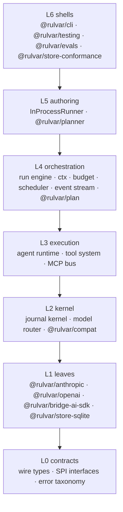
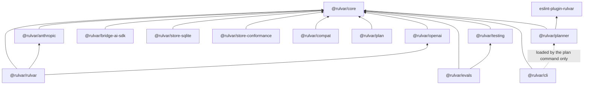

# Architecture

Rulvar is an embeddable engine, not a platform. It lives inside your Node.js application and needs no server, no database, and no control plane; the CLI, HTTP server, and queue worker exist, but as optional shells built strictly on the public API. The engine itself is twelve components arranged in seven layers, and everything they do funnels through one runtime, one journal, and one budget path.

## Layered overview



Dependencies point strictly downward: a module in one layer never imports anything from a layer above it, and each layer may reach any layer below. The shells at L6 additionally consume the event stream and the stores, both of which are public surfaces.

| Layer | Name | What lives there |
|---|---|---|
| L0 | Contracts | Message and part types, `ChatRequest`/`ChatEvent`, `Usage`, `JournalEntry`, `WorkflowEvent`, the error taxonomy, `SchemaSpec`, and every SPI interface |
| L1 | Leaves | Provider adapters and stores; each depends only on L0, and a provider SDK appears exclusively inside its own adapter |
| L2 | Kernel | The journal kernel (content keys, scope paths, the replay predicate, the budget ledger) and the model router with the capability and price registry |
| L3 | Execution | The tool system and MCP bus, and the agent runtime |
| L4 | Orchestration | The run engine, ctx primitives, the concurrency scheduler, the three-layer budget, the event stream, and the dynamic orchestrator |
| L5 | Authoring | Script runners and the plan agent |
| L6 | Shells | Test harness, CLI and TUI, HTTP server, queue worker, knowledge-base maintenance |

## The twelve components

| # | Component | Ships in | Deep dive |
|---|---|---|---|
| 1 | Journal kernel | `@rulvar/core` | [The journal](/guide/journal) |
| 2 | Storage SPI and shipped stores | `@rulvar/core`, `@rulvar/store-sqlite` | [Stores](/guide/stores) |
| 3 | Provider adapter SPI and wire core | `@rulvar/core`, adapter packages | [Providers](/guide/providers) |
| 4 | Model router and capability registry | `@rulvar/core` | [Model routing](/guide/model-routing) |
| 5 | Agent runtime | `@rulvar/core` | [Agents](/guide/agents) |
| 6 | Tool system and MCP bus | `@rulvar/core` | [Tools](/guide/tools), [MCP](/guide/mcp) |
| 7 | Workflow engine and ctx primitives | `@rulvar/core` | [Workflows](/guide/workflows) |
| 8 | Script runners | `@rulvar/core`, `@rulvar/planner` | [Determinism](/guide/determinism) |
| 9 | Orchestration modes | `@rulvar/core`, `@rulvar/planner`, `@rulvar/plan` | [Orchestration modes](/guide/orchestration-modes) |
| 10 | Event stream and observability | `@rulvar/core` | [Observability](/guide/observability) |
| 11 | Test harness | `@rulvar/testing` | [Testing](/guide/testing) |
| 12 | Shells: CLI, server, queue | `@rulvar/cli` | [CLI](/guide/cli) |

### Journal kernel

The sole writer and interpreter of run truth. It derives a content key (a sha256 over the canonical JSON of each call) and a structural scope path for every effect, then decides replay or live via scoped forward-matching: completed, paid work is served from the journal; anything new costs exactly one live call. That is the never-pay-twice invariant, and the single predicate implementing it, `replayDisposition`, maps each entry to `replay`, `rerun`, or `skip`. Entries are two-phase (`running`, then a terminal status), so at-least-once dispatch never becomes double pay. The stores below the kernel never parse its payloads; the layers above it know nothing about persistence. See [The journal](/guide/journal) and [Invariants](/guide/invariants).

### Storage SPI and shipped stores

Pluggable persistence behind a deliberately dumb seam: `JournalStore` is five methods (`append`, `load`, `putMeta`, `listRuns`, `delete`), and `LeasableStore` adds `acquire`/`renew`/`release` with a fencing epoch so a stale queue worker's appends are rejected rather than corrupting a run. `TranscriptStore` keeps agent transcripts, checkpoints, and worktree patches as separate blobs, so the journal stays small and diffable. The core ships `InMemoryStore` (resume disabled, with a loud warning) and `JsonlFileStore`; `@rulvar/store-sqlite` ships `SqliteStore`, the reference for community stores, and `@rulvar/store-conformance` is the executable definition of the contract. See [Stores](/guide/stores) and [Writing a store](/guide/store-authors).

### Provider adapter SPI and wire core

The single home of provider wire formats: canonical messages made of ordered parts, one unified stream event vocabulary, namespaced `providerOptions` in and `providerMetadata` out. Adapters absorb every provider quirk invisibly to the core, and two decisions kill whole bug classes by construction: tool-call ids are minted by the engine (each adapter keeps a bijective canonical-to-wire map, so id format mismatches across providers cannot happen), and provider-raw parts such as thinking blocks are always retained in canonical history but projected onto the wire only for their native provider. Adapter SDK autoretries are disabled; the core owns retries. First-class adapters: `@rulvar/anthropic`, `@rulvar/openai`, the `openaiCompatible` factory, and `@rulvar/bridge-ai-sdk` for the long tail. See [Providers](/guide/providers) and [Writing an adapter](/guide/adapter-authors).

### Model router and capability registry

Vendor neutrality at every call. The model is resolved on every invocation along the chain call override, then agent profile, then workflow default, then engine default, tagged with one of six invocation roles (`orchestrate`, `plan`, `loop`, `finalize`, `extract`, `summarize`). The router scrubs illegal parameters against each model's declared capabilities, selects the structured-output tier, prices usage from a versioned price table, and enforces role quality floors. Registries are per engine; there is no global mutable registry anywhere. A transport failover changes only which model served the call, never the journal identity, so replay stays stable and cost attribution stays honest. See [Model routing](/guide/model-routing).

### Agent runtime

One subagent loop for all three orchestration modes: a model turn, tool dispatch through the layered permission chain (hooks, then deny rules, then ask rules, then `canUseTool`, then the terminal default), structured output in three tiers with client-side validation and a bounded re-prompt, checkpoints at every turn boundary, and context compaction through the `summarize` role. Cross-provider history correctness is owned by the history projection step, `projectHistory`, which makes per-role provider mixing inside one agent safe. The runtime never throws past policy: every agent settles into a typed `AgentResult` with a status, usage, cost, and a transcript reference. A tool approval suspends the run as a journal entry plus a turn checkpoint; resume continues the same turn without re-paying it. See [Agents](/guide/agents).

### Tool system and MCP bus

Typed tools with full inference from `SchemaSpec`, defined with `tool()`. The toolset hash that enters journal identity is computed from the contract (name, description, canonical parameters schema, version), never from the `execute` closure, so editing an implementation does not invalidate a journal; a semantic change is declared by bumping `version`. `ToolSource` makes native tools, in-process MCP servers, and stdio or HTTP MCP servers indistinguishable to the runtime, with allow/deny filters and collision prefixing. Worktree isolation gives an agent's tools a cwd inside a disposable git worktree and returns the resulting patch as an artifact. See [Tools](/guide/tools) and [MCP](/guide/mcp).

### Workflow engine and ctx primitives

The run lifecycle and the entire authoring surface: `defineWorkflow` plus the `ctx` handed to every workflow body, with `agent`, `parallel`, `pipeline`, `step`, `workflow`, `orchestrate`, `brief`, `awaitExternal`, `phase`, `log`, `budget`, and the deterministic shims `now`, `random`, and `uuid`, journaled so replay is stable. The engine owns the concurrency scheduler and the three-layer budget: admission before every spawn, a guard before every agent turn, and an abort of live streams when the ceiling is crossed, with overshoot bounded by one turn per in-flight agent. Exhaustion is never a `null`: the run settles with the `exhausted` outcome and partial results. Child workflows nest under the admission controller with hierarchical budget sub-accounts that roll spend up to the root. See [Workflows](/guide/workflows) and [Budgets](/guide/budgets).

### Script runners

The execution seam for workflow bodies, with a type-level split: a `Workflow` is a closure and runs only in process; a `CompiledWorkflow` is source text and is admissible into the worker sandbox. Feeding a closure to the sandbox is impossible by types. `InProcessRunner` (in the core) runs human-authored workflows; `WorkerSandboxRunner` (in `@rulvar/planner`) runs machine-written scripts in a worker thread with a curated global scope: the ctx methods bound as bare globals, `Date.now` and `Math.random` replaced by seeded journaled versions, and no `import`, `fetch`, or `process`. The sandbox is a determinism and blast-radius boundary, not a security boundary: only the in-process tool executor ships today, and worktree isolation covers file changes and the working directory, never processes or the network. Containing hostile tool code requires an executor you build and operate, with its own threat model ([Tools](/guide/tools#executors)). See [Determinism](/guide/determinism).

### Orchestration modes

Three modes, no fourth, all call-and-return only:

- **Human scripts.** Deterministic workflows written by people: `engine.run(wf, args)`.
- **The flagship hybrid.** `plan()` asks a planner model to write a script against the ctx API card, lints it, repairs it from structured diagnostics, and compiles it into a sandbox-admissible workflow; `runPlanned()` plans and then executes the result deterministically in the worker sandbox, in one call.
- **Dynamic orchestrator.** `orchestrate()` runs an agent with typed spawn tools, handle-based awaiting, and cancellation. Every spawn is an ordinary journal entry, and orchestrator turns are checkpointed, so a crashed orchestration resumes without regenerating a single spawn decision.

The same profile card renders the agent vocabulary for both the planner prompt and the orchestrator's spawn tool, so the two machine-driven modes speak one language. See [Orchestration modes](/guide/orchestration-modes), [The planner](/guide/planner), and [Adaptive orchestration](/guide/adaptive-orchestration).

### Event stream and observability

A single discriminated `WorkflowEvent` stream with hierarchical span ids (run, phase, agent, tool, child) is the sole observability source. It feeds `RunHandle.events` and `on()`, the terminal progress renderer, the JSONL log, and the optional OpenTelemetry exporter in `@rulvar/cli`. Span ids are pure telemetry and never enter journal identity; the event sequence counter is independent of the journal's; replayed lifecycle events carry `replayed: true` so UIs can deduplicate. The event surface is public API, but deliberately not a pluggable SPI: there is nothing for third parties to implement. See [Observability](/guide/observability).

### Test harness

Three test tiers that fall directly out of two architecture seams. `FakeAdapter` sits behind the provider seam for fast, fully typed unit tests; VCR cassettes record and replay at the adapter boundary, vendor neutral by construction; replay-strict runs execute a journal with zero live calls and fail loudly with `JournalMissError` on any would-be-live call. Matchers ship for Vitest and Jest. See [Testing](/guide/testing) and [Evals](/guide/evals).

### Shells: CLI, server, and queue

An optional ops layer built strictly on public APIs: the `rulvar` CLI with TUI progress and interactive resolution of suspended approvals, `createServer` (HTTP with SSE events and external-input resolution for human-in-the-loop flows), `createWorker` (multi-process background runs leased over a `LeasableStore` with the fencing epoch), and the knowledge-base maintenance commands. The shells double as a permanent design test: anything a shell cannot do through the public surface is a defect in the seams, not a reason for a private import. See [CLI](/guide/cli) and [Durability](/guide/durability).

## Layer rules

Five rules are enforced permanently, not just at release time:

- **The core imports no plugins.** Nothing in `@rulvar/core` references an adapter, a store package, a runner package, or a shell. It has zero provider SDK dependencies; its one external runtime dependency serves the MCP bus.
- **Plugins import only core types and never each other.** A provider SDK appears exclusively inside its own adapter.
- **Shells and orchestration packages build only on the public API.** `@rulvar/plan`, `@rulvar/planner`, `@rulvar/cli`, `@rulvar/testing`, `@rulvar/evals`, and `@rulvar/store-conformance` all pass the seam-sufficiency test: if one of them needed a private hook, the seam would be wrong.
- **No module state at any layer.** Every registry (adapters, capabilities and prices, agent profiles, workflows, key derivers) hangs off the engine you construct, and ctx is created per run. This is also why all packages publish ESM only (Node >= 22.12.0): two module instances would duplicate registry state and break content-addressed replay identity.
- **Dependencies point strictly downward**, with L6 additionally consuming the event stream and the stores.

## One runtime, one journal, one budget path

All three orchestration modes execute on the same agent runtime, journal through the same kernel, and spend through the same three-layer budget. A child spawned by the dynamic orchestrator, a `ctx.agent` call in a human script, and a step in a planner-generated script all become the same kind of journal entry with the same identity rules, so:

- resume works identically in every mode: completed work replays, in-flight work reruns, abandoned branches skip;
- cost attribution is exact in every mode, down to per-model, per-phase, per-role buckets in the `CostReport`;
- the budget ceiling set at run start is immutable and enforced everywhere; no API can top it up mid-run;
- `FakeAdapter`, cassettes, and replay-strict tests exercise any mode without mode-specific tooling.

There is deliberately no second path. Handoffs, chat rooms, and emergent topologies are rejected on principle: the single cross-agent primitive is agent-as-tool, invoke and return, because anything else destroys budget attribution and replay identity. See [Invariants](/guide/invariants).

## Engine anatomy

The engine is the single entry object your application constructs. Every registry hangs off it, and nothing is module-global:

```ts
import { createEngine, defineWorkflow } from "@rulvar/core";
import { anthropic } from "@rulvar/anthropic";
import { openai } from "@rulvar/openai";
import { SqliteStore } from "@rulvar/store-sqlite";

const engine = createEngine({
  adapters: [anthropic(), openai()],
  stores: { journal: new SqliteStore({ path: ".rulvar/journal.db" }) },
  defaults: {
    routing: { summarize: "anthropic:claude-haiku-4-5" },
  },
});

const review = defineWorkflow({ name: "review-pr" }, async (ctx, args: { pr: number }) => {
  const [code, tests] = await ctx.parallel([
    () => ctx.agent(`Review the diff of PR ${args.pr}`),
    () => ctx.agent(`Assess the test coverage of PR ${args.pr}`),
  ]);
  return { code, tests };
});

const handle = engine.run(review, { pr: 42 }, { budgetUsd: 5 });
const outcome = await handle.result;
```

Follow one `ctx.agent` call down the stack: the workflow engine (L4) journals the call's identity through the kernel (L2), the agent runtime (L3) runs the loop, the router (L2) resolves which model serves each turn, the adapter (L1) speaks the provider's wire format, and every lifecycle step surfaces on `handle.events`. Resume the run (`engine.resume(handle.runId, review)`) against the same store and the completed calls replay from the journal at zero cost.

The dynamic orchestrator rides the same engine:

```ts
import { orchestrate } from "@rulvar/core";

const run = orchestrate(engine, "Triage the open issues and draft fixes", {
  maxSpawns: 8,
});
```

## Package map

Rulvar ships as 14 packages. All release in lockstep with identical versions; the sole exemption is `@rulvar/compat`, which is versioned independently. Install commands always use the scoped form, for example `pnpm add @rulvar/core`; the unscoped npm name is not the library. See [Packages](/reference/packages) and [Versioning](/reference/versioning).

| Package | Layer | What it ships |
|---|---|---|
| `@rulvar/rulvar` | umbrella | Batteries included: re-exports `@rulvar/core`, both first-class adapters, the file store, and the terminal progress renderer; carries the named strong default models for the `orchestrate` and `plan` roles |
| `@rulvar/core` | L0 to L5 | Contracts, journal kernel, model router, agent runtime, tool system and MCP bus, ctx primitives, dynamic orchestrator, `InProcessRunner`, in-memory and JSONL stores, the event stream; zero provider SDKs |
| `@rulvar/anthropic` | L1 | Anthropic adapter: thinking-block replay, cache hint compilation, `pause_turn`, typed refusal outcomes, usage normalization |
| `@rulvar/openai` | L1 | OpenAI Responses API adapter plus the `openaiCompatible` factory for any compatible endpoint |
| `@rulvar/bridge-ai-sdk` | L1 | Wraps any Vercel AI SDK language model as a `ProviderAdapter` for the long tail of providers; the highest-churn package |
| `@rulvar/store-sqlite` | L1 | `SqliteStore` implementing `JournalStore` and `LeasableStore` with the fencing epoch; the reference for community stores |
| `@rulvar/store-conformance` | L6 | Executable conformance kit for store adapters: atomicity, total per-run order, read-your-writes, opaque payloads, fencing |
| `@rulvar/compat` | L2 ext | Frozen key-derivation profiles for retired journal hash versions; independently versioned; attaches via `extraDerivers` |
| `@rulvar/plan` | L4 ext | The `planRunner` extension, the run ledger, escalation extensions, and model ladder configuration for the dynamic orchestrator |
| `@rulvar/planner` | L5 | The flagship hybrid: the plan agent, `compileScript`, `WorkerSandboxRunner`, and the self-repair loop over lint diagnostics |
| `eslint-plugin-rulvar` | tooling | Determinism lint rules (no bare `Date.now`, `Math.random`, `fetch`, or `process.env` in workflow modules; no `Promise.all` over ctx calls) with JSON diagnostics |
| `@rulvar/testing` | L6 | `createTestEngine` and `FakeAdapter`, VCR cassettes with secret redaction, replay-strict runs, Vitest and Jest matchers |
| `@rulvar/evals` | L6 | Eval cases, golden outputs, rubric and judge graders through the engine, matrix sweeps |
| `@rulvar/cli` | L6 | `run`/`resume`/`runs`/`inspect`/`plan` commands with TUI progress, `createServer`, `createWorker`, the OpenTelemetry exporter, and the `kb` maintenance commands |

### Dependency graph



Every solid arrow is a declared dependency on core types or the public API. `eslint-plugin-rulvar` depends on nothing in Rulvar (ESLint peer only), and `@rulvar/cli` loads `@rulvar/planner` dynamically for the `plan` command alone, so the other commands work without it installed.

::: tip @rulvar/plan versus @rulvar/planner
The names are close by design; they preserve established vocabulary. `@rulvar/planner` is the flagship hybrid mode: the plan agent that writes scripts, `compileScript`, and the worker sandbox. `@rulvar/plan` is the opt-in extension of the dynamic orchestrator: `planRunner` and the plan-as-typed-data machinery. See [The planner](/guide/planner) and [Adaptive orchestration](/guide/adaptive-orchestration).
:::

## Frozen SPI seams

Seven SPI seams are frozen for the 1.x line: their TypeScript surfaces and the journaled semantics they imply change only additively under semver minor rules, and third-party implementations written against them keep working across every 1.x release. Each seam froze only after at least two independent implementations were exercised in CI.

| Seam | Interface | Shipped implementations |
|---|---|---|
| Provider adapter | `ProviderAdapter` | `@rulvar/anthropic`, `@rulvar/openai`, `openaiCompatible`, `@rulvar/bridge-ai-sdk` |
| Journal storage | `JournalStore` and `LeasableStore` | `InMemoryStore`, `JsonlFileStore`, `SqliteStore` |
| Transcript storage | `TranscriptStore` | Bundled with the shipped stores |
| Script runner | `ScriptRunner` | `InProcessRunner`, `WorkerSandboxRunner` |
| Tool source | `ToolSource` | Native tools and `mcp()` |
| Isolation provider | `IsolationProvider` | `GitWorktreeProvider` |
| Model knowledge store | `ModelKnowledgeStore` | `FileModelKnowledgeStore` |

For stores the freeze is checkable, not aspirational: `@rulvar/store-conformance` is the executable definition of the storage contract. Drift is tracked by diffing the committed rolled-up type declarations on every pull request. The full public API surface is browsable under the [API reference](/api/@rulvar/core/).

## Next steps

- [Invariants](/guide/invariants): the six load-bearing guarantees this architecture exists to keep.
- [The journal](/guide/journal): content keys, scope paths, and the replay predicate in depth.
- [Orchestration modes](/guide/orchestration-modes): choosing between scripts, the planner, and the dynamic orchestrator.
- [Packages reference](/reference/packages): every package, one line at a time.
