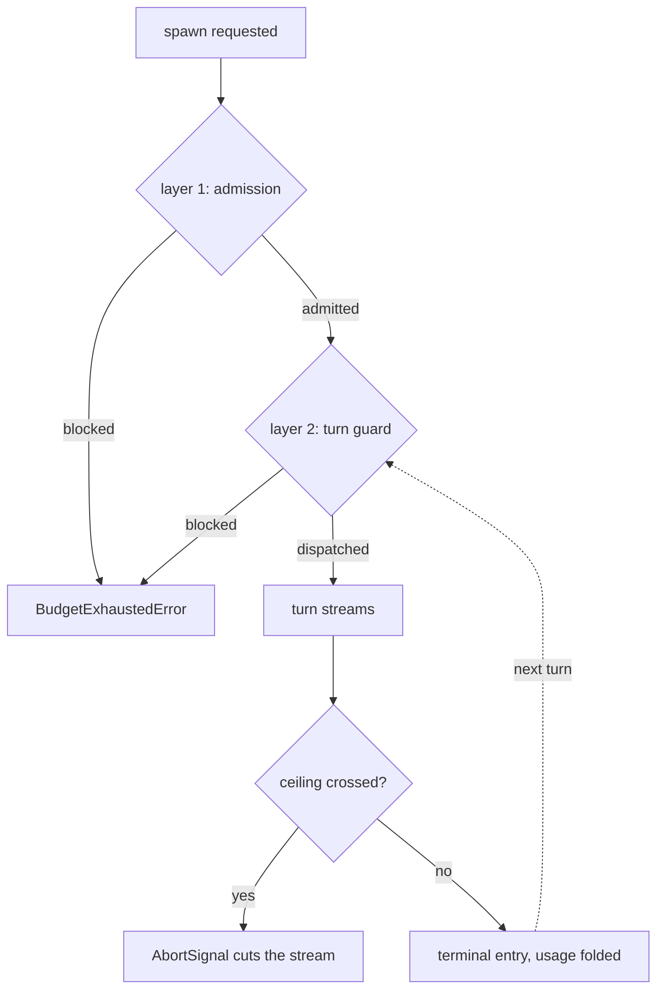

# Budgets and termination

Every Rulvar run can carry an **immutable run budget with pre-dispatch
reservation and a documented, provider-dependent in-flight overshoot bound**:
projected admission denies a spawn whose reserve does not fit before anything
is dispatched, every turn's output tokens are clamped to what the remaining
budget buys, live streams are cut on crossing, and what physically cannot be
prevented (a provider bills the tokens it has already generated) is stated
quantitatively rather than hidden. Enforcement is one budget path shared by
all three [orchestration modes](/guide/orchestration-modes): the same layers
guard a hand-written workflow, a planned script, and a dynamic orchestrator.
This page covers the layers, what happens at the ceiling, the integer counters
that make termination a proof rather than a hope, and how to size all of it.

## The immutable run ceiling

Set the ceiling per run with `budgetUsd`:

```ts
import { createEngine, defineWorkflow } from "@rulvar/core";
import { anthropic } from "@rulvar/anthropic";

const engine = createEngine({ adapters: [anthropic()] });

const review = defineWorkflow(
  { name: "review" },
  async (ctx, args: { pr: number }) => {
    return ctx.agent(`Review PR ${args.pr} and summarize the risks.`, {
      agentType: "reviewer",
    });
  }
);

const handle = engine.run(review, { pr: 42 }, { budgetUsd: 20 });
const outcome = await handle.result;
```

The ceiling (call it B0) is **immutable after start**. No API raises it: not
the run handle, not an operator resolution, not a human-in-the-loop decision.
Restarting the process with a bigger number in config does not work either:
resume accepts no budget parameter, and in adaptive runs the ceiling frozen in
the journal wins, the mismatch producing only a config-drift telemetry event.
If a run needs more money, that is a new run, decided by the host.

A run without `budgetUsd` has no USD ceiling: `ctx.budget.remaining()` returns
`null` and only the structural bounds apply (the engine lifetime cap of 500
spawns per run, the nesting depth limit, and per-agent `UsageLimits`). For
anything that spawns real models against a real account, set a ceiling.

The planner's convenience calls take the same ceilings: `plan(engine, goal,
{ run: { budgetUsd } })` freezes B0 on the planning conversation at its
genesis, and `runPlanned(engine, goal, args, { plan, run })` bounds the
planning leg and the execution leg independently. The bare forms without
options run unbounded; see
[Budgeting the planning conversation](/guide/planner#budgeting-the-planning-conversation).

## The three layers

Each layer answers a different question at a different moment:

| Layer | When | Question |
| --- | --- | --- |
| 1. Admission | Before a spawn | Can this run afford to start the call at all? |
| 2. Turn guard | Before every agent turn | Can this agent afford one more turn? |
| 3. Stream cut | While tokens stream | Has the ceiling been crossed mid-turn? |



### Layer 1: projected admission before spawn

Admission is **projected**: a spawn is admitted only when

```text
spent + committedReserve + finalizeReserve + proposedReserve <= ceiling
```

holds on **every** account in its ancestor chain, checked atomically before
anything commits. An exact fill is allowed; one dollar past the ceiling is
not. A spawn is never admitted on the argument that the money it needs is
merely not committed yet: the first call under a 0.001 USD ceiling with a
0.01 USD estimate is denied outright, before any provider dispatch or journal
entry. Because a call's true cost is unknown before it runs, admission works
with a reserve, resolved in this order:

```text
reserve = opts.estCost
       ?? profile.estCost
       ?? price(countTokens(input) + min(caps.maxOutputTokens, limits.maxOutputTokensPerTurn))
       ?? 0.50 USD   (engine flat default, budgetDefaults.flatReserveUsd)
```

Two refinements keep estimates honest instead of paralyzing: a child with its
own sub-account ceiling never reserves more than that ceiling (it physically
cannot spend more), and an unpriced model reserves nothing unless you pass an
explicit `estCost` (a dollar reserve would deny work the ceiling cannot bound
anyway; see the unpriced-model section below).

One case is deliberately NOT clamped away. When a PlanRunner `add_task` op
declares an explicit `budgetUsd` and the resolved profile's `estCost` cannot
fit it, the op is bounced at `plan_revise` time with the typed reason
`reserve_exceeds_budget` naming the child account, the requested and resolved
reserve, the ceiling, and the minimum correction. Nothing changes in the plan
and no spawn unit is consumed: the host's own estimate says the budget cannot
buy the work, so the orchestrator gets to fix the number instead of paying for
a child that would be cancelled mid-task. Heuristic reserves (the flat default
or the priced estimate) never bounce an op this way; they clamp to the child's
allowance, and an admitted op is guaranteed dispatchable under the same budget
snapshot, including every op of a multi-op revision. A dispatch refused by
facts that changed after admission lands the node terminally `failed` through
a journaled `plan.decision` instead of stranding it.

Reserves ride the journaled admission decision entry, so on resume they are
recovered from the journal, never re-estimated: a price-table change between
crash and resume does not move an already-committed number (see
[Durability](/guide/durability)).

You can tighten admission per call or per profile with an `estCost` hint:

```ts
// A short classification call should not reserve a full maxOutputTokens
// worth of budget.
const label = await ctx.agent("Classify: build failure on main after merge", {
  agentType: "classifier",
  estCost: 0.05,
});
```

### Layer 2: the per-turn guard and the output bound

Before every agent turn the runtime checks the agent's own sub-account. A turn
that would cross the sub-account ceiling is never dispatched; the blocked
primitive throws the typed `BudgetExhaustedError` (error code
`budget_exhausted`). Nothing is sent to a provider, so a blocked turn costs
zero.

Every dispatched turn also carries a **derived output bound**: the request's
`maxOutputTokens` is clamped to
`min(model capability, limits.maxOutputTokensPerTurn, budget-derived limit)`,
where the budget-derived limit is what the tightest remaining ceiling in the
account chain still buys at the serving model's output price (long-context
tiers included), after a heuristic estimate of the prompt's input cost. This
makes the marginal turn's output spend deterministic even for providers that
report usage only at the end of the stream. When the remainder cannot buy even
one output token at zero input, the turn is denied exactly like the turn
guard; when only the heuristic prompt estimate says the turn does not fit, the
turn dispatches with a one-token output floor and the exact layers settle the
difference. Unpriced models have no output bound; the ceiling cannot bound
them at all (see below).

### Layer 3: cutting live streams at the ceiling

Layers 1 and 2 work on estimates; only layer 3 sees actual spend as it
happens. When a ceiling is crossed while responses are streaming, the engine
severs the live streams with an `AbortSignal`. The usage accumulated from
stream deltas up to the cut is written to the journal with
`usageApprox: true`: the partial spend is counted, and the flag records that
the number came from a severed stream rather than a provider's final usage
report.

### Bounded overshoot: one clamped turn, and why not less

The worst-case overshoot past the ceiling is **at most one in-flight turn per
concurrent agent**, and the output side of that turn is not open-ended: the
derived output bound clamps each request's `maxOutputTokens` to what the
remaining budget bought at dispatch time. What remains provider-dependent is
unavoidable: once a turn has been dispatched, the provider bills the tokens it
streams whether or not you read the stream to its end. Cutting mid-stream
(layer 3) stops the meter as early as the provider's incremental usage
reporting allows, but the tokens already generated are owed, and a provider
that reports usage only at the end of the stream is bounded by the clamp
alone.

Practical consequence: the worst case scales with concurrency, because every
concurrent agent's turn was clamped against the same remainder. At the default
per-run concurrency of 12, up to 12 agents can be mid-turn when the ceiling is
crossed, so size B0 with roughly one turn of headroom per concurrent agent, or
lower the per-run concurrency where the ceiling is tight.

### The one thing the ceiling cannot bound: a model with no price

All three layers work in dollars, and dollars come from the price table. A model
absent from it prices as `undefined`, which debits **nothing**, so a USD ceiling
does not bound it at all. For a local model that is the honest answer, since it
costs nothing to run; for a hosted model whose price row is merely missing it is
a hole, and the engine will not let it pass in silence: the first time an
unpriced model spends under a run that has a ceiling, the run emits a
warning-level `log` event naming the model and saying plainly that the ceiling
does not bound it. Its usage still surfaces under
[`CostReport.unpriced`](#cost-reports) either way, never as a silent zero.

Give the model a price row through `createEngine({ pricing })` to bring it back
under the ceiling. See
[The versioned price table](/guide/model-routing#the-versioned-price-table).

### A CostReport is an estimate, not an invoice

Dollars are computed from normalized usage at the table's **base** rates. The
report does not model provider billing modifiers such as batch discounts,
regional or data-residency multipliers, or premium serving modes; if your
account pays a modified rate, encode it in your own versioned table rows (a
single multiplier applied to every field of a row keeps the arithmetic exact).
The same applies in reverse: prices are never fetched from the provider at run
time, and a row never switches by wall clock inside a run. A price change is a
new table with a new `pricingVersion`, and runs priced from the adapter caps
fallback journal the version as `unpriced`, which is precisely why passing a
versioned table is recommended for anything whose journals outlive a deploy.

## Sub-accounts and the account tree

Budget accounts form a tree with the run root at the top. A child workflow
started through `ctx.workflow` gets its own sub-account holding a fraction of
the parent's remainder (`childBudgetFraction`, default 0.3, computed after
subtracting the parent's finalize reserve). A dynamic orchestrator gets its
own account too (below). Spend in any account propagates upward to every
ancestor, so the root ceiling remains the single true invariant no matter how
deep the tree grows.

Workflows can read their own account at any time:

```ts
const spent = ctx.budget.spent();       // { usd, usage, agentsSpawned }
const left = ctx.budget.remaining();    // null when the run has no USD ceiling

if (left !== null && left.usd < 2) {
  ctx.log("warn", "budget low, skipping the deep-analysis pass", {
    usd: left.usd,
  });
}
```

::: info Sandbox dialect
Inside the worker sandbox used for planner-generated scripts the same reads
are asynchronous: `await budget.spent()`. A synchronous cross-thread read does
not exist.
:::

## Exhaustion is an outcome, not an exception

At the ceiling, every ctx primitive throws `BudgetExhaustedError`. You
normally let it unwind: the engine recognizes it and reports the run outcome
`'exhausted'`, overriding `'error'`.

```ts
const outcome = await handle.result;

switch (outcome.status) {
  case "ok":
    console.log(outcome.value);
    break;
  case "exhausted":
    // Paid partial work is preserved and addressable.
    console.log(`spent ${outcome.cost.totalUsd} USD before the ceiling`);
    console.log(`${outcome.dropped.length} calls dropped`);
    console.log(`${outcome.pending.length} externals still open`);
    break;
}
```

Exhaustion is never a bare null. The outcome always carries the full cost
report, the `dropped` list (every loss with its error and scope path), and the
`pending` list of open suspensions. Under `onError: 'null'` a blocked call
yields `null` at the call site with a recorded drop, and the run continues
until the ceiling blocks everything; the terminal outcome is still
`'exhausted'`. In an adaptive run that hits the orchestrator cap, the
`exhausted` outcome carries a deterministically synthesized partial value
(next sections). And because everything paid is journaled, the partial work
stays addressable after the run settles and is never paid twice.

## The termination account

Dollars bound spend, but dollars alone do not bound iteration: an adaptive run
replanning in tiny cheap steps could loop for a very long time inside its
budget, and test runs against fake adapters cost zero dollars entirely.
Adaptive [PlanRunner runs](/guide/adaptive-orchestration) therefore add a
per-run termination account: integer counters frozen at start, spent and never
refilled.

At run admission the frozen limits vector is written into the journal as a
`termination.init` entry:

| Limit | Default | What it bounds |
| --- | --- | --- |
| `maxRevisionsPerRun` | 32 | Plan revisions: minus 1 per journaled revision, regardless of diff size |
| `maxTotalSpawns` | 128 | Admitted spawns of any origin |
| `maxEscalationsPerLogicalTask` | 2 | Escalations per logical task, counted across respawns via lineage |
| `maxDepth` | 1 (hard ceiling 4) | Nesting depth |
| `kMax` | derived | The longest declared model ladder in the profile registry snapshot |
| `runBudgetUsdCeiling` | host-set | B0 itself, frozen alongside the counters |
| `orchestratorCapUsd`, `finalizeReserveUsd` | derived | The orchestrator budget (next section), frozen in the same vector |

The account is **debit-only by construction**: no credit operation exists in
the API, no journal entry kind carries a credit, and the frozen vector cannot
be edited after start. Growing the plan does not grow the revision budget;
abandoning work reclaims dollars but never returns counters.

The two dollar fields freeze the values the engine resolves strictly before
the extension boots, and the `orchestrator_budget_reserve` decision that
follows refers to the same immutable dollars. On resume the frozen dollars
win over live options: a diverging `capUsd`, `capFraction`, or
`finalizeReserveUsd` emits `termination:config-drift` and is never honored.
Journals recorded before v1.8 store `0` for both fields ("not yet resolved");
for those journals the reserve decision is the authority, and they replay
unchanged.

The reserve decision also pins the `pricingVersion` in effect when the run
started (`unpriced` when the run priced from the adapter caps fallback).
Unlike the cap dollars, price interpretation is live by design: the journal
stores usage, and dollars are re-derived from the current table, so a resumed
run under a revised table recomputes spend at the new rates against the same
frozen cap. That divergence is therefore **reported, never honored or
refused**: a live table whose version differs from the journaled one emits
`termination:config-drift` with field `pricingVersion`, and the replay itself
stays byte-identical with zero repeated provider work. Decisions journaled
before the field shipped resume quietly.

Wakeups need no counter of their own: every orchestrator wake is a paid turn
against the capped orchestrator sub-account, so the number of wakes is bounded
by the usable cap (cap minus the finalize reserve) divided by the minimal cost
of one turn.

This yields the termination guarantee: every edge of the composite
escalate-replan-retier loop carries exactly one debiting decision entry, and
each debit strictly decreases a finite variant over the remaining units. The
loop therefore makes finitely many iterations, and **every run settles to a
terminal outcome** in a finite number of live calls, at a spend no higher than
B0 plus the bounded overshoot. The integer counters give termination even at
zero model cost; dollars remain an independent safety ceiling, never the only
argument.

When a counter would go below zero the debit is not executed: the engine
journals the denial and surfaces a typed error (for example
`revision_budget_exhausted`) to the orchestrator as an ordinary tool error.
Denials never tear the run down, and a denied call does not debit, so spamming
a denied tool costs turns, not counters.

Freeze the knobs per run through the plan options:

```ts
import { orchestratePlanned } from "@rulvar/plan";

const handle = orchestratePlanned(
  engine,
  "Migrate the API surface to v2",
  {
    budget: { capUsd: 4, finalizeTurns: 2 },
    plan: {
      maxRevisionsPerRun: 16,
      limits: { maxTotalSpawns: 64, maxEscalationsPerLogicalTask: 2 },
    },
  },
  // The ordinary engine RunOptions of the created run: budgetUsd is the
  // ROOT hard ceiling over the whole tree, immutable after start.
  { budgetUsd: 25 },
);
```

The fourth argument is the run's `RunOptions`, exactly what `engine.run` takes: `budgetUsd` there is the root hard ceiling over the orchestrator **and every child**, while `budget.capUsd` above only shapes the orchestrator's own sub-account inside it. `orchestrate` from `@rulvar/core` accepts the same fourth argument. Without it the created run has **no root ceiling**: the sub-account cap alone does not bound the children.

Runs without the PlanRunner extension (modes a and b, and plain dynamic
orchestration) write no termination entry and carry only the engine lifetime
cap (default 500 spawns), the depth limit, and the three budget layers.

## The orchestrator budget sub-account

The orchestrator agent of a dynamic run spends money too: every one of its
turns is an LLM call. It therefore gets its own sub-account with a hard cap:

```text
effectiveCap = min(capUsd, capFraction x B0)     // capFraction default 0.2
```

::: warning An explicit capUsd is still bounded by the default fraction
`capUsd` never replaces the fraction bound; the two always meet in the min.
Under `budgetUsd: 0.90`, `budget: { capUsd: 0.70 }` yields
`min(0.70, 0.2 x 0.90) = 0.18`: the ceiling that ends the orchestrator is the
default fraction, not the number you wrote. When `capUsd` should be the sole
bound, pass `capFraction: 1.0` alongside it. The engine emits a `log` warning
at orchestration start whenever an explicit `capUsd` gets bounded this way,
and budget exhaustion errors name the account that actually crossed (its
scope, ceiling, spend, and reserves, plus the run root state) instead of
blaming the run ceiling.
:::

Configure it through the `budget` option of `orchestrate` or
`ctx.orchestrate`:

```ts
const research = defineWorkflow(
  { name: "research" },
  async (ctx, goal: string) => {
    return ctx.orchestrate(goal, {
      budget: { capFraction: 0.15, atCap: "finish-with-partial" },
    });
  }
);

const handle = engine.run(research, "Map the dependency risks", {
  budgetUsd: 20,
});
```

Under the PlanRunner extension, an unresolvable cap (a run with no USD ceiling
and no explicit `capUsd`) or a cap smaller than the finalize reserve refuses
to start with the typed `OrchestratorCapConfigError`, before the first LLM
call and before any journal entry; a plain dynamic run whose cap resolves to
no bound simply opens no sub-account. Opting out of the cap is explicit only:
`capFraction: 1.0` sets the sub-account ceiling to the full B0 and emits
nothing, while any fraction above 1.0 is refused with the same typed error. A
nested orchestrator is additionally clamped by the parent account's remainder
minus the parent's finalize reserve.

Two details make the cap safe rather than merely present:

- **The finalize reserve.** At admission the engine journals a decision entry
  fixing `finalizeReserveUsd` in absolute dollars (explicit, or `finalizeTurns`
  times the estimated turn cost; default 2 turns). The reserve is registered
  as committed simultaneously in the orchestrator account **and** the run
  root, so no child spawn can ever eat the money needed to finish, even when
  the working part of the run ends exhausted.
- **The at-cap protocol.** Crossing the soft boundary journals one cap
  decision, then (default `atCap: 'finish-with-partial'`): running children
  finish (killing them would overpay), new plan revisions become impossible,
  and at quiescence the orchestrator gets one final wake, paid from the
  reserve, with a single `finish` tool. A successful finish yields outcome
  `ok` with a `forcedFinish` mark in the cost report. If even that fails, the
  engine synthesizes a deterministic partial result from the journaled plan
  state with zero LLM calls, and the run ends `exhausted` with a non-null
  value. The sole alternative is `atCap: 'fail-run'`.

The orchestrator is never woken up about its own spend (waking it would cost
more of it); instead every wake digest carries a passive budget block with run
and orchestrator spend, the cap, the reserve, and a soft-warning flag at 80
percent of the usable cap. Run-level `budget_threshold` wake triggers fire at
50 and 80 percent of B0 (fixed in v1). Admission stays accurate here too: a
capped orchestrator reserves exactly its effective cap, and the forced-finish
agent reserves exactly the finalize reserve, so a small run ceiling is not
starved by an oversized default reserve.

## Cost reports

Every settled run, whatever its status, carries a complete `CostReport` in
`outcome.cost`:

| Field | Contents |
| --- | --- |
| `totalUsd` | Total priced spend of the run |
| `byModel` | Keyed by canonical `adapterId:model` |
| `byPhase` | Buckets by `ctx.phase` name (innermost enclosing phase) |
| `byAgentType` | Buckets by agent profile |
| `byRole` | Buckets by invocation role (loop, plan, orchestrate, extract, finalize, summarize); every paid phase lands in its own bucket even when one model serves several phases of one agent, and entries journaled before per-role slices shipped fold under their primary role |
| `orchestrator` | `spentUsd`, `share`, `wakes`, `forcedFinish`, `reserveUsedUsd`; all-zero in runs without a dynamic orchestrator |
| `unpriced` | Usage on models absent from the price table; surfaced, never a silent zero |

The report is a pure fold over the usage of terminal journal entries in spawn
order: wall clock participates nowhere, entries under abandoned subtrees are
excluded (their spend is tracked separately in the abandoned-spend ledger the
orchestrator sees), and a replayed run reports the same numbers
byte-for-byte. Live budget telemetry and the event stream are covered in
[Observability](/guide/observability).

## Practical sizing

- **Always set `budgetUsd`.** It is the only dollar bound; without it the
  budget layers cannot bind in USD and only spawn counts protect you. Adaptive
  runs refuse to start without a resolvable orchestrator cap anyway.
- **Leave overshoot headroom.** Worst case is one turn per in-flight agent:
  at the default concurrency of 12 and roughly 0.10 USD per worker turn,
  budget about 1 to 2 USD of slack above what the work itself needs.
- **Give hot profiles an `estCost`.** The default reserve prices the model's
  full `maxOutputTokens` (or falls back to 0.50 USD flat), which is far above
  a typical short call. On small ceilings, oversized reserves starve
  admission long before real money runs out; a realistic hint per profile
  fixes that.
- **Bound turns before dollars.** Per-agent `UsageLimits` (default
  `maxTurns` 32) end a runaway agent with the paid-partial `limit` status long
  before it dents the run ceiling; the run keeps going. Prefer tight per-spawn
  limits plus a generous B0 over the reverse.
- **Let the defaults carry adaptive runs.** 128 spawns, 32 revisions, and 2
  escalations per task terminate long before a well-shaped goal needs them.
  Lower them for narrow goals to convert runaway risk into an early, typed
  denial instead of spend.
- **Treat `exhausted` as a result.** Read `cost`, `dropped`, and `pending`,
  then decide at the host level whether to start a follow-up run; paid work
  is already in the journal and is never paid twice.

For the full API shapes see the [core reference](/api/@rulvar/core/) and the
[plan reference](/api/@rulvar/plan/); for how budget entries interact with
replay, see [The journal](/guide/journal).
