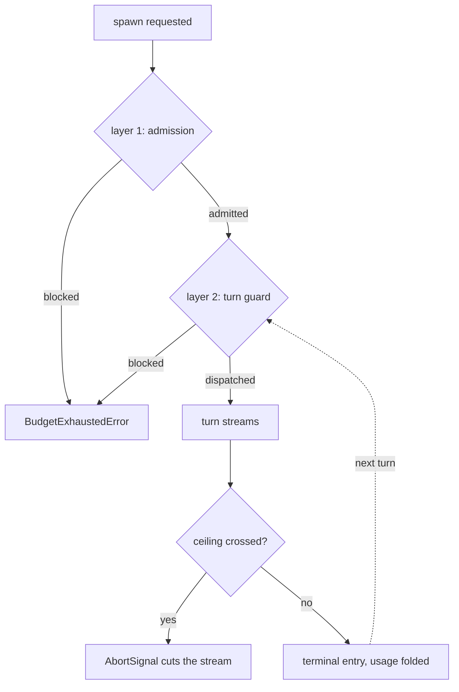

# Budgets and termination

Every Rulvar run can carry an **immutable run budget with pre-dispatch
reservation and a documented, provider-dependent in-flight overshoot bound**:
projected admission denies a spawn whose reserve does not fit before anything
is dispatched, every turn's output tokens are clamped to what the remaining
budget buys, live streams are cut on crossing, and what physically cannot be
prevented (a provider bills the tokens it has already generated) is stated
quantitatively rather than hidden. Enforcement is one budget path shared by
all three [orchestration modes](/guide/orchestration-modes): the same layers
guard a hand-written workflow, a planned script, and a dynamic orchestrator.
This page covers the layers, what happens at the ceiling, the integer counters
that make termination a proof rather than a hope, and how to size all of it.

## The immutable run ceiling

Set the ceiling per run with `budgetUsd`:

```ts
import { createEngine, defineWorkflow } from "@rulvar/core";
import { anthropic } from "@rulvar/anthropic";

const engine = createEngine({ adapters: [anthropic()] });

const review = defineWorkflow(
  { name: "review" },
  async (ctx, args: { pr: number }) => {
    return ctx.agent(`Review PR ${args.pr} and summarize the risks.`, {
      agentType: "reviewer",
    });
  }
);

const handle = engine.run(review, { pr: 42 }, { budgetUsd: 20 });
const outcome = await handle.result;
```

The ceiling (call it B0) is **immutable after start**. No API raises it: not
the run handle, not an operator resolution, not a human-in-the-loop decision.
Restarting the process with a bigger number in config does not work either:
resume accepts no budget parameter, and in adaptive runs the ceiling frozen in
the journal wins, the mismatch producing only a config-drift telemetry event.
If a run needs more money, that is a new run, decided by the host.

A run without `budgetUsd` has no USD ceiling: `ctx.budget.remaining()` returns
`null` and only the structural bounds apply (the engine lifetime cap of 500
spawns per run, the nesting depth limit, and per-agent `UsageLimits`). For
anything that spawns real models against a real account, set a ceiling.

The planner's convenience calls take the same ceilings: `plan(engine, goal,
{ run: { budgetUsd } })` freezes B0 on the planning conversation at its
genesis, and `runPlanned(engine, goal, args, { plan, run })` bounds the
planning leg and the execution leg independently. The bare forms without
options run unbounded; see
[Budgeting the planning conversation](/guide/planner#budgeting-the-planning-conversation).

## The three layers

Each layer answers a different question at a different moment:

| Layer | When | Question |
| --- | --- | --- |
| 1. Admission | Before a spawn | Can this run afford to start the call at all? |
| 2. Turn guard | Before every agent turn | Can this agent afford one more turn? |
| 3. Stream cut | While tokens stream | Has the ceiling been crossed mid-turn? |


```mermaid
flowchart TD
  S[spawn requested] --> L1{"layer 1: admission"}
  L1 -- blocked --> E[BudgetExhaustedError]
  L1 -- admitted --> L2{"layer 2: turn guard"}
  L2 -- blocked --> E
  L2 -- dispatched --> T[turn streams]
  T --> L3{"ceiling crossed?"}
  L3 -- yes --> C[AbortSignal cuts the stream]
  L3 -- no --> OK[terminal entry, usage folded]
  OK -. next turn .-> L2
```

### Layer 1: projected admission before spawn

Admission is **projected**: a spawn is admitted only when

```text
spent + committedReserve + finalizeReserve + proposedReserve <= ceiling
```

holds on **every** account in its ancestor chain, checked atomically before
anything commits. An exact fill is allowed; one dollar past the ceiling is
not. A spawn is never admitted on the argument that the money it needs is
merely not committed yet: the first call under a 0.001 USD ceiling with a
0.01 USD estimate is denied outright, before any provider dispatch or journal
entry. Because a call's true cost is unknown before it runs, admission works
with a reserve, resolved in this order:

```text
reserve = opts.estCost
       ?? profile.estCost
       ?? price(countTokens(input) + min(caps.maxOutputTokens, limits.maxOutputTokensPerTurn))
       ?? 0.50 USD   (engine flat default, budgetDefaults.flatReserveUsd)
```

Two refinements keep estimates honest instead of paralyzing: a child with its
own sub-account ceiling never reserves more than that ceiling (it physically
cannot spend more), and an unpriced model reserves nothing unless you pass an
explicit `estCost` (a dollar reserve would deny work the ceiling cannot bound
anyway; see the unpriced-model section below).

The `countTokens` arm is a provider call carrying the FULL child prompt, so it
is egress exactly like a dispatch, and admission decides before it runs: the
reserve is monotone in the count, so the engine first checks the smallest
reserve any count outcome could produce (the priced floor at zero input
tokens, or the flat fallback the count-failed path admits under) against the
budget, and a spawn that could never be admitted refuses with zero network
calls. The count itself honors the spawn's abort signal (an abort mid-count
cancels the spawn instead of falling back to the flat reserve), and each count
is visible as an `admission.countTokens` log event naming the model and the
counted tokens (or the failure the flat reserve then covers). An explicit
`estCost`, per call or per profile, is the zero-egress path: it skips the
count entirely, which is the right posture for hosts whose privacy gates must
run before any prompt byte reaches a provider.

One case is deliberately NOT clamped away. When a PlanRunner `add_task` op
declares an explicit `budgetUsd` and the resolved profile's `estCost` cannot
fit it, the op is bounced at `plan_revise` time with the typed reason
`reserve_exceeds_budget` naming the child account, the requested and resolved
reserve, the ceiling, and the minimum correction. Nothing changes in the plan
and no spawn unit is consumed: the host's own estimate says the budget cannot
buy the work, so the orchestrator gets to fix the number instead of paying for
a child that would be cancelled mid-task. Heuristic reserves (the flat default
or the priced estimate) never bounce an op this way; they clamp to the child's
allowance, and an admitted op is guaranteed dispatchable under the same budget
snapshot, including every op of a multi-op revision. A dispatch refused by
facts that changed after admission lands the node terminally `failed` through
a journaled `plan.decision` instead of stranding it.

Reserves ride the journaled admission decision entry, so on resume they are
recovered from the journal, never re-estimated: a price-table change between
crash and resume does not move an already-committed number (see
[Durability](/guide/durability)).

You can tighten admission per call or per profile with an `estCost` hint:

```ts
// A short classification call should not reserve a full maxOutputTokens
// worth of budget.
const label = await ctx.agent("Classify: build failure on main after merge", {
  agentType: "classifier",
  estCost: 0.05,
});
```

Every number feeding admission is validated at its intake with a typed
`ConfigError`: `estCost` and `flatReserveUsd` must be finite and nonnegative,
`budgetUsd` likewise, `childBudgetFraction` must be a fraction in (0, 1],
`lifetimeSpawnCap` a nonnegative integer, and `maxDepth` an integer within the
hard ceiling. A negative or NaN hint used to SHRINK the committed reserve
total and let a sibling spawn through a ceiling it did not fit; now the
malformed value is refused before any journal entry or dispatch, and the
admission gate itself refuses a non-finite reserve as a backstop even when the
number came from an adapter's token estimate rather than a host option.

### Layer 2: the per-turn guard and the output bound

Before every agent turn the runtime checks the agent's own sub-account. A turn
that would cross the sub-account ceiling is never dispatched; the blocked
primitive throws the typed `BudgetExhaustedError` (error code
`budget_exhausted`). Nothing is sent to a provider, so a blocked turn costs
zero.

Every dispatched turn also carries a **derived output bound**: the request's
`maxOutputTokens` is clamped to
`min(model capability, limits.maxOutputTokensPerTurn, budget-derived limit)`,
where the budget-derived limit is what the tightest remaining ceiling in the
account chain still buys at the serving model's output price (long-context
tiers included), after a heuristic estimate of the prompt's input cost. This
makes the marginal turn's output spend deterministic even for providers that
report usage only at the end of the stream. Every dispatch also respects the
serving model's **output floor** (`ModelCaps.minOutputTokensPerTurn`, one when
the adapter declares none): OpenAI's Responses API rejects `max_output_tokens`
below 16, so a below-floor request is a guaranteed provider 400, and the v1.74
comparison run's terminal repair died exactly there, dispatched at one token.
When the remainder cannot buy the floor at zero input, the turn is denied
exactly like the turn guard; when only the heuristic prompt estimate says the
turn does not fit, the turn dispatches AT the floor and the exact layers
settle the difference. A configured `limits.maxOutputTokensPerTurn` below the
serving model's floor is a typed `ConfigError` before any wire call (the
provider would reject every request), and `preflightEstimate` reports the same
configuration as the error finding `output-cap-below-provider-minimum` before
the first paid call. Unpriced models have no output bound; the ceiling cannot
bound them at all (see below).

### Layer 3: cutting live streams at the ceiling

Layers 1 and 2 work on estimates; only layer 3 sees actual spend as it
happens. When a ceiling is crossed while responses are streaming, the engine
severs the live streams with an `AbortSignal`. The usage accumulated from
stream deltas up to the cut is written to the journal with
`usageApprox: true`: the partial spend is counted, and the flag records that
the number came from a severed stream rather than a provider's final usage
report.

### Bounded overshoot: one clamped turn, and why not less

The worst-case overshoot past the ceiling is **at most one in-flight turn per
concurrent agent**, and the output side of that turn is not open-ended: the
derived output bound clamps each request's `maxOutputTokens` to what the
remaining budget bought at dispatch time. What remains provider-dependent is
unavoidable: once a turn has been dispatched, the provider bills the tokens it
streams whether or not you read the stream to its end. Cutting mid-stream
(layer 3) stops the meter as early as the provider's incremental usage
reporting allows, but the tokens already generated are owed, and a provider
that reports usage only at the end of the stream is bounded by the clamp
alone.

Practical consequence: the worst case scales with concurrency, because every
concurrent agent's turn was clamped against the same remainder. At the default
per-run concurrency of 12, up to 12 agents can be mid-turn when the ceiling is
crossed, so size B0 with roughly one turn of headroom per concurrent agent, or
lower the per-run concurrency where the ceiling is tight.

### The opt-in in-flight exposure cap

`RunOptions.maxInFlightExposureUsd` bounds the concurrency scaling itself. The
per-turn guard checks money already **spent**, so N concurrent turns each pass
it before any settles; with the cap configured, the admission additionally
holds each turn's own worst-case estimate (the prompt estimate plus the
request's effective output allowance, priced by the same rows as settlement)
from right before the provider call until the attempt settles. A dispatch
whose estimate does not fit `spent + finalize/synthesis reserves + live
estimates` within the cap is refused with a typed `BudgetExhaustedError`
(`data.reason 'in-flight-exposure'`, message prefix
`in flight exposure cap reached`) instead of waiting, and the refused agent
settles as a budget error while everything already admitted continues; the
refusal is transient, so it never marks the run exhausted and never severs a
stream. Worst concurrent overshoot past the cap is thereby the estimate error
of the in-flight turns, not one whole turn per agent. The cap is off by
default (wire traffic and journals stay byte-identical), applies at the run
root, and reserves zero for models without a price row exactly as they debit
zero. Since RV1504 the cap is recorded in `RunMeta` at genesis and restored on
every resume, exactly the ceiling's rule: the seventeenth comparison benchmark
named the silent uncapping of resumed segments its top FinOps gap, and a run
now keeps the exposure bound its original invocation declared for its whole
life, with `ResumeOptions` deliberately carrying no field to override it. A
run started without the cap stays uncapped, a journal recorded before the
field shipped (or read through a store that drops optional `RunMeta` fields)
resumes uncapped exactly as before, and the conformance kit holds stores to
the round-trip. One honest asymmetry remains: `limits` stay operational per
invocation, so a resumed segment that does not re-supply them prices its turn
estimates from the model's full output allowance, and a tight restored cap
then refuses dispatches the original segment's clamped estimates would have
admitted; that direction is fail closed, never silent uncapping.
[Preflight](#the-preflight-estimator) reports a configured cap as
the `in-flight-exposure-cap` finding beside the `overshoot-exposure` number it
bounds.

### Auditing spend per budget account

`accountSpendFromJournal` (RV1505, the audit half of the DEF-7 remainder)
folds the same settled entries the cost report folds into each budget
account's INCLUSIVE spend, with the account tree read from the journaled
spawn-admission decisions, so a host can hold any orchestrator cap or child
allowance against what its subtree actually spent, after the fact and on a
plain stored journal. Abandoned subtrees contribute zero and unpriced slices
contribute zero, exactly like the net total. What it deliberately does NOT do
yet is seed re-opened accounts on resume: a rerun of a journaled invocation
re-admits with exact-fill arithmetic today, so spend-at-reopen would refuse
the continuation of the very work the money was spent on; the reopen seeding
lands together with a seed-aware rerun re-admission, and until then a resumed
sub-account's projected admissions keep the historical amnesia the fold makes
visible.

### The strict pre-egress pricing gate

`RunOptions.strictPricing` (RV1508) closes the unpriced-model hole below for
runs that must not tolerate it. Armed (`true`, or the object form), every paid
dispatch must resolve a well-formed price row for its serving model BEFORE the
wire call, at the same dispatch chokepoint the exposure admission holds, or
the dispatch refuses with a typed `ConfigError` naming the model and the
defect: no row resolves, a rate is non-finite or negative, or a long-context
tier is malformed. `maxRatesAgeDays` additionally demands a fresh
`ratesVerifiedAt` on the row (absent, unparsable, or older than the bound
refuses), because a stale price bounds the ceiling with yesterday's truth; the
freshness bound binds only when declared. `allowUnpriced` lists the exact
model refs the host KNOWS are free (a local model is honestly unpriced), the
one explicit exception. Each model is vetted once per run, since the price
table is fixed for the run's life. The posture is recorded in `RunMeta` at
genesis and restored on every resume, the exposure cap's rule (RV1504), with
the store conformance kit holding stores to the round-trip; off by default,
dispatch behavior stays byte identical, and the hole below stays the
documented honest answer.

### The one thing the ceiling cannot bound: a model with no price

All three layers work in dollars, and dollars come from the price table. A model
absent from it prices as `undefined`, which debits **nothing**, so a USD ceiling
does not bound it at all. For a local model that is the honest answer, since it
costs nothing to run; for a hosted model whose price row is merely missing it is
a hole, and the engine will not let it pass in silence: the first time an
unpriced model spends under a run that has a ceiling, the run emits a
warning-level `log` event naming the model and saying plainly that the ceiling
does not bound it. Its usage still surfaces under
[`CostReport.unpriced`](#cost-reports) either way, never as a silent zero.

Give the model a price row through `createEngine({ pricing })` to bring it back
under the ceiling. See
[The versioned price table](/guide/model-routing#the-versioned-price-table).

### A CostReport is an estimate, not an invoice

Dollars are computed from normalized usage at the table's **base** rates. The
report does not model provider billing modifiers such as batch discounts,
regional or data-residency multipliers, or premium serving modes; if your
account pays a modified rate, encode it in your own versioned table rows (a
single multiplier applied to every field of a row keeps the arithmetic exact).
The same applies in reverse: prices are never fetched from the provider at run
time, and a row never switches by wall clock inside a run. A price change is a
new table with a new `pricingVersion`, and runs priced from the adapter caps
fallback journal the version as `unpriced`, which is precisely why passing a
versioned table is recommended for anything whose journals outlive a deploy.

### The three moneys of one run {#the-three-moneys}

Every dollar figure rulvar shows is one of exactly three quantities, and the
vocabulary matters because the twelfth comparison run burned a day confusing
them: the dashboard headline disagreed with the run's own number while the
provider's billing categories confirmed it to the cent.

**Recorded money** is what the run reported as spent: settled history priced
under the `pricingVersion` pins its own settles recorded, never re-priced by a
later table rotation. It is the number the outcome's `CostReport` carries,
`rulvar inspect` prints from the journal, and the pinned rows of
`rulvar invoice` itemize per call. Two runs over the same journal report the
same recorded money forever. The live ledger debits the same quantity as it
accrues: mid-stream usage reaches the ceiling with its cache-write TTL split
intact (RV1001), so the dollars a ceiling holds against are the dollars
settlement records, never a cheaper reading of the same provider usage.
Since RV1001 that is a proven invariant, not an aspiration: the live debit
and the settled fold price one provider usage to the same dollars, and the
`ttl-live-budget-parity` [kit scenario](/guide/evals#the-fault-injection-kit)
gates the equality on the real live path in every release. The equality holds
per provider call, not per slice (RV1101): the live ledger debits each call
marginally against the call's own accumulated price, so a long-context tier
crossed by the call's sum re-prices the whole call at the crossing slice even
when no single mid-stream slice reached the threshold, exactly the dollars
settlement will record; the tier still never fires on a run aggregate no
single call crossed, because settlement's billing basis is the provider call.
The `tier-crossing-live-parity` kit scenario gates that arc.

**Docs estimate** is a repricing at the current versioned table, the rates the
provider's documentation pages publish: what work is *expected* to cost under
today's table. It is the number `preflightEstimate` and `rulvar preflight`
project before the first paid call, and the number `rulvar invoice` prints for
any usage past the last pin. It moves when the table rotates; recorded money
does not.

**Provider bill** is what the provider's meter actually charged, and only one
surface can claim it: a statement reconciliation over saved per-request or
per-component exports
([`reconcileStatement`](/guide/providers#openai-statement-reconciliation)).
A dashboard headline is not the provider bill (it is eventually consistent and
refused typed); a docs estimate is not the provider bill either, because a
documented rate and a metered rate are different authorities. When the three
disagree, the reconciliation names the component and the implied actual rate
that moved.

Rates connect the three in one direction only: the weekly audit compares the
seeds against the documented pages, a confirmed change ships as its own
release with a new `pricingVersion`, and only runs started after that release
record under the new pins. Audit, then release, then new pinned runs; recorded
history keeps the pins its settles wrote, and no figure is ever rewritten in
place. See [rate verification and
drift](/guide/providers#rate-verification-and-drift) for what a seed's
`ratesVerifiedAt` date does and does not claim.

## Sub-accounts and the account tree

Budget accounts form a tree with the run root at the top. A child workflow
started through `ctx.workflow` gets its own sub-account holding a fraction of
the parent's remainder (`childBudgetFraction`, default 0.3, computed after
subtracting the parent's finalize reserve). A dynamic orchestrator gets its
own account too (below). Spend in any account propagates upward to every
ancestor, so the root ceiling remains the single true invariant no matter how
deep the tree grows.

Workflows can read their own account at any time:

```ts
const spent = ctx.budget.spent();       // { usd, usage, agentsSpawned }
const left = ctx.budget.remaining();    // null when the run has no USD ceiling

if (left !== null && left.usd < 2) {
  ctx.log("warn", "budget low, skipping the deep-analysis pass", {
    usd: left.usd,
  });
}
```

::: info Sandbox dialect
Inside the worker sandbox used for planner-generated scripts the same reads
are asynchronous: `await budget.spent()`. A synchronous cross-thread read does
not exist.
:::

## Exhaustion is an outcome, not an exception

At the ceiling, every ctx primitive throws `BudgetExhaustedError`. You
normally let it unwind: the engine recognizes it and reports the run outcome
`'exhausted'`, overriding `'error'`.

```ts
const outcome = await handle.result;

switch (outcome.status) {
  case "ok":
    console.log(outcome.value);
    break;
  case "exhausted":
    // Paid partial work is preserved and addressable.
    console.log(`spent ${outcome.cost.totalUsd} USD before the ceiling`);
    console.log(`${outcome.dropped.length} calls dropped`);
    console.log(`${outcome.pending.length} externals still open`);
    break;
}
```

Exhaustion is never a bare null. The outcome always carries the full cost
report, the `dropped` list (every loss with its error and scope path), and the
`pending` list of open suspensions. Under `onError: 'null'` a blocked call
yields `null` at the call site with a recorded drop, and the run continues
until the ceiling blocks everything; the terminal outcome is still
`'exhausted'`. In an adaptive run that hits the orchestrator cap, the
`exhausted` outcome carries a deterministically synthesized partial value
(next sections). And because everything paid is journaled, the partial work
stays addressable after the run settles and is never paid twice.

## The termination account

Dollars bound spend, but dollars alone do not bound iteration: an adaptive run
replanning in tiny cheap steps could loop for a very long time inside its
budget, and test runs against fake adapters cost zero dollars entirely.
Adaptive [PlanRunner runs](/guide/adaptive-orchestration) therefore add a
per-run termination account: integer counters frozen at start, spent and never
refilled.

At run admission the frozen limits vector is written into the journal as a
`termination.init` entry:

| Limit | Default | What it bounds |
| --- | --- | --- |
| `maxRevisionsPerRun` | 32 | Plan revisions: minus 1 per journaled revision, regardless of diff size |
| `maxTotalSpawns` | 128 | Admitted spawns of any origin |
| `maxEscalationsPerLogicalTask` | 2 | Escalations per logical task, counted across respawns via lineage |
| `maxDepth` | 1 (hard ceiling 4) | Nesting depth |
| `kMax` | derived | The longest declared model ladder in the profile registry snapshot |
| `runBudgetUsdCeiling` | host-set | B0 itself, frozen alongside the counters |
| `orchestratorCapUsd`, `finalizeReserveUsd` | derived | The orchestrator budget (next section), frozen in the same vector |

The account is **debit-only by construction**: no credit operation exists in
the API, no journal entry kind carries a credit, and the frozen vector cannot
be edited after start. Growing the plan does not grow the revision budget;
abandoning work reclaims dollars but never returns counters.

The two dollar fields freeze the values the engine resolves strictly before
the extension boots, and the `orchestrator_budget_reserve` decision that
follows refers to the same immutable dollars. On resume the frozen dollars
win over live options: a diverging `capUsd`, `capFraction`, or
`finalizeReserveUsd` emits `termination:config-drift` and is never honored.
Journals recorded before v1.8 store `0` for both fields ("not yet resolved");
for those journals the reserve decision is the authority, and they replay
unchanged.

The reserve decision also pins the `pricingVersion` in effect when the run
started (`unpriced` when the run priced from the adapter caps fallback).
Unlike the cap dollars, price interpretation of NEW work is live: dollars for
work a resumed segment performs are priced at the current table against the
same frozen cap. Settled history is not re-priced (RV505 and RV801): the
resume seed and every reporting fold price already-settled segments under the
pins their own settles recorded, so a table rotation changes what new work
costs, never what the run already reported as spent. A live table whose
version differs from the journaled one emits `termination:config-drift` with
field `pricingVersion`, **reported, never honored or refused**, and the
replay itself stays byte-identical with zero repeated provider work.
Decisions journaled before the field shipped resume quietly.

Usage SEMANTICS drift is handled the same visible-never-silent way: every
new usage-bearing entry is stamped with the serving adapter's declared
`usageSemantics`, and resuming a journal whose unstamped OpenAI entries
carry cache writes (the shape rulvar v1.19.0 recorded with inflated
inputs) emits a one-time `RULVAR_LEGACY_CACHE_SEMANTICS` warning. The
recorded debits stand as recorded: overstated legacy spend consumes MORE
of every ceiling, the conservative direction, so a continuation can
exhaust early but never overspend. Start a fresh run or raise the ceiling
deliberately if that bites; the [audit
helpers](./providers#openai-legacy-cache-journals) quantify the exact
delta without touching the journal.

Wakeups need no counter of their own: every orchestrator wake is a paid turn
against the capped orchestrator sub-account, so the number of wakes is bounded
by the usable cap (cap minus the finalize reserve) divided by the minimal cost
of one turn.

This yields the termination guarantee: every edge of the composite
escalate-replan-retier loop carries exactly one debiting decision entry, and
each debit strictly decreases a finite variant over the remaining units. The
loop therefore makes finitely many iterations, and **every run settles to a
terminal outcome** in a finite number of live calls, at a spend no higher than
B0 plus the bounded overshoot. The integer counters give termination even at
zero model cost; dollars remain an independent safety ceiling, never the only
argument.

When a counter would go below zero the debit is not executed: the engine
journals the denial and surfaces a typed error (for example
`revision_budget_exhausted`) to the orchestrator as an ordinary tool error.
Denials never tear the run down, and a denied call does not debit, so spamming
a denied tool costs turns, not counters.

Freeze the knobs per run through the plan options:

```ts
import { orchestratePlanned } from "@rulvar/plan";

const handle = orchestratePlanned(
  engine,
  "Migrate the API surface to v2",
  {
    budget: { capUsd: 4, finalizeTurns: 2 },
    plan: {
      maxRevisionsPerRun: 16,
      limits: { maxTotalSpawns: 64, maxEscalationsPerLogicalTask: 2 },
    },
  },
  // The ordinary engine RunOptions of the created run: budgetUsd is the
  // ROOT hard ceiling over the whole tree, immutable after start.
  { budgetUsd: 25 },
);
```

The fourth argument is the run's `RunOptions`, exactly what `engine.run` takes: `budgetUsd` there is the root hard ceiling over the orchestrator **and every child**, while `budget.capUsd` above only shapes the orchestrator's own sub-account inside it. `orchestrate` from `@rulvar/core` accepts the same fourth argument. Without it the created run has **no root ceiling**: the sub-account cap alone does not bound the children.

Runs without the PlanRunner extension (modes a and b, and plain dynamic
orchestration) write no termination entry and carry only the engine lifetime
cap (default 500 spawns), the depth limit, and the three budget layers.

## The orchestrator budget sub-account

The orchestrator agent of a dynamic run spends money too: every one of its
turns is an LLM call. It therefore gets its own sub-account with a hard cap:

```text
effectiveCap = min(capUsd, capFraction x B0)     // capFraction default 0.2
```

::: warning An explicit capUsd is still bounded by the default fraction
`capUsd` never replaces the fraction bound; the two always meet in the min.
Under `budgetUsd: 0.90`, `budget: { capUsd: 0.70 }` yields
`min(0.70, 0.2 x 0.90) = 0.18`: the ceiling that ends the orchestrator is the
default fraction, not the number you wrote. When `capUsd` should be the sole
bound, pass `capFraction: 1.0` alongside it. The engine emits a `log` warning
at orchestration start whenever an explicit `capUsd` gets bounded this way,
and budget exhaustion errors name the account that actually crossed (its
scope, ceiling, spend, and reserves, plus the run root state) instead of
blaming the run ceiling.
:::

Configure it through the `budget` option of `orchestrate` or
`ctx.orchestrate`:

```ts
const research = defineWorkflow(
  { name: "research" },
  async (ctx, goal: string) => {
    return ctx.orchestrate(goal, {
      budget: { capFraction: 0.15, atCap: "finish-with-partial" },
    });
  }
);

const handle = engine.run(research, "Map the dependency risks", {
  budgetUsd: 20,
});
```

Under the PlanRunner extension, an unresolvable cap (a run with no USD ceiling
and no explicit `capUsd`) or a cap smaller than the finalize reserve refuses
to start with the typed `OrchestratorCapConfigError`, before the first LLM
call and before any journal entry; a plain dynamic run whose cap resolves to
no bound simply opens no sub-account. Opting out of the cap is explicit only:
`capFraction: 1.0` sets the sub-account ceiling to the full B0 and emits
nothing, while any fraction above 1.0 is refused with the same typed error. A
nested orchestrator is additionally clamped by the parent account's remainder
minus the parent's finalize reserve.

Three details make the cap safe rather than merely present:

- **The synthesis reserve (v1.80).** With a [synthesis invocation](/guide/orchestration-modes#the-synthesis-invocation) configured, the opt-in `budget.synthesisReserveUsd` holds absolute dollars out of the sub-account while the coordination loop runs: spawn admission and the per-turn output clamp treat the hold as spent, so neither the coordination's own turns nor child spawns can eat the money the synthesis finish needs, and the hold is released to the synthesis invocation just before it dispatches. A reserve at or above the effective cap refuses to start with the typed `OrchestratorCapConfigError`; the option requires `synthesis` (single mode) and changes budget arithmetic only, so absent it every account stays byte identical. Preflight prices the contract's minimal accepting payload and reports `synthesis-reserve-unfunded` when the hold is missing or too small.
- **The reserve lifecycle (RV304).** A configured reserve reports its whole life: `{ configuredUsd, heldUsd, releasedUsd, remainingBeforeSynthesisUsd?, consumedUsd }` is frozen into a journaled decision (`orchestrator_synthesis_reserve`) when the synthesis invocation settles, emitted as a `log` info event (`orchestrator synthesis reserve lifecycle`), and, when [acceptance](/guide/orchestration-modes#acceptance-the-child-completion-policy) is configured, attached to the result envelope as `synthesisReserve`. `heldUsd` is what actually registered on the cap account, so `heldUsd: 0` under a configured reserve names the silently inert case (no cap resolved, nothing was ever held); `remainingBeforeSynthesisUsd` is the chain headroom the invocation saw right after the release, and `consumedUsd` its own priced spend. A resume reads the frozen decision instead of recomputing, so the facts never drift; without a configured reserve nothing is journaled, emitted, or attached, byte for byte.
- **The finalize reserve.** At admission the engine journals a decision entry
  fixing `finalizeReserveUsd` in absolute dollars (explicit, or `finalizeTurns`
  times the estimated turn cost; default 2 turns). The reserve is registered
  as committed simultaneously in the orchestrator account **and** the run
  root, so no child spawn can ever eat the money needed to finish, even when
  the working part of the run ends exhausted.
- **The at-cap protocol.** Crossing the soft boundary journals one cap
  decision, then (default `atCap: 'finish-with-partial'`): running children
  finish (killing them would overpay), new plan revisions become impossible,
  and at quiescence the orchestrator gets one final wake, paid from the
  reserve, with a single `finish` tool. A successful finish yields outcome
  `ok` with a `forcedFinish` mark in the cost report, and the value is the
  completion envelope `{ result, completion }` (RV906): `completion` is
  `'partial'` unless the finish provably passed the FULL declared contract.
  Declared [finish validators](/guide/orchestration-modes#validating-the-finish-result)
  bind the reserved finalizer exactly like any other finish (on capped runs
  synthesis never runs, so this finish IS the final output they must judge),
  and an accepted verdict with no declared
  [acceptance policy](/guide/orchestration-modes#acceptance-the-child-completion-policy)
  reads `completion: 'complete'`: a valid early finish is honestly complete.
  A declared acceptance policy is never judged at the cap, so with one
  declared the terminal stays `'partial'`; the engine lifts the literal onto
  `run:end` and the outcome mirror either way, so a consumer reading only
  `status: 'ok'` can no longer execute a truncated plan as a full success. A
  finalizer finish the validators reject never becomes the run value. If the
  finalizer fails, the engine synthesizes a deterministic partial result from
  the journaled plan state with zero LLM calls, and the run ends `exhausted`
  with a non-null value itself carrying `completion: 'partial'`. The sole
  alternative is `atCap: 'fail-run'`: the reserved finalizer
  is skipped entirely and the run fails with outcome `error` carrying
  `FailRunError` (code `fail_run`, `data.source: 'orchestrator_budget_cap'`,
  `data.capDecisionRef`). The journaled cap decision freezes the chosen
  policy, so a crash between the decision and its effect rolls the SAME
  outcome forward on resume with no second decision and no model call, even
  when the live options disagree; a resume that finds the finalize terminal
  (or the fallback decision) already journaled reuses that recorded effect
  and reproduces the identical honest terminal with zero paid calls.

Every numeric field of the budget spec validates before any journal entry,
provider call, or child dispatch: `capUsd` and `finalizeReserveUsd` are finite
numbers `>= 0`, `capFraction` is a fraction in `(0, 1]` (zero does not lift
the cap; it would make every turn unpayable), `finalizeTurns` is a positive
integer, and `atCap` must be exactly one of the two literals even at a plain
JS/JSON boundary. A malformed value is a `ConfigError`; a NaN previously
disabled the comparisons silently, and a negative `finalizeReserveUsd`
WIDENED the soft boundary instead of reserving from it.

The orchestrator is never woken up about its own spend (waking it would cost
more of it); instead every wake digest carries a passive budget block with run
and orchestrator spend, the cap, the reserve, and a soft-warning flag at 80
percent of the usable cap. Run-level `budget_threshold` wake triggers fire at
50 and 80 percent of B0 (fixed in v1). Admission stays accurate here too: a
capped orchestrator reserves exactly its effective cap, and the forced-finish
agent reserves exactly the finalize reserve, so a small run ceiling is not
starved by an oversized default reserve.

## Cost reports

Every settled run, whatever its status, carries a complete `CostReport` in
`outcome.cost`:

| Field | Contents |
| --- | --- |
| `totalUsd` | Total priced spend of the run |
| `byModel` | Keyed by canonical `adapterId:model` |
| `byPhase` | Buckets by `ctx.phase` name (innermost enclosing phase) |
| `byAgentType` | Buckets by agent profile |
| `byRole` | Buckets by invocation role (loop, plan, orchestrate, extract, finalize, summarize); every paid phase lands in its own bucket even when one model serves several phases of one agent, and entries journaled before per-role slices shipped fold under their primary role |
| `orchestrator` | `spentUsd`, `share`, `wakes`, `forcedFinish`, `reserveUsedUsd`; all-zero in runs without a dynamic orchestrator |
| `unpriced` | Usage on models absent from the price table; surfaced, never a silent zero |

The report is a pure fold over the usage of terminal journal entries in spawn
order: wall clock participates nowhere, entries under abandoned subtrees are
excluded (their spend is tracked separately in the abandoned-spend ledger the
orchestrator sees), and a replayed run reports the same numbers
byte-for-byte. Live budget telemetry and the event stream are covered in
[Observability](/guide/observability).

## The preflight estimator

Every number above is derived by the engine at run time; `preflightEstimate` computes the same numbers from the configuration alone, before any provider dispatch. It is a pure function: no engine is constructed, no store is opened, no journal entry is written, and the only adapter surface it touches is the pure `caps()` lookup, so a preflight can never pay for a token. The estimate is kept from drifting by reusing the runtime's own functions rather than modeling them: `mergeUsageLimits` for the per-spawn limit merge, `admissionReserveUsd` for the layer-1 reserve formula, the same price resolution as settlement, the shared-quota dimension match, and for orchestrate waves the two shared admission formulas the live paths themselves call: `dispatchProjectionReserveUsd` (the embedded spawn gate) and `orchestratorAdmissionEstCostUsd` (the capped orchestrator's exact-fill dispatch hint). Parity tests run a live engine beside the estimate for plain waves and orchestrate waves alike.

```ts
import { preflightEstimate } from '@rulvar/core';

const report = preflightEstimate({
  engine: engineOptions,
  run: { budgetUsd: 1.2 },
  spawns: [
    { label: 'ingest', estCost: 0.5 },
    { label: 'normalize', estCost: 0.5 },
    { label: 'risk', estCost: 0.5 },
  ],
});
// report.admission.wave names which spawns admit and which are denied;
// report.findings carries the linter verdicts, most severe first.
```

The report is plain JSON-serializable data:

- **`spawns`**: the effective merged `UsageLimits` per declared spawn (the same call-over-profile-over-engine merge the runtime applies), the resolved serving model, the admission reserve with the arm of the formula that produced it (`estCost`, the profile's `estCost`, the priced estimate from `estInputTokens`, the flat default, or the unpriced-model zero), the per-turn output bound, the one-turn cost floor, the per-tool executed-call ceilings with the limiter that provides each (`maxCallsPerTool`, `toolUnits`, or `maxToolCalls`), and the loop's provider-turn ceiling `projectedProviderTurns` (`maxTurns` bounded by the executed-call ceiling plus its final no-tool turn, plus the finalization summary turn when a tool budget limiter arms it). Every provider turn is one wire request and one quota reservation, so the turn ceiling is the per-spawn multiplier of quota demand; retries sit on top of it.
- **`admission`**: the projection over the declared wave in order: which spawns admit, which are denied, and by what (`budget`, `spawn-cap`, or `orchestrator-max-spawns`). A plain wave mirrors `admitSpawn` exactly (exact fill admitted, one dollar past the ceiling denied, a denial committing nothing). An orchestrate wave mirrors the runtime's TWO gates per spawn: the embedded layer-2 spawn gate first (`dispatchProjectionReserveUsd`: the declared estimate or the flat default clamped by the spawn's explicit `budgetUsd`, against the remainder net of everything already held; the gate never sees the priced estimate, exactly like the runtime), then the layer-1 chain commit. The orchestrator agent itself admits first: a CAPPED orchestrator admits at exact fill by construction (its dispatch estimate is `orchestratorAdmissionEstCostUsd`, the effective cap minus the committed finalize carve-out, and that reserve stays held while the wave spawns), an uncapped one runs the same reserve chain every spawn runs (feed `orchestrator.estInputTokens` as the goal-prompt stand-in). Only a plan-extension orchestration subtracts the finalize reserve from spawn headroom, exactly like the boot path. In an orchestrate wave, declare a spawn's `estCost` as the agentType PROFILE's estimate (a spawn tool has no per-call estimate channel) and its `budgetUsd` as the spawn param (it clamps the layer-2 gate only; a dynamic spawn's budget never becomes an account).
- **`budget` and `exposure`**: the echoed defaults (flat reserve, lifetime spawn cap, child fraction, depth), the orchestrator's effective cap (`min(capUsd, (capFraction ?? 0.2) x ceiling)`) and finalize reserve plus its own `projectedProviderTurns`, the maximum concurrent in-flight turns, the per-provider first-wave request and token floors at the declared estimates, the one-more-turn overshoot floor past a ceiling crossing (the documented bound is one turn per in-flight agent; real turns grow with the prompt, so the floor is a floor), and `exposure.runCeiling`: the whole declared wave (the orchestrator and, when declared, the separate synthesis invocation included) run to its turn ceilings at the declared estimates, as total provider calls (fan-out times per-spawn projected turns, before any retries) and cumulative tokens with the context regrowing every turn (turn k re-sends the declared prompt plus the k-1 prior output bounds, so a K-turn loop costs `K x est + outputBound x K(K+1)/2`). A declared `orchestrator.synthesis` projects the RV-211 invocation too (its own limits or the default four-turn budget, servedBy from `routing.synthesize` or the declared model override, echoed at `budget.orchestrator.synthesis`; the v1.71 experiment's projection stopped at the coordination loop and undercounted exactly those turns), and a declared `finishValidation.repairTurnReserve` folds the repair headroom into the projected turns of the invocation the validators bind: the synthesis invocation when one is declared, the coordination loop otherwise.
- **`findings`**: the linter verdicts, sorted most severe first, each with a stable kebab-case `code`. Errors mean the run cannot start or admits nothing (`unrouted-role`, `unknown-profile`, `nothing-admitted`, `orchestrator-cap-below-finalize-reserve`, `output-contract-validator-mismatch`, `output-contract-validator-weakened`, `output-cap-below-provider-minimum`, `output-contract-turn-infeasible`); warnings mean the run will not do what the numbers suggest (`partial-admission`, `weighted-units-bind-first`, `tool-unaffordable`, `unpriced-under-ceiling`, `inert-finalization-reserve`, `inert-tool-budget-notices`, `inert-tool-budget-extension`, `inert-finalization-window`, `finalization-window-covers-cap`, `finalization-window-empty-allowlist`, `finalization-turns-covers-max-turns`, `turns-bind-before-tool-budget` when no turns reserve exists, `bare-tool-cap`, `tool-cap-below-evidence-floor`, `orchestrator-cap-fraction-bound`, `tool-cap-before-checkpoint`, `synthesis-evidence-asymmetry`, `synthesis-terminal-tool-headroom`, `draft-gate-below-contract`, `synthesis-reserve-unfunded`, `output-contract-turn-headroom`, `repair-reserve-unfunded`, the quota-window comparisons); infos are transparency (`overshoot-exposure`, `no-usd-ceiling`, `no-quota`, `per-tool-cap-unreachable`, `tool-budget-extension-exposure`, `capped-children-without-salvage`, `in-flight-exposure-cap` when [the RV711 cap](#the-opt-in-in-flight-exposure-cap) is configured). `tool-cap-below-evidence-floor` (RV303) fires when a spawn (or its registered profile) declares an `evidenceContract` whose call floor (`minEntries * estCallsPerEntry + overheadCalls`, defaults 3 and 8) does not fit under the effective executed-call ceiling, extension grants included; the recommended posture over all of these lives in [the agents guide](/guide/agents#the-recommended-tool-budget-posture). `bare-tool-cap` names the seventh comparison experiment's failure shape: a positive `maxToolCalls` or a `toolUnits` budget with no softener at all (no notices, no extension, no finalization reserve or window) expires as a silent hard `limit` the model never saw coming; a cap of `0` is a deliberate no-tools spawn and stays quiet. `turns-bind-before-tool-budget` (RV1406) is the seventeenth experiment's mirror on the other axis: when `maxTurns` fits fewer serial executed calls (one per turn, plus the final answer turn) than the effective executed-call ceiling, extension grants included, the turns axis binds first; it warns while no [`finalizationTurns`](/guide/agents#the-finalization-window) reserve exists (the expiry would be a silent mid-work `limit`) and downgrades to info once one does, and it never stops a run, because parallel batches legitimately stretch the serial floor. `capped-children-without-salvage` (info, orchestrate waves with a DECLARED `acceptance`) relates capped children to the salvage arms: with both `acceptPartialChildren` and `acceptValidatedTerminalOutputOnLimit` off, a child that expires settles `limit` and counts against the policy with nothing to salvage. `tool-cap-before-checkpoint` names a durability exposure, not a limiter mistake: the runtime checkpoints once per COMPLETED tool turn, so on a parallel-tools model the whole tool budget can burn inside the first batch before any checkpoint exists, and a kill mid-batch re-pays every executed call on resume; serial models keep the loss window at one call and stay silent, and the opt-in [`checkpointEveryToolCalls`](/guide/agents#the-mid-batch-checkpoint-boundary) (RV408) bounds the window (a cadence below the executed-call ceiling silences the finding). A tight orchestrator cap is NOT an error: the capped orchestrator admits at exact fill, so a cap below the flat reserve is a tight loop budget, never a refused run (v1.63.0 wrongly errored `orchestrator-cap-below-reserve` there; the code is gone).

The quota comparison follows the run past the first wave. The first-wave checks (`quota-requests-below-wave`, `quota-tokens-below-wave`) compare the declared dispatches and their single-turn token floors against each rule's window: a wave that alone exceeds the window is the certain diagnosis and fires only those. When the wave fits but the loops cannot, the run-ceiling checks fire instead: `quota-requests-below-run` when fan-out times the per-spawn turn ceilings projects more wire requests than `requestsPerMinute` admits (the message names about how many windows the run needs at best), and `quota-tokens-below-run` when the cumulative demand with per-turn context regrowth exceeds `tokensPerMinute`. `quota-turn-never-fits` is the sharp one: when by some turn k the context-grown reservation `est + k x outputBound` alone exceeds the whole token window, the limiter denies that dispatch with `retryAfterMs 0` (no wait helps) and the invocation fails after paying for the earlier turns. The experiment run behind this projection had zero preflight quota findings and eleven live limiter denials; the run ceiling is what would have said so before the first dispatch.

The programmatic input also accepts `finishValidation: { validators, contract?, selfTest? }` (validator functions cannot ride a JSON config, so the CLI never carries it): preflight then runs the SAME golden self test [the orchestrator runs at construction](/guide/orchestration-modes#the-output-contract) and reports every drift as the error finding `output-contract-validator-mismatch`, a contract validator missing from the configured set and a stale validator rejecting the golden skeleton alike; since v1.78 the self test also runs the contract's per-validator reject goldens, and a configured validator weaker than the contract's own (a same-name replacement that accepts what the contract forbids) reports as the error finding `output-contract-validator-weakened`. The report echoes `finishValidation` (the contract hash, the validator names, and whether the fixture run `passed`, `failed`, or was `skipped`), so a planner sees the output contract next to the quota and budget findings. The same declaration accepts `repairTurnReserve`, mirroring [the runtime option](/guide/orchestration-modes#preserving-the-children-s-evidence): the declared repair headroom folds into the projected turns and the run ceiling, so the planner prices the repair exchange the runtime would actually grant. The v1.71 experiment's terminal failure, a harness validator still demanding three renamed sections, is exactly the class this turns into a red finding before the first paid call.

With a contract declared, preflight also checks that a conforming answer can PHYSICALLY fit one finish turn of the invocation the validators bind (the synthesis invocation when one is configured, the coordination loop otherwise). The floor is the contract's own minimal accepting payload, serialized exactly as the model must emit it and priced at the loop's four characters per token output heuristic: a minimum at or over the invocation's effective output bound (the configured `maxOutputTokensPerTurn` clamped by the serving model's `maxOutputTokens`) is the error `output-contract-turn-infeasible`, because every conforming finish truncates mid payload; a minimum within double of the bound is the warning `output-contract-turn-headroom`, because real conforming payloads run richer than the minimum. The v1.74 experiment's contract prices its minimum at about 9106 tokens against a 9000 token turn cap: the run that lost six conforming payloads to truncation would have been one red finding before the first paid call. The declaration also mirrors `maxRepairs`, and validators with repairs possible but no `repairTurnReserve` draw the warning `repair-reserve-unfunded`: a rejected finish burns an ordinary turn, so a window sized at `maxTurns` settles `limit` with its repairs unspent.

Two further shape warnings close the fifth experiment's harness gaps (v1.79). `synthesis-terminal-tool-headroom` fires when `orchestrator.synthesis.exposeChildResultTools` is declared but `synthesis.limits.maxToolCalls` cannot cover one `get_child_result` read per possible child (`orchestrator.maxSpawns`, or one read when no spawn cap is declared): the mandatory reads exhaust the tool budget and the synthesis loses the evidence access the read tools exist to deliver; the terminal finish itself is admitted budget free and needs no slot. The experiment set the cap exactly to the child count through a shared harness variable, and evidence access ended at the reads. `draft-gate-below-contract` fires when the declared `finishValidation.draftPolicy.minWords` sits below the contract's own word minimum: the draft gate then admits coordination drafts the final validators must reject, so the paid synthesis starts from an underlength base (the experiment gated 3984 word drafts at 3200 under a 4500 word minimum, and the synthesis copied the draft nearly verbatim). The warning deliberately stays the whole mechanism (decided after the sixth comparison run, whose accepted answers ran with the threshold declared explicitly at or above the contract minimum): the library never silently binds `draftPolicy` to the contract, because a config that today has no draft gate would suddenly grow rejection turns it never asked for; declare the threshold you mean, and let the blocking preflight catch the mismatch. Since RV808a the binding CAN be declared outright: `draftPolicy: 'contract'` gates the draft by the full validator set, the below-contract shape cannot exist under it, and the warning never fires; see [orchestration modes](/guide/orchestration-modes) for why that sentinel is the post-fan-in recommendation.

The sixth comparison experiment closed two more projection gaps (v1.80). `synthesis-reserve-unfunded` fires when a contract binds the synthesis invocation and `budget.synthesisReserveUsd` is absent or priced below the contract's minimal accepting payload at the synthesis model's output rate: without the hold, a pricey coordination prefix can leave the synthesis turns a sub-account remainder the per-turn budget clamp shrinks below the payload, so the finish is cut at its output allowance before any tool call and a validator-bound run fails closed at `maxTurns` (the rematch's first run lost a full paid run exactly there, on the default 0.2 sub account). And the admission projection is now STRICT at exact fill for the children of an orchestrate wave: the coordination turn that issues the spawn tools is paid before any spawn executes, so a child whose reserve fits only at exact fill is certain to be rejected live; the projection says so (`partial-admission`) instead of promising the full wave (the rematch's second run lost its mandated fourth specialist to exactly that promise: the estimator said 5 of 5, the live gate rejected with reason `budget`). The orchestrator's own row keeps its exact-fill admission: it admits at run start, before any spend exists.

Where the runtime consults live state a static estimate cannot know, the input carries explicit stand-ins: `estInputTokens` replaces the adapter's `countTokens` over the real prompt, and `quotaRules` mirrors the rule set behind the configured limiter (the SPI hides rules behind `reserve()`). Absent estimates degrade exactly like the runtime's own fallbacks: a spawn without `estCost` or `estInputTokens` reserves the flat default, and token floors count the output bound alone.

The CLI form is [`rulvar preflight`](/guide/cli#the-preflight-command): the same report over the config and module `rulvar run` would assemble, `--json` for the machine-readable form, exit 1 when any finding is severity `error`.

## Practical sizing

- **Always set `budgetUsd`.** It is the only dollar bound; without it the
  budget layers cannot bind in USD and only spawn counts protect you. Adaptive
  runs refuse to start without a resolvable orchestrator cap anyway.
- **Leave overshoot headroom.** Worst case is one turn per in-flight agent:
  at the default concurrency of 12 and roughly 0.10 USD per worker turn,
  budget about 1 to 2 USD of slack above what the work itself needs.
- **Give hot profiles an `estCost`.** The default reserve prices the model's
  full `maxOutputTokens` (or falls back to 0.50 USD flat), which is far above
  a typical short call. On small ceilings, oversized reserves starve
  admission long before real money runs out; a realistic hint per profile
  fixes that.
- **Bound turns before dollars.** Per-agent `UsageLimits` (default
  `maxTurns` 32) end a runaway agent with the paid-partial `limit` status long
  before it dents the run ceiling; the run keeps going. Prefer tight per-spawn
  limits plus a generous B0 over the reverse.
- **Let the defaults carry adaptive runs.** 128 spawns, 32 revisions, and 2
  escalations per task terminate long before a well-shaped goal needs them.
  Lower them for narrow goals to convert runaway risk into an early, typed
  denial instead of spend.
- **Treat `exhausted` as a result.** Read `cost`, `dropped`, and `pending`,
  then decide at the host level whether to start a follow-up run; paid work
  is already in the journal and is never paid twice.

For the full API shapes see the [core reference](/api/@rulvar/core/) and the
[plan reference](/api/@rulvar/plan/); for how budget entries interact with
replay, see [The journal](/guide/journal).
