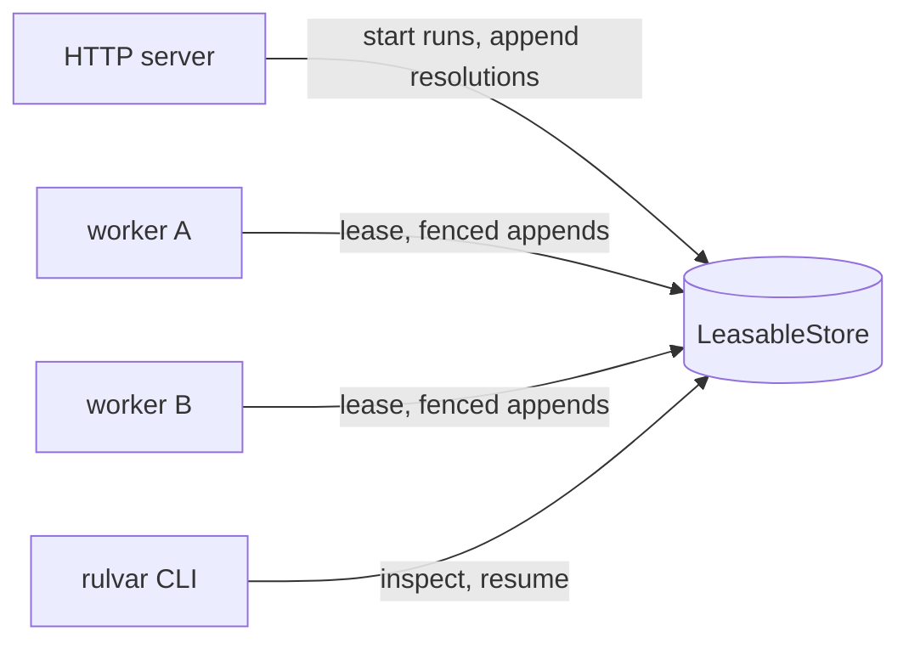

# CLI, server, and worker

`@rulvar/cli` is the optional ops layer. Same engine, three lifetimes: the `rulvar` command for a terminal, `createServer` for a network surface, and `createWorker` for background multi-process runs. All three are built strictly on the public engine API, so anything a shell does, your host application can do with the same calls; the shells exist so you do not have to write them.

::: tip Library mode is the default
Embed the engine directly for scripts, tests, and single-process apps. Reach for a shell when:
- you want terminal ops over a journal directory (`rulvar run`, `inspect`, `resume`), OR
- you expose runs over HTTP (start, watch, approve from a browser or another service), OR
- runs must be resumed by whichever process is available, safely, across machines.
:::

## Install

```bash
pnpm add @rulvar/cli
```

The package is ESM only and requires Node >= 22.12.0, like the rest of Rulvar. Some commands load optional companions dynamically at command time: `rulvar plan` needs `@rulvar/planner` installed, `rulvar kb sweep` needs `@rulvar/evals`, and `rulvar kb inbox` and `rulvar kb gate` need `@rulvar/plan`. A missing companion is a clear error on that command, never a load failure of the others, and missing is distinguished from broken: only a real module-not-found for the companion itself produces the install hint, while an installed companion that fails to load surfaces its own error with the cause preserved. The OTel exporter declares `@opentelemetry/api` (^1.9) as an optional peer.

One naming caveat: run the binary from a project that installs `@rulvar/cli` (`pnpm exec rulvar ...` or a package script). A bare `npx rulvar` in a project without it fetches the unscoped `rulvar` package from the registry, which is the library alias and ships no binary.

## The `rulvar` command

The canonical grammar, with no aliases:

```text
rulvar run <file|name> [--args JSON] [--store PATH] [--budget-usd N] [--profile NAME] [--strict]
rulvar resume <runId> [--args JSON] [--store PATH] [--dry-run] [--allow-args-change] [--strict]
rulvar runs ls [--store PATH]
rulvar inspect <runId> [--store PATH]
rulvar plan "<goal>" [--planning-budget-usd N] [--budget-usd N] [--allow-unbounded] [--dry-run]
rulvar kb <list | inbox | gate | sweep>
```

| Command | Purpose |
|---|---|
| `run` | Start a workflow from a file path or a registered name, drive it to a settled outcome, exit with a code reflecting it. |
| `resume` | Rebind a journal to its workflow and continue; fully replayed prefixes cost zero live calls. |
| `runs ls` | List run metadata (id, status, last update, workflow, name) from the store. |
| `inspect` | Print one run's journal-derived state: entries, suspensions, spend. |
| `plan` | Ask the planner to write a workflow script for a goal, then run it in the worker sandbox. |
| `kb` | Maintain the [model knowledge](/guide/model-knowledge) claim store. |

Flag semantics are uniform:

- `--store PATH` selects the `JsonlFileStore` directory (default `.rulvar`). Every command that opens a journal store selects it the same way. An explicit `stores` entry in your config's `engineOptions` wins over the flag.
- `--args JSON` supplies workflow arguments. It appears on `resume` too because original run arguments are not journaled in this version: the host re-supplies them. What IS recorded at genesis is the binding (`RunMeta.argsProvided` plus a canonical `argsHash`, never the raw args), and `resume` verifies the re-supplied value against it before the engine starts: forgetting `--args` on a run started with them, adding them to a run started without them, or supplying a different value is a typed refusal, because a silently changed value changes the logical run and re-pays every args-dependent call. Runs recorded before v1.24.0 carry no binding, so a bare `resume` of one demands the explicit acknowledgment below. The `--args` value must be finite JSON (representable in canonical JCS): a numeric literal that overflows to `Infinity` is a typed refusal at parse time, before any store or adapter loads, because a non-canonical value would record a binding with no hash and defeat this gate. The recorded `argsHash` is a deterministic, unsalted digest, so it reveals args equality across runs and low-entropy args are recoverable by hashing candidates; `rulvar inspect` prints the full hash as a sensitive diagnostic, so treat it and the store with the same care as the journal.
- `--allow-args-change` (`resume` only) is that acknowledgment: it overrides the args gate deliberately (resume without the genesis args, with new args, or of a legacy run whose journal predates the binding), always with a loud warning on stderr.
- `--dry-run` (`resume` only) previews the resume without performing it: the engine replays in strict mode and the CLI prints the replay accounting (hits, misses, reruns, skipped, orphaned effect roots, invalid resolutions) plus what the run would settle as, with zero journal or meta writes and zero adapter calls. A preview that reaches work needing a live call reports the exact stopping point instead of paying for it.
- `--strict` (`run` and `resume`) refuses a partial orchestration: when the settled value is an [acceptance envelope](/guide/orchestration-modes#acceptance-the-child-completion-policy) whose `completion` is not `'complete'`, the command prints the degraded reasons and exits nonzero even though the run status is `ok`. Outcomes without an acceptance envelope are unaffected, and non `ok` statuses keep their ordinary exit codes.
- `--budget-usd N` sets the run's dollar ceiling, immutable after start (see [Budgets](/guide/budgets)). On `plan` it caps the execution run of the generated workflow, consistent with `run`.
- `--planning-budget-usd N` (`plan` only) caps the planning run: the planner conversation is its own paid run with its own journal, so its ceiling is separate from the execution ceiling by construction.
- `--allow-unbounded` (`plan` only) waives the missing ceilings explicitly. `plan` never runs unbounded silently: without this flag, `--planning-budget-usd` is required, and full execution additionally requires `--budget-usd`.
- `--profile NAME` applies a shipped run profile (`fast`, `standard`, `deep`, `ultra`): pure data bundles of effort hints, concurrency, budget defaults, and a permission preset, merged under your own options so your config always wins. The effort hints seed only routing entries your config already declares and that carry no effort of their own: an explicit effort wins, a role you do not route stays unrouted, ladder entries are untouched, and a profile never names a model.

The CLI renders progress from the run's event stream: live TUI rendering on a TTY, plain line output otherwise. When a run suspends, the CLI resolves interactively: approvals prompt for allow or deny, `awaitExternal` suspensions prompt for a value. If input runs dry (EOF), the run is left suspended in the store, ready for a later `rulvar resume`, the HTTP server, or a queue worker.

Diagnostic output follows two rules. An error about a supplied `--args` value never echoes the value: the message names the failure class (invalid JSON, or a numeric overflow that defeats canonicalization) and the way out, because workflow args may carry private data and stderr routinely lands in CI logs. And every dynamic value a diagnostic line embeds (a runId, a suspension key, a provider error message, a model ref) is stripped of terminal control sequences before printing, exactly like the live progress renderer, so untrusted text cannot recolor, retitle, or rewrite the terminal it lands on.

## Configuration file discovery

Commands assemble their engine from `rulvar.config.mjs` (or `rulvar.config.js`) in the working directory. The default export has three optional fields: `engineOptions` (anything `createEngine` accepts), `workflows` (the registry for by-name runs), and `kbSweep` (the `rulvar kb sweep` matrix). An absent config is fine; a workflow module passed to `rulvar run` may also carry `workflow`, `engineOptions`, and `workflows` as named exports.

```ts
// rulvar.config.mjs
import { defineWorkflow } from '@rulvar/core';
import { anthropic } from '@rulvar/anthropic';

const triage = defineWorkflow({ name: 'triage' }, async (ctx) => {
  return ctx.agent('Triage the open incidents and rank them by blast radius.');
});

export default {
  engineOptions: {
    adapters: [anthropic()],
  },
  workflows: { triage },
};
```

With that file in place, `rulvar run triage --budget-usd 2` starts the registered workflow against a JSONL journal in `.rulvar`.

## The plan command

`rulvar plan "<goal>"` is the terminal entry to the [planned mode](/guide/planner): the planner model writes a workflow script against the ctx dialect and your profile cards, the script is linted and self-repaired from structured diagnostics, compiled, and executed deterministically in the worker sandbox. `--dry-run` prints the accepted script without running it. The command imports `@rulvar/planner` dynamically, so install it alongside `@rulvar/cli` to use planning.

Both stages are paid runs with their own immutable ceilings, and a machine-written workflow never runs unbounded silently:

- `--planning-budget-usd N` freezes as the planning run's ceiling B0 at its journal's genesis (`PlanOptions.run.budgetUsd`; re-planning the same goal resumes the existing journal under its recorded ceiling, see [The planner](/guide/planner)). Required unless waived.
- `--budget-usd N` is the execution run's ceiling (`RunOptions.budgetUsd`), exactly as on `rulvar run`. Required for full execution unless waived; combining it with `--dry-run` is an error, because a dry run executes nothing for it to bound.
- `--allow-unbounded` waives the missing ceilings explicitly and loudly.

Planning exhaustion stops before execution starts (`plan()` throws its typed `ScriptRejected` carrying `budget_exhausted`), and execution exhaustion never touches the planning journal: two runs, two ceilings, two journals.

## Knowledge-base maintenance

The `kb` subcommands maintain the per-project [model knowledge](/guide/model-knowledge) claim store (`./rulvar.models.json`):

- `rulvar kb list` prints the claims with full provenance.
- `rulvar kb inbox [--store PATH]` aggregates the `kb_propose` proposals of finished runs from their run ledgers into a read-only review view, grouped by subject, task class, and polarity. Proposals expire 14 days after their run finished; the command writes nothing and authorizes no spend. Requires `@rulvar/plan`.
- `rulvar kb gate <runId> <entryRef> --approver NAME --ruled-out a,b,c` turns one inbox proposal into a committed `human-editorial` claim. `--approver` and `--ruled-out` are mandatory: they form the attribution attestation, and the ruled-out vocabulary is `prompt`, `tools`, `difficulty`, `transient-provider`. Contrast evidence is optional via `--contrast-run runId#seq` or `--contrast-eval reportId:caseId[,caseId...]` (mutually exclusive), `--confidence high|medium|low` defaults to `medium`, and `--store PATH` selects the journal store as usual. Requires `@rulvar/plan`.
- `rulvar kb sweep` runs the falsification matrix declared in the `kbSweep` section of your config: a fixed model pool (sweep volume is never authorized by proposal volume) unioned with every model carrying an active negative claim plus the re-measure queue. Optional canary probes run per pool member first and flip drifted claims stale (only when every probe settled `ok`: a budget-starved or transiently failed probe fingerprints differently without the model having drifted, so it never flips a claim). Requires `@rulvar/evals`.

A sweep multiplies paid runs, so `kbSweep.budgets` is required (or waive it explicitly with `allowUnbounded: true`): every target, judge, and canary run carries an immutable per-run ceiling, and `maxTotalUsd` is a debit-only envelope over the whole sweep. Each run authorizes its ceiling against the envelope BEFORE it starts, so a run that would breach it is refused before any provider call. Refusals never erase paid work: a cell whose walk was stopped partway renders as `INCOMPLETE: envelope refused ... after N of M case(s)` with everything already measured kept; only a cell refused before ANY work reports `envelope exhausted, not measured`. A target that hits its OWN ceiling reports `exhausted`, a case whose judge could not finish stays as evidence with the reason named, and refused canary probes render as such; every one of those shapes emits no claim, because a budget-starved measurement must not become a false weakness that blames the model for the ceiling.

```ts
// rulvar.config.mjs: the kb sweep budget surface
export default {
  kbSweep: {
    committerId: 'ci-evals',
    models: [{ model: 'anthropic:claude-fable-5' }],
    cases: [/* EvalCases tagged by taskClass, built with @rulvar/evals */],
    canary: { agentType: 'probe', prompts: ['ping one', 'ping two'] },
    // Immutable per-run ceilings and the aggregate envelope. Required
    // unless you set allowUnbounded: true.
    budgets: {
      targetUsd: 0.5, // ceiling of every eval target run
      judgeUsd: 0.5, // ceiling of every judge run
      canaryUsd: 0.2, // ceiling of every canary probe run
      maxTotalUsd: 50, // hard debit-only envelope over the whole sweep
    },
  },
};
```

The worst-case authorized spend the command prints before its first call is `canaryUsd * probes * pool + targetUsd * cases * pool`, plus `judgeUsd` per judge call. Judge-call counts are grader behavior and unknowable upfront, so `maxTotalUsd` is the only guaranteed aggregate ceiling: keep it at or above that worst case for the sweep to finish, or set it lower deliberately to stop the matrix partway.

## The HTTP server

`createServer` turns an engine and a workflow registry into a WHATWG fetch handler. It opens no socket of its own: you mount `server.fetch` on whatever Request/Response HTTP layer your host already runs, and your middleware owns TLS, timeouts, and authentication.

```ts
import { createEngine, defineWorkflow, JsonlFileStore } from '@rulvar/core';
import { anthropic } from '@rulvar/anthropic';
import { createServer } from '@rulvar/cli';

const releaseNotes = defineWorkflow({ name: 'release-notes' }, async (ctx) => {
  const draft = await ctx.agent('Draft release notes from CHANGELOG.md.');
  const verdict = await ctx.awaitExternal<{ approved: boolean }>('editor-signoff', {
    prompt: 'Approve the draft?',
  });
  return verdict.approved ? draft : null;
});

const engine = createEngine({
  adapters: [anthropic()],
  stores: { journal: new JsonlFileStore({ dir: '.rulvar' }) },
});

const server = createServer({ engine, workflows: { 'release-notes': releaseNotes } });

const response = await server.fetch(
  new Request('http://localhost/runs', {
    method: 'POST',
    body: JSON.stringify({ workflow: 'release-notes', options: { budgetUsd: 5 } }),
  }),
);
const { runId } = (await response.json()) as { runId: string };
```

::: warning Authentication is deliberately out of scope
The server is host-embedded, and auth belongs to host middleware. Do not expose `server.fetch` to an untrusted network without your own authentication layer in front of it.
:::

### Routes

| Method | Path | Purpose |
|---|---|---|
| `POST` | `/runs` | Start a run of a registered workflow. Body: `{ workflow, args?, options? }` where `options` accepts `runId`, `budgetUsd`, `name`, `tags`, `deadlineAt`. Answers `201` with `{ runId, status, workflow }` and a `Location` header. |
| `GET` | `/runs/:id` | Run status. A run tracked in this process reports the live outcome, including the `pending` list of open suspensions; any other known run reports its stored metadata. |
| `GET` | `/runs/:id/events` | SSE event stream with `Last-Event-ID` reconnection. |
| `POST` | `/runs/:id/external/:key` | Resolve an `awaitExternal` suspension or an approval. |
| `GET` | `/runs/:id/cost` | The run's `CostReport`. |

The server is a single-process shell: it tracks the runs it started (or resumed) in memory and serves everything else from the engine's stores (`engine.stores`), which is why it takes no store parameter of its own.

### Server-sent events

Each SSE frame carries `id:` (the event's per-run telemetry `seq`), `event:` (the `WorkflowEvent` type), and `data:` (the full event JSON). Reconnect with the standard `Last-Event-ID` header and the server replays strictly AFTER that seq (the buffer is seq-ordered, so the resume point is a binary search, and a cursor seq the buffer does not hold simply replays everything after it): delivery is at-least-once, so deduplicate on the id. A terminal settle closes connected streams only AFTER the run's event pump has drained, so a client that keeps reading receives the complete tail, `run:end` included; if the pump itself failed, the close is preceded by an SSE comment saying the stream may be incomplete. Events are process-local telemetry, never run truth; a run known to the store but not live in this process answers with an empty stream that closes immediately. When `maxBufferedEventsPerRun` has dropped buffered events, the response carries an `x-rulvar-events-dropped` header with the count, and a client whose cursor lies before the retained window additionally gets a leading SSE comment naming the first retained seq; the journal remains the durable record. See [Observability](/guide/observability) for the event catalog.

Every connection's pending queue is bounded, independently of the replay buffer: `maxPendingEventsPerClient` (default 10000) caps the frames queued in one response that the consumer has not read yet. A consumer that stops reading is closed at the bound with an SSE comment naming it; the frames already queued stay readable, and the standard `Last-Event-ID` reconnect resumes strictly after the last frame the client consumed. A replay longer than the bound is delivered the same way, in bounded chunks across reconnects, so pending memory per connection is O(bound) while at-least-once delivery is preserved end to end.

```bash
curl -N -H 'Last-Event-ID: 42' http://localhost:8787/runs/$RUN_ID/events
```

### Resolving approvals and external input

`POST /runs/:id/external/:key` is the HTTP form of `RunHandle.resolveExternal`. The key of an `awaitExternal` suspension is the key the workflow chose (`editor-signoff` above), and its value must validate against the schema pinned at suspension time, when one was set. An approval suspension synthesizes its key as `approval:<seq>` and resolves with `{ "decision": "allow" | "deny", "reason"?: string }`. Both appear in the `pending` list of the run status. For a run this server started that has settled `suspended`, the response's `resumed: true` means the server applied the durable resolution and started the run's ONE continuation segment itself; an approved tool executes exactly once (see [Resolving a settled run](/guide/durability#resolving-a-settled-run)).

```bash
curl -X POST http://localhost:8787/runs/$RUN_ID/external/editor-signoff \
  -d '{ "approved": true }'
```

Two paths serve the request:

- **Live in this process**: the resolution goes through the run handle. If the run had already settled `suspended` and the resolution applied, the server resumes it in place, re-binding the registry workflow and the original arguments it retained; the response reports `resumed: true`.
- **Not live here**: the server appends the resolution directly to the journal (under a lease when the store is leasable) and leaves the resume to a queue worker or a later `rulvar resume`. Payload validation still runs before the append, so an invalid resolution fails the request instead of poisoning the journal.

A resolution against an already-closed suspension is never an error that damages anything: the first closing entry wins, and the response reports `applied: false` with the superseding entry.

### Cost, errors, and retention

`GET /runs/:id/cost` returns the exact in-process `CostReport` for a run that settled here (per-phase and per-agent-type attribution exists only in process). For any other run it folds the journal and prices usage through the optional `priceUsd` callback of `createServer`; without one, those usages surface in the report's `unpriced` list, never as a silent zero.

Typed engine errors map onto status codes with a `{ error: WireError }` body: configuration and invalid-resolution errors answer `400`, a held lease or a journal outside the compatibility window answers `409`, anything else `500`.

Retention comes in two decoupled kinds, both opt-in and both evaluated when a tracked run settles terminally:

- `retention: (meta) => boolean` is DURABLE retention: a true verdict applies `engine.deleteRun` (transcripts first, then the journal) and untracks the run. This deletes the record itself.
- `memoryRetention: (meta) => boolean` releases only the tracked state (arguments, outcome, handle, SSE buffer); the journal and transcripts stay. After it, `GET /runs/:id` and `/cost` serve from the store exactly as for a run another process owns, and `/events` answers with the empty not-live stream.

Three bounds keep the memory of a server with long uptime finite without any predicate: `maxTrackedRuns` caps how many SETTLED runs stay tracked (oldest released first, live runs never counted or evicted), `maxBufferedEventsPerRun` caps each run's SSE replay buffer (oldest events dropped in chunks and counted; see the SSE section for how a replay marks the gap), and `maxPendingEventsPerClient` caps what any single SSE connection can accumulate unread (finite by default; see the SSE section for the disconnect and reconnect contract). All three are validated at construction, a typed `ConfigError` for anything but a safe integer in the documented domain (`maxTrackedRuns` accepts zero, the other two are positive). Absent the retention options and the first two caps, tracked state persists in process memory for the server's lifetime, and the tracked handles keep their full event history alive; only the per-connection pending bound is finite by default.

## The queue worker

`createWorker` runs suspended and interrupted runs in the background, safely across processes. It demands a store with the lease capability; handing it a plain `JournalStore` is a typed `ConfigError` at construction, never a silent split-brain. It also verifies the store is the same instance the engine writes (`engine.stores.journal`), because a fencing epoch protecting a store nobody appends to would protect nothing.

```ts
import { createEngine } from '@rulvar/core';
import { anthropic } from '@rulvar/anthropic';
import { SqliteStore } from '@rulvar/store-sqlite';
import { createWorker } from '@rulvar/cli';
import { workflows } from './workflows.js';

const store = new SqliteStore({ path: '/var/lib/acme/runs.db' });

const engine = createEngine({
  adapters: [anthropic()],
  stores: { journal: store },
  defaults: { workflows }, // the worker resolves workflows through this registry
});

const worker = createWorker(engine, {
  store,
  concurrency: 1,
  onError: (runId, error) => console.error(runId, error),
});
worker.start();

process.on('SIGTERM', () => {
  void worker.stop();
});
```

### Leases and the fencing epoch

Every sweep asks the store for candidate metadata only, `listRuns({ statuses: ['running', 'suspended'] })`, so the poll cost tracks the resumable backlog rather than the whole historical catalog (with the `retention` option the sweep lists everything, because terminal metas are what retention judges; the `statuses` filter is advisory, and candidacy is re-checked on what comes back). Sweeps never overlap: a poll tick that fires while the previous sweep is still scanning reports zero picks instead of overlapping it. For each candidate the worker acquires a lease; a `LeaseHeldError` means another worker owns it, and at-least-once semantics make skipping safe. The resume itself passes the lease through `ResumeOptions.lease`, so **every** journal append of the resumed run carries the fencing epoch: a stale worker's writes are rejected by the store and never become visible, whether or not that worker noticed it lost the lease. Split-brain is excluded by construction, not by timing.

The lease is renewed at a third of its ttl (default ttl 60000 ms, exposed as `DEFAULT_WORKER_TTL_MS`; `ttlMs` must match the store's configured ttl). The match is executable now: a store exposing the optional `leaseTtlMs` capability (`SqliteStore` does) is VERIFIED at construction, a mismatch is a `ConfigError`, and an omitted `ttlMs` simply adopts the store's value, so one config source drives both sides of the protocol. Both `ttlMs` and `pollMs` must be integers between 1 and 2147483647 ms, refused typed at construction: an overflow, NaN, zero, or negative cadence would collapse to Node's 1 ms interval floor and storm the store with renew and poll writes. There is no `pollMs: 0` manual mode; drive sweeps directly with `worker.sweep()`. A failed renew cancels the run promptly instead of burning live calls whose appends would be rejected anyway.

Two more checks keep the loop honest:

- At acquire, the journal's hashVersion is checked against the engine's compatibility window, strictly before any append: an older library never writes into a newer journal. Runs failing this (or workflow binding) are poisoned for this worker and reported through `onError`; they need the host, not a retry loop. See [Journal compatibility](/guide/journal-compatibility).
- A run that settles `suspended` is remembered with its journal length AND its generation token (`RunMeta.genesis`, minted at the run's fresh start and preserved across resumes), and is not re-leased until the journal grows, which is exactly what an offline resolution (from the server's external endpoint, for example) does. The generation is what tells a `deleteRun` and recreate of the same runId apart from the old run standing still: length can coincide, the token cannot. The same rule releases a poisoned runId when its run is deleted and recreated, and every sweep drops skip and poison entries for runIds that left the candidate set, so externally deleted runs never pin process-local state until restart.

Queue semantics are honestly at-least-once, with deduplication provided by the journal's two-phase entries: re-leasing a settled or unchanged run replays to the same outcome with zero live calls, which is the never-pay-twice invariant doing its job. Workflows resolve through the engine's `defaults.workflows` registry plus persisted compiled-workflow sources, never through a worker parameter; original run arguments are re-supplied per run through the optional `argsFor(meta)` callback.

The returned handle is small: `start()` begins sweeping on the poll cadence (default 1000 ms), `sweep()` performs one deterministic pass and returns the number of runs picked up (useful in tests and cron-shaped hosts), `stop()` cancels in-flight runs and releases held leases, and `active()` lists the runIds currently held. Retention mirrors the server: an opt-in `retention` predicate evaluated during sweeps over settled runs, applied under a briefly held lease.

::: warning No cross-process rate limiter
There is no distributed rate limiter in this version: per-provider concurrency caps live in each engine, so each worker process throttles independently. Scaling out concurrency defaults to 1 leased run per worker process, and hosts scale by adding processes, which the fencing epoch makes safe. Divide your provider quota across workers via `concurrency.perProvider` per process, or front the providers with an external gateway.
:::

A typical multi-process deployment composes the shells over one leasable store:



## The OTel exporter

`toOtel` projects one settled run's event stream onto an OpenTelemetry tracer. Events are consumed in seq order: span-opening events start spans, their matching closers end them, and payload-only events attach as span events on the innermost open span, following the run, phase, agent, tool, child span hierarchy. The function returns the number of spans created.

```ts
import { trace } from '@opentelemetry/api';
import { toOtel } from '@rulvar/cli';

const handle = engine.run(releaseNotes, undefined);
const spanCount = await toOtel(
  { runId: handle.runId, events: handle.events, result: handle.result },
  trace.getTracer('rulvar'),
);
```

Pass `contextApi` and `setSpan` (the `context` API and `trace.setSpan` from `@opentelemetry/api`) to get real parent-child span nesting: every child span starts under a context derived from its parent, so the run > phase > agent > tool > child tree lands in the trace structure. Without them, spans come out flat but fully attributed, with the parentage riding the `rulvar.*` attributes (see [Observability](/guide/observability)). The exporter needs only the tiny structural `TracerLike` surface, so it works with any SDK setup and stays out of your dependency tree until you opt in.

## Deployment notes

| Shell | Process model | Notes |
|---|---|---|
| `rulvar` CLI | A project-local tool, one process per invocation | Journal and config travel with the project directory: `.rulvar` for the JSONL journal, `rulvar.config.mjs` for engine assembly. Anyone with the directory can `inspect` and `resume`. Best for development loops and operator resolution of suspended runs. |
| HTTP server | Embedded in your existing service | Mount `server.fetch` behind your auth middleware and reverse proxy. Use a durable store: the default `InMemoryStore` disables resume and is only fit for demos. Single process by design; pair it with workers so resolutions posted for non-live runs actually resume. |
| Queue worker | One process per `concurrency` slot, scaled horizontally | Run one worker per unit of provider quota under systemd or a container orchestrator; every worker builds its own engine over the same `LeasableStore` (for `SqliteStore`, the same database file or volume). Keep `ttlMs` equal to the store's lease ttl, and wire `onError` into your alerting: poisoned runs need a human. |

## Next steps

- [Durability](/guide/durability): what resume replays, reruns, and skips.
- [Stores](/guide/stores): the lease contract workers rely on, and how to pick a store.
- [Observability](/guide/observability): the event stream the TUI, SSE, and OTel exporter all consume.
- [Planner](/guide/planner): the mode behind `rulvar plan`.
- [API reference for @rulvar/cli](/api/@rulvar/cli/): every exported symbol.
