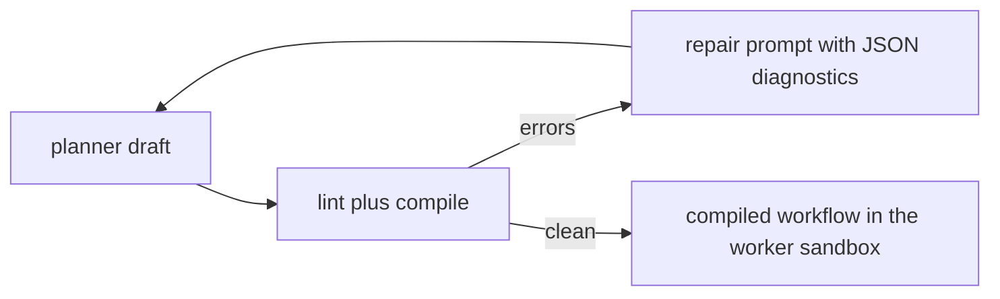

# Determinism lint

`eslint-plugin-rulvar` ships seven ESLint rules for workflow modules: six ban ambient nondeterminism and ambient I/O and point every finding at the journaled alternative, and one bans dynamic code generation, which would otherwise slip past the sandbox import allowlist. The same rules serve two audiences: you, running ESLint over the workflows in your own repository, and the planner self-repair loop, which lints every script draft a planner model writes and feeds the findings back to the model as JSON.

```bash
pnpm add -D eslint eslint-plugin-rulvar
```

The package follows ESLint's plugin naming convention, so it is the one Rulvar package whose npm name carries no `@rulvar/` scope. It is still versioned in lockstep with the rest of the release line (currently <!-- version:lockstep -->1.38.0<!-- /version -->), requires ESLint 9 or newer (flat config only), and is ESM only on Node 22.12.0 or newer, like every Rulvar package.

## Why workflow modules must be deterministic

Everything a workflow does through `ctx` lands in the journal under an identity with three parts: the scope path locating the call site, a content key (a hash over the call's identity input; for an agent spawn that is the prompt, the agent type, the resolved model spec and effort, the schema hash, the toolset hash, and the isolation spec), and an ordinal numbering identical repeats. On resume your workflow function runs again from the top, and each call is matched against the journal: same identity, the recorded result is replayed for free; different identity, a live call, real money.

That makes bare `Date.now()` or `Math.random()` in workflow code a billing problem, not a style problem. A prompt that embeds a timestamp hashes to a different content key on every execution, so on resume the journal misses and the never-pay-twice invariant has nothing to match: the work is paid again. Ambient reads fail in the other direction: a bare `fetch()` or `process.env` read produces a value that never enters the journal, so a replayed run silently computes over different data than the original did.

Rulvar deliberately does not force a VM onto your code to fix this. For in-process workflows only the sequence of identities must be stable, and determinism is enforced by three cooperating layers:

* the `ctx.now()`, `ctx.random(key?)`, and `ctx.uuid()` shims, which journal their values so every replay returns them byte for byte,
* this lint, which catches the ambient escapes statically,
* a dev mode runtime patch on `Date.now` and `Math.random` that warns and points at the shims.

Scripts the planner generates get a fourth, structural layer: the worker sandbox replaces `Date.now` and `Math.random` with seeded journaled shims, unbinds `fetch` and `process`, admits only allowlisted literal imports, rejects the statically visible dynamic code generation that could rebuild any of those, and neutralizes the constructor reconstruction path at runtime for the forms static analysis cannot see. See [Planner](/guide/planner) for that side; this page covers the lint.

## The rules

| Rule | Preset severity | Flags | Write instead |
|---|---|---|---|
| `rulvar/no-bare-date` | error | `Date.now()`, `new Date(...)` | `ctx.now()` |
| `rulvar/no-bare-random` | error | `Math.random()` | `ctx.random(key?)` |
| `rulvar/no-fetch` | error | `fetch(...)`, `globalThis.fetch(...)` | a declared tool, or a client call journaled with `ctx.step` |
| `rulvar/no-process-env` | error | any `process.env` access | workflow args, or a `ctx.step` that journals the read |
| `rulvar/no-code-generation` | error | `eval`, `Function(...)`/`new Function(...)`, and constructor reconstruction (`.constructor`, `["constructor"]`, a folding computed key, `{ constructor: x }`, `Reflect.get(fn, "constructor")`) | the curated ctx surface only |
| `rulvar/no-promise-all-over-ctx` | error | `Promise.all`, `allSettled`, `race`, `any` over ctx work | `ctx.parallel([...])` (`{ settle: true }` replaces `allSettled`) |
| `rulvar/duplicate-identical-call` | warn | byte-identical `ctx.agent` or `ctx.workflow` repeats in one function | a distinguishing `key` option |

The global binding rules flag only the global bindings. A locally declared `Date`, `fetch`, `process`, `Function`, or `Promise` shadows the global and is never reported, and `Promise.all` over plain host promises (file reads, database queries) is allowed; the combinator rule fires only when an argument spawns ctx work, including inside `.map` callbacks. The exception is constructor reconstruction, which `no-code-generation` flags in every static form wherever it appears, since it reaches the `Function` constructor from any value; a key assembled only at runtime cannot be seen statically and is left to the worker sandbox.

### Time, randomness, and ids

```ts
// flagged: both values change on every execution, so every content key
// built from them changes too, and the resume pays again
const startedAt = Date.now();
const sampled = candidates[Math.floor(Math.random() * candidates.length)];
```

```ts
// replay-stable: the first execution journals the live values and every
// replay returns them byte for byte
const startedAt = ctx.now();
const sampled = candidates[Math.floor(ctx.random('sample') * candidates.length)];
const requestId = ctx.uuid();
```

`ctx.random` accepts an optional key so a specific draw keeps its identity even if you later reorder the draws. Keep journaled timestamps as epoch milliseconds inside workflow modules: `no-bare-date` flags every global `new Date(...)` construction, with or without arguments, so when you need a formatted date, derive it from the journaled `ctx.now()` value in a helper module outside the linted workflow files.

### Ambient reads: fetch and process.env

Network reads and environment reads are real effects, so they belong under the journal like any other effect: either declare them as tools (see [Tools](/guide/tools)) or journal the invocation with `ctx.step`, which records the JSON result as a step entry that is never paid or performed twice.

```ts
// flagged: the read bypasses the journal and diverges on replay
const releases = await fetch(releasesUrl).then((r) => r.json());
const token = process.env.GITHUB_TOKEN;
```

```ts
// replay-stable: the raw call lives in an ordinary module and the
// workflow journals the invocation
import { fetchJson } from './net/client.js';

const releases = await ctx.step('fetch releases', () => fetchJson(releasesUrl));
```

Configuration should enter through workflow args rather than ambient process state; when a workflow genuinely must read the environment, journal the read (`ctx.step('read env', ...)`) so replays see the original value.

::: warning
`no-fetch` flags calls of the global `fetch` (and of `globalThis.fetch`) anywhere in a workflow module, including inside a `ctx.step` callback; a `fetch` reference merely passed around as a value is outside its reach. Keep raw `fetch` calls in a separate client module (or behind a tool) and call that from the workflow, as in the example above.
:::

### Fan out with ctx.parallel, not Promise.all

`Promise.all` runs your branches outside the engine: nothing schedules them under the run's concurrency limits, and failure semantics are whatever `Promise.all` does. `ctx.parallel` is the journal-aware combinator: it runs the thunks under the scheduler, journals each branch as it completes, resolves with results in source order, and settles properly. Under the strict error policy a failing branch aborts its siblings by default, and `{ settle: true }` returns a typed `Settled<T>[]` instead of throwing, replacing `Promise.allSettled`.

```ts
// flagged, for all four combinators: all, allSettled, race, any
const [changelog, issues] = await Promise.all([
  ctx.agent('Summarize the changelog'),
  ctx.agent('Summarize the open issues'),
]);
```

```ts
// journaled, scheduled, and settled by the engine
const [changelog, issues] = await ctx.parallel([
  () => ctx.agent('Summarize the changelog'),
  () => ctx.agent('Summarize the open issues'),
]);
```

### Repeated identical calls

The one advisory in the set. Byte-identical `ctx.agent` or `ctx.workflow` calls in the same function are legal, and each repeat gets its own journal entry, but the journal tells them apart only by execution order. That binding is fragile: edit or reorder the body between runs and a resumed result can attach to the wrong call site. When a repeat is deliberate (sampling the same prompt twice, for instance), give each call its own `key`, which mixes into the content key and makes the identity explicit:

```ts
const first = await ctx.agent('Rate this abstract from 1 to 10', { key: 'rating-a' });
const second = await ctx.agent('Rate this abstract from 1 to 10', { key: 'rating-b' });
```

## Flat config setup

The plugin ships one preset, `rulvar/workflows`, wiring every rule at its intended severity: the six determinism, dialect, and scheduling bans as errors, the duplicate-call advisory as a warning. The preset deliberately carries no `files` of its own, because the bans apply to workflow modules, not to your servers, scripts, or tests; scope it yourself:

```ts
// eslint.config.js
import rulvar from 'eslint-plugin-rulvar';

export default [
  // ...the rest of your config
  {
    ...rulvar.configs.workflows,
    files: ['src/workflows/**/*.ts'],
  },
];
```

The preset is also exported by name as `workflowsConfig`, and the raw rules are available for manual wiring when you want different severities in a subtree:

```ts
import rulvar, { workflowsConfig } from 'eslint-plugin-rulvar';

export default [
  { ...workflowsConfig, files: ['src/workflows/**/*.ts'] },
  {
    files: ['src/workflows/experiments/**/*.ts'],
    plugins: { rulvar },
    rules: { 'rulvar/duplicate-identical-call': 'off' },
  },
];
```

## Structured JSON diagnostics

Rule messages are prescriptive on purpose ("use ctx.now() (the journaled deterministic shim)") so that a machine consumer can act on them mechanically. `toJsonDiagnostics` projects ESLint's lint messages onto a plain JSON shape:

```ts
interface RulvarLintDiagnostic {
  ruleId: string; // 'rulvar/no-bare-date'; 'parse' for syntax errors
  message: string;
  line: number;
  column: number;
  severity: 'error' | 'warning';
  endLine?: number;
  endColumn?: number;
}
```

Feed it the messages from a programmatic `Linter` run with the preset:

```ts
import { Linter } from 'eslint';
import { toJsonDiagnostics, workflowsConfig } from 'eslint-plugin-rulvar';

const linter = new Linter();
const messages = linter.verify(source, [
  { languageOptions: { ecmaVersion: 2024, sourceType: 'module' } },
  workflowsConfig,
]);

const diagnostics = toJsonDiagnostics(messages);
// [{ ruleId: 'rulvar/no-bare-date',
//    message: 'bare Date.now() is not replay-stable; use ctx.now() ...',
//    line: 2, column: 13, severity: 'error' }]
```

The projection round-trips through `JSON.stringify`, and the shape structurally matches the compile diagnostics that `compileScript` produces, which is what lets one repair prompt render findings from both sources.

## The planner self-repair loop

The flagship hybrid mode is where these diagnostics earn their keep. `plan()` asks a planner model to write a workflow script against the API card of the sandbox dialect, then puts every draft through two static gates: this plugin's `workflows` preset via a programmatic `Linter`, and `compileScript`, whose rejections join the same diagnostic list under a `compile/` rule id prefix. Any error severity finding sends the draft back to the model together with the JSON diagnostics, up to three repair rounds by default (`repairRounds`). An accepted draft may still carry warnings; they are returned on the plan result rather than blocking it.



The accepted script then executes in the worker sandbox, where the discipline the lint asked for is enforced structurally: seeded journaled shims for time and randomness, `fetch` and `process` unbound, imports limited to the allowlist, and dynamic code generation rejected. Lint and the compile gate reach one decision for every statically visible form, so a script that lints clean does not discover a new static ban at runtime; the one thing static analysis cannot see, a constructor key assembled at runtime, is neutralized in the worker rather than silently allowed. The boundary is determinism and blast radius, not a hostile code wall. The full mode is documented in [Planner](/guide/planner).

## Using the plugin in your own projects

For human-authored workflows the lint is the main determinism gate, because the in-process runner intentionally does not coerce your code: nondeterminism there does not crash a run, it shows up later as replay misses and repaid work. Practical guidance:

* Keep workflow modules in a dedicated directory and scope the preset to it, so application code keeps its normal freedom to call `Date.now()` and `fetch()`.
* Run the preset in CI next to your other ESLint config; the error severities are chosen so a violation fails the build before it costs you a repay.
* Leave `duplicate-identical-call` at warning severity: repeated identical calls are sometimes exactly what you mean, and the fix (`key`) is cheap when they are.
* The diagnostics surface is public API, so you can build your own repair loops, review bots, or editor tooling on `toJsonDiagnostics` exactly the way `plan()` does.

## Next steps

* [Workflows and ctx](/guide/workflows): the ctx surface the shims and combinators live on.
* [The journal](/guide/journal): content keys, scope paths, ordinals, replay, and rerun.
* [Planner](/guide/planner): `plan()`, `compileScript`, and the worker sandbox.
* [API reference](/api/eslint-plugin-rulvar/): every export of `eslint-plugin-rulvar`.
