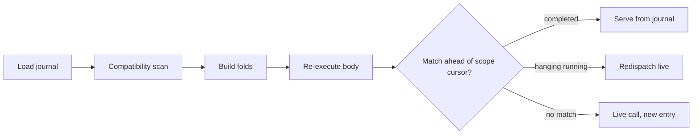

# Durability and resume

A Rulvar process is disposable. Every effectful operation a run performs is appended to the [journal](/guide/journal) through a pluggable store, so the process can die at any instant, on any machine, and the run loses at most the work that was in flight. Resuming re-executes your workflow body from the top; every call that already completed is served from the journal instead of a provider, and only the genuinely unfinished work runs live. That is the never-pay-twice invariant, and everything on this page is a consequence of it.

There is no snapshotting, no state machine to persist, and no per-step re-entry of your code. The journal entries plus the transcript blobs are the complete durable state of a run.

## engine.run and engine.resume

`engine.run` starts a fresh run: it mints a run id (or takes yours), records the run metadata, and executes the workflow body once from top to bottom. `engine.resume` rebinds an existing journal to a workflow definition and executes the body again, matching calls against the journal as it goes.

<!-- docs-snippet: resume-replay -->
```ts
import {
  createEngine,
  defineWorkflow,
  FileTranscriptStore,
  JsonlFileStore,
} from '@rulvar/core';
import { anthropic } from '@rulvar/anthropic';

const engine = createEngine({
  adapters: [anthropic()],
  stores: {
    journal: new JsonlFileStore({ dir: './runs' }),
    transcripts: new FileTranscriptStore({ dir: './runs' }),
  },
});

const review = defineWorkflow({ name: 'review' }, async (ctx, pr: number) => {
  const diff = await ctx.step('fetch-diff', () => fetchDiff(pr));
  const findings = await ctx.parallel([
    () => ctx.agent(`Review this diff for correctness:\n${diff}`, { agentType: 'reviewer' }),
    () => ctx.agent(`Review this diff for security:\n${diff}`, { agentType: 'reviewer' }),
  ]);
  return ctx.agent(`Merge these findings into one report:\n${findings.join('\n---\n')}`);
});

const handle = engine.run(review, 4242, { runId: 'review-pr-4242', budgetUsd: 10 });
await handle.result;
```

If the process crashes, restarts, or is redeployed, resume against the same store:

<!-- docs-snippet: resume-replay -->
```ts
const resumed = engine.resume('review-pr-4242', review, { args: 4242 });
console.log(await resumed.preview); // { hits, misses, skipped, reruns, orphaned, invalidResolutions }
const outcome = await resumed.result;
```

`engine.resume` returns a `ResumeHandle`, which is a `RunHandle` plus a `preview` promise that settles with the replay accounting. A few contract points:

- **Arguments are re-supplied, and the binding is recorded.** Original run arguments are not journaled for in-process workflows in v1; the host passes them again via `ResumeOptions.args`. (Structure and identity come from the journal either way; the args feed your code, not the matcher.) What genesis DOES record is the binding: `RunMeta.argsProvided` and `RunMeta.argsHash` (sha256 over the JCS canonical form via `hashRunArgs`, never the raw args), preserved verbatim by every later segment. The engine does not enforce them (hosts may transform args legitimately); a host that wants the guarantee compares `hashRunArgs(args)` against the recorded hash before resuming, exactly what the CLI does: silently dropped or changed args change the logical run and re-pay every args-dependent call. The recorded `argsHash` is sensitive-derived metadata, not an opaque token: `hashRunArgs` is a deterministic, unsalted SHA-256, so it reveals when two runs were started with identical args and low-entropy args (a boolean, an approval flag, a role, a short id) are recoverable by hashing candidate values. The raw args are never journaled, but protect the store, `rulvar inspect` output, and run listings with the same access control as the journal and transcripts; the digest confers no confidentiality on the args it binds.
- **Run-to-definition binding is checked.** `engine.run` records the workflow name and a content hash of the body in the run metadata. Resuming with a workflow whose name differs is a typed `ConfigError`; a body-hash mismatch produces a loud warning and proceeds, because the journal itself decides replay versus live per content key. You can also omit `wf` entirely: the engine resolves the recorded name against the `defaults.workflows` registry.
- **Compiled workflows resume without code.** For a planner-generated `CompiledWorkflow` the engine persisted the source in the transcript store at run start, pinned by its hash, so `engine.resume(runId)` rehydrates it byte-identically. This is why cross-process resume of compiled runs needs a durable transcript store such as `FileTranscriptStore`.

The same operation is available from the [CLI](/guide/cli), which enforces the args binding (a missing, added, or changed `--args` is a typed refusal unless you pass `--allow-args-change`) and exposes the preview as `--dry-run`:

```bash
rulvar resume review-pr-4242 --args '4242' --store ./runs
rulvar resume review-pr-4242 --args '4242' --store ./runs --dry-run
```

::: warning The default journal store is in-memory
An engine without a configured journal store uses `InMemoryStore`, which disables resume (with a one-time loud warning). Everything on this page assumes a durable store; see [Stores](/guide/stores).
:::

## What resume actually does

Resume is a pure function of the journal plus one forward pass of your code:



1. The journal is loaded and scanned once for hash-version compatibility, strictly before any live call, append, or budget reserve. An out-of-window journal is a typed refusal with zero side effects (see [Journal compatibility](/guide/journal-compatibility)).
2. Pure folds are built over the entries in append order: the abandon overlay (which branches were journaled as dropped), the resolution fold (which suspensions are closed), and the budget ledger (spend is restored from terminal entries and reserves from decision entries, never re-estimated and never double-counted).
3. The body executes from the top. Each scope keeps a forward cursor; a call whose content key matches an unconsumed entry ahead of the cursor is served from that entry. This is scoped forward-matching, and it is insertion-stable: a miss does not advance the cursor and does not extinguish future hits, so inserting a new call into your code costs exactly one live call, and everything around it still replays.

What happens to a matched entry depends on its terminal status:

| Journaled status | On resume | Why |
|---|---|---|
| `ok` | replay | Completed, paid work is never re-executed. |
| `escalated` | replay | An escalation report is a completed, paid outcome; the consumer sees the identical report. |
| `error` | rerun | Failures rerun by default; opt into replaying task-class failures with `memoizeOutcome: true`. |
| `limit` | rerun | Same rule: `memoizeOutcome: true` replays the paid partial outcome instead. |
| `cancelled` | rerun | Cancellation is caller intent, not a task outcome. Aborted `ctx.parallel` siblings land here and rerun. |
| skipped (derived) | skip | Branches covered by a journaled abandon are not re-dispatched and cost nothing. |
| `running` (hanging) | redispatch | The crash interrupted it; see the two-phase section below. |
| `suspended` | wait or continue | Closed by a resolution entry if one exists, otherwise the run stays suspended. |

Entries that no live call consumes (you deleted the call from your code) are silently skipped: never re-dispatched, never charged again, their payloads still addressable for audit. The resume report's `orphaned` list is stricter than that: it names only effects that genuinely need recovery under the per-kind pairing rules, meaning a dangling `running` dispatch with no terminal and a suspension with no resolution. Completed operations, decisions, plan and termination entries, and resolved suspensions never appear there, so a fully successful replay reports `orphaned: []`. There is no global prefix rule and no invalidation cascade; editing code between resumes costs exactly the calls whose identity changed. The identity rules themselves (content keys, scope paths, ordinals) live on [the journal page](/guide/journal).

## A crash and resume walkthrough

Run the `review` workflow above and pull the plug at the worst moment: the step is done, the correctness reviewer finished, the security reviewer is mid-flight, and the merge agent has not started. The journal on disk looks like this:

```text
seq  scope    kind   key      status   notes
0    (root)   step   3b7e...  running  fetch-diff dispatched
1    (root)   step   3b7e...  ok       terminal for seq 0; value: the diff
2    par:0:0  agent  8f2a...  running  correctness reviewer dispatched
3    par:0:1  agent  c41d...  running  security reviewer dispatched
4    par:0:0  agent  8f2a...  ok       terminal for seq 2; usage and servedBy recorded

     <- process dies here
```

Now `engine.resume('review-pr-4242', review, { args: 4242 })` replays it:

1. `ctx.step('fetch-diff', ...)` derives the same content key, matches the completed pair (0, 1), and returns the journaled diff. The function body is not executed.
2. `ctx.parallel` allocates the same parallel site deterministically. Branch 0's agent call matches the completed pair (2, 4): the `AgentResult` is synthesized entirely from the payload, with zero adapter calls, and its usage folds into the budget ledger exactly once.
3. Branch 1's agent call matches the hanging `running` entry 3. There is no terminal entry, so the work is redispatched live. If the agent had completed turns before the crash, it boots from its last turn-boundary checkpoint instead of starting over (next section).
4. The merge agent finds no candidate in its scope: an ordinary miss. It runs live and is journaled as a new entry pair.
5. The run settles; `await resumed.preview` reports:

```text
{ hits: 2, misses: 1, skipped: 0, reruns: 1, orphaned: [], invalidResolutions: [] }
```

You paid for the interrupted reviewer's remaining turns and the merge agent. The step, the finished reviewer, and every dollar recorded before the crash are read back: the ledger is a fold over the journal, not process memory, so the resumed run's spent figures and its final cost report stay truthful, and the pre-crash spend counts against the same ceiling the run started with.

::: info The budgetUsd ceiling survives resume through the run record
The dollar ceiling set at `engine.run(...)` time is recorded in the run's store metadata (`RunMeta.budgetUsd`) and restored on every resume: the restored pre-crash spend counts against the restored ceiling, and `ResumeOptions` deliberately carries no budget field, so no API can raise the ceiling after start, restarts included. Two degradation notes: the ceiling rides the run record rather than the content-addressed journal, so a custom store must round-trip optional `RunMeta` fields (the conformance kit checks this), and a journal written before the field existed resumes uncapped.
:::

## Previewing a resume before paying

`dryRun: true` runs the same matching in replay-strict mode: the first call that would go live throws a typed `JournalMissError` and the run settles with that error, with zero live calls performed. A preview also performs zero store mutations by invariant: no meta write (no status flip, no `segments` bump), no transcript blob writes, and the journal's single append site refuses any append under replay-strict, so previewing repeatedly is always free and always safe.

```ts
const dry = engine.resume('review-pr-4242', review, { args: 4242, dryRun: true });
const report = await dry.preview; // honest hit/miss/orphan accounting, nothing paid
```

Use it to check what an edited workflow would cost before resuming for real (`rulvar resume <runId> --dry-run` prints the same accounting from the CLI). The inverse knob is `invalidate: [seq, ...]`: it unpins specific entries (typically failures memoized with `memoizeOutcome`) so this resume reruns them, for the case where an external system has recovered and you want a fresh attempt.

## Suspended runs and how they resolve

Some entries do not complete; they wait. `ctx.awaitExternal` journals a `suspended` entry keyed by your key; a tool approval (an `ask` verdict from the permission chain) journals a suspended approval entry; the escalate tool suspends on the same machinery. When every in-flight branch of a run is blocked on suspensions, the process is free to exit: the run settles with outcome `suspended` and `RunOutcome.pending` lists the open keys.

```ts
const deploy = defineWorkflow({ name: 'deploy' }, async (ctx, service: string) => {
  const plan = await ctx.agent(`Draft a rollout plan for ${service}.`);
  const approval = await ctx.awaitExternal<{ approved: boolean }>('rollout-approval', {
    schema: {
      type: 'object',
      properties: { approved: { type: 'boolean' } },
      required: ['approved'],
      additionalProperties: false,
    },
    prompt: 'Approve the rollout plan?',
  });
  if (!approval.approved) return 'aborted';
  return ctx.agent(`Execute this rollout plan:\n${plan}`);
});

const handle = engine.run(deploy, 'billing', { runId: 'deploy-billing', budgetUsd: 5 });
const outcome = await handle.result;
// outcome.status === 'suspended'
// outcome.pending -> [{ key: 'rollout-approval', scope: '', entryRef: 2, prompt: 'Approve the rollout plan?' }]
```

Hours or days later, in a different process or on a different machine, resume and resolve:

```ts
const resumed = engine.resume('deploy-billing', deploy, { args: 'billing' });
const resolution = await resumed.resolveExternal('rollout-approval', { approved: true });
// resolution.applied === true
const final = await resumed.result; // continues into the execution agent
```

## Resolving a settled run

Exactly one live execution segment owns a run at a time. The moment `handle.result` settles (with `suspended` or any other status) that segment is closed permanently: its parked branches never run again. A `resolveExternal` on the settled handle still works, but it appends the durable resolution through the journal fold and **wakes nothing**; the continuation belongs to exactly one subsequent `engine.resume`. The engine enforces the rule at both ends: starting a second concurrent segment of the same run in one engine throws a typed `ConfigError` before any side effect, and a stale writer racing the journal from an outdated tail is rejected by the store with the typed `JournalOrderViolation` (see [Stores](/guide/stores)).

That gives you two equivalent safe orders, one per situation:

- **Same process, settled handle in hand** (what the CLI and the HTTP server do): resolve on the settled handle first, then resume once.

  ```ts
  const outcome = await handle.result; // 'suspended'
  await handle.resolveExternal(outcome.pending[0].key, { approved: true }); // durable, wakes nothing
  const resumed = engine.resume(handle.runId, deploy, { args: 'billing' }); // the ONE continuation
  await resumed.result;
  ```

- **Fresh process, no handle**: resume first (journaled work replays for free and the body parks again), then resolve on the RESUMED handle, which settles the parked position in place. That is the example above.

Before the settle, a live `resolveExternal` (from an `approval:pending` listener, say) still settles the waiting position in place without any resume at all.

Resolution never mutates the suspended entry. Every attempt to close a suspension, whether a live `resolveExternal`, an operator action in the CLI, a deadline timer, a class-level escalation decision, or an engine fallback, is itself an **appended resolution entry** referencing the suspended entry by sequence number. The first valid closing entry in journal order wins; later attempts are also journaled but classify as no-ops, so a second `resolveExternal` returns an outcome with `applied: false` and the reason `already_resolved` instead of throwing. A racing timer and a racing human can both fire; exactly one of them takes effect, deterministically, on every store and every replay.

Two more properties worth relying on:

- **Validation is pinned.** The `schema` you passed to `awaitExternal` is hashed into the suspended entry. A live resolution with an invalid payload throws the typed `InvalidResolutionError` and journals nothing; a resolution recorded while the run was not live is validated when the next resume consumes it, and an invalid one leaves the entry suspended.
- **Approvals resume mid-turn.** An `ask` verdict is journaled together with the agent's turn checkpoint, so after the approval resolves (even after a crash and a machine move) the agent continues the same turn without re-paying earlier turns and without re-running already-executed tools.

## Deadlines survive resume

In v1 only escalations carry journaled deadlines. The escalate tool's deadline is journaled as `deadlineAt` on the suspended entry itself, not held in a process timer. On resume the engine reads it back: if the deadline has not arrived, the timer is re-armed for the remainder; if it has already passed and no closing entry exists, a timeout resolution attempt is submitted immediately, applying the configured default decision. The re-armed timer is sliced against the Node timer maximum (2147483647 ms), so a remainder beyond about 24.8 days stays suspended for its full interval instead of resolving by timeout immediately; `deadlineMs` itself must be a positive integer but has no upper bound.

| Suspension | Deadline | On timeout |
|---|---|---|
| `ctx.awaitExternal` | none in v1; waits until resolved | n/a |
| Tool approval (`ask` verdict) | none in v1; an open approval waits until resolved, like `awaitExternal` | n/a |
| Escalation (the escalate tool) | required, explicit per spawn | the configured default decision is applied; absent one, the report is accepted |

Wall clock never decides an outcome by itself: time only influences which resolution attempts appear in the journal, and journal order decides which one wins. Two resumes of the same journal always agree.

## Interrupted agents: turn-boundary checkpoints

An agent spawn is a single journal entry pair, but a long tool-using agent is not atomic in practice. With a durable transcript store the runtime writes a checkpoint of the agent's canonical history at the boundary of **every turn**. A crash mid-agent therefore costs at most one partial turn: resume matches the hanging `running` entry, boots the agent from its last checkpoint, and continues the loop. Compaction points are recorded in the checkpoint too, so a resumed agent never re-summarizes history it already compacted.

The same bound holds for the money: the partial turn after the last checkpoint is repaid live, and that single turn is the worst case. Agents in the [dynamic orchestrator mode](/guide/orchestration-modes) checkpoint mandatorily at every turn boundary, which is what lets a crashed `orchestrate()` restore its own conversation and find its children's results by content key without regenerating a single spawn decision.

Tools executed inside a turn are **at-least-once**: between a tool's execution and the checkpoint write there is a window where a crash forgets the execution but not its side effects. Make tools idempotent where they touch the outside world.

When a run is finished, `engine.pruneRun(runId)` deletes the checkpoint blobs of successfully completed attempts; completed work replays from the journal and never boots its checkpoint again. Parked, cancelled, escalated, and hanging attempts keep theirs.

## At-least-once dispatch, exactly-once pay

Dispatched operations (`agent`, `step`, and child workflow entries) are **two-phase**: a `running` entry is appended at dispatch, and a terminal entry referencing it by sequence number is appended at completion. This split is what makes crash recovery honest:

- A completed pair replays **exactly once**. The terminal payload, usage, and cost are read back; the provider is never called.
- A hanging `running` entry with no terminal is redispatched **at least once**. The operation runs live and its terminal entry is appended against the original running entry. If the provider actually finished the first attempt but the crash beat the terminal append, you pay for that overlap; the journal guarantees you never pay for anything it recorded as complete, and the checkpoint bound above keeps the overlap to one turn for agents.
- The budget ledger folds usage from terminal entries only, so redispatch cannot double-count: an interrupted attempt that never reached its terminal has no recorded usage to fold, the redispatched attempt's terminal folds exactly once, and admission reserves are restored from their decision entries rather than re-estimated.

Orphaned `running` entries you did not cause (for example, a call deleted from the code between resumes left its pair unconsumed) are reported in `preview.orphaned` and are never redispatched and never charged.

## Moving a run between machines

Because the journal and the transcript blobs are the entire run state, a run moves by moving its store:

- `JsonlFileStore` and `FileTranscriptStore` keep one directory; copy it.
- `SqliteStore` (from `@rulvar/store-sqlite`) keeps one database file; copy it, or point both machines at it.

On the target machine you need the same workflow definition (same registered name; the body hash is checked and a mismatch warns loudly) and an engine whose supported hash-version window covers the journal's entries. For compiled workflows you need only the copied stores: the source travels inside the transcript store.

When two processes might touch the same journal, use a leasable store. `SqliteStore` implements the lease contract: `acquire` hands out a fenced lease (acquiring a held lease rejects with the typed `LeaseHeldError`), and passing it as `ResumeOptions.lease` makes the engine carry it on every append, so a stale worker's writes are rejected by the fencing epoch instead of corrupting the run.

```ts
import { SqliteStore } from '@rulvar/store-sqlite';

const store = new SqliteStore({ path: './runs.db' });
const engine = createEngine({
  adapters: [anthropic()],
  stores: { journal: store, transcripts: new FileTranscriptStore({ dir: './blobs' }) },
});

const lease = await store.acquire('review-pr-4242', 'worker-7');
try {
  const resumed = engine.resume('review-pr-4242', review, { args: 4242, lease });
  await resumed.result;
} finally {
  await store.release(lease);
}
```

Leases carry a store-configured TTL (60 seconds by default for the SQLite store) and the holder renews at most every third of it; a worker that dies simply lets its lease expire, and the next worker acquires and resumes. Even beneath fencing, the resolution fold is order-deterministic: whatever total order a store persisted, every reader derives the same outcome.

Know the exact fencing boundary. The lease rides every durable mutation of a leased resume: every journal append (through the kernel's single append site), every `RunMeta` write, every transcript blob write, and the queue worker's retention deletes. What the STORE does with it depends on a declared capability. The journal side is always fenced for a leasable store. Meta and deletion are fenced when the journal store declares [`fencedWrites`](/guide/stores#the-fenced-writes-capability), as `SqliteStore` does: a superseded segment's late terminal `putMeta` is refused typed instead of overwriting the successor's row with a terminal status and a regressed `segments` counter (which could strand the run: a run whose meta looks settled is invisible to every worker sweep until an operator resumes it by runId). Transcript blobs are fenced when the transcript store declares the same capability, which the sqlite twin (`store.transcripts()`) does by keeping blobs in the store's own database: a stale segment still finishing a turn of the same attempt is refused typed at its checkpoint save instead of overwriting the successor's blob at the deterministic ref both share, so a later boot of that attempt (a crash resume, park or unpark, a dangling redispatch) can no longer regress to older turn state, replay paid turns, and widen the at-least-once tool window. Over the file and in-memory transcript stores (single-writer by contract, no marker) that surface stays advisory. Assert what your deployment requires with `assertFencedWrites(engine.stores)`, treat prompt worker shutdown on lease loss as load-bearing, and see the [fenced run state RFC](/contributing/rfc-fenced-run-state) for what remains open (the multi-process soak).

## Auditing and reconciling the meta projection

The journal is the source of truth and the meta row is a projection of it. Since the fenced run state RFC's phase 3 that is literal: every settle whose segment did durable work (or changed the recorded status) appends a `run_settle` decision entry to the journal BEFORE the meta write, so the run's outcome is journaled and the row is rebuildable. The write-on-change rule keeps replay byte stable: a pure-replay resume of an already settled run appends nothing.

`auditRun` compares one run's meta row against its journal and names the divergence; `auditRuns` sweeps the whole catalog (it loads every journal it audits, which makes it operator tooling, not a hot path); `reconcileRunMeta` rewrites the divergent row from the journal where that is sound, preserving every other meta field byte for byte, with zero model calls and no workflow needed. All three are exported from `@rulvar/core`. Two divergence classes repair: `meta-behind` (the crash residue between the journal flush and the meta write, or a stale write contradicted by a journaled settle: the row takes the journaled status) and `stranded` (a terminal meta over live journal work, the F1 residue an unfenced store admits: the row becomes sweepable again). `suspect` audits (open suspensions under a completed meta, a journal with no meta row) are reported and never rewritten, because the legitimate look-alikes cannot be told apart mechanically. Operators reach the same probe as [`rulvar runs audit [--repair]`](/guide/cli), which takes a brief per-run lease on a leasable store so a live owner is skipped, never raced, and exits 0 only when the catalog ends consistent.

One more boundary that stays with the host: everything these stores persist (journal values, transcripts, artifacts, prompts inside checkpoints) is plaintext by default. Rulvar ships no encryption at rest, key management, redaction, or retention policy; a deployment handling sensitive data owns those at the store layer (encrypt the files or the database, redact before values reach `ctx`, delete with `engine.deleteRun` under its own retention rules).

## Next steps

- [The journal](/guide/journal) explains entry identity: content keys, scope paths, ordinals, and why editing code costs only the calls you changed.
- [Stores](/guide/stores) covers the shipped stores, the store contract, and the conformance kit for writing your own.
- [Journal compatibility](/guide/journal-compatibility) covers resuming journals written by older engine versions.
- [Budgets](/guide/budgets) explains the ledger that resume restores and the three-layer budget it feeds.
- [Testing](/guide/testing) shows replay-strict cassettes that assert a resume performs zero live calls.
