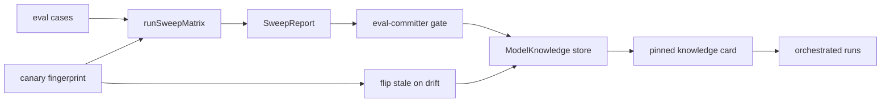

# Evals

`@rulvar/evals` is the quality-measurement package. It is built strictly on the public engine API: an eval case runs your workflow as an ordinary engine run, and a judge grader is an ordinary agent invocation on the same engine. Nothing bypasses the engine, and that is the point. Eval runs are journaled, budget-bounded by the same three-layer budget as production runs, and recordable at the adapter boundary, so an eval suite in CI is fully deterministic: record once, replay forever.

```bash
pnpm add @rulvar/evals
```

## A case at a glance

An `EvalCase` names a workflow, its arguments, and the graders that judge the settled outcome:

```ts
import { createEngine, defineWorkflow } from '@rulvar/core';
import { anthropic } from '@rulvar/anthropic';
import { goldenGrader, runEvalCase } from '@rulvar/evals';

const triage = defineWorkflow(
  { name: 'triage' },
  async (ctx, args: { report: string }) =>
    ctx.agent(`Classify this bug report as "low" or "high" severity.\n\n${args.report}`, {
      schema: {
        type: 'object',
        properties: { severity: { enum: ['low', 'high'] } },
        required: ['severity'],
      },
    }),
);

const engine = createEngine({
  adapters: [anthropic()],
  defaults: {
    routing: {
      loop: 'anthropic:claude-sonnet-5',
      // Schema-bearing agent calls resolve the extract role too.
      extract: { model: 'anthropic:claude-sonnet-5', effort: 'low' },
    },
  },
});

const result = await runEvalCase(
  engine,
  {
    workflow: triage,
    args: { report: 'Crash on startup when the config file is missing' },
    graders: [goldenGrader({ severity: 'high' })],
  },
  { budgetUsd: 0.5 },
);

console.log(result.passed, result.costUsd, result.latencyMs);
```

`runEvalCase` runs the target workflow as its own run on the engine you pass, waits for it to settle, then applies every grader. Pure graders (golden, rubric) execute host-side over the outcome; judge graders go back through the engine. The `passed` bit is strict: the run must settle `ok` and every grader must pass.

The measured `EvalCaseResult` reads entirely off surfaces the engine already provides; no separate measurement channel exists:

| Field | Meaning |
|---|---|
| `status` | The target run's settle status. |
| `passed` | `status === 'ok'` and every grader passed. |
| `verdicts` | One `GraderVerdict` per grader: `{ grader, passed, score?, details? }`. |
| `costUsd` | Target run cost plus all judge run costs (sums of `CostReport.totalUsd`). |
| `judgeCostUsd` | The judge-run share of `costUsd`. |
| `latencyMs` | Run start to run end, from the run's own event timestamps. |
| `usage` | The target run's normalized usage. |
| `error` | The typed wire error when the run did not settle `ok`. |

`RunEvalCaseOptions.budgetUsd` sets the run ceiling of the target run and `judgeBudgetUsd` the ceiling of each judge run, so an eval that spirals is cut off exactly like any production run (see [Budgets](/guide/budgets)).

## Graders

A grader receives a `GraderContext`: `value` (the run's structured output), `outcome` (the full `RunOutcome`, for status- and cost-aware grading), and `judge()`, the only channel back into the engine. It returns a `GraderVerdict`. A grader that throws is not absorbed: a grader that cannot grade is a defect of the suite, not a failed case, and the suite run fails loudly.

| Family | Factory | Verdict | Model calls |
|---|---|---|---|
| Golden | `goldenGrader(expected)` | Comparison against a committed expected output; the evidence lands in `details`. | None |
| Rubric | `rubricGrader(criteria, options?)` | Fraction of named criteria met, reported as `score`; passes at `passThreshold` (default 1, all criteria). | None |
| Judge | `judgeGrader(options)` | The judge model's structured verdict. | One journaled, budgeted judge run through the engine |

### Golden graders

`goldenGrader(expected)` compares `RunOutcome.value` against an expected output you commit next to the case. It needs the workflow to produce structured output (a `schema` on the final agent call, or a plain return value), which is what makes golden comparison mechanical rather than fuzzy.

### Rubric graders

Rubric graders score against declared, named criteria; each criterion is a pure predicate over the output, and the per-criterion verdicts land in `details`:

```ts
import { rubricGrader } from '@rulvar/evals';

type Brief = { summary?: string; citations?: string[] };

const briefRubric = rubricGrader(
  [
    { name: 'has a summary', check: (v) => typeof (v as Brief | undefined)?.summary === 'string' },
    { name: 'cites two sources', check: (v) => ((v as Brief | undefined)?.citations?.length ?? 0) >= 2 },
  ],
  { passThreshold: 0.5 },
);
```

### Judge graders

For open-ended output, `judgeGrader` asks a judge model for a verdict against a schema:

```ts
import { judgeGrader } from '@rulvar/evals';

const factuality = judgeGrader({
  model: { model: 'anthropic:claude-opus-4-8', effort: 'high' },
  instruction: 'Pass only when every factual claim in the answer is supported by the quoted sources.',
});
```

Two properties distinguish this from a typical LLM-as-judge harness:

- **The judge runs through the engine itself.** Each judge invocation is an ordinary journaled, budgeted agent run: it appears in the [journal](/guide/journal), it spends against `judgeBudgetUsd`, and it records and replays at the adapter boundary like every other call. A judge run that does not settle `ok` throws a typed `EvalJudgeError` instead of silently scoring zero.
- **There is no default judge model.** Judge model selection is subject to the router's role quality floors: weak defaults for judging are forbidden, and no advice can override the floors (see [Model routing](/guide/model-routing)), so `model` is always explicit.

The default verdict shape is `JUDGE_VERDICT_SCHEMA` with its boolean `passed`; supply a custom `schema` plus a `toVerdict` mapper when you need a richer verdict. For fully custom judging logic, write your own `Grader` and call `context.judge(spec)` with a `JudgeSpec` (`model`, `prompt`, `schema`) directly.

## Suites and the config matrix

`runEvalSuite(engine, cases, options?)` runs a case list sequentially, in declaration order, and aggregates `passRate`, `totalCostUsd`, and `meanLatencyMs` into an `EvalSuiteResult` alongside `plannedN` and `completedN`. Sequential execution is deliberate: it keeps journal and cassette order deterministic. Duplicate workflow names get `#<ordinal>` suffixes so every result row is unambiguous. Options carry the budget surface: `budgetUsd` is every target run's immutable ceiling, `judgeBudgetUsd` every judge run's, and `envelope` (a `SpendEnvelope`) is the aggregate debit-only bound each of those runs authorizes its ceiling against before starting. Refusals are monotone, never destructive: a refused TARGET stops the walk and lands as the typed `refusal` field with everything already measured intact, and a judge budget event (its own ceiling exhausted, or the envelope refusing it) normalizes into the owning row as `incomplete: { reason: 'judge-exhausted' | 'judge-refused' }` with the failing judge run's actual cost counted; such a row keeps its paid target evidence but can never count as passed. Non-budget grader errors still throw: a grader that cannot grade is a defect of the suite.

The envelope's accounting unit is integer micro-USD ($0.000001) and conservative at the boundary: the cap converts down, every debit converts up (a positive ceiling always debits at least one micro-USD), and a `maxTotalUsd` below one micro-USD is rejected outright, so the sum of admitted original ceilings can never exceed the cap. Amounts that are integer micro-USD up to float noise stay exact: `0.1 + 0.2` against a `0.3` envelope is a fit, not a float rejection.

`runEvalMatrix` runs the same cases against several engine configurations for side-by-side comparison: profile vs profile, cheap workers vs premium, reviewer on vs off. Each `MatrixCell` supplies a fresh engine factory, so cells stay isolated:

```ts
import { createEngine, type Engine, type ModelRef } from '@rulvar/core';
import { anthropic } from '@rulvar/anthropic';
import { openai } from '@rulvar/openai';
import { runEvalMatrix } from '@rulvar/evals';

function engineWithWorkers(loop: ModelRef): Engine {
  return createEngine({
    adapters: [anthropic(), openai()],
    // Route extract at the cell's model too, so schema-bearing cases
    // measure the same member end to end.
    defaults: { routing: { loop, extract: { model: loop, effort: 'low' } } },
  });
}

const report = await runEvalMatrix(
  [
    { name: 'sonnet workers', engine: () => engineWithWorkers('anthropic:claude-sonnet-5') },
    { name: 'mini workers', engine: () => engineWithWorkers('openai:gpt-5.4-mini') },
  ],
  cases,
  { budgetUsd: 2 },
);

for (const cell of report.cells) {
  console.log(cell.cell, cell.passRate, cell.totalCostUsd, cell.meanLatencyMs);
}
```

Pass rate, cost, and latency per cell come from the runs' own usage and cost accounting; the harness adds no measurement of its own.

## Deterministic eval CI

Because target runs and judge runs both cross the `ProviderAdapter` seam, the VCR from [`@rulvar/testing`](/guide/testing) applies unchanged. Record the suite once against live providers, commit the redacted cassette, and run CI hermetically:

```ts
import { createEngine } from '@rulvar/core';
import { anthropic } from '@rulvar/anthropic';
import { record, replay } from '@rulvar/testing';

// Record once, locally, against the live provider:
const recording = createEngine({
  adapters: record({ adapters: [anthropic()], cassette: './evals/triage.jsonl' }),
  defaults: {
    routing: {
      loop: 'anthropic:claude-sonnet-5',
      extract: { model: 'anthropic:claude-sonnet-5', effort: 'low' },
    },
  },
});

// Replay forever, hermetically, in CI. Routing must match the recording
// engine: the resolved model is part of every request's cassette key.
const ci = createEngine({
  adapters: replay({ cassette: './evals/triage.jsonl', onMiss: 'throw' }),
  defaults: {
    routing: {
      loop: 'anthropic:claude-sonnet-5',
      extract: { model: 'anthropic:claude-sonnet-5', effort: 'low' },
    },
  },
});
```

Suite, matrix, and sweep runners all execute sequentially in declaration order precisely so that cassette consumption is deterministic. `onMiss: 'throw'` raises a typed `VcrMissError` on any unrecorded request, so a changed prompt or a new case fails CI loudly instead of quietly going live.

## Matrix sweeps across models

`runSweepMatrix` measures a fixed pool of models against a fixed pool of cases, one cell per `(model, taskClass)` pair, and turns threshold-crossing cells into eval-measured claims for [ModelKnowledge](/guide/model-knowledge):

```ts
import { FileModelKnowledgeStore } from '@rulvar/core';
import { runSweepMatrix, type SweepModel } from '@rulvar/evals';

const store = new FileModelKnowledgeStore(); // ./rulvar.models.json, git-diffable

const report = await runSweepMatrix(
  {
    models: [{ model: 'anthropic:claude-sonnet-5' }, { model: 'openai:gpt-5.4-mini' }],
    cases: [
      { taskClass: 'extraction', case: invoiceCase },
      { taskClass: 'synthesis', case: briefingCase },
    ],
  },
  {
    reportId: 'sweep-2026-07-12',
    committerId: 'ci-eval-pipeline',
    observedAt: '2026-07-12',
    engineFor: (member: SweepModel) => engineRoutedAt(member.model),
    store,
  },
);

console.log(report.cells.length, report.claims.length, report.committedVersion);
```

The moving parts:

- **The pool is fixed and caller-declared.** `engineFor` builds a fresh engine routed at each pool member; you own the adapters, budgets, and VCR posture, so a sweep records and replays like any engine run. `effort` on a `SweepModel` is part of the claim subject's identity.
- **Thresholds gate claim emission.** A cell's pass rate at or above `thresholds.strength` (default 0.9) emits a strength claim; at or below `thresholds.weakness` (default 0.5) a weakness claim; the mid-band emits nothing, because a 0.7 pass rate is uninformative. The defaults ship as `SWEEP_THRESHOLD_DEFAULTS`.
- **The sweep is the deconfounder.** The matrix is independent of your current routing, so it measures models where routing would never send them, which is what breaks self-fulfilling routing bias.
- **`observedAt` is explicit.** The sweep reads no wall clock; claim TTLs apply from the date you pass, which keeps recorded sweeps replayable.
- **Budgets compose from per-run ceilings and one envelope.** `suite: { budgetUsd, judgeBudgetUsd }` gives every target and judge run its own immutable ceiling, and `envelope: new SpendEnvelope(maxTotalUsd)` bounds the whole matrix: each run authorizes its ceiling against the envelope BEFORE starting (debit-only; completions, replays, and CAS retries return nothing), so pool times cases times judge-call growth cannot exceed `maxTotalUsd` even when falsification widens the pool. Refusals never erase paid evidence: a cell keeps every completed case (its `n`, `caseNames`, and costs) next to `plannedN`, flags an envelope-refused target as `envelopeExhausted` with `refusedRunLabel`, counts targets that hit their own ceiling in `exhaustedRuns` and unfinished judges in `judgeIncompleteRuns`, and names the cause in `incompleteReason`. Any incomplete cell emits no claim, because a budget-starved measurement must never become a belief about the model.

When `store` is given, emitted claims commit through the eval-committer identity (below); either way the `SweepReport` carries every cell and every emitted `MeasuredClaimInput` for inspection.

## The canary fingerprint

Provider model ids can silently start pointing at different weights. The registry-derived `modelEpoch` stamp (registry version, price-table version, caps hash; built by `modelEpochOf` in `@rulvar/core`) catches overt swaps and deprecations, but not silent alias re-pointing. The canary fingerprint is the probe that does:

```ts
import { runCanary, flipStaleOnCanaryDrift } from '@rulvar/evals';

const canary = await runCanary(
  engine,
  {
    agentType: 'canary', // a registered profile pinned to the model under probe
    prompts: [
      'List the prime numbers below 30, comma separated.',
      'Rewrite in one sentence: the cat sat on the mat because it was warm.',
    ],
  },
  { budgetUsd: 0.2 }, // each probe run's immutable ceiling
);

if (canary.allOk) {
  const drift = await flipStaleOnCanaryDrift(store, 'anthropic:claude-sonnet-5', canary.fingerprint);
  if (drift.flipped.length > 0) {
    console.warn(`model drift: ${drift.flipped.length} claims flipped to stale`);
  }
}
```

A fingerprint is a sha256 over the normalized outputs of the fixed probe set (`normalizeCanaryOutput`: NFC, trim, collapse whitespace), prefixed with the probe count so a probe-set edit never masquerades as drift; prompt order matters and enters the hash. Nothing on this path pins sampling parameters such as temperature: drift detection rests on the fixed prompts, the normalization, and exact fingerprint comparison. Probes run sequentially through the ordinary engine, one run per probe, each under the optional `budgetUsd` ceiling, so canary runs record and replay like everything else.

The `allOk` gate is load-bearing: a probe that did not settle `ok`, or one the envelope refused before it started (`status: 'refused'`; the loop keeps walking so completed probes survive), enters the fingerprint as its status marker, so a budget-starved or transiently failing probe fingerprints differently without the model having drifted. Never feed a non-`allOk` fingerprint to `flipStaleOnCanaryDrift`; the `rulvar kb sweep` command skips flipping on such runs automatically. (`canaryFingerprint` remains exported for fingerprint-only callers; `runCanary` is the drift-flip surface.)

Stamp sweeps with the fingerprint so drift detection has a baseline, via `modelEpochFor`:

```ts
import { modelEpochOf } from '@rulvar/core';

const report = await runSweepMatrix(pool, {
  // ...as above, plus:
  modelEpochFor: () => modelEpochOf({ canaryFingerprint: fresh }),
});
```

When a later `flipStaleOnCanaryDrift` sees a fresh fingerprint that differs from the one recorded on a claim, it flips the model's active eval-measured claims to `stale` in one CAS-rebased commit. Claims without a recorded fingerprint have no baseline and stay untouched; running it twice is an idempotent noop. In deployments that never run probes, the insurance is structural: negative eval claims expire after 30 days regardless.

## Feeding ModelKnowledge

Sweep evidence is the only path by which measured quality reaches routing:



The contract, in full:

- **Eval-measured claims are the only claims with metrics** (`passRate`, `n`, `graderId`, optional `cost` and `baseline`), and the only class the knowledge card's verified layer compiles into start-tier recommendations. Human-editorial notes render as explicitly unverified and never steer a tier.
- **The eval-committer identity is the only gate** under which eval-measured claims commit. Runs themselves physically cannot write: the runtime holds a read-only handle to the store, so no prompt injection can forge a measurement.
- **The blast radius of a false belief is clamped.** A verified-layer recommendation shifts a ladder's entry tier by at most one rung, and role quality floors stay hard constraints no claim can weaken.
- **Claims decay.** Eval strength claims expire after 90 days, eval weakness claims after 30 (a stale negative belief is costlier, through lock-in); expiry is re-applied on every knowledge pin and every resume re-pin, so a multi-day suspension never resumes under dead beliefs.
- **Standing claims get falsified.** `rulvar kb sweep` (in `@rulvar/cli`, see [CLI](/guide/cli)) re-tests claims through the ordinary engine, journaled, recordable, and budgeted (immutable per-run ceilings plus the `maxTotalUsd` envelope from `kbSweep.budgets`), and always includes models with active negative claims, so a model that improved gets a chance to clear its name.

`runSweepMatrix` with a `store` does the committing for you. For custom pipelines, the same two primitives are exported directly: `evalMeasuredClaim` builds one claim with the TTL applied per the decay table, and `commitEvalMeasured` commits a batch with the CAS-rebase recipe (on rejection, re-read and retry against the fresh version; default 3 attempts):

```ts
import { commitEvalMeasured } from '@rulvar/evals';

const version = await commitEvalMeasured(store, report.claims, {
  committerId: 'ci-eval-pipeline',
  reportId: report.reportId,
});
```

Every claim carries its evidence: sweep-born claims reference the sweep report and the exact case ids that produced the number, so `rulvar kb list` can always answer "why does the engine believe this?".

## The measured-value checkpoint

`runValueCheckpoint` answers one question with money on the table: does the knowledge card DEMONSTRABLY improve tier and agentType selection on eval cases? It was the M12 shipping gate for the proposal loop, and it stays the standing way to re-measure the card's value after material changes. Two A/B experiments run under identical fixed pools, and the checkpoint passes only when BOTH criteria hold.

The vocabulary, bottom up:

- **Rung**: one concrete model of a declared ladder (a `SweepModel`).
- **Ladder** (`CheckpointLadder`): a named rung sequence with a `startTier`, the declared escalation order routing climbs.
- **Cell**: one (ladder, task class) pair; criterion 1 is judged per cell and pooled.
- **Pool** (`CheckpointPool`): the ladders plus `evalCases`, the MEASUREMENT half of the split. The claims snapshot you pass in must come from a seeding sweep over a DISJOINT case set, or the measurement is leakage.
- **Arm** (`CheckpointArm`): one side of an A/B comparison, reduced to `{ passRate, totalCostUsd, n }`.

**Criterion 1, rung selection (per cell, then pooled).** The baseline arm runs every case at the ladder's default start tier; the treatment arm starts at the tier `compileVerifiedLayer` recommends from the snapshot's active claims (default when no recommendation). A cell passes on the exported `rungRuleHolds` rule: the treatment matches or beats the baseline pass rate at no more than 90 percent of its cost, OR beats it by at least 5 points at no more than its cost. Criterion 1 holds when a majority of cells pass AND the pooled aggregate passes the same rule.

**Criterion 2, agentType selection (pooled).** The same orchestrate-role cases run twice: with the knowledge store configured (the pinned card docks into the spawn tool description) and without it. The exported `agentTypeRuleHolds` rule (OQ-09 as amended 2026-07-12) passes the card-informed arm when it matches or beats the baseline pass rate at no more than 105 percent of its cost, OR beats it by at least 15 points at no more than 115 percent (the quality branch: when the baseline fails cheaply, the flat cost bar would punish the card exactly when it wins on quality). A **vacuous-pass guard** sits on top: two arms of total failures demonstrate nothing, so an informed arm with a zero pass rate fails criterion 2 outright.

Cost discipline: every case runs through the ordinary engine, so each arm pays real (or cassette-recorded) model calls under the per-run ceilings of `suite`/`orchestratedSuite`; the orchestrated arms usually need the larger `budgetUsd` because the run ceiling must host the orchestrator cap math and the finalize reserve. Budget for roughly `cells x cases x 2` loop-role runs plus `2 x orchestratedCases` orchestrate-role runs.

A minimal runnable shape:

```ts
import { renderCheckpointReport, runValueCheckpoint } from '@rulvar/evals';

const report = await runValueCheckpoint(
  {
    ladders: [
      {
        name: 'triage',
        startTier: 1,
        rungs: [cheapModel, midModel, strongModel],
      },
    ],
    // Each SweepCase carries its taskClass; disjoint from the seeding sweep.
    evalCases: seededPool.evalCases,
  },
  {
    snapshot: await store.snapshot(), // claims the seeding sweep committed
    observedAt: '2026-07-19',
    engineFor: (member) => engineFor(member),
    orchestrateEngineFor: (withKnowledge) => orchestrateEngine(withKnowledge),
    orchestratedCases,
    suite: { budgetUsd: 0.5 },
    orchestratedSuite: { budgetUsd: 2 },
  },
);

console.log(renderCheckpointReport(report));
console.log(report.passed ? 'the card earns its keep' : 'do not ship the card');
```

Reading the report: `criterion1` lists every cell verdict plus the pooled arms, `criterion2` shows both arms with the guard applied, and top-level `passed` is the AND of the two (criterion 2 counts as failed when unmeasured). `renderCheckpointReport` prints the same as a terminal table. The four building blocks (`runValueCheckpoint`, `renderCheckpointReport`, `rungRuleHolds`, `agentTypeRuleHolds`) are all exported from the package root, so a custom pipeline can reuse the rules on arms it computed itself.

## Next steps

- [Testing](/guide/testing): FakeAdapter, VCR cassettes, and replay-strict runs, the layers eval CI stands on.
- [Model knowledge](/guide/model-knowledge): the claim store, the pinned card, and the human-editorial class.
- [Model routing](/guide/model-routing): ladders, role quality floors, and the resolution chain that claims may only advise.
- [Budgets](/guide/budgets): the three-layer budget that bounds every eval run.
- [API reference](/api/@rulvar/evals/): every exported symbol of `@rulvar/evals`, the checkpoint API included.
