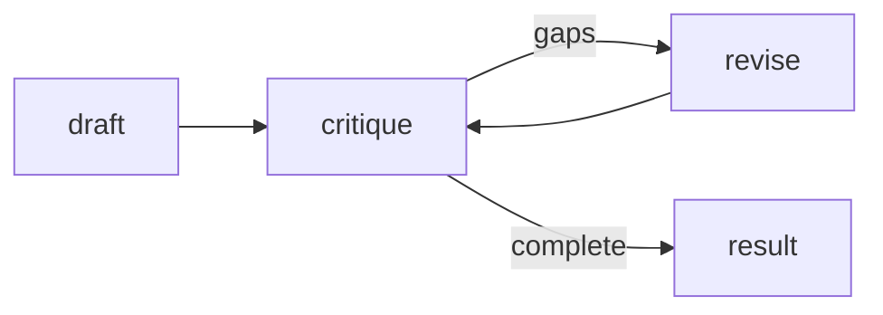

# Example patterns

Four quality-pattern recipes live in [`examples/src`](https://github.com/o-stepper/rulvar/tree/main/examples/src) inside the repository. Each one is a real `defineWorkflow`, not a snippet, and each doubles as an integration test that runs through the full engine on `FakeAdapter` with zero live calls.

The patterns are **recipes, never engine flags**. Rulvar ships no "adversarial" mode, no "judge" mode, no "loop" mode, no "critic" mode. Every pattern below is ordinary prompt-shaped composition over the same `ctx` primitives you already know from [Workflows](/guide/workflows): `ctx.agent`, `ctx.parallel`, `ctx.phase`. That is deliberate. Because the patterns are plain code, they journal, replay, and budget exactly like everything else, and you can bend them to your problem without waiting for a framework release.

| Pattern | Reach for it when | Shape |
|---|---|---|
| Adversarial panel | A claim must survive scrutiny, not just sound plausible | N independent skeptics prompted to refute; majority survives |
| Judge panel | Several approaches are viable and you want the best one | N attempts from different angles, each scored; the top wins |
| Loop-until-dry | The work has unknown size (bugs, edge cases, missing items) | Keep finding until K consecutive empty rounds |
| Completeness critic | A draft is easy but gaps are the failure mode | Draft, then "what is missing?" drives revision passes |

::: tip Run the examples
The examples package is private and not published; it exists as the teaching and integration-test corpus. Run it from a repository clone:

```bash
git clone https://github.com/o-stepper/rulvar.git
cd rulvar
pnpm install
pnpm build
pnpm vitest run examples/src
```

To use a pattern in your own project, copy the workflow and install the runtime and `zod`: `pnpm add @rulvar/core zod` (or the umbrella, `pnpm add @rulvar/rulvar zod`).
:::

## Adversarial panel

One agent asked "is this true?" tends to agree. The adversarial panel inverts the frame: N independent skeptics are each **prompted to refute** the claim, defaulting to refuted when uncertain, and the claim survives only when a majority fail to refute it. The default-refuted framing lives in the prompt, the only place it belongs.

Condensed from [`adversarial-panel.ts`](https://github.com/o-stepper/rulvar/blob/main/examples/src/adversarial-panel.ts):

```ts
import { z } from 'zod';
import { defineWorkflow, type Ctx } from '@rulvar/core';

const refutationSchema = z.strictObject({
  refuted: z.boolean(),
  reason: z.string(),
});

export interface AdversarialArgs {
  claim: string;
  skeptics?: number;
}

export const adversarialPanel = defineWorkflow(
  { name: 'adversarial-panel' },
  async (ctx: Ctx, args: AdversarialArgs) => {
    const skeptics = args.skeptics ?? 3;
    const votes = await ctx.parallel(
      Array.from(
        { length: skeptics },
        (_unused, index) => () =>
          ctx.agent(
            `You are skeptic ${index + 1}. Try to REFUTE this claim; default to refuted:true ` +
              `when uncertain.\n\nClaim: ${args.claim}`,
            { schema: refutationSchema, label: `skeptic-${index + 1}` },
          ),
      ),
    );
    const refutedCount = votes.filter((vote) => vote.refuted).length;
    return { claim: args.claim, survives: refutedCount * 2 < skeptics, refutedCount, votes };
  },
);
```

The vote counting and the majority math are plain code. No agent tallies votes, so nothing about the decision can hallucinate.

**Journal and budget.** Each skeptic runs in its own parallel branch, so each `ctx.agent` call gets its own scope path and writes its own journal entry. A flake in one skeptic never poisons the others, and on resume the finished skeptics replay from the journal while only the interrupted one runs live: the never-pay-twice invariant, applied per branch. Cost scales linearly with `skeptics`, every call passes through the three-layer budget, and the run ceiling you set at start caps the whole panel. See [Journal](/guide/journal) and [Budgets](/guide/budgets).

## Judge panel

When a task admits several credible approaches, generating one answer commits you to whichever angle the model happened to pick. The judge panel generates one attempt per angle in parallel, scores each attempt with a judge call, and returns the top-scoring attempt with the full ranking.

Condensed from [`judge-panel.ts`](https://github.com/o-stepper/rulvar/blob/main/examples/src/judge-panel.ts):

```ts
const scoreSchema = z.strictObject({
  score: z.number(),
  rationale: z.string(),
});

const DEFAULT_ANGLES = ['mvp-first', 'risk-first', 'user-first'];

export const judgePanel = defineWorkflow(
  { name: 'judge-panel' },
  async (ctx: Ctx, args: { task: string; angles?: string[] }) => {
    const angles = args.angles ?? DEFAULT_ANGLES;
    const scored = await ctx.parallel(
      angles.map((angle) => async () => {
        const attempt = String(
          await ctx.agent(`Solve, ${angle}: ${args.task}`, { label: `attempt-${angle}` }),
        );
        const judged = await ctx.agent(
          `Score this attempt from 0 to 10 for the task "${args.task}".\n\nAttempt: ${attempt}`,
          { schema: scoreSchema, label: `judge-${angle}` },
        );
        return { angle, attempt, score: judged.score };
      }),
    );
    const ranked = [...scored].sort((a, b) => b.score - a.score);
    return {
      task: args.task,
      winner: ranked[0],
      ranking: ranked.map(({ angle, score }) => ({ angle, score })),
    };
  },
);
```

The judge is not special machinery. It is an ordinary agent invocation: journaled, budgeted, and recordable like any other call. To make the judge trustworthy, pin it to a stronger model with the per-call `model` option or an agent profile, and use role quality floors in engine config to keep unsuitable models out of critical roles entirely. See [Model routing](/guide/model-routing).

**Journal and budget.** Each angle costs two journaled calls, the attempt and its judge, sequenced inside one parallel branch. That is 2N calls total, and `CostReport.byModel` splits attempt spend from judge spend whenever the judge runs on a different model. The `label` option on every call is telemetry only; it names spans and events but never enters entry identity, so relabeling never forces a rerun.

## Loop-until-dry

Discovery work has unknown size: you do not know how many bugs, edge cases, or missing items exist. A fixed `while (count < N)` loop misses the tail; the loop-until-dry pattern instead keeps spawning finder rounds until K **consecutive** rounds surface nothing new. The dry-streak counter is the point.

Condensed from [`loop-until-dry.ts`](https://github.com/o-stepper/rulvar/blob/main/examples/src/loop-until-dry.ts):

```ts
const findingsSchema = z.strictObject({
  items: z.array(z.string()),
});

export const loopUntilDry = defineWorkflow(
  { name: 'loop-until-dry' },
  async (ctx: Ctx, args: { target: string; dryRounds?: number; maxRounds?: number }) => {
    const dryLimit = args.dryRounds ?? 2;
    const maxRounds = args.maxRounds ?? 8;
    const seen = new Set<string>();
    let dryStreak = 0;
    let rounds = 0;
    while (dryStreak < dryLimit && rounds < maxRounds) {
      rounds += 1;
      const result = await ctx.agent(
        `Find items for "${args.target}" that are NOT already in this list: ` +
          `${JSON.stringify([...seen])}. Return an empty list when nothing new remains.`,
        { schema: findingsSchema, label: `finder-round-${rounds}` },
      );
      const fresh = result.items.filter((item) => !seen.has(item));
      if (fresh.length === 0) {
        dryStreak += 1;
        continue;
      }
      dryStreak = 0;
      for (const item of fresh) seen.add(item);
    }
    return { target: args.target, found: [...seen], rounds };
  },
);
```

Each round tells the finder what is already known, so it hunts for something new instead of restating round one. Deduplication is plain code, not an agent.

**Journal and budget.** Each round is its own journal entry, but not always under a distinct content key. A round that surfaces new items grows the list the next prompt embeds, so the next round derives a fresh key; a dry round leaves the list untouched, so consecutive dry rounds repeat the same prompt byte for byte and share a key, staying distinct by ordinal within the scope (the changing `label` is telemetry only and plays no part). Either way, on resume the completed rounds replay in journal order through scoped forward-matching, the plain-code dedup and dry-streak recompute deterministically from the replayed results, and the loop continues live from the first incomplete round. Unknown-size work is exactly where budgets earn their keep: `maxRounds` is the code-level cap so a pathological model still terminates, and the immutable dollar ceiling you pass at run start is the hard backstop underneath it:

```ts
const handle = engine.run(loopUntilDry, { target: 'edge cases in the parser' }, { budgetUsd: 2 });
const outcome = await handle.result;
// If the ceiling trips mid-loop, outcome.status is 'exhausted'
// and outcome.cost is still a complete CostReport.
```

## Completeness critic

Drafting is easy; gaps are the failure mode. The completeness critic produces a draft, then a critic asks "what is missing?" and its gaps drive a revision pass, repeating until the critic reports complete or `maxRevisions` is reached.



Condensed from [`completeness-critic.ts`](https://github.com/o-stepper/rulvar/blob/main/examples/src/completeness-critic.ts):

```ts
const critiqueSchema = z.strictObject({
  complete: z.boolean(),
  gaps: z.array(z.string()),
});

export const completenessCritic = defineWorkflow(
  { name: 'completeness-critic' },
  async (ctx: Ctx, args: { brief: string; maxRevisions?: number }) => {
    const maxRevisions = args.maxRevisions ?? 2;
    let draft = String(
      await ctx.phase('draft', () => ctx.agent(`Draft a response to: ${args.brief}`)),
    );
    let revisions = 0;
    let gaps: string[] = [];
    while (revisions < maxRevisions) {
      const critique = await ctx.phase('critique', () =>
        ctx.agent(
          `Review this draft for the brief "${args.brief}". List what is missing; ` +
            `report complete:true only when nothing material remains.\n\nDraft: ${draft}`,
          { schema: critiqueSchema, label: `critic-${revisions + 1}` },
        ),
      );
      gaps = critique.gaps;
      if (critique.complete || critique.gaps.length === 0) break;
      revisions += 1;
      draft = String(
        await ctx.phase('revise', () =>
          ctx.agent(
            `Revise the draft to address these gaps: ${JSON.stringify(critique.gaps)}.\n\n` +
              `Draft: ${draft}`,
          ),
        ),
      );
    }
    return { brief: args.brief, draft, revisions, outstandingGaps: gaps };
  },
);
```

The critic returns structured gaps, and the revision prompt receives exactly those gaps. Nothing is lost in paraphrase between the two calls, because the handoff is code.

**Journal and budget.** Each stage runs inside its own `ctx.phase`, and phases are structural for cost attribution: `CostReport.byPhase` reads `draft`, `critique`, and `revise` as separate buckets, so you can see at a glance whether revisions are eating the budget. The journal records the stages sequentially, and a resume mid-revision replays the draft and every completed critique without paying for them again.

## Test them like the repository does

Every pattern above ships with an integration test that runs the **full engine**, journal, scheduler, budget layers, and event stream, against `FakeAdapter` from `@rulvar/testing`. Responder patterns match on `agentType`, `label`, or a regex over the prompt, with `'*'` as the fallback, and a function responder sees the call it is answering, so a test scripts exactly the panel it wants. Fake calls cost zero dollars. Condensed from the corpus test:

```ts
import { createTestEngine, type FakeCall } from '@rulvar/testing';
import { adversarialPanel } from './adversarial-panel.js';

const engine = createTestEngine({
  agents: {
    '*': (call: FakeCall) =>
      JSON.stringify({ refuted: call.label === 'skeptic-1', reason: 'test' }),
  },
});

const outcome = await engine.run(adversarialPanel, { claim: 'the sky is blue' }).result;
// outcome.value: { survives: true, refutedCount: 1, ... }
// outcome.cost.totalUsd === 0
```

Because a pattern is just a workflow, the test proves the orchestration logic itself: the majority math, the dry-streak termination, the ranking order, the revision loop. See [Testing](/guide/testing) for the full toolkit, including journal replay and VCR cassettes.

## Next steps

- [Orchestration modes](/guide/orchestration-modes) explains who authors control flow; these recipes are all mode (a), human scripts.
- [Workflows](/guide/workflows) covers the `ctx` primitives the recipes compose: `ctx.agent`, `ctx.parallel`, `ctx.pipeline`, `ctx.phase`.
- [Budgets](/guide/budgets) details the three-layer budget every pattern call passes through.
- [Journal](/guide/journal) explains scope paths, content keys, and the never-pay-twice invariant the resume stories above rely on.
- API reference: [`@rulvar/core`](/api/@rulvar/core/) and [`@rulvar/testing`](/api/@rulvar/testing/).
