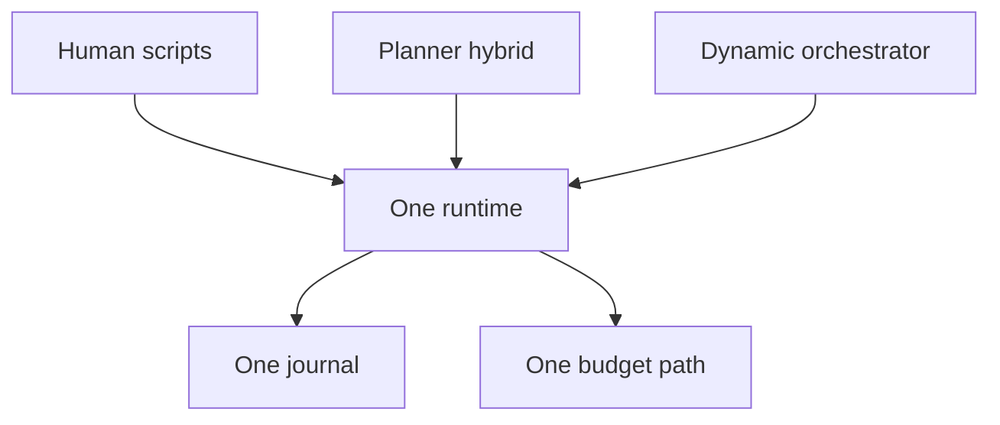

# What is Rulvar?

> Rulvar is an embeddable TypeScript engine for multi-agent LLM workflows: durable, budget-bounded, vendor-neutral, observable, and testable, running entirely inside your own application.

It is intentionally a **library**, not a platform. Rulvar lives inside a host application and requires no server, no database, and no control plane. You call `createEngine`, hand it a workflow, and get back a typed handle with a result promise and an event stream. Shells (a CLI, an HTTP server, a queue worker) exist in `@rulvar/cli`, but they are optional and are built strictly on top of the same public APIs you use.

The engine owns everything around the model calls that is easy to get wrong and expensive to get wrong twice: remembering completed work across crashes, enforcing a dollar ceiling that nothing can talk past, keeping provider SDKs out of your core logic, and making the whole thing testable without live API keys.

## The problems it solves

- **Durability: never pay twice.** The journal is a content-addressed memoizing log of completed effects, not an event-sourcing log. When a run crashes, restarts, or is resumed weeks later, every completed LLM call is replayed from the journal at zero cost; only work that never finished runs live. Editing a workflow and inserting a new call costs exactly one live call: there is no global prefix invalidation and no workflow-versioning ceremony (changed content means a new key, which means one live call). See [Durability](/guide/durability) and [The journal](/guide/journal).
- **Hard budgets.** Every run takes a dollar ceiling that is immutable after start; no API, including human-in-the-loop decisions, can raise it. Enforcement has three layers: admission before every spawn, a guard before every agent turn, and abort-signal stream cutting when the ceiling is crossed. Overshoot is bounded and declared, at most one turn per in-flight agent, because providers bill aborted streams and no tighter bound is possible. Exhaustion is a typed outcome carrying partial results, never a null. See [Budgets](/guide/budgets).
- **Vendor neutrality by construction.** The core imports no provider SDKs; every provider lives behind the adapter interface in its own package. First-class adapters ship for Anthropic and OpenAI, an `openaiCompatible` factory covers compatible endpoints, and a bridge to the ai-sdk ecosystem serves the long tail. The model is resolved on every invocation, not once per agent, through a chain of call override, agent profile, workflow defaults, and engine defaults; a single agent can route its loop, extraction, and summarization to different models from different providers. See [Providers](/guide/providers) and [Model routing](/guide/model-routing).
- **Testability out of the box.** `@rulvar/testing` ships a fake adapter, VCR cassettes with secret redaction, and replay-strict runs that settle with a typed error on the first would-be live call. Your CI never needs an API key. See [Testing](/guide/testing) and [Evals](/guide/evals).
- **Observability without wiring.** Every run emits one typed event stream you can iterate or subscribe to, and settles with a cost report attributing spend by model, phase, agent type, and invocation role. OpenTelemetry export ships with the CLI package. See [Observability](/guide/observability).
- **Embeddability first.** No lower layer depends on the shells, and every guard state in the adaptive machinery has a terminating fallback that needs no human present: an embedded run with no operator always terminates instead of hanging. The safe default and the embeddable default are the same configuration. See [Architecture](/guide/architecture).

## A first taste

```bash
pnpm add @rulvar/rulvar
```

The umbrella package re-exports the core plus both first-class adapters, the file-backed stores, and a terminal progress renderer. Define a workflow as a plain async function over `ctx`, create an engine, and run it under a budget:

```ts
import { anthropic, createEngine, defineWorkflow, JsonlFileStore } from "@rulvar/rulvar";

const digest = defineWorkflow(
  { name: "digest" },
  async (ctx, args: { articles: string[] }) => {
    // Fan out: one summarizer agent per article, in parallel.
    const summaries = await ctx.parallel(
      args.articles.map((text) => () => ctx.agent(`Summarize in two sentences:\n\n${text}`)),
    );
    // Fan in: one agent writes the digest.
    return ctx.agent(`Write a one-paragraph digest of these summaries:\n\n${summaries.join("\n\n")}`);
  },
);

const engine = createEngine({
  adapters: [anthropic()], // reads ANTHROPIC_API_KEY from the environment
  stores: { journal: new JsonlFileStore({ dir: "./runs" }) },
  defaults: { routing: { loop: "anthropic:claude-sonnet-5" } },
});

const articles = ["First article text...", "Second article text..."];
const handle = engine.run(digest, { articles }, { budgetUsd: 1.0 });
const outcome = await handle.result;

if (outcome.status === "ok") {
  console.log(outcome.value);
  console.log(`spent $${outcome.cost.totalUsd.toFixed(4)}`);
}
```

If the process dies halfway through, nothing is lost and nothing is re-billed. Rebind the same journal and resume; completed calls replay from the journal and only unfinished work runs live:

```ts
const resumed = engine.resume(handle.runId, digest, { args: { articles } });
const outcome2 = await resumed.result;

const preview = await resumed.preview;
console.log(`${preview.hits} calls replayed for free, ${preview.misses} ran live`);
```

The [Quickstart](/guide/quickstart) builds this out step by step, including structured outputs, tools, and the event stream.

## Three orchestration modes at a glance

Rulvar has exactly three ways to decide what work happens, and all three run on one runtime, one journal, and one budget path. There is no fourth mode.



| Mode | Who decides the workflow | How it executes |
|---|---|---|
| Human scripts | You, as a deterministic TypeScript closure | In process, with lint support for determinism; ships in `@rulvar/core` |
| Planner hybrid | A planner model writes a script against a published API card | The script passes lint and a self-repair loop, then executes deterministically in a worker sandbox; ships in `@rulvar/planner` |
| Dynamic orchestrator | An orchestrator agent decides at run time with typed spawn tools | The agent loop spawns, waits, and finishes under admission control; an optional extension adds the plan as typed, engine-owned data (`@rulvar/plan`) |

Because the modes share the journal and the budget path, everything on this page applies to all of them: a planner-written script resumes exactly like a hand-written one, and a dynamic orchestrator's spawns are admitted against the same ceiling as your own `ctx.workflow` calls.

For most workloads the recommended shape is the simplest one: a phase chain using `ctx.phase` with nested `ctx.workflow` calls, replanning only between phases over compact artifacts with fresh context. The dynamic plan machinery is opt-in and aimed at wide fan-out workloads that cannot wait for a phase boundary. Quality patterns (adversarial panels, judge panels, completeness critics) ship as recipes and prompt templates, never as engine flags. See [Orchestration modes](/guide/orchestration-modes), [The planner](/guide/planner), and [Adaptive orchestration](/guide/adaptive-orchestration).

## What Rulvar is not

- **Not a platform.** There is no server to deploy, no database to provision, and no control plane to operate. Persistence is a pluggable store; the in-memory and JSONL file stores ship in the core, SQLite in `@rulvar/store-sqlite`. The CLI, HTTP server, and queue worker in `@rulvar/cli` are optional shells over the public API, not a hosted product.
- **No handoffs, no chat rooms.** The single cross-agent primitive is call-and-return: invoke a specialist, get its result back. Handoffs, chat-room emergence, and blackboard coordination are rejected on principle, because they destroy budget attribution and scope identity. If you want agents that wander a shared conversation, Rulvar is the wrong tool.
- **No graph or YAML execution core.** Workflows are TypeScript. Control flow is your `if`, `for`, and `await`, checked by your compiler, not a DSL interpreted by the engine.
- **No engine-level strategy flags.** Patterns like judge panels or loop-until-done ship as recipes you compose from the primitives, so the engine surface stays small and every behavior stays inspectable in your own code.
- **No cross-run memory or vector store.** Runs are isolated by design. The one sanctioned exception is [Model knowledge](/guide/model-knowledge), an opt-in, evidence-backed store of model behavior claims used for routing, which is off by default.

## When to choose Rulvar

Reach for Rulvar when:

- You are embedding LLM workflows inside an existing TypeScript application and refuse to operate a separate orchestration service.
- Your workflows are long or expensive enough that a crash, deploy, or retry must not re-bill completed model calls.
- You need a spend ceiling that holds under adversarial conditions, including an orchestrator model that would happily keep spawning.
- You mix providers and models within a single run and want that routing to be data, not scattered SDK calls.
- You want workflow tests and evals in CI without live keys.

Look elsewhere when:

- You need a single prompt call; a provider SDK alone is simpler.
- You want open-ended agent societies with emergent communication; Rulvar's call-and-return topology forbids that on purpose.
- You want a hosted, click-ops workflow product; Rulvar is a library you ship inside your own software.

## What's in the box

| Area | Capability |
|---|---|
| Journal | Content-addressed memoizing journal with scoped forward-matching on resume, two-phase entries, and typed decision entries for every dynamic choice. [The journal](/guide/journal) |
| Budgets | Three-layer enforcement, immutable run ceiling, bounded overshoot, hierarchical sub-accounts for child workflows. [Budgets](/guide/budgets) |
| Providers | Adapter SPI; first-class Anthropic and OpenAI adapters, an OpenAI-compatible factory, and an ai-sdk bridge. [Providers](/guide/providers) |
| Model routing | Per-invocation resolution chain, invocation roles, model ladders, capability scrubbing, a versioned price table, role quality floors. [Model routing](/guide/model-routing) |
| Workflows | `defineWorkflow` closures over `ctx`: agents, parallel fan-out, pipelines, steps, phases, child workflows, external suspensions, deterministic shims. [Workflows](/guide/workflows) |
| Tools and MCP | Typed `tool()` definitions, a layered permission chain, MCP servers as tool sources. [Tools](/guide/tools), [MCP](/guide/mcp) |
| Observability | One typed event stream, cost reports, OpenTelemetry export. [Observability](/guide/observability) |
| Testing | Fake adapter, VCR cassettes, replay-strict runs, vitest and jest matchers, an evals package. [Testing](/guide/testing), [Evals](/guide/evals) |
| Stores | Five-method byte-store SPI with an optional lease capability; in-memory, JSONL, and SQLite stores; an executable conformance kit for store authors. [Stores](/guide/stores) |
| Shells | Optional CLI with TUI progress, HTTP server with SSE, queue worker over leasable stores. [CLI](/guide/cli) |

## Status

Rulvar is released at **v<!-- version:lockstep -->1.31.0<!-- /version -->** under the **Apache-2.0** license. It requires **Node.js 22.12.0 or newer** and is **ESM only**. All `@rulvar/*` packages version in lockstep, with one exception: `@rulvar/compat`, which carries frozen key-derivation profiles for old journals and is versioned independently. See [Versioning](/reference/versioning) and the [Changelog](/reference/changelog).

## Where to go next

1. [Installation](/guide/installation): package choices, runtime requirements, API keys.
2. [Quickstart](/guide/quickstart): a complete workflow with structured outputs, tools, resume, and the event stream.
3. [Architecture](/guide/architecture): how the journal kernel, the runtime, the model layer, and the stores fit together.
4. [API reference](/api/): the generated TypeScript surface, package by package.
5. [Rulvar for LLMs](/guide/llms): the one-page orientation to hand an AI assistant that writes Rulvar code, with the machine-readable exports of this site.
