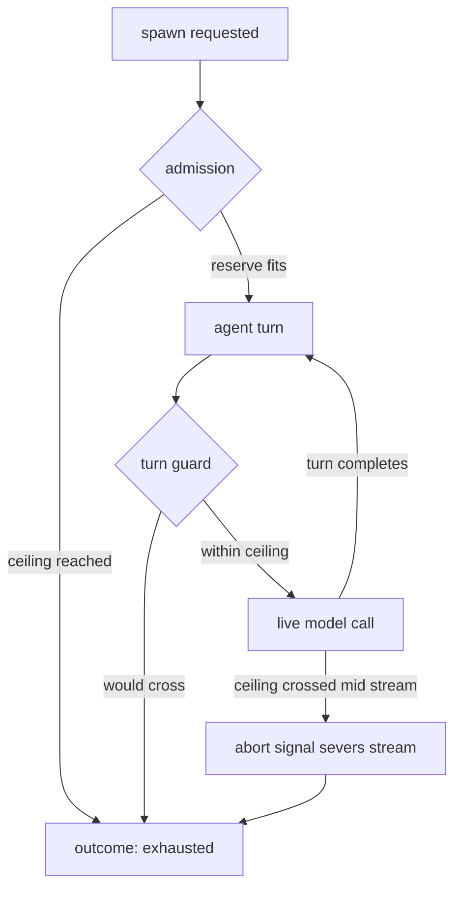

# Core invariants

Six invariants drive every design decision in Rulvar. Each one is a user-facing guarantee backed by a concrete mechanism, not a policy statement. If a proposed feature would contradict an invariant, the feature loses.

| Invariant | Mechanism | What it buys you |
| --- | --- | --- |
| Never pay twice | Content-addressed memoizing journal | Crash, resume, and edit workflows without re-billing completed LLM calls |
| Decision entries precede effects | One journal entry per dynamic decision; derived state is a pure fold | A resumed run is the same run; nothing is re-litigated |
| Call-and-return only | Agent-as-tool is the single cross-agent primitive | Exact budget attribution and stable identity for every piece of work |
| Three-layer budget | Projected admission, per-turn guard with an output bound, ceiling signal | An immutable dollar ceiling with a declared, bounded overshoot |
| One runtime, one journal, one budget path | All three orchestration modes share one engine | Every guarantee holds identically in every mode |
| Embeddable by construction | Every guard state has a non-interactive terminating fallback | Unattended runs settle; they never hang waiting for a human |

## Never pay twice

A completed LLM call is never paid for twice. The journal enforces this: Rulvar records every completed effect (agent calls, steps, child workflow calls, random draws) in a content-addressed memoizing log, and on resume serves completed work back instead of re-executing it. Tool turns inside an agent call are not journal entries of their own; they live in the agent's transcript, and turn-boundary checkpoints in the transcript store let an agent interrupted mid-call resume from its last completed turn instead of re-paying earlier turns.

The journal is not event sourcing. It does not replay your code's history; it memoizes the results of paid work. Entry identity is structural and content based:

- the scope path: the structural path locating the call site within the run's execution tree,
- the content key: sha256 over the canonical JSON of the call itself (prompt, model, schema hash, toolset hash),
- the ordinal: which repeat of an identical call within the scope this is.

Identity is qualified by a hash version, so journals written by older releases stay readable across upgrades. See [Journal compatibility](/guide/journal-compatibility).

On resume the kernel matches calls to entries with scoped forward-matching: a call that matches a completed entry replays for free; a call with no match goes live. A miss does not move the matching cursor and does not suppress later hits, so inserting a new call between two completed ones costs exactly one live call and never invalidates the entries after it. There is no global prefix flip, and there is no workflow versioning API: change the content of a call and it gets a new key and one live execution, while everything you did not change keeps replaying.

```ts
import { createEngine, defineWorkflow, JsonlFileStore } from "@rulvar/core";
import { anthropic } from "@rulvar/anthropic";

const engine = createEngine({
  adapters: [anthropic()],
  stores: { journal: new JsonlFileStore({ dir: "./journal" }) },
});

const briefing = defineWorkflow({ name: "briefing" }, async (ctx, topic: string) => {
  const notes = await ctx.agent(`Collect the key facts about ${topic}.`);
  return ctx.agent(`Write a one page brief from these notes:\n${notes}`);
});

// First attempt: pays for the first call, crashes before the second.
engine.run(briefing, "the EU AI Act", { runId: "briefing01" });

// After a restart: the first call replays from the journal at zero cost,
// only the unfinished work goes live.
const handle = engine.resume("briefing01", briefing, { args: "the EU AI Act" });
console.log(await handle.preview); // hit / miss / rerun / orphan accounting
```

Only completed, paid work replays. An entry that was still running when the process died is handled by recovery rules, never silently trusted.

::: warning
The default journal store is in memory: memoization works within the process, and resume across processes is disabled with a loud warning. Give the engine a durable store (the bundled JSONL file store, or [@rulvar/store-sqlite](/reference/packages)) to get crash resume. See [Stores](/guide/stores) and [Durability](/guide/durability).
:::

## Decision entries precede effects

Every dynamic decision a run makes is journaled before any of its effects happen. Plan revisions, spawn admission verdicts, escalation decisions, a timeout's default decision, guard verdicts, verify results, budget-guard denials, no-progress aborts: each one is exactly one decision entry, appended strictly before the effect it authorizes, and it carries inside it everything that would otherwise have to be re-evaluated live.

Everything the engine derives from those entries (the plan view, the budget ledger, wake digests, the model knowledge card) is a pure fold: a deterministic derivation over already-journaled state, pinned to a snapshot, ordered by spawn ordinal and never by wall clock. A fold reads; it never produces new effects.

This invariant exists because replay must never re-litigate a decision. If the admission verdict for a spawn were recomputed on resume, a changed price table or a different scheduler interleaving could admit work the original run rejected, and the journal would stop being the source of truth. Because the verdict is an entry, resume reads the decision back instead of re-deciding, and the resumed run is the same run.

What it buys you:

- Deterministic resume. A crash between a decision and its effects re-applies the journaled decision; it does not re-ask a model or re-run a guard.
- Replay-strict testing. Because decisions are data, a whole run can be re-executed against its journal with zero live calls and byte-identical derived state. See [Testing](/guide/testing) and [Determinism](/guide/determinism).
- A complete audit trail. The journal is not just a cache; it is the full decision log of the run, including every denial and every timeout default.

## Call-and-return only

The single cross-agent primitive is agent-as-tool: invoke a specialist, get its result back. Parents call children; children return. Structure always comes from the call tree, whether the caller is your code, a planner-written script, or a live orchestrator with spawn tools.

```ts
const research = defineWorkflow({ name: "research" }, async (ctx, topic: string) => {
  return ctx.agent(`Summarize the state of the art on ${topic}.`);
});

const report = defineWorkflow({ name: "report" }, async (ctx, topics: string[]) => {
  // Each child runs in its own journal scope with its own budget sub-account.
  const summaries = await ctx.parallel(
    topics.map((t) => () => ctx.workflow(research, t)),
  );
  return ctx.agent(`Merge these summaries into one report:\n${summaries.join("\n\n")}`);
});
```

Handoffs, chat rooms, blackboard coordination, and emergent topologies are rejected on principle, for two concrete reasons:

- Budget attribution. Every dollar of spend must map to exactly one call site and propagate up a chain of budget accounts to the run ceiling. A handoff has no answer to "who pays for the conversation after the transfer"; a chat room has no answer at all. Call-and-return makes attribution exact by construction.
- Scope identity. Journal entry identity starts with a structural scope path, and the never-pay-twice guarantee depends on that path being stable across executions. Emergent topologies have no stable call structure, so their work could not be matched on resume and would be paid again.

This is a deliberate trade: Rulvar gives up free-form agent societies and in exchange every unit of work has a stable identity, an owner, and a price. See [Agents](/guide/agents) and [Orchestration modes](/guide/orchestration-modes).

## The three-layer budget

A run's dollar ceiling is enforced by three cooperating layers, not by trust:

| Layer | When it runs | What it does |
| --- | --- | --- |
| 1. Admission | Before every spawn | Blocks the spawn when spent plus committed reserves has reached the ceiling on any account in the ancestor chain |
| 2. Turn guard | Before every agent turn | Refuses to dispatch a turn that would cross any ceiling in the chain |
| 3. Ceiling signal | On ceiling crossing | Severs live streams through an AbortSignal; partial usage is journaled with `usageApprox: true` |



Three properties make the ceiling a real guarantee:

- Bounded overshoot. Spend beyond the ceiling is bounded by one turn per in-flight agent. No tighter bound is possible, because providers bill aborted streams; Rulvar declares the bound instead of pretending it is zero.
- The ceiling is immutable, for the run's whole life. It is fixed at `engine.run(...)` time, recorded in the run's store metadata, and restored on every resume: `engine.resume` reads back both the pre-crash spend and the ceiling it counts against, and `ResumeOptions` deliberately carries no budget field, so no API can raise the ceiling after start, restarts included, not even a human approval decision. A journal written before the ceiling was recorded (or read through a store that drops optional `RunMeta` fields) resumes uncapped; see [Durability](/guide/durability).
- Exhaustion is never null. A run that hits its ceiling settles with status `"exhausted"`, partial results where they exist, an itemized list of dropped work, and a complete cost report. You always learn what your money bought.

```ts
const digest = defineWorkflow({ name: "digest" }, async (ctx, urls: string[]) => {
  const summaries = await ctx.parallel(
    urls.map((u) => () => ctx.agent(`Summarize ${u}`, { estCost: 0.1 })),
  );
  ctx.log("info", "spend so far", { usd: ctx.budget.spent().usd });
  return summaries.join("\n");
});

const outcome = await engine.run(
  digest,
  ["https://example.com/a", "https://example.com/b"],
  { budgetUsd: 10 }, // the immutable run ceiling
).result;

if (outcome.status === "exhausted") {
  // May exceed 10 by at most one turn per in-flight agent.
  console.log(outcome.cost.totalUsd);
  console.log(outcome.dropped); // losses are itemized, never silent
}
```

Inside a workflow, `ctx.budget.spent()` and `ctx.budget.remaining()` expose the live ledger, and the `estCost` hint feeds the admission reserve for a spawn. The full account model, including per-child sub-accounts and the orchestrator's finalize reserve, is covered in [Budgets](/guide/budgets).

## One runtime, one journal, one budget path

Rulvar has exactly three orchestration modes, and all three execute on the same runtime, the same journal identity model, and the same budget layers:

| Mode | Who writes the workflow | Runner |
| --- | --- | --- |
| Human scripts | You, as deterministic TypeScript | In-process runner in `@rulvar/core` |
| Planner hybrid | A planner model writes a script, which lints, self-repairs, then executes deterministically | Worker sandbox runner in `@rulvar/planner` |
| Dynamic orchestrator | A live agent with typed spawn tools decides as it goes | The same engine, through the same admission path |

No fourth mode exists, and the adaptive machinery (plans, escalations, model ladders) is built as extensions on the same path rather than as a parallel engine.

This invariant is what makes the other five worth having. Because there is a single path, never-pay-twice, decision entries, call-and-return, and the budget layers hold identically whether a person, a planner model, or a live orchestrator produced the workflow. Resume, replay-strict tests, cost reports, and the event stream behave the same in every mode, and moving a workload between modes is a refactor, not a migration. See [Orchestration modes](/guide/orchestration-modes) and [Architecture](/guide/architecture).

## Embeddable by construction

Rulvar is a library, not a platform. The core runs inside your process with no server, no database, and no control plane; the CLI, HTTP, and queue shells are optional and built strictly on the public APIs, so nothing in the engine depends on them.

The invariant with teeth: every guard state has a non-interactive terminating fallback. An embedded run with no operator present always terminates rather than hanging.

- Escalations that wait for a decision carry a deadline and a journaled default decision (accept, unless you configure otherwise). When the deadline fires, the default applies and the run proceeds.
- An open `ctx.awaitExternal(...)` suspension does not block the process forever: the run settles with status `"suspended"` and the open suspensions listed on the outcome, ready to be resolved and resumed later.
- Oscillation and no-progress guards force termination instead of letting a dynamic orchestrator loop.
- In dynamic orchestrator runs, budget exhaustion triggers a forced finish drawn from the orchestrator's pre-reserved finalize slice, so even a run that hits its ceiling produces a result instead of dying mid-thought. Script runs that hit the ceiling settle as `"exhausted"` with partial results, as described above.

```ts
const triage = defineWorkflow({ name: "triage" }, async (ctx, report: string) => {
  const r = await ctx.agent(`Assess this incident report and propose a fix:\n${report}`, {
    // Opting into escalation requires a consumer for the report:
    // result: "full" (as here) or an engine-level onEscalation hook.
    result: "full",
    escalation: {
      flavor: "B",
      deadlineMs: 300_000,
      // No operator around? This journaled decision applies at the deadline.
      defaultDecision: { kind: "accept" },
    },
  });
  // An accepted escalation is a terminal status, never an error.
  if (r.status === "escalated") return r.escalation.scopeDelta;
  return r.output;
});
```

The corollary is that the safe default and the embeddable default coincide by construction. Every mechanism that can influence a run ships in the same package as the mechanism that corrects it, so the configuration that is safe to run unattended is the configuration you get out of the box, not the result of a hardening checklist. See [Durability](/guide/durability) and [Adaptive orchestration](/guide/adaptive-orchestration).

## What the invariants rule out

Some frequently requested features contradict an invariant and are rejected on principle:

- Handoffs and chat-room topologies (break budget attribution and scope identity).
- A workflow versioning or migration API (changed content is a new key and one live call; there is nothing to version).
- Raising a run's budget mid-flight, by any API (the ceiling is immutable).
- A fourth orchestration mode (one runtime, one journal, one budget path).
- A mandatory server or control plane (embeddability first).

## Next steps

- [Journal](/guide/journal): the identity model and replay mechanics behind never-pay-twice.
- [Budgets](/guide/budgets): accounts, reserves, and the three layers in depth.
- [Orchestration modes](/guide/orchestration-modes): choosing between scripts, the planner, and the dynamic orchestrator.
- [Determinism](/guide/determinism): the ctx shims and lint rules that keep replays honest.
- [API reference for @rulvar/core](/api/@rulvar/core/): every symbol used on this page.
