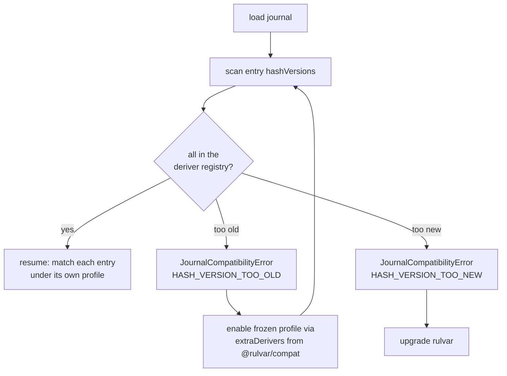

# Journal compatibility

Journals outlive the library that wrote them. A run can sit suspended on an approval for weeks; a queue worker can pick up a journal written by a different deployment; you will upgrade rulvar mid-project with thousands of paid entries on disk. This page explains the mechanism that keeps those journals working: what is versioned, what happens when an old journal meets a new engine, and what you do about it.

The one-sentence promise: **an entry is always matched under the rules of the version that wrote it, or the engine refuses with a typed error.** There is no third mode. A silent key miss that quietly reruns (and repays) your whole run is excluded by construction.

## Why upgrades threaten a journal

The [journal](/guide/journal) is content-addressed: each entry's content key is a sha256 over the canonical JSON of the call's identity input. Replay on resume works by deriving the key of each live call and matching it against journaled entries. That makes key derivation itself load-bearing: if a new rulvar release derived keys even slightly differently (a new identity field, a changed schema canonicalization, a different scope-path rule), every pre-upgrade entry would miss, and the entire paid prefix of the run would rerun live. That is exactly the defect the never-pay-twice invariant exists to prevent.

Offline migration is not an option either: the journal stores hashes, not hash preimages, so old keys cannot be recomputed under new rules. The only honest designs are the two rulvar implements: match each entry under its own version, or refuse loudly.

## hashVersion: one number per entry

Every journal entry carries an integer `hashVersion` field that versions the **entire identity and replay pipeline as one atomic unit**:

| Covered by hashVersion |
|---|
| The canonical JSON algorithm (RFC 8785) |
| The identity field set per entry kind |
| The hash function |
| The `schemaHash` and `toolsetHash` derivations |
| The scope-path grammar and ordinal rules |
| The replay disposition table |
| Fold defaults for fields absent in older entries |
| The kind and status vocabularies the engine must interpret |

Everything in that table changes only together, in one bump. As of rulvar 1.1.0, `CURRENT_HASH_VERSION` is `2`.

The rules that follow from per-entry versioning:

- **New entries are always written at the current version.** Migration is incremental: the version boundary runs between entries, not between runs. A journal that suspends on version 1 and resumes on a version 2 engine simply grows version 2 entries after its version 1 prefix. Mixed-version journals are fully supported.
- **Bumps are rare and disciplined.** `hashVersion` is bumped only when identity derivation, replay semantics, or kinds and statuses that an in-window engine could not interpret actually change. Additive optional fields never bump it: readers tolerate unknown kinds and unknown fields, and stores pass them through byte for byte.
- **Every bump ships as at least a minor release** with a compatibility note in the changelog, a frozen fixture of the previous profile, and contract tests for the new one.
- **Deprecation never breaks replay.** API lifecycle and journal lifecycle are governed independently: journals written through a since-removed API remain readable for as long as their `hashVersion` is supported.

Very old journals wrote the version under a legacy field name; load-time normalization reads it as `hashVersion` (falling back to `1` when absent). Stores are append-only and never rewritten.

## The KeyDeriver registry

For each supported version the engine holds one **frozen KeyDeriver profile**, immutable after release and pinned by golden fixtures:

```ts
interface KeyDeriver {
  readonly hashVersion: HashVersion;
  /** Features not expressible in this profile yield 'incomparable' (a guaranteed non-match). */
  project(input: IdentityInput): CanonicalIdentity | "incomparable";
  deriveKey(c: CanonicalIdentity): string;
  schemaHash(schema: JsonSchema): string;
  toolsetHash(tools: ToolContract[]): string;
  readonly dispositionTable: DispositionTable;
  readonly foldDefaults: Readonly<{
    effort: Effort;
    memoizeOutcome: boolean;
    budgetAccount: "root";
  }>;
}
```

`@rulvar/core` ships the in-window profiles as `deriverV1` and `deriverV2`. A profile is data plus pure functions; it carries no `replayAction` method. The single canonical `replayDisposition` predicate consumes the profile's disposition table, dispatched on the entry's own `hashVersion`.

Matching at resume works like this:

1. Forward-matching within a scope is unchanged: each scope has a cursor, and a live call is compared against every unconsumed entry ahead of it.
2. For each candidate entry, the live call's identity is **projected down** into that entry's profile (`project`), and the key is derived **under that entry's version** (`deriveKey`). Keys are memoized per version, so a mixed-version scope costs one extra sha256 per version present, not per entry.
3. `incomparable` is a guaranteed non-match: if the live call uses a feature the old profile cannot express (a decision entry, a plan revision), the match honestly fails rather than risking a cross-domain hash collision.
4. If one live call matches candidates at two versions, journal order resolves it: the first unconsumed match wins.
5. The disposition of a matched entry (replay, rerun, or skip) comes from **its own version's** table. On the version 1 domain the tables coincide, so a mixed journal is deterministic end to end.

Two consequences worth knowing:

- **Ordinals are per version.** Two identical calls paid before an upgrade exist as version 1 entries with ordinals 0 and 1. A third identical call after the upgrade finds no version 2 entry, runs live once, and is written at version 2 with ordinal 0 in its own `(hashVersion, key)` space. Every later resume matches all three entries, each under its own version, with zero repays.
- **Two-phase pairs stay single-version.** A version 1 `running` entry left hanging by a crash is re-dispatched as a fresh current-version operation (at-least-once); the old orphan lands in the resume report. A version 1 suspended entry, by contrast, keeps matching under its own predicate; its closing resolution is simply appended at the current version, referenced by seq.

### The version 1 profile as a case study

The version 1 identity predates `effort` in the requested model spec. Its profile therefore projects `effort` **out** of the live call's identity before hashing, so the version 1 predicate is effort-insensitive by construction. Without this, a release that changed role effort defaults would miss the entire paid prefix of every older journal.

The defined default for the missing field lives in the **fold layer**, never in matching identity: when pricing, ladder statistics, or the budget fold read a version 1 entry, `foldDefaults` supplies `effort: 'medium'`, `memoizeOutcome: false`, and root budget attribution. New entries record real effort in identity. Matching and derived reads stay cleanly separated, which is exactly what lets a frozen profile keep matching forever.

## The support window

The engine reads and resumes entries with `hashVersion` in the window **`[CURRENT-2, CURRENT]`**, three versions deep. Inside the window, compatibility is unconditional:

::: info Never pay twice through an upgrade
For any journal whose versions all lie inside the support window, and an unchanged workflow, replay on the new engine performs zero live calls.
:::

| Profile | Status | Where it lives |
|---|---|---|
| hashVersion 2 | current | `@rulvar/core` (`deriverV2`), always on |
| hashVersion 1 | in window | `@rulvar/core` (`deriverV1`), always on |
| older than the window | retired | `@rulvar/compat`, enabled explicitly via `extraDerivers` |

At `CURRENT_HASH_VERSION = 2` no released profile has left the window yet, so today you never need `@rulvar/compat` for a real journal. The window, not the package version, is the compatibility promise to plan operations against.

## When an old journal meets a new library

If a journal contains any entry outside the engine's supported range, resume refuses with a typed `JournalCompatibilityError`:

```ts
class JournalCompatibilityError extends RulvarError {
  readonly code = "journal_compat";
  readonly subCode: "HASH_VERSION_TOO_OLD" | "HASH_VERSION_TOO_NEW";
  readonly runId: string;
  /** Seq of the first violating entry. */
  readonly entrySeq: number;
  readonly entryHashVersion: number;
  readonly supportedRange: { min: number; max: number };
  readonly hint: string;
}
```

| Sub-code | Meaning | Your move |
|---|---|---|
| `HASH_VERSION_TOO_OLD` | The journal predates the window. | Add the named frozen profile from `@rulvar/compat` to `extraDerivers` and resume again. |
| `HASH_VERSION_TOO_NEW` | The journal contains entries from a newer engine (a partial downgrade, or a stale worker). | Upgrade rulvar. Downgrade is unsupported; this refusal is the honest failure mode. |

The check runs as **one scan immediately after load, strictly before any live call, any append, and any admission budget reserve**, so the refusal is free of side effects: nothing is paid, nothing is written, and the journal is byte-identical afterwards. In queue mode the same check repeats at lease acquire, which (together with the lease's fencing epoch) guarantees a worker running an older library can never write into a journal that already contains newer entries.



## Frozen profiles: @rulvar/compat

When a profile leaves the window it moves into `@rulvar/compat`: frozen data plus code, tree-shakeable, one export per retired version. You wire it back in through the `extraDerivers` option of `createEngine`, which is the **only** window extender:

```ts
import { createEngine, JsonlFileStore } from '@rulvar/core';
import { deriverV0Synthetic } from '@rulvar/compat';
import { anthropic } from '@rulvar/anthropic';

const engine = createEngine({
  adapters: [anthropic()],
  stores: { journal: new JsonlFileStore({ dir: './runs' }) },
  extraDerivers: [deriverV0Synthetic],
});
```

A malformed value in `extraDerivers` is a typed `ConfigError` at engine construction, before any run effect.

Because no real profile has been retired yet, the package currently exports `deriverV0Synthetic`: a synthetic out-of-window profile (hashVersion 0) that exists so the whole path, refusal, hint, `extraDerivers`, and resume, can be exercised and tested today. When a real profile leaves the window it will be published under the same pattern, and the error's `hint` field will name the export to enable.

**Why is @rulvar/compat versioned independently?** Every other rulvar package releases in lockstep with identical versions. `@rulvar/compat` is the sole exemption, on purpose: its contents are frozen profiles, and a lockstep force-bump would republish an unchanged frozen profile under a new version number, falsely suggesting the profile changed, which is precisely what a frozen profile must never do. Instead the package releases only when a profile actually moves into it. Keeping retired profiles out of `@rulvar/core` also keeps the core small and embeddable: you pay for history only when you have history.

## Cross-version reuse: donor-profile projection

[Adaptive orchestration](/guide/adaptive-orchestration) can serve a byte-identical re-added task by reference to an abandoned donor subtree instead of respawning it. Reuse matching is strict key equality on the donor's spawn-root content key, and it crosses version boundaries with the same discipline as ordinary matching:

- There is **no upward canonization** of legacy entries; hash preimages are not stored, so none is possible.
- The candidate spawn's identity is projected **down** into the profile of the stored donor entry (`project` plus `deriveKey` under the donor's version).
- `incomparable` means an invisible donor: admission proceeds with a fresh spawn. It never means a guessed match, so a wrong reuse link across an upgrade is excluded by construction.
- The version 1 effort default applies only in the fold layer (pricing, reclaimed-spend accounting) and never enters matching identity.

The net effect: a run suspended before an upgrade can resume on the new engine and still reclaim its own pre-upgrade work by reference, or honestly redo it, but never silently alias the wrong work.

## Upgrade guidance

1. **Upgrade the whole scope together.** Every `@rulvar/*` package except `@rulvar/compat` shares one version; mixed versions are unsupported.

   ```bash
   pnpm up "@rulvar/*@latest"
   ```

2. **Read the changelog compat note.** A release that bumps `hashVersion` is at least a minor and states the new current profile, the resulting window, and whether any profile moved to `@rulvar/compat`.
3. **Dry-run long-lived runs before going live.** `resume` with `dryRun: true` performs replay-strict matching: the first call that would go live fails the run with a typed error, and zero live calls are made. For an unchanged workflow inside the window you should see all hits and no reruns.
4. **Add `@rulvar/compat` only when asked.** If resume throws `HASH_VERSION_TOO_OLD`, install the package and enable the deriver named in the `hint`:

   ```bash
   pnpm add @rulvar/compat
   ```

5. **Never downgrade under a journal.** An older engine refuses newer entries with `HASH_VERSION_TOO_NEW`; in queue deployments, upgrade workers before producers so a stale worker never acquires a lease on a newer journal.

## Worked example

Suppose a journal in `./runs` was written by an engine whose profile has since left the support window. The resume refuses before touching anything:

```ts
import { createEngine, JournalCompatibilityError, JsonlFileStore } from '@rulvar/core';
import { anthropic } from '@rulvar/anthropic';
import { reviewFlow } from './workflows.js';

const engine = createEngine({
  adapters: [anthropic()],
  stores: { journal: new JsonlFileStore({ dir: './runs' }) },
});

try {
  await engine.resume('01JZKQ7T9GVX0N4C2B8RSMEW5D', reviewFlow).result;
} catch (err) {
  if (err instanceof JournalCompatibilityError) {
    console.error(err.subCode);          // 'HASH_VERSION_TOO_OLD'
    console.error(err.entrySeq);         // seq of the first violating entry
    console.error(err.entryHashVersion); // 0
    console.error(err.supportedRange);   // { min: 1, max: 2 }
    console.error(err.hint);             // names the deriver to enable
  }
}
```

The fix is one dependency and one option. Verify with a dry run first, then resume for real (shown here with the synthetic profile; a retired historical profile wires in identically):

```ts
import { createEngine, JsonlFileStore } from '@rulvar/core';
import { deriverV0Synthetic } from '@rulvar/compat';
import { anthropic } from '@rulvar/anthropic';
import { reviewFlow } from './workflows.js';

const engine = createEngine({
  adapters: [anthropic()],
  stores: { journal: new JsonlFileStore({ dir: './runs' }) },
  extraDerivers: [deriverV0Synthetic],
});

// Replay-strict preflight: zero live calls, zero appends.
const check = engine.resume('01JZKQ7T9GVX0N4C2B8RSMEW5D', reviewFlow, { dryRun: true });
const preview = await check.preview;
console.log(preview.hits, preview.misses, preview.reruns); // e.g. 42 0 0

// The real resume: the paid prefix replays under the old profile,
// new entries are appended at the current hashVersion.
await engine.resume('01JZKQ7T9GVX0N4C2B8RSMEW5D', reviewFlow).result;
```

After this resume the journal is mixed-version: the old prefix keeps its original `hashVersion` forever (and keeps needing the compat deriver), while everything new is written at the current version.

## See also

- [The journal](/guide/journal): entry identity, content keys, scope paths, and the replay predicate.
- [Durability](/guide/durability): crash windows, checkpoints, and queue-mode leases.
- [Stores](/guide/stores): the append-only store contract that makes unknown fields pass through.
- [Versioning policy](/reference/versioning): the lockstep release policy and its exemptions.
- API reference: [`@rulvar/core`](/api/@rulvar/core/) and [`@rulvar/compat`](/api/@rulvar/compat/).
