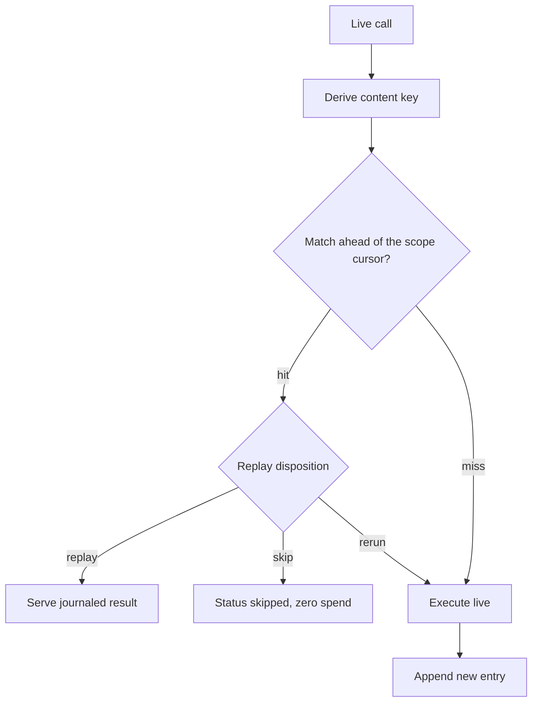

# The journal

The journal is the heart of rulvar: a per-run, append-only, **content-addressed memoizing log of completed effects**. Every effectful operation in a workflow, every LLM call, every journaled step, every suspension and decision, is appended as a journal entry through a pluggable store. On resume, your workflow code runs again from the top; every call whose identity matches a completed entry is served from the journal instead of hitting a provider. That is the never-pay-twice invariant: work that was paid for once is never paid for again.

## Not event sourcing

The journal is deliberately not an event-sourcing system. rulvar never reconstructs workflow state from events through reducers or projections, and there is no command/event split to design. Your code is the control flow: it re-executes on every resume, and for each call the journal answers exactly one question: has this exact effect already completed, and what did it produce? Entries record completed effects and journaled decisions, never intentions. Derived views (budget ledger, plan state, resume reports) are pure folds over the entries; they never produce new effects.

## Wiring a durable journal

The default journal store is in-memory, which disables resume (with a loud warning). Give the engine a durable store and every run becomes resumable:

```ts
import {
  createEngine,
  defineWorkflow,
  FileTranscriptStore,
  JsonlFileStore,
} from '@rulvar/core';
import { anthropic } from '@rulvar/anthropic';

const engine = createEngine({
  adapters: [anthropic()],
  stores: {
    journal: new JsonlFileStore({ dir: './runs' }),
    transcripts: new FileTranscriptStore({ dir: './runs' }),
  },
});

const triage = defineWorkflow({ name: 'triage' }, async (ctx, repo: string) => {
  // fetchOpenIssues returns plain JSON
  const issues = await ctx.step('fetch-issues', () => fetchOpenIssues(repo));
  return ctx.agent(
    `Group these issues by root cause:\n${JSON.stringify(issues)}`,
    { agentType: 'analyst' },
  );
});

const handle = engine.run(triage, 'acme/api', { budgetUsd: 5 });
await handle.result;
```

After a crash, a redeploy, or a budget stop, resume with the same run id against the same store:

```ts
const resumed = engine.resume(handle.runId, triage, { args: 'acme/api' });
const report = await resumed.preview; // { hits, misses, skipped, reruns, orphaned, ... }
await resumed.result;
```

The run's original arguments are not journaled for in-process workflows, so the host re-supplies them through `args`; omit them and the workflow body receives `undefined` for its parameters on any live rerun.

The `JsonlFileStore` journal is a plain JSONL file per run, so it doubles as a human-readable event log. See [Stores](/guide/stores) for the SQLite store, queue-mode leases, and writing your own.

## Entry identity

Every entry is identified by a version-qualified tuple:

| Component | What it is |
|---|---|
| scope path | The structural path of the call site within the run's execution tree, for example `par:0:2/pipe:1:4`. |
| content key | sha256 over the RFC 8785 canonical JSON of the call's identity input. |
| ordinal | The repeat counter of an identical key within one scope, so repeated identical calls stay distinct. |
| hashVersion | The version of the entire identity and replay pipeline, qualifying all of the above. |

### Scope paths

Scope paths come from call-and-return structure only, never from wall-clock or arrival order. A sequential body is one scope; sequential calls are distinguished by key and ordinal alone. Structured concurrency adds segments:

| Call site | Scope path |
|---|---|
| Top-level sequential body | `` (empty) |
| Branch 2 of the first parallel site | `par:0:2` |
| Stage 1, source item 4 of a pipeline in that branch | `par:0:2/pipe:1:4` |
| Second invocation of child workflow `extract-invoices` | `wf:extract-invoices:1` |
| A spawn issued by an orchestrator agent | `agent:17` |

Pipeline items are keyed by the index of the original input item, so streaming reorder never shifts identity. `ctx.phase(...)` is cosmetic: it groups events and cost reporting but adds no segment and never affects keys.

### What enters the content key

For an agent call, the identity input is exactly:

| Field | Notes |
|---|---|
| agentType | The profile name. |
| requested model spec | Canonical model reference plus canonical effort; for laddered spawns, the declared ladder with its start tier. |
| prompt, or `key` when set | `opts.key` replaces the prompt verbatim in the identity. |
| schemaHash | The canonicalized output schema; annotation-only keywords (`title`, `description`, `default`, `deprecated`, `readOnly`, `writeOnly`, `examples`, `$comment`) are stripped first. |
| toolsetHash | The tool contracts, sorted by name: name, description, parameters, version. |
| isolation | The resolved isolation spec. |

Other call types are keyed the same way from their own inputs: `ctx.step` on its label (or `key`) plus its declared `deps`; `ctx.workflow` on the registered workflow name plus the canonical JSON of its args (or `key`); `ctx.awaitExternal` on its key; the deterministic shims (`ctx.now`, `ctx.random`, `ctx.uuid`) bind positionally by scope and ordinal, with `ctx.random(key)` as a stable alternative.

Just as important is what never enters a content key:

* cosmetics: `label`, phase names
* handling policy: `onError`, `retry`, `memoizeOutcome`, the per-call `replay` mode
* lineage and approach metadata
* a tool's `execute` implementation (changing an implementation never invalidates the journal; bump the tool's `version` to signal a semantic change)
* which model actually served the call: failover changes the entry's `servedBy`, never its key

Consequence: you can change retry policy, error handling, or memoization between runs without re-keying a single paid entry.

### hashVersion

Every entry carries an integer `hashVersion` that versions the whole identity and replay pipeline as one unit. New entries are always written at the current version, a mixed-version journal is legal, and each entry is matched under its own version's rules, so upgrading rulvar never silently re-keys paid work. See [Journal compatibility](/guide/journal-compatibility) for the support window and the `@rulvar/compat` package.

## What gets journaled

| Kind | Written by | What it records |
|---|---|---|
| `agent` | `ctx.agent`, orchestrator spawn tools | One LLM agent invocation: structured output, usage, `servedBy`, a transcript reference. |
| `step` | `ctx.step` | One journaled effectful step (API write, database call) and its JSON result. |
| `child` | `ctx.workflow` | One nested workflow invocation and its result. |
| `external` | `ctx.awaitExternal` | A suspension awaiting an external value. |
| `approval` | the permission chain | A suspended tool-approval request, with a journaled deadline. |
| `rand` | `ctx.now` / `ctx.random` / `ctx.uuid` | The shim value, identical on every replay. |
| `decision`, `plan.revision`, `plan.decision`, `ledger.op` | the engine | Dynamic decisions (admission verdicts, escalation decisions, plan revisions), written strictly before any of their effects. |
| `resolution`, `abandon` | resolutions and branch abandonment | Ref-entries closing or covering earlier entries (see below). |

Tool calls inside an agent's loop are not individual journal entries: they live in the transcript, and the runtime writes a checkpoint at every turn boundary, so an approval or a crash continues the loop from the same turn without re-invoking tools. Between a tool's execution and the checkpoint write, tools are at-least-once; prefer idempotent tools. See [Tools](/guide/tools) and [Durability](/guide/durability).

Decision entries have a request/value split: only the proposed request is hashed, while everything the engine computed (minted ids, admission verdicts, budget reserves) is stored in the value part and read back on replay, never recomputed. A decision is made exactly once.

All journaled values must be JSON-serializable; a violation throws a typed `NonSerializableValueError` at the call site without journaling anything. Large artifacts belong in the transcript store by reference; a value over the soft threshold (256 KiB) produces a warning event, never an error.

## Replay, rerun, skip

When a live call matches a journaled entry, one canonical pure function in the journal kernel decides what happens. The replay disposition has exactly three outcomes:

| Effective status of the entry | Disposition |
|---|---|
| `ok` | **replay**: serve the journaled result, zero live calls. |
| `escalated` | **replay**: an escalation report is completed, paid work; the consumer sees the same report and usage. |
| skipped (derived) | **skip**: the branch was abandoned; the caller gets status `skipped` with a zero spend increment. |
| `limit` | **rerun**, unless `memoizeOutcome: true` was fixed in the entry; the model ran to its cap, so the work is task-complete. |
| `error` | **rerun** by default; **replay** only when `memoizeOutcome: true` is fixed in the entry AND the error was task-class. |
| `cancelled` | **rerun**; `memoizeOutcome` has no effect on cancellation, and only a journaled abandon can skip it. |
| hanging `running` | **rerun**: re-dispatch (see orphan recovery below). |
| `suspended` | outside the table: stays suspended until a closing ref-entry arrives. |

The error classifier separates task-class failures (schema mismatch, terminal errors, non-retryable tool errors) from transport-class failures (transport, rate limit, budget). Transport failures always rerun, even under `memoizeOutcome`: resume must never cache a transient outage as a final outcome.

`memoizeOutcome` is the opt-in that turns a task-class failure into a final, replayable outcome:

```ts
const attempt = await ctx.agent(prompt, {
  schema: patchSchema,
  memoizeOutcome: true, // a task-class failure replays instead of rerunning
  result: 'full',
});
```

The flag is journaled in the entry at dispatch time and the predicate reads it from the entry, never from current code, so flipping it later does not re-key or re-judge old entries. When a memoized failure should be retried after all (say, the external API recovered), unpin it explicitly at resume:

```ts
engine.resume(runId, triage, { args: 'acme/api', invalidate: [42] }); // entry seq 42 reruns live
```

## Resume: scoped forward-matching

Each scope keeps its own cursor over the journaled entries. A live call derives its content key and searches forward from the cursor within its scope; the first unconsumed match wins.



The cursor rules are what make edits cheap:

* A miss does not advance the cursor and does not extinguish later hits. Inserting a new call in the middle of a paid body costs exactly one live call; every neighbor keeps replaying.
* Deleting a call marks its entry orphaned. Orphans go to the resume report and are never charged again.
* Completed neighbors are never repaid. There is no global prefix flip: systems that match by position must treat the first divergence as invalidating everything after it; rulvar matches by content within scope, so a change costs exactly the changed call.
* There is no workflow-versioning API and no migration ceremony. Changed content means a new key, which means one live call. Edit prompts freely; the journal decides per call.

### Per-call replay modes

| Mode | Semantics |
|---|---|
| scoped (default) | Forward-matching within the call's scope, as above. |
| `cache` | Ordinal-aware matching across the whole run: N identical calls bind to N distinct entries regardless of scope. |
| `never` | Always live; the result is journaled as a new entry. |

```ts
const opinion = await ctx.agent(panelPrompt, { replay: 'cache' });
```

One accepted limitation: two intentionally identical calls swapped with each other inside one scope bind in journal order. If two calls are byte-identical on purpose but must not be interchangeable, give them distinct `key` values; `eslint-plugin-rulvar` flags duplicate identical calls.

### Previewing a resume

`dryRun` resumes in replay-strict mode: matching proceeds normally, but the first would-be-live call throws a typed `JournalMissError` and the run settles with that error, with zero live calls performed:

```ts
const dry = engine.resume(runId, triage, { dryRun: true });
const preview = await dry.preview;
console.log(preview.hits, preview.misses, preview.reruns, preview.orphaned);
```

## Two-phase entries and orphan recovery

Dispatched kinds (`agent`, `step`, `child`) are two-phase: a `running` entry is appended at dispatch, and a terminal entry (`ok`, `error`, `limit`, `cancelled`, `escalated`) is appended at completion, referencing the running entry by sequence number. This split defines the crash semantics precisely:

* Crash after the terminal entry: the work is complete and paid; resume replays it. Reuse of a completed entry is exactly-once.
* Crash between the two: the `running` entry is left hanging. Resume re-dispatches the operation live (dispatch is at-least-once) and counts it under `reruns` in the resume report; `orphaned` stays reserved for deleted calls, entries never consumed by any live call.

For agents, re-dispatch is cheaper than it sounds: the runtime checkpoints the transcript at every turn boundary, so a re-dispatched agent continues from its last completed turn instead of turn zero. The repaid window is bounded by one turn.

Single-phase kinds (`rand`, the decision family, ref-entries) are appended once, as facts.

## Suspensions, ref-entries, and first-closing-wins

`ctx.awaitExternal`, tool approvals, and escalation requests write an entry with status `suspended`. A suspended run can park indefinitely, and the process may even exit with outcome `suspended`; the journal holds the position.

```ts
const signoff = await ctx.awaitExternal<{ approved: boolean }>('legal-signoff', {
  prompt: 'Ship the release?',
});
```

Resolving a suspension never mutates the suspended entry. Instead, every attempt to close it is itself an append of a **ref-entry**: a `resolution` (or, for branch cancellation, an `abandon`) that references the target entry by its sequence number. Ref-entries are excluded from forward-matching: they never shift cursors or ordinals, and a pure fold finds them by reference.

```ts
const outcome = await handle.resolveExternal('legal-signoff', { approved: true });
// outcome.applied is false when an earlier attempt already closed the suspension
```

Because every attempt is appended, even losing ones, races resolve by construction: the **first-closing-wins fold** picks the first valid closing entry in journal order; later attempts are classified as no-ops by the fold, never stored as such, and the waiting promise settles exactly once. A deadline timer firing in the same instant as an operator's answer is just two appended attempts; the journal order decides, identically on every replay. Approvals and escalations carry a journaled `deadlineAt`, so deadlines survive resume deterministically (`awaitExternal` itself has no deadline).

`abandon` is the journaled decision to stop pursuing a subtree. It covers its target and, transitively, every entry under the target's scope. Covered entries get the derived `skipped` status: they are not re-dispatched at resume, contribute zero spend, and the caller sees status `skipped`. The `skipped` status is never persisted; it is always derived by the fold, and the underlying payloads stay addressable so completed work inside an abandoned branch can later be reused by reference. See [Adaptive orchestration](/guide/adaptive-orchestration) for how plan revisions compile into abandons and reuse.

## Keeping call identity stable

Replay quality is entirely a function of identity stability. The rules of thumb:

**Use the shims for anything nondeterministic.** `Date.now()`, `Math.random()`, and ad-hoc UUIDs change the prompt (and therefore the key) on every execution. The ctx shims are journaled once and replay identically:

```ts
const deadline = ctx.now() + 60_000;     // journaled; identical on replay
const shard = ctx.random('shard-pick');  // keyed form survives reordering
const ticketId = ctx.uuid();
```

**Serialize embedded data deterministically.** The prompt string is hashed verbatim. If you interpolate an object whose key order or array order is unstable, the key changes even though nothing meaningful did. Sort before you stringify.

**Pin volatile prompts with `key`.** When a prompt legitimately contains volatile input (freshly fetched context, a timestamped report) but the call is logically the same call, `opts.key` replaces the prompt in the identity:

```ts
const review = await ctx.agent(buildReviewPrompt(freshContext), {
  key: `review:${prNumber}`, // identity is the key, not the prompt text
  schema: verdictSchema,
});
```

On replay the journaled result is served even though the freshly built prompt differs; that is the declared meaning of `key`.

**Declare step dependencies.** `ctx.step` keys on its label plus `deps`, useMemo-style, so the step re-runs exactly when its inputs change:

```ts
const upload = await ctx.step('upload-report', () => putReport(bucket, report), {
  deps: [bucket, reportHash],
});
```

What re-keys a call and what never does:

| Re-keys the call (one live call) | Never re-keys |
|---|---|
| Prompt text (unless `key` is set) | `label` and phase names |
| `agentType` | `onError` and retry policy |
| Requested model, effort, or declared ladder | `memoizeOutcome` and the `replay` mode |
| Output schema shape | Schema annotations: `title`, `description`, `default`, `deprecated`, `readOnly`, `writeOnly`, `examples`, `$comment` |
| Tool contracts: name, description, parameters, version | Tool `execute` implementations |
| Isolation spec | Which model actually served after failover |
| Step `deps`, label, or `key` | Lineage and approach metadata |

A re-key is not a failure mode: it costs exactly the changed call, and the resume report tells you which entries were orphaned by the change.

## Next steps

* [Durability](/guide/durability): crash windows, checkpoints, queue-mode leases.
* [Journal compatibility](/guide/journal-compatibility): hashVersion, mixed-version journals, `@rulvar/compat`.
* [Determinism](/guide/determinism): the ctx shims and what "deterministic enough" means.
* [Stores](/guide/stores): shipped stores and the store contract.
* [Testing](/guide/testing): replay-strict runs and the fake adapter.
* [Core API reference](/api/@rulvar/core/): every symbol on this page.
