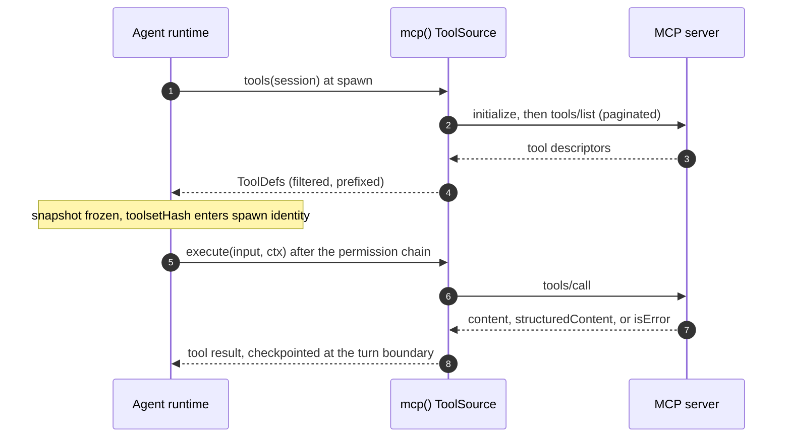

# MCP

`mcp()` in `@rulvar/core` imports a Model Context Protocol server as a `ToolSource` on the tool bus, wrapping [`@modelcontextprotocol/sdk`](https://github.com/modelcontextprotocol/typescript-sdk) (pinned at `^1.29`). Every imported tool becomes an ordinary `ToolDef`: the Agent Runtime dispatches it through the same [permission chain](/guide/tools), records its result in the same canonical history, and hashes its contract into the same `toolsetHash` as a native tool. There is no MCP-specific dispatch channel and nothing for policy to miss.

The bus is consume-only: Rulvar connects to MCP servers as a client. It does not serve its own tools or agents over MCP.

## Transports

Three transports are supported:

| Transport | When to use |
|---|---|
| `stdio` | Local MCP servers spawned as a child process. |
| `streamable-http` | Remote MCP servers reachable over HTTP or HTTPS. |
| `inprocess` | An in-memory server instance living in your own process, for tests and embedded servers. |

```ts
import { mcp } from '@rulvar/core';

const filesystem = mcp({
  transport: 'stdio',
  command: 'mcp-server-filesystem',
  args: ['--root', './workspace'],
});

const search = mcp({
  transport: 'streamable-http',
  url: 'https://mcp.example.com/v1',
});

const embedded = mcp({
  transport: 'inprocess',
  server: myInMemoryServer, // an in-memory server instance
});
```

Exactly the config keys matching the chosen transport must be set: `command`/`args` for `stdio`, `url` for `streamable-http`, `server` for `inprocess`. Anything else is a typed `ConfigError`, raised early rather than at first call.

## Importing tools

The full configuration surface of `mcp()`:

```ts
import { mcp } from '@rulvar/core';

const github = mcp({
  transport: 'stdio',
  command: 'mcp-server-github',
  allow: ['get_issue', 'list_issues', 'create_comment'],
  prefix: 'gh',
  approval: { create_comment: true },
  risk: {
    get_issue: 'read',
    list_issues: 'read',
    create_comment: 'write',
  },
});
```

| Option | What it does |
|---|---|
| `allow` / `deny` | Tool-name filters on the original (pre-prefix) names; omitted `allow` means all, and `deny` wins over `allow`. |
| `prefix` | Namespaces imported names as `${prefix}_${name}`, so `create_comment` above surfaces as `gh_create_comment`. |
| `approval` | `true` sets `needsApproval: true` on every imported tool; the record form sets it per tool name. An approval-flagged tool asks at the permission chain's terminal default. |
| `risk` | Host-supplied `ToolRisk` labels (`read`, `write`, `network`, `execute`, `destructive`) so permission presets can govern imported tools. |

Two naming rules are enforced for you. Every final tool name (after prefixing) must match `^[a-zA-Z0-9_-]{1,64}$`, else `ConfigError`. And a name collision between two sources in one toolset without a disambiguating `prefix` is a `ConfigError` at spawn time, never a silent shadowing.

MCP servers declare no risk metadata of their own, and Rulvar deliberately does not trust a server's self-description for policy. The `risk` map is your trust decision: unlabeled imported tools fall under the undeclared-risk row of every preset, which asks under `strict` and `standard`.

## One bus for every tool

`ToolSource` is the seam that makes native tools, in-process MCP servers, and stdio or streamable-http MCP servers indistinguishable to the runtime:

```ts
interface ToolSource {
  id: string;
  tools(session: ToolSourceSession): Promise<ToolDef[]>;
}
```

Anywhere the engine accepts tools (`ToolsOption`), you can mix plain `ToolDef` values, tool sources, and registered toolset names side by side: a string entry names a toolset registered under engine `defaults.toolsets` and means the same thing in direct calls, profiles, and the sandbox dialect, while an unknown name is a typed `ConfigError` before any provider call (see [Tools](/guide/tools#attaching-tools-to-agents)). The dynamic orchestrator's `toolsetRef` spawn parameter draws from the same registry. At spawn time the engine expands every source, validates names and duplicates across the whole toolset, and freezes the snapshot:

```ts
import { createEngine, defineWorkflow } from '@rulvar/core';
import { anthropic } from '@rulvar/anthropic';

const engine = createEngine({
  adapters: [anthropic()],
  defaults: {
    profiles: {
      triager: {
        description: 'Triages GitHub issues and drafts responses.',
        model: 'anthropic:claude-sonnet-5',
        tools: [github], // the mcp() source from above, mixed freely with ToolDefs
        permissions: { preset: 'standard' },
      },
    },
  },
});

const triage = defineWorkflow(
  { name: 'triage-issue' },
  async (ctx, args: { issue: number }) => {
    return ctx.agent(`Triage issue #${args.issue} and draft a response.`, {
      agentType: 'triager',
    });
  },
);
```

The MCP client connects lazily on the first `tools()` call. `tools/list` is fetched with cursor pagination until exhaustion and cached per MCP session, so repeated spawns against the same server do not re-list.

## The permission chain

Every dispatch of an imported tool runs the same layered chain as a native tool, in fixed order, first decisive verdict wins:

```text
hooks -> deny rules -> ask rules -> canUseTool -> terminal default
```

Rules match by tool name (the final, prefixed name the model sees) or by declared risk class. Combined with the `risk` map on `mcp()`, presets give you a one-line policy over an entire server:

```ts
const engine = createEngine({
  adapters: [anthropic()],
  defaults: {
    permissions: {
      deny: [{ risk: 'destructive' }],
      ask: [{ tool: 'gh_create_comment' }, { risk: 'undeclared' }],
    },
  },
});
```

The three shipped presets compile into the deny and ask layers (never a bypass channel; "allow" just means no rule is emitted):

| Declared risk | `strict` | `standard` | `open` |
|---|---|---|---|
| `read` | allow | allow | allow |
| `write` | ask | allow | allow |
| `network` | ask | ask | allow |
| `execute` | ask | ask | allow |
| `destructive` | deny | ask | allow |
| (undeclared) | ask | ask | allow |

::: warning Domain rules are advisory for MCP tools
Network domain rules (`{ tool, domains }`) are advisory for every tool in the current release, MCP tools included: they never change a verdict, and matches surface in the audit fields on `tool:end` events. Rulvar ships no fetch tool today, and there is no enforcement mechanism inside a server you do not control. Do not treat domain rules as containment.
:::

Every chain evaluation emits audit telemetry on the `tool:end` event: the verdict, the deciding layer, the matched rule, and advisory matches. See [observability](/guide/observability).

### Approvals suspend durably

A deny is surfaced to the model as an error tool result carrying the policy reason; the turn continues and nothing throws past policy. An ask is stronger: the verdict is journaled as a suspended approval entry together with the turn-boundary checkpoint, and the run suspends. Resolution arrives later through the resolution-entry family (a `resolveExternal` call, an operator action, or a journaled `deadlineAt` timeout with a default decision), first-closing-wins. On resume the agent continues from the same turn: no model turn is re-paid and no already-executed tool runs again. That is the never-pay-twice invariant applied to human-in-the-loop approval; see [durability](/guide/durability).

## Schema handling

An imported tool's `inputSchema` becomes its `parameters` in bare JSON Schema form, so the inferred input type is `unknown` and runtime validation runs through the engine's vendored eval-free validator (a draft 2020-12 subset: no `$dynamicRef`, no remote `$ref`). A schema outside that subset is a typed `ConfigError` when the tool is admitted into a toolset, not a runtime surprise. Model-produced arguments are validated before any `tools/call` goes out; a validation failure is surfaced to the model as an error tool result naming the issues, so the model can correct itself.

When the server declares an `outputSchema`, the `structuredContent` of each result is validated against it; a failure is again an error tool result, never an exception.

### Result mapping

| Server result | What lands in the canonical history |
|---|---|
| `structuredContent` present | The structured value is the tool result. |
| `content` blocks only | Text blocks are concatenated as text; non-text blocks are preserved as typed parts. |
| `isError: true` | An error tool result surfaced to the model; it never throws past policy. |

The tool result record is part of the agent's canonical history and is checkpointed at the turn boundary, exactly like a native tool result. See [the journal](/guide/journal).

## Lifecycle and toolset identity



The toolset snapshot for a given agent spawn is captured at spawn time and stays immutable for that agent's lifetime. Its `toolsetHash` (sha256 over the canonicalized contract tuples, sorted by name) enters the spawn's identity, and MCP tools hash their `version` as absent since MCP defines no version field.

Two consequences follow:

- A `listChanged` notification from the server invalidates the session's tool-list cache, affecting subsequently spawned agents only. A mid-run `listChanged` never mutates an in-flight agent's toolset.
- Server-side drift of a tool's description or `inputSchema` changes `toolsetHash` and therefore the content key of new spawns. This is intended: a journal is never replayed against a changed contract. It is also why MCP-heavy workflows should pin their server versions; an upgraded server silently invalidates replay for new spawns of agents that import it.

::: tip Idempotent server tools resume cleanly
Tool execution between a tool's side effect and the turn-boundary checkpoint write is at-least-once on crash and resume. Prefer MCP servers whose mutating tools are idempotent, and gate the rest with `approval`.
:::

### Closing a source

`mcp()` returns a `McpToolSource`: the frozen `ToolSource` seam plus one lifecycle method. The source connects lazily on the first `tools()` call, and what it creates then (the SDK client, its transport, and for stdio the spawned child process) lives until you release it. The engine never closes a source, because one source may serve many runs; the host owns the lifecycle and calls `close()` once its runs have settled:

```ts
const github = mcp({ transport: 'stdio', command: 'github-mcp-server' });
try {
  const outcome = await engine.run(triage, { repo: 'o-stepper/rulvar' }).result;
  // ...
} finally {
  await github.close(); // releases the client, the transport, and the stdio child
}
```

For a one shot script the `finally` is not optional hygiene: a stdio child and its pipes keep the Node.js event loop alive, so a process that skips `close()` finishes its workflow and then never exits. `close()` is idempotent, resolves even when the connection never succeeded, and resets the source, so a later `tools()` call connects afresh. A long lived host keeps one source per server, reuses it across runs, and closes it at shutdown. Closing while a run is in flight fails that run's MCP tool calls, so close after the runs settle, not during them.

## Failure behavior

Configuration problems fail early with a typed `ConfigError`; runtime problems become error tool results the model can react to. Nothing an MCP server does can throw past policy out of the agent loop.

| Situation | Behavior |
|---|---|
| Config keys not matching the chosen transport | `ConfigError`. |
| Final (prefixed) name outside `^[a-zA-Z0-9_-]{1,64}$` | `ConfigError`. |
| Duplicate tool names across sources, no disambiguating prefix | `ConfigError` at spawn time. |
| `inputSchema` outside the vendored validator subset | `ConfigError` when the tool is admitted into a toolset. |
| Model arguments fail `inputSchema` validation | Error tool result naming the issues; the model retries within the turn budget. |
| `structuredContent` fails `outputSchema` validation | Error tool result. |
| Server returns `isError: true` | Error tool result carrying the server's content. |
| Source closed while a run is in flight | Error tool results for that run's MCP calls; the turn continues. |
| Permission chain says deny | Error tool result carrying the policy reason; the turn continues. |
| Permission chain says ask | Journaled suspended approval entry; the run suspends durably. |

## Next steps

- [Tools](/guide/tools) covers `tool()`, `SchemaSpec`, executors, and the permission chain in full.
- [Agents](/guide/agents) shows how toolsets attach to profiles and per-spawn options.
- [Journal](/guide/journal) explains content keys, replay, and why toolset identity matters.
- [API reference](/api/@rulvar/core/) for `mcp`, `McpConfig`, and `ToolSource`.
