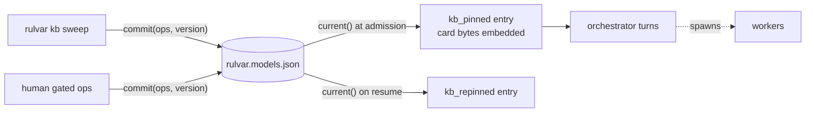

# Model knowledge

"Which model is good at this kind of task?" is knowledge, not configuration: it changes when providers ship new snapshots, and it should be learned from evidence rather than declared once and trusted forever. Rulvar keeps that knowledge in **ModelKnowledge**: an engine-scoped, per-project, append-only store of schematized claims about the suitability of one triple (model, effort, task class).

ModelKnowledge is the single sanctioned exception to Rulvar's ban on memory that crosses runs, and the exception is bounded four ways:

1. **Domain: models only.** A scopeless claim like "model X is strong" is inexpressible; every claim binds a `taskClass`.
2. **Scope: your project.** The default store is a JSON file in your repository under ordinary git review. Sharing knowledge more widely means explicitly passing a different store.
3. **Write authority: never a run.** Runs hold a read-only handle; only out-of-run gates commit.
4. **Size: capped.** At most 8 active claims per (model, taskClass) pair, 200-character statements, and a 4096-character rendered card.

The whole feature is opt-in and store-gated: an engine without a configured store writes no knowledge entries at all, and journals recorded without one stay byte-stable forever.

## The shape of a claim

Every record in the store is a `ModelClaim`:

```ts
interface ModelClaim {
  id: string;                                     // ULID
  subject: { model: ModelRef; effort?: Effort };  // effort is part of identity
  taskClass: TaskClass;                           // mandatory: no scopeless claims
  polarity: 'strength' | 'weakness';
  statement: string;                              // <= 200 chars
  class: ClaimClass;                              // 'eval-measured' | 'human-editorial'
  status: ClaimStatus;                            // 'active' | 'stale' | 'superseded' | 'archived'
  evidence: EvidenceRef[];                        // mandatory, at least one
  metrics?: { passRate: number; n: number; graderId: string; cost?: number;
              baseline?: { model: ModelRef; passRate: number } };
  confidence: 'high' | 'medium' | 'low';
  observedAt: string;                             // ISO date
  expiresAt: string;                              // TTL by class and polarity
  modelEpoch?: { registryVersion?: string; pricingVersion?: string;
                 capsHash?: string; canaryFingerprint?: string };
  author: { kind: 'eval-pipeline' | 'human'; id: string };
  origin?: { kind: 'kb-proposal'; runId: string; entryRef: number };
  supersedes?: string;                            // an edit is a new claim plus supersede
}
```

`TaskClass` is the same vocabulary the role quality floors use: `'code-edit' | 'investigation' | 'synthesis' | 'extraction' | 'planning' | 'judging'`, open to custom strings. `EvidenceRef` points either at a journal decision entry (`{ kind: 'journal', runId, entryRef }`, where `entryRef` is the entry seq) or at an eval report (`{ kind: 'eval', reportId, caseIds }`). Evidence is mandatory: a claim without provenance does not validate.

The store is append-only. There is no edit: you supersede a claim with a new one (the chain keeps only the head active), and deprecations archive claims rather than delete them, so historical runs keep their audit trail.

## Two claim classes

| | `eval-measured` | `human-editorial` |
|---|---|---|
| **Author** | The eval pipeline (`author.kind: 'eval-pipeline'`) | A human |
| **Gate** | The dedicated `eval-committer` identity | The human gate with a mandatory attribution attestation |
| **Metrics** | Yes: `passRate`, `n`, `graderId`, `cost`, `baseline` | Never (schema-enforced) |
| **Steers routing** | Yes: compiled into the card's verified layer | Never compiled; rendered as explicitly marked notes |
| **TTL** | 90 days (strength) / 30 days (weakness) | 120 days (strength) / 45 days (weakness) |

The committer identity is enforced by shape in both directions: an op gated by `eval-committer` must carry class `eval-measured`, author kind `eval-pipeline`, and the metrics block; a human-gated op must carry none of the three. Rubber-stamping measured numbers into an editorial note, or prose into a measurement, is constructively impossible.

## The store SPI and the file default

The `ModelKnowledgeStore` SPI is a neighbor of `JournalStore`, and it is deliberately tiny:

```ts
interface ModelKnowledgeStore {
  current(): Promise<KnowledgeSnapshot>;                            // { version, hash, claims }
  commit(ops: ClaimOp[], expectedVersion: number): Promise<number>; // CAS on the version
}

// What the runtime receives. commit is physically absent.
type ModelKnowledgeHandle = Pick<ModelKnowledgeStore, 'current'>;
```

`commit` performs compare-and-swap on the monotonic snapshot version, mirroring the fencing-epoch discipline of the journal's worker leases. A commit against a version that is no longer current throws `KnowledgeCasError` (code `knowledge_cas`), which is retryable by contract: re-read `current()`, rebase your ops, commit again. Concurrent maintenance commits serialize through exactly that rejection-and-rebase loop.

Notice what the SPI does not have: there is no `propose()` method, and runs only ever hold the `current()`-only handle. A run has no write path into the cross-run medium at all, by the shape of the API rather than by convention.

The default implementation is `FileModelKnowledgeStore`, which keeps the whole store in `./rulvar.models.json`: serverless, embeddable, and diffed by git like any other file in your project. Wire it into the engine:

```ts
import { createEngine, FileModelKnowledgeStore, JsonlFileStore } from '@rulvar/core';
import { anthropic } from '@rulvar/anthropic';

const engine = createEngine({
  adapters: [anthropic()],
  stores: {
    journal: new JsonlFileStore({ dir: '.rulvar' }),
    modelKnowledge: new FileModelKnowledgeStore(), // ./rulvar.models.json
  },
});
```

`FileModelKnowledgeStoreOptions` accepts a custom `path` and an `activeClaimsCap` (default 8, the `KB_ACTIVE_CLAIMS_CAP` constant); the cap is enforced at commit time per (model, taskClass) pair. The cap is a nonnegative integer (zero refuses every active claim), validated as a `ConfigError` at construction: the enforcement compares counts against it, and an unvalidated NaN or Infinity silently disabled the cap.

## Reads are journaled decisions

A run does not consult the live store whenever it feels like it. The engine reads the store **once at run admission** (for runs that resolve an orchestrate-role invocation), filters the claims, renders the knowledge card, and journals one decision entry:

```text
kb_pinned { version, hash, cardText }
```

The card bytes are embedded in the entry itself. Replay and resume read the journal entry and never touch the live store, so a commit landing mid-run affects only subsequent pins, and replay does not depend on live-store retention. This is the same governing principle as every other dynamic decision in Rulvar: decision entries before effects, folds pinned to snapshots. See [Journal](/guide/journal) and [Determinism](/guide/determinism).

The pin-time filter keeps only claims that are status `active`, unexpired at the pin instant, and whose subject is reachable through the run's declared ladders after the role-floor filter. Knowledge about models the run cannot spawn never costs card budget.

Long-lived runs do not go stale either: on every resume from suspension (a `wait_for_events` wake, a human approval, an external event) the engine writes a fresh `kb_repinned` entry under the same filtering rules against a fresh store read. Expired, stale, and archived claims never steer spawns after a multi-day pause; within continuous execution the pin holds, a window already bounded by the run budget ceiling. Child spawns and the admission controller read the latest pin of their scope in spawn order, never by wall clock.



## The knowledge card

The pinned card is a compact rendered document in the same tradition as the profile card, and it is deliberately tier-relative: **the orchestrator never sees model names**. It has two layers with an evidence section between them:

1. **The verified layer**, compiled exclusively from `eval-measured` claims into start-tier recommendations per (ladder, taskClass) pair. The compiler votes: a strength on a rung below the ladder's default votes toward starting cheaper, a weakness on the default rung or below votes toward starting higher, and the net sign shifts the recommendation **exactly one rung**, clamped to the ladder; ties hold the default and compile nothing. The one-rung clamp is the point: the price of any false belief in the store is bounded by one rung.
2. **The profile evidence section**, projected onto the spawn vocabulary. For each advertised profile that pins a concrete model, the measured claims fold per task class with weakness winning over strength (the conservative fold), rendering lines like `researcher: strong investigation; weak code-edit` plus one fixed guidance line: "prefer the cheapest profile marked strong for the task at hand; avoid profiles marked weak at it". The section renders only when at least one profile line exists; profiles that declare ladders or no model do not participate, and editorial claims never enter it.
3. **The notes layer**: `human-editorial` claims rendered tier-relatively with their date and the explicit marking "editorial note, no metrics, not confirmed by evals". Notes inform; they are never compiled into a tier.

The render is a deterministic pure function: the same filtered claims and ladders produce byte-identical text. Its budget is 4096 characters (`KB_CARD_RENDER_BUDGET_CHARS`), measured in characters precisely because a character count is model-independent and deterministic; over budget, the oldest-observed notes are withheld first behind an explicit marker.

You can preview exactly what a run would be taught, outside any run:

```ts
import {
  FileModelKnowledgeStore, collectDeclaredLadders,
  filterClaimsForRun, modelKnowledgeCard,
} from '@rulvar/core';
import type { AgentProfile } from '@rulvar/core';

const profiles: Record<string, AgentProfile> = {
  researcher: {
    taskClass: 'investigation',
    model: {
      ladder: {
        rungs: [
          { model: 'anthropic:claude-haiku-4-5', maxTurns: 8, maxTokens: 60000 },
          { model: 'anthropic:claude-sonnet-5', maxTurns: 12, maxTokens: 120000 },
        ],
        startTier: 0,
        escalateOn: ['verify-failed', 'no-progress'],
      },
    },
  },
};

const store = new FileModelKnowledgeStore();
const snapshot = await store.current();
const ladders = collectDeclaredLadders(profiles);
const claims = filterClaimsForRun(snapshot.claims, { ladders, now: new Date().toISOString() });

console.log(modelKnowledgeCard(claims, ladders, { profiles }));
```

The render budget (`budgetChars`, default 4096) is a nonnegative integer,
validated as a `ConfigError`, and a HARD upper bound of the returned card:
oldest editorial notes withhold first behind an explicit marker, and a card
whose mandatory sections alone exceed the budget is truncated with the shared
`...` marker instead of overflowing.

## How the card steers spawns

Knowledge feeds exactly three places, and nothing else:

1. **The starting rung.** A dynamic orchestrator never names a model; it can hint a starting tier (`model_hint.startTier`), and the verified layer tells it which tier to hint per task class. The hint is clamped to the declared ladder. Programmatic consumers read `compileVerifiedLayer(claims, ladders)`, the deterministic function behind the layer, never the card text.
2. **Which profile to spawn.** The profile evidence section docks with the profile card vocabulary, so the orchestrator can prefer the cheapest profile marked strong at the task class at hand.
3. **Human authoring.** `rulvar kb list` shows every claim with full provenance to the people who write ladders, floors, and profiles. This path involves no run and no pin.

How does a spawn acquire its task class? By author declaration: `AgentProfile` carries an optional `taskClass` field, defaulting to unclassified, and **card recommendations do not apply to unclassified spawns**. Knowledge never guesses what a task is.

The power hierarchy is unchanged by all of this. `ModelCaps` (mechanical facts) and [role quality floors](/guide/model-routing#role-quality-floors) remain hard router constraints; the declared ladder defines the escalation path with its own journaled acceptance gates; ModelKnowledge only advises within the set that floors and the ladder already permit. It never overrides or weakens anything, and it touches budget only through the existing admission path.

## Writes go through a gate, never through a run

Committing an editorial claim is a small maintenance script (or a reviewed edit to `rulvar.models.json`, provided that edit recomputes the snapshot `hash` and keeps every claim's full schema. The store validates each read and refuses, as a typed `ConfigError`, a file whose `version` is not a nonnegative integer, whose `hash` is not a lowercase sha256 digest of its claims, or whose claims are structurally malformed; the git review that merges a valid change is what authenticates the gate):

```ts
import { FileModelKnowledgeStore, claimExpiry } from '@rulvar/core';
import type { ClaimOp, ModelClaim } from '@rulvar/core';

const store = new FileModelKnowledgeStore();
const { version } = await store.current();

const observedAt = '2026-07-01';
const claim: ModelClaim = {
  id: '01JZK7Q0V4N2C8R5T1W9X3Y6D0',
  subject: { model: 'anthropic:claude-haiku-4-5', effort: 'low' },
  taskClass: 'extraction',
  polarity: 'strength',
  statement: 'Reliably fills long extraction schemas without dropping fields.',
  class: 'human-editorial',
  status: 'active',
  evidence: [{ kind: 'journal', runId: 'run_01JZK6WYYFJ0', entryRef: 412 }],
  confidence: 'medium',
  observedAt,
  expiresAt: claimExpiry('human-editorial', 'strength', observedAt),
  author: { kind: 'human', id: 'alex@example.com' },
};

const ops: ClaimOp[] = [{
  op: 'add',
  claim,
  gate: {
    kind: 'human',
    approver: 'alex@example.com',
    at: observedAt,
    attribution: {
      ruledOut: ['prompt', 'difficulty', 'transient-provider'],
      contrastEvidence: { kind: 'journal', runId: 'run_01JZK6WYYFJ0', entryRef: 388 },
    },
  },
}];

await store.commit(ops, version); // KnowledgeCasError on a concurrent commit: re-read and rebase
```

The `attribution` block is not decoration. To gate a claim, a human must attest what they ruled out (was it really the model, or the prompt, the tools, task difficulty, a transient provider issue?), ideally with contrast evidence showing the same task class succeeding on another rung or model. Without `attribution` the gate record does not assemble, and without a gate the op does not assemble: attesting "evidence exists" is not enough by construction.

Four op kinds exist: `add` and `supersede` (gated), plus the gate-free maintenance ops `archive` (reasons `deprecated`, `stale`, `rejected`, `falsified`) and `mark_stale` (reason `canary-drift`, idempotent). `validateEditorialCommit` checks a whole batch before you commit and throws one `ConfigError` carrying every issue, so a bad batch is fixed in one round trip.

::: info Runs propose, humans decide
An orchestrator can be given the opt-in `kb_propose` tool: `@rulvar/plan` registers it when `PlanRunnerOptions.kbPropose` is `true` (default `false`; enabling it changes the toolset hash by design). Proposals land as journaled ledger records in the proposing run's own ledger, with typed template statements (tool output can never be quoted into a persistent record) and evidence that must resolve into that same run's journal. They are quarantined absolutely: never rendered into any prompt, of any run, until a human gates them through the attribution attestation above, and they expire from the inbox after 14 days (`INBOX_PROPOSAL_TTL_DAYS`). Proposal volume never authorizes eval spend. `rulvar kb inbox` is the review surface for this path, and `rulvar kb gate` is the gate.
:::

## Decay: TTL and the remeasurement queue

Every claim expires. The TTL is asymmetric by polarity because a false negative is costlier than a false positive: a wrongly believed weakness locks a cheap model out and nothing in normal operation would ever disprove it.

| Claim kind | TTL |
|---|---|
| eval-measured strength | 90 days |
| eval-measured weakness | 30 days |
| human-editorial strength | 120 days |
| human-editorial weakness | 45 days |
| inbox proposal | 14 days |

The table is exported as `CLAIM_TTL_DAYS`, and `claimExpiry(claimClass, polarity, observedAt)` applies it, as in the commit sample above. Expiry is enforced at every pin and every repin, so a claim past its TTL steers nothing, even mid-run across a suspension.

Expired eval-measured claims that are still active form the **remeasurement queue**: `remeasureQueue(claims, at)` is just a status filter, not infrastructure. The next sweep re-measures those subjects; nothing archives them automatically, because archiving would empty the queue and hide the decay. Deprecated models are handled by `archiveDeprecatedModelOps`, which archives (never deletes) every non-terminal claim of the deprecated subjects.

## Sweeps: measurement and falsification

Eval-measured claims come from matrix sweeps in [@rulvar/evals](/api/@rulvar/evals/): a fixed pool of (model, effort) members run against eval cases tagged by task class. The matrix is fixed and independent of your current routing beliefs, which is the deconfounder: a model your routing currently avoids still gets measured, so routing bias cannot become self-fulfilling.

`runSweepMatrix(pool, options)` runs the cells sequentially through ordinary engines (one per pool member via `engineFor`), so a sweep is journaled, budgeted, and VCR-recordable like any other run; see [Evals](/guide/evals) and [Testing](/guide/testing). Budgets are explicit: `suite.budgetUsd` and `suite.judgeBudgetUsd` give every target and judge run an immutable ceiling, and the optional `envelope` (a `SpendEnvelope`) bounds the whole matrix in aggregate. Refusals are monotone: a refused run never erases what already ran (cells keep their completed cases, names, and costs next to `plannedN`, with `envelopeExhausted`, `exhaustedRuns`, `judgeIncompleteRuns`, and `incompleteReason` naming what stopped), and any incomplete cell emits no claim. Cells crossing the thresholds emit claims: pass rate at or above 0.9 emits a strength, at or below 0.5 emits a weakness, and the mid-band emits nothing (uninformative results should not become beliefs). The defaults are exported as `SWEEP_THRESHOLD_DEFAULTS`. When you pass a `store`, the emitted claims commit through the `eval-committer` identity with the sweep's `reportId` on every gate.

Two falsification rules keep negative beliefs honest:

- A sweep **must include the models carrying active negative claims**. The CLI's `kb sweep` does this structurally: it unions the configured fixed pool with every negative-claim subject and the remeasurement queue.
- Sweeps are launched only by humans or their schedules (CI, cron) from a fixed pool. No volume of in-run activity schedules a sweep or spends eval budget.

Deliberately routing some production traffic to "explore" was considered and rejected: you would pay for deliberately worse routing, the evidence would still be confounded by prompt and task differences, and the floor-filtered candidate set is too small for bandit convergence. Grounding lives in the fixed matrix instead.

## The canary fingerprint

Model names are not stable references to model behavior: providers re-point aliases silently. Each claim can carry a `modelEpoch` block, built with `modelEpochOf` from the registry version, the price-table version, and the caps hash. It is honestly declared a coarse signal: it catches overt swaps and deprecations, and it does **not** catch silent alias re-pointing.

The optional compensation is the canary fingerprint: a fixed probe set run through the ordinary engine, hashed over normalized outputs (NFC, trimmed, whitespace collapsed):

```ts
import { FileModelKnowledgeStore } from '@rulvar/core';
import { runCanary, flipStaleOnCanaryDrift } from '@rulvar/evals';
import { engine } from './engine.js'; // your ordinary engine assembly

const store = new FileModelKnowledgeStore();

const canary = await runCanary(
  engine,
  {
    agentType: 'extractor',
    prompts: ['Name the three primary colors.', 'Sort these numbers: 3, 1, 2.'],
  },
  { budgetUsd: 0.2 }, // each probe run's immutable ceiling
);

if (canary.allOk) {
  const drift = await flipStaleOnCanaryDrift(store, 'anthropic:claude-haiku-4-5', canary.fingerprint);
  console.log(drift.flipped); // claim ids flipped to 'stale'; the next pin stops rendering them
}
```

A fingerprint change immediately flips the model's active eval-measured claims to `stale` (they stop steering at the next pin and land in the next sweep). The `allOk` gate protects the claims from measurement artifacts: a probe that did not settle `ok` (its own budget ceiling, a transient provider failure, or an envelope refusal reported as `status: 'refused'`) fingerprints differently without the model having drifted, so only an all-`ok` fingerprint may flip anything. Claims without a recorded fingerprint have no baseline and stay untouched; a second run is an idempotent noop. And if you run no probes at all, the insurance is already in the TTL table: negative eval claims expire in 30 days regardless.

## Maintenance from the CLI

| Command | What it does |
|---|---|
| `rulvar kb list` | Prints the claim store with full provenance: subject, task class, polarity, class, status, TTL state, evidence, gate. No run, no pin. |
| `rulvar kb inbox` | Aggregates the `kb_propose` proposals of finished runs from their ledgers into a read-only review view; proposals expire 14 days after their run finished. Requires `@rulvar/plan` installed. |
| `rulvar kb gate <runId> <entryRef>` | The human gate: turns one inbox proposal into a committed `human-editorial` claim. `--approver NAME` and `--ruled-out a,b,c` are mandatory (the attribution attestation); `--contrast-run runId#seq` or `--contrast-eval reportId:caseId[,caseId...]` attaches optional contrast evidence. Requires `@rulvar/plan` installed. |
| `rulvar kb sweep` | Runs the falsification matrix from the `kbSweep` section of `rulvar.config.mjs`: the fixed pool unioned with every negative-claim subject and the remeasurement queue, optional canary probes first. `kbSweep.budgets` (per-run ceilings plus the `maxTotalUsd` envelope) is required unless waived with `allowUnbounded: true`; see [CLI](/guide/cli#knowledge-base-maintenance). Requires `@rulvar/evals` installed. |

The sweep is configured next to your engine options; graders and cases are built with `@rulvar/evals` inside the config module (the CLI loads `@rulvar/evals` dynamically at command time):

```js
// rulvar.config.mjs
import { goldenGrader } from '@rulvar/evals';
import { extractReport } from './workflows/extract-report.mjs';

export default {
  engineOptions: { /* adapters, stores, budgets */ },
  kbSweep: {
    committerId: 'eval-pipeline-ci',
    models: [
      { model: 'anthropic:claude-haiku-4-5' },
      { model: 'anthropic:claude-sonnet-5' },
    ],
    cases: [
      {
        taskClass: 'extraction',
        case: {
          workflow: extractReport,
          args: { source: 'fixtures/quarterly.txt' },
          graders: [goldenGrader({ revenueUsd: 1200000, quarter: 'Q2' })],
        },
      },
    ],
    thresholds: { strength: 0.9, weakness: 0.5 },
    canary: { agentType: 'extractor', prompts: ['Name the three primary colors.'] },
    // Required (or waive with allowUnbounded: true): immutable per-run
    // ceilings plus the debit-only envelope over the whole sweep.
    budgets: { targetUsd: 0.5, judgeUsd: 0.5, canaryUsd: 0.2, maxTotalUsd: 25 },
  },
};
```

Each pool member gets its own engine (by default your `engineOptions` with the loop and extract roles routed at that member; override per member with `engineFor`), the report id defaults to `kb-sweep-<observedAt ISO>`, and emitted claims commit through the configured `committerId`. Because the sweep runs through ordinary engines, your VCR posture applies: record once in CI, replay in review. See [CLI](/guide/cli) for the surrounding commands.

## Influence and correction, always together

Every mechanism by which knowledge influences a run ships in the same package as the mechanism that corrects it. That symmetry is the design's answer to belief poisoning and belief rot alike:

| Influence | Bound at read time | Correction |
|---|---|---|
| Verified layer shifts a ladder's starting rung | Exactly one rung from the ladder default, clamped to the ladder | 30/90 day TTL, mandatory re-measurement of negative claims in every sweep, canary drift flips claims stale |
| Profile lines steer which agent type is spawned | Conservative fold (weakness wins); unclassified spawns are never steered | Same TTL and sweeps; supersede chains keep one head active |
| Editorial notes inform the orchestrator | Never compiled into a tier; rendered with an explicit unverified marking | Corrected by the same git review that created them; 45/120 day TTL |
| Claims persist across runs | 8 active claims per (model, taskClass), 200-character statements, 4096-character card | Expiry re-applied at every pin and every repin |

The symmetry also makes the embeddable default the safe default, by construction rather than by policy. A deployment that never configures evals gets no eval-measured claims, hence an empty verified layer, hence no automatic tier steering, and hence nothing that needs falsifying; what remains is a living, human-updatable model dossier whose notes are honestly marked unverified and whose only correction loop, code review, is one the project already runs.

## Next steps

- [Model routing](/guide/model-routing): `ModelRef`, ladders, caps, and the role quality floors that stay hard no matter what the card says.
- [Adaptive orchestration](/guide/adaptive-orchestration): the orchestrator toolset, ladders and escalation, and where `model_hint` fits.
- [Evals](/guide/evals): cases, graders, suites, and the sweep and checkpoint machinery behind measured claims.
- [Journal](/guide/journal): decision entries, replay, and why pinned card bytes make knowledge reads replay-sound.
- [CLI](/guide/cli): `rulvar kb` next to run, resume, inspect, and plan.
- [API reference](/api/@rulvar/core/): `ModelKnowledgeStore`, `ModelClaim`, `modelKnowledgeCard`, `compileVerifiedLayer`, and the decay helpers.
