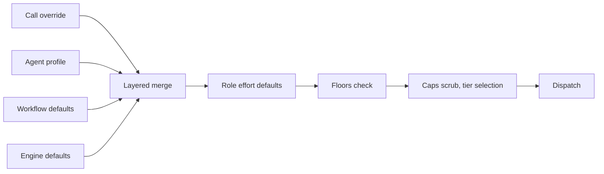

# Model routing

Rulvar is **multi-model at every level**. A workflow can default to one provider, an agent profile can override it, a single call can override that, and one agent can send its tool loop, its structured extraction, and its history compaction to three different models from three different providers. The router resolves the model **on every model invocation**, not once per agent, so the answer to "which model runs this?" is always the same layered merge, evaluated fresh at each call site.

Models are named by `ModelRef`, strictly `'adapterId:model'` with no query parameters: `'anthropic:claude-sonnet-5'`, `'openai:gpt-5.4-mini'`, `'ollama:qwen3:8b'`. Only the first colon splits, so wire ids that contain colons (Ollama tags) work unmodified.

## The capability registry

The adapter registry is strictly per engine; no global mutable registry exists anywhere. You build it by passing adapters to `createEngine`, and a duplicate adapter id is a typed `ConfigError`:

```ts
import { createEngine } from '@rulvar/core';
import { anthropic } from '@rulvar/anthropic';
import { openai, openaiCompatible } from '@rulvar/openai';

const engine = createEngine({
  adapters: [
    anthropic(),
    openai(),
    openaiCompatible({
      id: 'ollama',
      baseURL: 'http://127.0.0.1:11434/v1',
      caps: () => ({ structuredOutput: 'prompt', supportsTemperature: true }),
    }),
  ],
  defaults: {
    routing: { loop: 'anthropic:claude-sonnet-5' },
  },
});
```

Every adapter answers `caps(model)` with a `ModelCaps` record, the capability facts the router consumes:

| `ModelCaps` field | What the router does with it |
|---|---|
| `structuredOutput` | Selects the structured-output tier: `'native'` JSON schema, `'forced-tool'`, or `'prompt'`. |
| `supportsTemperature` | Scrubs sampling parameters the model rejects (current reasoning models on both first-class providers reject them with a hard error). |
| `supportsParallelTools` | Shapes tool dispatch for the turn. |
| `reasoningEfforts` | The canonical efforts this model accepts; anything else is scrubbed visibly. |
| `contextWindow` | Drives the compaction threshold (default 0.8 of the loop model's window). |
| `maxOutputTokens` | Caps the request's output allocation. |
| `pricing` | Adapter-reported fallback pricing only; the versioned [price table](#the-versioned-price-table) always wins. |

Adapters that implement `refreshCaps()` can refresh their capability table from the provider's live model list. Price updates are deliberately not a side effect of that: they are registry updates with a `pricingVersion` bump.

## The resolution chain

Resolution is a layered merge of `{ model, effort, providerOptions, fallbacks }`, highest priority first:

1. **Call override**: `AgentOpts.model`, `AgentOpts.routing`, `AgentOpts.effort` on the `ctx.agent` call.
2. **Agent profile**: the `AgentProfile` selected by `agentType`.
3. **Workflow defaults**: `model`, `routing`, and `effort` declared on `defineWorkflow`.
4. **Engine defaults**: `defaults.routing` on `createEngine`.



Layer 3 lets one workflow carry a model policy of its own without repeating it on
every call, which is what you usually want for a whole class of work ("triage is
cheap; the incident report is not"):

```ts
const triage = defineWorkflow(
  { name: 'triage', routing: { loop: 'anthropic:claude-haiku-4-5' } },
  async (ctx, args: { issues: string[] }) =>
    ctx.parallel(args.issues.map((i) => () => ctx.agent(`Classify: ${i}`))),
);
```

The layer follows the **call tree, not the file**. A child spawned through
`ctx.workflow` contributes its own defaults inside its scope and they stop at its
boundary, so nesting a cheap workflow under an expensive one does the obvious
thing. A workflow that declares nothing contributes no layer and resolves through
the engine defaults exactly as before. A `CompiledWorkflow` (the planner's sandbox
dialect) has no routing surface and so contributes no layer.

Every configurable spot accepts the same `ModelSpec` union: a bare `ModelRef` string, a `ModelChoice` object, or a ladder.

```ts
const engine = createEngine({
  adapters: [anthropic(), openai()],
  defaults: {
    routing: {
      loop: 'anthropic:claude-sonnet-5',
      summarize: 'openai:gpt-5.4-mini',
    },
    profiles: {
      researcher: {
        model: 'anthropic:claude-sonnet-5',
        routing: { extract: 'openai:gpt-5.4-mini' },
        effort: 'high',
      },
    },
  },
});
```

And at the call layer, inside a workflow body:

```ts
const answer = await ctx.agent('Audit the dependency graph for supply-chain risk.', {
  agentType: 'researcher',
  model: {
    model: 'anthropic:claude-opus-4-8',
    effort: 'xhigh',
    fallbacks: ['openai:gpt-5.5'],
  },
});
```

Three merge rules matter in practice:

- `model` applies to **all roles at once**; `routing` overrides **per role** and wins over `model` within the same layer. `AgentOpts.routing` wins over `profile.routing`.
- An explicit `effort` field wins over an effort carried inside a `ModelChoice` at the same layer.
- `providerOptions` and `fallbacks` are delivery options: they never enter the journal identity. The **requested** model and effort do enter the content key, which is why a transport failover can swap the serving model without re-keying anything (see [failover](#retries-and-failover) below). If you need identity separation for a `providerOptions` change, use the call's `key` option.

## Invocation roles

Every invocation resolves with one of six roles attached, and each role can route to a different model. This is how one agent mixes providers mid-conversation:

| Role | Fires |
|---|---|
| `loop` | Every turn while tools are available to the model. |
| `extract` | Resolves on every schema-bearing call; the separate final structured-output invocation fires only when extract routes to a different model than the loop, when the schema's tier on the loop model is `forced-tool` while tools stay available (it cannot ride such a turn), or when finalize is routed (the schema never rides a loop or synthesis turn). Otherwise the schema rides the last loop turn with no extra call. |
| `finalize` | Only if set in routing: after tools stop, one synthesis invocation with tool choice `'none'` over the full transcript. |
| `summarize` | At the compaction threshold, and for `ctx.brief`. |
| `plan` | The planner model in planned mode. |
| `orchestrate` | The orchestrator agent in orchestrator mode, resolved through the same chain as everything else. |

```ts
import { defineWorkflow } from '@rulvar/core';

const triage = defineWorkflow({ name: 'triage' }, async (ctx, args: { report: string }) => {
  return ctx.agent(`Investigate this bug report:\n${args.report}`, {
    agentType: 'researcher',
    routing: {
      loop: 'anthropic:claude-sonnet-5',      // the tool loop
      extract: 'openai:gpt-5.4-mini',         // the cheap structured pull
      finalize: 'anthropic:claude-opus-4-8',  // one strong synthesis pass
    },
    schema: {
      jsonSchema: {
        type: 'object',
        properties: { rootCause: { type: 'string' }, severity: { type: 'string' } },
        required: ['rootCause', 'severity'],
        additionalProperties: false,
      },
      validate: (v): v is { rootCause: string; severity: string } =>
        typeof v === 'object' && v !== null,
    },
  });
});
```

Cross-provider mixing inside one agent is correct by construction: the history projector re-derives each provider's wire view (tool-call ids, retained reasoning blocks) from the canonical history on every outgoing request, so the loop can run on Anthropic while extract runs on OpenAI, each seeing a valid transcript. The mechanics live in [Providers](/guide/providers).

Roles also carry **effort defaults** when no layer of the chain resolves an effort: `orchestrate` and `plan` default to `high`; `summarize` and `extract` default to `low`. `loop` and `finalize` have no role default; when nothing resolves one, the request omits effort and the provider default applies (high on current Anthropic models, medium on gpt-5.5). These defaults are router policy, not identity surgery: changing them between releases never invalidates paid journal prefixes.

## Capability scrubbing

After resolution the router reads the target's `ModelCaps` and makes the request legal, visibly:

- **Effort scrub.** Canonical effort is five levels: `low`, `medium`, `high`, `xhigh`, `max`. If the resolved effort is not in the model's `reasoningEfforts`, the request proceeds without it, a warning-level workflow event records the scrub, and the scrub is never silently translated into a token cap or any other parameter. Adapters map canonical effort to each wire; canonical `max` downmaps to `xhigh` on OpenAI, with the downmap recorded in provider metadata.
- **Sampling scrub.** Current reasoning models on both first-class providers reject temperature and friends with a hard 400, so removing them is a correctness requirement, not a courtesy. Sampling parameters only travel through an adapter's `providerOptions` namespace in the first place, and the router strips the ones the target rejects.
- **Tier selection.** The router picks the structured-output tier from caps: native JSON schema where supported, a forced synthesized tool where not, a prompt-based tier as the floor. The `forced-tool` tier pins the tool choice and therefore cannot ride a turn on which the agent's tools must stay available; that is exactly when a separate `extract` invocation fires.

Identity always records the **requested** effort, never the scrubbed wire value, so replay is stable regardless of what a given model accepted on the day the run went live.

## Role quality floors

Weak model defaults are a quiet failure mode: nothing crashes, output quality just degrades. Floors make the constraint explicit and hard. A floor is a per-role (and optionally per-task-class) allowlist and denylist in engine config, and a violation at resolution is a typed `ConfigError` **before any live call**:

```ts
import { createEngine, type QualityFloors } from '@rulvar/core';

const floors: QualityFloors = {
  byRole: {
    orchestrate: { allow: ['anthropic:claude-opus-4-8', 'anthropic:claude-fable-5'] },
    plan: { allow: ['anthropic:claude-opus-4-8', 'openai:gpt-5.5'] },
  },
  byTaskClass: {
    'code-edit': { deny: ['openai:gpt-5.4-mini'] },
  },
};

const engine = createEngine({
  adapters: [anthropic(), openai()],
  defaults: { roleFloors: floors },
});
```

The rules are deliberately blunt:

- Deny wins over allow.
- No implicit cross-adapter quality ordering exists or is ever computed; a floor is always an explicit list of `ModelRef` values.
- No advice may override or weaken a floor, including recommendations from [model knowledge](/guide/model-knowledge).
- `byTaskClass` floors apply when the agent's profile declares a `taskClass`; an unclassified profile is checked against `byRole` floors only.

`@rulvar/core` ships the floor mechanism but never names a concrete model. The umbrella package ships the opinions:

```ts
import { recommendedDefaults } from '@rulvar/rulvar';

const engine = createEngine({
  adapters: [anthropic(), openai()],
  defaults: {
    routing: recommendedDefaults.routing,
    roleFloors: recommendedDefaults.floors,
  },
});
```

::: tip
`recommendedDefaults` is data, not engine semantics: it pins `orchestrate` and `plan` to strong models and fills the role routing table. Start from it and override freely.
:::

## The versioned price table

Cost accounting needs prices, and prices change. The engine takes a versioned price table whose entries win over any adapter-reported `caps.pricing` (that field is a fallback only). The first-party adapters export their seed rows as ready-made tables, `ANTHROPIC_PRICING` (`anthropic-2026-07-16`) and `OPENAI_PRICING` (`openai-2026-07-16`), each mirroring the provider's official price list as of its version date:

```ts
import { createEngine, type PriceTable } from '@rulvar/core';
import { anthropic, ANTHROPIC_PRICING } from '@rulvar/anthropic';
import { openai, OPENAI_PRICING } from '@rulvar/openai';

// Start from the shipped tables and override rows as prices change,
// always under a NEW version string. Example: the Claude Sonnet 5
// introductory price ends on 2026-08-31, and the host moves to the
// standard row on its own schedule instead of waiting for a library
// release (prices are never fetched live and never switch by wall
// clock inside a run).
const pricing: PriceTable = {
  pricingVersion: 'my-app-2026-09-01',
  models: {
    ...ANTHROPIC_PRICING.models,
    ...OPENAI_PRICING.models,
    'anthropic:claude-sonnet-5': {
      inputUsdPerMTok: 3,
      outputUsdPerMTok: 15,
      cacheReadUsdPerMTok: 0.3,
      cacheWriteUsdPerMTok: 3.75,
    },
  },
};

const engine = createEngine({ adapters: [anthropic(), openai()], pricing });
```

How the dollars are computed:

- Adapters normalize provider-reported usage into one canonical shape where `inputTokens` is the **full** prompt including cache reads and writes; the core verifies that invariant at the adapter boundary. Dollars come from normalized usage against the table row: cache reads and cache writes bill at their own rates and **only** there, the uncached remainder bills at the input rate (a row that omits a cache rate bills those tokens at the plain input rate rather than silently for free).
- A row may carry long-context `tiers` (GPT-5.6 Sol: prompts strictly above 272K input tokens price the **entire** request at 2x input and 1.5x output). The highest threshold below the prompt size wins; input-side rates, cache rates included, scale by the tier's input multiplier. Admission estimates use the same price function, so a long-context call reserves at its tiered price.
- Pricing is attributed to the model that **actually served** the call (`servedBy` in the journal entry), so a failover never bills the wrong model.
- One agent call can span several serving models, because `loop`, `extract`, `finalize`, and `summarize` each resolve independently. Each phase's usage is priced at **its own** model's rate, not the loop model's, so routing extraction to a cheap model actually shows up as a saving. The split rides the terminal journal entry (`usageByModel`), so the live report, the replayed report, and an independent fold over the stored journal all agree.
- `pricingVersion` is a monotonic string recorded in decision entries, so replayed cost attribution is stable even after you update the table.
- Unpriced models surface in the run's `CostReport` under `unpriced` with their raw usage, never as a silent zero. This covers local Ollama or vLLM targets and any **hosted model the adapter tables do not know yet**: an unrecognized model id gets conservative transport caps but no fabricated price row, so give it a versioned `pricing` entry here or a USD ceiling cannot bound it (the run warns about exactly that).

Every run outcome carries the full report, bucketed by model, phase, agent type, and invocation role:

```ts
const outcome = await engine.run(triage, { report }, { budgetUsd: 5 }).result;

outcome.cost.totalUsd;   // 0.42
outcome.cost.byModel;    // { 'anthropic:claude-sonnet-5': 0.31, 'openai:gpt-5.4-mini': 0.11 }
outcome.cost.byRole;     // { loop: 0.29, extract: 0.11, finalize: 0.02, ... }
outcome.cost.unpriced;   // [{ model: 'ollama:qwen3:8b', usage: {...} }]
```

The same prices feed the [three-layer budget](/guide/budgets), so admission reserves, ceilings, and the report all agree on what a token cost.

## Retries and failover

Transport failures resolve inside the router, under the journal:

- **Retries** follow a `RetryPolicy` (attempts, exponential backoff with jitter, retryable classes) configurable at the engine, profile, or call layer. A retried-then-successful call is exactly **one** journal entry; provider SDK autoretries are disabled so the journal, the budget ledger, and timeouts see every attempt.
- **Failover** walks the `fallbacks` list of the resolved `ModelChoice` on transport-class failures and rate-limit exhaustion. The content key hashes the *requested* model spec, so a response served by a fallback model replays correctly; the fallback changes only `servedBy`. The never-pay-twice invariant stays intact, and cost attribution stays honest. Budget exhaustion is never a failover trigger: failing over on budget would convert an economic stop into a silent model swap.
- **The degenerate fallback** (`fallback: { model, on }` on the call) is different in kind: an agent-level second attempt on terminal `error`, `limit`, or `schema-exhausted`, journaled as a decision entry, where the fallback attempt is a new content key. See [Agents](/guide/agents) for its trigger semantics.

## Model ladders

A ladder is the escalation form of a `ModelSpec`: ordered rungs from cheap to strong, with binding per-rung caps that bound the worst-case cost of a failed attempt:

```ts
const engine = createEngine({
  adapters: [anthropic(), openai()],
  defaults: {
    profiles: {
      fixer: {
        model: {
          ladder: {
            rungs: [
              { model: 'anthropic:claude-sonnet-5', effort: 'medium', maxTurns: 8, maxTokens: 60000, maxCostUsd: 0.5 },
              { model: 'anthropic:claude-opus-4-8', effort: 'high', maxTurns: 12, maxTokens: 120000, maxCostUsd: 2 },
            ],
            startTier: 0,
            escalateOn: ['error', 'schema-exhausted', 'verify-failed'],
          },
        },
      },
    },
  },
});
```

Each rung attempt is an ordinary agent scope whose identity includes the concrete `ModelRef`, so escalating to the next rung is a new content key and exactly one live attempt; every escalation verdict and acceptance-gate outcome is a journaled decision entry, computed once live and replayed by match. A dynamic orchestrator never names a model directly: it can only hint a starting tier, clamped to the declared ladder. Rungs on unpriced local models simply omit `maxCostUsd`.

Ladders, acceptance gates (mechanical checks, judge rungs, spot checks), and escalation triggers are covered in depth in [Adaptive orchestration](/guide/adaptive-orchestration).

## Next steps

- [Providers](/guide/providers): the adapter contract, wire mapping, prompt caching, and the `openaiCompatible` factory.
- [Agents](/guide/agents): profiles, the tool loop, structured output tiers, and the degenerate fallback.
- [Budgets](/guide/budgets): how priced usage feeds reserves and ceilings.
- [Adaptive orchestration](/guide/adaptive-orchestration): ladders, gates, and escalation end to end.
- [API reference](/api/@rulvar/core/): `ModelSpec`, `QualityFloors`, `PriceTable`, and the rest of the routing surface.
