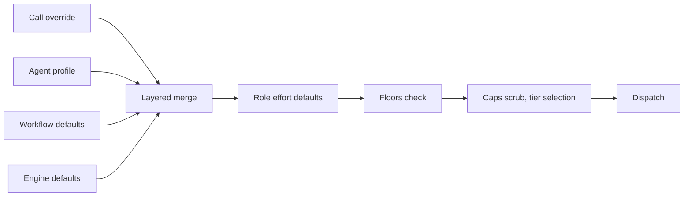

# Model routing

Rulvar is **multi-model at every level**. A workflow can default to one provider, an agent profile can override it, a single call can override that, and one agent can send its tool loop, its structured extraction, and its history compaction to three different models from three different providers. The router resolves the model **on every model invocation**, not once per agent, so the answer to "which model runs this?" is always the same layered merge, evaluated fresh at each call site.

Models are named by `ModelRef`, strictly `'adapterId:model'` with no query parameters: `'anthropic:claude-sonnet-5'`, `'openai:gpt-5.4-mini'`, `'ollama:qwen3:8b'`. Only the first colon splits, so wire ids that contain colons (Ollama tags) work unmodified.

## The capability registry

The adapter registry is strictly per engine; no global mutable registry exists anywhere. You build it by passing adapters to `createEngine`, and a duplicate adapter id is a typed `ConfigError`:

```ts
import { createEngine } from '@rulvar/core';
import { anthropic } from '@rulvar/anthropic';
import { openai, openaiCompatible } from '@rulvar/openai';

const engine = createEngine({
  adapters: [
    anthropic(),
    openai(),
    openaiCompatible({
      id: 'ollama',
      baseURL: 'http://127.0.0.1:11434/v1',
      caps: () => ({ structuredOutput: 'prompt', supportsTemperature: true }),
    }),
  ],
  defaults: {
    routing: { loop: 'anthropic:claude-sonnet-5' },
  },
});
```

Every adapter answers `caps(model)` with a `ModelCaps` record, the capability facts the router consumes:

| `ModelCaps` field | What the router does with it |
|---|---|
| `structuredOutput` | Selects the structured-output tier: `'native'` JSON schema, `'forced-tool'`, or `'prompt'`. |
| `supportsTemperature` | Scrubs sampling parameters the model rejects (current reasoning models on both first-class providers reject them with a hard error). |
| `supportsParallelTools` | Shapes tool dispatch for the turn. |
| `reasoningEfforts` | The canonical efforts this model accepts; anything else is scrubbed visibly. |
| `contextWindow` | Drives the compaction threshold (default 0.8 of the loop model's window). |
| `maxOutputTokens` | Caps the request's output allocation. |
| `pricing` | Adapter-reported fallback pricing only; the versioned [price table](#the-versioned-price-table) always wins. |

`refreshCaps()` is an optional member of the adapter SPI. Of the first-party v1 adapters, only `@rulvar/anthropic` implements it (a live model-list refresh); `@rulvar/openai` ships a verified static seed table plus the versioned `OPENAI_PRICING` export and has no live refresh. Price updates are deliberately not a side effect of a caps refresh: they are registry updates with a `pricingVersion` bump.

Nothing calls `refreshCaps()` for you. Where an adapter implements it, call it before `createEngine` when routing, compaction, and the output clamp should see the provider's current window and output figures instead of the seeded ones. See [Providers](/guide/providers#rulvar-anthropic) for the pattern. The Anthropic refresh paginates under the same discipline as an MCP `tools/list` sweep (RV2904): a cursor echoed back or re-used is refused unconditionally as a cycle, and the opt-in `capsMaxPages` fails the refresh typed when more pages are still reported past the bound, because a silently partial caps table would clamp output bounds against limits that are not the model's.

## The resolution chain

Resolution is a layered merge of `{ model, effort, providerOptions, fallbacks }`, highest priority first:

1. **Call override**: `AgentOpts.model`, `AgentOpts.routing`, `AgentOpts.effort` on the `ctx.agent` call.
2. **Agent profile**: the `AgentProfile` selected by `agentType`.
3. **Workflow defaults**: `model`, `routing`, and `effort` declared on `defineWorkflow`.
4. **Engine defaults**: `defaults.routing` on `createEngine`.


```mermaid
flowchart LR
  A["Call override"] --> M["Layered merge"]
  B["Agent profile"] --> M
  C["Workflow defaults"] --> M
  D["Engine defaults"] --> M
  M --> F["Role effort defaults"]
  F --> G["Floors check"]
  G --> H["Caps scrub, tier selection"]
  H --> I["Dispatch"]
```

Layer 3 lets one workflow carry a model policy of its own without repeating it on
every call, which is what you usually want for a whole class of work ("triage is
cheap; the incident report is not"):

```ts
const triage = defineWorkflow(
  { name: 'triage', routing: { loop: 'anthropic:claude-haiku-4-5' } },
  async (ctx, args: { issues: string[] }) =>
    ctx.parallel(args.issues.map((i) => () => ctx.agent(`Classify: ${i}`))),
);
```

The layer follows the **call tree, not the file**. A child spawned through
`ctx.workflow` contributes its own defaults inside its scope and they stop at its
boundary, so nesting a cheap workflow under an expensive one does the obvious
thing. A workflow that declares nothing contributes no layer and resolves through
the engine defaults exactly as before. A `CompiledWorkflow` (the planner's sandbox
dialect) has no routing surface and so contributes no layer.

Every configurable spot accepts the same `ModelSpec` union: a bare `ModelRef` string, a `ModelChoice` object, or a ladder.

```ts
const engine = createEngine({
  adapters: [anthropic(), openai()],
  defaults: {
    routing: {
      loop: 'anthropic:claude-sonnet-5',
      summarize: 'openai:gpt-5.4-mini',
    },
    profiles: {
      researcher: {
        model: 'anthropic:claude-sonnet-5',
        routing: { extract: 'openai:gpt-5.4-mini' },
        effort: 'high',
      },
    },
  },
});
```

And at the call layer, inside a workflow body:

```ts
const answer = await ctx.agent('Audit the dependency graph for supply-chain risk.', {
  agentType: 'researcher',
  model: {
    model: 'anthropic:claude-opus-4-8',
    effort: 'xhigh',
    fallbacks: ['openai:gpt-5.5'],
  },
});
```

Three merge rules matter in practice:

- `model` applies to **all roles at once**; `routing` overrides **per role** and wins over `model` within the same layer. `AgentOpts.routing` wins over `profile.routing`.
- An explicit `effort` field wins over an effort carried inside a `ModelChoice` at the same layer.
- `providerOptions` and `fallbacks` are delivery options: they never enter the journal identity. The **requested** model and effort do enter the content key, which is why a transport failover can swap the serving model without re-keying anything (see [failover](#retries-and-failover) below). If you need identity separation for a `providerOptions` change, use the call's `key` option.

## Invocation roles

Every invocation resolves with one of seven roles attached, and each role can route to a different model. This is how one agent mixes providers mid-conversation:

| Role | Fires |
|---|---|
| `loop` | Every turn while tools are available to the model. |
| `extract` | Resolves on every schema-bearing call; the separate final structured-output invocation fires only when extract routes to a different model than the loop, when the schema's tier on the loop model is `forced-tool` while tools stay available (it cannot ride such a turn), or when finalize is routed (the schema never rides a loop or synthesis turn). Otherwise the schema rides the last loop turn with no extra call. Even when the separate invocation is armed, a final loop turn whose text already validates against the schema IS the result and the wire is skipped (RV3908): the fourth comparison run's judges paid a full-conversation extract wire on every pass, $0.28 and 5.2% of the run, for JSON their own finals already carried; the separate invocation remains the repair lane for prose-wrapped or malformed finals, and it now compiles the same prompt-cache hint as the loop turns on explicit-caching adapters, so the re-sent conversation prefix reads from cache instead of re-paying the input rate. |
| `finalize` | Only if set in routing: after tools stop, one synthesis invocation with tool choice `'none'` over the full transcript plus a deterministic synthesis instruction appended to the request only. A non-truncated empty synthesis falls back to the loop turn's text instead of erasing it. |
| `summarize` | At the compaction threshold, and for `ctx.brief`. |
| `plan` | The planner model in planned mode. |
| `orchestrate` | The orchestrator agent in orchestrator mode, resolved through the same chain as everything else. |
| `synthesize` | The orchestrator's post-fan-in synthesis invocation, only when `OrchestrateOptions.synthesis` is configured; the routing key picks its model and never summons it. |

```ts
import { defineWorkflow } from '@rulvar/core';

const triage = defineWorkflow({ name: 'triage' }, async (ctx, args: { report: string }) => {
  return ctx.agent(`Investigate this bug report:\n${args.report}`, {
    agentType: 'researcher',
    routing: {
      loop: 'anthropic:claude-sonnet-5',      // the tool loop
      extract: 'openai:gpt-5.4-mini',         // the cheap structured pull
      finalize: 'anthropic:claude-opus-4-8',  // one strong synthesis pass
    },
    schema: {
      jsonSchema: {
        type: 'object',
        properties: { rootCause: { type: 'string' }, severity: { type: 'string' } },
        required: ['rootCause', 'severity'],
        additionalProperties: false,
      },
      validate: (v): v is { rootCause: string; severity: string } =>
        typeof v === 'object' && v !== null,
    },
  });
});
```

Cross-provider mixing inside one agent is correct by construction: the history projector re-derives each provider's wire view (tool-call ids, retained reasoning blocks) from the canonical history on every outgoing request, so the loop can run on Anthropic while extract runs on OpenAI, each seeing a valid transcript. The mechanics live in [Providers](/guide/providers).

Roles also carry **effort defaults** when no layer of the chain resolves an effort: `orchestrate` and `plan` default to `high`; `summarize` and `extract` default to `low`. `loop`, `finalize`, and `synthesize` have no role default; when nothing resolves one, the request omits effort and the provider default applies (high on current Anthropic models, medium on GPT-5.6 and gpt-5.5). These defaults are router policy, not identity surgery: changing them between releases never invalidates paid journal prefixes.

## Capability scrubbing

After resolution the router reads the target's `ModelCaps` and makes the request legal, visibly:

- **Effort scrub.** Canonical effort is five levels: `low`, `medium`, `high`, `xhigh`, `max`. If the resolved effort is not in the model's `reasoningEfforts`, the request proceeds without it, a warning-level workflow event records the scrub, and the scrub is never silently translated into a token cap or any other parameter. Adapters map canonical effort to each wire; on OpenAI, canonical `max` passes through unchanged on the whole GPT-5.6 family (Sol, Terra, and Luna, each verified live) and downmaps to `xhigh` on earlier and unknown models, with the downmap recorded in provider metadata.
- **Sampling scrub.** Current reasoning models on both first-class providers reject temperature and friends with a hard 400, so removing them is a correctness requirement, not a courtesy. Sampling parameters only travel through an adapter's `providerOptions` namespace in the first place, and the router strips the ones the target rejects.
- **Tier selection.** The router picks the structured-output tier from caps: native JSON schema where supported, a forced synthesized tool where not, a prompt-based tier as the floor. The `forced-tool` tier pins the tool choice and therefore cannot ride a turn on which the agent's tools must stay available; that is exactly when a separate `extract` invocation fires.

Identity always records the **requested** effort, never the scrubbed wire value, so replay is stable regardless of what a given model accepted on the day the run went live.

## Role quality floors

Weak model defaults are a quiet failure mode: nothing crashes, output quality just degrades. Floors make the constraint explicit and hard. A floor is a per-role (and optionally per-task-class) allowlist and denylist in engine config, and a violation at resolution is a typed `ConfigError` **before any live call**:

```ts
import { createEngine, type QualityFloors } from '@rulvar/core';

const floors: QualityFloors = {
  byRole: {
    orchestrate: { allow: ['anthropic:claude-opus-4-8', 'anthropic:claude-fable-5'] },
    plan: { allow: ['anthropic:claude-opus-4-8', 'openai:gpt-5.5'] },
  },
  byTaskClass: {
    'code-edit': { deny: ['openai:gpt-5.4-mini'] },
  },
};

const engine = createEngine({
  adapters: [anthropic(), openai()],
  defaults: { roleFloors: floors },
});
```

The rules are deliberately blunt:

- Deny wins over allow.
- No implicit cross-adapter quality ordering exists or is ever computed; a floor is always an explicit list of `ModelRef` values.
- No advice may override or weaken a floor, including recommendations from [model knowledge](/guide/model-knowledge).
- `byTaskClass` floors apply when the agent's profile declares a `taskClass`; an unclassified profile is checked against `byRole` floors only.

`@rulvar/core` ships the floor mechanism but never names a concrete model. The umbrella package ships the opinions:

```ts
import { recommendedDefaults } from '@rulvar/rulvar';

const engine = createEngine({
  adapters: [anthropic(), openai()],
  defaults: {
    routing: recommendedDefaults.routing,
    roleFloors: recommendedDefaults.floors,
  },
});
```

::: tip
`recommendedDefaults` is data, not engine semantics: it pins `orchestrate` and `plan` to strong models and fills the role routing table. Start from it and override freely.
:::

## The versioned price table

Cost accounting needs prices, and prices change. The engine takes a versioned price table whose entries win over any adapter-reported `caps.pricing` (that field is a fallback only). The first-party adapters export their seed rows as ready-made tables, `ANTHROPIC_PRICING` (`anthropic-2026-07-31`) and `OPENAI_PRICING` (`openai-2026-08-23`), each mirroring the provider's official price list as of its version date:

```ts
import { createEngine, type PriceTable } from '@rulvar/core';
import { anthropic, ANTHROPIC_PRICING } from '@rulvar/anthropic';
import { openai, OPENAI_PRICING } from '@rulvar/openai';

// Start from the shipped tables and override rows as prices change,
// always under a NEW version string. Example: the Claude Sonnet 5
// introductory price ends on 2026-08-31, and the host moves to the
// standard row on its own schedule instead of waiting for a library
// release (prices are never fetched live and never switch by wall
// clock inside a run).
const pricing: PriceTable = {
  pricingVersion: 'my-app-2026-09-01',
  models: {
    ...ANTHROPIC_PRICING.models,
    ...OPENAI_PRICING.models,
    'anthropic:claude-sonnet-5': {
      inputUsdPerMTok: 3,
      outputUsdPerMTok: 15,
      cacheReadUsdPerMTok: 0.3,
      cacheWriteUsdPerMTok: 3.75,
      cacheWrite1hUsdPerMTok: 6,
    },
  },
};

const engine = createEngine({ adapters: [anthropic(), openai()], pricing });
```

How the dollars are computed:

- Adapters normalize provider-reported usage into one canonical shape where `inputTokens` is the **full** prompt including cache reads and writes; the core verifies that invariant at the adapter boundary. Dollars come from normalized usage against the table row: cache reads and cache writes bill at their own rates and **only** there, the uncached remainder bills at the input rate (a row that omits a cache rate bills those tokens at the plain input rate rather than silently for free).
- A row may carry long-context `tiers` (GPT-5.6 Sol: prompts strictly above 272K input tokens price the **entire** request at 2x input and 1.5x output). The highest threshold below the prompt size wins; input-side rates, cache rates included, scale by the tier's input multiplier. Admission estimates use the same price function, so a long-context call reserves at its tiered price. The threshold is a property of ONE request, and since RV504 the settled folds honor exactly that: where the journal's per-dispatch records fully cover an entry, the CostReport and invoice price each request individually, so an aggregate can never tier what no single request did, and the settled total agrees with the live budget's per-dispatch debits.
- Pricing is attributed to the model that **actually served** the call (`servedBy` in the journal entry), so a failover never bills the wrong model.
- One agent call can span several serving models, because `loop`, `extract`, `finalize`, and `summarize` each resolve independently. Each phase's usage is priced at **its own** model's rate, not the loop model's, so routing extraction to a cheap model actually shows up as a saving. The split rides the terminal journal entry (`usageByModel`), so the live report, the replayed report, and an independent fold over the stored journal all agree.
- `pricingVersion` is a monotonic string recorded in decision entries, so replayed cost attribution is stable even after you update the table. In adaptive runs, resuming under a table whose version differs from the journaled one is reported as a `termination:config-drift` event with field `pricingVersion`, never silently: see [Budgets and termination](/guide/budgets#the-termination-account).
- A row may carry `ratesVerifiedAt`, the date it was last verified against the provider's documented rates or billing categories. The shipped tables stamp it, preflight copies it onto each spawn report, the settle pin journals it with the row, and `rulvar invoice` names it with its age, so the consumer of any dollar figure can see how stale the rates behind it are; see [rate verification and drift](/guide/providers#rate-verification-and-drift) for what the date claims.
- Unpriced models surface in the run's `CostReport` under `unpriced` with their raw usage, never as a silent zero. This covers local Ollama or vLLM targets and any **hosted model the adapter tables do not know yet**: an unrecognized model id gets conservative transport caps but no fabricated price row, so give it a versioned `pricing` entry here or a USD ceiling cannot bound it (the run warns about exactly that).

Every run outcome carries the full report, bucketed by model, phase, agent type, and invocation role:

```ts
const outcome = await engine.run(triage, { report }, { budgetUsd: 5 }).result;

outcome.cost.totalUsd;   // 0.42
outcome.cost.byModel;    // { 'anthropic:claude-sonnet-5': 0.31, 'openai:gpt-5.4-mini': 0.11 }
outcome.cost.byRole;     // { loop: 0.29, extract: 0.11, finalize: 0.02, ... }
outcome.cost.unpriced;   // [{ model: 'ollama:qwen3:8b', usage: {...} }]
```

The same prices feed the [three-layer budget](/guide/budgets), so admission reserves, ceilings, and the report all agree on what a token cost.

## Retries and failover

Transport failures resolve inside the router, under the journal:

- **Retries** follow a `RetryPolicy` (attempts, exponential backoff with jitter, retryable classes) configurable at the engine, profile, or call layer. A retried-then-successful call is exactly **one** journal entry; provider SDK autoretries are disabled so the journal, the budget ledger, and timeouts see every attempt. Backoff waits are interruptible: a requested cancel, a crossed run deadline, or a crossed budget ceiling wakes the wait immediately and no further attempt is dispatched. A valid provider supplied `retryAfterMs` (finite and nonnegative) replaces the computed delay; anything else is ignored as adapter noise, and every delay is clamped to a timer safe bound. The policy itself is validated before anything runs under it: `attempts` must be a positive integer (the engine always makes the first try, so zero attempts has no meaning), `initialMs` and `maxMs` must be integers within the timer safe range (`maxMs` below `initialMs` is legal; it is a ceiling applied through `Math.min`), `factor` must be finite and above zero (below 1 yields a decaying backoff), `jitter` must be a boolean when given, and `retryOn` must hold unique known classes (empty disables retries). An invalid policy fails as a typed `ConfigError` naming the offending field and config source, at `createEngine` for engine defaults and profiles and at the call merge for call options, before the adapter is dispatched or anything is journaled; `validateRetryPolicy` in `@rulvar/core` is the validator, exported for reuse.
- **Failover** walks the `fallbacks` list of the resolved `ModelChoice` on transport-class failures and rate-limit exhaustion. The content key hashes the *requested* model spec, so a response served by a fallback model replays correctly; the fallback changes only `servedBy`. The never-pay-twice invariant stays intact, and cost attribution stays honest. Budget exhaustion is never a failover trigger: failing over on budget would convert an economic stop into a silent model swap.
- **The degenerate fallback** (`fallback: { model, on }` on the call) is different in kind: an agent-level second attempt on terminal `error`, `limit`, or `schema-exhausted`, journaled as a decision entry, where the fallback attempt is a new content key. See [Agents](/guide/agents) for its trigger semantics.

## Shared provider quotas across processes

`concurrency.perProvider` bounds parallelism inside one engine; it cannot express a **rate**, and it cannot coordinate two engine processes sharing one API key. That coordination is the `QuotaLimiter` SPI (`createEngine` `quota`): a shared rate/quota limiter the engine consults **before every live wire dispatch**, in every phase, on initial attempts, transport retries, and failover takeovers alike.

```ts
import { createEngine, memoryQuotaLimiter } from '@rulvar/core';
import { anthropic } from '@rulvar/anthropic';

const engine = createEngine({
  adapters: [anthropic()],
  quota: {
    limiter: memoryQuotaLimiter([
      { provider: 'anthropic', requestsPerMinute: 50 },
      { provider: 'anthropic', model: 'claude-opus-4-8', tokensPerMinute: 400000 },
    ]),
    tenant: 'acme',
    onLimiterError: 'deny',
  },
});
```

The contract:

- **Reserve, then dispatch.** Each attempt asks the limiter for a reservation dimensioned by `provider` (the adapter id, as in `concurrency.perProvider` keys), `model`, and the tenant, with a heuristic token estimate (the deterministic prompt estimate plus the request's output cap). A grant consumes capacity at admission time; a denial consumes nothing and **no wire call is paid**. The tenant is the engine's configured one by default; `quota: { tenantFrom: 'scope' }` (RV4205) reads the RUN's recorded [`ExecutionScope.tenant`](/guide/durability#engine-run-and-engine-resume) instead, so one engine serving many tenants debits each run's reservations to the tenant the run declared (a run whose scope names none reserves tenant-less). The reservation also carries the run's scope dimensions, and a `QuotaRule` can pin any of `account`, `project`, `legalDomain`, `region`, `providerAccount` beside `provider`/`model`/`tenant`: a pinned rule matches only reservations whose scope carries the same value (an unscoped run matches none of them, the tenant rule's own semantics), so per-region or per-account caps need no limiter fork. Dimension-less rules keep their storage bucket keys byte identical across the upgrade.
- **A denial is a synthetic 429.** The engine converts it into a rate-limit-class `WireError` that rides the retry and failover machinery above verbatim: the limiter's `retryAfterMs` (the honest window remainder) drives the interruptible backoff, and exhaustion fails over, where the takeover reserves under **its own** model dimensions. A request whose estimate can never fit its token cap is denied with `retryAfterMs` 0, so the bounded attempts exhaust without waiting and failover gets its chance immediately. With no fallback left the agent terminates with the typed `error` of kind `rate-limit`, exactly as a provider 429 would.
- **A denial spends its own budget, not the transport one (RV1601).** A pre-wire denial is a wait on the window, not evidence against the provider, so denied turns are bounded by `quota.maxDenials` per serving target (default 8) while `RetryPolicy.attempts` counts DISPATCHED tries only. Before the split, three consecutive denials could exhaust the default transport budget without a single wire call leaving; the eighteenth comparison benchmark also caught the conflated telemetry live, with 21 denials exported as `retryCount` 21 over an invoice holding zero provider error rows. The namespaces now hold by construction: `quotaDenials` counts denials, `transportRetries`/`retryCount` count dispatched retries, and `ProviderCallRecord.attempt` stays the dense 1-based dispatched ordinal.
- **Reconcile after settlement.** Every granted reservation settles against the attempt's **actual** usage once the outcome lands, so `tokensPerMinute` windows are approximate at admission and exact at settlement; `requestsPerMinute` admits exactly one request per reservation and settles at the TRUE wire count when the adapter absorbed provider-side continuations into the dispatch (the Anthropic `pause_turn` pattern: up to six wire requests behind one reservation, RV905), so the window reflects what the provider's own RPM meter saw. A settlement only ever adds, never denies retroactively: the wire calls already happened. A reconcile failure only warns, and windows age unsettled estimates out. Post-hoc settlement is accounting, not admission, and a hard provider RPM cap needs more: with the opt-in `quota: { reserveContinuations: true }` (RV1013) the engine reserves EACH provider-side continuation in the limiter before its egress through the adapter-side `StreamHooks` seam, so the over-cap wire never leaves (the denial rides the provider-429 machinery verbatim), the main settlement stops re-adding individually admitted segments (the window is never double-counted), and a granted admission whose wire never left is RELEASED back to the window where the limiter implements the optional `release(reservationId)`. All three references do (RV1103 + RV1104): `memoryQuotaLimiter`, `SqliteQuotaLimiter` (from any process sharing the file), and `PostgresQuotaLimiter` (from any host, under the same advisory lock and generation fence as every admission). A release returns exactly what admission consumed, the admitted requests and the token estimate; unknown, expired, and repeated ids are no-ops, and a released id settles nothing afterwards. Both store schemas grew a `requests` column on the reservations table; pre-release rows migrate in place defaulting to 1, the single request every engine admission reserves, so a legacy reservation releases exactly what its admission consumed. Adapters unaware of the hook keep the post-hoc semantics exactly. The unused-grant release is fail closed on the wire count (RV1210): only a finish that NAMES its wire set proves which grants went unused, so a finish carrying no count releases nothing at all, the same conservative direction an error or aborted terminal already took. Reading an absent count as "one wire flew" used to hand a hook-granting adapter that reports no count back exactly the capacity the pre-wire admission had consumed.
- **An abort stops the wire, even mid-reservation.** A limiter that queues can hold `reserve` for as long as the window is full, and that wait sits past the abort check the dispatch does before entering the queue. Since RV1210 the engine rechecks the host and budget signals when the reservation resolves: an abort that landed inside the wait ends the attempt with no wire leaving, and the granted admission is RELEASED rather than reconciled, because a settlement only ever adds (the call happened) while this call provably did not. Limiters without the optional `release` keep the conservative window age-out.
- **Windows are fixed and epoch-aligned, and the boundary is a named compromise (RV708).** Every PerMinute cap counts over fixed 60 s windows aligned to the epoch, never a sliding minute: each fixed window enforces its cap exactly, and a burst placed astride a boundary can therefore consume up to TWO caps inside one sliding 60 s. That bounded burst is the price of cross-process parity (every reference limiter in every process computes the same window from the same clock, with no shared sliding state to synchronize), and provider-side minute windows are themselves fuzzy; size caps with the boundary burst in mind. Pinned as intended behavior, not scheduled to change.
- **Live-only by construction.** Like transport retries, quota admission happens under the journal: nothing is journaled, replay and resume of memoized work never touch the limiter, and an unconfigured engine takes the exact pre-quota dispatch path.
- **Failure policy.** `onLimiterError: 'deny'` (the default) fails closed: a limiter infrastructure failure (its storage down) becomes a retryable transport-class denial and nothing dispatches unpoliced. `'allow'` fails open: a warning is logged and the call dispatches without a reservation. A limiter **denial** is unaffected by this knob.

Rules match by dimension (an absent dimension matches every value), **every** matching rule must admit, and a grant consumes from each. Counters are rule-scoped: one rule matching two models pools them under one cap; write one rule per model for per-model buckets. `validateQuotaRules` rejects a malformed rule set as a typed `ConfigError` before any limiter admits under it.

Three reference implementations ship: `memoryQuotaLimiter` (in `@rulvar/core`) coordinates every engine sharing the instance inside one process; `SqliteQuotaLimiter` (in `@rulvar/store-sqlite`) coordinates **processes** over one database file, with admission inside a single `BEGIN IMMEDIATE` transaction so two processes can never both take the last slot; `PostgresQuotaLimiter` (in `@rulvar/store-postgres`) coordinates processes across **hosts** over one database and schema, with admission inside a single transaction serialized on a schema-wide advisory lock (a call still waiting past its exported `QUOTA_LOCK_TIMEOUT_MS` throws into the `onLimiterError` policy instead of hanging). All three agree on every verdict because the window math and the admission decision are the same exported functions, all three admit under an immutable snapshot of the rules taken at construction (the exported `snapshotQuotaRules`; mutating the caller's array or rule objects afterwards changes nothing), all three refuse a rule set containing two identical rules (the same canonical `quotaRuleKey`) with a typed `ConfigError` naming both indexes and the key, because index-keyed memory buckets count each copy independently while key-keyed store buckets are debited once per matching copy, so the same duplicated configuration used to admit the full cap in memory and half of it on a store before anything refused it (the `quotaRulesConformance` case in `@rulvar/store-conformance` pins the refusal for any limiter implementation), and all three fold a denial over matching rules in the canonical `quotaRuleKey` order, so permuted but identical rule sets produce the byte-identical refusal object, not just the same fingerprint. The postgres limiter additionally bounds each WHOLE admission path (lazy bootstrap, pool checkout, and the transaction together) with `admissionDeadlineMs` (default 5000 ms, capped by the Node timer maximum at construction; expiry throws a typed `QuotaDeadlineError` that destroys exactly what its phase held, the admission's connection, the bootstrap's connection, or nothing, and says which), and enforces the identical-rules requirement continuously: the schema records a fingerprint of the canonical rule set plus a rules generation, a drifted host is refused typed at boot with both hashes, a host that booted BEFORE a rotation is fenced typed (`QuotaGenerationError`) by the in-transaction re-read on its next admission rather than silently splitting the budget, and rotation is the explicit `acceptRulesUpdate: true` opt-in that serializes with admissions on the same lock and carries current-window consumption conservatively (details and the rollout procedure in [stores](/guide/stores)). When sizing it, count `reserve` and `reconcile` both against the schema-wide lock: it sees admission attempts plus grants (every grant settles through the same lock) and queues head-of-line, one slow admission delaying every waiting host up to the bounds above. What to do while a denial waits out its window (park the run, spill to another provider, surface backpressure) stays host policy: a durable admission queue is deliberately not the limiter's job. That queue exists as its own seam (plan 45, [`rfcs/admission.md`](https://github.com/o-stepper/rulvar/blob/main/rfcs/admission.md)): the durable admission SPI (`AdmissionScheduler` in `@rulvar/core`, durable documents in `@rulvar/store-sqlite` and `@rulvar/store-postgres`) answers "when may this work START, and in what order relative to competing tenants", with hierarchical start-time fair queuing over reserved wires, three JCS-canonical bucket levels (resolved tenant; tenant plus provider account with its concurrency semaphore; the full scope), a terminal `denied` verdict for infeasible reservations, lease-fenced consumption covers with conservative expiry settlement, and release refunds whose over-consumption lands as bucket debt. The split is load bearing: the limiter answers "may this wire fly right now" and stays live-only; the scheduler owns tickets, ordering, and refunds, all durable; a granted ticket never exempts a wire from quota, and the engine consults both (`createEngine` `admission`, the [durability page's run bracket](/guide/durability)). The twelve-row `admissionConformance` matrix in `@rulvar/store-conformance` is the executable acceptance surface, fairness measured as granted raw service. A Redis-backed limiter implements the same two-method SPI (`reserve`/`reconcile`); a provider-side gateway that enforces quotas behind the adapter is the alternative deployment that needs no limiter at all.

A limiter is only as truthful as its declaration, and the declaration can drift above the provider's real ceiling: the v1.71 experiment declared 12M TPM over a real 1M, the local limiter went quiet, and the provider denied seven times live with nothing recording the mismatch. The opt-in `quota.declaredRules` (the SAME rule array `preflightEstimate` takes as `quotaRules`) closes that loop with drift telemetry: both shipped adapters now parse the provider's own `x-ratelimit` headers on every real 429 into normalized per-minute limits (`WireError.data.reportedLimits`; openai reports a combined token window, anthropic reports split input and output windows that the comparison sums), and whenever the binding declared cap EXCEEDS what the provider reported, the run journals a `quota_drift` decision (provider, model, tenant, dimension, `declaredPerMinute`, `reportedPerMinute`; one per invocation and dimension) and emits a warn log naming both numbers. Purely observational: nothing clamps, the limiter keeps enforcing the declaration, and lowering it to the provider's truth stays a host decision. Synthetic limiter denials never count (only calls the provider actually answered), and without `declaredRules` journals and events stay byte identical. Reported values obey a strict digit grammar AND a safe-integer bound: a malformed or absurdly long header value is dropped, never normalized into `NaN` or `Infinity`.

## Model ladders

A ladder is the escalation form of a `ModelSpec`: ordered rungs from cheap to strong, with binding per-rung caps that bound the worst-case cost of a failed attempt:

```ts
const engine = createEngine({
  adapters: [anthropic(), openai()],
  defaults: {
    profiles: {
      fixer: {
        model: {
          ladder: {
            rungs: [
              { model: 'anthropic:claude-sonnet-5', effort: 'medium', maxTurns: 8, maxTokens: 60000, maxCostUsd: 0.5 },
              { model: 'anthropic:claude-opus-4-8', effort: 'high', maxTurns: 12, maxTokens: 120000, maxCostUsd: 2 },
            ],
            startTier: 0,
            escalateOn: ['error', 'schema-exhausted', 'verify-failed'],
          },
        },
      },
    },
  },
});
```

Each rung attempt is an ordinary agent scope whose identity includes the concrete `ModelRef`, so escalating to the next rung is a new content key and exactly one live attempt; every escalation verdict and acceptance-gate outcome is a journaled decision entry, computed once live and replayed by match. A dynamic orchestrator never names a model directly: it can only hint a starting tier, clamped to the declared ladder. Rungs on unpriced local models simply omit `maxCostUsd`.

Ladders, acceptance gates (mechanical checks, judge rungs, spot checks), and escalation triggers are covered in depth in [Adaptive orchestration](/guide/adaptive-orchestration).

## Next steps

- [Providers](/guide/providers): the adapter contract, wire mapping, prompt caching, and the `openaiCompatible` factory.
- [Agents](/guide/agents): profiles, the tool loop, structured output tiers, and the degenerate fallback.
- [Budgets](/guide/budgets): how priced usage feeds reserves and ceilings.
- [Adaptive orchestration](/guide/adaptive-orchestration): ladders, gates, and escalation end to end.
- [API reference](/api/@rulvar/core/): `ModelSpec`, `QualityFloors`, `PriceTable`, and the rest of the routing surface.
