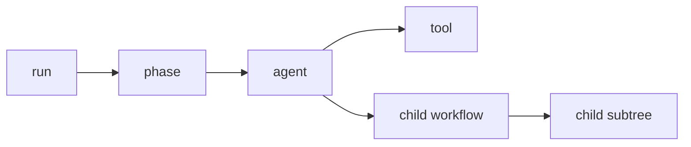

# Observability

Rulvar has exactly one observability surface: a discriminated stream of typed `WorkflowEvent` values. Everything else on this page is a consumer of that stream: `RunHandle.events` and `on()` for host code, the two terminal progress renderers in the umbrella package (`renderProgress` lines and the live `progress` tree), the `@rulvar/cli` TUI, and the OpenTelemetry exporter. There is no pluggable event-sink seam to configure; you subscribe on the handle and fold what you need.

Events are pure telemetry. No event, field, or ordering of events participates in journal identity: you can drop every event and no run outcome changes. That separation is what lets the engine mask secrets in telemetry, re-emit history on resume, and evolve the catalog without ever perturbing replay.

## The event envelope

Every event shares one envelope and adds a `type`-discriminated body:

```ts
type WorkflowEvent = {
  runId: string;
  seq: number;           // per-run telemetry counter, strictly increasing
  ts: string;            // ISO 8601 wall clock; telemetry only, never identity
  spanId: string;
  parentSpanId?: string;
  replayed?: boolean;    // true only on re-emitted journal-backed events
} & WorkflowEventBody;   // CoreEvents | AgentEvents | ToolEvents | AdaptiveEvents
```

Three envelope rules matter in practice:

- `seq` is an independent telemetry counter. It is distinct from the journal's own `seq` and the two must never be compared or joined. Where an event references a journal entry it carries an explicit `entryRef` field holding the journal seq, so you can correlate telemetry with [journal](/guide/journal) entries without guessing. `seq` is strictly increasing across the WHOLE run, resume segments included, but not contiguous: each execution segment starts at a durable per-segment base (recorded in `RunMeta.segments`), so a resumed segment's first event jumps far above the previous segment's last. Treat `seq` as ordered, never as dense, and never parse segment structure out of it.
- `ts` is wall clock and may differ between the live and replayed emission of the same logical event.
- `spanId` values are engine-minted opaque strings, unique per run (across resume segments too; span counters share the same durable per-segment base as `seq`), and are excluded from content keys.

Event names follow one convention: `domain:verb`, all lowercase ASCII (`agent:end`, `spawn:admitted`, `budget:update`). The catalog is closed per minor release; new event types only arrive with a release note. Emitters may add fields, so consumers must tolerate unknown fields and unknown event types.

## Span hierarchy

Spans form a tree per run with a fixed hierarchy:



The run has a single root span; each `ctx.phase` opens a child span (phases nest); each agent invocation opens a child of the innermost phase span (orchestrator wake turns are agent spans); each tool call opens a child of its agent span; and each child workflow becomes the root of its own subtree under the spawning span. This tree maps one to one onto OpenTelemetry spans via `toOtel` below.

## The event catalog

All four family unions are exported from `@rulvar/core` as `CoreEvents`, `AgentEvents`, `ToolEvents`, and `AdaptiveEvents`, combined as `WorkflowEventBody`.

### Run lifecycle and core telemetry

| Event | Fires when | Notable fields |
|---|---|---|
| `run:start` | The run begins (`resumed: true` on resume). | `workflow`, `resumed` |
| `run:end` | The run settles. | `status`, `totalUsd`, `usageApprox?` |
| `phase:start` | A `ctx.phase` block opens. | `phase` |
| `log` | The workflow or engine logs a line. | `level`, `msg`, `data?` |
| `budget:update` | Spend or committed reserves changed. | `spentUsd`, `remainingUsd`, `committedReserveUsd` |
| `external:waiting` | The run suspended on `ctx.awaitExternal`. | `key`, `entryRef`, `prompt?`, `deadlineAt?` |
| `approval:pending` | A tool call is suspended awaiting approval. | `toolName`, `entryRef`, `deadlineAt?` |
| `child:start` / `child:end` | A child workflow starts and settles. | `workflow`, `scope`, `status` on end |

### Agent lifecycle

| Event | Fires when | Notable fields |
|---|---|---|
| `agent:queued` | A spawn is admitted and waiting on the scheduler. | `agentType`, `label?` |
| `agent:start` | The logical agent dispatch begins; exactly one per span. | `model`, `role` |
| `agent:phase:start` | One model invocation phase activates inside the span (`loop`, `summarize`, `finalize`, `extract`). | `role`, `model`, `invocation` |
| `agent:phase:end` | That activation settles, with its own slice of the money. | `role`, `model`, `invocation`, `durationMs`, `usage`, `costUsd`, `outcome`, `retries?` |
| `agent:end` | The agent settles; the one event that carries the whole total. | `status`, `usage`, `costUsd`, `entryRef`, `usageApprox?`, `retryCount?`, `exploration?` |
| `agent:error` | A live attempt failed. | `error` (a wire error), `willRetry` |
| `agent:schema-retry` | Structured output failed validation and is being retried. | `attempt`, `maxAttempts` |
| `agent:stream` | A token delta arrived; only for calls that opt into streaming. | `delta` |

`agent:stream` deltas are never journaled and never re-emitted on replay. Note the asymmetry with errors: `agent:error` reports a live attempt failing right now, while a memoized error outcome coming back from the journal surfaces as a replayed `agent:end` with status `'error'`.

#### The invocation model

One agent dispatch emits exactly ONE `agent:start`/`agent:end` pair on its span, and every model invocation phase inside it (the tool loop itself, each mid-loop compaction, the finalize synthesis, the separate extract) emits its own paired `agent:phase:start`/`agent:phase:end`, keyed by `(spanId, invocation)` with a 1-based activation ordinal. That makes durations, per-phase usage, and attempts derivable without heuristics: pair the events, subtract the timestamps, sum the phases. Before this contract every phase emitted an extra unpaired `agent:start`, so a consumer pairing starts with the single end read the LAST phase's duration as the agent's and a starts-minus-ends gauge leaked one running agent per phase.

The per-phase `usage` is the delta the activation added to its `(role, model)` slice, so the phase pairs sum exactly to `agent:end`'s totals and to the journaled `usageByModel` split the [CostReport](#costreport) folds; `costUsd` prices that delta at each serving model's own rate. `retries` on a phase pair and `retryCount` on `agent:end` count transport retries; both are live telemetry only, never journaled, so replayed events omit them and absence means "zero or unknown". A summarize that fires three times gets three pairs, interleaved inside the still-open loop phase (phases are activations, not strictly nested spans; the `invocation` ordinal disambiguates).

`reduceInvocationTable(events)` (exported from `@rulvar/core`) is the official reducer over this vocabulary: it builds the per-agent, per-phase table (durations, usage, cost, retries, open flags for truncated streams) plus a per-role aggregate that matches `CostReport.byRole` without any pairing heuristics. A live stream and its replay reduce to identical usage and cost columns: replayed phase pairs are reconstructed from the terminal entry's recorded slices, with `durationMs` 0.

`reduceCriticalPath(events)` folds the same vocabulary into the run's critical-path summary: run wall, the post-fan-in interval (the last settled non-coordination agent to `run:end`), the summed wall of `synthesize` spans, and the corresponding shares, so the improvement plan's gate (post-fan-in synthesis at most 40% of wall time) is one field read instead of hand-rolled timestamp arithmetic, and the [benchmark kit](/guide/evals#the-benchmark-kit) can expose any of these as a metric extractor. Wall numbers are live fidelity: a replayed stream re-stamps emission times, so its intervals are degenerate, exactly like phase durations; absent pieces (no `run:end` yet, no worker spans) stay `undefined` instead of guessed at.

Token accounting semantics, so the numbers read correctly: `cacheReadTokens` and `cacheWriteTokens` are SUBSETS of `inputTokens` (the Usage invariant; pricing bills uncached input as `inputTokens` minus both cache counts, each cache class at its own rate), and `reasoningTokens`, when present, is a subset of `outputTokens` (the adapters normalize it from the provider's output-token details) that is informational only: `outputTokens` is priced whole and reasoning is never billed on top.

### Tool lifecycle

| Event | Fires when | Notable fields |
|---|---|---|
| `tool:start` | A tool call dispatches. | `toolName`, `risk?` |
| `tool:end` | The tool call settles. | `outcome` (`'ok'`, `'error'`, `'denied'`), `durationMs`, plus the permission audit fields `verdict?`, `decidedBy?`, `rule?`, `advisory?`, and `guard?` when an exploration guard denied the call |

The audit fields on `tool:end` record which layer of the permission chain decided and which rule matched; see [Tools](/guide/tools). A `tool:end` carrying `guard: 'repeated-signature'` was denied by the [exploration guards](/guide/agents#exploration-guards), not the permission chain, and was never dispatched. The `exploration` summary on `agent:end` carries the guard counters (`toolCallsUsed`, `distinctSignatures`, `repeatedCalls`, `duplicateResultCalls`, `deniedRepeats`, `byTool`): present live whenever any exploration limit was configured, and on replay only when the guard abort journaled it. The OTel exporter maps the summary to `rulvar.exploration.*` span attributes and the guard marker to `rulvar.tool.guard`.

### Determinism detection

| Event | Fires when | Notable fields |
|---|---|---|
| `determinism:warning` | A bare `Date.now()` or `Math.random()` call was observed inside the run, classified workflow-origin or allowlisted. | `category` (`'bare-date-now'`, `'bare-math-random'`), `provenance` (`'workflow'`, `'allowlisted'`), `frame`, `file?`, `line?`, `column?` |

Emitted live, at most once per `(category, provenance)` per execution segment, and never journaled; because replay re-executes the body, a violation still in the code fires again on every replay, so the event appears in replayed streams organically (without the `replayed` flag). Installed dependencies and Node runtime frames are classified exempt and emit nothing. Under `determinism.mode: 'error'` a workflow-origin call additionally rejects the run with a typed `DeterminismError`; see [Runtime detection and enforcement](/guide/determinism#runtime-detection-and-enforcement).

### Adaptive orchestration, plan, and accounting events

These fire only in runs where the corresponding machinery is active (see [Adaptive orchestration](/guide/adaptive-orchestration) and [Orchestration modes](/guide/orchestration-modes)):

| Event | Fires when |
|---|---|
| `plan:revised` | A plan revision applied; carries `planHash`, applied and dropped operation counts, and `revisionUnitsRemaining`. |
| `node:parked` / `node:cancelled` | A plan node was parked or cancelled. |
| `node:linked` | A re-added task was linked to a completed donor subtree; `reclaimedUsd` is the spend recovered by reuse. |
| `orchestrator:woke` | An orchestrator wake turn started; `renderSize` is the rendered digest size. |
| `orchestrator:budget` | The orchestrator sub-account moved. Each wake digest emits `atCap` plus the digest's budget block (`runSpentUsd`, `runCeilingUsd`, `orchestratorSpentUsd`, `orchestratorCapUsd`, `finalizeReserveUsd`, `orchestratorShare`, `softWarning`); the at-cap freeze emits `atCap: true` with `spentUsd`, `capUsd`, and `finalizeReserveUsd`. |
| `escalation:raised` / `escalation:decided` | A worker escalated and the decision landed (`retry`, `decompose`, `cancel`, or `accept`). |
| `spawn:admitted` | Admission admitted a spawn, on EVERY admission boundary: the orchestrator spawn tools, PlanRunner's journal-embedded admissions (decomposition, ladder respawns, reuse and graft links), `ctx.workflow` children, and `ctx.agent` lineage admissions (declared `lineage`/`approach`). Carries the journaled decision `entryRef`, the admitting `verdict` arm, `agentType`, `logicalTaskId`, and `spawnUnitsAfter` (absent on `ctx.agent` lineage admissions, whose spawn-unit debit rides the dispatch itself). A journal-recovered decision re-announces with `replayed: true`; a cleanly replayed dispatch does not re-announce at all. |
| `spawn:rejected` | Admission rejected a spawn, on the same boundaries as `spawn:admitted`; carries the rejection `code`, `agentType`, and the journaled decision `entryRef` (absent for pre-admission config gates such as `orchestrate` `maxSpawns`, which reject before anything is journaled). A recovered rejection re-issues with `replayed: true` when it takes effect. The caller still sees the typed `AdmissionRejectedError`. |
| `verify:failed` | A verification gate (mechanical, judge, or spot-check) failed a rung attempt. |
| `ledger:op` | A run-ledger write (brief, fact, lesson, observation). |
| `stall:detected` | A logical task's no-progress streak advanced. |
| `guard:oscillation` | The oscillation guard tripped on a repeated spawn key. |
| `resolution:applied` / `resolution:superseded` | A live resolution attempt won the first-closing-wins fold (`targetRef`, the appended attempt's `entryRef`, `by`), or lost to an earlier close (`supersededBy`, `reason`). Emitted for live attempts only; folds of prior entries at resume re-emit nothing. |
| `termination:debit` / `termination:denied` | A termination counter was debited, or a request was refused because a counter ran out. |
| `termination:config-drift` | A resumed run's live limits differ from the frozen ones. |
| `journal:compat` | Declared in the event union but not yet emitted: loading a journal outside the engine's hash-version window throws `JournalCompatibilityError` instead; see [Journal compatibility](/guide/journal-compatibility). |

## Subscribing from the host

`engine.run` returns a `RunHandle` immediately. The two subscription forms differ in where their stream begins:

- `handle.events` is **gapless from handle creation**: the engine buffers every event from the moment the handle exists, so a consumer that starts iterating late (even after `await result`) still receives the complete stream, in `seq` order. Draining a large backlog is linear in its size.
- `handle.on(type, cb)` observes **from registration onward**: events emitted before the callback was registered are not re-delivered. Register before awaiting `result` if you need the early events on this form.

The gapless buffer is also the memory contract: the engine holds the run's undelivered events as long as the handle is reachable and the stream has not been consumed. Consume `handle.events` (or drop every reference to the handle) to release them; a host that keeps thousands of settled handles alive without reading their streams keeps every buffered event alive too. For a server shell that stays up, bound the per run history with the HTTP server's [`maxBufferedEventsPerRun` and memory retention options](/guide/cli#the-http-server) instead of retaining raw handles.

```ts
// engine and the panel workflow as in the quickstart.
const handle = engine.run(panel, { question: 'Monorepo or polyrepo?' }, { budgetUsd: 2 });

// Callback form: one event type, fully typed payload, returns an unsubscribe.
const off = handle.on('agent:end', (e) => {
  console.log(`${e.agentType} settled ${e.status}: $${e.costUsd.toFixed(4)} (journal seq ${e.entryRef})`);
});

// Iterator form: the whole stream, discriminated on `type`.
for await (const event of handle.events) {
  if (event.type === 'budget:update') {
    console.log(`spent $${event.spentUsd}, reserved $${event.committedReserveUsd}`);
  }
  if (event.type === 'run:end') {
    console.log(`run settled ${event.status} at $${event.totalUsd}`);
  }
}

off();
const outcome = await handle.result;
```

Both forms are cheap to stack: a progress bar on `agent:start` and `agent:end`, a spend ticker on `budget:update`, an alert on `run:end` settling with a status other than `'ok'`. In tests, prefer the matchers from `@rulvar/testing`, which fold the same stream; see [Testing](/guide/testing).

### Throwing listeners

Listener code is best-effort telemetry, and a listener that throws can never affect the run:

- The exception is caught inside the bus; the run's outcome, its journal, and its spend are untouched.
- Delivery order is preserved: the event whose listener threw reaches every remaining listener and every iterator FIRST, and only then a single `log` event at level `warn` announces the isolation, so no observer ever sees the warning reordered ahead of its cause and `seq` stays ascending on every surface.
- The warning goes through the ordinary emission path, so its message is masked exactly like every other event (a key-shaped fragment of the listener's own error message never reaches observers raw; `maskEvents: false` opts the warning out together with everything else).
- The warning fires at most once per run segment: a listener that throws on every event, or several listeners throwing at once, cannot flood the stream or recurse.

The `EventBus listener failure ordering and masking` tests in `@rulvar/core` pin each of these guarantees.

## The live terminal progress view

The umbrella package ships two ready-made stream consumers. `renderProgress(handle.events)` is the minimal one: a plain line per lifecycle fact, readable in any pipe. `progress(...)` is the rich one: a live tree on stderr with one row per agent showing a status glyph, a running timer, token counts, and USD, plus per-role sub-timings when one call spans several invocation phases (loop, then summarize, finalize, or extract), the run header with spend against the ceiling from `budget:update`, and a final summary that includes the per-role dollar split from `RunOutcome.cost.byRole`.

```ts
import { createEngine, progress } from "@rulvar/rulvar";

const handle = engine.run(panel, { question: "Monorepo or polyrepo?" }, { budgetUsd: 2 });
const view = progress(handle);
const outcome = await handle.result;
await view.done;
```

While the run executes the terminal shows, repainted in place:

```text
/  panel  run r_8f3k2  1m 04s  $0.431 / $2.00  ###.........
  [gather]
  *  scout (web)  openai:gpt-5.6-terra  31s  in 18k out 2.1k  $0.086
  -  scout (docs)  openai:gpt-5.6-terra  47s  ~3.1k out  tool: web_fetch
  -  writer  openai:gpt-5.6-sol  > finalize  1m 02s
       roles: loop 48s · finalize 14s..
```

`progress` accepts a `RunHandle` (it subscribes through `on()`, so `handle.events` stays free for your own consumer, and the final frame is enriched from the settled `CostReport`; the `orchestrate` and `orchestratePlanned` helpers return exactly such a handle, so `progress(orchestrate(engine, goal, opts, { budgetUsd: 10 }))` composes directly), a promise resolving to a handle (for wrappers that construct one asynchronously), or a raw `WorkflowEvent` iterable, which is the gapless path for resumes: `progress(resumed.events)` sees the replayed prefix a late `on()` could miss, at the price of consuming that one-shot iterable.

Modes and honesty: on a TTY the view repaints at a bounded rate (`fps`, default 10); in pipes and CI it degrades to append-only lines, one per fact, with budget lines throttled; `mode: 'off'` disables it entirely. Exact token counts arrive only with the settle events (`agent:phase:end`, `agent:end`), so running rows show elapsed time and a tilde-marked estimate from `agent:stream` deltas; replayed rows render with a `replay` tag and never spin. The sink and clock are injectable (`sink`, `clock`) for deterministic tests, output defaults to stderr so application stdout stays clean, and colors honor `NO_COLOR` plus an explicit `color` option.

## Replay re-emission and the replayed flag

On resume, the engine re-emits events for the journal-backed facts it consumes, so a UI can rebuild the run picture without parsing the journal itself. Every re-emission carries `replayed: true` so consumers can deduplicate. The rule: exactly the journal-backed agent, tool, child, and suspension lifecycle events re-emit; everything else never carries the flag.

| Event types | Re-emitted with `replayed: true` |
|---|---|
| `agent:start`, `agent:end`, `child:start`, `child:end` for entries consumed by replay; `agent:phase:start`, `agent:phase:end` reconstructed one pair per recorded `(role, model)` usage slice (`durationMs` 0, no `retries`); `tool:start`, `tool:end` for tool results reconstructed from a replayed turn; `external:waiting`, `approval:pending` for suspensions still open | yes |
| `agent:stream` | never |
| `spawn:admitted`, `spawn:rejected` for journal-recovered admission decisions taking effect on this resume | yes |
| the remaining adaptive events (`plan:revised` through `termination:config-drift`) | no; the orchestration machinery emits them through its live path without the flag, so an adaptive event observed during a resume looks live even when it restates a journal-backed fact |
| `run:start`, `run:end`, `phase:start`, `log`, `budget:update`, `agent:queued`, `agent:error`, `agent:schema-retry` | no; they describe the current process, and `phase:start` and `log` fire live again as workflow bodies re-execute |

Replayed events carry payloads read from the journaled facts, byte for byte (status, usage, cost, verdicts), never from re-evaluation. This is the observable face of the decision-entry principle: what you see on resume is what was decided, not a recomputation.

## RunHandle: live and finished runs

```ts
interface RunHandle<R> {
  runId: string;
  result: Promise<RunOutcome<R>>;
  events: AsyncIterable<WorkflowEvent>;
  on<T extends WorkflowEvent['type']>(
    type: T,
    cb: (e: Extract<WorkflowEvent, { type: T }>) => void,
  ): () => void;                                     // returns unsubscribe
  resolveExternal(key: string, value: Json): Promise<ResolutionOutcome>;
  cancel(reason?: string): Promise<void>;
}
```

- `cancel` requests cooperative cancellation; the run settles `'cancelled'` with a complete `CostReport`.
- `resolveExternal` closes an open external suspension; repeated resolution is defined behavior (first close wins), not an error. See [Durability](/guide/durability).
- `engine.resume` returns a `ResumeHandle`, which adds `preview: Promise<ResumePreview>` with the replay hit, miss, and rerun accounting.

For a finished run you have three inspection paths. Resume it with `{ dryRun: true }` and consume the re-emitted stream: replay-strict matching guarantees zero live calls. Fold its journal directly with `costReportFromJournal`, the same pure fold the kernel's ledger uses:

```ts
import { costReportFromJournal, priceUsdOf, type Pricing } from '@rulvar/core';

const prices: Record<string, Pricing> = { /* your price table */ };

const entries = await engine.stores.journal.load('quickstart-panel-1');
const report = costReportFromJournal(entries, (servedBy, usage) => {
  const pricing = prices[servedBy];
  return pricing ? priceUsdOf(pricing, usage) : undefined; // undefined lands in unpriced
});
```

The callback's `servedBy` is a model ref string, the same `'adapterId:model'` key `byModel` reports under. The per agentType and per role breakdowns are folded from each terminal entry's `costAttribution` facts, not from a nested `servedBy.model` or a top level `agentType`; a call whose phases spanned several models splits its usage through `usageByModel` so each slice prices at the model that served it.

Or use the terminal: `rulvar runs ls --store .rulvar/journal` and `rulvar inspect <runId> --store .rulvar/journal` from `@rulvar/cli` render the same facts. Point `--store` at the directory your `JsonlFileStore` writes (`.rulvar/journal` in the quickstart's engine assembly; the CLI's own default is `.rulvar`); see [CLI](/guide/cli).

## CostReport

Every settled run carries a full cost report in `outcome.cost`, and `run:end` carries the same `totalUsd`:

```ts
interface CostReport {
  totalUsd: number;
  byModel: Record<string, number>;      // canonical 'adapterId:model' refs
  byPhase: Record<string, number>;      // ctx.phase names
  byAgentType: Record<string, number>;
  byRole: Record<InvocationRole, number>;
  orchestrator: {
    spentUsd: number;        // orchestrator sub-account spend
    share: number;           // spentUsd / max(totalUsd, 0.01)
    wakes: number;
    forcedFinish: boolean;   // true when the at-cap freeze forced finish
    reserveUsedUsd: number;  // spend drawn from the finalize reserve
  };
  unpriced: Array<{ model: string; usage: Usage }>;
  usageApprox?: boolean;     // present and true when the total includes estimated usage
}
```

Four details worth knowing:

- `totalUsd` is an estimate computed from the usage the provider reported and the configured price table, not the provider's invoice: registry prices can lag provider price changes, and rounding or billing rules on the provider side are not modeled. Reconcile against the provider's billing when exactness matters.
- `usageApprox` is present and true when any usage folded into the total was estimated rather than reported by the provider (a transport cut, a stream a ceiling severed, or an abort), making the total a lower bound. The same flag rides `agent:end` and `run:end`, and the CLI cost line marks it.
- Usage on a model absent from the price table lands in `unpriced` and never contributes a silent zero to a priced bucket. Missing pricing is visible, not invisible.
- The `orchestrator` block exists in every run; without a dynamic orchestrator it is all zero with `forcedFinish: false`. The `share` denominator is floored at one cent, so a zero-cost run reports share 0 instead of dividing by zero. `byPhase` is why `ctx.phase` is structural for cost attribution while staying cosmetic for journal identity: renaming a phase changes your report, never your replay.

The budget machinery behind these numbers, including the `'exhausted'` outcome and committed reserves, is covered in [Budgets](/guide/budgets).

## Metrics

Rulvar ships metric definitions and their inputs, not a metrics backend. Each metric below is a pure fold over the event stream, the journal, or `CostReport`, so any dashboard that agrees on the definitions agrees on the numbers:

| Metric | Definition | Source | What it tells you |
|---|---|---|---|
| Ledger ops per spawn | authored `ledger:op` count / `spawn:admitted` count, per run | event stream | how much shared-ledger writing your agents actually do |
| Wake render size | distribution of `orchestrator:woke` `renderSize` per run | event stream | whether the wake digest render budget is sized right |
| Escalation rate by agent type | `escalation:raised` count / spawn count, grouped by `agentType` | event stream | which agent profiles and ladders need tuning |
| Orchestrator share p50/p90 | distribution of `CostReport.orchestrator.share` across runs | CostReport | whether coordination overhead stays a small fraction of spend |
| Abandoned / reclaimed / net lost USD | fold over applied abandons and `node:linked` reclaim data; net lost = abandoned minus reclaimed | journal fold | the real cost of plan churn and oscillation |

## Exporting traces to OpenTelemetry

The OTel exporter ships in `@rulvar/cli`, not in the core: `@rulvar/core` has zero OpenTelemetry dependency, and `@opentelemetry/api` (^1.9) is an optional peer of the CLI package. `toOtel(run, tracer)` consumes a run's event stream in `seq` order and maps the span tree one to one onto OTel spans: span openers start spans, the matching closers end them with the closing status, and payload-only events (`log`, `budget:update`, the adaptive events) attach as OTel span events on their enclosing span. It resolves with the number of spans created.

```bash
pnpm add @rulvar/cli @opentelemetry/api
```

```ts
import { trace } from '@opentelemetry/api';
import { toOtel } from '@rulvar/cli';

const tracer = trace.getTracer('my-host');

// Live: hand the handle to the exporter; it drains events until settle.
const handle = engine.run(panel, args, { budgetUsd: 2 });
const spanCount = await toOtel(handle, tracer);

// After the fact: a dry-run resume re-emits the journal-backed history
// with zero live calls, and the exporter turns it into the same trace.
const finished = engine.resume('quickstart-panel-1', panel, { args, dryRun: true });
await toOtel(finished, tracer);
```

Pass `contextApi` (the `context` API from `@opentelemetry/api`) and `setSpan` (`trace.setSpan`) in the options and the exporter sets real OTel parent links: every child span starts under a context derived from its parent span, so the run > phase > agent > tool > child tree lands in the trace structure itself. Each `agent:phase` pair additionally becomes an `invocation <role>` child span of its agent span, keyed `(spanId, invocation)`, carrying `gen_ai.operation.name`, `gen_ai.request.model`, and on close the phase's `gen_ai.usage.*`, `rulvar.cost_usd`, and `rulvar.retries`; the agent span itself closes with the whole dispatch's usage, cost, and `rulvar.retry_count`. Without those options, spans come out flat but fully attributed: the parentage travels in the `rulvar.*` attributes below (`rulvar.run_id` groups a run's spans, and `rulvar.scope`, where present, places a span in the tree). An opener for an already-open span never duplicates it: a replayed re-emission marks the original with `rulvar.replayed = true`, and a stream from a pre-RV-207 core (where every phase emitted an extra `agent:start`) cannot overwrite the tracked agent span and leak it unended.

Attributes use two namespaces:

| Attribute | Where |
|---|---|
| `rulvar.run_id` | every span |
| `rulvar.entry_seq` | every span and span event; despite the name, the value is the emitting event's telemetry stream `seq`, not a journal entry reference, so never join it against journal entries |
| `rulvar.scope` | spans whose opening event carries a scope |
| `rulvar.agent_type` | agent spans |
| `rulvar.tool_name` | tool spans |
| `rulvar.status` | set at close from the closing event's status or outcome |
| `rulvar.replayed` | spans opened by replayed events |
| `gen_ai.request.model` | agent spans |
| `gen_ai.operation.name` | agent spans (the invocation role) |
| `rulvar.determinism.category`, `rulvar.determinism.provenance`, `code.filepath`, `code.lineno` | the `determinism:warning` span event, attached to its enclosing span with the localized code location, so a backend can alert on workflow-provenance warnings without parsing frames |

The `gen_ai.*` semantic conventions are flagged unstable upstream, so the exact mapping is documented per release and may change in minor releases; OTel attribute names are outside Rulvar's compatibility surface (see [Versioning](/reference/versioning)).

::: info Content never rides spans
Prompts, completions, tool inputs, tool outputs, and provider-raw blocks are never exported as span attributes or span events. Only identifiers, statuses, usage counters, and cost figures leave the process, and every string attribute additionally passes the secret-masking policy below.
:::

`@rulvar/cli` also exports the terminal renderer behind `rulvar run`: `renderEventLine(event)` formats one event (or returns `undefined` for silent types) and `attachProgress(handle, io)` wires it to a handle's stream.

## Redaction

The default key-masking policy is on at the telemetry boundary. Every emitted `WorkflowEvent`, and therefore everything `events`, `on()`, the progress renderer, and the OTel exporter see, passes `maskSecrets`: strings that look like credentials (provider API keys, OAuth and bearer tokens, personal access tokens, AWS access keys, private-key blocks) are replaced with the `[masked-secret]` marker, exported as the `MASKED_SECRET` constant. Opt out per engine:

```ts
import { createEngine } from '@rulvar/core';
import { anthropic } from '@rulvar/anthropic';

const engine = createEngine({
  adapters: [anthropic()],
  redaction: { maskEvents: false }, // default: true
});
```

Masking applies to telemetry only and never to journaled values. Because events are excluded from identity by construction, masking cannot perturb replay. The same helpers are exported for your own sinks: `maskSecrets(text)` for one string, `maskSecretsDeep(value)` for a whole tree (it returns the input identity when nothing matched, so clean events cost no allocation), and `maskSecretsJson(value)` as the JSON-typed alias.

## Terminal safety in the renderers

Event fields can carry attacker-influenced strings: a provider or tool error message, a model id, a workflow or agent label, log text, and anything an OpenAI-compatible or injected endpoint returns. Rendered verbatim, control characters and ANSI escape sequences in those strings can clear the screen, recolor output to hide forged text, set the window title, drive the clipboard on some terminals, or inject fresh newlines that forge CI log structure. Secret masking does not address this: it targets credential shapes, not control bytes.

Both bundled renderers, the live `progress` view and the minimal `renderProgress` line printer, and the `@rulvar/cli` event line renderer pass every dynamic field through the shared `sanitizeTerminalText` sanitizer before interpolation, adding their own colors only afterward. The discipline covers text that never travelled the event stream too: an error a rejected source hands `progress()` is secret-masked FIRST (it never crossed the event masking boundary) and sanitized second before it can reach the sink, and a recognized event arriving from a raw iterable with a missing or mistyped field degrades its own row instead of stopping the view. After sanitization a value carries no C0 control, no `DEL`, no C1 byte (including every 8-bit escape-sequence introducer), and no ESC-initiated CSI/OSC/DCS sequence; control runs collapse to a single space so one event can never become two physical lines. `sanitizeTerminalText(text)` is exported from `@rulvar/core` for your own terminal sinks; apply it to every untrusted value before you print it, exactly as you would apply `maskSecrets` at the telemetry boundary.

::: warning The journal is plaintext by default
Prompts, tool results, and provider-raw blocks persist in the journal and transcript store in plaintext unless you configure the store-level serialization hook (`createEngine({ serialization })`), which applies redact or encrypt transforms symmetrically at the append and load boundaries; see [Stores](/guide/stores). The journal stays plaintext by default because replay is the product, and lossy journal redaction is a deliberate host trade, never a default. Treat the journal and raw store access as sensitive, and note that event payloads can still embed sensitive content that is not key-shaped. The store's `RunMeta` records are sensitive too: `RunMeta.argsHash` is a deterministic, unsalted SHA-256 of a run's genesis args, so it reveals args equality across runs and low-entropy args are recoverable by hashing candidate values. The serialization hook covers journal entries, not meta, so protect meta and `rulvar inspect` output (which prints the full hash) with the same access control as the journal and transcripts. For recording test fixtures, the VCR `redact` hook strips secrets at record time; see [Testing](/guide/testing).
:::

## Next steps

- [Budgets](/guide/budgets): the three-layer budget behind `budget:update` and the `exhausted` outcome.
- [Adaptive orchestration](/guide/adaptive-orchestration): the machinery that emits the plan, spawn, and escalation events.
- [Testing](/guide/testing): matchers over the settled handle, VCR cassettes, and replay-strict runs.
- [CLI](/guide/cli): `rulvar runs ls`, `rulvar inspect`, and engine assembly from config.
- [API reference](/api/@rulvar/core/): every core symbol above; the exporter surface is under [@rulvar/cli](/api/@rulvar/cli/).
