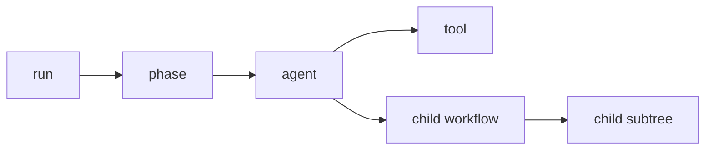

# Observability

Rulvar has exactly one observability surface: a discriminated stream of typed `WorkflowEvent` values. Everything else on this page is a consumer of that stream: `RunHandle.events` and `on()` for host code, the two terminal progress renderers in the umbrella package (`renderProgress` lines and the live `progress` tree), the `@rulvar/cli` TUI, and the OpenTelemetry exporter. There is no pluggable event-sink seam to configure; you subscribe on the handle and fold what you need.

Events are pure telemetry. No event, field, or ordering of events participates in journal identity: you can drop every event and no run outcome changes. That separation is what lets the engine mask secrets in telemetry, re-emit history on resume, and evolve the catalog without ever perturbing replay.

## The event envelope

Every event shares one envelope and adds a `type`-discriminated body:

```ts
type WorkflowEvent = {
  runId: string;
  seq: number;           // per-run telemetry counter, strictly increasing
  ts: string;            // ISO 8601 wall clock; telemetry only, never identity
  spanId: string;
  parentSpanId?: string;
  replayed?: boolean;    // true only on re-emitted journal-backed events
} & WorkflowEventBody;   // CoreEvents | AgentEvents | ToolEvents | AdaptiveEvents
```

Three envelope rules matter in practice:

- `seq` is an independent telemetry counter. It is distinct from the journal's own `seq` and the two must never be compared or joined. Where an event references a journal entry it carries an explicit `entryRef` field holding the journal seq, so you can correlate telemetry with [journal](/guide/journal) entries without guessing. `seq` is strictly increasing across the WHOLE run, resume segments included, but not contiguous: each execution segment starts at a durable per-segment base (recorded in `RunMeta.segments`), so a resumed segment's first event jumps far above the previous segment's last. Treat `seq` as ordered, never as dense, and never parse segment structure out of it.
- `ts` is wall clock and may differ between the live and replayed emission of the same logical event.
- `spanId` values are engine-minted opaque strings, unique per run (across resume segments too; span counters share the same durable per-segment base as `seq`), and are excluded from content keys.

Event names follow one convention: `domain:verb`, all lowercase ASCII (`agent:end`, `spawn:admitted`, `budget:update`). The catalog is closed per minor release; new event types only arrive with a release note. Emitters may add fields, so consumers must tolerate unknown fields and unknown event types.

## Span hierarchy

Spans form a tree per run with a fixed hierarchy:


```mermaid
flowchart LR
    R[run] --> P[phase]
    P --> A[agent]
    A --> T[tool]
    A --> C[child workflow]
    C --> R2[child subtree]
```

The run has a single root span; each `ctx.phase` opens a child span (phases nest); each agent invocation opens a child of the innermost phase span (orchestrator wake turns are agent spans); each tool call opens a child of its agent span; and each child workflow becomes the root of its own subtree under the spawning span. This tree maps one to one onto OpenTelemetry spans via `toOtel` below.

## The event catalog

All four family unions are exported from `@rulvar/core` as `CoreEvents`, `AgentEvents`, `ToolEvents`, and `AdaptiveEvents`, combined as `WorkflowEventBody`.

### Run lifecycle and core telemetry

| Event | Fires when | Notable fields |
|---|---|---|
| `run:start` | The run begins (`resumed: true` on resume). | `workflow`, `resumed` |
| `run:end` | The run settles. | `status`, `totalUsd`, `usageApprox?`, `completion?`, `childStatusCounts?`, `degradedReasons?`, `salvagedPartialChildren?`, `salvagedTerminalOutputChildren?`, `belowFloorOkChildren?`, `acceptanceChildren?`, `semanticPasses?`, `claimConsistencyMeta?`, `synthesisSkipped?`, `deliverableAccepted?`, `resultAvailable?`, `acceptedArtifactRef?`, `rejectedFinishCandidates?`, `settled?`, `envelope` |
| `phase:start` | A `ctx.phase` block opens. | `phase` |
| `log` | The workflow or engine logs a line. | `level`, `msg`, `data?` |
| `budget:update` | Spend or committed reserves changed. | `spentUsd`, `remainingUsd`, `committedReserveUsd` |
| `external:waiting` | The run suspended on `ctx.awaitExternal`. | `key`, `entryRef`, `prompt?`, `deadlineAt?` |
| `approval:pending` | A tool call is suspended awaiting approval. | `toolName`, `entryRef`, `deadlineAt?` |
| `child:start` / `child:end` | A child workflow starts and settles. | `workflow`, `scope`, `status` on end |

Transport status and semantic completeness are different claims, and `run:end` carries both: `status` says whether the run RAN (`'ok'` includes an accepted degraded run), while `completion` (`'complete' | 'partial' | 'rejected'`) and `childStatusCounts` say whether the work is COMPLETE. They surface through the completion envelope contract: a workflow that returns an object result carrying a valid `completion` literal (and optionally a `childStatusCounts` record), or throws a typed error whose `data` carries them, gets both lifted onto `run:end`; the [orchestrator acceptance policy](/guide/orchestration-modes#acceptance-the-child-completion-policy) emits this envelope on every path, including the typed rejection. Malformed shapes stay silently absent (the event is telemetry, never authority), replay recomputes the same values from the re-executed workflow, and the OTel exporter maps them to `rulvar.run.completion` and `rulvar.run.childStatusCounts`. The same lift is mirrored onto the `RunOutcome` that `handle.result` resolves with (`outcome.completion`, `outcome.childStatusCounts`): the engine computes it once and spreads the same object onto both surfaces, so telemetry and the settled outcome can never disagree, and a host that only holds the outcome reads completeness without re-deriving it from workflow-specific shapes. Gate deployments and downstream automation on the (`status`, `completion`) PAIR, never on `status` alone: `status: 'ok'` with `completion: 'partial'` is an accepted degraded run (salvaged children, waived evidence floors), and treating it as a full success is exactly how the twelfth comparison experiment's salvaged below-floor children passed unnoticed. Since RV806 the lift also carries `acceptanceChildren`, the per-child machine roster of the acceptance fold: each spawned child with its settled status, the salvage arm that accepted it (`'partial'` or `'terminal-output'`), and, where the child declared an evidence contract, the evidence verdict (`recordedEntries`, `minEntries`, `met`, with `waivedBySalvage: true` marking a below-floor child a salvage arm accepted anyway), so "how many entries did the salvaged children actually record" is a field read, not a transcript dig; `rulvar inspect` prints the same roster from the journaled acceptance decision. Since RV1412 the ok children are held to the same honesty: a child that settled `ok` BELOW its declared evidence floor no longer hides behind a clean headline. Its shortfall is a degradation note by default (so `completion` reads `'partial'`, never `'complete'` over an unmet declared contract), the lift carries `belowFloorOkChildren` naming such children machine-readably, and under `acceptance.requireEvidenceFloor` the same flag that binds the salvage arms also excludes them from the policy count (`'all-ok'` rejects, `{ minSuccessful: N }` does not count them), with `floorRequired: true` on their roster rows. Since RV1906 the lift also carries `semanticPasses`, the explicit `{ran, reason?}` triple for the contradiction pass, the claim-consistency pass and the synthesis invocation: `ran: true` means the pass executed (its findings and meta fields carry the details), `ran: false` names why nothing looked (`'not-configured'`, `'run-rejected'`, `'valid-draft'`, `'not-run'`), so an absent findings field can never be read as a clean pass. The twenty-first benchmark's artifacts carried `contradictions: null` and `claimConsistencyMeta: null`, and the judge had to annotate by hand that null meant NOT RUN. Since RV2203 the same lift carries `claimConsistencyMeta` itself (`judgeInvoked`, `judgeDeclined`, the pair counts) and the `synthesisSkipped` marker, and it holds on EVERY terminal, failed ones included: the RV2106 mirror run journaled its declined judge and the error terminal still read null, and the seventh subscription parity resume settled exhausted with `completion: null` over a journaled accepted acceptance, because the exhausted path lifted only from the value and its enriched error data was never read. The orchestrator now enriches every synthesis-path failure (the budget class preserved, so `exhausted` stays `exhausted`) with the acceptance facts, the claim meta, and the pass summaries, and the lift falls back to the error data on the exhausted path, so the journal is no longer the only place the truth lives.

Since v1.79 the same lift carries the degradation facts the acceptance envelope has always emitted beside them: `degradedReasons` (per-child notes such as `child X settled 'limit' after the finalization reserve summary`) and the salvage lists `salvagedPartialChildren` and `salvagedTerminalOutputChildren`, validated as string arrays under the same posture (an empty array is the workflow's claim of zero degradation, absence means no claim, malformed shapes drop silently) and mapped by the OTel exporter to `rulvar.run.degradedReasons` and the matching salvage attributes. The fifth experiment's error outcome carried these facts only inside `error.data`, so the harness serialized empty top level arrays while the truth sat one level deeper; the mirror ends that dig on both the accepted and the rejected path.

One field deliberately stays OFF that lift: `contradictions`, what [the bounded contradiction pass](/guide/orchestration-modes#the-bounded-contradiction-pass) found (RV1302). It rides the orchestrator's own returned envelope (so `outcome.value.contradictions` on an accepted run), naming each cited location two different children read differently, the disputed key, every reading, and who reported it. It is not lifted onto `run:end`, because the lift carries the facts a deployment gate reads and these are diagnostic: a run that must GATE on the pool agreeing configures `onFound: 'fail'`, which fails typed before the synthesis dispatch instead of leaving the check to a reader. Read the field the way the pass writes it: an EMPTY list is a fact (the pass ran and the pool agreed), an ABSENT field is a different fact (nothing looked), the same absence doctrine the terminal envelope's `provenance` marker pins below. The findings are bounded by the configured `max`, so the field never grows with the pool, and the sibling `contradictionsMeta` (RV1404) keeps the bound honest: `poolChildren` says how many accepted children the pass actually judged, and `truncated: true` says more contradictions existed than `max` allowed to report, so a capped list can never read as a complete one.

One more claim rides the terminal event since RV907: `settled`. It is present, and always `false`, ONLY when nothing durable records the terminal: a settlement write failed (the `run_settle` journal append or the terminal `RunMeta` projection, see [durability](/guide/durability#auditing-and-reconciling-the-meta-projection)), or the segment was superseded, which the distinct `settledReason: 'superseded'` names (RV1009: the settle append bounced off the store's fence because a successor owns settlement, `handle.result` rejects with the typed `SupersededError`, the progress line says `superseded; the successor owns settlement` instead of the resume hint, and the OTel exporter stamps `rulvar.run.settled_reason`). On a settlement write failure the `status` on the event is true as computation, but nothing durable records it, and `handle.result` rejects with the typed `SettlementError` instead of resolving. An event-only consumer must treat such a terminal as NOT green, whatever the status literal says: the CLI progress line appends `settled=false (outcome withheld; resume re-settles)`, and the OTel exporter stamps `rulvar.run.settled: false` and refuses the OK span status. The warn log (`settlement write failed`) precedes the event, and the throw follows it, so the stream stays ordered warn, then the marked terminal, then the rejection. Resuming the run over a healed store re-settles by replay with zero paid calls, and that settled terminal carries no `settled` field, byte for byte like every ordinary run.

### The unified terminal envelope {#the-terminal-envelope}

Since RV1105 every terminal fact travels in ONE exported shape, `TerminalEnvelope`: the run identity (`runId`, `workflow`), the computed `status`, the typed `error` when there is one, the `completion` claim when the workflow made one, `settled` with the optional `settledReason: 'superseded'`, the money (`totalUsd`, `grossUsd`, `costBasis`, and `costByModel`, the per-model split detached from the cost report; `costBasis: 'locally-estimated'` is the RV1413 provenance marker, stamped at the one producer, saying these dollars are journaled usage priced at the CALLER'S pricing table, never a provider statement, the same declared basis `CostReport.basis` carries), the `usage` aggregate, `usageApprox` normalized to a boolean (the sibling `run:end` field keeps its absent-means-exact byte contract), and `agentsSpawned`. The engine assembles it once at the settlement chokepoint (`terminalEnvelopeOf`, exported) after the settlement verdict is known, and every surface carries THAT object: the resolved outcome (`outcome.envelope`, always `settled: true` there, because an unsettled terminal rejects `handle.result` typed instead of resolving), the `run:end` event (`event.envelope`, where the `settled: false` envelopes live), the server's run status response (`GET /runs/:id` includes `envelope` verbatim), and the OTel exporter (`rulvar.run.total_usd`, `rulvar.run.agents_spawned` beside the existing settled attributes). An SDK consumer, an event-only consumer, and an HTTP consumer read the same set of facts without assembling pieces from surface-specific fields, and the surfaces cannot disagree by construction. Nothing pre-existing was renamed: the envelope is an assembly over fields that all remain. The envelope is a DETACHED reading throughout: `costByModel` was always a copy, and since RV1213 the typed `error` is one too, its `data` nesting included, so a consumer that annotates the error it holds (a message rewrite, a field for its own pipeline) can never reach back into the outcome the engine still owns.

Since RV1106 that agreement is conformance-tested, not just constructed: one truth table drives every terminal path (`ok`, `error`, `exhausted`, `cancelled`, and the superseded refusal) on the real engine and checks the same facts on every surface, so a future field that reaches one surface and misses another is a red test, and the table is the anchor new terminal facts extend. The suite also pins the surface honesty rules: `handle.result` rejects typed on an unsettled terminal (an envelope never resolves there), `GET /runs/:id` serves the typed wire error for a segment that rejected (the `settled: false` envelopes exist only on the event stream), and `toOtel` completes its export over every terminal path, the rejecting ones included, since RV1106: a rejecting `result` never fails an export the stream already completed, it only marks a leftover span with the refusal instead of green.

Since RV1209 the envelope survives the process that produced it. A run this server never held (a restart, a second replica, a run another worker owns) used to answer `GET /runs/:id` with a bare status projection while a live consumer read the whole envelope, so the durability story stopped one surface short of the one a host reads after a redeploy. The non-live response now carries `envelope` too, rebuilt from the journal through the SAME producer (`persistedTerminalEnvelope`, exported) and marked `provenance: 'journal'`: the verdict comes from the journaled run settle (the authority, not the meta projection), the money from the same composed pin fold `GET /runs/:id/cost` runs, and the usage and `agentsSpawned` from the same ledger fold the resume budget seed uses, so a restarted reader reports the dollars the run settled at rather than today's rates. The `completion` claim survives the rebuild exactly when the settle recorded the semantic lift beside its output digest (the persisted-terminal tail): the digest proves WHICH value settled, the recorded lift says what the workflow CLAIMED about it, and the rebuilt envelope reads the claim back instead of re-deriving it from a value the journal only digests; a settle written before the lift rode it stays absent. `error` remains deliberately ABSENT there (the run's terminal wire error is the thrown error's projection, never journaled as the run's own), and the marker is what makes absence honest: on a rebuilt envelope an absent field means NOT RECORDED, never "the workflow claimed nothing" or "the run did not fail"; a live envelope carries no `provenance` at all, the historical byte contract, and there absence keeps its original meaning. Where nothing durable records a terminal, the body carries a typed `terminalUnavailable: { reason, message }` instead of an envelope, with `reason` one of `unsettled` (no journaled settle: a run still in flight elsewhere, a segment a successor fenced out, or a settlement write that failed), `not-terminal` (the settle is not the journal's last word: it records a running segment, or entries continued PAST it (RV1407): a detached resolution awaiting its resume, or a successor segment over a stale settle, exactly the evidence `auditRun` derives a non-terminal status from, so the persisted surface and the audit read one journal one way), or `unknown-workflow` (nothing names the workflow the terminal belongs to). It is its own field, never `error`, because `error` on that body means the RUN failed. The conformance table drives every row through a restarted server as its final surface, so the persisted reading is pinned against the live one path by path.

### The terminal contract for consumers {#the-terminal-contract-for-consumers}

Everything above hands a consumer FACTS; none of it hands them PERMISSION. The terminal vocabulary is three independent claims, and each answers exactly one question. `status` is transport: whether the run RAN to a settle (`'ok'` includes accepted degraded runs). `completion` is the WORK'S own claim: whether the work is complete (`'partial'` names accepted degradation, and since RV1412 an ok child below its declared evidence floor makes the claim `'partial'` instead of hiding). The acceptance verdict is a POLICY over child statuses, journaled with its roster, evidence verdicts, and salvage lists. Not one of these, alone or together, authorizes a side effect (RV1414).

The rule to build on: an effect DURING the run belongs to a tool, behind the [permission chain and approvals](/guide/tools#the-permission-chain), where the authorization is journaled beside the effect it authorized. An effect AFTER the run (deploy what the run produced, merge the branch, send the report, bill a customer) belongs to the consumer's OWN policy over the terminal facts, and that policy should read them the way the engine writes them:

- Gate on the (`status`, `completion`) PAIR plus the fields your deployment cares about (`degradedReasons`, `belowFloorOkChildren`, `acceptanceChildren` evidence verdicts, `contradictions` where configured), never on `status` alone, and never on the result text's own confidence.
- When the envelope carries `claimConsistencyMeta`, read its `coverage` grade (RV1702), never the findings array alone: `[]` findings beside `coverage: 'partial'` means the judge cleared a bounded subset (the eighteenth comparison benchmark's `[]` stood over 40 of 144 citing sentences), `'critical-uncovered'` means claims the caller declared critical went unjudged, `'judge-failed'` means nothing was judged at all; only `'full'` says every citing sentence was judged. Two more words close the readings that used to hide inside `'full'` (RV2508): `'judge-declined'` means the judge was refused ADMISSION and never dispatched (the RV2106 degradation), so nothing was judged for a reason the counts cannot show, and `'vacuous'` means the draft carried no citing sentence, so a configured pass verified nothing at all; a zero denominator used to grade `'full'`, the strongest word in the vocabulary standing over an empty set. The pure `claimCoverageOf` grades a meta persisted before the field shipped.
- Read the settled authority, not a cached claim: after a restart or across processes, `GET /runs/:id` serves the journal-rebuilt envelope (`provenance: 'journal'`) or a typed `terminalUnavailable` refusal; a refusal (`unsettled`, `not-terminal`) means there is NO settled terminal to act on, however green the last envelope you held looked. `auditRun` reads the same evidence, so repair and reporting cannot disagree with the surface you gated on.
- Treat the money as what `costBasis` declares: `'locally-estimated'` dollars are the caller's pricing table over journaled usage, a management figure, not an invoice; reconciliation against what the provider actually billed goes through the [invoice export](#the-invoice-export) and `reconcileStatement`, which carry their own provenance and refuse what they cannot prove.
- Absence is a fact with a meaning: an absent `completion` means no claim was made (gate as if incomplete, not as if complete), an absent `contradictions` field means nothing looked, and on a `provenance: 'journal'` envelope an absent `error` (or an absent `completion` under a pre-lift settle) means NOT RECORDED. Read the absence doctrine of each field before treating missing as clean.
- The same fields hold on FAILED terminals (RV2203): an exhausted or errored run still carries the acceptance facts, `claimConsistencyMeta`, and `synthesisSkipped` when the run earned them, lifted from the enriched error data, so a post-mortem policy reads the run's terminal truth from the outcome instead of re-deriving it from the journal. On engines that predate the lift, a failed terminal's `null` there means NOT MIRRORED, not "did not happen": the journal stays the authority.
- Ask about the DELIVERABLE separately from the work (RV2506). `completion` is the acceptance policy's claim over CHILD statuses; it says nothing about whether the artifact the terminal carries ever passed the finish contract. The twenty-fifth comparison run accepted four ok children, failed its synthesis against the same bundle three times, and settled carrying nothing the contract accepted, and the scoring harness read `status: 'ok'` and could not tell. Three lifted fields answer it directly: `deliverableAccepted` (the contract's verdict on THIS artifact), `resultAvailable` (whether there is an artifact to read at all), and `acceptedArtifactRef` (the journal seq of the decision that records the acceptance, so the validators and the draft hash behind it are one `rulvar inspect` away). `deliverableAccepted` is ABSENT, never false, when no `finishValidation` was declared: nothing judged anything.

- On a RESUMED run, know what each figure counts (RV2510). Some terminal numbers are cumulative over the whole logical run (money and usage fold from the journal; the spawn count resumes from the journaled ledger), and some count only the segment that produced the terminal (`cost.orchestrator.wakes`, the schema-exchange counters, the transport retries). The twenty-fifth comparison run was killed and resumed, and reconciling its two terminals into one honest account was hand work over a joined journal. `TERMINAL_TELEMETRY_SCOPE` is the exported table: every terminal field mapped to `'segment'`, `'cumulative'`, or `'terminal'` (not a count, a claim about the run as it stands), and a doctrine test holds it against the keys a real outcome carries, so a new field cannot ship without declaring what it counts. `logicalRunTelemetry(entries)` is the fold for the whole run: how many segments ran, how each settled, how many entries each one APPENDED (a partition of the journal at the settle boundaries, so no entry is counted twice by construction), and `entriesAfterLastSettle`, nonzero when the journal continued past its terminal so the last status is not the run's last word. It reads journals from every prior version, because it adds no field and folds only what the settle already records. It deliberately carries no money and no usage: those fold from the whole journal already, and re-summing them per segment would count every replayed operation once per segment that replayed it. The two readings compose; the scope table is what tells you which one to reach for.
- Ask WHICH document a semantic verdict read (RV2509). The claim-consistency pass runs before the synthesis by design, so that a draft contradicting its own pool never pays for a composition; under the default it therefore describes the DRAFT, and the synthesis rewrites it. Every meta now says so: `judgedStage` (`'draft'` or `'final'`) and `judgedHash`, the sha256 of what it read. The envelope's `draftToFinal` carries `draftHash`, `finalHash`, and `rewritten`, so `claimConsistencyMeta.judgedHash === draftToFinal.finalHash` is the machine test for "this verdict is about the document I received". `claimConsistency.stage` moves or duplicates the gate: `'final'` judges the artifact the run settles on, `'both'` keeps the cheap pre-synthesis gate and adds a second judge over the composition, reporting the final pass in `claimConsistencyMeta` (the shipped document is what a consumer gates on) and the earlier one in `claimConsistencyDraftMeta`.
- Read what the contract REFUSED, not only what it accepted (RV2507). `rejectedFinishCandidates` carries every finish candidate the declared contract did not accept, in judgement order: the `callId`, the `verdict` (`'repair'` when another turn was granted, `'rejected'` when it was the last), the sha256 `hash` that names WHICH document drew the verdict, its size in `chars`, and the `failed` validator diffs. It rides the ok terminal as well as the failed one, because a run that recovered on its second attempt still owes a post-mortem the first, and it is absent when a finish passed first try. One reading it makes possible was invisible before: three rows with ONE hash is the model serving the same document three times, a different failure from three genuine attempts, and the twenty-fifth comparison run's three rejected syntheses were reachable only through an external script that re-parsed the whole agent transcript. The bytes are a separate, declared decision: `finishValidation.retainRejectedCandidates` writes each rejected candidate to its own transcript blob under the run's prefix (so `Engine.deleteRun` cascades over it) and puts the `ref` on the row, one `transcripts.get` from the document. Turn it on for evaluation and comparison runs; without it the rows still identify, size, and explain every rejection.

#### The deliverable truth table {#the-deliverable-truth-table}

Every reading a consumer can meet, and what each one licenses. `settled: false` (RV907, RV1009) overrides every row: nothing durable records that terminal, so there is nothing to act on however green it reads.

| `status` | `completion` | `resultAvailable` | `deliverableAccepted` | What happened | Act on the artifact |
| --- | --- | --- | --- | --- | --- |
| `ok` | `complete` | `true` | `true` | The children were accepted and the finish contract accepted the artifact. | Yes, this is the only fully green row |
| `ok` | `partial` | `true` | `true` | Accepted degradation (salvaged children, a waived evidence floor) under an artifact the contract accepted. | Only under a policy that names the degradation it tolerates |
| `ok` | `complete` | `true` | `false` | The child roster passed; the artifact did NOT pass the contract. The run settled on unvalidated output (`orchestrator_synthesis_fallback`) or on a draft carried past its gaps. | No |
| `ok` | `complete` | `true` | absent | No finish contract was declared, so nothing judged the artifact. | Only where your own policy is the judge |
| `ok` | any | `false` | any | The run settled with no artifact (a synthesis that resolved null). | No, there is nothing to act on |
| `error` | `complete` | `false` | `false` | The acceptance verdict passed and the finish then failed the contract, or the synthesis died: the enriched failure carries the acceptance facts. | No |
| `exhausted` | `complete` | `false` | `false` | Same shape, the money ran out in the tail; `acceptanceChildren` still names what the children produced. | No, but the children's work is salvageable |
| `error` | absent | absent | absent | Nothing reached the envelope. Read `error.data.source` for which gate refused. | No |

The normative predicate, in the fields above rather than in prose:

```ts
const deliverableUsable = (outcome: RunOutcome<unknown>): boolean =>
  outcome.envelope.settled === true &&
  outcome.status === 'ok' &&
  outcome.completion === 'complete' &&
  outcome.resultAvailable === true &&
  outcome.deliverableAccepted === true;
```

Note the last conjunct is `=== true`, not `!== false`: a deployment that requires a judged deliverable must DECLARE `finishValidation`, because absence is the honest answer of a run where nothing judged anything, and treating it as permission is the same mistake as reading `status: 'ok'` alone. A deployment that judges the artifact itself drops that conjunct deliberately, having decided who the judge is.

The shortest form: the engine proves what happened and what it cost; whether that earns an effect is a decision the consumer must make with its own policy, and every field above exists so that policy has honest inputs.

### Agent lifecycle

| Event | Fires when | Notable fields |
|---|---|---|
| `agent:queued` | A spawn is admitted and waiting on the scheduler. | `agentType`, `label?` |
| `agent:start` | The logical agent dispatch begins; exactly one per span. | `model`, `role` |
| `agent:phase:start` | One model invocation phase activates inside the span (`loop`, `summarize`, `finalize`, `extract`). | `role`, `model`, `invocation` |
| `agent:phase:end` | That activation settles, with its own slice of the money. | `role`, `model`, `invocation`, `durationMs`, `usage`, `costUsd`, `costBasis?`, `outcome`, `retries?` |
| `agent:end` | The agent settles; the one event that carries the whole total. | `status`, `usage`, `costUsd`, `costBasis?`, `entryRef`, `usageApprox?`, `retryCount?`, `exploration?` |
| `agent:error` | A live attempt failed. | `error` (a wire error), `willRetry` |
| `quota:denied` | The shared limiter denied a window pre-wire and the dispatch will retry (RV1810). | `model?`, `reason?`, `retryAfterMs?`, `willRetry` |
| `budget:exposure-wait` | The in-flight exposure cap refused an orchestrate-owned root turn pre-wire; `willWait: true` parks until a live hold releases, `willWait: false` names the drained arm settling the forced-finish partial (RV1902). | `model?`, `capUsd?`, `spentUsd?`, `inFlightUsd?`, `estimateUsd?`, `willWait` |
| `agent:schema-retry` | Structured output failed validation and is being retried. | `attempt`, `maxAttempts` |
| `agent:stream` | A token delta arrived; only for calls that opt into streaming. | `delta` |

`agent:stream` deltas are never journaled and never re-emitted on replay. Note the asymmetry with errors: `agent:error` reports a live attempt failing right now, while a memoized error outcome coming back from the journal surfaces as a replayed `agent:end` with status `'error'`.

#### Throttling is not failure {#throttling-is-not-failure}

A recoverable pre-wire quota wait speaks its own event type (RV1810). The twentieth comparison benchmark's run emitted 13 `agent:error` events that were ALL healthy token-window waits: the run completed clean, with zero provider error rows and zero transport retries, yet any alert keyed to the event TYPE read a failing run. `quota:denied` now carries those waits (the denied model, the limiter's reason, `retryAfterMs` when the window named one, `willRetry: true` always); the denial produced no provider attempt, no ledger row, and no transport retry, and the aggregates (`quotaDenials` on `agent:end` and on the result) fold it exactly as before. Terminal denial exhaustion (the per-target `quota.maxDenials` budget spent) still ends in the real `agent:error` it always did, so failure alerting keeps its signal. Consumers still keyed to the old shape restore the legacy twin with `createEngine({ telemetry: { quotaDeniedAgentError: true } })`, the versioned compat posture.

The same vocabulary rule covers exposure backpressure (RV1902): `budget:exposure-wait` names an orchestrate root turn parked on the in-flight exposure cap, healthy waiting with zero provider attempts, where the twenty-first benchmark's recovery arm instead settled a premature `exhausted`. Alert on `willWait: false` (the drained arm, a genuine terminal that settles the forced-finish partial), never on the event type alone.

Three neighboring vocabulary notes the same benchmark asked for. `CostReport.orchestrator.wakes` counts durable `wait_for_events` wake suspensions, NOT progressive `await_any` completions: a fully progressive run honestly reads `wakes: 0`, and the await cadence is read from the `tool:start`/`tool:end` events of the await tools. Internal root work (the coordination draft, the claim judge, the synthesis) deliberately reports under `byRole` (`orchestrate`, `synthesize`, `extract`), while `byAgentType` and `byPhase` keep their honest empty-string buckets for it: the root has no agent type, `byPhase` buckets are user `ctx.phase` blocks, and wrapping engine stages in synthetic phases would move journal bytes and re-key resumed runs, so the split lives where it already exists. And `tool:end` failures carry a structured `errorCode` (RV1807), so a not-settled child read never needs the private transcript to classify.

#### The invocation model

One agent dispatch emits exactly ONE `agent:start`/`agent:end` pair on its span, and every model invocation phase inside it (the tool loop itself, each mid-loop compaction, the finalize synthesis, the separate extract) emits its own paired `agent:phase:start`/`agent:phase:end`, keyed by `(spanId, invocation)` with a 1-based activation ordinal. That makes durations, per-phase usage, and attempts derivable without heuristics: pair the events, subtract the timestamps, sum the phases. Before this contract every phase emitted an extra unpaired `agent:start`, so a consumer pairing starts with the single end read the LAST phase's duration as the agent's and a starts-minus-ends gauge leaked one running agent per phase.

The per-phase `usage` is the delta the activation added to its `(role, model)` slice, so the phase pairs sum exactly to `agent:end`'s totals and to the journaled `usageByModel` split the [CostReport](#costreport) folds. Since RV702 `costUsd` is folded per provider request, exactly like the settled CostReport and invoice (RV504): each recorded call is priced individually and the phase carries the delta of that per-call accumulator, so a nonlinear long-context tier fires per REQUEST in the live stream too, never on a phase aggregate no single request produced (the eleventh comparison experiment measured a 60.2% raw overcount from exactly that inflation). Every money-bearing event says which fold produced its number: `costBasis: 'per-call'` is the settled fold's own basis; `'aggregate-estimate'` appears only where per-request records cannot cover the number (a checkpoint written before the reconciliation ledger shipped restores usage without call records, and the invocation total then keeps the aggregate-priced figure, labeled, rather than silently dropping restored spend), and an absent field on a stream recorded before RV702 means the aggregate basis. `retries` on a phase pair and `retryCount` on `agent:end` count transport retries; both are live telemetry only, never journaled, so replayed events omit them and absence means "zero or unknown". The retry namespaces never conflate (RV1510): `quotaDenials` on the full agent result and on `agent:end` counts PRE-WIRE quota-limiter denials, split by dimension (`requests` versus `tokens`, classified by the limiter's own reason) with the loop's recovered-episode count, and a denial never reached the provider and never billed; `transportRetries`/`retryCount` count provider retry attempts that DID dispatch; the journaled `providerCalls` records carry the wire cardinality itself (every HTTP request, failed attempts included), which is what the invoice export sums. The seventeenth comparison benchmark exported one conflated number and 17 pre-wire denials read as 17 API retries; RV1510 named the four surfaces, and the eighteenth benchmark then caught the counters still leaking live (21 denials exported as `retryCount` 21 over an invoice with zero provider error rows, and post-denial success records reading `attempt` 2 with no attempt-1 sibling), so RV1601 enforces the promise mechanically: a denied turn increments only the denial namespaces, `ProviderCallRecord.attempt` counts dispatched tries only, and denials retry against their own `quota.maxDenials` budget (default 8 per serving target) instead of consuming `RetryPolicy.attempts`. A summarize that fires three times gets three pairs, interleaved inside the still-open loop phase (phases are activations, not strictly nested spans; the `invocation` ordinal disambiguates).

`reduceInvocationTable(events)` (exported from `@rulvar/core`) is the official reducer over this vocabulary: it builds the per-agent, per-phase table (durations, usage, cost, retries, open flags for truncated streams) plus a per-role aggregate that matches `CostReport.byRole` without any pairing heuristics. Every row and every `byRole` bucket carries `costBasis` (RV702): a bucket stays `'per-call'` only while every folded pair carried the per-call basis, one aggregate-estimate pair degrades it, and an event without the field reduces to `'aggregate-estimate'`, never to a per-call claim the stream cannot back. A live stream and its replay reduce to identical usage and cost columns: replayed phase pairs are reconstructed from the terminal entry's recorded slices, each pair carrying its `(role, model)` share of the same per-request billing fold the invoice runs (`durationMs` 0).

`reduceCriticalPath(events)` folds the same vocabulary into the run's critical-path summary: run wall, the post-fan-in interval (the last settled non-coordination agent to `run:end`), the summed wall of `synthesize` spans, and the corresponding shares, so the improvement plan's gate (post-fan-in synthesis at most 40% of wall time) is one field read instead of hand-rolled timestamp arithmetic, and the [benchmark kit](/guide/evals#the-benchmark-kit) can expose any of these as a metric extractor. The `synthesize` wall is split by purpose since RV1604, because the claim-consistency judge rides the same role and one number conflated them: the eighteenth comparison benchmark's harness had to annotate a 54-second `synthesisMs` by hand, because the run had SKIPPED synthesis (`synthesis_skipped_by_valid_draft`) and the bucket was entirely the judge and its extract phase. `finalCompositionMs` is every synthesize span that is not the judge; `semanticJudgeMs` is the judge (its spans dispatch under the exported `CLAIM_JUDGE_LABEL`, which is how the reducer tells them apart); `synthesisMs` stays their exact sum for existing consumers, and the same three fields appear clipped inside `postFanIn`. Wall numbers are live fidelity: a replayed stream re-stamps emission times, so its intervals are degenerate, exactly like phase durations; absent pieces (no `run:end` yet, no worker spans) stay `undefined` instead of guessed at.

Whenever the post-fan-in interval exists, `postFanIn` decomposes it (RV710) from the same events, no new types: the eleventh comparison experiment measured 45.5% of wall sitting after fan-in with a zero synthesis share and nothing to name it. `coordinationModelMs` is the model activations of coordination spans (the draft and repair thinking) clipped to the window; `coordinationToolMsByName` is their tool executions by name, so child-result pagination shows up under `get_child_result`/`get_child_artifact`, the finish exchanges (host validators run inside the finish tool's measured window) under `finish`, and the park-to-wake tail of an awaiting coordinator under its await tool; `synthesisMs` is the `synthesize` span wall clipped the same way; `coveredMs` is the exact interval union (buckets are clipped sums, so a clock-skew overlap can double-count a bucket but never shrink the residue); `residueMs`/`residueShare` is what no recorded interval covers: scheduling gaps, journal writes, wake latency. The residue is fixed-size overhead while the covered buckets scale with work, so on real runs the decomposition accounts for the window to within a few percent, and the optimization target is assigned AFTER these numbers exist, not before (doctrine 10).

Since RV1211 the model bucket is itself profiled, because one number for it could not survive the sixteenth comparison experiment: 222.6 seconds (50.9% of wall) landed there with a zero synthesis share, and nothing said whether the coordinator was drafting, compacting, or waiting on its own tools. `coordinationModelMsByPhase` splits the bucket by the ACTIVATION's own invocation role (`orchestrate` for drafting and repair turns, `summarize` for a compaction pass, `extract` for a schema pass), and the values sum to `coordinationModelMs` exactly. `coordinationModelOnlyMs` is the coordinator's thinking time with the tool executions NESTED inside its activations removed: `coordinationModelMs` is activation wall, a tool the activation called runs inside that wall, and reading the first as thinking time overstates it by exactly the second. It is the set difference of the two clipped unions, never a subtraction of sums, so overlapping activations can never drive it negative. `coordinationToolCallsByName` counts the executions beside their milliseconds, under the same touch-the-window rule, because one slow pagination and twenty fast ones are the same number of milliseconds and a completely different tail; a coordinator that calls one tool per turn reads its turn profile straight off that record.

One targeting rule the subscription parity series settled (RV2210): `postFanInShare` is the right gate only when worker settle times SPREAD. Progressive fan-in works by overlapping the coordinator's draft with children still running, so its maximum win is bounded by the settle spread itself; on a profile whose workers settle in a CLUSTER, the share barely moves whatever the coordinator does. The series' first accepted dossier ran 57.5% share with a fully mandated progressive draft and all four workers settling inside 3.8 minutes of a 28.8 minute run: the overlap ceiling was ~13 share points, so a below-40% share target was unreachable by coordination discipline alone, and the next accepted run compressed the root's post-fan-in model time by 45% while the share stayed at 58.8% because the wall shrank with it. On clustered-settle profiles, target the ABSOLUTES the decomposition already names, `postFanIn.coordinationModelMs` and `finalCompositionMs`, and treat the share as descriptive; keep the share gate for spread-settle profiles, where overlap has room to pay. A worked baseline from that series, one accepted dossier per row (share, window, final composition, judge): 57.5% / 992.9 s / 275.6 s / 27.1 s, then 58.8% / 730.4 s / 328.3 s / 21.5 s, then 54.8% / 706.9 s / 308.8 s / 23.2 s, then 48.5% / 747.9 s / 236.9 s / 13.2 s: the share wanders while the absolutes move with the actual levers.

Token accounting semantics, so the numbers read correctly: `cacheReadTokens` and `cacheWriteTokens` are SUBSETS of `inputTokens` (the Usage invariant; pricing bills uncached input as `inputTokens` minus both cache counts, each cache class at its own rate), and `reasoningTokens`, when present, is a subset of `outputTokens` (the adapters normalize it from the provider's output-token details) that is informational only: `outputTokens` is priced whole and reasoning is never billed on top.

### Tool lifecycle

| Event | Fires when | Notable fields |
|---|---|---|
| `tool:start` | A tool call dispatches. | `toolName`, `toolCallId?`, `risk?` |
| `tool:end` | The tool call settles. | `outcome` (`'ok'`, `'error'`, `'denied'`), `toolCallId?`, `durationMs`, plus the permission audit fields `verdict?`, `decidedBy?`, `rule?`, `advisory?`, and `guard?` when an exploration guard denied the call |

Both tool events name their call since RV908: `toolCallId` is the model-minted id the journal's messages and tool-result parts have always carried, so a consumer pairs each start with ITS end exactly, even among concurrent same-name calls, instead of guessing by order. It rides every live event and every replayed reconstruction (whose events exist only when the turn checkpoint blob is retrievable; the id comes from the checkpoint's tool-result parts, so journals written before RV908 name their calls there too), and is absent only on streams recorded before RV908 or written by foreign emitters, where consumers keep their historical pairing. The audit fields on `tool:end` record which layer of the permission chain decided and which rule matched; see [Tools](/guide/tools). A `tool:end` carrying `guard: 'repeated-signature'` was denied by the [exploration guards](/guide/agents#exploration-guards), not the permission chain, and was never dispatched. The `exploration` summary on `agent:end` carries the guard counters (`toolCallsUsed`, `distinctSignatures`, `repeatedCalls`, `duplicateResultCalls`, `deniedRepeats`, `byTool`): present live whenever any exploration limit was configured, and on replay only when the guard abort journaled it. The OTel exporter maps the summary to `rulvar.exploration.*` span attributes and the guard marker to `rulvar.tool.guard`.

### Determinism detection

| Event | Fires when | Notable fields |
|---|---|---|
| `determinism:warning` | A bare `Date.now()` or `Math.random()` call was observed inside the run, classified workflow-origin or allowlisted. | `category` (`'bare-date-now'`, `'bare-math-random'`), `provenance` (`'workflow'`, `'allowlisted'`), `frame`, `file?`, `line?`, `column?` |

Emitted live, at most once per `(category, provenance)` per execution segment, and never journaled; because replay re-executes the body, a violation still in the code fires again on every replay, so the event appears in replayed streams organically (without the `replayed` flag). Installed dependencies and Node runtime frames are classified exempt and emit nothing. Under `determinism.mode: 'error'` a workflow-origin call additionally rejects the run with a typed `DeterminismError`; see [Runtime detection and enforcement](/guide/determinism#runtime-detection-and-enforcement).

### Adaptive orchestration, plan, and accounting events

These fire only in runs where the corresponding machinery is active (see [Adaptive orchestration](/guide/adaptive-orchestration) and [Orchestration modes](/guide/orchestration-modes)):

| Event | Fires when |
|---|---|
| `plan:revised` | A plan revision applied; carries `planHash`, applied and dropped operation counts, and `revisionUnitsRemaining`. |
| `node:parked` / `node:cancelled` | A plan node was parked or cancelled. |
| `node:linked` | A re-added task was linked to a completed donor subtree; `reclaimedUsd` is the spend recovered by reuse. |
| `orchestrator:woke` | An orchestrator wake turn started; `renderSize` is the rendered digest size. |
| `orchestrator:budget` | The orchestrator sub-account moved. Each wake digest emits `atCap` plus the digest's budget block (`runSpentUsd`, `runCeilingUsd`, `orchestratorSpentUsd`, `orchestratorCapUsd`, `finalizeReserveUsd`, `orchestratorShare`, `softWarning`); the at-cap freeze emits `atCap: true` with `spentUsd`, `capUsd`, and `finalizeReserveUsd`. |
| `orchestrator:acceptance` | The acceptance verdict, fresh and on the resume roll-forward alike (RV1906): `verdict`, `completion`, `childStatusCounts`, and the roster floor when declared. The four-role benchmark's stream read a root `agent:end` ok followed by a `run:end` error with nothing between them naming the policy fold; this event is that name. |
| `escalation:raised` / `escalation:decided` | A worker escalated and the decision landed (`retry`, `decompose`, `cancel`, or `accept`). |
| `spawn:admitted` | Admission admitted a spawn, on EVERY admission boundary: the orchestrator spawn tools, PlanRunner's journal-embedded admissions (decomposition, ladder respawns, reuse and graft links), `ctx.workflow` children, and `ctx.agent` lineage admissions (declared `lineage`/`approach`). Carries the journaled decision `entryRef`, the admitting `verdict` arm, `agentType`, `logicalTaskId`, and `spawnUnitsAfter` (absent on `ctx.agent` lineage admissions, whose spawn-unit debit rides the dispatch itself). A journal-recovered decision re-announces with `replayed: true`; a cleanly replayed dispatch does not re-announce at all. |
| `spawn:rejected` | Admission rejected a spawn, on the same boundaries as `spawn:admitted`; carries the rejection `code`, `agentType`, and the journaled decision `entryRef` (absent for pre-admission config gates such as `orchestrate` `maxSpawns`, which reject before anything is journaled). A recovered rejection re-issues with `replayed: true` when it takes effect. The caller still sees the typed `AdmissionRejectedError`. |
| `verify:failed` | A verification gate (mechanical, judge, or spot-check) failed a rung attempt. |
| `ledger:op` | A run-ledger write (brief, fact, lesson, observation). |
| `stall:detected` | A logical task's no-progress streak advanced. |
| `guard:oscillation` | The oscillation guard tripped on a repeated spawn key. |
| `resolution:applied` / `resolution:superseded` | A live resolution attempt won the first-closing-wins fold (`targetRef`, the appended attempt's `entryRef`, `by`), or lost to an earlier close (`supersededBy`, `reason`). Emitted for live attempts only; folds of prior entries at resume re-emit nothing. |
| `termination:debit` / `termination:denied` | A termination counter was debited, or a request was refused because a counter ran out. |
| `termination:config-drift` | A resumed run's live limits differ from the frozen ones. |
| `journal:compat` | Declared in the event union but not yet emitted: loading a journal outside the engine's hash-version window throws `JournalCompatibilityError` instead; see [Journal compatibility](/guide/journal-compatibility). |

## Subscribing from the host

`engine.run` returns a `RunHandle` immediately. The two subscription forms differ in where their stream begins:

- `handle.events` is **gapless from handle creation**: the engine buffers every event from the moment the handle exists, so a consumer that starts iterating late (even after `await result`) still receives the complete stream, in `seq` order. Draining a large backlog is linear in its size.
- `handle.on(type, cb)` observes **from registration onward**: events emitted before the callback was registered are not re-delivered. Register before awaiting `result` if you need the early events on this form.

The gapless buffer is also the memory contract: the engine holds the run's undelivered events as long as the handle is reachable and the stream has not been consumed. Consume `handle.events` (or drop every reference to the handle) to release them; a host that keeps thousands of settled handles alive without reading their streams keeps every buffered event alive too. For a server shell that stays up, use the HTTP server instead of retaining raw handles: its [`maxBufferedEventsPerRun` replay window is finite by default since v1.94.0, and the memory retention options](/guide/cli#the-http-server) release the rest.

```ts
// engine and the panel workflow as in the quickstart.
const handle = engine.run(panel, { question: 'Monorepo or polyrepo?' }, { budgetUsd: 2 });

// Callback form: one event type, fully typed payload, returns an unsubscribe.
const off = handle.on('agent:end', (e) => {
  console.log(`${e.agentType} settled ${e.status}: $${e.costUsd.toFixed(4)} (journal seq ${e.entryRef})`);
});

// Iterator form: the whole stream, discriminated on `type`.
for await (const event of handle.events) {
  if (event.type === 'budget:update') {
    console.log(`spent $${event.spentUsd}, reserved $${event.committedReserveUsd}`);
  }
  if (event.type === 'run:end') {
    console.log(`run settled ${event.status} at $${event.totalUsd}`);
  }
}

off();
const outcome = await handle.result;
```

Both forms are cheap to stack: a progress bar on `agent:start` and `agent:end`, a spend ticker on `budget:update`, an alert on `run:end` settling with a status other than `'ok'`. In tests, prefer the matchers from `@rulvar/testing`, which fold the same stream; see [Testing](/guide/testing).

### Throwing listeners

Listener code is best-effort telemetry, and a listener that throws can never affect the run:

- The exception is caught inside the bus; the run's outcome, its journal, and its spend are untouched.
- Delivery order is preserved: the event whose listener threw reaches every remaining listener and every iterator FIRST, and only then a single `log` event at level `warn` announces the isolation, so no observer ever sees the warning reordered ahead of its cause and `seq` stays ascending on every surface.
- The warning goes through the ordinary emission path, so its message is masked exactly like every other event (a key-shaped fragment of the listener's own error message never reaches observers raw; `maskEvents: false` opts the warning out together with everything else).
- The warning fires at most once per run segment: a listener that throws on every event, or several listeners throwing at once, cannot flood the stream or recurse.

The `EventBus listener failure ordering and masking` tests in `@rulvar/core` pin each of these guarantees.

## The live terminal progress view

The umbrella package ships two ready-made stream consumers. `renderProgress(handle.events)` is the minimal one: a plain line per lifecycle fact, readable in any pipe. `progress(...)` is the rich one: a live tree on stderr with one row per agent showing a status glyph, a running timer, token counts, and USD, plus per-role sub-timings when one call spans several invocation phases (loop, then summarize, finalize, or extract), the run header with spend against the ceiling from `budget:update`, and a final summary that includes the per-role dollar split from `RunOutcome.cost.byRole`.

```ts
import { createEngine, progress } from "@rulvar/rulvar";

const handle = engine.run(panel, { question: "Monorepo or polyrepo?" }, { budgetUsd: 2 });
const view = progress(handle);
const outcome = await handle.result;
await view.done;
```

While the run executes the terminal shows, repainted in place:

```text
/  panel  run r_8f3k2  1m 04s  $0.431 / $2.00  ###.........
  [gather]
  *  scout (web)  openai:gpt-5.6-terra  31s  in 18k out 2.1k  $0.086
  -  scout (docs)  openai:gpt-5.6-terra  47s  ~3.1k out  tool: web_fetch
  -  writer  openai:gpt-5.6-sol  > finalize  1m 02s
       roles: loop 48s · finalize 14s..
```

`progress` accepts a `RunHandle` (it subscribes through `on()`, so `handle.events` stays free for your own consumer, and the final frame is enriched from the settled `CostReport`; the `orchestrate` and `orchestratePlanned` helpers return exactly such a handle, so `progress(orchestrate(engine, goal, opts, { budgetUsd: 10 }))` composes directly), a promise resolving to a handle (for wrappers that construct one asynchronously), or a raw `WorkflowEvent` iterable, which is the gapless path for resumes: `progress(resumed.events)` sees the replayed prefix a late `on()` could miss, at the price of consuming that one-shot iterable.

Modes and honesty: on a TTY the view repaints at a bounded rate (`fps`, default 10); in pipes and CI it degrades to append-only lines, one per fact, with budget lines throttled; `mode: 'off'` disables it entirely. Exact token counts arrive only with the settle events (`agent:phase:end`, `agent:end`), so running rows show elapsed time and a tilde-marked estimate from `agent:stream` deltas; replayed rows render with a `replay` tag and never spin. The sink and clock are injectable (`sink`, `clock`) for deterministic tests, output defaults to stderr so application stdout stays clean, and colors honor `NO_COLOR` plus an explicit `color` option.

## Replay re-emission and the replayed flag

On resume, the engine re-emits events for the journal-backed facts it consumes, so a UI can rebuild the run picture without parsing the journal itself. Every re-emission carries `replayed: true` so consumers can deduplicate. The rule: exactly the journal-backed agent, tool, child, and suspension lifecycle events re-emit; everything else never carries the flag.

| Event types | Re-emitted with `replayed: true` |
|---|---|
| `agent:start`, `agent:end`, `child:start`, `child:end` for entries consumed by replay; `agent:phase:start`, `agent:phase:end` reconstructed one pair per recorded `(role, model)` usage slice (`durationMs` 0, no `retries`); `tool:start`, `tool:end` for tool results reconstructed from a replayed turn; `external:waiting`, `approval:pending` for suspensions still open | yes |
| `agent:stream` | never |
| `spawn:admitted`, `spawn:rejected` for journal-recovered admission decisions taking effect on this resume | yes |
| the remaining adaptive events (`plan:revised` through `termination:config-drift`) | no; the orchestration machinery emits them through its live path without the flag, so an adaptive event observed during a resume looks live even when it restates a journal-backed fact |
| `run:start`, `run:end`, `phase:start`, `log`, `budget:update`, `agent:queued`, `agent:error`, `quota:denied`, `budget:exposure-wait`, `agent:schema-retry` | no; they describe the current process, and `phase:start` and `log` fire live again as workflow bodies re-execute |

Replayed events carry payloads read from the journaled facts, byte for byte (status, usage, cost, verdicts), never from re-evaluation. This is the observable face of the decision-entry principle: what you see on resume is what was decided, not a recomputation.

## RunHandle: live and finished runs

```ts
interface RunHandle<R> {
  runId: string;
  result: Promise<RunOutcome<R>>;
  events: AsyncIterable<WorkflowEvent>;
  on<T extends WorkflowEvent['type']>(
    type: T,
    cb: (e: Extract<WorkflowEvent, { type: T }>) => void,
  ): () => void;                                     // returns unsubscribe
  resolveExternal(key: string, value: Json): Promise<ResolutionOutcome>;
  cancel(reason?: string): Promise<void>;
}
```

- `cancel` requests cooperative cancellation; the run settles `'cancelled'` with a complete `CostReport`.
- `resolveExternal` closes an open external suspension; repeated resolution is defined behavior (first close wins), not an error. See [Durability](/guide/durability).
- `engine.resume` returns a `ResumeHandle`, which adds `preview: Promise<ResumePreview>` with the replay hit, miss, and rerun accounting.

For a finished run you have three inspection paths. Resume it with `{ dryRun: true }` and consume the re-emitted stream: replay-strict matching guarantees zero live calls. Fold its journal directly with `costReportFromJournal`, the same pure fold the kernel's ledger uses:

```ts
import { costReportFromJournal, priceUsdOf, type Pricing } from '@rulvar/core';

const prices: Record<string, Pricing> = { /* your price table */ };

const entries = await engine.stores.journal.load('quickstart-panel-1');
const report = costReportFromJournal(entries, (servedBy, usage) => {
  const pricing = prices[servedBy];
  return pricing ? priceUsdOf(pricing, usage) : undefined; // undefined lands in unpriced
});
```

The callback's `servedBy` is a model ref string, the same `'adapterId:model'` key `byModel` reports under. The per agentType and per role breakdowns are folded from each terminal entry's `costAttribution` facts, not from a nested `servedBy.model` or a top level `agentType`; a call whose phases spanned several models splits its usage through `usageByModel` so each slice prices at the model that served it.

Or use the terminal: `rulvar runs ls --store .rulvar/journal` and `rulvar inspect <runId> --store .rulvar/journal` from `@rulvar/cli` render the same facts. Point `--store` at the directory your `JsonlFileStore` writes (`.rulvar/journal` in the quickstart's engine assembly; the CLI's own default is `.rulvar`); see [CLI](/guide/cli).

## CostReport

Every settled run carries a full cost report in `outcome.cost`, and `run:end` carries the same `totalUsd`, by construction: the event spreads the settled report's own figure (RV801), so the two cannot disagree under any pricing table. Since RV1904 "full" is enforced by lifecycle, not luck: the orchestrate exit barrier (RV1903) and the engine's settle drain terminate every straggler to a journaled entry BEFORE `run_settle` exists, and the journal's billing lanes seal after the settle (a late append rejects with the typed `JournalSealedError`; the detached resolution lane stays open by contract), so the settled fold reads a roster that can no longer move. The report and the envelope also carry `wireRequests`, the per-dispatch ledger's provider request count with absorbed continuations included: on ledger-covered runs it equals the invoice cardinality's `wireRequests`, one denominator for the terminal a consumer gates on and the invoice a finance pipeline folds, where the twenty-first benchmark's recovery run produced four. The denominator map since RV2008 has one more lane, with an explicit boundary: the incremental `provider-call` decision rows journal each dispatch as its wire call settles, `rulvar cost-audit` holds every settled agent's terminal set to them (`incremental-rows-match`), and the rows of an agent that never reached a terminal surface ONLY in the invoice's `unsettled` section, priced but outside the settled totals, so a crash journal names its preserved money without ever moving `run_settle` as the billing boundary.

Which number answers which question, exactly: `RunOutcome.cost`, the `run:end` totals, the terminal envelope and `invoiceFromJournal` over the settled journal are ONE fold and agree by construction; a mid-run `budget:update` or a refusal's `spent` field is an instant of the live ledger, correct for its moment and never the terminal; and a re-fold of the same journal later reproduces the settled figures byte for byte, because the seal forbids the journal to move. The benchmark's four views ($0.54 returned, $1.24 captured events, $1.46 refusal instant, $1.69 final journal) were all honest clocks over a roster that kept moving; the lifecycle now stops the roster before the first terminal figure exists. The kernel ledger behind the event folds dollars on the same settled billing basis: per provider call where an entry's dispatch records cover its usage, so a nonlinear long-context tier fires per request there exactly as it does in the report and the invoice, never on a phase aggregate no single request produced:

```ts
interface CostReport {
  basis: 'locally-estimated';           // RV1413: usage priced at YOUR table, never a provider statement
  totalUsd: number;                     // the NET ledger: abandoned subtrees contribute zero
  grossUsd: number;                     // totalUsd + abandoned.usd: what the provider actually billed
  abandoned: {
    usd: number;                        // priced spend under abandoned subtrees
    unpriced: Array<{ model: string; usage: Usage }>;
    usageApprox?: boolean;
  };
  byModel: Record<string, number>;      // canonical 'adapterId:model' refs
  byPhase: Record<string, number>;      // ctx.phase names
  byAgentType: Record<string, number>;
  byRole: Record<InvocationRole, number>;
  orchestrator: {
    spentUsd: number;        // orchestrator sub-account spend
    share: number;           // spentUsd / max(totalUsd, 0.01)
    wakes: number;
    forcedFinish: boolean;   // true when the at-cap freeze forced finish
    reserveUsedUsd: number;  // spend drawn from the finalize reserve
  };
  unpriced: Array<{ model: string; usage: Usage }>;
  usageApprox?: boolean;     // present and true when the total includes estimated usage
}
```

Five details worth knowing:

- `totalUsd` is an estimate computed from the usage the provider reported and the configured price table, not the provider's invoice: registry prices can lag provider price changes, and rounding or billing rules on the provider side are not modeled. Reconcile against the provider's billing when exactness matters, and reconcile against `grossUsd`, never `totalUsd`. That reconciliation is a shipped machine for any adapter's invoice, not a manual join (in `@rulvar/core` since RV1703, with the historical `@rulvar/openai` re-exports intact): [`reconcileStatement`](/guide/providers#openai-statement-reconciliation) takes the invoice and a normalized export (per-request rows by response id, or per-model per-component category totals; headline aggregates refused typed; `statementFromRows` normalizes a raw export under one explicit column map, fail-closed at the cell) and reports coverage, per-component deltas, and the implied actual rate of every component, so a divergence names the rate-card line that moved.
- `totalUsd` is the NET ledger: spend under subtrees the orchestrator abandoned contributes zero to it and to every breakdown, because it paid for branches the run discarded. The provider billed those attempts all the same, so the gross side is first class: `abandoned.usd` is exactly the excluded share and `grossUsd = totalUsd + abandoned.usd` is the immutable provider-spend figure. Abandoning a branch never shrinks `grossUsd`. `abandoned.unpriced` surfaces abandoned slices with no price row (the top-level `unpriced` lists only net slices), and `abandoned.usageApprox` follows the top-level flag's semantics over the abandoned entries.
- `usageApprox` is present and true when any usage folded into the total was estimated rather than reported by the provider (a transport cut, a stream a ceiling severed, or an abort), making the total a lower bound. The same flag rides `agent:end` and `run:end`, and the CLI cost line marks it.
- Usage on a model absent from the price table lands in `unpriced` and never contributes a silent zero to a priced bucket. Missing pricing is visible, not invisible.
- The `orchestrator` block exists in every run; without a dynamic orchestrator it is all zero with `forcedFinish: false`. The `share` denominator is floored at one cent, so a zero-cost run reports share 0 instead of dividing by zero. `byPhase` is why `ctx.phase` is structural for cost attribution while staying cosmetic for journal identity: renaming a phase changes your report, never your replay.

The budget machinery behind these numbers, including the `'exhausted'` outcome and committed reserves, is covered in [Budgets](/guide/budgets).

## The invoice export

Reconciling a run against the provider's bill needs more than totals: it needs the individual wire calls. Every live provider dispatch, successful or not, mints a `ProviderCallRecord` on the terminal entry's `providerCalls` ledger, and since RV2008 the SAME record also journals the moment its wire call settles, as a `provider-call` decision row keyed by the dispatch seq and the record ordinal. The terminal set remains the canonical fold input; the incremental rows are the crash lane: the third parity rerun's process died with ~$0.99 of root dispatches living only in memory, and with the rows the loss window is the one in-flight turn. `invoiceFromJournal` surfaces rows of agents that never reached a terminal in the additive `unsettled` section, priced but OUTSIDE the settled totals (`run_settle` stays the billing boundary), and `rulvar cost-audit` cross-checks every settled agent's terminal set against its rows (`incremental-rows-match`; journals without rows pass vacuously):

```ts
interface ProviderCallRecord {
  ordinal: number;                      // 1-based dispatch order across the invocation
  role: InvocationRole;                 // the phase that paid the call
  servedBy: ModelRef;
  attempt: number;                      // 1-based try on the serving target; retries increment it
  outcome: 'ok' | 'error' | 'aborted';
  responseId?: string;                  // the provider's response id, when surfaced
  usage: Usage;                         // this call's usage exactly
  usageApprox?: boolean;
  errorCode?: string;                   // WireError.code on 'error' outcomes
  aborted?: 'budget' | 'external' | 'idle';
}
```

Both shipped adapters surface the provider's response id on every finish, and the ledger persists it. Records are minted from the same sanitized usage the phase slices accumulate, so per-model sums over an entry's records reconcile with `usageByModel` by construction; failed and retried attempts keep their billed usage attributable instead of dissolving into the aggregate. Quota denials and abort short circuits that never reached the adapter mint nothing: the ledger enumerates exactly the calls a provider could bill. The ledger rides every checkpoint boundary (a kill-and-resume keeps pre-kill calls attributable, ordinals continuing) and restores verbatim on replay.

`invoiceFromJournal(entries, priceUsd)` folds the ledger into the machine-readable export: one `InvoiceRow` per billable call, each with a reconciliation verdict that names exactly what it asserts. `provider-id-present` means the adapter surfaced the provider's response id for the call, the join key for lining the row up against a provider statement; it deliberately claims no statement or amount match, because the library never sees provider billing data (those deeper reconciliation tiers are host-side joins keyed on `responseId`). `missing-provider-id` marks a finished call without one; `unconfirmed` marks a failed or severed call without one (the provider may or may not have billed it, and there is no id to match); `unattributed` marks spend with no per-call record (entries journaled before the ledger shipped, fully replayed invocations, and the remainder when restored pre-ledger usage exceeds the recorded calls). Nothing is dropped: unattributed spend becomes visible rows, and `reconciliationFailures` counts every row that is not `provider-id-present`. An `unconfirmed` row whose every usage counter is zero additionally carries `usageUnknown: true` (and the export counts them in `usageUnknownRows`): the zeros mean "nothing recorded", never "the provider metered nothing", because a failed attempt may have billed prompt processing before it died, so a statement join must treat that row's usage as unknown rather than as a zero claim. The CLI text form marks such rows `usage-unknown`. The totals are the same billing fold the CostReport runs, so `totalUsd === CostReport.grossUsd` and `netUsd === CostReport.totalUsd` exactly. Since RV504 that fold prices a fully attributed entry per provider call: a nonlinear long-context tier fires per REQUEST (the pricing contract's own semantics), never on an aggregate no single request produced, so on runs whose records fully cover their usage the settled total agrees with the live budget's per-dispatch debits. Coverage is decided per model with a symmetric key (RV604): both sides of the comparison aggregate by serving model, so the per-role usage split of one model (a schema fires a same-model extract by default, so several slices of one model are the ordinary shape) no longer refuses coverage, and a partially recorded entry prices each covered model per call while an uncovered model honestly keeps the aggregate basis. The export declares its basis machine-readably: `pricingBasis: 'per-call'` says each row's `usd` prices that call alone, and `rowUsdNonAdditive: false` says the rows sum to `totalUsd` (each row's `usd` then agrees with its `allocatedUsd`). It flips to `true` only when the fold had to price something on the aggregate basis, an entry with no per-call records or with records that do not cover its usage; a nonlinear table then prices a split differently from its sum, so when your rows must sum, sum `allocatedUsd`: the additive column distributes each entry-and-model pool of the same gross fold across its rows in proportion to per-row `usd`, and its flat sum reproduces `totalUsd` exactly in every case. The remainder beneath incomplete records is computed per usage slice (RV605): each slice subtracts only the records of its own serving model (and role, when the slice carries one), and the unattributed row it produces keeps that slice's model and role, so one model's spend can never surface as a row of another model just to make the column sum. Remainder rows exist only for UNCOVERED models (RV703): a covered model's rows are exactly its records, the same per-model decision the billing fold makes (the fold publishes it as `coveredModels`), so a role mismatch between a model's records and its slices (a record carrying one role, or none, against the schema-extract split) cannot fabricate a phantom remainder that would double-count tokens, break the `rowUsdNonAdditive: false` promise, and siphon allocation from the real call's row. On a journal so malformed that an allocation pool has dollars and no row to carry them, the fold refuses the transfer and declares the amount in `unallocatedUsd` instead of silently moving it; the flat `allocatedUsd` sum then reproduces `totalUsd` minus exactly that declared share. Pricing happens at fold time from the table you pass, exactly like the CostReport.

One row is one logical DISPATCH, and a dispatch that absorbed provider-side continuations is billed by the provider as several HTTP requests, so a per-request statement has more lines than this export has rows by construction. Since RV1210 the export states that difference instead of leaving you to meet it as an unexplained count mismatch: `cardinality` carries `dispatchRows` (rows folding a real provider call, unattributed remainders excluded), `wireRequests` (the provider requests those rows represent, absorbed continuations counted), `multiWireRows`, and `wireIdsMissing`: the requests across EVERY dispatch row that carry no join key at all (RV1410). A multi-wire row contributes the segments its id set left unnamed; a single-wire row is its one request, joined by the row's own `responseId`, so an id-less single-wire row contributes one. Failed requests count like any other, because the provider may have billed them and a statement line cannot be joined to a row with no id either way. Before RV1410 the counter looked only inside multi-wire rows, so a fleet of single-wire dispatches whose adapter surfaced no response ids read as fully joined (`wireIdsMissing: 0`) while every row-level verdict said `missing-provider-id`. Reconcile a statement line count against `wireRequests`, never against `rows.length`. The per-row `wireRequests` behind the totals comes from the count the adapter REPORTED (`providerMetadata[<adapter>].wireRequests.count`), not from the length of `wireResponseIds`: a provider that leaves one absorbed segment unnamed still billed it, so counting ids alone understated the row by exactly the unnamed segments and made the invoice contradict the quota window, which settles on that same count. Single-wire dispatches carry neither field and stay byte-identical.

That fold-time pricing used to make history unstable: update the live price table and the same journal folded to a different invoice. When `createEngine({ pricing })` is configured, the settling segment now pins what it actually applied (RV407): the resolved pricing row of every model the journal used (table rows, and the caps-fallback rows of models the table misses), plus the table's `pricingVersion`, recorded additively inside the existing run-settle decision value, so the journal alone carries everything a reproducible fold needs. The pin is gated on the configured table deliberately: caps-fallback pricing arrives ambiently from adapters, and a setting you never enabled must not change your journals, so runs without a table (and runs with no priced model) settle byte for byte as before; rates the fold would refuse anyway, non-finite or negative, are never pinned. `journalPricingSnapshot(entries)` reads the pin back and rebuilds a `priceUsd` over exactly those rows (a model absent from the pin folds as unpriced, never a silent zero), and `invoiceFromJournal` accepts a declared provenance so the export says which rates priced it: `pricing.source` is `'composed'` when the snapshot's composition priced the fold (the shipped consumers), `'snapshot'` when a caller priced with the raw pinned rows alone, and `'current-table'` when no pin exists (journals settled before the pin shipped keep the historical behavior), with the pinned rows and version carried on pin-priced exports. The pin governs the reporting folds and the resume budget seed (RV801: the spent figure a resumed segment starts from is the settled fold, the same per-call basis and per-segment pins as `outcome.cost.totalUsd`, so a resume never re-prices settled history the run already reported); live pricing and the journaled spend debits of new work were always priced at write time and are untouched. Pins also compose across segments (RV505): every settling segment pins the union it applied, and the reader keys each pin by its settle seq, so a seq-aware fold prices every row under the pin of ITS OWN segment, the rates its live debits actually used. A run suspended under one price table and resumed under another therefore keeps its history at the original rates, in the settled outcome's cost mirror and in every later `inspect`/`invoice` fold alike, instead of silently re-pricing settled segments under the rotated table; seq-less callers keep the historical last-pin behavior, and `pinnedThroughSeq` names where the pinned history ends.

The composition itself is an exported method (RV611): `snapshot.composedPriceUsd(current)` is the exact rule the engine's outcome mirror applies at settle, and the stored consumers (`rulvar inspect`, `rulvar invoice`, and the server's stored-run cost endpoint) fold through it instead of passing the raw snapshot, so a stored fold and the settled outcome can never disagree. Under the composition, a pin-covered row prices at the rates its own settle recorded, and the tail past the last pin (a segment journaled but never settled, the crashed-mid-flight shape) prices at the caller's current table, exactly like the live debits that tail would have settled with; the raw last-pin fold used to price that tail at rates the run's own settle would never apply, silently. Two fallbacks are deliberate compromises, documented rather than hidden: a covered model its covering pin missed back-reprices at the LAST pin when that pin names it (the journal never recorded what those debits actually cost), and a model no pin resolves falls to the current table; a model neither names folds as unpriced. The snapshot also carries `segments`, every pin's seq boundaries, `pricingVersion`, and rows in journal order, and composed invoice exports declare them together with `pinnedThroughSeq` (each row's `entrySeq` locates it against the bound), so an invoice folded across a price-table rotation names every version that priced it instead of hiding the rotation behind the last one. The composition's second half names itself too (RV706): `pricing.currentPricingVersion` carries the version of the caller's CURRENT table, the one that priced everything past `pinnedThroughSeq` (on `current-table` exports, the whole fold), and the CLI text forms extend the suffix to `pins composed with the current table (v-a, v-b; current v-live)`; without a configured table version the field is absent and the pre-RV706 forms are byte for byte unchanged.

`rulvar invoice <runId>` prints the rows and totals from a stored run, priced by the run's settle pins composed with the assembled current table (the `pricing rates:` line names the rule and every pinned version); `rulvar inspect` and the server's stored-run cost endpoint fold through the same composition; `--json` emits the `InvoiceExport` object for finance tooling. When any applicable row carries `ratesVerifiedAt` (RV814), a `rates verified:` line follows, naming each priced model's verification date with its age, pinned rows first (the rates that actually priced settled history) and the current table past them; see [rate verification and drift](/guide/providers#rate-verification-and-drift). See [the CLI guide](/guide/cli).

## Metrics

Rulvar ships metric definitions and their inputs, not a metrics backend. Each metric below is a pure fold over the event stream, the journal, or `CostReport`, so any dashboard that agrees on the definitions agrees on the numbers:

| Metric | Definition | Source | What it tells you |
|---|---|---|---|
| Ledger ops per spawn | authored `ledger:op` count / `spawn:admitted` count, per run | event stream | how much shared-ledger writing your agents actually do |
| Wake render size | distribution of `orchestrator:woke` `renderSize` per run | event stream | whether the wake digest render budget is sized right |
| Escalation rate by agent type | `escalation:raised` count / spawn count, grouped by `agentType` | event stream | which agent profiles and ladders need tuning |
| Orchestrator share p50/p90 | distribution of `CostReport.orchestrator.share` across runs | CostReport | whether coordination overhead stays a small fraction of spend |
| Abandoned / reclaimed / net lost USD | fold over applied abandons and `node:linked` reclaim data; net lost = abandoned minus reclaimed | journal fold | the real cost of plan churn and oscillation |

## Exporting traces to OpenTelemetry

The OTel exporter ships in `@rulvar/cli`, not in the core: `@rulvar/core` has zero OpenTelemetry dependency, and `@opentelemetry/api` (^1.9) is an optional peer of the CLI package. `toOtel(run, tracer)` consumes a run's event stream in `seq` order and maps the span tree one to one onto OTel spans: span openers start spans, the matching closers end them with the closing status, and payload-only events (`log`, `budget:update`, the adaptive events) attach as OTel span events on their enclosing span. It resolves with the number of spans created.

```bash
pnpm add @rulvar/cli @opentelemetry/api
```

```ts
import { trace } from '@opentelemetry/api';
import { toOtel } from '@rulvar/cli';

const tracer = trace.getTracer('my-host');

// Live: hand the handle to the exporter; it drains events until settle.
const handle = engine.run(panel, args, { budgetUsd: 2 });
const spanCount = await toOtel(handle, tracer);

// After the fact: a dry-run resume re-emits the journal-backed history
// with zero live calls, and the exporter turns it into the same trace.
const finished = engine.resume('quickstart-panel-1', panel, { args, dryRun: true });
await toOtel(finished, tracer);
```

Pass `contextApi` (the `context` API from `@opentelemetry/api`) and `setSpan` (`trace.setSpan`) in the options and the exporter sets real OTel parent links: every child span starts under a context derived from its parent span, so the run > phase > agent > tool > child tree lands in the trace structure itself. Each `agent:phase` pair additionally becomes an `invocation <role>` child span of its agent span, keyed `(spanId, invocation)`, carrying `gen_ai.operation.name`, `gen_ai.request.model`, and on close the phase's `gen_ai.usage.*`, `rulvar.cost_usd`, and `rulvar.retries`; the agent span itself closes only at `agent:end`, with the whole dispatch's usage, cost, `rulvar.retry_count`, and the `rulvar.exploration.*` counters. Each tool execution becomes a `tool <name>` child span of its agent span (RV802): tool events ride the agent's `spanId`, and since RV908 the exporter pairs them EXACTLY by `toolCallId` (stamped as `rulvar.tool.call_id` on the span), so concurrent same-name calls keep their own durations and outcomes even when they finish out of order. Events without the field, a journal recorded before RV908 or a foreign emitter, keep the historical fallback: a synthetic FIFO key per `(agent span, tool name)`, which may swap attribution among identically named spans while counts, parentage, and the duration multiset stay exact, and an id-bearing `tool:end` whose start carried no id falls back to the same FIFO, so mixed streams pair no worse than before. A denied call closes its own span with `rulvar.status: 'denied'` and the `rulvar.tool.guard` marker, and a `tool:end` with no matching start (a foreign or truncated stream) attaches as a span event instead of closing anything. Before RV802 the first `tool:end` closed the agent span itself, so `agent:end` attached its usage and cost to nothing and tool executions never became spans at all. Without the context options, spans come out flat but fully attributed: the parentage travels in the `rulvar.*` attributes below (`rulvar.run_id` groups a run's spans, and `rulvar.scope`, where present, places a span in the tree). An opener for an already-open span never duplicates it: a replayed re-emission marks the original with `rulvar.replayed = true`, and a stream from a pre-RV-207 core (where every phase emitted an extra `agent:start`) cannot overwrite the tracked agent span and leak it unended.

Attributes use two namespaces:

| Attribute | Where |
|---|---|
| `rulvar.run_id` | every span |
| `rulvar.entry_seq` | every span and span event; despite the name, the value is the emitting event's telemetry stream `seq`, not a journal entry reference, so never join it against journal entries |
| `rulvar.scope` | spans whose opening event carries a scope |
| `rulvar.agent_type` | agent spans |
| `rulvar.tool_name` | tool spans |
| `rulvar.tool.guard` | tool spans denied by an engine guard, not the permission chain |
| `rulvar.status` | set at close from the closing event's status or outcome |
| `rulvar.replayed` | spans opened by replayed events |
| `gen_ai.request.model` | agent spans |
| `gen_ai.operation.name` | agent spans (the invocation role) |
| `rulvar.determinism.category`, `rulvar.determinism.provenance`, `code.filepath`, `code.lineno` | the `determinism:warning` span event, attached to its enclosing span with the localized code location, so a backend can alert on workflow-provenance warnings without parsing frames |

The `gen_ai.*` semantic conventions are flagged unstable upstream, so the exact mapping is documented per release and may change in minor releases; OTel attribute names are outside Rulvar's compatibility surface (see [Versioning](/reference/versioning)).

::: info Content never rides spans
Prompts, completions, tool inputs, tool outputs, and provider-raw blocks are never exported as span attributes or span events. Only identifiers, statuses, usage counters, and cost figures leave the process, and every string attribute additionally passes the secret-masking policy below.
:::

`@rulvar/cli` also exports the terminal renderer behind `rulvar run`: `renderEventLine(event)` formats one event (or returns `undefined` for silent types) and `attachProgress(handle, io)` wires it to a handle's stream.

## Redaction

The default key-masking policy is on at the telemetry boundary. Every emitted `WorkflowEvent`, and therefore everything `events`, `on()`, the progress renderer, and the OTel exporter see, passes `maskSecrets`: strings that look like credentials (provider API keys, OAuth and bearer tokens, personal access tokens, AWS access keys, private-key blocks) are replaced with the `[masked-secret]` marker, exported as the `MASKED_SECRET` constant. Opt out per engine:

```ts
import { createEngine } from '@rulvar/core';
import { anthropic } from '@rulvar/anthropic';

const engine = createEngine({
  adapters: [anthropic()],
  redaction: { maskEvents: false }, // default: true
});
```

Masking applies to telemetry only and never to journaled values. Because events are excluded from identity by construction, masking cannot perturb replay. The same helpers are exported for your own sinks: `maskSecrets(text)` for one string, `maskSecretsDeep(value)` for a whole tree (it returns the input identity when nothing matched, so clean events cost no allocation), and `maskSecretsJson(value)` as the JSON-typed alias.

## Terminal safety in the renderers

Event fields can carry attacker-influenced strings: a provider or tool error message, a model id, a workflow or agent label, log text, and anything an OpenAI-compatible or injected endpoint returns. Rendered verbatim, control characters and ANSI escape sequences in those strings can clear the screen, recolor output to hide forged text, set the window title, drive the clipboard on some terminals, or inject fresh newlines that forge CI log structure. Secret masking does not address this: it targets credential shapes, not control bytes.

Both bundled renderers, the live `progress` view and the minimal `renderProgress` line printer, and the `@rulvar/cli` event line renderer pass every dynamic field through the shared `sanitizeTerminalText` sanitizer before interpolation, adding their own colors only afterward. The discipline covers text that never travelled the event stream too: an error a rejected source hands `progress()` is secret-masked FIRST (it never crossed the event masking boundary) and sanitized second before it can reach the sink, and a recognized event arriving from a raw iterable with a missing or mistyped field degrades its own row instead of stopping the view. After sanitization a value carries no C0 control, no `DEL`, no C1 byte (including every 8-bit escape-sequence introducer), and no ESC-initiated CSI/OSC/DCS sequence; control runs collapse to a single space so one event can never become two physical lines. `sanitizeTerminalText(text)` is exported from `@rulvar/core` for your own terminal sinks; apply it to every untrusted value before you print it, exactly as you would apply `maskSecrets` at the telemetry boundary.

::: warning The journal is plaintext by default
Prompts, tool results, and provider-raw blocks persist in the journal and transcript store in plaintext unless you configure the store-level serialization hook (`createEngine({ serialization })`), which applies redact or encrypt transforms symmetrically at the append and load boundaries; see [Stores](/guide/stores). The journal stays plaintext by default because replay is the product, and lossy journal redaction is a deliberate host trade, never a default. Treat the journal and raw store access as sensitive, and note that event payloads can still embed sensitive content that is not key-shaped. The store's `RunMeta` records are sensitive too: `RunMeta.argsHash` is a deterministic, unsalted SHA-256 of a run's genesis args, so it reveals args equality across runs and low-entropy args are recoverable by hashing candidate values. The serialization hook covers journal entries, not meta, so protect meta and `rulvar inspect` output (which prints the full hash) with the same access control as the journal and transcripts. For recording test fixtures, the VCR `redact` hook strips secrets at record time; see [Testing](/guide/testing).
:::

## Next steps

- [Budgets](/guide/budgets): the three-layer budget behind `budget:update` and the `exhausted` outcome.
- [Adaptive orchestration](/guide/adaptive-orchestration): the machinery that emits the plan, spawn, and escalation events.
- [Testing](/guide/testing): matchers over the settled handle, VCR cassettes, and replay-strict runs.
- [CLI](/guide/cli): `rulvar runs ls`, `rulvar inspect`, and engine assembly from config.
- [API reference](/api/@rulvar/core/): every core symbol above; the exporter surface is under [@rulvar/cli](/api/@rulvar/cli/).
