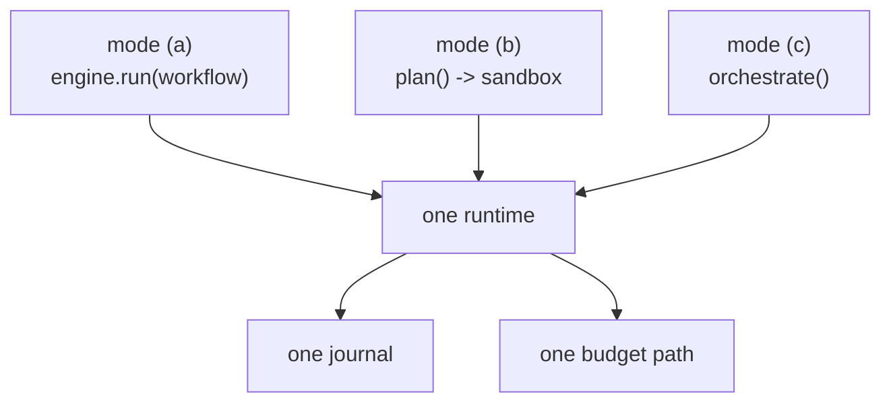

# Orchestration modes

rulvar gives you exactly three answers to the question "who decides what runs next": a person, a planner model that writes the whole script once before anything executes, or an orchestrator model that decides live, turn by turn. All three run on the same subagent runtime, write the same journal, and pass through the same three-layer budget. Switching modes changes who authors control flow; it never changes durability, budget enforcement, replay semantics, or observability.

```bash
pnpm add @rulvar/core @rulvar/anthropic   # mode (a): human scripts
pnpm add @rulvar/planner                  # mode (b): the flagship hybrid
pnpm add @rulvar/plan                     # mode (c) extension: PlanRunner
```

## One path, three authors



| Mode | Control flow authored by | Executes in | Ships in |
|---|---|---|---|
| (a) Human scripts | You, as an async TypeScript function | Your process, via `InProcessRunner` | `@rulvar/core` |
| (b) Flagship hybrid | A planner model, once, before execution | The worker sandbox, via `WorkerSandboxRunner` | `@rulvar/planner` |
| (c) Dynamic orchestrator | An orchestrator agent with typed spawn tools | The agent runtime | `@rulvar/core`, extended by `@rulvar/plan` |

Because the runtime is shared, everything on this page composes: a human script can nest an orchestrator with `ctx.orchestrate`, a planner-written script spawns the same agent profiles a human script would, and every one of them replays from the same journal on resume.

## Mode (a): human scripts

You write an ordinary async function against the `Ctx` API and run it in process. Determinism is enforced by convention, lint (`eslint-plugin-rulvar`), and the journaled `ctx.now()` / `ctx.random()` / `ctx.uuid()` shims, not by a VM: under the memoizing journal only the sequence of content keys must be stable, so your code keeps full ecosystem access.

```ts
import { createEngine, defineWorkflow } from "@rulvar/core";
import { anthropic } from "@rulvar/anthropic";

const engine = createEngine({
  adapters: [anthropic()],
  defaults: { routing: { loop: "anthropic:claude-sonnet-5" } },
});

const review = defineWorkflow(
  { name: "review-corpus" },
  async (ctx, args: { files: string[] }) => {
    const notes = await ctx.phase("survey", () =>
      ctx.parallel(
        args.files.map((f) => () => ctx.agent(`Summarize the risks in ${f}`)),
      ),
    );
    return ctx.phase("report", () =>
      ctx.agent(`Write a combined risk report:\n${notes.join("\n")}`),
    );
  },
);

const handle = engine.run(review, { files: ["auth.ts", "billing.ts"] }, {
  budgetUsd: 5,
});
const outcome = await handle.result;
```

This shape, `ctx.phase` plus nested `ctx.workflow`, replanning only between phases over compact artifacts with fresh context, is the phase chain: the documented default for most users. See [Workflows](/guide/workflows) for the full `Ctx` surface and [Determinism](/guide/determinism) for the lint rules.

## Mode (b): the flagship hybrid

The flagship mode splits planning from execution. A planner model (invocation role `plan`) writes a script against two cards: the API card (`apiCard()`, the sandbox dialect) and the profile card (`engine.profileCard()`, your registered agent profiles). The draft is linted with the `eslint-plugin-rulvar` workflows preset; machine-readable JSON diagnostics feed a self-repair loop of up to `repairRounds` rounds (default 3). The accepted draft passes `compileScript`, and the resulting `CompiledWorkflow` executes deterministically in the worker sandbox.

You get model-authored control flow with none of the runtime improvisation: by the time a single dollar is spent on execution, the plan is frozen source you can read, diff, and re-run.

```ts
import { createEngine } from "@rulvar/core";
import { anthropic } from "@rulvar/anthropic";
import { WorkerSandboxRunner, plan, runPlanned } from "@rulvar/planner";

const engine = createEngine({
  adapters: [anthropic()],
  defaults: {
    routing: {
      plan: "anthropic:claude-opus-4-8",
      loop: "anthropic:claude-sonnet-5",
    },
    profiles: {
      researcher: { description: "Finds and cites primary sources." },
      writer: { description: "Turns research notes into prose." },
    },
  },
  runners: { sandbox: new WorkerSandboxRunner() },
});

const planned = await plan(engine, "Research and draft a migration guide");
console.log(planned.source); // read the script before you pay for execution
const handle = engine.run(planned.workflow, {}, { budgetUsd: 10 });

// Or compose plan-then-run in one call:
const direct = await runPlanned(engine, "Research and draft a migration guide");
```

The sandbox (a `worker_threads` worker) executes the script against a curated global scope: `agent`, `parallel`, `pipeline`, `step`, `phase`, `log`, `budget`, `workflow`, `awaitExternal`, `now`, `random`, `uuid`, and nothing else. `Date.now` and `Math.random` are replaced by seeded, journaled shims; `import`, `fetch`, and `process` are absent; every primitive call crosses to the host as validated JSON. Scripts run under the `lenient` error policy, tools and child workflows are referenced by registered name only, and breaching the runner's `timeoutMs` (default 300000) or `memoryMb` (default 512) terminates the worker with a typed error. The sandbox is a determinism and blast-radius boundary, not a security boundary; containment of hostile code belongs to executors and worktree isolation (see [Tools](/guide/tools)).

Planning itself is an ordinary journaled run whose id derives deterministically from the goal, so replanning after a failure resumes the same planning journal and replays the unchanged prefix of the conversation for free, exactly as the never-pay-twice invariant promises. The full pipeline, dialect, and repair loop are documented in [Planner](/guide/planner).

## Mode (c): the dynamic orchestrator

When the plan cannot be written up front, hand control flow to an orchestrator: an ordinary agent (invocation role `orchestrate`) holding typed spawn tools. It is not a framework bolted onto the engine; every spawn is a journal entry, every dynamic decision is a decision entry written before its effects, and orchestrator turns are checkpointed mandatorily at turn boundaries.

| Tool | Available | Purpose |
|---|---|---|
| `spawn_agent` | base toolset | Admit and schedule one child agent |
| `parallel_agents` | base toolset | Admit and schedule several children at once |
| `await_any` / `await_all` | base toolset | Wait on spawn handles |
| `cancel_agent` | base toolset | Cancel an in-flight child |
| `wait_for_events` | base toolset | Sleep until a coalesced wake digest |
| `finish` | base toolset | Terminate the run with a result |
| `plan_view` / `plan_revise` | PlanRunner extension | Read and revise the typed plan |
| `escalate` | worker profiles that opt in | A child's typed "this is bigger than me" report; never on the orchestrator itself |

```ts
import { orchestrate } from "@rulvar/core";

const audit = orchestrate(engine, "Audit the public API for breaking changes", {
  profiles: ["researcher", "writer"],
  maxSpawns: 24,
  budget: { capFraction: 0.15, finalizeReserveUsd: 0.5 },
});

const outcome = await audit.result;
// outcome.status is 'ok' | 'error' | 'cancelled' | 'exhausted' | 'suspended';
// exhaustion is never null: partial results and a full cost report survive.
```

The orchestrator never sees or names concrete models; it picks agent profiles from the same profile card that mode (b)'s planner reads, so both machine modes speak one agent vocabulary. Its own spend is bounded by a dedicated budget sub-account (`capUsd` / `capFraction` with a finalize reserve), on top of the run ceiling that binds everyone. A nested form, `ctx.orchestrate(goal, opts)`, runs the same implementation under the admission controller of a parent workflow.

Rather than polling, the orchestrator sleeps on `wait_for_events` and is woken by a coalesced wake digest: summaries ordered by spawn ordinal, never raw transcripts, so its context grows with the number of wakes rather than the number of children. A quiescence trigger is always armed, and every guard in the machinery has a non-HITL terminating fallback: an embedded run with no operator present always terminates rather than hanging.

### Extending mode (c) with PlanRunner

By default the orchestrator's plan lives in its head. The opt-in PlanRunner extension from `@rulvar/plan` moves it into the engine as typed data: a dependency DAG of task nodes the engine schedules, with `plan_view` (a pure fold, pinned to the last wake digest) and `plan_revise` (typed diff operations passed through a journaled rebase with a closed conflict table). Revision guards, a frozen termination account, reuse-by-reference for abandoned work, and the run-scoped advisory ledger ride along.

```ts
import { orchestrate } from "@rulvar/core";
import { orchestratePlanned, planRunner } from "@rulvar/plan";

const run = orchestrate(engine, "Port the test suite to the new runner", {
  extension: planRunner({
    maxRevisionsPerRun: 16,
    guards: { fallback: "finish-with-partial", droppedRevisionLimit: 3 },
  }),
});

// The convenience surface, mode (c) plus the extension in one call:
const same = orchestratePlanned(engine, "Port the test suite to the new runner", {
  plan: { maxRevisionsPerRun: 16 },
});
```

Everything PlanRunner adds obeys the same rule as the rest of the engine: nondeterminism is eliminated not by forbidding dynamism but by recording it. The full machinery, wake digests, escalation, admission, model ladders, and termination accounting, is covered in [Adaptive orchestration](/guide/adaptive-orchestration).

## Choosing a mode

Default to the phase chain. A human script (or a planner-written one) with `ctx.phase` boundaries, nested workflows, and replanning only between phases over compact artifacts covers most workloads with the least machinery, the least orchestrator spend, and the most readable journals.

- Use **mode (a)** when you know the workflow's shape and want to hand-tune it. It is also where every run starts during development, because it is plain TypeScript under test.
- Use **mode (b)** when the goal varies per run but should still execute as a frozen, reviewable script. You want a model to write the plan and you refuse to let it improvise at runtime.
- Use **mode (c)** when the plan must change mid-flight: wide fan-out whose next step depends on results that cannot wait for a phase boundary. Mid-run replanning is the only real justification for an LLM orchestrator; if the plan never changes, a script is strictly better, cheaper, and easier to audit.
- Add **PlanRunner** on top of mode (c) when that replanning needs structure: typed revisions with rebase, dedup and reuse across revisions, and guaranteed termination under guards.

Quality patterns (adversarial panels, judge panels, loop-until-dry, completeness critics) are recipes and prompt templates over these three modes, never engine flags; see [Examples](/guide/examples).

## Why there is no fourth mode

The engine's single cross-agent primitive is agent-as-tool: invoke a specialist, get its result back. Handoffs, chat rooms, blackboard coordination, and emergent topology are rejected on principle, not deferred, because they destroy the two properties the whole engine is built on:

- **Budget attribution.** Every spawn debits a hierarchical sub-account under the run ceiling. A handoff that transfers control sideways has no answer to "whose account pays for the next turn", and without attribution the three-layer budget cannot bound anything.
- **Scope identity.** A journal entry's identity is its structural scope path, content key, and ordinal. Call-and-return execution gives every call a stable position in the execution tree; emergent topologies do not, and without stable identity the never-pay-twice invariant is unenforceable.

Dynamic behavior that seems to need a handoff has a sanctioned call-and-return form instead: a child that discovers its task is bigger than its scope escalates with a typed report (proposing, never spawning, a decomposition), and the single admission controller decides. A fourth mode will not be added.

## Resume semantics at a glance

Resume is the same journal mechanism in every mode, scoped forward-matching against completed entries, but what carries the continuation differs:

| Mode | Resume | What happens |
|---|---|---|
| (a) Human scripts | `engine.resume(runId, wf)`, or bare `engine.resume(runId)` when the workflow is registered under `defaults.workflows` | The body reruns from the top; every journaled call is served by scoped forward-matching, so completed work is never re-paid. Original args are not journaled in v1; re-supply them via `ResumeOptions.args`. |
| (b) Flagship hybrid | `engine.resume(runId)`, no workflow argument | Resumable by construction: the engine reloads the persisted script source, verifies it byte-for-byte against the recorded hash, and re-executes it in the sandbox, where the seeded shims regenerate identical values. |
| (c) Dynamic orchestrator | `engine.resume(runId)` | The orchestrator restores its transcript from the last turn-boundary checkpoint. Spawn handles are journal-derived (the spawn entry's seq) and stable across resume, so completed children are found by content key without regenerating spawn decisions and without re-paying children. |
| (c) with PlanRunner | `engine.resume(runId)` | Plan state re-folds purely from journaled revision and decision entries; recorded rebase outcomes are reproduced, never re-evaluated against live state; timers do not run on replay. |

::: warning Durable stores required
The default `InMemoryStore` disables resume with a loud warning. Cross-process resume needs a durable journal store (`JsonlFileStore` or `@rulvar/store-sqlite`), and compiled workflows additionally need a durable transcript store (`FileTranscriptStore`) to hold the persisted source. See [Durability](/guide/durability) and [Stores](/guide/stores).
:::

## Comparison

| | (a) Human scripts | (b) Flagship hybrid | (c) Dynamic orchestrator |
|---|---|---|---|
| Control flow | Written by you | Written by a planner model, then frozen | Decided live by the orchestrator agent |
| Entry points | `engine.run(wf)` | `plan()`, `runPlanned()` | `orchestrate()`, `ctx.orchestrate()`, `orchestratePlanned()` |
| Executes in | Your process (`InProcessRunner`) | Worker sandbox (`WorkerSandboxRunner`) | Agent runtime |
| Determinism | Convention, lint, ctx shims | Enforced: closed dialect, seeded sandbox, no ambient I/O | Decision entries before effects; every spawn journaled |
| Model spend on control flow | None | One planning conversation, journaled and replayable | Orchestrator turns, bounded by its own cap and finalize reserve |
| Structural limits | Lifetime spawn cap (default 500), `maxDepth`, three budget layers | Same | Same, plus `maxSpawns`; plus a frozen termination account with PlanRunner |
| Resume | Rerun body, replay from journal | Rehydrate hash-pinned source, replay | Checkpoint restore, stable handles, children by content key |
| Best for | Known shape, hand-tuned pipelines | Varying goals, reviewable frozen plans | Fan-out that cannot wait for a phase boundary |

## Next steps

- [Workflows](/guide/workflows): the full `Ctx` authoring surface behind modes (a) and (b).
- [Planner](/guide/planner): the mode (b) pipeline, dialect, and self-repair loop in depth.
- [Adaptive orchestration](/guide/adaptive-orchestration): PlanRunner, wake digests, escalation, admission, and termination.
- [Budgets](/guide/budgets): the three-layer budget and the orchestrator's own cap.
- [Journal](/guide/journal): content keys, scope paths, and the replay machinery every mode shares.
- API reference: [@rulvar/core](/api/@rulvar/core/), [@rulvar/planner](/api/@rulvar/planner/), [@rulvar/plan](/api/@rulvar/plan/).
