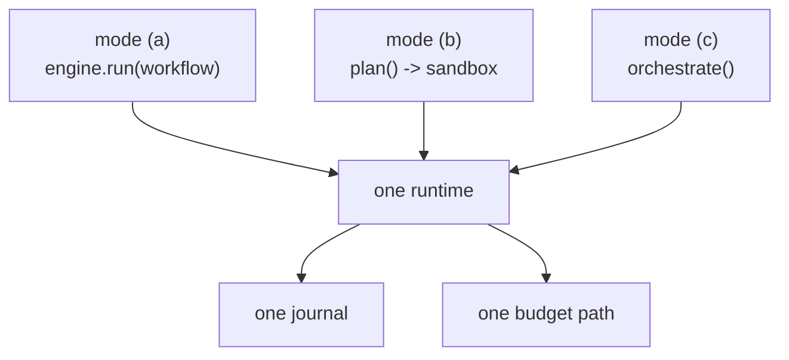

# Orchestration modes

Rulvar gives you exactly three answers to the question "who decides what runs next": a person, a planner model that writes the whole script once before anything executes, or an orchestrator model that decides live, turn by turn. All three run on the same subagent runtime, write the same journal, and pass through the same three-layer budget. Switching modes changes who authors control flow; it never changes durability, budget enforcement, replay semantics, or observability.

```bash
pnpm add @rulvar/core @rulvar/anthropic   # mode (a): human scripts
pnpm add @rulvar/planner                  # mode (b): the flagship hybrid
pnpm add @rulvar/plan                     # mode (c) extension: PlanRunner
```

## One path, three authors


```mermaid
flowchart TB
    A["mode (a)<br>engine.run(workflow)"] --> E
    B["mode (b)<br>plan() -> sandbox"] --> E
    C["mode (c)<br>orchestrate()"] --> E
    E[one runtime] --> J[one journal]
    E --> BU[one budget path]
```

| Mode | Control flow authored by | Executes in | Ships in |
|---|---|---|---|
| (a) Human scripts | You, as an async TypeScript function | Your process, via `InProcessRunner` | `@rulvar/core` |
| (b) Flagship hybrid | A planner model, once, before execution | The worker sandbox, via `WorkerSandboxRunner` | `@rulvar/planner` |
| (c) Dynamic orchestrator | An orchestrator agent with typed spawn tools | The agent runtime | `@rulvar/core`, extended by `@rulvar/plan` |

Because the runtime is shared, everything on this page composes: a human script can nest an orchestrator with `ctx.orchestrate`, a planner-written script spawns the same agent profiles a human script would, and every one of them replays from the same journal on resume.

## Mode (a): human scripts

You write an ordinary async function against the `Ctx` API and run it in process. Determinism is enforced by convention, lint (`eslint-plugin-rulvar`), and the journaled `ctx.now()` / `ctx.random()` / `ctx.uuid()` shims, not by a VM: under the memoizing journal only the sequence of content keys must be stable, so your code keeps full ecosystem access.

```ts
import { createEngine, defineWorkflow } from "@rulvar/core";
import { anthropic } from "@rulvar/anthropic";

const engine = createEngine({
  adapters: [anthropic()],
  defaults: { routing: { loop: "anthropic:claude-sonnet-5" } },
});

const review = defineWorkflow(
  { name: "review-corpus" },
  async (ctx, args: { files: string[] }) => {
    const notes = await ctx.phase("survey", () =>
      ctx.parallel(
        args.files.map((f) => () => ctx.agent(`Summarize the risks in ${f}`)),
      ),
    );
    return ctx.phase("report", () =>
      ctx.agent(`Write a combined risk report:\n${notes.join("\n")}`),
    );
  },
);

const handle = engine.run(review, { files: ["auth.ts", "billing.ts"] }, {
  budgetUsd: 5,
});
const outcome = await handle.result;
```

This shape, `ctx.phase` plus nested `ctx.workflow`, replanning only between phases over compact artifacts with fresh context, is the phase chain: the documented default for most users. See [Workflows](/guide/workflows) for the full `Ctx` surface and [Determinism](/guide/determinism) for the lint rules.

## Mode (b): the flagship hybrid

The flagship mode splits planning from execution. A planner model (invocation role `plan`) writes a script against two cards: the API card (`apiCard()`, the sandbox dialect) and the profile card (`engine.profileCard()`, your registered agent profiles). The draft is linted with the `eslint-plugin-rulvar` workflows preset; machine-readable JSON diagnostics feed a self-repair loop of up to `repairRounds` rounds (default 3). The accepted draft passes `compileScript`, and the resulting `CompiledWorkflow` executes deterministically in the worker sandbox.

You get model-authored control flow with none of the runtime improvisation: by the time a single dollar is spent on execution, the plan is frozen source you can read, diff, and re-run.

```ts
import { createEngine } from "@rulvar/core";
import { anthropic } from "@rulvar/anthropic";
import { WorkerSandboxRunner, plan, runPlanned } from "@rulvar/planner";

const engine = createEngine({
  adapters: [anthropic()],
  defaults: {
    routing: {
      plan: "anthropic:claude-opus-4-8",
      loop: "anthropic:claude-sonnet-5",
    },
    profiles: {
      researcher: { description: "Finds and cites primary sources." },
      writer: { description: "Turns research notes into prose." },
    },
  },
  runners: { sandbox: new WorkerSandboxRunner() },
});

const planned = await plan(engine, "Research and draft a migration guide", {
  run: { budgetUsd: 1 }, // the planning conversation's own immutable ceiling
});
console.log(planned.source); // read the script before you pay for execution
const handle = engine.run(planned.workflow, {}, { budgetUsd: 10 });

// Or compose plan-then-run in one call, each leg under its own ceiling
// (the bare runPlanned(engine, goal) form runs BOTH legs unbounded):
const direct = await runPlanned(engine, "Research and draft a migration guide", null, {
  plan: { run: { budgetUsd: 1 } },
  run: { budgetUsd: 10 },
});
```

The sandbox (a `worker_threads` worker) executes the script against a curated global scope of `agent`, `parallel`, `pipeline`, `step`, `phase`, `log`, `budget`, `workflow`, `awaitExternal`, `now`, `random`, and `uuid`, bound as bare names. `Date.now` and `Math.random` are replaced by seeded, journaled shims; `fetch` and `process` are unbound; `import` is admitted only for an allowlisted literal specifier (default none), and `compileScript` also rejects dynamic code generation (`eval`, the `Function` constructor, and constructor reconstruction in every statically visible form) with the same AST policy the lint uses, while the worker neutralizes the runtime reconstruction path for a key it cannot see statically, so the import ban cannot simply be rebuilt at runtime; every primitive call crosses to the host as validated JSON. Scripts run under the `lenient` error policy, child workflows are referenced by registered name, and breaching the runner's `timeoutMs` (default 300000) or `memoryMb` (default 512) terminates the worker with a typed error. A script attaches tools to an agent spawn by registered toolset name (`tools: ['lookup-set']`): the names come from engine `defaults.toolsets`, are listed on the profile card, and an unknown name is a typed `ConfigError` at spawn time. The sandbox is a determinism and blast radius boundary, not a security boundary: the compile bans and the worker unbinding `eval` and `Function` and neutralizing the constructor reconstruction path bar a casual or an injection nudged escape but not a hostile author, since a worker in the same process shares its intrinsics with the code it runs. The current release enforces only the in-process tool executor; a git worktree isolates file changes and the working directory, never processes or the network. Containing genuinely hostile tool code requires an executor you build and operate (subprocess, container, or OS sandbox) with its own threat model (see [Tools](/guide/tools#executors)).

Planning itself is an ordinary journaled run whose id derives deterministically from the goal, so replanning after a failure resumes the same planning journal and replays the unchanged prefix of the conversation for free, exactly as the never-pay-twice invariant promises. The full pipeline, dialect, and repair loop are documented in [Planner](/guide/planner).

## Mode (c): the dynamic orchestrator

When the plan cannot be written up front, hand control flow to an orchestrator: an ordinary agent (invocation role `orchestrate`) holding typed spawn tools. It is not a framework bolted onto the engine; every spawn is a journal entry, every dynamic decision is a decision entry written before its effects, and orchestrator turns are checkpointed mandatorily at turn boundaries.

| Tool | Available | Purpose |
|---|---|---|
| `spawn_agent` | base toolset | Admit and schedule one child agent |
| `parallel_agents` | base toolset | Admit and schedule several children at once |
| `await_any` / `await_all` | base toolset | Wait on spawn handles |
| `cancel_agent` | base toolset | Cancel an in-flight child |
| `wait_for_events` | base toolset | Sleep until a coalesced wake digest |
| `finish` | base toolset | Terminate the run with a result |
| `plan_view` / `plan_revise` | PlanRunner extension | Read and revise the typed plan |
| `escalate` | worker profiles that opt in | A child's typed "this is bigger than me" report; never on the orchestrator itself |

A `parallel_agents` refusal mid-batch is part of the TYPED result, never a throw (RV805): the model keeps every started handle and sees the refused index, code and reason. `OrchestrateOptions.parallelAdmission` (RV1908) picks what happens around it. `'fail-fast'` (the default) admits in submission order and stops at the first refusal, tasks after it never attempted, the four-role benchmark's shape, where the fourth mandated specialist was never even tried. `'try-all'` attempts every task and reports every refusal in a `refusals` list beside the historical `refused` slot, so one refused sibling no longer hides whether the rest would seat. `'all-or-none'` projects the whole batch against the live remainder with the embedded gate's own formula first and refuses it typed (`code 'batch_atomic'`) with zero admissions when it cannot seat entirely; a non-budget failure mid-batch cancels the admitted siblings, best-effort atomicity over a machinery that cannot un-admit. Independent of the policy, a declared `acceptance.minSpawnedChildren` arms the roster pre-check: a batch large enough to seat the floor whose feasible count cannot reach it is refused (`code 'roster_floor'`) before the first child is paid, where the benchmark paid two workers in full under a floor of four the wave could never reach. The policies are runtime behavior only: the tool's schema and description never move, so toolset hashes stay byte identical.

The same roster feasibility guards the seat-by-seat path (RV2005). The third parity rerun's model ignored the one-batch instruction and spawned through single `spawn_agent` calls, so the batch gate never saw a batch and three seats were paid in full under a floor of four the money could never reach. Under a declared `acceptance.minSpawnedChildren`, EVERY single `spawn_agent` admission now projects the whole remaining roster with the shared RV2004 arithmetic (this seat's own dispatch projection per remaining seat, live in-flight exposure included) and refuses the FIRST infeasible seat with the typed `roster_floor` verdict, its arithmetic journaled on the decision (`floor`, `admittedChildren`, `seatsRemaining`, `perSeatProjectionUsd`, `liveExposureUsd`, `remainderUsd`), zero paid children. Batch seats skip the per-seat check: their batch gate already judged the wave entire. And for hosts that want the policy unsplittable, `OrchestrateOptions.requireBatchSpawn: 'reject-spawn-agent'` refuses every single `spawn_agent` call typed (`code 'batch_required'`, nothing journaled, nothing paid), so the model re-issues the wave as one `parallel_agents` batch and the batch gate sees everything.

```ts
import { orchestrate } from "@rulvar/core";

const audit = orchestrate(
  engine,
  "Audit the public API for breaking changes",
  {
    profiles: ["researcher", "writer"],
    maxSpawns: 24,
    budget: { capFraction: 0.15, finalizeReserveUsd: 0.5 },
  },
  // The run ceiling that binds everyone; the budget block above is only
  // the orchestrator's own sub-account within it.
  { budgetUsd: 10 },
);

const outcome = await audit.result;
// outcome.status is 'ok' | 'error' | 'cancelled' | 'exhausted' | 'suspended';
// exhaustion is never null: partial results and a full cost report survive.
```

The orchestrator never sees or names concrete models; it picks agent profiles from the same profile card that mode (b)'s planner reads, so both machine modes speak one agent vocabulary. With `profiles` passed in the options, that vocabulary is an ENFORCED allowlist (RV1011): the advertisement is filtered and the dispatch resolves from the same filtered set, so a spawn naming a registered-but-hidden profile refuses typed before admission instead of widening the vocabulary by a guessed name. The vocabulary is exactly what the host REGISTERED, nothing inherited (RV1205): profile maps are read as own properties and the advertised set is built with a null prototype, so an agentType naming a JavaScript prototype member (`toString`, `constructor`, `__proto__`) resolves no profile at any layer, refuses typed like any unregistered name, and burns no admission slot. It used to pass the allowlist through the prototype chain and consume the slot before dying on the inherited value. Its own spend is bounded by a dedicated budget sub-account (`capUsd` / `capFraction` with a finalize reserve), on top of the run ceiling that binds everyone. A nested form, `ctx.orchestrate(goal, opts)`, runs the same implementation under the admission controller of a parent workflow. `maxSpawns` counts ADMITTED children, never attempts (v1.81, the sixth comparison run): an admission-rejected spawn (budget, quota, depth) spends nothing and consumes no slot, so the orchestrator can retry a rejected role at a viable budget instead of losing the mandate to a transient rejection, while attempt volume stays bounded by the coordination turn's own tool budget; the run 2 shape, where a burned slot refused a perfect retry with `orchestrate maxSpawns 4 reached`, is gone.

Rather than polling, the orchestrator sleeps on `wait_for_events` and is woken by a coalesced wake digest: summaries ordered by spawn ordinal, never raw transcripts, so its context grows with the number of wakes rather than the number of children. A quiescence trigger is always armed, and every guard in the machinery has a non-HITL terminating fallback: an embedded run with no operator present always terminates rather than hanging.

Two contracts to hold in mind when you consume mode (c) results:

- `await_any` and `await_all` return `TaskDigest` values, not full child reports: `status`, `costUsd`, the artifact id index, and an `outputSummary` deterministically truncated to the digest render budget (400 characters by default). The digest is a wake signal, not the result channel; a child whose full output matters should return compact structured output or write artifacts. The full output IS durable (the child's terminal journal entry holds it), and `exposeChildResultTools` below lets the orchestrator page it in place.
- Run status `ok` proves that `finish({ result })` validated, and nothing more. The model may call `finish` after any mix of child outcomes, so `ok` alone never proves the children succeeded. When that distinction matters, set the acceptance policy below; when the result itself must carry required structure or evidence, add the finish validators one section further down. A budget cap settle is separately marked (RV906): under the default `atCap: 'finish-with-partial'` the capped terminal settles `ok` with the completion envelope `{ result, completion: 'partial' }` as its value (`'complete'` only when the finalizer's finish provably passed the FULL declared contract), the finalize fallback ends `exhausted` with the same `completion: 'partial'` claim, and `budget.atCap: 'fail-run'` is the typed `fail_run` error, so no capped terminal reads as an unmarked plain `ok`; see [the at-cap protocol](/guide/budgets#the-orchestrator-budget-sub-account).

### Acceptance: the child completion policy

`acceptance` turns "the model called finish" into a checked completion contract. When set, the policy is evaluated exactly when `finish` validates, the verdict is journaled as one decision entry (so a resume rolls the same verdict forward, immune to drift of the live options and to children whose settle raced the finish), and the workflow result becomes the acceptance envelope.

```ts
const audited = orchestrate(
  engine,
  "Audit the public API for breaking changes",
  {
    profiles: ["researcher", "writer"],
    // 'all-ok' demands every spawned child settled 'ok' at finish;
    // { minSuccessful: N } tolerates failures beyond the first N successes.
    acceptance: { childPolicy: "all-ok" },
  },
  { budgetUsd: 10 },
);

const outcome = await audited.result;
// With acceptance set, outcome.value is the envelope:
//   { result, completion: 'complete' | 'partial',
//     childStatusCounts: { ok: 4, ... }, degradedReasons: [...] }
// and the outcome itself mirrors the lifted fields on EVERY path,
// the typed rejection included: outcome.completion,
// outcome.childStatusCounts (the same values run:end carries).
```

A violated policy fails the run instead of settling `ok`: the outcome is `error` with the typed `FailRunError` (code `fail_run`, `data.source` `'orchestrator_acceptance'`), carrying the child status counts and the degraded reasons. Under `'all-ok'`, a child still running when `finish` validates counts against the policy, and so does a deliberately cancelled straggler; zero spawned children are vacuously complete. Under `{ minSuccessful: N }`, an accepted result with any non `ok` child reports `completion: 'partial'` and names every degraded child in `degradedReasons`. Both policies judge only the children that exist, which lets a fan-out-shaped task settle `ok` without ever fanning out; the opt-in `minSpawnedChildren: N` (RV507) closes that gap by rejecting a finish whose spawned roster is smaller than N under either policy, with the actual `spawnedChildren` count carried beside the configured floor in the journaled decision and in a rejection's error data. Policy only, like the rest of acceptance: a resume rolls the journaled verdict forward even when the live options drifted. Without `acceptance`, the result value stays the raw finish payload and no new journal entry is written, exactly as before.

The CLI pairs with the envelope: `rulvar run --strict` (and `resume --strict`) exits nonzero when a settled `ok` value carries `completion: 'partial'`, printing the degraded reasons, so scripts can demand complete orchestrations without parsing the value themselves.

Gate on the (`status`, `completion`) PAIR, never on `status` alone: an accepted degraded run is `status: 'ok'` with `completion: 'partial'`, and a pipeline that checks only the status treats every salvage as a full success. The envelope, the outcome, and `run:end` all carry `acceptanceChildren` (RV806), the per-child machine roster of the same journaled decision: each spawned child with its settled status, the salvage arm that accepted it (`'partial'` or `'terminal-output'`), and, where the child declared an [evidence contract](/guide/agents#the-recommended-tool-budget-posture), the evidence verdict `{ recordedEntries, minEntries, met }` with `waivedBySalvage: true` on a below-floor child a salvage arm accepted anyway. The twelfth comparison experiment accepted two below-floor children through salvage and nothing machine-readable said so; a host that must not ship waived evidence gates on `acceptanceChildren.some((c) => c.evidence?.waivedBySalvage === true)` instead of re-deriving it from name lists, and `rulvar inspect` prints the same roster (`evidence w2: 1 of 2 (below floor, waived by salvage)`) from the journaled decision.

A host that must not merely DETECT waived evidence but refuse it sets `acceptance.requireEvidenceFloor: true` (RV1207): a child that declared an evidence contract it did not meet is then never promoted by a salvage arm, so it counts against the policy exactly like an unsalvageable `limit` child, `'all-ok'` rejects, and `{ minSuccessful: N }` does not count it toward N. Since RV1412 the same flag binds the floor for children that settled `ok` too, and their shortfall is visible even WITHOUT it: an ok child below its declared floor adds a degradation note (so `completion` honestly reads `'partial'`, never `'complete'` over an unmet declared contract), rides the envelope's `belowFloorOkChildren` list, and keeps `met: false` on its roster row, while the verdict stays exactly what it was; with the flag, that child also counts against the policy, its row is marked `floorRequired: true`, and, in an accepted run, it stays OUT of the [contradiction pass](#the-bounded-contradiction-pass) pool and the synthesis evidence index, the same RV1403 line a floor-blocked salvage child follows. What neither mode changes: the child's output stays visible through the digest and `get_child_result`, and its status stays factual in `childStatusCounts`. See [the terminal contract for consumers](/guide/observability#the-terminal-contract-for-consumers) for how to gate on these facts. The sixteenth comparison run is the case that named it: a worker settled `limit` with 10 of 14 declared entries, terminal-output salvage promoted it with the floor waived, and the run reported `status: 'ok'` with `completion: 'partial'` over an unmet contract. Salvage stays DIAGNOSTIC under the option: the roster still records the arm that would have applied and the evidence verdict (marked `floorRequired: true` instead of `waivedBySalvage: true`), the `degradedReasons` name the shortfall with its counts, and the child's output stays visible through the digest and `get_child_result` exactly as before. The refusal is consistent across every downstream surface (RV1403): a floor-blocked child is never marked `salvageableOutput` or `salvageablePartial` on the finish validation input, never enters the [contradiction pass](#the-bounded-contradiction-pass) pool, and never donates citations to the synthesis evidence index, because a child the policy refused to count must not steer what composes the result. A child with no declared contract, or one that met its floor, is untouched.

### Partial-child salvage and profile templates

Both policies used to treat a `limit` child as a plain failure, which made budget expiry doubly expensive: the child's paid work was lost AND the run rejected. With the [progress contract](/guide/tools#the-progress-contract-and-the-structured-terminal-partial) in the child's toolset, the collected work survives the expiry as the structured terminal partial, and `acceptance.acceptPartialChildren: true` lets the policy salvage it:

```ts
import { createEngine, orchestrate, researchAgentProfile } from "@rulvar/core";
import { anthropic } from "@rulvar/anthropic";

const research = researchAgentProfile({ root: "/work/checkout" });
const engine = createEngine({
  adapters: [anthropic()],
  defaults: {
    // The template ships the research toolset, report_progress, and the
    // stop conditions (weighted units, per-tool caps, both repetition
    // guards, budget notices) already merged into limits.
    profiles: { researcher: research.profile },
  },
});

const handle = orchestrate(
  engine,
  "Map the error handling of this repository",
  {
    profiles: ["researcher"],
    acceptance: { childPolicy: "all-ok", acceptPartialChildren: true },
    exposeChildResultTools: true,
  },
  { budgetUsd: 10 },
);
const outcome = await handle.result;
// A researcher that ran out of budget AFTER reporting progress no longer
// rejects the run: the envelope reports completion 'partial' and lists it
// in salvagedPartialChildren; its digest carried `partial: {...}` and
// get_child_result paged the full report. The host still reads every
// verified citation: research.evidence().
```

A child that settled `limit` WITH a partial counts as a successful child for the policy: under `'all-ok'` it no longer rejects the run, and under `{ minSuccessful: N }` it counts toward N. The accepted envelope then reports `completion: 'partial'` (never `'complete'`), lists the salvaged children in `salvagedPartialChildren`, and keeps a per-child note in `degradedReasons`; the whole fold is part of the single journaled acceptance decision, so a resume rolls the same verdict forward. A limit child WITHOUT a partial gave the caller nothing to salvage and still counts against the policy, salvage or not. Enabling the option also appends one deterministic line to the coordination prompt telling the orchestrator that partial children are salvageable and that respawning a NARROWED child carrying the partial beats repeating the task, and marks the child on the finish validation input (`FinishValidationChild.salvageablePartial`, RV1403), which is what lets `evidencePreservedValidator` below count the accepted partial's citations as evidence; every other configuration keeps byte-identical prompts.

The progress report is not the only thing a limit child can leave behind. A child whose profile carries [`limits.finalizationReserve`](/guide/agents#the-finalization-reserve) gets one summary turn at a tool-budget expiry, and when its declared output schema rides the loop turn, that summary validates into TYPED output on the same `limit` terminal, journaled and replayable. The digest of such a child appends `final: {...}` beside any `partial: {...}` segment, and `get_child_result` pages the full output; that surfacing is unconditional, because paid, journaled evidence is never withheld from the orchestrator. Whether acceptance may COUNT that child as a success is the opt-in `acceptance.acceptValidatedTerminalOutputOnLimit`:

```ts
const salvaged = orchestrate(
  engine,
  "Map the error handling of this repository",
  {
    profiles: ["researcher"],
    acceptance: {
      childPolicy: "all-ok",
      // A limit child whose reserve summary VALIDATED into output counts
      // as a success; an invalid summary keeps output null and still
      // rejects, so validation always runs before acceptance.
      acceptValidatedTerminalOutputOnLimit: true,
    },
  },
  { budgetUsd: 10 },
);
```

The accepted envelope reports `completion: 'partial'` and lists such children in `salvagedTerminalOutputChildren` (a child carrying BOTH an output and a progress partial salvages by its output, the stronger evidence, and appears only there). A limit child whose summary failed schema validation carries `output: null` and is never salvaged: the validation the child's own contract demanded runs BEFORE acceptance by construction. The option also appends its own deterministic coordination prompt line and marks the child on the finish validation input (`FinishValidationChild.salvageableOutput`), which is what lets `evidencePreservedValidator` below count the salvaged child's citations; everything else stays byte-identical without it.

Three profile templates package the stop conditions so hosts stop hand-tuning limits per fan-out: `researchAgentProfile({ root })` (the research toolset plus the progress tool plus `RESEARCH_PROFILE_LIMITS`), and `implementationAgentProfile({ tools })` / `reviewAgentProfile({ tools })` (the caller's task tools with `report_progress` prepended, under `IMPLEMENTATION_PROFILE_LIMITS` / `REVIEW_PROFILE_LIMITS`). Templates are pure preset builders: `limits` overrides merge per key over the template's limits, and the exported limit constants document the exact defaults. One research kit instance backs one research profile, so children spawned from the same registered profile pool their verified evidence (and see each other's entries through `list_evidence`); construct one template per fan-out run, or per child, when isolation matters.

### Validating the finish result

`acceptance` judges the children; it never reads the result itself, so a schema valid but semantically empty `finish({ result: "all good, trust me" })` still lands as `completion: 'complete'`. `finishValidation` closes that gap with deterministic host validators over the finish result, plus a bounded repair loop.

```ts
import {
  minMatchesValidator,
  requiredSectionsValidator,
} from "@rulvar/core";

const audited = orchestrate(
  engine,
  "Audit the module; the report needs FINDINGS, EVIDENCE, and citations",
  {
    profiles: ["reviewer"],
    finishValidation: {
      validators: [
        requiredSectionsValidator({ sections: ["FINDINGS", "EVIDENCE"] }),
        // At least three file:line citations anywhere in the result text.
        minMatchesValidator({ pattern: "[\\w/.]+\\.ts:\\d+", min: 3, name: "citations" }),
      ],
      maxRepairs: 1, // the default: repair once, then fail
    },
  },
  { budgetUsd: 10 },
);
```

Every schema valid `finish` call first passes the validators, in configuration order. On a rejection the failure reasons return to the model as the call's error tool result and the turn continues: the model repairs the result and calls `finish` again. `maxRepairs` bounds how many rejected finishes are granted that repair turn (default one; zero fails on the first rejection). A rejection past the bound fails the run with the typed `FailRunError` (code `fail_run`, `data.source` `'orchestrator_finish_validation'`, the failed validators and their reasons in `data`), and it fires BEFORE the acceptance settle, so acceptance never judges a finish the validators rejected.

Every verdict (accepted, repair, rejected) journals as one decision entry keyed by the finish call id, so a resume rolls the same verdicts forward without re-running validator code and the whole exchange replays without new paid calls; a journaled final rejection even short circuits at boot, before any model call. The toolset never changes (the contract reaches the model through the orchestrator prompt), and zero configuration adds zero journal entries.

Since RV2507 a non-accepted verdict also records WHAT it judged: the sha256 over the canonical candidate and its size in characters, from bytes the validator already held. The terminal folds those decisions into [`rejectedFinishCandidates`](/guide/observability#the-terminal-contract-for-consumers), on the ok path as well as the failed one, so a run that recovered on its second attempt still reports the first. `finishValidation.retainRejectedCandidates` (default off) additionally writes each rejected candidate to its own transcript blob at `<runId>/finish-rejected/<callId>` and puts the `ref` on the row: the identity is free and always there, a COPY of the document is a storage decision the host makes, and `Engine.deleteRun` cascades over the blobs like every other run artifact. Turn it on for evaluation and comparison runs. The twenty-fifth comparison run rejected three syntheses and nothing on its terminal said how many there were, whether they differed from each other, or where to read them; the analysis needed an external script over the whole agent transcript, and the one hash across three rows would have said in a glance that the model served the same document every time.

The built in validators cover the plan's mechanical checks: `requiredSectionsValidator` (literal section markers in the result text), `requiredFieldsValidator` (object fields present and not empty strings), `minMatchesValidator` (at least N regex matches, the citation and source counts), `wordCountValidator` (the word count inside declared bounds, whitespace separated tokens), `sectionCitationsValidator` (at least N pattern matches INSIDE every named section, because a total count hides sections carrying zero provenance), and `headingStructureValidator` (v1.81: the markdown headings of one level held to the declared set, in declaration order, no heading repeated and none undeclared, with fenced code always stripped first; line presence via `sectionsMatch: 'line'` proves each heading EXISTS, and this validator proves the document carries them in order without extras, the sixth comparison judge's P1.3). Two more answer the sixteenth comparison judge, who found that counting citations proves provenance was OFFERED and never that it holds. `evidenceGradeValidator` (RV1212) lints the strongest register a report can use: a sentence claiming something is `live-observed`, came from the `provider bill`, or is `production-proven` must name a run id or a `file:line` citation IN THAT SENTENCE, so evidence three paragraphs away no longer licenses the claim (the sixteenth run's own answer used the register about a runtime its live run never observed, and every reader-side check passed because the text was well formed). Both the phrase list and the artifact pattern are configurable, and a pattern that can match the empty string is refused typed, because it would silently satisfy every graded claim. The verdict names its offending sentences verbatim (RV2105), bounded to five and truncated per sentence: the phrase-only reason sent the eighth parity run's synthesis hunting a 5000-word document through two granted repairs that never found the sentences, and the run failed closed with half its budget unspent; a repair turn now reads exactly the lines the verdict judged. The guidance those reasons carry is composition-safe (RV2202): a validator reason is a repair instruction, so it must be executable without violating any sibling in the bundle, and the older "name a run id or a file:line citation beside it" failed that rule live: the RV2106 mirror run's synthesis obeyed it literally, wove inline run ids into citation-bearing sentences, `citedValueValidator` rejected exactly those sentences (a run id is never in the cited window), and both granted repairs burned between two individually correct validators. The verdict now steers to the safe shape, and each arm names the shape that is TRUE for it (RV2502): with the runtime's `runId` in hand the graded sentence may carry the id BESIDE a source citation, because `citedValueValidator` reads that same id as identity rather than as an asserted value, while the idless arm keeps the older advice (the run id in a SEPARATE sentence carrying no source citation), because there the sibling has no id to recognise. The same pairwise rule holds across the shipped bundle: every other built-in reason (add the missing heading, adjust the word count, add citations inside the named section, remove the invisible characters, restore the evidence lines, cite a resolvable line, assert only window-backed values) is executable without violating any sibling. The escape that guidance points at is now REACHABLE (RV2501): `DEFAULT_ARTIFACT_PATTERN` only ever matched a ULID behind the literal word `run`, so a run whose id arrived in any other shape had no artifact its own synthesis could name, and the 1.226.0 comparison run, told to state a run id of `comparison-rulvar-v12260-aug09-1786272840549`, spent both repairs and died on two sentences telling the truth about the run they were part of. `FinishValidationInput` carries `runId`, supplied by the orchestrator runtime at every gate that judges a finish (the validator-bound finish, the contract draft gate, and the `skipWhenDraftValid` pre-pass); a sentence carrying that id verbatim as a whole identifier satisfies the grade, and the verdict NAMES the id it wants written, so the repair is one edit instead of a guess. Bounded the same way every other intake is: an id under six characters is ignored (a two character id would satisfy nearly every sentence by accident, the fail open the empty-pattern guard already refuses), the id is credited only as a whole identifier so `x<id>y` is not an artifact, and with no id supplied the verdict is byte identical to the historical one. `citedValueValidator` (RV1212) closes the other half with the host's own source snapshot: within one sentence, the inline-code spans that are not citations are the values asserted about the citations that are, and each must appear in the cited line (or within `window` lines AFTER it) as a whole token, never a substring: under a plain `includes` an asserted `3` was satisfied by a line saying `30`, the seventeenth comparison judge's repro (RV1402). The sixteenth judge's repro was a citation to `retry.ts:24`, an interface declaration, for a default living nine lines below; pattern checks passed, this one does not. Its `resolve(target)` is host code and must be PURE over a snapshot frozen before the run, like every finish validator: a resolver reading the filesystem live would make a verdict depend on when it ran. A location the resolver does not know is a failure, not a pass, because a citation nothing resolves is not provenance, and a sentence that cites without asserting an inline value passes untouched: the validator judges assertions, never prose. One span class is IDENTITY rather than assertion (RV2502): a span naming the artefact under review says which commit, run, or release the document is about and asserts nothing about any cited line. The 1.226.0 comparison run wrote its frozen commit sha beside source citations, and the verdict demanded the sha appear in the cited source, an impossible repair delivered in the same reason list as three real value fixes; both granted repairs burned and the finish was rejected. Three shapes are structural and always excluded: a commit sha (12 to 64 hex characters, a floor low enough for every real abbreviation and high enough that ordinary hex literals like `deadbeef` stay judged), a release version (`1.2.3`, `v1.2.3`, optional prerelease or build tail), and the run's own id when the runtime supplies `runId`, on the same six-character floor the grade uses. Host vocabulary is DECLARED, never guessed: `notValues` lists the spans this document writes as identity, verdict words like `conditionally ready` among them, matched whole and case sensitively. The run-id exclusion is what makes the bundle self consistent, since the grade instructs a failing model to write that id into the offending sentence; everything else stays exactly as strict, and a genuine value the cited line does not carry still fails in the very same sentence as an excused sha.

The seventeenth comparison run showed what that sentence precondition still leaves open: its answer carried `ghost.ts:0`, a location no checkout ever held, and the whole configured chain passed it, because the citation pattern accepts any digits (a line of 0 included), `evidencePreservedValidator`'s `requireKnown` proves only that some child SAID the string, and `citedValueValidator` resolves a citation only when its sentence asserts an inline value beside it, so a fabricated location nobody asserted anything about counted as provenance and licensed the valid-draft skip. `citationTargetsValidator` (RV1401) closes the hole at the root: every match of the citation pattern in the result text, inline code and plain prose alike, is parsed as `path:line` and resolved against the same frozen `resolve(target)` snapshot, with no sentence-level precondition. Three refusals, each fail closed: a match that does not parse as `path:line` with a safe integer line is refused rather than skipped, because the host's own pattern claims it IS a citation; a line below 1 is refused BEFORE the resolver runs, because source lines are 1-based and a sloppy resolver might well answer line 0; and a location the resolver does not know is refused. Repeated occurrences are judged once, refusal reasons cap at 20 listed offenders, `fencedCode: 'excluded'` strips fenced code before scanning (default `'counted'`), and a text carrying no citation at all passes, because demanding that citations exist is `minMatchesValidator`'s job while this one demands the ones present are real. Wired into `finishValidation`, the refusal reaches the `skipWhenDraftValid` gate like every other validator verdict, so a draft carrying a fabricated citation can no longer skip the synthesis it was supposed to earn.

`formatCharacterValidator` (RV1509) closes the sibling hole the same run demonstrated five times over: its answer carried U+200B characters immediately before hidden-file citations, and every configured check passed because the citation pattern's boundary class simply excluded the invisible byte from the match, so the extracted citations were clean while the LITERAL text was not byte-identical to any repository path. The validator rejects the whole Unicode format category (`Cf`: zero-width spaces and joiners, the word joiner, the BOM, bidi controls, soft hyphens), listing each distinct character once with its codepoint, first index, occurrence count, and a short visible-context excerpt, so the repair turn can find the exact bytes; `allow` admits specific characters for content that legitimately needs them (bidi marks in RTL prose), each entry itself required to be a single `Cf` character, refused typed otherwise.

Anything else is a custom `FinishValidator`: a `name` unique within the call and a synchronous, deterministic `validate(input)`. A validator that throws is a host defect: the run fails as `ConfigError`, nothing journals, and no repair turn is spent on it.

### The output contract

`requiredSectionsValidator({ sections: OLD })` beside a goal that names NEW sections is the drift none of the machinery above can catch: the prompt and the validators are two sources of truth maintained by hand in two places. The v1.71 experiment burned a full paid run on exactly that mismatch: the question renamed three sections, the harness validator kept the old names, and a correct schema-valid answer was rejected until the synthesis turn ceiling. `finishContract` collapses the two sources into one manifest.

```ts
import { finishContract, orchestrate } from "@rulvar/core";

const contract = finishContract({
  sections: ["## Findings", "## Evidence", "## Risks"],
  words: { min: 400, max: 1200 },
  citations: { min: 12, perSection: 2 },
});

const audited = orchestrate(
  engine,
  ["Audit the module.", ...contract.promptLines].join("\n"),
  {
    profiles: ["reviewer"],
    finishValidation: { validators: contract.validators, contract },
  },
  { budgetUsd: 10 },
);
```

One manifest generates everything: the stock validator set (`contract-sections`, `contract-words`, `contract-citations`, `contract-section-citations`, riding the validators above), the prompt statement (`promptLines`, injected into the coordination AND synthesis prompts automatically whenever the contract is configured, so even a goal that forgets to embed them still tells the model the demands), a stable `hash` (sha256 over the JCS form of the normalized manifest), and golden self-test fixtures. Construction is where contradictions die: a manifest whose mandatory content alone exceeds `words.max`, a custom citation pattern without a `sample` to embed in the goldens, `perSection` without `sections`, each a `ConfigError` before any run exists.

The golden self test is the teeth. At workflow construction, BEFORE any provider call, every configured validator must accept the contract's `goldenAccept` skeleton, and at least one must reject `goldenReject` (a set that accepts the known-bad input validates nothing). A stale hand-written validator still demanding last month's sections rejects the fresh skeleton and construction throws, naming the validator and the exact missing markers, at a cost of zero dollars; the same drift declared to `preflightEstimate({ finishValidation: { validators, contract } })` reports as the error finding `output-contract-validator-mismatch` beside the quota and budget findings instead of throwing (programmatic only: validator functions cannot ride a JSON config file). Hosts with custom validators pass `selfTest: { accept, reject }` fixtures those validators actually accept; fixtures without a contract run standalone. Every contract validator must also appear in `finishValidation.validators` by name, so a promised contract nobody enforces is a `ConfigError`, never a silent lie. Since v1.78 the contract also carries one reject golden PER validator (`goldenRejects`), each proven at construction against the contract's own instance, and the self test holds the CONFIGURED validator of each name against its golden: a same-name replacement weaker than the contract's own validator (a words minimum of one standing in for fifty) is a `ConfigError` at construction and the error finding `output-contract-validator-weakened` in preflight, where the single shared reject fixture would have passed on the strength of an unrelated validator.

The bundle descriptor freezes what validated the run. With a contract configured, the journal records one decision entry (`decisionType 'orchestrator_finish_validation_bundle'`) carrying the contract hash, the validator names, and `maxRepairs`. A resume under the same contract appends nothing; a resume under a FIXED contract appends a superseding descriptor (`supersedes: <old hash>`) instead of failing, because repairing a stale validator and resuming is the intended remedy of exactly the failure the self test exists for. Without a contract the journal stays byte identical, so every existing configuration keeps its exact entries.

The remedy is generation-scoped (v1.77). Every finish-validation decision written under a contract carries `contractHash`, and only the CURRENT generation is judged: `repairsUsed` counts the current generation's rejections alone, so a fixed contract starts with the full repair budget back, and a final rejection a superseded generation left in the crash window (the `rejected` decision durable, the run terminal never written) neither rolls forward at boot nor re-arms when its exchange replays. The stale exchange replays byte identical, feedback included, and the loop continues into a live repair turn judged by the fixed contract; a run that already SETTLED with the failure stays settled, because the scoping rescues the crash window, never a terminal outcome. Decisions recorded before 1.77 carry no hash and bind to the current contract only while the journal holds a single bundle descriptor; once a supersession is recorded they are stale, which is exactly the conservative reading that makes the documented fix-and-resume remedy work for old journals too.

The bundle is exact (v1.78). `finishContract` deep-freezes everything it returns, the nested manifest objects, the sections array, the validators array, and each validator object, so a post-construction mutation throws a `TypeError` instead of silently diverging enforcement from the journaled hash (before v1.78, pushing into `manifest.sections` changed the live validator through a shared array reference while `hash` kept claiming the original manifest). Two manifest knobs sharpen matching. `sectionsMatch: 'line'` demands each marker as its own line, so a mid-sentence mention or a quoted marker no longer satisfies a heading. `fencedCode: 'excluded'` removes fenced code blocks (three-or-more backticks or tildes, the exported `stripFencedBlocks` grammar) before section matching, per-section slicing, word counting, and citation matching, so code samples can neither pad `words.min` nor donate citations, and a fenced marker occurrence can no longer mis-anchor a section's citation slice onto text that precedes its real heading. Both knobs default to the historical behavior, normalize away when declared at their defaults, join the hash and the prompt statement only when non-default, and exist on the standalone validators too (`match` on `requiredSectionsValidator` and `sectionCitationsValidator`, `fencedCode` on those plus `wordCountValidator` and `minMatchesValidator`) for hosts composing their own sets. A third manifest surface counts collections (RV2206): `sectionPatterns` demands, per entry, at least `min` matches of a regex INSIDE a named section's slice, DISTINCT by first capture when the pattern captures, so the parity contract's numbered collections (48 `N01.`-style ids, 16 counterexample ids) become contract-enforced instead of instruction-hoped: the second accepted subscription dossier carried 0 and 0 against an instruction naming both, and only a runner-side format pre-teach closed the gap until this surface. Each entry ships literal `samples` (embedded in the golden fixtures and quoted by the prompt statement; with a capturing pattern they must carry `min` distinct captures, because the accept skeleton must satisfy the demand it embeds), the validator is `contract-section-patterns` (standalone: `sectionPatternCountValidator`), and a deficit reason names the section, the label, the found-against-required count, and how many are missing, so a repair turn knows exactly what to add.

### Preserving the children's evidence

Counting citations in the result is not the same as keeping the ones the specialists actually produced: a finish can drop three of four real `file:line` citations, fabricate three plausible ones, and still satisfy `minMatchesValidator`. The validation input therefore carries `children`: every spawned child at finish time, in spawn order, each with its `handle`, `nodeId`, terminal `status`, and full output `text` (a pure read of the state the orchestrator already tracks). `evidencePreservedValidator` builds the provenance contract on top of it.

```ts
import { evidencePreservedValidator, orchestrate } from "@rulvar/core";

const audited = orchestrate(
  engine,
  "Audit the module and cite evidence",
  {
    profiles: ["reviewer"],
    finishValidation: {
      validators: [
        // Default pattern: a path with an extension, a colon, a line
        // number. Default minShare 0.95, the plan's preservation gate.
        // requireKnown also rejects citations no child ever produced.
        evidencePreservedValidator({ requireKnown: true }),
      ],
    },
  },
  { budgetUsd: 10 },
);
```

Distinct pattern matches are collected across the outputs of children settled `ok`, plus any limit child the runtime marked `salvageableOutput` or `salvageablePartial` (present only under their acceptance options, `acceptValidatedTerminalOutputOnLimit` and `acceptPartialChildren`, and only for a child the arms WILL count: under `requireEvidenceFloor` a below-floor child is never marked, RV1403. Acceptance counts a marked child as a success, so its validated output or accepted partial is part of the evidence, and with `requireKnown` the orchestrator quoting it is no longer flagged as fabricating); at least `minShare` of them must appear literally in the result text, and the rejection lists exactly the missing ones (capped at 20) so the repair turn can restore them. Zero child citations pass vacuously, unless `requireNonEmptyPool: true` (RV507): for an evidence-critical run the empty pool IS the failure, so that mode refuses the finish with an `empty child citation pool` reason instead of standing down, and the repair turn (or the run's error) says out loud that no child produced a single matching citation. With `requireKnown: true` the contract also runs in reverse: a citation in the result that no child ever produced is rejected as unknown, which closes the fabrication path. The contract is purely textual and deterministic; verifying that cited targets exist on disk stays host territory (a custom validator). Custom validators get the same `children` input, so any provenance rule the goal demands (per child minimums, required sections per specialist) is a few lines of host code.

Two honest bounds: validators are HOST code, so they check mechanical properties (structure, counts, markers), not truth; and repair turns are PAID provider turns spending from the orchestrator's ordinary budget ceilings. By default they also compete with generation for the same `maxTurns` (`maxRepairs` bounds only how many rejections are tolerated), which is exactly how the v1.71 experiment lost a whole run: one malformed finish plus one validator rejection exhausted a three-turn synthesis budget before a correct candidate could land. `repairTurnReserve` closes that gap, the reserve RV-204 deliberately deferred: a nonnegative integer of EXTRA turns the invocation the validators bind (the synthesis invocation when `synthesis` is configured, the coordination loop otherwise) may consume past its `maxTurns`, one granted per rejected finish exchange, schema-invalid finish arguments and host validation rejections alike. The grants derive from the message window itself, so a resumed segment that restored mid-exchange recounts the same grants without journaling anything; the reserve folds into the preflight turn projection ([`projectedProviderTurns` and the run ceiling](/guide/budgets)) when declared there; and zero (the default) keeps the pre-1.73 ceiling byte identical. The budget cap paths changed posture in RV906: the declared validators now BIND the reserved finalize dispatch (on capped runs synthesis never runs, so that finish is the final output they must judge, with the same repair feedback and `repairTurnReserve` grants), while acceptance still never judges it, which is exactly why a capped terminal under a declared acceptance policy stays `completion: 'partial'`. A schema-invalid finish also gets [one deterministic second chance](/guide/agents#the-agent-loop-and-turns) BEFORE burning a grant: arguments the adapter delivered as an unparsed wrapper are re-parsed strictly and through one bounded normalization, and a recovered object that passes the finish schema proceeds as if it had parsed on the wire; the v1.74 comparison run durably proved three complete coordination drafts were recoverable exactly this way and were thrown away instead. Since v1.79 the finish is also admitted at an EXHAUSTED tool budget: terminal calls never consume `maxToolCalls` or `toolUnits`, and an exhausted budget no longer starves them either. The fifth comparison run failed exactly there: the synthesis tool cap equalled the child count, the mandatory `get_child_result` reads spent the whole budget, and the ready 3984 word finish was cut before validation, so no rejection existed to arm the reserve and the run failed closed with the candidate stranded in the transcript. Now the finish reaches validation, a rejection feeds the repair grants as usual, and non-terminal calls beside an admitted finish are answered with typed skipped results so the repair exchange keeps a well formed history.

### The synthesis invocation

Without further configuration the coordination loop composes the final answer itself, on the `orchestrate` model, indistinguishable in cost and telemetry from the coordination turns. The opt-in `synthesis` option splits that work off: the loop's `finish({ result })` becomes a DRAFT, and one fresh post-fan-in invocation with role `synthesize` composes the final run result from the goal, the draft, and the settled child digest (spawn order, the same deterministic distillation the awaits delivered), on the finish-only toolset.

```ts
const audited = orchestrate(
  engine,
  "Audit the module and synthesize the findings",
  {
    profiles: ["reviewer"],
    synthesis: {
      // Route the synthesis independently of coordination: a strong
      // model for the evidence-heavy merge, or a cheap one for a
      // mechanical merge under a strong coordinator. The routing key
      // 'synthesize' works at every layer too; this override wins.
      model: "anthropic:claude-opus-4-8",
      effort: "high",
      limits: { maxTurns: 4 }, // the default
      instructions: "Render the findings as FINDINGS / EVIDENCE sections.",
    },
  },
  { budgetUsd: 10 },
);
```

The invocation is an ordinary journaled agent entry: a resume replays it with zero paid calls (the prompt derives deterministically from journaled state), and its telemetry is a full span with role `synthesize` phase pairs, so `CostReport.byRole.synthesize` and [`reduceCriticalPath`](/guide/observability#agent-lifecycle) attribute its cost and wall share without heuristics; a debug `log` event (`orchestrator synthesis context`) reports the actual draft, digest, and prompt sizes entering it. Ordering and failure posture are strict: synthesis runs only AFTER an accepted acceptance verdict (a rejected run never pays for it), `finishValidation` validators bind the SYNTHESIS finish rather than the draft (the final output is what they must judge, same repair loop, same journaled verdicts), and a synthesis invocation that dies falls back to the coordination draft under a journaled `orchestrator_synthesis_fallback` decision and a warn log when no validators are configured, or fails the run typed (`data.source` `'orchestrator_synthesis'`) when they are, because an unvalidated draft cannot stand in for a validated result. Every typed synthesis failure also carries the terminal truth the run already earned (the v1.71 experiment's outcome showed `completion: null` beside four accepted children): the acceptance snapshot in FULL (`completion`, `childStatusCounts`, and since v1.77 `degradedReasons` plus the `salvagedPartialChildren`/`salvagedTerminalOutputChildren` lists when present, exactly what the ok envelope reports), which the completion mirror lifts onto the error outcome so an errored run still says "the fan-out work is complete, the failure is downstream", and, when validation decisions exist, the verdict-derived repair taxonomy (`repairsUsed`, `maxRepairs`, `rejectedValidators`) read from the journaled decisions of the current contract generation. Since v1.77 the failure data also counts the exchange class every other field misses: `schemaRejectedFinishExchanges`, the finish exchanges whose ARGUMENTS died at the schema gate across the coordination and synthesis windows (the v1.74 run lost six payloads to exactly this, visible only by reading the transcript). The counter is derived from the live message windows like the repair-reserve grants, so live and resumed segments count the same total; a boot roll-forward of the crash window has no window and carries the journal-derived fields alone, and a failure with no schema-dead exchange carries no counter field at all. Since v1.81 the recovered twin is durable too: `schemaRecoveredFinishExchanges` counts the near-JSON finish exchanges the unparsed second chance salvaged across the same two windows (previously only a warn log said so), riding the acceptance ok envelope and the typed failure data alike; a live process counter like `transportRetries` (pure telemetry, nothing downstream feeds on it), absent when zero so existing envelopes stay byte identical. The budget cap paths are unchanged: a capped run settles through the reserved finalizer and never reaches synthesis. Every designed skip is machine-readable (`OrchestrateSynthesisSkipReason`): the journaled decision that causes the skip freezes `synthesisSkipped` (`'synthesis_skipped_by_acceptance'` on the rejected acceptance decision, `'synthesis_skipped_by_budget_cap'` on the budget-cap decision, `'synthesis_skipped_by_valid_draft'` on the RV510 `orchestrator_synthesis_skip` decision of [the conditional gate below](#skipping-a-synthesis-the-draft-already-satisfies)), the typed `FailRunError` data of the failing paths carries the same field (the valid-draft skip is the one non-failing reason: the acceptance envelope reports it instead), and an info `log` event (`orchestrator synthesis skipped`) announces it beside the zero `synthesize` spend, on the live pass and on every resume roll-forward alike. The field is absent when synthesis is not configured or when it actually ran, so existing runs stay byte identical, and a consumer never has to infer the cause from the acceptance decision.

#### Evidence symmetry and the draft gate

The validators judge the synthesis finish against the FULL child outputs, but by default the synthesis model sees only the draft and the 400 char digest rows on a finish-only toolset: the design assumes a substantial draft carries the evidence forward. The v1.74 comparison run paid for the exception: six failed coordination finish exchanges collapsed the draft to `test`, the synthesis invocation was asked to preserve 66 citations it had no way to see, and it fabricated 33 targets, was correctly rejected, and the run ended with no answer. Four opt-ins close the gap, each byte identical when unset:

- **`synthesis.exposeChildResultTools`** gives the synthesis invocation the same [evidence tools](#reading-a-child-s-full-evidence) coordination can opt into, `get_child_result` and `read_child_artifact`. The digest rows in its prompt then carry each child's `handle`, and the model pages any settled child's full output or artifacts before finishing.
- **`synthesis.context: 'full'`** embeds a `CHILD OUTPUTS` section carrying every settled child's full serialized output after the digest rows, so the whole pool the validators judge against rides the prompt, paid as input tokens (declare `estCost` or the preflight `estInputTokens` accordingly).
- **`synthesis.evidenceIndex`** (RV808b) rides between those two costs: a deterministic `EVIDENCE INDEX:` line in the prompt lists, per settled child in spawn order, the DISTINCT citations its output actually carries, its artifact descriptors, and its output size in chars, without embedding a single full output. Citations are matches of the configured `pattern` (default the `evidencePreservedValidator` citation shape; `true` takes the defaults, an object overrides them, and a pattern that can match the empty string is refused at intake, fail closed) extracted ONLY from the ACCEPTED roster (RV1403): the ok children plus every child a salvage arm actually counted, so an accepted structured partial's citations index, a floor-blocked child's never do, and nothing the index names is a citation the validators would reject as fabricated. With `exposeChildResultTools` the rows carry each child's `handle`, and the model pages exactly the child whose citation it needs instead of re-reading everything; the twelfth comparison run spent 357 s of synthesis on exactly that blind re-derivation. Folded only from replay-stable settled results, so a resumed synthesis re-derives identical prompt bytes; meaningless in mode `'incremental'` (no single synthesis prompt exists), a `ConfigError`.
- **`finishValidation.draftPolicy`** gates the draft itself: with `{ minWords, requireSections }` declared, a schema-valid but collapsed coordination finish is rejected as the call's error result BEFORE any paid synthesis dispatch. The checks are deterministic library text checks (the `wordCountValidator` and `requiredSectionsValidator` semantics), nothing journals (the rejected exchange is durable in the transcript and a resumed segment recounts identically), `maxRepairs` is not consumed, and `repairTurnReserve` grants coordination the same per-rejected-exchange headroom it grants the synthesis finish. `draftPolicy` without `synthesis` is a `ConfigError`: there the validators bind the coordination finish itself and there is no unvalidated draft to gate. The sentinel `draftPolicy: 'contract'` (RV808a) gates the draft by the FULL declared validator set instead of a hand-written subset, over the same children snapshot the synthesis-bound validation reads, and the rejection feedback names the failing validators. The twelfth comparison run showed what the subset costs: coordination repaired its draft only to the weak policy, the `skipWhenDraftValid` pre-pass then failed it against the full contract, and the run paid the whole synthesis plus its own repair for defects one coordination exchange could have fixed; under `'contract'` the coordination repair loop drives the draft toward exactly what the pre-pass will judge, which is what makes the skip reachable. Same posture otherwise: nothing journals, `maxRepairs` untouched. One honest bound: validators that fold the children snapshot (the evidence share) can still fail the pre-pass when a child settles between the draft finish and synthesis, so the pre-pass remains the authority.

Money is the fourth gap (v1.80, the sixth comparison run): the synthesis spends from the orchestrator's own sub-account, and a pricey coordination prefix can leave its turns a remainder the budget clamp shrinks below the contract's minimal accepting payload, cutting the finish at its output allowance before any tool call until `maxTurns` ends the invocation. The opt-in [`budget.synthesisReserveUsd`](/guide/budgets#the-orchestrator-budget-sub-account) holds the payload money through coordination and releases it to the synthesis invocation at dispatch; preflight reports `synthesis-reserve-unfunded` when a contract binds the synthesis without it.

`preflightEstimate` reports the asymmetric shape as the warning finding `synthesis-evidence-asymmetry` when evidence-demanding validators (the stock names `evidence-preserved`, `contract-citations`, `contract-section-citations`, or a contract with `citations`) are declared over a digest-blind synthesis with no read tools; declaring `synthesis.exposeChildResultTools` or `synthesis.context: 'full'` in the preflight input keeps it quiet.

#### Skipping a synthesis the draft already satisfies

The ninth comparison run paid for the opposite failure: the synthesis invocation returned the byte-identical draft text (the output SHA matched), after 101.3 s and 0.5512 USD, with post-fan-in work at 57.3% of wall time. When a strong coordination draft already meets the declared contract, the composing step buys nothing. The opt-in `synthesis.skipWhenDraftValid: true` (RV510) closes exactly that case with a deterministic gate, never a heuristic: before the synthesis span starts, the coordination draft is run through the FULL declared finish contract, the same `finishValidation.validators` that would bind the synthesis finish, over the same children snapshot. A draft that passes every validator becomes the final result without the synthesis invocation ever dispatching, under a journaled `orchestrator_synthesis_skip` decision carrying the reason `'synthesis_skipped_by_valid_draft'`, the validator names, the contract hash when a `finishValidation.contract` is declared, and the hash of the draft it judged, so a resume rolls the skip forward with zero paid calls; the info `log` event and the acceptance envelope's `synthesisSkipped` field carry the same reason. That verdict is the authority only for the generation and the draft it judged (RV603): the documented remedy for a broken contract is to fix it and resume, so a skip whose contract has been superseded, whose draft is no longer the one in hand, or whose validator names no longer match is not reused, and the gate re-runs on the current contract. Without a `contract` descriptor there is no generation identity to compare, and the binding falls back to the draft hash plus the validator names, which is honestly weaker: a same-name validator whose behavior changed underneath cannot be told apart. Entries journaled before this binding existed carry no draft hash and stay reusable, so runs in flight roll forward unchanged. A draft that fails any validator goes to synthesis exactly as before: the pre-pass journals nothing (a pure function of the draft re-derives identically on resume) and never spends `maxRepairs`. One configured surface outranks a valid draft (RV1404): non-empty [contradiction pass](#the-bounded-contradiction-pass) findings under `onFound: 'carry'` block the live skip, because the skip would silently retire the synthesis the carry line was supposed to ride.

The option requires `finishValidation`, a `ConfigError` at intake otherwise: without a declared contract there is nothing to judge the draft valid by, and a gate that vacuously passed would silently disable the synthesis you configured. That requirement transitively limits it to mode `'single'` (incremental mode already rejects validators). With a configured `budget.synthesisReserveUsd` the held payload money is released unconsumed on the skip and no reserve lifecycle decision journals: there was no synthesis invocation to account. Composes with `draftPolicy` naturally: the draft gate rejects collapsed drafts during coordination, and this gate retires the synthesis step when the surviving draft is already contract-complete, so the two bound the composing spend from both sides.

A FAILED pre-pass used to discard its verdict entirely, and the twelfth comparison run measured the price: 80.157% of wall time after fan-in, the coordinator's draft work followed by a synthesis that re-derived the whole document blind to which validators the draft had already failed, then failed the same contract once more itself. The opt-in `synthesis.carryDraftGaps: true` (RV808a, requires `skipWhenDraftValid`) converts that discarded verdict into targeted work: a failing pre-pass journals its verdict as an `orchestrator_synthesis_draft_gaps` decision (the failed validator names with their reasons, bound to the contract generation and the draft hash exactly like the skip decision), and the synthesis prompt gains a `DRAFT CONTRACT GAPS:` line naming those failures with the instruction to repair the named gaps and preserve the draft otherwise. A resume reuses the journaled verdict without re-running a validator, so the prompt bytes re-derive identically and the paid invocation replays; an info `log` event (`orchestrator synthesis draft gaps carried`) names the failed validators and the decision it read. Default off: no decision entry and byte-identical prompt bytes. The recommended pairing for the post-fan-in window is `draftPolicy: 'contract'` plus `skipWhenDraftValid` plus `carryDraftGaps`: coordination repairs drive the draft to contract validity, a valid draft retires synthesis entirely, and when it still falls short the synthesis starts from the named gaps instead of from zero.

The gate above decides whether to PAY for the synthesis; the floor below decides what to do when the paid one comes back worse than the draft. The 1.226.0 comparison run made the case: its coordination draft satisfied the FULL declared contract (its `draftPolicy: 'contract'` gate had judged it against the same bundle, which is why the synthesis dispatched at all), `skipWhenDraftValid` was off because the operator wanted the composing pass anyway, and the synthesis then failed that bundle three times over and settled the run with NO result at all, having paid for four workers, for the draft that would have passed, and for three rejected compositions. The opt-in `synthesis.fallbackToValidDraft: true` (RV2505) puts a floor under exactly that: a synthesis failure at the post-fan-in chokepoint is caught, the coordination draft is judged by the SAME `finishValidation.validators` that bind the synthesis finish, and a draft every validator accepts becomes the run result under a journaled `orchestrator_synthesis_regressed` decision (the truncated failure message, the validator names, the contract hash when a `finishValidation.contract` is declared, and the hash of the draft it judged) plus a warn `log` event; the envelope carries `synthesisRegressed` with that reason and the decision's journal seq. A draft that fails too journals `orchestrator_synthesis_fallback_declined` naming ITS failing validators with their reasons, and the original failure rethrows untouched, so the decline is auditable instead of silent. Deterministic by construction: only the declared contract judges, never a quality heuristic, and the verdict is a pure function of the draft, so a resume that re-fails the synthesis re-derives the identical answer and reuses the journaled decision instead of duplicating it. A `ConfigError` is never caught: a broken contract is a defect to fix and resume, not a reason to settle on a draft. It requires `finishValidation` (without a contract there is nothing to judge either document by) and is orthogonal to `skipWhenDraftValid`: with both on, a valid draft skips before there is anything to regress. Default off: no catch, no decision entry, no envelope field, byte for byte.

#### Sectional repair: resubmit only the violated sections

Every repair exchange above still pays for a whole document: a rejected finish resends the full result to fix one violated section, and on the twelfth comparison run the coordination draft plus its repairs alone cost 406 s of model output. The opt-in `finishValidation.sectionalRepair: { sections: [...] }` (RV808b) declares the marker lines that partition the document and teaches every gated finish a second repair shape: after a rejection, the model may call `finish({ sections: { '<declared marker>': '<new section body>' } })` and the host splices the patch into the RETAINED rejected attempt, line anchored (a section runs from the first line equal to its marker to the next declared marker line; a declared marker absent from the attempt is appended at the end, in declared order, which is how a repair ADDS a section a validator demanded), then validates the reconstructed document whole. The splice is the exported `spliceSections` function, so custom hosts stay symmetric with the runtime.

The vocabulary rides every finish the host actually gates: the validator-bound finish (the synthesis invocation when `synthesis` is configured, the coordination loop otherwise) and, when a `draftPolicy` is declared, the coordination draft gate. The synthesis invocation is additionally SEEDED with the coordination draft as its retained base, so a synthesis that agrees with the draft repairs only the named gaps without ever resending it; with `carryDraftGaps` the prompt names exactly which sections those are, and the whole post-fan-in window collapses to one small patch. Mechanics refusals (`sections` beside `result`, an undeclared marker, no retained attempt to splice into) are typed error results, the moral twin of a schema rejection: they journal nothing, spend no `maxRepairs`, and stay bounded by the turn budget; only the verdict over the SPLICED document spends the repair bound, and the accepted invocation output IS the reconstructed full document. Nothing new journals anywhere: the exchange is durable in the transcript and the splice is a pure function of it. Two honest bounds: sectional repair is a text-document vocabulary (a rejected JSON-object attempt clears the retained base, and the next sectional call is refused with the full-resubmission remedy), and the retained attempt lives in the invocation, so a segment resumed from a mid-invocation checkpoint refuses the first sectional call the same way (the synthesis seed re-derives from the journaled draft and never has this window). Declaring the option swaps the finish tool schema and description for the gated invocations, so their toolset hash moves BY DESIGN, the `exposeChildResultTools` precedent; absent, every byte stays identical.

The single post-fan-in merge puts the whole synthesis on the critical path: nothing composes until the last child settles, then one invocation reads everything at once. `synthesis.mode: 'incremental'` moves that work INTO the fan-out. Every settled child triggers ONE bounded `synthesize`-role NOTE invocation the moment it settles (default `noteLimits` `{ maxTurns: 2 }`, the finish-only toolset, the same `synthesize` routing), concurrent with the children still running, and the FINAL result is a DETERMINISTIC reconciliation, never another model call: an `IncrementalSynthesisResult` envelope carrying the draft and one section per settled child in spawn order, each with the child's terminal status, the note invocation's status, and the note text.

```ts
const research = orchestrate(
  engine,
  "Survey the repository and reconcile the findings",
  {
    profiles: ["researcher"],
    synthesis: {
      mode: "incremental",
      dedupeClaims: true,
      noteLimits: { maxTurns: 2 }, // the default
    },
  },
  { budgetUsd: 10 },
);
```

The tradeoffs are explicit, not hidden. Notes are paid DURING the run, so an acceptance rejection can no longer guarantee that a rejected run paid nothing toward synthesis (only the reconciliation itself is deferred past the verdict); and because the deterministic reconciliation has no model-composed finish for validators to bind, configuring `finishValidation` together with `mode: 'incremental'` is a `ConfigError` at intake. A note that dies falls back to that child's raw digest summary under a journaled per-child `orchestrator_synthesis_note_fallback` decision and a warn log. Replay identity holds end to end: the notes are ordinary journaled agent entries and the reconciliation is a pure fold over journaled state, so a resume reproduces the envelope byte for byte with zero paid calls. A debug `log` event (`orchestrator synthesis reconciliation`) reports the sizes, note spans overlap the fan-out in [`reduceCriticalPath`](/guide/observability#agent-lifecycle) (which is exactly how they shrink `postFanInShare`), and the cap paths are unchanged: a capped run settles through the reserved finalizer and never reconciles.

#### Deduplicating repeated claims

Parallel children often report the same finding, and the verbatim repeats ride into the synthesis model call buying nothing. `synthesis.dedupeClaims: true` dedupes BEFORE the model call: in `'single'` mode the digest entering the synthesis prompt keeps only the FIRST occurrence of every repeated line, with a `REPEATED CLAIMS` index (each claim with its reporters) riding the prompt beside it; in `'incremental'` mode the deterministic reconciliation dedupes the note texts the same way and the envelope carries the `repeatedClaims` index. Matching is whitespace-collapsed exact line equality via the exported pure `dedupeRepeatedClaims`, so two DISTINCT claims can never merge fuzzily. The option defaults to false, and the synthesis prompt stays byte-identical when unset: prompt bytes are journal identity, so a changed default would re-pay every existing synthesis on resume.

`synthesis.policyFacts: true` (RV709) adds one deterministic `POLICY FACTS:` line to the `'single'` synthesis prompt: a JSON digest of the settled children's durable tool-budget facts, child count and statuses, extension grants summed, and how many children entered their finalization window or spent their finalization reserve, so the composing model can cite the run's own observed evidence instead of underclaiming it. The line folds ONLY from replay-stable material (the settled child results the journal replays verbatim), so a resumed synthesis re-derives identical prompt bytes; off by default, and the prompt stays byte identical when unset, exactly like `dedupeClaims`. The worker-agent `finalize` invocation has the symmetric request-only opt-in on `runAgent` ([agents](/guide/agents)), which additionally carries live quota denial and recovery counters and the recorded spend with its cost basis.

`synthesis.runFacts: true` (RV1503) is the policyFacts sibling for execution evidence: one deterministic `RUN FACTS:` line carrying the aggregate of the settled children's replay-stable execution facts, child count and statuses, provider wire requests and how many of them no response id names (the invoice cardinality rule), and the journaled token totals. The seventeenth comparison run graded its whole dossier `live-observed: no` while its own harness had just watched 118 wire requests settle, because no surface ever showed the composing model what its run actually executed; this line is that surface, and it names its own boundary in the prompt (harness-observed, not production evidence), so the honest grade is "live-observed by this run" rather than either erasure or overclaim. The line names the run it belongs to (RV2501): `runId` rides the JSON and the suffix reads `live-observed by run <id>`, in the SAME sentence as the graded phrase, so a model quoting the line faithfully passes `evidenceGradeValidator` instead of being rejected by it. That composition was unsatisfiable before: the line ended in the strongest register a report can use and named no artifact at all, so the comparison run's synthesis was steered into a sentence its own bundle refused and had no repair that could fix it. Dollars are deliberately absent: replay re-prices usage from the CURRENT price table, so a money figure would drift across resumes while these counters cannot. Folded only from journal-replayed material (`providerCalls` and `usage` restore verbatim); off by default, prompt bytes identical when unset. The sheet also names WHOSE facts it is (RV1807): `scope: 'settled-children-only'` rides the JSON and the suffix spells out that this orchestrator, the judges, and the synthesis itself are excluded, because the nineteenth benchmark's answer printed exactly these child-only totals as "the current workflow" and invited a false drift reading against the terminal invoice (which additionally carries all three). The whole run's totals live on the terminal envelope and the invoice, never in composed prose: a host that wants a terminal facts block beside the answer renders it from `RunOutcome.envelope` after settle, one deterministic read no model composes.

### The bounded contradiction pass

`dedupeClaims` above matches on agreement, which makes it blind to disagreement by construction, and nothing else in the pipeline closes that gap either: acceptance judges each child alone, the finish validators judge the final text mechanically, and [`citedValueValidator`](#validating-the-finish-result) judges a claim against the SOURCE rather than against another child. So a fan-out where one child read `attempts: 3` at `src/retry.ts:33` and another read `attempts: 5` at the same line put both into the synthesis prompt, the composing model picked one, and the run settled confident with nothing anywhere recording that its own evidence pool had disputed itself.

`contradictions` (RV1302) is the pass that closes it, and it is bounded in the strongest sense available: a pure fold over the settled children, no model call, no clock, no host code, and no journal entry, so it costs nothing in the post-fan-in window [`reduceCriticalPath`](/guide/observability#agent-lifecycle) measures and a resume re-derives the identical finding for free. The rule is deliberately narrow, so a finding is always explainable in one sentence: **two DIFFERENT children credit the same cited location with different values for the same key.** It reads the same span vocabulary the RV1212 validators read (inline-code spans that parse as `path:line` are the anchors, the rest are the values asserted about them), splits each value at its first `:` or `=` into a key and a reading, and reports an anchor whose key carries two readings held by two different children.

Three non-findings are as deliberate as the finding. Two different keys on one line (`attempts: 3` beside `backoffMs: 100`) are two aspects of that line, not a dispute, so the key must match. A span with no separator (`attempts` alone) names something without asserting anything about it, and two such spans can never conflict. And one child holding both readings is not a pool contradiction: inside a single document that is usually narrative ("it was 3, it is now 5"), while two independent children disagreeing is exactly the signal the pool cannot resolve by itself. The pool it judges is the ACCEPTED roster of the acceptance decision (RV1403): the ok children plus every child a salvage arm actually counted, which is also the pool [`evidenceIndex`](#evidence-symmetry-and-the-draft-gate) indexes. A structured partial the policy accepted is therefore IN the pool and its rival reading can dispute it (the seventeenth comparison run's pass judged five of six accepted children because the partial arm was invisible to it), a child blocked by the binding evidence floor (`requireEvidenceFloor`, RV1207) stays OUT even when it carries a validated terminal output (a reading acceptance refused to count must not steer the synthesis inputs), and a dead child's error text can never dispute a real finding. Without acceptance configured, the pool is the ok children.

```ts
const run = orchestrate(
  engine,
  goal,
  {
    acceptance: { childPolicy: 'all-ok' },
    synthesis: {},
    contradictions: { onFound: 'carry' },
  },
  { budgetUsd: 10 },
);
```

`onFound` picks what the finding does. `'report'` (the default) puts it on the acceptance envelope and in an info `log` event (`orchestrator contradiction pass`, carrying the judged child count, the finding count, the `truncated` flag, and the anchors) and changes nothing else. `'carry'` additionally rides a `CHILD CONTRADICTIONS:` line in the `'single'` synthesis prompt with the instruction to resolve each disagreement EXPLICITLY (say which reading holds and why) instead of silently picking one, and requires that synthesis: without the post-fan-in invocation there is no prompt to carry into, and the deterministic `'incremental'` reconciliation has no prompt at all, both a `ConfigError` at intake. `'fail'` fails the run typed with `data.source` `'orchestrator_contradictions'`, the findings, and the acceptance snapshot the run already earned, BEFORE any synthesis dispatch, so a self-contradicting pool never pays for the invocation that would compose the disagreement away.

The envelope field distinguishes two facts that look alike. `contradictions` is present whenever the pass was configured and EMPTY when it ran and the pool agreed; its absence means nothing looked. That is the same absence doctrine the [persisted terminal envelope](/guide/observability#the-terminal-envelope) pins: an absent field records that something was not observed, never that it was observed to be nothing. Beside it rides `contradictionsMeta` (RV1404), present exactly when `contradictions` is: `poolChildren` says how many accepted children the pass actually judged, and `truncated` makes the `max` bound honest, because without it a findings list AT the cap is indistinguishable from a complete one. `max` bounds the reported findings (default 20; the fold is probed one group past the bound solely to set the flag) and `pattern` overrides the anchor shape, fail closed at intake on a pattern that can match the empty string.

Two invariants keep the postures honest. Non-empty findings under `'carry'` disable the [`skipWhenDraftValid`](#evidence-symmetry-and-the-draft-gate) gate for that draft (RV1404): the draft was composed without the `CHILD CONTRADICTIONS:` line, so skipping the synthesis would turn the carry promise into a silent no-op; the block is announced in an info `log` event (`orchestrator synthesis skip blocked by contradictions`), a clean pool keeps the skip exactly as before, and a skip already journaled stays the authority on resume like every journaled decision. And everything stays byte identical without the option: no fold, no log, no envelope fields, and a `'carry'` run whose pool agrees emits the identical synthesis prompt bytes as a run without the pass.

One honest bound: this is the mechanical half. Two children that disagree in prose, without a shared citation and a shared key, are invisible to it, and closing that needs a bounded model pass with its own budget, journal, and resume semantics. The pure fold ships first because it is free, deterministic, and reproduces on replay; `findContradictions` is exported from `@rulvar/core` so a host can run the same rule over any pool it holds. The [claim-consistency pass](#the-claim-consistency-pass) below is the first such model pass, scoped to the one comparison the mechanical rule can never make: the composed draft against the pool it composed from.

### The claim-consistency pass

The contradiction pass compares the children against EACH OTHER, and nothing anywhere compares the COMPOSED text against the pool it composed FROM. The seventeenth comparison run shipped the failure that names the gap: the security child's own report read `packages/executor/src/subprocess.ts:256-296` correctly (a failed audit write does not mask success), and the final draft asserted the OPPOSITE while citing the very same span. Every configured check passed, because each judged the draft alone: `evidencePreservedValidator` proved the citation was preserved, `citationTargetsValidator` proved the span exists, `citedValueValidator` had no inline value to hold against it, and the contradiction pass never reads the draft at all. A synthesis inversion of correct research is the most expensive kind of wrong, and it was undetectable by construction.

`claimConsistency` (RV1501/RV1502) closes exactly that gap in two halves. The free half is `pairDraftClaims`, a pure fold exported from `@rulvar/core`: every draft sentence citing an anchor (`path:line` or `path:start-end`; the default pattern is the validators' citation shape extended with the range suffix) is paired with the pool sentences citing an INTERSECTING span of the same file, in first-seen order, verbatim agreement dropped (a sentence containing the other restates it, and paying a judge to confirm a copy would be noise). The pool is the ACCEPTED roster, exactly the contradiction pass's membership rule (RV1403). The paid half is ONE bounded judge invocation under role `'synthesize'` (its model through the routing key, or `judge.model`/`judge.effort`/`judge.limits` overrides), dispatched ONLY when the fold produced at least one pair, with a structured-output schema of `{ contradictions: [{ pair, reason }] }`. The invocation is an ordinary journaled agent entry: a resumed run replays the verdict with zero paid calls, and the pass itself journals nothing.

Which document it reads is now a declared choice (RV2509). The pass runs strictly BEFORE the synthesis by design, so a draft contradicting its own pool never pays for a composition; the cost of that ordering is that the verdict describes the draft, and the synthesis then rewrites it. The twenty-fifth comparison run's judge cleared a draft the synthesis replaced three times over, and the terminal reported the cleared verdict beside the replaced document with nothing distinguishing them. `claimConsistency.stage` chooses: `'draft'` (the default, historical behavior byte for byte), `'final'` (the pass moves after the synthesis and judges the artifact the run settles on, so an armed `onFound: 'fail'` stops a run whose COMPOSITION contradicts the pool), or `'both'` (the pre-synthesis gate stays and a second judge invocation reads the final; the terminal reports the final pass in `claimConsistencyMeta` and the earlier one in `claimConsistencyDraftMeta`). A stage past `'draft'` without a synthesis is a `ConfigError`: there the draft IS the final. Under EVERY setting, the default included, each meta carries `judgedStage` and `judgedHash`, and the envelope carries `draftToFinal` (`draftHash`, `finalHash`, `rewritten`), so a consumer answers "is this verdict about the document I received" by comparing two fields instead of reasoning about pass ordering. Two judges under `'both'` are separable in telemetry (the final invocation carries its own label) and a decline of each journals under its own key, so one run can honestly record two different degradations.

```ts
const run = orchestrate(
  engine,
  goal,
  {
    acceptance: { childPolicy: 'all-ok' },
    synthesis: { skipWhenDraftValid: true },
    finishValidation: { validators },
    claimConsistency: { onFound: 'carry' },
  },
  { budgetUsd: 10 },
);
```

The pool reads TWO sources per accepted child since the entries plumbing landed: the composed output, and the child's RECORDED evidence entries (each successful `record_evidence` execution's claim with its `file` or `file:lines` citation, collected bounded in the loop window: 40 entries, 400 chars per claim). The second source is what catches the benchmark's exact shape when the composed output paraphrases the citation away: the recorded claim still carries the anchor, so the inverted draft pairs against it. The entries ride the agent terminal entry beside the evidence verdict (`JournalEntry.evidenceEntries`, `AgentResult.evidenceEntries`) and replay restores both, so a resumed run derives the same pool, pairs, and verdict as the live run it replays, with zero paid calls. The `poolChildren` meta counts children, never sources.

`onFound` picks what a judged finding does, the contradiction pass's own vocabulary. `'report'` (the default) puts the findings on the acceptance envelope and in an info `log` event (`orchestrator claim consistency pass`) and changes nothing else. `'carry'` rides a `CLAIM CONTRADICTIONS:` line in the `'single'` synthesis prompt naming each finding with the instruction to resolve it explicitly instead of keeping the inverted claim, requires that synthesis at intake exactly like the contradiction carry, and non-empty findings block the [`skipWhenDraftValid`](#evidence-symmetry-and-the-draft-gate) gate: a draft contradicting its own pool never earns the skip. `'fail'` fails the run typed with `data.source` `'orchestrator_claim_consistency'` BEFORE any synthesis dispatch; the judge itself has already been paid, which is the honest minimum for a semantic verdict.

The envelope carries `claimContradictions` beside `claimConsistencyMeta`, under the same absence doctrine as the contradiction pass: absent means nothing looked, an empty list plus the meta means the fold paired `pairs` sentences over `poolChildren` children and the judge cleared them, and `judgeInvoked: false` records that no pair existed so no model was ever paid. A judge invocation that does not settle ok is a named fact, never a silent pass: the meta carries `judgeFailed: true`, `claimContradictions` stays ABSENT (an empty list would claim the pool agreed when nothing was judged), and only the `'fail'` posture turns the dead judge into a run failure, because a gate armed to stop the run must not pass silently when its judge cannot rule. A judge refused ADMISSION degrades the same way (RV2106): the ninth parity run's judge estimate did not fit the orchestrator account's working room past the held synthesis reserve, and the bare pre-dispatch refusal killed a run whose fan-out and accepted draft were already complete, with the funded synthesis never dispatched; the refusal now journals `orchestrator_claim_judge_declined` with the refusal arithmetic and the post-refusal remainder, the meta carries `judgeDeclined: true` beside `judgeInvoked: false`, the synthesis still runs, and only the `'fail'` posture stops the run. Preflight prices the room statically when `orchestrator.claimConsistency.judge.estCost` is declared (`orchestrator-working-room` in [the budgets guide](/guide/budgets#the-preflight-estimator)). Bounds are explicit and capped fail closed at intake: `max` judged pairs (default 40, `truncated` on the meta when more existed), `maxPoolPerPair` readings per pair (default 3), `maxExcerptChars` per excerpt (default 400), and `pattern` overrides the anchor shape under the same empty-string refusal as every citation pattern.

What the pass deliberately does NOT do: it never re-reads the source (that is `citedValueValidator`'s question), and it judges the DRAFT, so a `'carry'` synthesis that introduces a fresh inversion after the verdict is out of its reach; re-judging the synthesis output is a documented follow-up, not a shipped promise. Prose without a shared anchor stays unjudged too, with one scoped exception: the run-facts pass below.

#### Coverage you can read, and claims you can pin (RV1603)

A bounded pass must say what it did NOT look at. The eighteenth comparison benchmark ran this judge over a real dossier and the meta reported 40 pairs over 144 citing sentences, `truncated: true`, honestly, and nothing more: nothing steered WHICH 40, and a reader had to infer what the empty findings list did not cover. Three additions close that.

**Coverage on the meta.** `coveredCitingSentences` counts the citing sentences with at least one judged pair, so the honest reading is always one division away: 40 pairs covering 38 of 144 sentences is a 26% pass, not a clean bill. A sentence can be uncovered because nothing in the pool read its files, because every reading agreed verbatim, or because the `max` cap cut it; all three mean the judge never saw it.

**The grade names the posture (RV1702).** The meta's `coverage` field folds those counts into one closed vocabulary a consumer reads instead of re-deriving: `'full'` says every citing sentence the draft carries had a judged pair, no bound cut the fold, no declared critical anchor was missed, and the judge settled ok; `'vacuous'` (RV2508) says the draft carried NO citing sentence, so a configured pass verified nothing; `'partial'` says the pass verified a strict subset; `'critical-uncovered'` says at least one DECLARED critical anchor got no judged pair, which is stronger than partial because the caller named exactly these claims as the ones that must not go unverified; `'judge-declined'` (RV2508) says the judge was refused ADMISSION and never dispatched (the RV2106 degradation), so nothing was judged for a reason the counts cannot show; `'judge-failed'` says nothing was judged at all. Precedence runs strongest last. The two RV2508 words split readings that used to hide inside `'full'`: a zero denominator graded the STRONGEST word in the vocabulary over an empty set, and a declined judge was invisible to the grade entirely, so the counts of a pass that never happened decided the word. The pure `claimCoverageOf` helper derives the identical grade from any persisted meta, including one written before the field shipped, so a consumer can grade an old run's envelope without re-running it. Under the CLI's `--strict`, `'judge-failed'`, `'judge-declined'` and `'critical-uncovered'` exit nonzero while `'partial'` and `'vacuous'` print to stderr and keep the exit, because `completion: 'complete'` is a mechanical verdict and must never be read as semantic green.

**Critical anchors.** `critical` declares the claims the pass must judge first: each entry is a file path (`packages/executor/src/ledger.ts`), a directory prefix (`packages/executor`), or a span anchor (`src/exec.ts:250-300`). Pairs whose draft anchor matches sort FIRST, before the `max` cap, so the bounded budget is spent on the declared claims, and the meta names every critical draft anchor that ended up unjudged (`criticalUncovered`, capped at 32 with `criticalUncoveredTotal` beside it; `[]` means every declared claim the draft cited was judged). `onUncoveredCritical: 'fail'` fails the run typed BEFORE the judge dispatch when any declared claim would go unjudged, so a run whose declared claims cannot be verified never pays for a partial verdict; the default `'report'` only names them. Declaring `critical` changes the pairing ORDER, so resumed runs recorded without it keep their byte-identical prompts, and runs recorded with it replay under the same configuration like any other option.

**Run-facts grounding.** `runFacts: true` adds the run's own recorded execution facts as one more pool reading, under the synthetic `(run-facts)` anchor: accepted children with their statuses, recorded evidence entry counts, wire request counts, and token totals, folded from the same replay-stable material as `executionFacts` (the sheet names its own boundary: harness-observed, not production evidence). Draft sentences that SPEAK about the run pair with that sheet and ride the SAME judge invocation: a sentence naming a minted id (the run id or a child node id), a recorded fact value standing alone with two or more digits (so a prose "6" cannot flood the fold), or a `runFactTerms` phrase (case-insensitive; negations carry no number, so "real models were not run" pairs only through a term). The eighteenth benchmark shipped both failure shapes this closes, with `executionFacts` ENABLED: a dossier claiming "each role recorded 18-20 evidence entries" over recorded profiles of 23/18/22/20/20/20, and "real models were not run" beside 125 recorded wire requests. Facts offered to the composer verify nothing about what it composed; this pass holds the composed text against them. The meta carries `runFactPairs` (with `runFactPairsTruncated` when more run claims matched than the bound of 8, and `runFactCandidates`, the uncapped matched count, so the run-fact coverage ratio is computable from the meta alone since RV1809), and when no sentence matches, the judge prompt stays byte identical to the unconfigured pass.

**Declared coverage floors.** The grade says HOW verified a pass was; the floors say how verified it MUST be (RV1809). `minimumCoverageRatio` declares the minimum covered-citing-sentences over draft-citing-sentences ratio, and `runFactCoverageRatio` (requires `runFacts`) the minimum judged run-fact pairs over matched candidates ratio, each in `(0, 1]`. The nineteenth benchmark's pass covered 36 of 122 citing sentences and graded itself `'partial'` honestly, but nothing could enforce a floor: a consumer had to read the counts and decide externally. Below a declared floor, `onLowCoverage` decides: `'report'` (the default) stamps the machine-readable `lowCoverage` block on the meta, each ratio beside its floor; `'fail'` fails the run typed BEFORE the judge dispatch, exactly like `onUncoveredCritical`, so a run that cannot meet its declared verification floor never pays for a partial verdict. Ratios are pairing facts, computed from the fold (a zero denominator is vacuous and never trips), the grade itself is untouched, and [`--strict`](/guide/cli) exits nonzero on a stamped block.

### Reading a child's full evidence

The digest an await returns is a wake signal truncated to 400 characters, so an evidence heavy child (a research agent whose report carries dozens of `file:line` citations, say) settles with its findings intact in the journal but only a snippet in the digest. `exposeChildResultTools: true` adds two pure read tools the orchestrator can call AFTER a child settles.

```ts
const audit = orchestrate(
  engine,
  "Audit the codebase and cite every finding",
  {
    profiles: ["reviewer"],
    exposeChildResultTools: true,
  },
  { budgetUsd: 10 },
);
```

- `get_child_result(handle, offset?, maxChars?)` pages a settled child's FULL output (its raw string, or its JSON; for a failed child, its error message, so the orchestrator can read WHY it failed; for a limit child carrying a [structured terminal partial](/guide/tools#the-progress-contract-and-the-structured-terminal-partial), `{ error, partial }`, so the collected work is readable in full). The reply reports `totalChars` and `hasMore`, so the model reads exactly as much as it needs and pages on. `maxChars` clamps to 20000 per call, so one read can never flood the orchestrator's context.
- `read_child_artifact(handle, artifactId, offset?, maxChars?)` pages a settled child's artifact content by id (ids come from `get_child_result` or the digest): inline data, an offloaded transcript blob decoded as UTF-8, or a patch's changed file list.

Both are pure reads of already-durable journal state, so a resume reproduces them with no new spend. Adding the tools changes the orchestrator toolset hash by design (exactly like the extension's plan tools); leave the option off and the default toolset is unchanged.

`executionFacts: true` (RV1503) is the sibling opt-in for the COORDINATING model's own window: every `TaskDigest` an await returns, and every `get_child_result` page, then carries a `facts` block with that child's replay-stable execution facts, provider wire requests, how many of them no response id names, and the journaled token totals (`executionFactsOf`, exported from `@rulvar/core`). This is what lets the root grade `live-observed` truthfully in the draft it composes: the seventeenth comparison run erased its own 118 observed wire requests because no tool result ever showed them. Dollars are deliberately absent (replay re-prices from the current table; the digest's own `costUsd` remains the live figure it always was). Off by default: tool result bytes enter the window and the window is journal identity, so the historical bytes stay exact without the opt-in, and unlike `exposeChildResultTools` the flag changes no toolset hash, only the result payloads of tools already present.

#### Drafting while the fan-out runs

The guarantee these tools stand on is per child, not per wave (RV1607): `get_child_result` serves a child the moment IT settles, and `await_any` returns the first settled digest while its siblings are still mid-flight. Nothing waits for the last child, so the sequential shape (`await_all`, then read everything, then compose the whole document in one long tail) is a choice, not a constraint. The eighteenth comparison benchmark measured exactly that choice: 56% of the run's wall sat after fan-in, and the dominant piece was not validation or repair (both repair turns took seconds) but the FIRST full draft, four and a half minutes of coordination model time that could have started while the slowest children were still working. The progressive shape is: spawn the wave, `await_any`, read the settled child in full, outline and draft the sections its evidence supports, and keep folding children in as they settle, so the post-fan-in tail carries only the final assembly. Under `exposeChildResultTools` the default orchestrator prompt now names this pattern (a conditional line, so a run without the opt-in keeps its exact historical prompt bytes), and `reduceCriticalPath.postFanInShare` is the number that tells you whether it worked.

#### The settled-set consume path

The nineteenth benchmark's root consumed six children with fourteen `get_child_result` calls, eight of them speculative probes that returned not-settled errors: the model discovered settlement by probing, because nothing told it WHICH handles its `await_any` covered. Two additions close that loop (RV1807). Every `await_any` digest now carries `settledHandles`, the settled subset of the waited handle set at return time (the race winner included): recorded truth like the digest itself, so a replay reads the journaled bytes and never re-races. And `exposeSettledResultsTool: true` adds `get_settled_child_results(handles, maxCharsPerChild?)`, the bulk companion: first pages of SEVERAL settled children in one call, refusing typed BEFORE any read when a named handle is unknown or still running (`errorCode: 'unknown-handle'` or `'child-not-settled'` on the refusal, and on the `tool:end` event, so operations can tell a consume mistake from a store failure without the private transcript). Page a truncated child individually with `get_child_result`. Its own opt-in rather than a rider on `exposeChildResultTools`, because adding a tool under the existing flag would move every opted-in run's toolset hash and re-key their resumes; under the flag the default prompt teaches the consume rule (`settledHandles`, one bulk read, never probe).

#### The late-child boundary

A finish that validates while a spawned child is still running is a policy question, and the acceptance fold answers it explicitly. Under `childPolicy: 'all-ok'` the running child counts against the policy and the finish rejects. Under `{ minSuccessful: N }` the run can accept with the child still mid-flight: the child is named in `degradedReasons` prose and, since RV1807, in the structured `unsettledAtFinish` list on the acceptance decision and the result envelope, and completion reads `'partial'`, never `'complete'`. The boundary itself is deliberate and worth knowing: the contradiction and claim pools are the ACCEPTED roster, frozen at the acceptance decision, so a late child's eventual output never re-enters them, and nothing re-opens a settled verdict. A consumer that needs every child's content in the pools waits (`all-ok`, or an explicit `await_all` before finish); a consumer that accepts the early finish reads `unsettledAtFinish` as the exact list of what the semantic passes never saw.

What happens to the stragglers themselves is the terminal child barrier (RV1903). Every orchestration exit, returned or thrown, an accepted or rejected finish, a typed failure, a budget or exposure terminal alike, waits until every spawned child has a journaled terminal before the workflow settles: `onUnsettledAtExit: 'cancel'` (the default) aborts them and awaits their cancelled terminals, `'drain'` awaits their natural terminals bounded by their own limits and budgets, preserving their evidence at the price of the wait. The verdict is journaled before the barrier runs, so late children never change it; what the barrier ends is the settle racing the roster. The four-role benchmark's recovery journal is the case that named it: `run_settle` landed at sequence 18 and three successful child terminals at 19..21, so the returned outcome, the terminal invoice, the captured event stream and the final journal each reported a different total, and none was wrong by its own clock.

Under `maxInFlightExposureUsd` a spawned child shares the root's exposure-wait posture (RV2002): a pre-wire refusal parks the child (the `budget:exposure-wait` event with `scope: 'child'`) and retries when a live hold releases, so a squeezed cap is backpressure on the wave, never a mid-research death; the third parity rerun lost three of four workers, each ~550k tokens deep, to the refusal this parking replaces. Only a DRAINED refusal (no live holder left to wait out) ends the seat, and it ends typed and cheap: the child terminal carries `error.data.reason 'exposure-drained'` with zero provider attempts, so the orchestrator distinguishes the starved seat from a crashed child and can re-spawn it (lineage `respawn`) once money frees. See [the budgets guide](/guide/budgets#the-opt-in-in-flight-exposure-cap) for the full wait contract.

### Extending mode (c) with PlanRunner

By default the orchestrator's plan lives in its head. The opt-in PlanRunner extension from `@rulvar/plan` moves it into the engine as typed data: a dependency DAG of task nodes the engine schedules, with `plan_view` (a pure fold, pinned to the last wake digest) and `plan_revise` (typed diff operations passed through a journaled rebase with a closed conflict table). Revision guards, a frozen termination account, reuse-by-reference for abandoned work, and the run-scoped advisory ledger ride along.

```ts
import { orchestrate } from "@rulvar/core";
import { orchestratePlanned, planRunner } from "@rulvar/plan";

const run = orchestrate(
  engine,
  "Port the test suite to the new runner",
  {
    extension: planRunner({
      maxRevisionsPerRun: 16,
      guards: { fallback: "finish-with-partial", droppedRevisionLimit: 3 },
    }),
  },
  { budgetUsd: 10 }, // the root ceiling over the whole tree
);

// The convenience surface, mode (c) plus the extension in one call:
const same = orchestratePlanned(
  engine,
  "Port the test suite to the new runner",
  { plan: { maxRevisionsPerRun: 16 } },
  { budgetUsd: 10 },
);
```

Everything PlanRunner adds obeys the same rule as the rest of the engine: nondeterminism is eliminated not by forbidding dynamism but by recording it. The full machinery, wake digests, escalation, admission, model ladders, and termination accounting, is covered in [Adaptive orchestration](/guide/adaptive-orchestration).

## Choosing a mode

Default to the phase chain. A human script (or a planner-written one) with `ctx.phase` boundaries, nested workflows, and replanning only between phases over compact artifacts covers most workloads with the least machinery, the least orchestrator spend, and the most readable journals.

- Use **mode (a)** when you know the workflow's shape and want to hand-tune it. It is also where every run starts during development, because it is plain TypeScript under test.
- Use **mode (b)** when the goal varies per run but should still execute as a frozen, reviewable script. You want a model to write the plan and you refuse to let it improvise at runtime.
- Use **mode (c)** when the plan must change mid-flight: wide fan-out whose next step depends on results that cannot wait for a phase boundary. Mid-run replanning is the only real justification for an LLM orchestrator; if the plan never changes, a script is strictly better, cheaper, and easier to audit.
- Add **PlanRunner** on top of mode (c) when that replanning needs structure: typed revisions with rebase, dedup and reuse across revisions, and guaranteed termination under guards.

Quality patterns (adversarial panels, judge panels, loop-until-dry, completeness critics) are recipes and prompt templates over these three modes, never engine flags; see [Examples](/guide/examples).

## Why there is no fourth mode

The engine's single cross-agent primitive is agent-as-tool: invoke a specialist, get its result back. Handoffs, chat rooms, blackboard coordination, and emergent topology are rejected on principle, not deferred, because they destroy the two properties the whole engine is built on:

- **Budget attribution.** Every spawn debits a hierarchical sub-account under the run ceiling. A handoff that transfers control sideways has no answer to "whose account pays for the next turn", and without attribution the three-layer budget cannot bound anything.
- **Scope identity.** A journal entry's identity is its structural scope path, content key, and ordinal. Call-and-return execution gives every call a stable position in the execution tree; emergent topologies do not, and without stable identity the never-pay-twice invariant is unenforceable.

Dynamic behavior that seems to need a handoff has a sanctioned call-and-return form instead: a child that discovers its task is bigger than its scope escalates with a typed report (proposing, never spawning, a decomposition), and the single admission controller decides. A fourth mode will not be added.

## Resume semantics at a glance

Resume is the same journal mechanism in every mode, scoped forward-matching against completed entries, but what carries the continuation differs:

| Mode | Resume | What happens |
|---|---|---|
| (a) Human scripts | `engine.resume(runId, wf)`, or bare `engine.resume(runId)` when the workflow is registered under `defaults.workflows` | The body reruns from the top; every journaled call is served by scoped forward-matching, so completed work is never re-paid. Original args are not journaled in v1; re-supply them via `ResumeOptions.args`. |
| (b) Flagship hybrid | `engine.resume(runId)`, no workflow argument | Resumable by construction: the engine reloads the persisted script source, verifies it byte-for-byte against the recorded hash, and re-executes it in the sandbox, where the seeded shims regenerate identical values. |
| (c) Dynamic orchestrator | `engine.resume(runId, makeOrchestratorWorkflow(goal, opts))` with the ORIGINAL goal and options, or bare `engine.resume(runId)` when that workflow is registered under `defaults.workflows` (see [Resuming a dynamic run](#resuming-a-dynamic-run)) | The orchestrator restores its transcript from the last turn-boundary checkpoint, across root attempts when the previous one was cancelled. Journaled spawn decisions recover, handles stay stable, and completed children are found by content key without regenerating decisions and without re-paying children; only dangling work reruns. |
| (c) with PlanRunner | Same as (c): the workflow value or the registration | Plan state re-folds purely from journaled revision and decision entries; recorded rebase outcomes are reproduced, never re-evaluated against live state; timers do not run on replay. |

::: warning Durable stores required
The default `InMemoryStore` disables resume with a loud warning. Cross-process resume needs a durable journal store (`JsonlFileStore` or `@rulvar/store-sqlite`), and compiled workflows additionally need a durable transcript store (`FileTranscriptStore`) to hold the persisted source. See [Durability](/guide/durability) and [Stores](/guide/stores).
:::

### Resuming a dynamic run

`orchestrate()` builds its workflow internally and does not register it, so a bare `engine.resume(runId)` from a fresh engine fails with a typed `ConfigError` naming `rulvar-orchestrate`. Rebuild the same workflow value from the ORIGINAL inputs, or register it once:

```ts
import {
  createEngine,
  anthropic,
  makeOrchestratorWorkflow,
  ORCHESTRATE_WORKFLOW_NAME,
  type Workflow,
} from "@rulvar/rulvar";

// One-off: pass the value, built from the same goal and options.
const outcome = await engine.resume(
  runId,
  makeOrchestratorWorkflow("Audit the public API for breaking changes", opts)
).result;

// Or register once and resume bare; shells and queue workers resolve
// through the same registry.
const worker = createEngine({
  adapters: [anthropic()],
  stores,
  defaults: {
    workflows: {
      // The registry erases the args type; the orchestrator workflow
      // takes none.
      [ORCHESTRATE_WORKFLOW_NAME]: makeOrchestratorWorkflow(goal, opts) as
        unknown as Workflow<never, unknown>,
    },
  },
});
await worker.resume(runId).result;
```

The options must be the original ones: tools, schemas, profiles, and the extension are live values the journal cannot reconstruct, and a resume under different options is a different workflow that misses its own history. `ctx.orchestrate` needs none of this: resuming the PARENT workflow replays the nested orchestration with it.

Handle stability holds across attempt kinds. A settled child is found by content key and keeps its handle; a dangling child re-attaches under the same one. A child that must RERUN, cancelled before the crash, or settled in an unmemoized terminal like `error` or `limit`, comes back under a fresh dispatch, and recovery aliases every prior attempt's handle of that admission to the reborn one, so a restored transcript that keeps calling the handle it saw awaits the rerun instead of exhausting on unknown-handle repair turns, and acceptance floors like `minSpawnedChildren` are evaluated over the real roster, one entry per admitted spawn however many handles alias to it.

One rarer resume shape has its own rule (RV1605): a root whose turn-boundary checkpoint is unavailable (a lost transcript store, or a crash before the first boundary) REGENERATES the spawn turn instead of continuing past it. A regenerated spawn call adopts a recovered decision by the FULL canonical spec, never by position: when the incoming call's spec (`jcsSerialize` byte equality, every field) matches an unclaimed journaled admission, it claims the first such decision in journal order, its settled child replays free, a dangling one redispatches pinned to its journaled scope, and a recovered rejection rolls forward typed; a call diverging in ANY field, model hint and toolset reference included, decides fresh instead of receiving a stranger's handle, and the prior decision's child stays paid (at-least-once). Before RV1605 a regenerated turn re-decided and re-paid every spawn regardless of the spec; the eighteenth comparison benchmark separately flagged the old two-field comparison as a stale-child hazard.

## Comparison

| | (a) Human scripts | (b) Flagship hybrid | (c) Dynamic orchestrator |
|---|---|---|---|
| Control flow | Written by you | Written by a planner model, then frozen | Decided live by the orchestrator agent |
| Entry points | `engine.run(wf)` | `plan()`, `runPlanned()` | `orchestrate()`, `ctx.orchestrate()`, `orchestratePlanned()` |
| Executes in | Your process (`InProcessRunner`) | Worker sandbox (`WorkerSandboxRunner`) | Agent runtime |
| Determinism | Convention, lint, ctx shims | Enforced: closed dialect, seeded sandbox, no ambient I/O | Decision entries before effects; every spawn journaled |
| Model spend on control flow | None | One planning conversation, journaled and replayable | Orchestrator turns, bounded by its own cap and finalize reserve |
| Structural limits | Lifetime spawn cap (default 500), `maxDepth`, three budget layers | Same | Same, plus `maxSpawns`; plus a frozen termination account with PlanRunner |
| Resume | Rerun body, replay from journal | Rehydrate hash-pinned source, replay | Checkpoint restore, stable handles, children by content key |
| Best for | Known shape, hand-tuned pipelines | Varying goals, reviewable frozen plans | Fan-out that cannot wait for a phase boundary |

## Next steps

- [Workflows](/guide/workflows): the full `Ctx` authoring surface behind modes (a) and (b).
- [Planner](/guide/planner): the mode (b) pipeline, dialect, and self-repair loop in depth.
- [Adaptive orchestration](/guide/adaptive-orchestration): PlanRunner, wake digests, escalation, admission, and termination.
- [Budgets](/guide/budgets): the three-layer budget and the orchestrator's own cap.
- [Journal](/guide/journal): content keys, scope paths, and the replay machinery every mode shares.
- API reference: [@rulvar/core](/api/@rulvar/core/), [@rulvar/planner](/api/@rulvar/planner/), [@rulvar/plan](/api/@rulvar/plan/).
