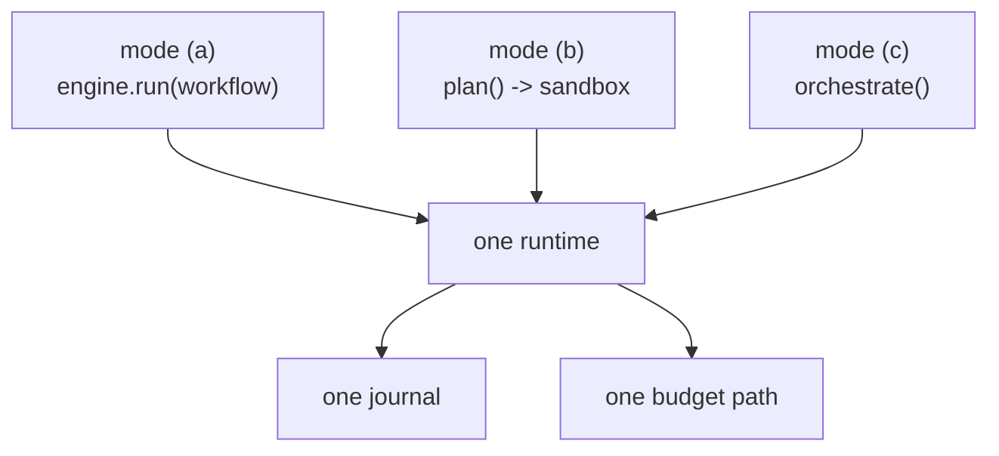

# Orchestration modes

Rulvar gives you exactly three answers to the question "who decides what runs next": a person, a planner model that writes the whole script once before anything executes, or an orchestrator model that decides live, turn by turn. All three run on the same subagent runtime, write the same journal, and pass through the same three-layer budget. Switching modes changes who authors control flow; it never changes durability, budget enforcement, replay semantics, or observability.

```bash
pnpm add @rulvar/core @rulvar/anthropic   # mode (a): human scripts
pnpm add @rulvar/planner                  # mode (b): the flagship hybrid
pnpm add @rulvar/plan                     # mode (c) extension: PlanRunner
```

## One path, three authors


```mermaid
flowchart TB
    A["mode (a)<br>engine.run(workflow)"] --> E
    B["mode (b)<br>plan() -> sandbox"] --> E
    C["mode (c)<br>orchestrate()"] --> E
    E[one runtime] --> J[one journal]
    E --> BU[one budget path]
```

| Mode | Control flow authored by | Executes in | Ships in |
|---|---|---|---|
| (a) Human scripts | You, as an async TypeScript function | Your process, via `InProcessRunner` | `@rulvar/core` |
| (b) Flagship hybrid | A planner model, once, before execution | The worker sandbox, via `WorkerSandboxRunner` | `@rulvar/planner` |
| (c) Dynamic orchestrator | An orchestrator agent with typed spawn tools | The agent runtime | `@rulvar/core`, extended by `@rulvar/plan` |

Because the runtime is shared, everything on this page composes: a human script can nest an orchestrator with `ctx.orchestrate`, a planner-written script spawns the same agent profiles a human script would, and every one of them replays from the same journal on resume.

## Mode (a): human scripts

You write an ordinary async function against the `Ctx` API and run it in process. Determinism is enforced by convention, lint (`eslint-plugin-rulvar`), and the journaled `ctx.now()` / `ctx.random()` / `ctx.uuid()` shims, not by a VM: under the memoizing journal only the sequence of content keys must be stable, so your code keeps full ecosystem access.

```ts
import { createEngine, defineWorkflow } from "@rulvar/core";
import { anthropic } from "@rulvar/anthropic";

const engine = createEngine({
  adapters: [anthropic()],
  defaults: { routing: { loop: "anthropic:claude-sonnet-5" } },
});

const review = defineWorkflow(
  { name: "review-corpus" },
  async (ctx, args: { files: string[] }) => {
    const notes = await ctx.phase("survey", () =>
      ctx.parallel(
        args.files.map((f) => () => ctx.agent(`Summarize the risks in ${f}`)),
      ),
    );
    return ctx.phase("report", () =>
      ctx.agent(`Write a combined risk report:\n${notes.join("\n")}`),
    );
  },
);

const handle = engine.run(review, { files: ["auth.ts", "billing.ts"] }, {
  budgetUsd: 5,
});
const outcome = await handle.result;
```

This shape, `ctx.phase` plus nested `ctx.workflow`, replanning only between phases over compact artifacts with fresh context, is the phase chain: the documented default for most users. See [Workflows](/guide/workflows) for the full `Ctx` surface and [Determinism](/guide/determinism) for the lint rules.

## Mode (b): the flagship hybrid

The flagship mode splits planning from execution. A planner model (invocation role `plan`) writes a script against two cards: the API card (`apiCard()`, the sandbox dialect) and the profile card (`engine.profileCard()`, your registered agent profiles). The draft is linted with the `eslint-plugin-rulvar` workflows preset; machine-readable JSON diagnostics feed a self-repair loop of up to `repairRounds` rounds (default 3). The accepted draft passes `compileScript`, and the resulting `CompiledWorkflow` executes deterministically in the worker sandbox.

You get model-authored control flow with none of the runtime improvisation: by the time a single dollar is spent on execution, the plan is frozen source you can read, diff, and re-run.

```ts
import { createEngine } from "@rulvar/core";
import { anthropic } from "@rulvar/anthropic";
import { WorkerSandboxRunner, plan, runPlanned } from "@rulvar/planner";

const engine = createEngine({
  adapters: [anthropic()],
  defaults: {
    routing: {
      plan: "anthropic:claude-opus-4-8",
      loop: "anthropic:claude-sonnet-5",
    },
    profiles: {
      researcher: { description: "Finds and cites primary sources." },
      writer: { description: "Turns research notes into prose." },
    },
  },
  runners: { sandbox: new WorkerSandboxRunner() },
});

const planned = await plan(engine, "Research and draft a migration guide", {
  run: { budgetUsd: 1 }, // the planning conversation's own immutable ceiling
});
console.log(planned.source); // read the script before you pay for execution
const handle = engine.run(planned.workflow, {}, { budgetUsd: 10 });

// Or compose plan-then-run in one call, each leg under its own ceiling
// (the bare runPlanned(engine, goal) form runs BOTH legs unbounded):
const direct = await runPlanned(engine, "Research and draft a migration guide", null, {
  plan: { run: { budgetUsd: 1 } },
  run: { budgetUsd: 10 },
});
```

The sandbox (a `worker_threads` worker) executes the script against a curated global scope of `agent`, `parallel`, `pipeline`, `step`, `phase`, `log`, `budget`, `workflow`, `awaitExternal`, `now`, `random`, and `uuid`, bound as bare names. `Date.now` and `Math.random` are replaced by seeded, journaled shims; `fetch` and `process` are unbound; `import` is admitted only for an allowlisted literal specifier (default none), and `compileScript` also rejects dynamic code generation (`eval`, the `Function` constructor, and constructor reconstruction in every statically visible form) with the same AST policy the lint uses, while the worker neutralizes the runtime reconstruction path for a key it cannot see statically, so the import ban cannot simply be rebuilt at runtime; every primitive call crosses to the host as validated JSON. Scripts run under the `lenient` error policy, child workflows are referenced by registered name, and breaching the runner's `timeoutMs` (default 300000) or `memoryMb` (default 512) terminates the worker with a typed error. A script attaches tools to an agent spawn by registered toolset name (`tools: ['lookup-set']`): the names come from engine `defaults.toolsets`, are listed on the profile card, and an unknown name is a typed `ConfigError` at spawn time. The sandbox is a determinism and blast radius boundary, not a security boundary: the compile bans and the worker unbinding `eval` and `Function` and neutralizing the constructor reconstruction path bar a casual or an injection nudged escape but not a hostile author, since a worker in the same process shares its intrinsics with the code it runs. The current release enforces only the in-process tool executor; a git worktree isolates file changes and the working directory, never processes or the network. Containing genuinely hostile tool code requires an executor you build and operate (subprocess, container, or OS sandbox) with its own threat model (see [Tools](/guide/tools#executors)).

Planning itself is an ordinary journaled run whose id derives deterministically from the goal, so replanning after a failure resumes the same planning journal and replays the unchanged prefix of the conversation for free, exactly as the never-pay-twice invariant promises. The full pipeline, dialect, and repair loop are documented in [Planner](/guide/planner).

## Mode (c): the dynamic orchestrator

When the plan cannot be written up front, hand control flow to an orchestrator: an ordinary agent (invocation role `orchestrate`) holding typed spawn tools. It is not a framework bolted onto the engine; every spawn is a journal entry, every dynamic decision is a decision entry written before its effects, and orchestrator turns are checkpointed mandatorily at turn boundaries.

| Tool | Available | Purpose |
|---|---|---|
| `spawn_agent` | base toolset | Admit and schedule one child agent |
| `parallel_agents` | base toolset | Admit and schedule several children at once |
| `await_any` / `await_all` | base toolset | Wait on spawn handles |
| `cancel_agent` | base toolset | Cancel an in-flight child |
| `wait_for_events` | base toolset | Sleep until a coalesced wake digest |
| `finish` | base toolset | Terminate the run with a result |
| `plan_view` / `plan_revise` | PlanRunner extension | Read and revise the typed plan |
| `escalate` | worker profiles that opt in | A child's typed "this is bigger than me" report; never on the orchestrator itself |

```ts
import { orchestrate } from "@rulvar/core";

const audit = orchestrate(
  engine,
  "Audit the public API for breaking changes",
  {
    profiles: ["researcher", "writer"],
    maxSpawns: 24,
    budget: { capFraction: 0.15, finalizeReserveUsd: 0.5 },
  },
  // The run ceiling that binds everyone; the budget block above is only
  // the orchestrator's own sub-account within it.
  { budgetUsd: 10 },
);

const outcome = await audit.result;
// outcome.status is 'ok' | 'error' | 'cancelled' | 'exhausted' | 'suspended';
// exhaustion is never null: partial results and a full cost report survive.
```

The orchestrator never sees or names concrete models; it picks agent profiles from the same profile card that mode (b)'s planner reads, so both machine modes speak one agent vocabulary. With `profiles` passed in the options, that vocabulary is an ENFORCED allowlist (RV1011): the advertisement is filtered and the dispatch resolves from the same filtered set, so a spawn naming a registered-but-hidden profile refuses typed before admission instead of widening the vocabulary by a guessed name. The vocabulary is exactly what the host REGISTERED, nothing inherited (RV1205): profile maps are read as own properties and the advertised set is built with a null prototype, so an agentType naming a JavaScript prototype member (`toString`, `constructor`, `__proto__`) resolves no profile at any layer, refuses typed like any unregistered name, and burns no admission slot. It used to pass the allowlist through the prototype chain and consume the slot before dying on the inherited value. Its own spend is bounded by a dedicated budget sub-account (`capUsd` / `capFraction` with a finalize reserve), on top of the run ceiling that binds everyone. A nested form, `ctx.orchestrate(goal, opts)`, runs the same implementation under the admission controller of a parent workflow. `maxSpawns` counts ADMITTED children, never attempts (v1.81, the sixth comparison run): an admission-rejected spawn (budget, quota, depth) spends nothing and consumes no slot, so the orchestrator can retry a rejected role at a viable budget instead of losing the mandate to a transient rejection, while attempt volume stays bounded by the coordination turn's own tool budget; the run 2 shape, where a burned slot refused a perfect retry with `orchestrate maxSpawns 4 reached`, is gone.

Rather than polling, the orchestrator sleeps on `wait_for_events` and is woken by a coalesced wake digest: summaries ordered by spawn ordinal, never raw transcripts, so its context grows with the number of wakes rather than the number of children. A quiescence trigger is always armed, and every guard in the machinery has a non-HITL terminating fallback: an embedded run with no operator present always terminates rather than hanging.

Two contracts to hold in mind when you consume mode (c) results:

- `await_any` and `await_all` return `TaskDigest` values, not full child reports: `status`, `costUsd`, the artifact id index, and an `outputSummary` deterministically truncated to the digest render budget (400 characters by default). The digest is a wake signal, not the result channel; a child whose full output matters should return compact structured output or write artifacts. The full output IS durable (the child's terminal journal entry holds it), and `exposeChildResultTools` below lets the orchestrator page it in place.
- Run status `ok` proves that `finish({ result })` validated, and nothing more. The model may call `finish` after any mix of child outcomes, so `ok` alone never proves the children succeeded. When that distinction matters, set the acceptance policy below; when the result itself must carry required structure or evidence, add the finish validators one section further down. A budget cap settle is separately marked (RV906): under the default `atCap: 'finish-with-partial'` the capped terminal settles `ok` with the completion envelope `{ result, completion: 'partial' }` as its value (`'complete'` only when the finalizer's finish provably passed the FULL declared contract), the finalize fallback ends `exhausted` with the same `completion: 'partial'` claim, and `budget.atCap: 'fail-run'` is the typed `fail_run` error, so no capped terminal reads as an unmarked plain `ok`; see [the at-cap protocol](/guide/budgets#the-orchestrator-budget-sub-account).

### Acceptance: the child completion policy

`acceptance` turns "the model called finish" into a checked completion contract. When set, the policy is evaluated exactly when `finish` validates, the verdict is journaled as one decision entry (so a resume rolls the same verdict forward, immune to drift of the live options and to children whose settle raced the finish), and the workflow result becomes the acceptance envelope.

```ts
const audited = orchestrate(
  engine,
  "Audit the public API for breaking changes",
  {
    profiles: ["researcher", "writer"],
    // 'all-ok' demands every spawned child settled 'ok' at finish;
    // { minSuccessful: N } tolerates failures beyond the first N successes.
    acceptance: { childPolicy: "all-ok" },
  },
  { budgetUsd: 10 },
);

const outcome = await audited.result;
// With acceptance set, outcome.value is the envelope:
//   { result, completion: 'complete' | 'partial',
//     childStatusCounts: { ok: 4, ... }, degradedReasons: [...] }
// and the outcome itself mirrors the lifted fields on EVERY path,
// the typed rejection included: outcome.completion,
// outcome.childStatusCounts (the same values run:end carries).
```

A violated policy fails the run instead of settling `ok`: the outcome is `error` with the typed `FailRunError` (code `fail_run`, `data.source` `'orchestrator_acceptance'`), carrying the child status counts and the degraded reasons. Under `'all-ok'`, a child still running when `finish` validates counts against the policy, and so does a deliberately cancelled straggler; zero spawned children are vacuously complete. Under `{ minSuccessful: N }`, an accepted result with any non `ok` child reports `completion: 'partial'` and names every degraded child in `degradedReasons`. Both policies judge only the children that exist, which lets a fan-out-shaped task settle `ok` without ever fanning out; the opt-in `minSpawnedChildren: N` (RV507) closes that gap by rejecting a finish whose spawned roster is smaller than N under either policy, with the actual `spawnedChildren` count carried beside the configured floor in the journaled decision and in a rejection's error data. Policy only, like the rest of acceptance: a resume rolls the journaled verdict forward even when the live options drifted. Without `acceptance`, the result value stays the raw finish payload and no new journal entry is written, exactly as before.

The CLI pairs with the envelope: `rulvar run --strict` (and `resume --strict`) exits nonzero when a settled `ok` value carries `completion: 'partial'`, printing the degraded reasons, so scripts can demand complete orchestrations without parsing the value themselves.

Gate on the (`status`, `completion`) PAIR, never on `status` alone: an accepted degraded run is `status: 'ok'` with `completion: 'partial'`, and a pipeline that checks only the status treats every salvage as a full success. The envelope, the outcome, and `run:end` all carry `acceptanceChildren` (RV806), the per-child machine roster of the same journaled decision: each spawned child with its settled status, the salvage arm that accepted it (`'partial'` or `'terminal-output'`), and, where the child declared an [evidence contract](/guide/agents#the-recommended-tool-budget-posture), the evidence verdict `{ recordedEntries, minEntries, met }` with `waivedBySalvage: true` on a below-floor child a salvage arm accepted anyway. The twelfth comparison experiment accepted two below-floor children through salvage and nothing machine-readable said so; a host that must not ship waived evidence gates on `acceptanceChildren.some((c) => c.evidence?.waivedBySalvage === true)` instead of re-deriving it from name lists, and `rulvar inspect` prints the same roster (`evidence w2: 1 of 2 (below floor, waived by salvage)`) from the journaled decision.

A host that must not merely DETECT waived evidence but refuse it sets `acceptance.requireEvidenceFloor: true` (RV1207): a child that declared an evidence contract it did not meet is then never promoted by a salvage arm, so it counts against the policy exactly like an unsalvageable `limit` child, `'all-ok'` rejects, and `{ minSuccessful: N }` does not count it toward N. The sixteenth comparison run is the case that named it: a worker settled `limit` with 10 of 14 declared entries, terminal-output salvage promoted it with the floor waived, and the run reported `status: 'ok'` with `completion: 'partial'` over an unmet contract. Salvage stays DIAGNOSTIC under the option: the roster still records the arm that would have applied and the evidence verdict (marked `floorRequired: true` instead of `waivedBySalvage: true`), the `degradedReasons` name the shortfall with its counts, and the child's output stays visible through the digest and `get_child_result` exactly as before. A child with no declared contract, or one that met its floor, is untouched.

### Partial-child salvage and profile templates

Both policies used to treat a `limit` child as a plain failure, which made budget expiry doubly expensive: the child's paid work was lost AND the run rejected. With the [progress contract](/guide/tools#the-progress-contract-and-the-structured-terminal-partial) in the child's toolset, the collected work survives the expiry as the structured terminal partial, and `acceptance.acceptPartialChildren: true` lets the policy salvage it:

```ts
import { createEngine, orchestrate, researchAgentProfile } from "@rulvar/core";
import { anthropic } from "@rulvar/anthropic";

const research = researchAgentProfile({ root: "/work/checkout" });
const engine = createEngine({
  adapters: [anthropic()],
  defaults: {
    // The template ships the research toolset, report_progress, and the
    // stop conditions (weighted units, per-tool caps, both repetition
    // guards, budget notices) already merged into limits.
    profiles: { researcher: research.profile },
  },
});

const handle = orchestrate(
  engine,
  "Map the error handling of this repository",
  {
    profiles: ["researcher"],
    acceptance: { childPolicy: "all-ok", acceptPartialChildren: true },
    exposeChildResultTools: true,
  },
  { budgetUsd: 10 },
);
const outcome = await handle.result;
// A researcher that ran out of budget AFTER reporting progress no longer
// rejects the run: the envelope reports completion 'partial' and lists it
// in salvagedPartialChildren; its digest carried `partial: {...}` and
// get_child_result paged the full report. The host still reads every
// verified citation: research.evidence().
```

A child that settled `limit` WITH a partial counts as a successful child for the policy: under `'all-ok'` it no longer rejects the run, and under `{ minSuccessful: N }` it counts toward N. The accepted envelope then reports `completion: 'partial'` (never `'complete'`), lists the salvaged children in `salvagedPartialChildren`, and keeps a per-child note in `degradedReasons`; the whole fold is part of the single journaled acceptance decision, so a resume rolls the same verdict forward. A limit child WITHOUT a partial gave the caller nothing to salvage and still counts against the policy, salvage or not. Enabling the option also appends one deterministic line to the coordination prompt telling the orchestrator that partial children are salvageable and that respawning a NARROWED child carrying the partial beats repeating the task; every other configuration keeps byte-identical prompts.

The progress report is not the only thing a limit child can leave behind. A child whose profile carries [`limits.finalizationReserve`](/guide/agents#the-finalization-reserve) gets one summary turn at a tool-budget expiry, and when its declared output schema rides the loop turn, that summary validates into TYPED output on the same `limit` terminal, journaled and replayable. The digest of such a child appends `final: {...}` beside any `partial: {...}` segment, and `get_child_result` pages the full output; that surfacing is unconditional, because paid, journaled evidence is never withheld from the orchestrator. Whether acceptance may COUNT that child as a success is the opt-in `acceptance.acceptValidatedTerminalOutputOnLimit`:

```ts
const salvaged = orchestrate(
  engine,
  "Map the error handling of this repository",
  {
    profiles: ["researcher"],
    acceptance: {
      childPolicy: "all-ok",
      // A limit child whose reserve summary VALIDATED into output counts
      // as a success; an invalid summary keeps output null and still
      // rejects, so validation always runs before acceptance.
      acceptValidatedTerminalOutputOnLimit: true,
    },
  },
  { budgetUsd: 10 },
);
```

The accepted envelope reports `completion: 'partial'` and lists such children in `salvagedTerminalOutputChildren` (a child carrying BOTH an output and a progress partial salvages by its output, the stronger evidence, and appears only there). A limit child whose summary failed schema validation carries `output: null` and is never salvaged: the validation the child's own contract demanded runs BEFORE acceptance by construction. The option also appends its own deterministic coordination prompt line and marks the child on the finish validation input (`FinishValidationChild.salvageableOutput`), which is what lets `evidencePreservedValidator` below count the salvaged child's citations; everything else stays byte-identical without it.

Three profile templates package the stop conditions so hosts stop hand-tuning limits per fan-out: `researchAgentProfile({ root })` (the research toolset plus the progress tool plus `RESEARCH_PROFILE_LIMITS`), and `implementationAgentProfile({ tools })` / `reviewAgentProfile({ tools })` (the caller's task tools with `report_progress` prepended, under `IMPLEMENTATION_PROFILE_LIMITS` / `REVIEW_PROFILE_LIMITS`). Templates are pure preset builders: `limits` overrides merge per key over the template's limits, and the exported limit constants document the exact defaults. One research kit instance backs one research profile, so children spawned from the same registered profile pool their verified evidence (and see each other's entries through `list_evidence`); construct one template per fan-out run, or per child, when isolation matters.

### Validating the finish result

`acceptance` judges the children; it never reads the result itself, so a schema valid but semantically empty `finish({ result: "all good, trust me" })` still lands as `completion: 'complete'`. `finishValidation` closes that gap with deterministic host validators over the finish result, plus a bounded repair loop.

```ts
import {
  minMatchesValidator,
  requiredSectionsValidator,
} from "@rulvar/core";

const audited = orchestrate(
  engine,
  "Audit the module; the report needs FINDINGS, EVIDENCE, and citations",
  {
    profiles: ["reviewer"],
    finishValidation: {
      validators: [
        requiredSectionsValidator({ sections: ["FINDINGS", "EVIDENCE"] }),
        // At least three file:line citations anywhere in the result text.
        minMatchesValidator({ pattern: "[\\w/.]+\\.ts:\\d+", min: 3, name: "citations" }),
      ],
      maxRepairs: 1, // the default: repair once, then fail
    },
  },
  { budgetUsd: 10 },
);
```

Every schema valid `finish` call first passes the validators, in configuration order. On a rejection the failure reasons return to the model as the call's error tool result and the turn continues: the model repairs the result and calls `finish` again. `maxRepairs` bounds how many rejected finishes are granted that repair turn (default one; zero fails on the first rejection). A rejection past the bound fails the run with the typed `FailRunError` (code `fail_run`, `data.source` `'orchestrator_finish_validation'`, the failed validators and their reasons in `data`), and it fires BEFORE the acceptance settle, so acceptance never judges a finish the validators rejected.

Every verdict (accepted, repair, rejected) journals as one decision entry keyed by the finish call id, so a resume rolls the same verdicts forward without re-running validator code and the whole exchange replays without new paid calls; a journaled final rejection even short circuits at boot, before any model call. The toolset never changes (the contract reaches the model through the orchestrator prompt), and zero configuration adds zero journal entries.

The built in validators cover the plan's mechanical checks: `requiredSectionsValidator` (literal section markers in the result text), `requiredFieldsValidator` (object fields present and not empty strings), `minMatchesValidator` (at least N regex matches, the citation and source counts), `wordCountValidator` (the word count inside declared bounds, whitespace separated tokens), `sectionCitationsValidator` (at least N pattern matches INSIDE every named section, because a total count hides sections carrying zero provenance), and `headingStructureValidator` (v1.81: the markdown headings of one level held to the declared set, in declaration order, no heading repeated and none undeclared, with fenced code always stripped first; line presence via `sectionsMatch: 'line'` proves each heading EXISTS, and this validator proves the document carries them in order without extras, the sixth comparison judge's P1.3). Anything else is a custom `FinishValidator`: a `name` unique within the call and a synchronous, deterministic `validate(input)`. A validator that throws is a host defect: the run fails as `ConfigError`, nothing journals, and no repair turn is spent on it.

### The output contract

`requiredSectionsValidator({ sections: OLD })` beside a goal that names NEW sections is the drift none of the machinery above can catch: the prompt and the validators are two sources of truth maintained by hand in two places. The v1.71 experiment burned a full paid run on exactly that mismatch: the question renamed three sections, the harness validator kept the old names, and a correct schema-valid answer was rejected until the synthesis turn ceiling. `finishContract` collapses the two sources into one manifest.

```ts
import { finishContract, orchestrate } from "@rulvar/core";

const contract = finishContract({
  sections: ["## Findings", "## Evidence", "## Risks"],
  words: { min: 400, max: 1200 },
  citations: { min: 12, perSection: 2 },
});

const audited = orchestrate(
  engine,
  ["Audit the module.", ...contract.promptLines].join("\n"),
  {
    profiles: ["reviewer"],
    finishValidation: { validators: contract.validators, contract },
  },
  { budgetUsd: 10 },
);
```

One manifest generates everything: the stock validator set (`contract-sections`, `contract-words`, `contract-citations`, `contract-section-citations`, riding the validators above), the prompt statement (`promptLines`, injected into the coordination AND synthesis prompts automatically whenever the contract is configured, so even a goal that forgets to embed them still tells the model the demands), a stable `hash` (sha256 over the JCS form of the normalized manifest), and golden self-test fixtures. Construction is where contradictions die: a manifest whose mandatory content alone exceeds `words.max`, a custom citation pattern without a `sample` to embed in the goldens, `perSection` without `sections`, each a `ConfigError` before any run exists.

The golden self test is the teeth. At workflow construction, BEFORE any provider call, every configured validator must accept the contract's `goldenAccept` skeleton, and at least one must reject `goldenReject` (a set that accepts the known-bad input validates nothing). A stale hand-written validator still demanding last month's sections rejects the fresh skeleton and construction throws, naming the validator and the exact missing markers, at a cost of zero dollars; the same drift declared to `preflightEstimate({ finishValidation: { validators, contract } })` reports as the error finding `output-contract-validator-mismatch` beside the quota and budget findings instead of throwing (programmatic only: validator functions cannot ride a JSON config file). Hosts with custom validators pass `selfTest: { accept, reject }` fixtures those validators actually accept; fixtures without a contract run standalone. Every contract validator must also appear in `finishValidation.validators` by name, so a promised contract nobody enforces is a `ConfigError`, never a silent lie. Since v1.78 the contract also carries one reject golden PER validator (`goldenRejects`), each proven at construction against the contract's own instance, and the self test holds the CONFIGURED validator of each name against its golden: a same-name replacement weaker than the contract's own validator (a words minimum of one standing in for fifty) is a `ConfigError` at construction and the error finding `output-contract-validator-weakened` in preflight, where the single shared reject fixture would have passed on the strength of an unrelated validator.

The bundle descriptor freezes what validated the run. With a contract configured, the journal records one decision entry (`decisionType 'orchestrator_finish_validation_bundle'`) carrying the contract hash, the validator names, and `maxRepairs`. A resume under the same contract appends nothing; a resume under a FIXED contract appends a superseding descriptor (`supersedes: <old hash>`) instead of failing, because repairing a stale validator and resuming is the intended remedy of exactly the failure the self test exists for. Without a contract the journal stays byte identical, so every existing configuration keeps its exact entries.

The remedy is generation-scoped (v1.77). Every finish-validation decision written under a contract carries `contractHash`, and only the CURRENT generation is judged: `repairsUsed` counts the current generation's rejections alone, so a fixed contract starts with the full repair budget back, and a final rejection a superseded generation left in the crash window (the `rejected` decision durable, the run terminal never written) neither rolls forward at boot nor re-arms when its exchange replays. The stale exchange replays byte identical, feedback included, and the loop continues into a live repair turn judged by the fixed contract; a run that already SETTLED with the failure stays settled, because the scoping rescues the crash window, never a terminal outcome. Decisions recorded before 1.77 carry no hash and bind to the current contract only while the journal holds a single bundle descriptor; once a supersession is recorded they are stale, which is exactly the conservative reading that makes the documented fix-and-resume remedy work for old journals too.

The bundle is exact (v1.78). `finishContract` deep-freezes everything it returns, the nested manifest objects, the sections array, the validators array, and each validator object, so a post-construction mutation throws a `TypeError` instead of silently diverging enforcement from the journaled hash (before v1.78, pushing into `manifest.sections` changed the live validator through a shared array reference while `hash` kept claiming the original manifest). Two manifest knobs sharpen matching. `sectionsMatch: 'line'` demands each marker as its own line, so a mid-sentence mention or a quoted marker no longer satisfies a heading. `fencedCode: 'excluded'` removes fenced code blocks (three-or-more backticks or tildes, the exported `stripFencedBlocks` grammar) before section matching, per-section slicing, word counting, and citation matching, so code samples can neither pad `words.min` nor donate citations, and a fenced marker occurrence can no longer mis-anchor a section's citation slice onto text that precedes its real heading. Both knobs default to the historical behavior, normalize away when declared at their defaults, join the hash and the prompt statement only when non-default, and exist on the standalone validators too (`match` on `requiredSectionsValidator` and `sectionCitationsValidator`, `fencedCode` on those plus `wordCountValidator` and `minMatchesValidator`) for hosts composing their own sets.

### Preserving the children's evidence

Counting citations in the result is not the same as keeping the ones the specialists actually produced: a finish can drop three of four real `file:line` citations, fabricate three plausible ones, and still satisfy `minMatchesValidator`. The validation input therefore carries `children`: every spawned child at finish time, in spawn order, each with its `handle`, `nodeId`, terminal `status`, and full output `text` (a pure read of the state the orchestrator already tracks). `evidencePreservedValidator` builds the provenance contract on top of it.

```ts
import { evidencePreservedValidator, orchestrate } from "@rulvar/core";

const audited = orchestrate(
  engine,
  "Audit the module and cite evidence",
  {
    profiles: ["reviewer"],
    finishValidation: {
      validators: [
        // Default pattern: a path with an extension, a colon, a line
        // number. Default minShare 0.95, the plan's preservation gate.
        // requireKnown also rejects citations no child ever produced.
        evidencePreservedValidator({ requireKnown: true }),
      ],
    },
  },
  { budgetUsd: 10 },
);
```

Distinct pattern matches are collected across the outputs of children settled `ok`, plus any limit child the runtime marked `salvageableOutput` (present only under `acceptance.acceptValidatedTerminalOutputOnLimit`: acceptance will count that child as a success, so its validated output is part of the evidence, and with `requireKnown` the orchestrator quoting it is no longer flagged as fabricating); at least `minShare` of them must appear literally in the result text, and the rejection lists exactly the missing ones (capped at 20) so the repair turn can restore them. Zero child citations pass vacuously, unless `requireNonEmptyPool: true` (RV507): for an evidence-critical run the empty pool IS the failure, so that mode refuses the finish with an `empty child citation pool` reason instead of standing down, and the repair turn (or the run's error) says out loud that no child produced a single matching citation. With `requireKnown: true` the contract also runs in reverse: a citation in the result that no child ever produced is rejected as unknown, which closes the fabrication path. The contract is purely textual and deterministic; verifying that cited targets exist on disk stays host territory (a custom validator). Custom validators get the same `children` input, so any provenance rule the goal demands (per child minimums, required sections per specialist) is a few lines of host code.

Two honest bounds: validators are HOST code, so they check mechanical properties (structure, counts, markers), not truth; and repair turns are PAID provider turns spending from the orchestrator's ordinary budget ceilings. By default they also compete with generation for the same `maxTurns` (`maxRepairs` bounds only how many rejections are tolerated), which is exactly how the v1.71 experiment lost a whole run: one malformed finish plus one validator rejection exhausted a three-turn synthesis budget before a correct candidate could land. `repairTurnReserve` closes that gap, the reserve RV-204 deliberately deferred: a nonnegative integer of EXTRA turns the invocation the validators bind (the synthesis invocation when `synthesis` is configured, the coordination loop otherwise) may consume past its `maxTurns`, one granted per rejected finish exchange, schema-invalid finish arguments and host validation rejections alike. The grants derive from the message window itself, so a resumed segment that restored mid-exchange recounts the same grants without journaling anything; the reserve folds into the preflight turn projection ([`projectedProviderTurns` and the run ceiling](/guide/budgets)) when declared there; and zero (the default) keeps the pre-1.73 ceiling byte identical. The budget cap paths changed posture in RV906: the declared validators now BIND the reserved finalize dispatch (on capped runs synthesis never runs, so that finish is the final output they must judge, with the same repair feedback and `repairTurnReserve` grants), while acceptance still never judges it, which is exactly why a capped terminal under a declared acceptance policy stays `completion: 'partial'`. A schema-invalid finish also gets [one deterministic second chance](/guide/agents#the-agent-loop-and-turns) BEFORE burning a grant: arguments the adapter delivered as an unparsed wrapper are re-parsed strictly and through one bounded normalization, and a recovered object that passes the finish schema proceeds as if it had parsed on the wire; the v1.74 comparison run durably proved three complete coordination drafts were recoverable exactly this way and were thrown away instead. Since v1.79 the finish is also admitted at an EXHAUSTED tool budget: terminal calls never consume `maxToolCalls` or `toolUnits`, and an exhausted budget no longer starves them either. The fifth comparison run failed exactly there: the synthesis tool cap equalled the child count, the mandatory `get_child_result` reads spent the whole budget, and the ready 3984 word finish was cut before validation, so no rejection existed to arm the reserve and the run failed closed with the candidate stranded in the transcript. Now the finish reaches validation, a rejection feeds the repair grants as usual, and non-terminal calls beside an admitted finish are answered with typed skipped results so the repair exchange keeps a well formed history.

### The synthesis invocation

Without further configuration the coordination loop composes the final answer itself, on the `orchestrate` model, indistinguishable in cost and telemetry from the coordination turns. The opt-in `synthesis` option splits that work off: the loop's `finish({ result })` becomes a DRAFT, and one fresh post-fan-in invocation with role `synthesize` composes the final run result from the goal, the draft, and the settled child digest (spawn order, the same deterministic distillation the awaits delivered), on the finish-only toolset.

```ts
const audited = orchestrate(
  engine,
  "Audit the module and synthesize the findings",
  {
    profiles: ["reviewer"],
    synthesis: {
      // Route the synthesis independently of coordination: a strong
      // model for the evidence-heavy merge, or a cheap one for a
      // mechanical merge under a strong coordinator. The routing key
      // 'synthesize' works at every layer too; this override wins.
      model: "anthropic:claude-opus-4-8",
      effort: "high",
      limits: { maxTurns: 4 }, // the default
      instructions: "Render the findings as FINDINGS / EVIDENCE sections.",
    },
  },
  { budgetUsd: 10 },
);
```

The invocation is an ordinary journaled agent entry: a resume replays it with zero paid calls (the prompt derives deterministically from journaled state), and its telemetry is a full span with role `synthesize` phase pairs, so `CostReport.byRole.synthesize` and [`reduceCriticalPath`](/guide/observability#agent-lifecycle) attribute its cost and wall share without heuristics; a debug `log` event (`orchestrator synthesis context`) reports the actual draft, digest, and prompt sizes entering it. Ordering and failure posture are strict: synthesis runs only AFTER an accepted acceptance verdict (a rejected run never pays for it), `finishValidation` validators bind the SYNTHESIS finish rather than the draft (the final output is what they must judge, same repair loop, same journaled verdicts), and a synthesis invocation that dies falls back to the coordination draft under a journaled `orchestrator_synthesis_fallback` decision and a warn log when no validators are configured, or fails the run typed (`data.source` `'orchestrator_synthesis'`) when they are, because an unvalidated draft cannot stand in for a validated result. Every typed synthesis failure also carries the terminal truth the run already earned (the v1.71 experiment's outcome showed `completion: null` beside four accepted children): the acceptance snapshot in FULL (`completion`, `childStatusCounts`, and since v1.77 `degradedReasons` plus the `salvagedPartialChildren`/`salvagedTerminalOutputChildren` lists when present, exactly what the ok envelope reports), which the completion mirror lifts onto the error outcome so an errored run still says "the fan-out work is complete, the failure is downstream", and, when validation decisions exist, the verdict-derived repair taxonomy (`repairsUsed`, `maxRepairs`, `rejectedValidators`) read from the journaled decisions of the current contract generation. Since v1.77 the failure data also counts the exchange class every other field misses: `schemaRejectedFinishExchanges`, the finish exchanges whose ARGUMENTS died at the schema gate across the coordination and synthesis windows (the v1.74 run lost six payloads to exactly this, visible only by reading the transcript). The counter is derived from the live message windows like the repair-reserve grants, so live and resumed segments count the same total; a boot roll-forward of the crash window has no window and carries the journal-derived fields alone, and a failure with no schema-dead exchange carries no counter field at all. Since v1.81 the recovered twin is durable too: `schemaRecoveredFinishExchanges` counts the near-JSON finish exchanges the unparsed second chance salvaged across the same two windows (previously only a warn log said so), riding the acceptance ok envelope and the typed failure data alike; a live process counter like `transportRetries` (pure telemetry, nothing downstream feeds on it), absent when zero so existing envelopes stay byte identical. The budget cap paths are unchanged: a capped run settles through the reserved finalizer and never reaches synthesis. Every designed skip is machine-readable (`OrchestrateSynthesisSkipReason`): the journaled decision that causes the skip freezes `synthesisSkipped` (`'synthesis_skipped_by_acceptance'` on the rejected acceptance decision, `'synthesis_skipped_by_budget_cap'` on the budget-cap decision, `'synthesis_skipped_by_valid_draft'` on the RV510 `orchestrator_synthesis_skip` decision of [the conditional gate below](#skipping-a-synthesis-the-draft-already-satisfies)), the typed `FailRunError` data of the failing paths carries the same field (the valid-draft skip is the one non-failing reason: the acceptance envelope reports it instead), and an info `log` event (`orchestrator synthesis skipped`) announces it beside the zero `synthesize` spend, on the live pass and on every resume roll-forward alike. The field is absent when synthesis is not configured or when it actually ran, so existing runs stay byte identical, and a consumer never has to infer the cause from the acceptance decision.

#### Evidence symmetry and the draft gate

The validators judge the synthesis finish against the FULL child outputs, but by default the synthesis model sees only the draft and the 400 char digest rows on a finish-only toolset: the design assumes a substantial draft carries the evidence forward. The v1.74 comparison run paid for the exception: six failed coordination finish exchanges collapsed the draft to `test`, the synthesis invocation was asked to preserve 66 citations it had no way to see, and it fabricated 33 targets, was correctly rejected, and the run ended with no answer. Four opt-ins close the gap, each byte identical when unset:

- **`synthesis.exposeChildResultTools`** gives the synthesis invocation the same [evidence tools](#reading-a-child-s-full-evidence) coordination can opt into, `get_child_result` and `read_child_artifact`. The digest rows in its prompt then carry each child's `handle`, and the model pages any settled child's full output or artifacts before finishing.
- **`synthesis.context: 'full'`** embeds a `CHILD OUTPUTS` section carrying every settled child's full serialized output after the digest rows, so the whole pool the validators judge against rides the prompt, paid as input tokens (declare `estCost` or the preflight `estInputTokens` accordingly).
- **`synthesis.evidenceIndex`** (RV808b) rides between those two costs: a deterministic `EVIDENCE INDEX:` line in the prompt lists, per settled child in spawn order, the DISTINCT citations its output actually carries, its artifact descriptors, and its output size in chars, without embedding a single full output. Citations are matches of the configured `pattern` (default the `evidencePreservedValidator` citation shape; `true` takes the defaults, an object overrides them, and a pattern that can match the empty string is refused at intake, fail closed) extracted ONLY from evidence-pool children, ok and salvage-accepted, exactly the pool `evidencePreservedValidator` judges, so nothing the index names is a citation the validators would reject as fabricated. With `exposeChildResultTools` the rows carry each child's `handle`, and the model pages exactly the child whose citation it needs instead of re-reading everything; the twelfth comparison run spent 357 s of synthesis on exactly that blind re-derivation. Folded only from replay-stable settled results, so a resumed synthesis re-derives identical prompt bytes; meaningless in mode `'incremental'` (no single synthesis prompt exists), a `ConfigError`.
- **`finishValidation.draftPolicy`** gates the draft itself: with `{ minWords, requireSections }` declared, a schema-valid but collapsed coordination finish is rejected as the call's error result BEFORE any paid synthesis dispatch. The checks are deterministic library text checks (the `wordCountValidator` and `requiredSectionsValidator` semantics), nothing journals (the rejected exchange is durable in the transcript and a resumed segment recounts identically), `maxRepairs` is not consumed, and `repairTurnReserve` grants coordination the same per-rejected-exchange headroom it grants the synthesis finish. `draftPolicy` without `synthesis` is a `ConfigError`: there the validators bind the coordination finish itself and there is no unvalidated draft to gate. The sentinel `draftPolicy: 'contract'` (RV808a) gates the draft by the FULL declared validator set instead of a hand-written subset, over the same children snapshot the synthesis-bound validation reads, and the rejection feedback names the failing validators. The twelfth comparison run showed what the subset costs: coordination repaired its draft only to the weak policy, the `skipWhenDraftValid` pre-pass then failed it against the full contract, and the run paid the whole synthesis plus its own repair for defects one coordination exchange could have fixed; under `'contract'` the coordination repair loop drives the draft toward exactly what the pre-pass will judge, which is what makes the skip reachable. Same posture otherwise: nothing journals, `maxRepairs` untouched. One honest bound: validators that fold the children snapshot (the evidence share) can still fail the pre-pass when a child settles between the draft finish and synthesis, so the pre-pass remains the authority.

Money is the fourth gap (v1.80, the sixth comparison run): the synthesis spends from the orchestrator's own sub-account, and a pricey coordination prefix can leave its turns a remainder the budget clamp shrinks below the contract's minimal accepting payload, cutting the finish at its output allowance before any tool call until `maxTurns` ends the invocation. The opt-in [`budget.synthesisReserveUsd`](/guide/budgets#the-orchestrator-budget-sub-account) holds the payload money through coordination and releases it to the synthesis invocation at dispatch; preflight reports `synthesis-reserve-unfunded` when a contract binds the synthesis without it.

`preflightEstimate` reports the asymmetric shape as the warning finding `synthesis-evidence-asymmetry` when evidence-demanding validators (the stock names `evidence-preserved`, `contract-citations`, `contract-section-citations`, or a contract with `citations`) are declared over a digest-blind synthesis with no read tools; declaring `synthesis.exposeChildResultTools` or `synthesis.context: 'full'` in the preflight input keeps it quiet.

#### Skipping a synthesis the draft already satisfies

The ninth comparison run paid for the opposite failure: the synthesis invocation returned the byte-identical draft text (the output SHA matched), after 101.3 s and 0.5512 USD, with post-fan-in work at 57.3% of wall time. When a strong coordination draft already meets the declared contract, the composing step buys nothing. The opt-in `synthesis.skipWhenDraftValid: true` (RV510) closes exactly that case with a deterministic gate, never a heuristic: before the synthesis span starts, the coordination draft is run through the FULL declared finish contract, the same `finishValidation.validators` that would bind the synthesis finish, over the same children snapshot. A draft that passes every validator becomes the final result without the synthesis invocation ever dispatching, under a journaled `orchestrator_synthesis_skip` decision carrying the reason `'synthesis_skipped_by_valid_draft'`, the validator names, the contract hash when a `finishValidation.contract` is declared, and the hash of the draft it judged, so a resume rolls the skip forward with zero paid calls; the info `log` event and the acceptance envelope's `synthesisSkipped` field carry the same reason. That verdict is the authority only for the generation and the draft it judged (RV603): the documented remedy for a broken contract is to fix it and resume, so a skip whose contract has been superseded, whose draft is no longer the one in hand, or whose validator names no longer match is not reused, and the gate re-runs on the current contract. Without a `contract` descriptor there is no generation identity to compare, and the binding falls back to the draft hash plus the validator names, which is honestly weaker: a same-name validator whose behavior changed underneath cannot be told apart. Entries journaled before this binding existed carry no draft hash and stay reusable, so runs in flight roll forward unchanged. A draft that fails any validator goes to synthesis exactly as before: the pre-pass journals nothing (a pure function of the draft re-derives identically on resume) and never spends `maxRepairs`.

The option requires `finishValidation`, a `ConfigError` at intake otherwise: without a declared contract there is nothing to judge the draft valid by, and a gate that vacuously passed would silently disable the synthesis you configured. That requirement transitively limits it to mode `'single'` (incremental mode already rejects validators). With a configured `budget.synthesisReserveUsd` the held payload money is released unconsumed on the skip and no reserve lifecycle decision journals: there was no synthesis invocation to account. Composes with `draftPolicy` naturally: the draft gate rejects collapsed drafts during coordination, and this gate retires the synthesis step when the surviving draft is already contract-complete, so the two bound the composing spend from both sides.

A FAILED pre-pass used to discard its verdict entirely, and the twelfth comparison run measured the price: 80.157% of wall time after fan-in, the coordinator's draft work followed by a synthesis that re-derived the whole document blind to which validators the draft had already failed, then failed the same contract once more itself. The opt-in `synthesis.carryDraftGaps: true` (RV808a, requires `skipWhenDraftValid`) converts that discarded verdict into targeted work: a failing pre-pass journals its verdict as an `orchestrator_synthesis_draft_gaps` decision (the failed validator names with their reasons, bound to the contract generation and the draft hash exactly like the skip decision), and the synthesis prompt gains a `DRAFT CONTRACT GAPS:` line naming those failures with the instruction to repair the named gaps and preserve the draft otherwise. A resume reuses the journaled verdict without re-running a validator, so the prompt bytes re-derive identically and the paid invocation replays; an info `log` event (`orchestrator synthesis draft gaps carried`) names the failed validators and the decision it read. Default off: no decision entry and byte-identical prompt bytes. The recommended pairing for the post-fan-in window is `draftPolicy: 'contract'` plus `skipWhenDraftValid` plus `carryDraftGaps`: coordination repairs drive the draft to contract validity, a valid draft retires synthesis entirely, and when it still falls short the synthesis starts from the named gaps instead of from zero.

#### Sectional repair: resubmit only the violated sections

Every repair exchange above still pays for a whole document: a rejected finish resends the full result to fix one violated section, and on the twelfth comparison run the coordination draft plus its repairs alone cost 406 s of model output. The opt-in `finishValidation.sectionalRepair: { sections: [...] }` (RV808b) declares the marker lines that partition the document and teaches every gated finish a second repair shape: after a rejection, the model may call `finish({ sections: { '<declared marker>': '<new section body>' } })` and the host splices the patch into the RETAINED rejected attempt, line anchored (a section runs from the first line equal to its marker to the next declared marker line; a declared marker absent from the attempt is appended at the end, in declared order, which is how a repair ADDS a section a validator demanded), then validates the reconstructed document whole. The splice is the exported `spliceSections` function, so custom hosts stay symmetric with the runtime.

The vocabulary rides every finish the host actually gates: the validator-bound finish (the synthesis invocation when `synthesis` is configured, the coordination loop otherwise) and, when a `draftPolicy` is declared, the coordination draft gate. The synthesis invocation is additionally SEEDED with the coordination draft as its retained base, so a synthesis that agrees with the draft repairs only the named gaps without ever resending it; with `carryDraftGaps` the prompt names exactly which sections those are, and the whole post-fan-in window collapses to one small patch. Mechanics refusals (`sections` beside `result`, an undeclared marker, no retained attempt to splice into) are typed error results, the moral twin of a schema rejection: they journal nothing, spend no `maxRepairs`, and stay bounded by the turn budget; only the verdict over the SPLICED document spends the repair bound, and the accepted invocation output IS the reconstructed full document. Nothing new journals anywhere: the exchange is durable in the transcript and the splice is a pure function of it. Two honest bounds: sectional repair is a text-document vocabulary (a rejected JSON-object attempt clears the retained base, and the next sectional call is refused with the full-resubmission remedy), and the retained attempt lives in the invocation, so a segment resumed from a mid-invocation checkpoint refuses the first sectional call the same way (the synthesis seed re-derives from the journaled draft and never has this window). Declaring the option swaps the finish tool schema and description for the gated invocations, so their toolset hash moves BY DESIGN, the `exposeChildResultTools` precedent; absent, every byte stays identical.

The single post-fan-in merge puts the whole synthesis on the critical path: nothing composes until the last child settles, then one invocation reads everything at once. `synthesis.mode: 'incremental'` moves that work INTO the fan-out. Every settled child triggers ONE bounded `synthesize`-role NOTE invocation the moment it settles (default `noteLimits` `{ maxTurns: 2 }`, the finish-only toolset, the same `synthesize` routing), concurrent with the children still running, and the FINAL result is a DETERMINISTIC reconciliation, never another model call: an `IncrementalSynthesisResult` envelope carrying the draft and one section per settled child in spawn order, each with the child's terminal status, the note invocation's status, and the note text.

```ts
const research = orchestrate(
  engine,
  "Survey the repository and reconcile the findings",
  {
    profiles: ["researcher"],
    synthesis: {
      mode: "incremental",
      dedupeClaims: true,
      noteLimits: { maxTurns: 2 }, // the default
    },
  },
  { budgetUsd: 10 },
);
```

The tradeoffs are explicit, not hidden. Notes are paid DURING the run, so an acceptance rejection can no longer guarantee that a rejected run paid nothing toward synthesis (only the reconciliation itself is deferred past the verdict); and because the deterministic reconciliation has no model-composed finish for validators to bind, configuring `finishValidation` together with `mode: 'incremental'` is a `ConfigError` at intake. A note that dies falls back to that child's raw digest summary under a journaled per-child `orchestrator_synthesis_note_fallback` decision and a warn log. Replay identity holds end to end: the notes are ordinary journaled agent entries and the reconciliation is a pure fold over journaled state, so a resume reproduces the envelope byte for byte with zero paid calls. A debug `log` event (`orchestrator synthesis reconciliation`) reports the sizes, note spans overlap the fan-out in [`reduceCriticalPath`](/guide/observability#agent-lifecycle) (which is exactly how they shrink `postFanInShare`), and the cap paths are unchanged: a capped run settles through the reserved finalizer and never reconciles.

#### Deduplicating repeated claims

Parallel children often report the same finding, and the verbatim repeats ride into the synthesis model call buying nothing. `synthesis.dedupeClaims: true` dedupes BEFORE the model call: in `'single'` mode the digest entering the synthesis prompt keeps only the FIRST occurrence of every repeated line, with a `REPEATED CLAIMS` index (each claim with its reporters) riding the prompt beside it; in `'incremental'` mode the deterministic reconciliation dedupes the note texts the same way and the envelope carries the `repeatedClaims` index. Matching is whitespace-collapsed exact line equality via the exported pure `dedupeRepeatedClaims`, so two DISTINCT claims can never merge fuzzily. The option defaults to false, and the synthesis prompt stays byte-identical when unset: prompt bytes are journal identity, so a changed default would re-pay every existing synthesis on resume.

`synthesis.policyFacts: true` (RV709) adds one deterministic `POLICY FACTS:` line to the `'single'` synthesis prompt: a JSON digest of the settled children's durable tool-budget facts, child count and statuses, extension grants summed, and how many children entered their finalization window or spent their finalization reserve, so the composing model can cite the run's own observed evidence instead of underclaiming it. The line folds ONLY from replay-stable material (the settled child results the journal replays verbatim), so a resumed synthesis re-derives identical prompt bytes; off by default, and the prompt stays byte identical when unset, exactly like `dedupeClaims`. The worker-agent `finalize` invocation has the symmetric request-only opt-in on `runAgent` ([agents](/guide/agents)), which additionally carries live quota denial and recovery counters and the recorded spend with its cost basis.

### Reading a child's full evidence

The digest an await returns is a wake signal truncated to 400 characters, so an evidence heavy child (a research agent whose report carries dozens of `file:line` citations, say) settles with its findings intact in the journal but only a snippet in the digest. `exposeChildResultTools: true` adds two pure read tools the orchestrator can call AFTER a child settles.

```ts
const audit = orchestrate(
  engine,
  "Audit the codebase and cite every finding",
  {
    profiles: ["reviewer"],
    exposeChildResultTools: true,
  },
  { budgetUsd: 10 },
);
```

- `get_child_result(handle, offset?, maxChars?)` pages a settled child's FULL output (its raw string, or its JSON; for a failed child, its error message, so the orchestrator can read WHY it failed; for a limit child carrying a [structured terminal partial](/guide/tools#the-progress-contract-and-the-structured-terminal-partial), `{ error, partial }`, so the collected work is readable in full). The reply reports `totalChars` and `hasMore`, so the model reads exactly as much as it needs and pages on. `maxChars` clamps to 20000 per call, so one read can never flood the orchestrator's context.
- `read_child_artifact(handle, artifactId, offset?, maxChars?)` pages a settled child's artifact content by id (ids come from `get_child_result` or the digest): inline data, an offloaded transcript blob decoded as UTF-8, or a patch's changed file list.

Both are pure reads of already-durable journal state, so a resume reproduces them with no new spend. Adding the tools changes the orchestrator toolset hash by design (exactly like the extension's plan tools); leave the option off and the default toolset is unchanged.

### Extending mode (c) with PlanRunner

By default the orchestrator's plan lives in its head. The opt-in PlanRunner extension from `@rulvar/plan` moves it into the engine as typed data: a dependency DAG of task nodes the engine schedules, with `plan_view` (a pure fold, pinned to the last wake digest) and `plan_revise` (typed diff operations passed through a journaled rebase with a closed conflict table). Revision guards, a frozen termination account, reuse-by-reference for abandoned work, and the run-scoped advisory ledger ride along.

```ts
import { orchestrate } from "@rulvar/core";
import { orchestratePlanned, planRunner } from "@rulvar/plan";

const run = orchestrate(
  engine,
  "Port the test suite to the new runner",
  {
    extension: planRunner({
      maxRevisionsPerRun: 16,
      guards: { fallback: "finish-with-partial", droppedRevisionLimit: 3 },
    }),
  },
  { budgetUsd: 10 }, // the root ceiling over the whole tree
);

// The convenience surface, mode (c) plus the extension in one call:
const same = orchestratePlanned(
  engine,
  "Port the test suite to the new runner",
  { plan: { maxRevisionsPerRun: 16 } },
  { budgetUsd: 10 },
);
```

Everything PlanRunner adds obeys the same rule as the rest of the engine: nondeterminism is eliminated not by forbidding dynamism but by recording it. The full machinery, wake digests, escalation, admission, model ladders, and termination accounting, is covered in [Adaptive orchestration](/guide/adaptive-orchestration).

## Choosing a mode

Default to the phase chain. A human script (or a planner-written one) with `ctx.phase` boundaries, nested workflows, and replanning only between phases over compact artifacts covers most workloads with the least machinery, the least orchestrator spend, and the most readable journals.

- Use **mode (a)** when you know the workflow's shape and want to hand-tune it. It is also where every run starts during development, because it is plain TypeScript under test.
- Use **mode (b)** when the goal varies per run but should still execute as a frozen, reviewable script. You want a model to write the plan and you refuse to let it improvise at runtime.
- Use **mode (c)** when the plan must change mid-flight: wide fan-out whose next step depends on results that cannot wait for a phase boundary. Mid-run replanning is the only real justification for an LLM orchestrator; if the plan never changes, a script is strictly better, cheaper, and easier to audit.
- Add **PlanRunner** on top of mode (c) when that replanning needs structure: typed revisions with rebase, dedup and reuse across revisions, and guaranteed termination under guards.

Quality patterns (adversarial panels, judge panels, loop-until-dry, completeness critics) are recipes and prompt templates over these three modes, never engine flags; see [Examples](/guide/examples).

## Why there is no fourth mode

The engine's single cross-agent primitive is agent-as-tool: invoke a specialist, get its result back. Handoffs, chat rooms, blackboard coordination, and emergent topology are rejected on principle, not deferred, because they destroy the two properties the whole engine is built on:

- **Budget attribution.** Every spawn debits a hierarchical sub-account under the run ceiling. A handoff that transfers control sideways has no answer to "whose account pays for the next turn", and without attribution the three-layer budget cannot bound anything.
- **Scope identity.** A journal entry's identity is its structural scope path, content key, and ordinal. Call-and-return execution gives every call a stable position in the execution tree; emergent topologies do not, and without stable identity the never-pay-twice invariant is unenforceable.

Dynamic behavior that seems to need a handoff has a sanctioned call-and-return form instead: a child that discovers its task is bigger than its scope escalates with a typed report (proposing, never spawning, a decomposition), and the single admission controller decides. A fourth mode will not be added.

## Resume semantics at a glance

Resume is the same journal mechanism in every mode, scoped forward-matching against completed entries, but what carries the continuation differs:

| Mode | Resume | What happens |
|---|---|---|
| (a) Human scripts | `engine.resume(runId, wf)`, or bare `engine.resume(runId)` when the workflow is registered under `defaults.workflows` | The body reruns from the top; every journaled call is served by scoped forward-matching, so completed work is never re-paid. Original args are not journaled in v1; re-supply them via `ResumeOptions.args`. |
| (b) Flagship hybrid | `engine.resume(runId)`, no workflow argument | Resumable by construction: the engine reloads the persisted script source, verifies it byte-for-byte against the recorded hash, and re-executes it in the sandbox, where the seeded shims regenerate identical values. |
| (c) Dynamic orchestrator | `engine.resume(runId, makeOrchestratorWorkflow(goal, opts))` with the ORIGINAL goal and options, or bare `engine.resume(runId)` when that workflow is registered under `defaults.workflows` (see [Resuming a dynamic run](#resuming-a-dynamic-run)) | The orchestrator restores its transcript from the last turn-boundary checkpoint, across root attempts when the previous one was cancelled. Journaled spawn decisions recover, handles stay stable, and completed children are found by content key without regenerating decisions and without re-paying children; only dangling work reruns. |
| (c) with PlanRunner | Same as (c): the workflow value or the registration | Plan state re-folds purely from journaled revision and decision entries; recorded rebase outcomes are reproduced, never re-evaluated against live state; timers do not run on replay. |

::: warning Durable stores required
The default `InMemoryStore` disables resume with a loud warning. Cross-process resume needs a durable journal store (`JsonlFileStore` or `@rulvar/store-sqlite`), and compiled workflows additionally need a durable transcript store (`FileTranscriptStore`) to hold the persisted source. See [Durability](/guide/durability) and [Stores](/guide/stores).
:::

### Resuming a dynamic run

`orchestrate()` builds its workflow internally and does not register it, so a bare `engine.resume(runId)` from a fresh engine fails with a typed `ConfigError` naming `rulvar-orchestrate`. Rebuild the same workflow value from the ORIGINAL inputs, or register it once:

```ts
import {
  createEngine,
  anthropic,
  makeOrchestratorWorkflow,
  ORCHESTRATE_WORKFLOW_NAME,
  type Workflow,
} from "@rulvar/rulvar";

// One-off: pass the value, built from the same goal and options.
const outcome = await engine.resume(
  runId,
  makeOrchestratorWorkflow("Audit the public API for breaking changes", opts)
).result;

// Or register once and resume bare; shells and queue workers resolve
// through the same registry.
const worker = createEngine({
  adapters: [anthropic()],
  stores,
  defaults: {
    workflows: {
      // The registry erases the args type; the orchestrator workflow
      // takes none.
      [ORCHESTRATE_WORKFLOW_NAME]: makeOrchestratorWorkflow(goal, opts) as
        unknown as Workflow<never, unknown>,
    },
  },
});
await worker.resume(runId).result;
```

The options must be the original ones: tools, schemas, profiles, and the extension are live values the journal cannot reconstruct, and a resume under different options is a different workflow that misses its own history. `ctx.orchestrate` needs none of this: resuming the PARENT workflow replays the nested orchestration with it.

Handle stability holds across attempt kinds. A settled child is found by content key and keeps its handle; a dangling child re-attaches under the same one. A child that must RERUN, cancelled before the crash, or settled in an unmemoized terminal like `error` or `limit`, comes back under a fresh dispatch, and recovery aliases every prior attempt's handle of that admission to the reborn one, so a restored transcript that keeps calling the handle it saw awaits the rerun instead of exhausting on unknown-handle repair turns, and acceptance floors like `minSpawnedChildren` are evaluated over the real roster, one entry per admitted spawn however many handles alias to it.

## Comparison

| | (a) Human scripts | (b) Flagship hybrid | (c) Dynamic orchestrator |
|---|---|---|---|
| Control flow | Written by you | Written by a planner model, then frozen | Decided live by the orchestrator agent |
| Entry points | `engine.run(wf)` | `plan()`, `runPlanned()` | `orchestrate()`, `ctx.orchestrate()`, `orchestratePlanned()` |
| Executes in | Your process (`InProcessRunner`) | Worker sandbox (`WorkerSandboxRunner`) | Agent runtime |
| Determinism | Convention, lint, ctx shims | Enforced: closed dialect, seeded sandbox, no ambient I/O | Decision entries before effects; every spawn journaled |
| Model spend on control flow | None | One planning conversation, journaled and replayable | Orchestrator turns, bounded by its own cap and finalize reserve |
| Structural limits | Lifetime spawn cap (default 500), `maxDepth`, three budget layers | Same | Same, plus `maxSpawns`; plus a frozen termination account with PlanRunner |
| Resume | Rerun body, replay from journal | Rehydrate hash-pinned source, replay | Checkpoint restore, stable handles, children by content key |
| Best for | Known shape, hand-tuned pipelines | Varying goals, reviewable frozen plans | Fan-out that cannot wait for a phase boundary |

## Next steps

- [Workflows](/guide/workflows): the full `Ctx` authoring surface behind modes (a) and (b).
- [Planner](/guide/planner): the mode (b) pipeline, dialect, and self-repair loop in depth.
- [Adaptive orchestration](/guide/adaptive-orchestration): PlanRunner, wake digests, escalation, admission, and termination.
- [Budgets](/guide/budgets): the three-layer budget and the orchestrator's own cap.
- [Journal](/guide/journal): content keys, scope paths, and the replay machinery every mode shares.
- API reference: [@rulvar/core](/api/@rulvar/core/), [@rulvar/planner](/api/@rulvar/planner/), [@rulvar/plan](/api/@rulvar/plan/).
