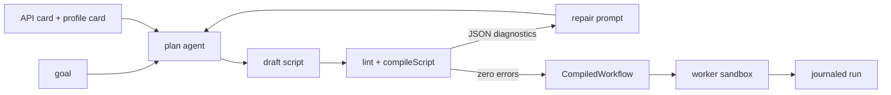

# Machine-written scripts

`@rulvar/planner` ships the flagship hybrid mode: a planner model writes the whole workflow script once, before anything executes. The draft is linted, self-repaired from machine-readable diagnostics, compiled by `compileScript`, and executed in a `worker_threads` sandbox with seeded, journaled globals. You get model-authored control flow with none of the runtime improvisation: by the time a single dollar is spent on execution, the plan is frozen source you can read, diff, and re-run.

::: info Two runs, one journal mechanism
Planning and execution are both ordinary journaled runs. The planning conversation replays for free when you replan the same goal, and the execution run is resumable by construction because the engine persists the compiled source itself. Nothing on this page introduces a second durability model.
:::

## Highlights

- **A frozen, reviewable plan.** The planner writes against two compact cards, the API card (the sandbox dialect) and the profile card (your registered agent profiles). The output is source code, not hidden state.
- **Self-repair over structured diagnostics.** Lint and compile findings are JSON, not prose. They ride a repair prompt back to the planner for up to `repairRounds` rounds (default 3).
- **A closed dialect, compiled.** `compileScript` validates the script as an async function body over the curated sandbox globals, enforces the import allowlist (default: no imports), and rejects violations with a typed `ScriptRejected` carrying diagnostics.
- **Deterministic execution.** `WorkerSandboxRunner` runs the compiled script in a worker with seeded, journaled shims for time and randomness, and JSON-only RPC to the host engine.
- **A type-level safety split.** `Workflow` values are closures and run in process only; `CompiledWorkflow` values are pure data and are the only form the sandbox accepts. Feeding a closure to the sandbox is a compile-time error.
- **Journaled and resumable end to end.** Every agent call, step, and random value the script produces is a journal entry; `engine.resume(runId)` rehydrates the persisted, hash-pinned source and replays completed work.

## Quick start

```bash
pnpm add @rulvar/core @rulvar/planner @rulvar/anthropic
```

```ts
import { createEngine } from "@rulvar/core";
import { anthropic } from "@rulvar/anthropic";
import { WorkerSandboxRunner, plan, runPlanned } from "@rulvar/planner";

const engine = createEngine({
  adapters: [anthropic()],
  defaults: {
    routing: {
      plan: "anthropic:claude-opus-4-8",   // writes the script
      loop: "anthropic:claude-sonnet-5",   // runs the spawned agents
    },
    profiles: {
      researcher: { description: "Finds and cites primary sources." },
      writer: { description: "Turns research notes into prose." },
    },
  },
  runners: { sandbox: new WorkerSandboxRunner() },
});

const planned = await plan(engine, "Compare three storage engines and draft a recommendation", {
  run: { budgetUsd: 1 }, // the planning conversation's own immutable ceiling
});
console.log(planned.source); // the frozen script: read it before you pay for execution
console.log(planned.lint);   // advisories on the accepted draft; never errors

const handle = engine.run(planned.workflow, {}, { budgetUsd: 10 });
const outcome = await handle.result;

// Or compose plan-then-run in one call, with the two ceilings set
// independently: `plan.run` bounds the planning conversation, `run`
// bounds the generated workflow's execution.
const direct = await runPlanned(engine, "Compare three storage engines and draft a recommendation", null, {
  plan: { run: { budgetUsd: 1 } },
  run: { budgetUsd: 10 },
});

// The bare legacy forms still work and are UNBOUNDED: without options,
// neither the planning run nor the execution run has a dollar ceiling.
```

Registering a sandbox runner is not optional decoration: running or resuming a `CompiledWorkflow` on an engine without `runners.sandbox` is a typed `ConfigError` before any journal entry is written.

## The pipeline



`plan()` asks a planner model (invocation role `plan`; override with `PlanOptions.model`) to write a script against the rendered cards. The reply's first fenced code block is extracted deterministically (or the whole reply when there is no fence), then linted and compiled. Error diagnostics are serialized back into a repair prompt; the loop accepts the first draft with zero errors, and after `repairRounds` repair rounds it gives up with a typed `ScriptRejected` carrying the last diagnostics, so a planner that cannot produce a valid script terminates loudly instead of looping. `repairRounds` is a nonnegative integer (zero means a single draft with no repair), refused as a `ConfigError` before the runId derivation, the store lookup, and any provider dispatch: an unvalidated `Infinity` used to turn the repair limiter into an unbounded paid loop.

The planning conversation is itself an ordinary journaled run whose id derives deterministically from the goal: `planRunIdOf(goal)` returns `plan-` plus a hash prefix, so one goal maps to one planning journal on your store. Calling `plan()` again with the same goal resumes that journal: already-paid drafts and repair turns replay for free under the never-pay-twice invariant, and only genuinely new turns cost money.

## Budgeting the planning conversation

`PlanOptions.run` carries run options for the planning conversation itself: `budgetUsd`, `limits`, `deadlineAt`, and `signal` (the runId stays goal-derived and is not overridable). They apply at **genesis** only. The first `plan()` of a goal starts the planning journal with them, and `budgetUsd` freezes as the run's immutable ceiling B0, recorded in the journal metadata like any other run ([Budgets](/guide/budgets)). A later `plan()` of the same goal resumes the existing journal under its RECORDED ceiling: a differing explicit `budgetUsd` emits a `RULVAR_PLAN_BUDGET_DRIFT` warning and never tops up or replaces the frozen value, and `limits`, `deadlineAt`, and `signal` do not apply to a resumed journal (core resume semantics; cancel through the returned handle). Delete the run or plan a new goal to change a ceiling.

When the ceiling cannot fit the next draft, planning stops typed: `plan()` throws `ScriptRejected` whose `data` carries `status: 'exhausted'` and the `budget_exhausted` error, the planning journal survives intact, and no over-ceiling provider call is made. Mind the admission reserve: absent an `estCost` hint the engine reserves the flat default (0.50 USD) per spawn, so a ceiling below the reserve denies even the first draft.

`runPlanned(engine, goal, args, { plan, run })` sets the two ceilings independently: `plan.run.budgetUsd` bounds the planning conversation and `run.budgetUsd` bounds the generated workflow's execution run (`run` is `RunOptions`, passed to `engine.run` verbatim). Both are ordinary run ceilings: recorded in metadata, restored on resume, and enforced by projected admission and the per-turn guard. Without options, both legs run unbounded, exactly like the pre-1.12 forms.

## What the planner sees

Two cards render into the planner prompt:

- `apiCard()` teaches the sandbox dialect: the exact global set, the option shapes, and the dialect restrictions below. It is pure and byte-stable.
- `engine.profileCard(names?)` renders your registered agent profiles (descriptions, declared tools, ladders, limits). `PlanOptions.profiles` filters which profiles are advertised. The same card feeds the dynamic orchestrator's `spawn_agent` tool, so both machine modes speak one agent vocabulary; see [Agents](/guide/agents).

A planner-written script is an async function body over bare globals. A representative accepted draft:

```ts
const sources = await parallel([
  () => agent("Find primary sources on LSM tree compaction", { agentType: "researcher" }),
  () => agent("Find primary sources on B-tree write amplification", { agentType: "researcher" }),
]);

const draft = await agent(
  "Write a comparison from these notes:\n" + sources.join("\n"),
  { agentType: "writer", onError: "null" },
);

if (draft === null) {
  log("warn", "draft agent failed; returning raw notes");
  return { notes: sources };
}
return { report: draft };
```

The curated global set is exactly `agent`, `parallel`, `pipeline`, `step`, `phase`, `log`, `budget`, `workflow`, `awaitExternal`, `now`, `random`, and `uuid` (exported as `SANDBOX_GLOBALS`). These are the `Ctx` primitives bound as bare globals; the full semantics of each live in [Workflows](/guide/workflows).

The dialect closes every hole that would smuggle nondeterminism or unjournalable values across the boundary:

| Surface | In the sandbox dialect |
|---|---|
| `schema` | JSON Schema literal only; no schema-library values |
| `tools` | Registered toolset names only (keys of engine `defaults.toolsets`, listed on the profile card); unknown names fail typed at spawn time |
| `model` | A string |
| `onError` | `'throw'` or `'null'` only |
| Options | No functions anywhere in options; policies as declarative rule tables; ladders as JSON |
| `workflow` | Registered-name string form only: `workflow('name', args)` |
| `budget` | Async reads: `await budget.spent()`, `await budget.remaining()` |
| Time and randomness | `now()`, `random(key?)`, `uuid()`; the bare platform APIs are shimmed or absent |

Machine scripts always run under the `lenient` error policy: `onError` defaults to `'null'`, a failed spawn yields `null` instead of unwinding the whole script, and every suppressed failure still surfaces as a `DroppedItem` in the run outcome's `dropped` list. Lenient mode suppresses the exception, never the evidence.

## compileScript and the import allowlist

`compileScript(source, options?)` validates planner-generated source and returns a `CompiledWorkflow`. Validation covers syntax (the source must compile as an async function body over the sandbox globals; its `return` value is the workflow result) and module access:

- `allowImports` defaults to `[]`: no imports at all.
- Static `import` syntax, `import.meta`, `require()`, `export` declarations, and dynamic imports with non-literal specifiers are always rejected.
- A dynamic `import('specifier')` with a string literal passes only when the specifier is listed in `allowImports`.

Any violation throws a typed `ScriptRejected`; `scriptDiagnosticsOf(error)` returns the machine-readable findings:

```ts
import { compileScript, scriptDiagnosticsOf } from "@rulvar/planner";
import { ScriptRejected } from "@rulvar/core";

try {
  const wf = compileScript(draftSource);
} catch (error) {
  if (error instanceof ScriptRejected) {
    for (const d of scriptDiagnosticsOf(error)) {
      console.error(`${d.ruleId} ${d.line ?? "?"}:${d.column ?? "?"} ${d.message}`);
    }
  }
}
```

Diagnostic rule ids are `syntax`, `empty-source`, `no-import`, `no-require`, `no-export`, and `disallowed-import`. The deeper dialect rules (schema literals only, no functions in options, tools by profile name) are enforced where they actually bind: at the sandbox boundary at runtime, where only journal-compatible JSON crosses, and advisorily by the lint pass in the repair loop.

## The self-repair loop and eslint-plugin-rulvar

The repair loop's teeth come from `eslint-plugin-rulvar`, the determinism lint for workflow modules. `lintScript(source)` wraps the script body in an async function for parsing (top-level `return` and `await` are legal in the dialect), runs the workflows preset plus `compileScript`, and shifts reported lines back so they index into the body source. Its findings and the compile diagnostics share one `PlanDiagnostic` shape, so the repair prompt is uniform.

| Rule | Severity | Catches |
|---|---|---|
| `rulvar/no-bare-date` | error | `Date.now` and `new Date` instead of the journaled `now()` |
| `rulvar/no-bare-random` | error | `Math.random` instead of the journaled `random()` |
| `rulvar/no-fetch` | error | Ambient network I/O outside agent tools |
| `rulvar/no-process-env` | error | Ambient host state via `process.env` |
| `rulvar/no-promise-all-over-ctx` | error | `Promise.all` over ctx calls; `parallel` journals, schedules, and settles |
| `rulvar/duplicate-identical-call` | warning | Byte-identical `agent`/`workflow` calls; each repeat gets its own journal entry and forward matching consumes them in execution order, so an edit or reorder can rebind results to the wrong call site; a deliberate repeat needs a distinguishing `key` |

The loop accepts a draft when no error-severity diagnostics remain; leftover warnings are returned on `PlanResult.lint` so you can inspect what the planner shipped with. The plugin is a normal ESLint plugin (the `eslint-plugin-` prefix is an npm requirement; the package is versioned in lockstep with the `@rulvar/*` set), so you can add `eslint-plugin-rulvar` as a dev dependency and run the same preset over your human-authored workflow modules:

```ts
// eslint.config.js
import { workflowsConfig } from "eslint-plugin-rulvar";

export default [{ files: ["workflows/**/*.ts"], ...workflowsConfig }];
```

For CI pipelines that want the planner's view of raw ESLint output, `toJsonDiagnostics(messages)` converts `LintMessage[]` into the same JSON shape the repair loop consumes.

### Give the planner output room

The `plan` role defaults to high reasoning effort, and adaptive thinking shares the output-token allowance with the visible script. A tight `maxOutputTokensPerTurn` can be consumed entirely by reasoning, leaving an empty completion:

```ts
createEngine({
  adapters: [anthropic()],
  defaults: {
    routing: {
      plan: { model: 'anthropic:claude-fable-5', effort: 'max' },
    },
    // High-effort adaptive reasoning shares the output-token allowance.
    limits: { maxOutputTokensPerTurn: 5_000 },
  },
});
```

`5_000` is a practical starting point, not a guarantee; tune it to prompt complexity and budget. Reducing `effort` is the cheaper alternative when the goal does not need deep planning. The same limit can also ride one goal instead of the whole engine: `plan(engine, goal, { run: { limits: { maxOutputTokensPerTurn: 5_000 } } })` applies it at the planning journal's genesis.

When a draft does come back truncated and empty (finish reason `max-tokens`, no visible text), the run does not burn repair rounds on it: source repair cannot fix a completion that contains no source. The draft settles as the typed [output truncation](/guide/agents#output-truncation) (`limit`, `abortClass: 'output-truncated'`), `plan()` stops after that one provider call, and the `ScriptRejected` it throws carries the truncation in `data.error`, not `compile/empty-source`. One consequence to know: the truncated draft memoizes, and the planner run id derives from the goal, so re-planning the same goal against the same store replays the memoized abort even after you raise the limit. Re-plan against a fresh store, rephrase the goal, or unpin the entry with resume's `invalidate` knob ([durability](/guide/durability)).

## The worker sandbox

`WorkerSandboxRunner` executes the compiled script inside a `worker_threads` worker. Its contract:

- **Curated scope.** The globals are exactly the sandbox set above. `fetch` and `process` are absent; `Date.now` and `Math.random` are replaced by the seeded shims. Import syntax is absent with ONE exception: a literal `await import('specifier')` whose specifier `compileScript` admitted through `allowImports` (default `[]`, so no imports at all). Allowlisting a Node module hands the script that module's full capability surface, so treat every `allowImports` entry as a host trust decision, exactly like registering a tool.
- **Seeded, journaled shims.** `now()`, `random()`, `uuid()`, and the platform replacements are one seeded stream derived from the `runId`. `now()` is a seeded logical clock, not wall clock: two fresh runs with the same `runId` produce byte-identical journals. Every generated value is mirrored to the host and journaled as an ordinary `rand` entry, so a resumed worker regenerates identical values and the mirrors forward-match instead of duplicating.
- **JSON-only RPC.** Every primitive call travels as JSON-RPC over a dedicated `MessagePort` to the host engine, validated as journal-compatible JSON at the boundary. Worker and host never exchange non-journalable values. `parallel` branches, `pipeline` stages, `phase` bodies, and `step` bodies execute inside the worker; only their JSON results cross to the host for journaling.
- **Resource ceilings.** Breaching `timeoutMs` (default 300000) or `memoryMb` (default 512) terminates the worker; the run completes with outcome `error` carrying a typed error code. Both are validated at construction: `timeoutMs` must be an integer between 1 and 2147483647 ms (the Node timer maximum; a larger value used to clamp to 1 ms and kill a trivial worker immediately) and `memoryMb` a positive integer, anything else being a typed `ConfigError` before any worker exists.
- **Isolated worker launch.** The worker always starts with an explicit `execArgv` (default `[]`), never an inherited `process.execArgv`: host-only launch flags would otherwise reach the file-entry worker and kill it before the first sandbox operation (`--input-type=module`, present whenever the host itself runs as ESM from stdin or `--eval`, is rejected for file entries, and an inherited `--eval` carries the host's whole source text). Hosts that need loader, coverage, or instrumentation flags inside the worker opt in through `WorkerSandboxRunnerOptions.execArgv`; the list reaches the worker verbatim.
- **Lifecycle fidelity.** The worker reports busy-state transitions, so a sandboxed run suspends on `awaitExternal` and quiesces exactly like an in-process one: a computing worker keeps the host process alive, a suspended run lets it exit, and the port is closed at the terminal outcome.

The host half of the protocol is `createSandboxBridge(ctx, { post })` from `@rulvar/core`: it serves every proxied primitive against the canonical run ctx, which is why the runner is built entirely from the public core API and why an alternative runner can implement the same `ScriptRunner` seam.

::: warning A determinism boundary, not a security boundary
The sandbox exists to guarantee deterministic replay and to bound the blast radius of a generated script: no ambient time, no ambient randomness, no network, no host process access, JSON-only traffic. It is not a defense against hostile code, and nothing shipped today is: the current release enforces only the in-process tool executor (`subprocess` and `container` are declared capabilities that fail at registration), and a git worktree isolates file changes and the working directory, never processes or the network. Containing genuinely hostile tool code requires an executor you build and operate, with its own threat model; see [Tools](/guide/tools#executors).
:::

## Workflow versus CompiledWorkflow

The two workflow forms exist so the type system, not a runtime check, keeps closures out of the sandbox:

| | `Workflow<A, R>` | `CompiledWorkflow` |
|---|---|---|
| Produced by | `defineWorkflow` | `compileScript` |
| Form | Closure value carrying a `body` function | Pure data: `name`, `source` string, `errorPolicy` |
| Executes in | Your process (`InProcessRunner`) | The engine's registered `runners.sandbox` |
| Error policy | `'strict'` by default | Always `'lenient'` |
| Resume | Re-supply the definition, or register it under `defaults.workflows` | Rehydrated from the persisted source, hash-pinned |

`WorkerSandboxRunner.execute` accepts `CompiledWorkflow` only. There is no way to hand it a closure, and there is no way to serialize a closure into a `CompiledWorkflow`, so "accidentally shipped a function into the sandbox" is not a bug class you can write.

## Journaled and resumable, end to end

At `engine.run` the engine persists the compiled source as a transcript blob and records its ref plus a content hash in the run metadata. From then on the run is self-describing:

```ts
// Later, in a different process, no workflow argument needed:
const resumed = engine.resume(handle.runId);
const outcome = await resumed.result;
```

`engine.resume(runId)` reloads the stored source, verifies byte identity against the recorded hash, and re-executes the script in the sandbox. The dialect validation is not re-run at resume: the hash proves the source is exactly the one validated at run start, and the sandbox boundary enforces the hard rules at runtime regardless. Inside the re-execution, the seeded shims regenerate identical values and every completed agent call, step, and child workflow is served from the journal by scoped forward-matching, so completed work is never paid twice. Supplying a compiled workflow whose source hash differs from the recorded one is a typed `ConfigError`.

Cross-process resume needs durable stores on both sides: a durable journal store for the entries and a durable transcript store (for example `FileTranscriptStore`) for the persisted source. The default in-memory stores disable resume with a loud warning; see [Durability](/guide/durability) and [Stores](/guide/stores).

## When to prefer this over the dynamic orchestrator

Both machine modes let a model author control flow; they differ in when the model decides. Prefer machine-written scripts when the goal varies per run but the plan, once written, does not need to change mid-flight:

| | Machine-written script | Dynamic orchestrator |
|---|---|---|
| Control flow decided | Once, before execution | Live, turn by turn |
| Model spend on control flow | One planning conversation, journaled and replayed on replanning | Orchestrator turns for the whole run, bounded by a dedicated cap |
| Auditability | Frozen source: read, diff, review, and store it | Decision entries and a transcript |
| Adaptation | Re-plan between runs; the planning journal replays the unchanged prefix | Mid-run replanning, up to typed plan revisions with PlanRunner |
| Failure surface | Lint plus compile reject bad scripts before execution | Guards, admission, and termination accounting bound bad decisions during execution |

Concretely:

- Reach for `plan()` and the sandbox when you want a model to write the plan and refuse to let it improvise at runtime: recurring jobs with varying inputs, pipelines an operator must be able to review before execution, and anything where a deterministic re-run of the exact same script matters.
- Reach for the [dynamic orchestrator](/guide/orchestration-modes) when the next step depends on results that cannot wait for the script to finish: wide fan-out with mid-run replanning, escalation handling, and admission decisions. That machinery costs orchestrator turns and buys adaptability; see [Adaptive orchestration](/guide/adaptive-orchestration).

If the plan never changes mid-run, a script is strictly better: cheaper, easier to audit, and byte-for-byte reproducible. When in doubt, start here and move to the orchestrator only once a real workload shows you plans that must change in flight.

## Next steps

- [Orchestration modes](/guide/orchestration-modes): how this mode relates to human scripts and the orchestrator.
- [Workflows](/guide/workflows): the full `Ctx` surface the sandbox globals project.
- [Determinism](/guide/determinism): the replay model behind the seeded shims and the lint rules.
- [Journal](/guide/journal): content keys, scope paths, and forward-matching.
- [Budgets](/guide/budgets): the three-layer budget every planned run passes through.
- API reference: [@rulvar/planner](/api/@rulvar/planner/), [@rulvar/core](/api/@rulvar/core/), [eslint-plugin-rulvar](/api/eslint-plugin-rulvar/).
