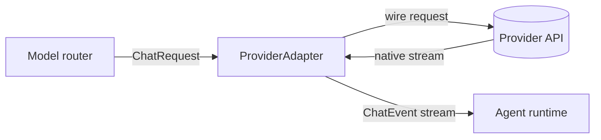

# Providers

Every model call in rulvar goes through one interface: `ProviderAdapter`. The adapter absorbs the provider's wire quirks invisibly, so the engine, the journal, and your workflow code see one canonical request shape, one stream vocabulary, and one usage accounting model no matter who serves the tokens. Adapters are registered per engine, and models are addressed as `ModelRef` strings of the form `adapterId:model`.

## Shipped adapters

| Adapter | Package | Speaks | Use when |
|---|---|---|---|
| `anthropic()` | `@rulvar/anthropic` | Anthropic Messages API | Claude models: thinking block replay, prompt caching, typed refusals. |
| `openai()` | `@rulvar/openai` | OpenAI Responses API | GPT models: reasoning item replay, strict `json_schema` output. |
| `openaiCompatible({...})` | `@rulvar/openai` | Chat Completions dialect | Ollama, vLLM, OpenRouter, Mistral, arbitrary gateways. |
| `bridgeAiSdk(model)` | `@rulvar/bridge-ai-sdk` | Any Vercel AI SDK `LanguageModelV4` | The long tail: Google, Bedrock, Vertex, community providers. |

The first two are the first class adapters: they ship capability tables for the current model families and implement every provider specific mechanism this page describes. The factory and the bridge trade some of that depth for reach.

## Registering adapters

Hand constructed adapters to `createEngine`. There is no global registry: the adapter set, like every other registry, is strictly per engine.

```ts
import { createEngine } from "@rulvar/core";
import { anthropic } from "@rulvar/anthropic";
import { openai, openaiCompatible } from "@rulvar/openai";

const engine = createEngine({
  adapters: [
    anthropic(),
    openai(),
    openaiCompatible({ id: "ollama", baseURL: "http://127.0.0.1:11434/v1" }),
  ],
  defaults: {
    routing: {
      loop: "anthropic:claude-sonnet-5",
      extract: "openai:gpt-5.4-mini",
      summarize: "ollama:llama3.3",
    },
  },
  concurrency: {
    perProvider: { anthropic: 8, openai: 8, ollama: 2 },
  },
});
```

Three rules worth knowing up front:

- **`ModelRef` is strictly `adapterId:model`.** The left segment selects the adapter from the registry; the right segment is the wire model id the adapter sends. No query parameters, no aliases.
- **Duplicate adapter ids are a typed `ConfigError`** at `createEngine`. Several OpenAI compatible endpoints coexist by giving each a distinct `id`.
- **Keys and base URLs are fixed at adapter construction.** An adapter instance is bound to one endpoint and one credential for its lifetime; run a second instance under a different id for a second endpoint.

`concurrency.perProvider` caps in flight requests per adapter id; ids without a configured cap run unlimited. Where model calls are routed, and how effort, fallbacks, and quality floors resolve, is the subject of [Model routing](/guide/model-routing).

## API keys

| Adapter | Option | When `apiKey` is omitted |
|---|---|---|
| `anthropic()` | `apiKey`, `baseURL` | The underlying `@anthropic-ai/sdk` reads `ANTHROPIC_API_KEY`. |
| `openai()` | `apiKey`, `baseURL` | The underlying `openai` SDK reads `OPENAI_API_KEY`. |
| `openaiCompatible()` | `apiKey` (optional), `baseURL` (required) | A placeholder key is sent, so keyless local endpoints like Ollama and vLLM work without configuration. |
| `bridgeAiSdk()` | none | Credentials belong to the wrapped AI SDK model; configure them on the provider package you bring. |

All shipped adapters construct their SDK client with autoretries disabled (`maxRetries: 0`). This is deliberate: the engine owns retries, backoff, and wall clock, because SDK internal retries would be invisible to the journal, the budget ledger, and your timeouts. Adapters surface rate limit and overload responses as typed retryable errors instead, and the engine's `RetryPolicy` honors any provider supplied retry delay.

## The ProviderAdapter SPI

`ProviderAdapter` is one of the six SPI seams frozen at 1.0. If the shipped adapters do not cover your provider, implementing it yourself is a supported path; [Adapter authors](/guide/adapter-authors) walks through the contract in full. The shape:

```ts
import type { ChatEvent, ChatRequest, Effort, ModelCaps, Pricing } from "@rulvar/core";

interface ProviderAdapter {
  /** Stable adapter id; the left segment of ModelRef. */
  id: string;
  /** Provider family for provider-raw matching; default = id. */
  provider?: string;
  caps(model: string): ModelCaps;
  /** Refresh the capability table from live model lists. */
  refreshCaps?(): Promise<void>;
  stream(req: ChatRequest, signal?: AbortSignal): AsyncIterable<ChatEvent>;
  countTokens?(req: ChatRequest): Promise<number>;
}

type ModelCaps = {
  structuredOutput: "native" | "forced-tool" | "prompt";
  supportsTemperature: boolean;
  supportsParallelTools: boolean;
  reasoningEfforts: Effort[];
  contextWindow: number;
  maxOutputTokens: number;
  pricing?: Pricing;
};
```

`caps` feeds the router: it selects the structured output tier, scrubs parameters the target model rejects, and checks effort support before any live call. `pricing` here is an adapter reported fallback; the engine's versioned price table wins when both exist. See [Budgets and termination](/guide/budgets) for how normalized usage becomes dollars.



### One stream vocabulary

Whatever the provider's native streaming looks like, `stream` yields the same canonical events:

| Event type | Meaning |
|---|---|
| `text-delta` | A chunk of assistant text. |
| `reasoning-delta` | A chunk of reasoning summary or visible reasoning text. |
| `tool-call-start` / `tool-call-delta` / `tool-call-end` | A streaming tool call; the end event carries assembled, parsed JSON args. |
| `usage` | Incremental usage; may repeat. |
| `finish` | Terminal: the typed finish outcome, final usage, and namespaced provider metadata. |
| `error` | Terminal: a typed, JSON serializable `WireError` with a `retryable` flag. |

Adapters emit exactly one terminal event per stream. Tool call ids in these events are engine minted, not provider minted: each adapter keeps a bijective map between canonical ids and wire ids (`toolu_*` on Anthropic, `call_*` on OpenAI), so a conversation history can move between providers without id format collisions.

### Typed refusals

A refusal is never silently projected to an empty output. It surfaces as a typed finish outcome, `{ reason: "refusal", refusal }`, carrying the adapter id and any provider stop details (type, category, explanation). The agent runtime maps it to a terminal agent error with those details attached, so ladders, escalation, and evals can react to what actually happened.

### The usage invariant

Every adapter normalizes usage so that `inputTokens` is the full prompt size, cache reads and cache writes included, and the engine verifies this at the adapter boundary. Providers disagree wildly here: Anthropic reports input tokens excluding cache traffic, so the adapter sums all three buckets; OpenAI already includes cached reads. After normalization, cost attribution is provider neutral.

### Provider-raw retention

Some provider blocks must survive round trips byte exact: Anthropic thinking blocks with signatures, OpenAI reasoning items with `encrypted_content`. Adapters ship these on the finish event, the runtime stores them in the canonical history as `provider-raw` parts tagged with the adapter's provider family, and on every outgoing request the history projector includes a part exactly when the target model's family matches. This is what makes per role provider mixing correct: loop turns can run on Anthropic while extract runs on OpenAI, and each provider sees a valid wire history. Two adapters of the same family (say, two `openaiCompatible` gateways) share retained blocks because the family tag is `provider`, not the adapter id.

## @rulvar/anthropic

```bash
pnpm add @rulvar/anthropic
```

```ts
import { anthropic } from "@rulvar/anthropic";

const adapter = anthropic({
  apiKey: process.env.ANTHROPIC_API_KEY, // optional; the SDK reads the variable itself
  baseURL: "https://api.anthropic.com",  // optional
});
```

The adapter id is `anthropic`; address models as `anthropic:claude-sonnet-5`, `anthropic:claude-fable-5`, and so on. `ANTHROPIC_MODELS` exports the seeded capability table, and `refreshCaps()` corrects context window and output figures from the live model list. `countTokens` is implemented over the stateless count tokens endpoint.

Provider notes:

- **Thinking block replay.** Thinking blocks arrive signed and are retained unconditionally as `provider-raw` parts. On requests to any Anthropic model they are echoed byte exact; stripping them client side risks 400 ordering and signature errors, so the adapter never does it. The server silently drops blocks minted by a different model, unbilled.
- **Prompt caching via `cacheHint`.** The provider neutral `cacheHint` on `ChatRequest` compiles into `cache_control` breakpoints. The provider caps breakpoints at 4 per request; when a hint exceeds that, the adapter keeps the deepest breakpoints and drops the shallowest, deterministically. The 5 minute TTL is the default; `ttl: "1h"` selects the long lived tier at a higher write premium. Prefixes below the model's minimum cacheable size (2048 tokens on `claude-sonnet-5` and `claude-fable-5`, 4096 on `claude-opus-4-8`) silently do not cache: the adapter sends the breakpoint unchanged, the provider declines to create the entry, and no event or error is raised; the miss is visible only in the normalized cache usage fields.
- **`pause_turn` absorption.** When a server side tool loop pauses mid turn, the adapter appends the partial assistant content and re-sends, without injecting a synthetic user message. Continuations are capped by `DEFAULT_PAUSE_TURN_MAX_CONTINUATIONS` (5). A paused turn never surfaces as a canonical finish; callers only ever see complete turns.
- **Typed refusal outcomes.** Anthropic refusals carry structured stop details; the adapter passes type, category, and explanation through on the refusal finish outcome described above.
- **Rate limits, 529, and retry-after.** 429 responses surface `retryAfterMs` plus the rate limit bucket headers on the typed error; 529 overloaded is a distinct retryable class alongside 500. The adapter never sleeps internally; the engine's `RetryPolicy` schedules the retry and honors the provider supplied delay.
- **Usage normalization.** Anthropic reports `input_tokens` excluding cache reads and writes; the adapter normalizes to the usage invariant by summing all three, and fills `cacheReadTokens` and `cacheWriteTokens` from the cache usage fields so cache effectiveness is directly observable.
- **Effort and sampling.** All five canonical effort levels pass through to the wire, `max` included; the capability table records which levels each model accepts, and the router scrubs an unsupported effort visibly (the requested effort stays in journal identity). Current models reject `temperature`, `top_p`, and `top_k` outright, so the capability table declares `supportsTemperature: false` and the router scrubs those too instead of letting the provider return a 400.

## @rulvar/openai

```bash
pnpm add @rulvar/openai
```

```ts
import { openai } from "@rulvar/openai";

const adapter = openai({
  apiKey: process.env.OPENAI_API_KEY, // optional; the SDK reads the variable itself
});
```

The adapter id is `openai`; address models as `openai:gpt-5.5` or `openai:gpt-5.4-mini`. `OPENAI_MODELS` exports the seeded capability table. The primary surface is the Responses API; Chat Completions exists only as a documented degraded path.

Provider notes:

- **Manual item replay only.** The adapter sends `store: false` with `include: ["reasoning.encrypted_content"]` and replays prior output items from the canonical history itself. `previous_response_id` and the Conversations API are rejected as a typed `ConfigError`, even through `providerOptions`: server side conversation state lives outside the journal and would break replay identity.
- **Reasoning items.** Reasoning items are retained as `provider-raw` parts and echoed byte exact between function calls, `encrypted_content` included. OpenAI decrypts in memory and never persists, so reasoning quality and cache efficiency survive across tool calls without any state leaving your store.
- **Strict `json_schema` output.** The native structured output tier sends `text.format = { type: "json_schema", ... }` with explicit `strict: true`, never relying on the API's silent best effort fallback for incompatible schemas. When a schema is not strict compatible, the router selects a lower tier loudly instead.
- **Effort mapping.** `reasoning.effort` accepts low through xhigh. Canonical `max` has no wire equivalent and downmaps to `xhigh`; the downmap is recorded in provider metadata while journal identity keeps the requested `max`.
- **Degraded Chat Completions path.** Models unavailable on Responses are served through Chat Completions with documented degradations: delta patched chunk assembly, no reasoning item replay, `response_format` instead of `text.format`. Selection is a capability fact, visible in events, never silent.

### The openaiCompatible factory

Anything that speaks the Chat Completions wire format can be an adapter. The factory requires an explicit `id` and `baseURL`:

```ts
import { openaiCompatible } from "@rulvar/openai";

const ollama = openaiCompatible({
  id: "ollama",
  baseURL: "http://127.0.0.1:11434/v1",
});

const openrouter = openaiCompatible({
  id: "openrouter",
  baseURL: "https://openrouter.ai/api/v1",
  apiKey: process.env.OPENROUTER_API_KEY,
  caps: (model) => ({
    structuredOutput: "forced-tool",
    supportsParallelTools: true,
    contextWindow: 131072,
    maxOutputTokens: 32768,
  }),
});
```

Gateways cannot be introspected reliably, so when you supply no `caps` function the factory assumes the most conservative capability set, exported as `CONSERVATIVE_COMPATIBLE_CAPS`: prompt tier structured output, temperature supported, no parallel tools, no reasoning efforts, an 8192 token window, 4096 output tokens, and no pricing. Supply `caps` for anything beyond that; partial returns merge over the conservative base per model.

Two facts follow from the conservative posture. Absent pricing is legitimate for local models: they surface as unpriced in cost reports, never as a silent zero. And the provider family of every factory adapter is `openai` regardless of the custom id, so gateways of the same dialect share history projections.

## @rulvar/bridge-ai-sdk

```bash
pnpm add @rulvar/bridge-ai-sdk @ai-sdk/google
```

```ts
import { google } from "@ai-sdk/google";
import { bridgeAiSdk } from "@rulvar/bridge-ai-sdk";

const gemini = bridgeAiSdk(google("gemini-2.5-pro"), {
  id: "google",
  caps: () => ({
    contextWindow: 1048576,
    maxOutputTokens: 65536,
    supportsParallelTools: true,
  }),
});
```

`bridgeAiSdk` wraps any Vercel AI SDK `LanguageModelV4` into a `ProviderAdapter`, opening the AI SDK's whole provider catalog (Google, Bedrock, Vertex, and the community ecosystem) without coupling the engine to the AI SDK release cycle. You bring the concrete provider package (here `@ai-sdk/google`) and hand its model object to the bridge.

- **Runtime version check.** The bridge checks `specificationVersion` at runtime and fails with a typed `ConfigError` on mismatch, so a transitive provider package major bump cannot mis-wire silently. It targets `LanguageModelV4` from `@ai-sdk/provider` version 4.
- **One adapter per wrapped model.** A V4 model instance is bound to one model id at construction, and the bridge enforces that the `ModelRef` segment matches it. Register one bridge adapter per model; `id` defaults to the wrapped model's provider string, so pass explicit ids to register several models of the same provider side by side. The `provider` option sets the family for provider-raw sharing and also defaults to the wrapped model's provider string.
- **Capabilities.** Like the factory, the bridge cannot introspect its target: the conservative defaults mirror `CONSERVATIVE_COMPATIBLE_CAPS` except `structuredOutput`, which is `"native"` because the V4 `responseFormat` json mechanism is accepted by every AI SDK provider. Supply `caps` for real windows and pricing.
- **Retention still works.** Reasoning parts with their provider metadata, provider executed tool exchanges, and generated files are collected and retained through the same provider-raw mechanism as the first class adapters, then reinserted into the prompt on replay to the same family.

::: warning The highest churn package
The AI SDK ecosystem moved its language model interface through three majors in roughly eighteen months, and `@rulvar/bridge-ai-sdk` tracks it. Expect this package to be the likeliest source of breaking minors in the set; the version check above turns any mismatch into a loud, typed failure instead of subtle mis-wiring. See [Versioning](/reference/versioning).
:::

## Which package do I install?

| You want | Install |
|---|---|
| Claude and GPT models, batteries included | `pnpm add @rulvar/rulvar` (re-exports `anthropic()` and `openai()`) |
| Just the engine plus one provider | `pnpm add @rulvar/core @rulvar/anthropic` |
| A local or gateway endpoint | `pnpm add @rulvar/openai` and use `openaiCompatible` |
| Anything the Vercel AI SDK supports | `pnpm add @rulvar/bridge-ai-sdk` plus the concrete `@ai-sdk/*` provider |

## Next steps

- [Model routing](/guide/model-routing): the resolution chain, invocation roles, effort, fallbacks, and quality floors.
- [Adapter authors](/guide/adapter-authors): implement `ProviderAdapter` for a provider rulvar does not ship.
- [Budgets and termination](/guide/budgets): how normalized usage and the price table bound spend.
- [Testing](/guide/testing): `FakeAdapter` and VCR cassettes for provider free tests.
- API reference: [@rulvar/anthropic](/api/@rulvar/anthropic/), [@rulvar/openai](/api/@rulvar/openai/), [@rulvar/bridge-ai-sdk](/api/@rulvar/bridge-ai-sdk/), [@rulvar/core](/api/@rulvar/core/).
