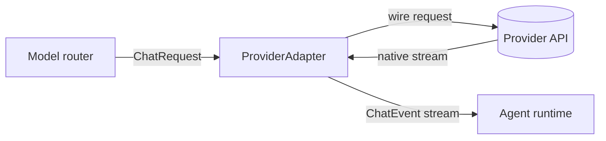

# Providers

Every model call in Rulvar goes through one interface: `ProviderAdapter`. The adapter absorbs the provider's wire quirks invisibly, so the engine, the journal, and your workflow code see one canonical request shape, one stream vocabulary, and one usage accounting model no matter who serves the tokens. Adapters are registered per engine, and models are addressed as `ModelRef` strings of the form `adapterId:model`.

## Shipped adapters

| Adapter | Package | Speaks | Use when |
|---|---|---|---|
| `anthropic()` | `@rulvar/anthropic` | Anthropic Messages API | Claude models: thinking block replay, prompt caching, typed refusals. |
| `openai()` | `@rulvar/openai` | OpenAI Responses API | GPT models: reasoning item replay, strict `json_schema` output. |
| `openaiCompatible({...})` | `@rulvar/openai` | Chat Completions dialect | Ollama, vLLM, OpenRouter, Mistral, arbitrary gateways. |
| `bridgeAiSdk(model)` | `@rulvar/bridge-ai-sdk` | Any Vercel AI SDK `LanguageModelV4` | The long tail: Google, Bedrock, Vertex, community providers. |

The first two are the first class adapters: they ship capability tables for the current model families and implement every provider specific mechanism this page describes. The factory and the bridge trade some of that depth for reach.

## Registering adapters

Hand constructed adapters to `createEngine`. There is no global registry: the adapter set, like every other registry, is strictly per engine.

```ts
import { createEngine } from "@rulvar/core";
import { anthropic } from "@rulvar/anthropic";
import { openai, openaiCompatible } from "@rulvar/openai";

const engine = createEngine({
  adapters: [
    anthropic(),
    openai(),
    openaiCompatible({ id: "ollama", baseURL: "http://127.0.0.1:11434/v1" }),
  ],
  defaults: {
    routing: {
      loop: "anthropic:claude-sonnet-5",
      extract: "openai:gpt-5.4-mini",
      summarize: "ollama:llama3.3",
    },
  },
  concurrency: {
    perProvider: { anthropic: 8, openai: 8, ollama: 2 },
  },
});
```

Three rules worth knowing up front:

- **`ModelRef` is strictly `adapterId:model`.** The left segment selects the adapter from the registry; the right segment is the wire model id the adapter sends. No query parameters, no aliases.
- **Duplicate adapter ids are a typed `ConfigError`** at `createEngine`. Several OpenAI compatible endpoints coexist by giving each a distinct `id`.
- **Credentials and base URLs are fixed at adapter construction.** An adapter instance is bound to one endpoint and one credential for its lifetime; run a second instance under a different id for a second endpoint.

`concurrency.perProvider` caps in flight requests per adapter id; ids without a configured cap run unlimited. Where model calls are routed, and how effort, fallbacks, and quality floors resolve, is the subject of [Model routing](/guide/model-routing).

## Authentication

| Adapter | Options | When no auth option is set |
|---|---|---|
| `anthropic()` | `apiKey`, `baseURL`, `sdkOptions`, `client` | The underlying `@anthropic-ai/sdk` resolves credentials itself: it reads `ANTHROPIC_API_KEY` and `ANTHROPIC_AUTH_TOKEN` as independent credentials (both headers when both are set), and falls back to its config-file chain only when neither is set; exact rules in [credential precedence](#anthropic-credential-precedence). |
| `openai()` | `apiKey`, `baseURL`, `sdkOptions`, `client` | The underlying `openai` SDK reads `OPENAI_API_KEY`. |
| `openaiCompatible()` | `apiKey` (optional), `baseURL` (required) | A placeholder key is sent, so keyless local endpoints like Ollama and vLLM work without configuration. |
| `bridgeAiSdk()` | none | Credentials belong to the wrapped AI SDK model; configure them on the provider package you bring. |

Keys are created in the provider dashboards: Anthropic keys in the [Claude Console](https://platform.claude.com/settings/keys), OpenAI keys on the platform's [API keys page](https://platform.openai.com/api-keys). The providers' own guides cover account setup end to end: [Get started with Claude](https://platform.claude.com/docs/en/get-started) and the [OpenAI developer quickstart](https://developers.openai.com/api/docs/quickstart). For `openaiCompatible()` the credential belongs to whoever operates the endpoint (an OpenRouter key, a gateway token); keyless local servers need none.

The zero-configuration path is the environment. Export the variable in the shell, service manager, or CI secret store that runs your host process, construct the factory with no options, and the official SDK picks the key up itself:

```bash
export ANTHROPIC_API_KEY="your-api-key" # anthropic()
export OPENAI_API_KEY="your-api-key"    # openai()
```

Reserve the explicit `apiKey` option for hosts that already own secret distribution (a vault client, per-tenant credentials). Either way, treat keys as secrets end to end: keep them out of source control and out of workflow code. Rulvar masks key-shaped strings at the telemetry boundary ([Redaction](/guide/observability#redaction)), but that is a last line of defense, not a reason to inline keys.

### Supported credential modes

An API key is one credential mode among several, and the modes differ in how the credential is minted, not in who pays. The support matrix:

| Mode | Bills | `anthropic()` | `openai()` |
|---|---|---|---|
| API key | The provider API account | `apiKey` option or `ANTHROPIC_API_KEY` | `apiKey` option or `OPENAI_API_KEY` |
| Static bearer token | The provider API account | `sdkOptions.authToken` or `ANTHROPIC_AUTH_TOKEN` | Not offered by the SDK |
| Token provider / workload identity federation | The provider API account: federation changes credential distribution (short-lived tokens minted from your identity provider), never billing | `sdkOptions.credentials` (an `AccessTokenProvider`), `sdkOptions.config` (OIDC federation), or `sdkOptions.profile`; ambient env keys are suppressed ([precedence](#anthropic-credential-precedence)) | `sdkOptions.workloadIdentity`; mutually exclusive with any API key, the environment variable included |
| Implicit SDK credential chain | Whatever the resolved credential bills | Construct with no auth option: the SDK reads the key and bearer variables as independent credentials and falls back to its config files only when neither is set ([precedence](#anthropic-credential-precedence)) | `OPENAI_API_KEY` only |
| Consumer subscription (Claude or ChatGPT app plans) | Not applicable | Not a credential mode | Not a credential mode |
| Local or keyless endpoint | Nobody | Not applicable | Via `openaiCompatible({ baseURL })` |

Two boundaries worth stating explicitly:

- **A consumer subscription is not an API credential.** Claude and ChatGPT app plans authenticate a consumer application, not an API account. Do not paste browser or session tokens, app OAuth tokens, or anything extracted from a logged-in client into `apiKey` or `authToken`: those endpoints do not accept them, and the attempt violates the providers' terms. The one subscription-backed programmatic path Anthropic ships is the Claude Agent SDK (`claude -p`), a separate product with its own harness and terms; Rulvar does not currently ship an Agent SDK adapter, so a Rulvar workflow always bills a provider API account.
- **Every supported mode above is first-class API auth.** Short-lived bearer and federation modes land usage on the same provider project as an API key; pick them for credential hygiene, not for billing reasons.

### sdkOptions and preconstructed clients

`sdkOptions` forwards official SDK construction options verbatim with one exception: `maxRetries` is excluded from the type and forced to `0` at construction, because the engine owns retries (below). Every SDK credential mode in the matrix rides through it, as do `fetch`, `timeout`, and `defaultHeaders`:

```ts
import { anthropic } from "@rulvar/anthropic";
import { openai } from "@rulvar/openai";

// A token provider minting short-lived bearers (Anthropic). Safe in an
// ordinary environment: with structured auth configured and no
// apiKey/authToken set, the adapter suppresses ambient env credentials,
// so a stray ANTHROPIC_API_KEY in the shell cannot silently win (the
// precedence rules below).
const viaProvider = anthropic({
  sdkOptions: {
    credentials: async () => ({ token: await mintFromVault(), expiresAt: null }),
  },
});

// Workload identity federation (OpenAI). Leave OPENAI_API_KEY unset:
// the SDK rejects a key plus workloadIdentity as conflicting auth.
const viaFederation = openai({
  sdkOptions: {
    workloadIdentity: {
      identityProviderId: "idp_...",
      serviceAccountId: "sa_...",
      provider: { tokenType: "jwt", getToken: () => mintSubjectJwt() },
    },
  },
});
```

#### Anthropic credential precedence

The `@anthropic-ai/sdk` decides what authenticates a request in this order, and a credential it read from the environment counts the same as one you passed:

1. **`apiKey` or `authToken` set to a string**, explicit or from `ANTHROPIC_API_KEY`/`ANTHROPIC_AUTH_TOKEN` (the SDK skips both environment reads when a `profile` is named). If either is set, a configured `credentials`/`config`/`profile` token provider is **never consulted**, the SDK does not even build its token cache: requests carry `x-api-key` for the key, bearer `Authorization` for the token, and both headers when both are set.
2. **Token providers**, only when `apiKey` and `authToken` are both null: `credentials`, else `config`, else `profile` (the SDK rejects passing more than one). Requests carry the provider's bearer `Authorization`.
3. Otherwise the SDK's **default credential chain** (its config files) resolves lazily on first request.

The whole rule set as one truth table (`apiKey`/`authToken` mean a **string** value, explicit or read from the environment; explicit `null` counts as absent). Every shorter formulation on this page, in the README, and in the TypeDoc defers to this table:

| `apiKey` | `authToken` | Structured auth configured | What authenticates | Request headers |
|---|---|---|---|---|
| string | absent | ignored (never consulted) | the API key | `x-api-key` |
| absent | string | ignored (never consulted) | the bearer token | `Authorization` |
| string | string | ignored (never consulted) | both credentials are sent; the server decides | `x-api-key` and `Authorization` |
| absent | absent | yes | the token provider (`credentials`, else `config`, else `profile`) | `Authorization` |
| absent | absent | no | the SDK's config-file chain, lazily on first request | per the resolved credential |

That first rule is a footgun for structured auth: a stray `ANTHROPIC_API_KEY` or `ANTHROPIC_AUTH_TOKEN` exported in the shell or CI would silently bypass your vault provider or federation profile and bill whatever principal that credential belongs to. The adapter closes it: **when `sdkOptions` carries structured auth (`credentials`, `config`, or `profile`) and no `apiKey` or `authToken` is set to a string anywhere, the adapter passes explicit `apiKey: null, authToken: null` to the SDK**, so the configured provider is the one that authenticates, environment or not. An explicit `apiKey: null` or `authToken: null` of your own counts as absence for this rule, never as a chosen credential, so it does not disable the protection. Setting an `apiKey` or `authToken` **string** next to structured auth is respected verbatim, with the SDK precedence above (per rule 1 the provider is then not consulted). The same suppression applies to `profile` and `config`, which resolve through the same token-provider chain.

A preconstructed client is equally first-class: `client` accepts the official `Anthropic` or `OpenAI` instance directly, no casts, or a structural `AnthropicClientLike`/`OpenAiClientLike` mock in tests. The constraints are all typed `ConfigError` raised before any network I/O: `client` is mutually exclusive with the construction options; an injected official client must have been constructed with `maxRetries: 0`; the same field set both top-level and inside `sdkOptions` is rejected; `apiKey` conflicts with `sdkOptions.workloadIdentity`. Note that a preconstructed client bypasses the suppression rule above; construct it with `apiKey: null, authToken: null` yourself when it should authenticate through a token provider in an environment that may carry keys. Rulvar never reads, logs, journals, or stringifies credential contents on any of these paths; credentials go to the official SDK and nowhere else.

All shipped adapters construct their SDK client with autoretries disabled (`maxRetries: 0`), and refuse an injected client that has them enabled. This is deliberate: the engine owns retries, backoff, and wall clock, because SDK internal retries would be invisible to the journal, the budget ledger, and your timeouts. Adapters surface rate limit and overload responses as typed retryable errors instead, and the engine's `RetryPolicy` honors any provider supplied retry delay.

## The ProviderAdapter SPI

`ProviderAdapter` is one of the six SPI seams frozen at 1.0. If the shipped adapters do not cover your provider, implementing it yourself is a supported path; [Adapter authors](/guide/adapter-authors) walks through the contract in full. The shape:

```ts
import type { ChatEvent, ChatRequest, Effort, ModelCaps, Pricing } from "@rulvar/core";

interface ProviderAdapter {
  /** Stable adapter id; the left segment of ModelRef. */
  id: string;
  /** Provider family for provider-raw matching; default = id. */
  provider?: string;
  caps(model: string): ModelCaps;
  /** Refresh the capability table from live model lists. */
  refreshCaps?(): Promise<void>;
  stream(req: ChatRequest, signal?: AbortSignal): AsyncIterable<ChatEvent>;
  countTokens?(req: ChatRequest): Promise<number>;
}

type ModelCaps = {
  structuredOutput: "native" | "forced-tool" | "prompt";
  supportsTemperature: boolean;
  supportsParallelTools: boolean;
  reasoningEfforts: Effort[];
  contextWindow: number;
  maxOutputTokens: number;
  pricing?: Pricing;
};
```

`caps` feeds the router: it selects the structured output tier, scrubs parameters the target model rejects, and checks effort support before any live call. `pricing` here is an adapter reported fallback; the engine's versioned price table wins when both exist. See [Budgets and termination](/guide/budgets) for how normalized usage becomes dollars.



### One stream vocabulary

Whatever the provider's native streaming looks like, `stream` yields the same canonical events:

| Event type | Meaning |
|---|---|
| `text-delta` | A chunk of assistant text. |
| `reasoning-delta` | A chunk of reasoning summary or visible reasoning text. |
| `tool-call-start` / `tool-call-delta` / `tool-call-end` | A streaming tool call; the end event carries assembled, parsed JSON args. |
| `usage` | Incremental usage; may repeat. |
| `finish` | Terminal: the typed finish outcome, final usage, and namespaced provider metadata. |
| `error` | Terminal: a typed, JSON serializable `WireError` with a `retryable` flag. |

Adapters emit exactly one terminal event per stream. Tool call ids in these events are engine minted, not provider minted: each adapter keeps a bijective map between canonical ids and wire ids (`toolu_*` on Anthropic, `call_*` on OpenAI), so a conversation history can move between providers without id format collisions.

### Typed refusals

A refusal is never silently projected to an empty output. It surfaces as a typed finish outcome, `{ reason: "refusal", refusal }`, carrying the adapter id and any provider stop details (type, category, explanation). The agent runtime maps it to a terminal agent error with those details attached, so ladders, escalation, and evals can react to what actually happened.

### The usage invariant

Every adapter normalizes usage so that `inputTokens` is the full prompt size, cache reads and cache writes included, and the engine verifies this at the adapter boundary. Providers disagree wildly here: Anthropic reports input tokens excluding cache traffic, so the adapter sums all three buckets; OpenAI already includes cached reads. After normalization, cost attribution is provider neutral.

### Provider-raw retention

Some provider blocks must survive round trips byte exact: Anthropic thinking blocks with signatures, OpenAI reasoning items with `encrypted_content`. Adapters ship these on the finish event, the runtime stores them in the canonical history as `provider-raw` parts tagged with the adapter's provider family, and on every outgoing request the history projector includes a part exactly when the target model's family matches. This is what makes per role provider mixing correct: loop turns can run on Anthropic while extract runs on OpenAI, and each provider sees a valid wire history. Two adapters of the same family (say, two `openaiCompatible` gateways) share retained blocks because the family tag is `provider`, not the adapter id.

## @rulvar/anthropic

```bash
pnpm add @rulvar/anthropic
```

```ts
import { anthropic } from "@rulvar/anthropic";

const adapter = anthropic({
  apiKey: process.env.ANTHROPIC_API_KEY, // optional; the SDK reads the variable itself
  baseURL: "https://api.anthropic.com",  // optional
});
```

The adapter id is `anthropic`; address models as `anthropic:claude-sonnet-5`, `anthropic:claude-fable-5`, and so on. `ANTHROPIC_MODELS` exports the seeded capability table, and `refreshCaps()` corrects context window and output figures from the live model list. `countTokens` is implemented over the stateless count tokens endpoint.

The capability table is a **static seed**, verified against the provider's official figures on the release date, and the engine never refreshes it on its own: a hidden network call inside `createEngine` would make run identity depend on wall-clock provider state. When the host wants live figures driving admission, compaction, and the output clamp, refresh the adapter before handing it to the engine:

```ts
const adapter = anthropic();
await adapter.refreshCaps(); // GET /v1/models, paginated; corrects window/output rows
const engine = createEngine({ adapters: [adapter] /* ... */ });
```

A refresh failure rejects without touching the seed table, and pricing is never a refresh side effect: price revisions ship as versioned releases.

`ANTHROPIC_PRICING` exports the same pricing rows as a versioned `PriceTable` (`pricingVersion: "anthropic-2026-07-16"`, mirroring the official price list published on that date; Claude Sonnet 5 carries its introductory price, in effect through 2026-08-31). Pass it to `createEngine({ pricing })` so runs journal a concrete pricing version instead of `unpriced`; see [Model routing](/guide/model-routing#the-versioned-price-table) for the override pattern when a promotion ends or the provider revises prices.

Provider notes:

- **Thinking block replay.** Thinking blocks arrive signed and are retained unconditionally as `provider-raw` parts. On requests to any Anthropic model they are echoed byte exact; stripping them client side risks 400 ordering and signature errors, so the adapter never does it. The server silently drops blocks minted by a different model, unbilled.
- **Prompt caching via `cacheHint`.** The provider neutral `cacheHint` on `ChatRequest` compiles into `cache_control` breakpoints. The provider caps breakpoints at 4 per request; when a hint exceeds that, the adapter keeps the deepest breakpoints and drops the shallowest, deterministically. The 5 minute TTL is the default; `ttl: "1h"` selects the long lived tier at a higher write premium. Prefixes below the model's minimum cacheable size (2048 tokens on `claude-sonnet-5` and `claude-fable-5`, 4096 on `claude-opus-4-8`) silently do not cache: the adapter sends the breakpoint unchanged, the provider declines to create the entry, and no event or error is raised; the miss is visible only in the normalized cache usage fields.
- **`pause_turn` absorption.** When a server side tool loop pauses mid turn, the adapter appends the partial assistant content and re-sends, without injecting a synthetic user message. Continuations are capped by `DEFAULT_PAUSE_TURN_MAX_CONTINUATIONS` (5). A paused turn never surfaces as a canonical finish; callers only ever see complete turns.
- **Typed refusal outcomes.** Anthropic refusals carry structured stop details; the adapter passes type, category, and explanation through on the refusal finish outcome described above.
- **Rate limits, 529, and retry-after.** 429 responses surface `retryAfterMs` plus the rate limit bucket headers on the typed error; 529 overloaded is a distinct retryable class alongside 500. The adapter never sleeps internally; the engine's `RetryPolicy` schedules the retry and honors the provider supplied delay.
- **Usage normalization.** Anthropic reports `input_tokens` excluding cache reads and writes; the adapter normalizes to the usage invariant by summing all three, and fills `cacheReadTokens` and `cacheWriteTokens` from the cache usage fields so cache effectiveness is directly observable.
- **Effort and sampling.** All five canonical effort levels pass through to the wire, `max` included; the capability table records which levels each model accepts, and the router scrubs an unsupported effort visibly (the requested effort stays in journal identity). Current models reject `temperature`, `top_p`, and `top_k` outright, so the capability table declares `supportsTemperature: false` and the router scrubs those too instead of letting the provider return a 400.
- **Reasoning shares the output allowance.** Adaptive thinking tokens count against `max_tokens`, so a high-effort call under a tight `maxOutputTokensPerTurn` can spend the whole allowance on reasoning and end the turn at `max_tokens` with no visible text. The engine surfaces that as the typed [output truncation](/guide/agents#output-truncation) instead of an empty success. Give high-effort roles output room (`limits: { maxOutputTokensPerTurn: 5_000 }` is a practical starting point, not a guarantee) or reduce the effort.

## @rulvar/openai

```bash
pnpm add @rulvar/openai
```

```ts
import { openai } from "@rulvar/openai";

const adapter = openai({
  apiKey: process.env.OPENAI_API_KEY, // optional; the SDK reads the variable itself
});
```

The adapter id is `openai`; address models as `openai:gpt-5.6-sol`, `openai:gpt-5.6-terra`, `openai:gpt-5.6-luna`, `openai:gpt-5.5`, or `openai:gpt-5.4-mini` (`openai:gpt-5.6` is the published alias for Sol, and an EXACT alias only: Terra and Luna are sibling models with their own rows, never snapshots of the alias). `OPENAI_MODELS` exports the seeded capability table, long-context price tiers included, and `OPENAI_PRICING` exports the same pricing rows as a versioned `PriceTable` (`pricingVersion: "openai-2026-07-18-r2"`) for `createEngine({ pricing })`. On GPT-5.6 and later families the adapter also accounts prompt cache writes: the wire reports `cache_write_tokens` separately, and they bill at 1.25x the uncached input rate through `cacheWriteUsdPerMTok`; earlier families report no such field and pay no premium. Dated snapshots (`<model>-YYYY-MM-DD`) inherit their exact model's row; any other unknown name gets conservative unpriced caps and surfaces in `CostReport.unpriced` instead of a fabricated total. Canonical reasoning effort `max` goes to the wire unchanged on Sol; on every other model it downmaps to `xhigh`, recorded in `providerMetadata.openai.effortDownmapped`. The primary surface is the Responses API; Chat Completions exists only as a documented degraded path.

Provider notes:

- **Manual item replay only.** The adapter sends `store: false` with `include: ["reasoning.encrypted_content"]` and replays prior output items from the canonical history itself. `previous_response_id` and the Conversations API are rejected as a typed `ConfigError`, even through `providerOptions`: server side conversation state lives outside the journal and would break replay identity.
- **Reasoning items.** Reasoning items are retained as `provider-raw` parts and echoed byte exact between function calls, `encrypted_content` included. OpenAI decrypts in memory and never persists, so reasoning quality and cache efficiency survive across tool calls without any state leaving your store.
- **Strict `json_schema` output.** The native structured output tier sends `text.format = { type: "json_schema", ... }` with explicit `strict: true`, never relying on the API's silent best effort fallback for incompatible schemas. When a schema is not strict compatible, the router selects a lower tier loudly instead.
- **Effort mapping.** `reasoning.effort` accepts low through xhigh everywhere, and wire `max` on GPT-5.6 Sol, where canonical `max` passes through unchanged. On models without wire `max` it downmaps to `xhigh`; the downmap is recorded in provider metadata while journal identity keeps the requested `max`.
- **Degraded Chat Completions path.** Models unavailable on Responses are served through Chat Completions with documented degradations: delta patched chunk assembly, no reasoning item replay, `response_format` instead of `text.format`. Selection is a capability fact, visible in events, never silent.

### The openaiCompatible factory

Anything that speaks the Chat Completions wire format can be an adapter. The factory requires an explicit `id` and `baseURL`:

```ts
import { openaiCompatible } from "@rulvar/openai";

const ollama = openaiCompatible({
  id: "ollama",
  baseURL: "http://127.0.0.1:11434/v1",
});

const openrouter = openaiCompatible({
  id: "openrouter",
  baseURL: "https://openrouter.ai/api/v1",
  apiKey: process.env.OPENROUTER_API_KEY,
  caps: (model) => ({
    structuredOutput: "forced-tool",
    supportsParallelTools: true,
    contextWindow: 131072,
    maxOutputTokens: 32768,
  }),
});
```

Gateways cannot be introspected reliably, so when you supply no `caps` function the factory assumes the most conservative capability set, exported as `CONSERVATIVE_COMPATIBLE_CAPS`: prompt tier structured output, temperature supported, no parallel tools, no reasoning efforts, an 8192 token window, 4096 output tokens, and no pricing. Supply `caps` for anything beyond that; partial returns merge over the conservative base per model.

Two facts follow from the conservative posture. Absent pricing is legitimate for local models: they surface as unpriced in cost reports, never as a silent zero. And the provider family of every factory adapter is `openai` regardless of the custom id, so gateways of the same dialect share history projections.

## @rulvar/bridge-ai-sdk

```bash
pnpm add @rulvar/bridge-ai-sdk @ai-sdk/google
```

```ts
import { google } from "@ai-sdk/google";
import { bridgeAiSdk } from "@rulvar/bridge-ai-sdk";

const gemini = bridgeAiSdk(google("gemini-2.5-pro"), {
  id: "google",
  caps: () => ({
    contextWindow: 1048576,
    maxOutputTokens: 65536,
    supportsParallelTools: true,
  }),
});
```

`bridgeAiSdk` wraps any Vercel AI SDK `LanguageModelV4` into a `ProviderAdapter`, opening the AI SDK's whole provider catalog (Google, Bedrock, Vertex, and the community ecosystem) without coupling the engine to the AI SDK release cycle. You bring the concrete provider package (here `@ai-sdk/google`) and hand its model object to the bridge.

- **Runtime version check.** The bridge checks `specificationVersion` at runtime and fails with a typed `ConfigError` on mismatch, so a transitive provider package major bump cannot mis-wire silently. It targets `LanguageModelV4` from `@ai-sdk/provider` version 4.
- **One adapter per wrapped model.** A V4 model instance is bound to one model id at construction, and the bridge enforces that the `ModelRef` segment matches it. Register one bridge adapter per model; `id` defaults to the wrapped model's provider string, so pass explicit ids to register several models of the same provider side by side. The `provider` option sets the family for provider-raw sharing and also defaults to the wrapped model's provider string.
- **Capabilities.** Like the factory, the bridge cannot introspect its target: the conservative defaults mirror `CONSERVATIVE_COMPATIBLE_CAPS` except `structuredOutput`, which is `"native"` because the V4 `responseFormat` json mechanism is accepted by every AI SDK provider. Supply `caps` for real windows and pricing.
- **Retention still works.** Reasoning parts with their provider metadata, provider executed tool exchanges, and generated files are collected and retained through the same provider-raw mechanism as the first class adapters, then reinserted into the prompt on replay to the same family.

::: warning The highest churn package
The AI SDK ecosystem moved its language model interface through three majors in roughly eighteen months, and `@rulvar/bridge-ai-sdk` tracks it. Expect this package to be the likeliest source of breaking minors in the set; the version check above turns any mismatch into a loud, typed failure instead of subtle mis-wiring. See [Versioning](/reference/versioning).
:::

## Which package do I install?

| You want | Install |
|---|---|
| Claude and GPT models, batteries included | `pnpm add @rulvar/rulvar` (re-exports `anthropic()` and `openai()`) |
| Just the engine plus one provider | `pnpm add @rulvar/core @rulvar/anthropic` |
| A local or gateway endpoint | `pnpm add @rulvar/openai` and use `openaiCompatible` |
| Anything the Vercel AI SDK supports | `pnpm add @rulvar/bridge-ai-sdk` plus the concrete `@ai-sdk/*` provider |

## Next steps

- [Model routing](/guide/model-routing): the resolution chain, invocation roles, effort, fallbacks, and quality floors.
- [Adapter authors](/guide/adapter-authors): implement `ProviderAdapter` for a provider Rulvar does not ship.
- [Budgets and termination](/guide/budgets): how normalized usage and the price table bound spend.
- [Testing](/guide/testing): `FakeAdapter` and VCR cassettes for provider free tests.
- API reference: [@rulvar/anthropic](/api/@rulvar/anthropic/), [@rulvar/openai](/api/@rulvar/openai/), [@rulvar/bridge-ai-sdk](/api/@rulvar/bridge-ai-sdk/), [@rulvar/core](/api/@rulvar/core/).
