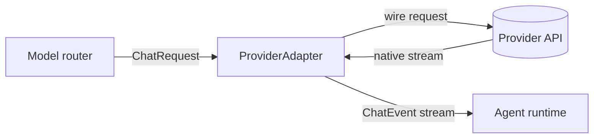

# Providers

Every model call in Rulvar goes through one interface: `ProviderAdapter`. The adapter absorbs the provider's wire quirks invisibly, so the engine, the journal, and your workflow code see one canonical request shape, one stream vocabulary, and one usage accounting model no matter who serves the tokens. Adapters are registered per engine, and models are addressed as `ModelRef` strings of the form `adapterId:model`.

## Shipped adapters

| Adapter | Package | Speaks | Use when |
|---|---|---|---|
| `anthropic()` | `@rulvar/anthropic` | Anthropic Messages API | Claude models: thinking block replay, prompt caching, typed refusals. |
| `openai()` | `@rulvar/openai` | OpenAI Responses API | GPT models: reasoning item replay, strict `json_schema` output. |
| `openaiCompatible({...})` | `@rulvar/openai` | Chat Completions dialect | Ollama, vLLM, OpenRouter, Mistral, arbitrary gateways. |
| `bridgeAiSdk(model)` | `@rulvar/bridge-ai-sdk` | Any Vercel AI SDK `LanguageModelV4` | The long tail: Google, Bedrock, Vertex, community providers. |

The first two are the first class adapters: they ship capability tables for the current model families and implement every provider specific mechanism this page describes. The factory and the bridge trade some of that depth for reach.

## Registering adapters

Hand constructed adapters to `createEngine`. There is no global registry: the adapter set, like every other registry, is strictly per engine.

```ts
import { createEngine } from "@rulvar/core";
import { anthropic } from "@rulvar/anthropic";
import { openai, openaiCompatible } from "@rulvar/openai";

const engine = createEngine({
  adapters: [
    anthropic(),
    openai(),
    openaiCompatible({ id: "ollama", baseURL: "http://127.0.0.1:11434/v1" }),
  ],
  defaults: {
    routing: {
      loop: "anthropic:claude-sonnet-5",
      extract: "openai:gpt-5.4-mini",
      summarize: "ollama:llama3.3",
    },
  },
  concurrency: {
    perProvider: { anthropic: 8, openai: 8, ollama: 2 },
  },
});
```

Three rules worth knowing up front:

- **`ModelRef` is strictly `adapterId:model`.** The left segment selects the adapter from the registry; the right segment is the wire model id the adapter sends. No query parameters, no aliases at the `ModelRef` grammar level: rulvar never resolves one ref into another. A wire model id may itself be a provider-side alias (`gpt-5.6` is OpenAI's published alias for Sol); that resolution happens on the provider's side and rulvar just prices the row it seeded for that id.
- **Duplicate adapter ids are a typed `ConfigError`** at `createEngine`. Several OpenAI compatible endpoints coexist by giving each a distinct `id`.
- **Credentials and base URLs are fixed at adapter construction.** An adapter instance is bound to one endpoint and one credential for its lifetime; run a second instance under a different id for a second endpoint.

`concurrency.perProvider` caps in flight requests per adapter id; ids without a configured cap run unlimited. Every cap (and `concurrency.perRun`) must be a positive integer: anything else, NaN included, is a typed `ConfigError` at `createEngine`. Unvalidated, a NaN cap parked the first request in the queue forever and the run could not settle, not even through `cancel()`; queue waits are also abort-aware now, so a cancelled run always drains its queued calls. These caps bound parallelism inside one engine; a shared **rate** across engines and processes is the quota limiter's job, see [shared provider quotas](/guide/model-routing#shared-provider-quotas-across-processes). Where model calls are routed, and how effort, fallbacks, and quality floors resolve, is the subject of [Model routing](/guide/model-routing).

## Authentication

| Adapter | Options | When no auth option is set |
|---|---|---|
| `anthropic()` | `apiKey`, `baseURL`, `sdkOptions`, `client` | The underlying `@anthropic-ai/sdk` resolves credentials itself: it reads `ANTHROPIC_API_KEY` and `ANTHROPIC_AUTH_TOKEN` as independent credentials (both headers when both are set), and falls back to its config-file chain only when neither is set; exact rules in [credential precedence](#anthropic-credential-precedence). |
| `openai()` | `apiKey`, `baseURL`, `sdkOptions`, `client` | The underlying `openai` SDK reads `OPENAI_API_KEY`. |
| `openaiCompatible()` | `apiKey` (optional), `baseURL` (required) | A placeholder key is sent, so keyless local endpoints like Ollama and vLLM work without configuration. |
| `bridgeAiSdk()` | none | Credentials belong to the wrapped AI SDK model; configure them on the provider package you bring. |

Keys are created in the provider dashboards: Anthropic keys in the [Claude Console](https://platform.claude.com/settings/keys), OpenAI keys on the platform's [API keys page](https://platform.openai.com/api-keys). The providers' own guides cover account setup end to end: [Get started with Claude](https://platform.claude.com/docs/en/get-started) and the [OpenAI developer quickstart](https://developers.openai.com/api/docs/quickstart). For `openaiCompatible()` the credential belongs to whoever operates the endpoint (an OpenRouter key, a gateway token); keyless local servers need none.

The zero-configuration path is the environment. Export the variable in the shell, service manager, or CI secret store that runs your host process, construct the factory with no options, and the official SDK picks the key up itself:

```bash
export ANTHROPIC_API_KEY="your-api-key" # anthropic()
export OPENAI_API_KEY="your-api-key"    # openai()
```

Reserve the explicit `apiKey` option for hosts that already own secret distribution (a vault client, per-tenant credentials). Either way, treat keys as secrets end to end: keep them out of source control and out of workflow code. Rulvar masks key-shaped strings at the telemetry boundary ([Redaction](/guide/observability#redaction)), but that is a last line of defense, not a reason to inline keys.

### Supported credential modes

An API key is one credential mode among several, and the modes differ in how the credential is minted, not in who pays. The support matrix:

| Mode | Bills | `anthropic()` | `openai()` |
|---|---|---|---|
| API key | The provider API account | `apiKey` option or `ANTHROPIC_API_KEY` | `apiKey` option or `OPENAI_API_KEY` |
| Static bearer token | The provider API account | `sdkOptions.authToken` or `ANTHROPIC_AUTH_TOKEN` | Not offered by the SDK |
| Token provider / workload identity federation | The provider API account: federation changes credential distribution (short-lived tokens minted from your identity provider), never billing | `sdkOptions.credentials` (an `AccessTokenProvider`), `sdkOptions.config` (OIDC federation), or `sdkOptions.profile`; ambient env keys are suppressed ([precedence](#anthropic-credential-precedence)) | `sdkOptions.workloadIdentity`; mutually exclusive with any API key, the environment variable included |
| Implicit SDK credential chain | Whatever the resolved credential bills | Construct with no auth option: the SDK reads the key and bearer variables as independent credentials and falls back to its config files only when neither is set ([precedence](#anthropic-credential-precedence)) | `OPENAI_API_KEY` only |
| Consumer subscription (Claude or ChatGPT app plans) | Not applicable | Not a credential mode | Not a credential mode |
| Local or keyless endpoint | Nobody | Not applicable | Via `openaiCompatible({ baseURL })` |

Two boundaries worth stating explicitly:

- **A consumer subscription is not an API credential.** Claude and ChatGPT app plans authenticate a consumer application, not an API account. Do not paste browser or session tokens, app OAuth tokens, or anything extracted from a logged-in client into `apiKey` or `authToken`: those endpoints do not accept them, and the attempt violates the providers' terms. The one subscription-backed programmatic path Anthropic ships is the Claude Agent SDK (`claude -p`), a separate product with its own harness and terms; Rulvar does not currently ship an Agent SDK adapter, so a Rulvar workflow always bills a provider API account.
- **Every supported mode above is first-class API auth.** Short-lived bearer and federation modes land usage on the same provider project as an API key; pick them for credential hygiene, not for billing reasons.

### sdkOptions and preconstructed clients

`sdkOptions` forwards official SDK construction options verbatim with one exception: `maxRetries` is excluded from the type and forced to `0` at construction, because the engine owns retries (below). Every SDK credential mode in the matrix rides through it, as do `fetch`, `timeout`, and `defaultHeaders`:

```ts
import { anthropic } from "@rulvar/anthropic";
import { openai } from "@rulvar/openai";

// A token provider minting short-lived bearers (Anthropic). Safe in an
// ordinary environment: with structured auth configured and no
// apiKey/authToken set, the adapter suppresses ambient env credentials,
// so a stray ANTHROPIC_API_KEY in the shell cannot silently win (the
// precedence rules below).
const viaProvider = anthropic({
  sdkOptions: {
    credentials: async () => ({ token: await mintFromVault(), expiresAt: null }),
  },
});

// Workload identity federation (OpenAI). Leave OPENAI_API_KEY unset:
// the SDK rejects a key plus workloadIdentity as conflicting auth.
const viaFederation = openai({
  sdkOptions: {
    workloadIdentity: {
      identityProviderId: "idp_...",
      serviceAccountId: "sa_...",
      provider: { tokenType: "jwt", getToken: () => mintSubjectJwt() },
    },
  },
});
```

#### Anthropic credential precedence

The `@anthropic-ai/sdk` decides what authenticates a request in this order, and a credential it read from the environment counts the same as one you passed:

1. **`apiKey` or `authToken` set to a string**, explicit or from `ANTHROPIC_API_KEY`/`ANTHROPIC_AUTH_TOKEN` (the SDK skips both environment reads when a `profile` is named). If either is set, a configured `credentials`/`config`/`profile` token provider is **never consulted**, the SDK does not even build its token cache: requests carry `x-api-key` for the key, bearer `Authorization` for the token, and both headers when both are set.
2. **Token providers**, only when `apiKey` and `authToken` are both null: `credentials`, else `config`, else `profile` (the SDK rejects passing more than one). Requests carry the provider's bearer `Authorization`.
3. Otherwise the SDK's **default credential chain** (its config files) resolves lazily on first request.

The whole rule set as one truth table (`apiKey`/`authToken` mean a **string** value, explicit or read from the environment; explicit `null` counts as absent). Every shorter formulation on this page, in the README, and in the TypeDoc defers to this table:

| `apiKey` | `authToken` | Structured auth configured | What authenticates | Request headers |
|---|---|---|---|---|
| string | absent | ignored (never consulted) | the API key | `x-api-key` |
| absent | string | ignored (never consulted) | the bearer token | `Authorization` |
| string | string | ignored (never consulted) | both credentials are sent; the server decides | `x-api-key` and `Authorization` |
| absent | absent | yes | the token provider (`credentials`, else `config`, else `profile`) | `Authorization` |
| absent | absent | no | the SDK's config-file chain, lazily on first request | per the resolved credential |

That first rule is a footgun for structured auth: a stray `ANTHROPIC_API_KEY` or `ANTHROPIC_AUTH_TOKEN` exported in the shell or CI would silently bypass your vault provider or federation profile and bill whatever principal that credential belongs to. The adapter closes it: **when `sdkOptions` carries structured auth (`credentials`, `config`, or `profile`) and no `apiKey` or `authToken` is set to a string anywhere, the adapter passes explicit `apiKey: null, authToken: null` to the SDK**, so the configured provider is the one that authenticates, environment or not. An explicit `apiKey: null` or `authToken: null` of your own counts as absence for this rule, never as a chosen credential, so it does not disable the protection. Setting an `apiKey` or `authToken` **string** next to structured auth is respected verbatim, with the SDK precedence above (per rule 1 the provider is then not consulted). The same suppression applies to `profile` and `config`, which resolve through the same token-provider chain.

A preconstructed client is equally first-class: `client` accepts the official `Anthropic` or `OpenAI` instance directly, no casts, or a structural `AnthropicClientLike`/`OpenAiClientLike` mock in tests. The constraints are all typed `ConfigError` raised before any network I/O: `client` is mutually exclusive with the construction options; an injected official client must have been constructed with `maxRetries: 0`; the same field set both top-level and inside `sdkOptions` is rejected; `apiKey` conflicts with `sdkOptions.workloadIdentity`. Note that a preconstructed client bypasses the suppression rule above; construct it with `apiKey: null, authToken: null` yourself when it should authenticate through a token provider in an environment that may carry keys. Rulvar never reads, logs, journals, or stringifies credential contents on any of these paths; credentials go to the official SDK and nowhere else.

All shipped adapters construct their SDK client with autoretries disabled (`maxRetries: 0`), and refuse an injected client that has them enabled. This is deliberate: the engine owns retries, backoff, and wall clock, because SDK internal retries would be invisible to the journal, the budget ledger, and your timeouts. Adapters surface rate limit and overload responses as typed retryable errors instead, and the engine's `RetryPolicy` honors any provider supplied retry delay.

## The ProviderAdapter SPI

`ProviderAdapter` is one of the six SPI seams frozen at 1.0. If the shipped adapters do not cover your provider, implementing it yourself is a supported path; [Adapter authors](/guide/adapter-authors) walks through the contract in full. The shape:

```ts
import type { ChatEvent, ChatRequest, Effort, ModelCaps, Pricing } from "@rulvar/core";

interface ProviderAdapter {
  /** Stable adapter id; the left segment of ModelRef. */
  id: string;
  /** Provider family for provider-raw matching; default = id. */
  provider?: string;
  caps(model: string): ModelCaps;
  /** Refresh the capability table from live model lists. */
  refreshCaps?(): Promise<void>;
  stream(req: ChatRequest, signal?: AbortSignal): AsyncIterable<ChatEvent>;
  countTokens?(req: ChatRequest, opts?: { signal?: AbortSignal }): Promise<number>;
}

type ModelCaps = {
  structuredOutput: "native" | "forced-tool" | "prompt";
  supportsTemperature: boolean;
  supportsParallelTools: boolean;
  reasoningEfforts: Effort[];
  contextWindow: number;
  maxOutputTokens: number;
  pricing?: Pricing;
};
```

`caps` feeds the router: it selects the structured output tier, scrubs parameters the target model rejects, and checks effort support before any live call. `pricing` here is an adapter reported fallback; the engine's versioned price table wins when both exist. See [Budgets and termination](/guide/budgets) for how normalized usage becomes dollars.


```mermaid
flowchart LR
  R[Model router] -->|ChatRequest| A[ProviderAdapter]
  A -->|wire request| P[(Provider API)]
  P -->|native stream| A
  A -->|ChatEvent stream| RT[Agent runtime]
```

### One stream vocabulary

Whatever the provider's native streaming looks like, `stream` yields the same canonical events:

| Event type | Meaning |
|---|---|
| `text-delta` | A chunk of assistant text. |
| `reasoning-delta` | A chunk of reasoning summary or visible reasoning text. |
| `tool-call-start` / `tool-call-delta` / `tool-call-end` | A streaming tool call; the end event carries assembled, parsed JSON args. |
| `usage` | Incremental usage; may repeat. |
| `finish` | Terminal: the typed finish outcome, final usage, and namespaced provider metadata. |
| `error` | Terminal: a typed, JSON serializable `WireError` with a `retryable` flag. |

Adapters emit exactly one terminal event per stream. Tool call ids in these events are engine minted, not provider minted: each adapter keeps a bijective map between canonical ids and wire ids (`toolu_*` on Anthropic, `call_*` on OpenAI), so a conversation history can move between providers without id format collisions.

### Typed refusals

A refusal is never silently projected to an empty output. It surfaces as a typed finish outcome, `{ reason: "refusal", refusal }`, carrying the adapter id and any provider stop details (type, category, explanation). The agent runtime maps it to a terminal agent error with those details attached, so ladders, escalation, and evals can react to what actually happened.

### The usage invariant

Every adapter normalizes usage so that `inputTokens` is the full prompt size, cache reads and cache writes included, and the engine verifies this at the adapter boundary. Providers disagree wildly here: Anthropic reports input tokens excluding cache traffic, so the adapter sums all three buckets; OpenAI's `input_tokens` is already the full count, with cached reads and cache writes reported as priced subsets of it, so that adapter passes the count through untouched. After normalization, cost attribution is provider neutral.

### Provider-raw retention

Some provider blocks must survive round trips byte exact: Anthropic thinking blocks with signatures, OpenAI reasoning items with `encrypted_content`. Adapters ship these on the finish event, the runtime stores them in the canonical history as `provider-raw` parts tagged with the adapter's provider family, and on every outgoing request the history projector includes a part exactly when the target model's family matches. This is what makes per role provider mixing correct: loop turns can run on Anthropic while extract runs on OpenAI, and each provider sees a valid wire history. Two adapters of the same family (say, two `openaiCompatible` gateways) share retained blocks because the family tag is `provider`, not the adapter id.

## @rulvar/anthropic

```bash
pnpm add @rulvar/anthropic
```

```ts
import { anthropic } from "@rulvar/anthropic";

const adapter = anthropic({
  apiKey: process.env.ANTHROPIC_API_KEY, // optional; the SDK reads the variable itself
  baseURL: "https://api.anthropic.com",  // optional
});
```

The adapter id is `anthropic`; address models as `anthropic:claude-sonnet-5`, `anthropic:claude-fable-5`, and so on. `ANTHROPIC_MODELS` exports the seeded capability table, and `refreshCaps()` corrects context window and output figures from the live model list. `countTokens` is implemented over the stateless count tokens endpoint; the count request carries the full prompt (egress like any dispatch), so the adapter threads the caller's abort signal into the SDK request, and the engine only issues the call after its zero-egress admission feasibility check (see [projected admission](/guide/budgets#layer-1-projected-admission-before-spawn)). Hosts whose privacy gates must run before any prompt byte reaches the provider pass an explicit `estCost` instead, which skips the count entirely.

The capability table is a **static seed**, verified against the provider's official figures on the release date, and the engine never refreshes it on its own: a hidden network call inside `createEngine` would make run identity depend on wall-clock provider state. When the host wants live figures driving admission, compaction, and the output clamp, refresh the adapter before handing it to the engine:

```ts
const adapter = anthropic();
await adapter.refreshCaps(); // GET /v1/models, paginated; corrects window/output rows
const engine = createEngine({ adapters: [adapter] /* ... */ });
```

A refresh failure rejects without touching the seed table, and pricing is never a refresh side effect: price revisions ship as versioned releases.

`ANTHROPIC_PRICING` exports the same pricing rows as a versioned `PriceTable` (`pricingVersion: "anthropic-2026-07-31"`, mirroring the official price table across all five published columns: base input, output, cache read, the 5m cache write, and the 1h cache write premium at 2x input via `cacheWrite1hUsdPerMTok`; Claude Sonnet 5 carries its introductory price, in effect through 2026-08-31). Pass it to `createEngine({ pricing })` so runs journal a concrete pricing version instead of `unpriced`; see [Model routing](/guide/model-routing#the-versioned-price-table) for the override pattern when a promotion ends or the provider revises prices. Every priced row also carries `ratesVerifiedAt`, the date it was last verified against the documented pricing table, and a weekly scripted audit re-checks the same page and opens an issue on drift instead of ever rewriting the seed; see [rate verification and drift](#rate-verification-and-drift) for the doctrine.

Provider notes:

- **Thinking block replay.** Thinking blocks arrive signed and are retained unconditionally as `provider-raw` parts. On requests to any Anthropic model they are echoed byte exact; stripping them client side risks 400 ordering and signature errors, so the adapter never does it. The server silently drops blocks minted by a different model, unbilled.
- **Prompt caching via `cacheHint`.** The provider neutral `cacheHint` on `ChatRequest` compiles into `cache_control` breakpoints. The provider caps breakpoints at 4 per request; when a hint exceeds that, the adapter keeps the deepest breakpoints and drops the shallowest, deterministically. The 5 minute TTL is the default; `ttl: "1h"` selects the long lived tier at a higher write premium. Prefixes below the model's minimum cacheable size (2048 tokens on `claude-sonnet-5` and `claude-fable-5`, 4096 on `claude-opus-4-8`) silently do not cache: the adapter sends the breakpoint unchanged, the provider declines to create the entry, and no event or error is raised; the miss is visible only in the normalized cache usage fields.
- **`pause_turn` absorption.** When a server side tool loop pauses mid turn, the adapter appends the partial assistant content and re-sends, without injecting a synthetic user message. Continuations are capped by `DEFAULT_PAUSE_TURN_MAX_CONTINUATIONS` (5). A paused turn never surfaces as a canonical finish; callers only ever see complete turns. An absorbed turn is still several WIRE requests, and the accounting sees every one (RV905): the finish metadata names the whole segment set (`providerMetadata.anthropic.wireRequests = { count, responseIds }`), the provider call record and the invoice row carry `wireResponseIds` and, since RV1210, the reported `wireRequests` COUNT beside them (a provider may leave a segment unnamed, and counting ids alone would understate the dispatch by exactly those segments; the invoice folds the counts into its [`cardinality` block](/guide/observability#the-invoice-export)), the request quota window settles at the true wire count instead of one per dispatch (and under the opt-in `quota: { reserveContinuations: true }` each continuation is admitted in the limiter BEFORE its egress, RV1013, so a hard RPM cap holds pre-wire instead of post-hoc; a finish that names NO wire set releases nothing, because nothing then proves which grants went unused, RV1210), and [statement reconciliation](#openai-statement-reconciliation) joins a per-request export by any id of the set. The terminal finish also speaks for the whole logical turn in USAGE (RV1003): every segment reports its own counts mid-stream as it streams (the live budget debits them as deltas), and the finish carries the sum across segments, so the engine's midstream-versus-finish invariant confirms the per-segment reports instead of killing a legitimate absorption, and every paid segment stays in the money. `pauseTurnMaxContinuations` must be a nonnegative safe integer: any other present value (NaN included) refuses typed before the first wire (RV1004), because a disarmed bound turns every further continuation into unplanned paid traffic. The absorbed set survives the error arms too (RV1805): the whole wire set used to ride only the successful finish, so a create() failure, a truncated read, the continuation cap, or a pre-wire segment denial arriving AFTER absorbed segments orphaned exactly the paid wires a statement join needs; every error arm now carries `wireRequests = { count, responseIds }` of the COMPLETED absorbed segments in its error data (the failing attempt itself is unknowable from a throw), the provider call record and the invoice row keep the ids and the count even on an errored dispatch (a single absorbed segment included), and a first-segment failure stays a bare error, nothing invented. A single-segment turn carries none of this and stays byte-identical.
- **Typed refusal outcomes.** Anthropic refusals carry structured stop details; the adapter passes type, category, and explanation through on the refusal finish outcome described above.
- **Rate limits, 529, and retry-after.** 429 responses surface `retryAfterMs` plus the rate limit bucket headers on the typed error; 529 overloaded is a distinct retryable class alongside 500. Only the RFC delta seconds grammar of `Retry-After` is honored, a nonempty run of decimal digits padded by HTTP optional whitespace at most (space and horizontal tab; never the wider ECMAScript whitespace, so newline, carriage return, vertical tab, form feed, and NBSP padding all disqualify): anything else (the HTTP date form, signs, decimals, hex, exponents, and empty values included) omits `retryAfterMs` so the computed backoff applies, and a huge value is clamped to a timer safe bound. The adapter never sleeps internally; the engine's `RetryPolicy` schedules the retry and honors the validated provider supplied delay.
- **Usage normalization.** Anthropic reports `input_tokens` excluding cache reads and writes; the adapter normalizes to the usage invariant by summing all three, and fills `cacheReadTokens` and `cacheWriteTokens` from the cache usage fields so cache effectiveness is directly observable. The `cache_creation` TTL breakdown fills the canonical split too (RV810): when `ephemeral_5m_input_tokens` and `ephemeral_1h_input_tokens` agree with the flat total (or replace an absent one), the usage carries `cacheWrite5mTokens` and `cacheWrite1hTokens`, the invariant demands they sum to `cacheWriteTokens`, and `priceUsdOf` bills the 1h share at the pricing row's `cacheWrite1hUsdPerMTok` (the 2x premium) instead of folding everything at the 5m rate; a breakdown that contradicts the flat total is dropped, because the flat total is the billable number and the undifferentiated 5m fold is the historical conservative default.
- **Effort and sampling.** All five canonical effort levels pass through to the wire, `max` included; the capability table records which levels each model accepts, and the router scrubs an unsupported effort visibly (the requested effort stays in journal identity). Current models reject `temperature`, `top_p`, and `top_k` outright, so the capability table declares `supportsTemperature: false` and the router scrubs those too instead of letting the provider return a 400.
- **Reasoning shares the output allowance.** Adaptive thinking tokens count against `max_tokens`, so a high-effort call under a tight `maxOutputTokensPerTurn` can spend the whole allowance on reasoning and end the turn at `max_tokens` with no visible text. The engine surfaces that as the typed [output truncation](/guide/agents#output-truncation) instead of an empty success. Give high-effort roles output room (`limits: { maxOutputTokensPerTurn: 5_000 }` is a practical starting point, not a guarantee) or reduce the effort.

## @rulvar/openai

```bash
pnpm add @rulvar/openai
```

```ts
import { openai } from "@rulvar/openai";

const adapter = openai({
  apiKey: process.env.OPENAI_API_KEY, // optional; the SDK reads the variable itself
});
```

The adapter id is `openai`; address models as `openai:gpt-5.6-sol`, `openai:gpt-5.6-terra`, `openai:gpt-5.6-luna`, `openai:gpt-5.5`, or `openai:gpt-5.4-mini` (`openai:gpt-5.6` is the published alias for Sol, and an EXACT alias only: Terra and Luna are sibling models with their own rows, never snapshots of the alias). `OPENAI_MODELS` exports the seeded capability table, long-context price tiers included, and `OPENAI_PRICING` exports the same pricing rows as a versioned `PriceTable` (`pricingVersion: "openai-2026-07-31"`, carrying the provider's 2026-07-30 price cut on Terra and Luna that the weekly audit caught as drift) for `createEngine({ pricing })`; each priced row carries `ratesVerifiedAt` (the GPT-5.6 family reads `2026-07-31`, the docs re-verification of every model page; Sol's unchanged rates additionally remain billing-confirmed by the 2026-07-30 [statement reconciliation](#openai-statement-reconciliation), while the new Terra and Luna rates await theirs over a future export; the pre-5.6 rows keep their `2026-07-18` docs verification), and [rate verification and drift](#rate-verification-and-drift) explains what that date does and does not claim. On GPT-5.6 and later families the adapter also accounts prompt cache writes: `input_tokens` is the full input count and `input_tokens_details.cache_write_tokens` reports the subset of it written to cache, billed at 1.25x the uncached input rate through `cacheWriteUsdPerMTok` (verified on the live wire: identical prompts report the same `input_tokens` whether the details show a write or a read, and `total_tokens` is exactly input plus output). The subsets are never added on top of the full count; earlier families report no such field and pay no premium. Dated snapshots (`<model>-YYYY-MM-DD`) inherit their exact model's row; any other unknown name gets conservative unpriced caps and surfaces in `CostReport.unpriced` instead of a fabricated total. Canonical reasoning effort `max` goes to the wire unchanged on every GPT-5.6 sibling (Sol, Terra, and Luna, each verified live); on earlier and unknown models it downmaps to `xhigh`, recorded in `providerMetadata.openai.effortDownmapped`. The primary surface is the Responses API; Chat Completions exists only as a documented degraded path.

Provider notes:

- **Manual item replay only.** The adapter sends `store: false` with `include: ["reasoning.encrypted_content"]` and replays prior output items from the canonical history itself. `previous_response_id` and the Conversations API are rejected as a typed `ConfigError`, even through `providerOptions`: server side conversation state lives outside the journal and would break replay identity.
- **Reasoning items.** Reasoning items are retained as `provider-raw` parts and echoed byte exact between function calls, `encrypted_content` included. OpenAI decrypts in memory and never persists, so reasoning quality and cache efficiency survive across tool calls without any state leaving your store.
- **Strict `json_schema` output.** The native structured output tier sends `text.format = { type: "json_schema", ... }` with explicit `strict: true`, never relying on the API's silent best effort fallback for incompatible schemas. When a schema is not strict compatible, the router selects a lower tier loudly instead.
- **Effort mapping.** `reasoning.effort` accepts low through xhigh everywhere, and wire `max` on the whole GPT-5.6 family (Sol, Terra, and Luna), where canonical `max` passes through unchanged. On models without verified wire `max` (the pre-5.6 families and unknown names) it downmaps to `xhigh`; the downmap is recorded in provider metadata while journal identity keeps the requested `max`. When the request omits effort entirely, the provider default applies: `medium` on GPT-5.6 and gpt-5.5.
- **Degraded Chat Completions path.** Models unavailable on Responses are served through Chat Completions with documented degradations: delta patched chunk assembly, no reasoning item replay, `response_format` instead of `text.format`. Selection is a capability fact, visible in events, never silent.

### Legacy cache journals from v1.19.0 {#openai-legacy-cache-journals}

rulvar v1.19.0 (one release, superseded the next day) read `cache_write_tokens` as ADDITIONAL tokens and added them on top of the full `input_tokens`, double-billing every written token at the base rate plus the 1.25x premium. The error direction was overcharge, never undercharge, and only OpenAI runs that journaled cache writes are affected. Journals are immutable, so v1.21.0 does not rewrite them; it makes the drift visible and auditable instead:

- Every new usage-bearing entry is stamped with the serving adapter's declared `usageSemantics` (the OpenAI adapter declares `openai-cache-subsets-v2`). An UNSTAMPED OpenAI entry with cache writes therefore predates the stamp and, if your deployment history says it was recorded by v1.19.0, carries the inflated reading. The stamp survives VCR replay: since v1.31.0 `record` snapshots the serving adapter's declaration into each cassette row and `replay` declares it on the rebuilt adapter, so a replayed run's fresh journal is stamped exactly like the recorded one (cassettes recorded earlier carry no snapshot and replay unstamped). Under `onMiss: 'passthrough'` the recorded declaration must also match the live adapter's, and a live only adapter keeps its own, so a live served miss is never journaled under a stale or missing stamp.
- Resuming a run whose journal contains that shape emits a one-time `RULVAR_LEGACY_CACHE_SEMANTICS` warning. The resume itself keeps the recorded debits: the overstated spend consumes MORE of every ceiling, which is the conservative direction, and replay identity is untouched. If the inflated debits would exhaust a tight ceiling prematurely, start a fresh run or raise the ceiling deliberately; nothing recalculates behind your back.
- For completed reports, `@rulvar/openai` exports the exact sidecar inversion: `undoV1190CacheDoubleCount(usage)` subtracts the write count back out of one usage, and `auditV1190CacheJournal(entries, priceUsd)` folds a journal both ways and returns `{ affectedEntries, recordedUsd, correctedUsd }` without touching the journal. The transformation is exactly invertible because the broken adapter's arithmetic is exactly known; apply it only to journals your deployment history attributes to v1.19.0.

One caveat: a run suspended mid-agent under v1.19.0 and resumed under a later release folds the pre-suspension checkpoint slices into an entry stamped with the CURRENT semantics; the audit helpers cannot see through that stamp, so treat such runs as affected by provenance, not by shape.

### Reconciling against the provider's statement {#openai-statement-reconciliation}

`reconcileStatement(invoice, statement, { pricingOf })` closes the "does the provider agree with our number" question with a report instead of screenshots. Since RV1703 the machine lives in `@rulvar/core` (the historical `@rulvar/openai` exports remain as re-exports of the identical functions): it was provider-neutral from birth, typing only against the invoice and the pricing SPI, so it reconciles ANY adapter's invoice, and its old home forced Anthropic-only consumers into an OpenAI dependency for a join that never touched OpenAI code. It joins the machine-readable invoice (`invoiceFromJournal`) against a NORMALIZED provider export, in one of two shapes: per-request rows (`{ kind: 'requests', rows }`, each row carrying the provider's `responseId` plus any of `usd`, `componentsUsd`, or provider-reported token counts) joined by response id, or per-model per-component totals (`{ kind: 'categories', rows }`, the dashboard Spend-categories shape: `{ model, component, usd }` over `input`, `cached-input`, `cache-write`, `output`). A headline total is refused typed: an eventually consistent dashboard aggregate is not evidence (in the twelfth comparison run the headline read 4.45 then 4.77 USD while the per-component categories confirmed the settled 7.304885 to the cent; the same page disagreed with itself on the request count), so the input is always rows, never one number.

Getting a raw export INTO those shapes is `statementFromRows({ kind, rows, map })` (RV1703): provider export formats change without notice and differ per tenant surface (CSV headers, JSON field names), so the normalizer deliberately ships NO per-provider schema knowledge; the caller states one explicit `StatementColumnMap` naming which key of their rows carries the response id, the dollars, each token count, or a per-component split, and the intake validates every mapped cell fail-closed, naming the row and column of anything that cannot be evidence (a non-numeric dollar figure, a fractional or negative token count, an empty response id, an unknown component name). Absent cells mean "the export does not carry this figure" and omit the field; a requests row left with no dollars, no split, and no usage refuses, because a row without evidence cannot reconcile anything.

What each adapter contributes to the join is a fixed, tested contract, documented where each surface is specified on this page:

| Adapter surface | Continuations on the wire | What the invoice row carries for the join | Cache accounting in the compared usage |
|---|---|---|---|
| `@rulvar/anthropic` | `pause_turn` absorbed, capped by `DEFAULT_PAUSE_TURN_MAX_CONTINUATIONS`; one logical dispatch, several wire requests | every segment's response id in `wireResponseIds` plus the reported `wireRequests` count; the join matches by ANY id of the set, all or nothing | cache read and write reported per wire request and summed on the finish ([details](#rulvar-anthropic)) |
| `@rulvar/openai` | none server-side by contract: `previous_response_id` is never used, history is replayed manually | one identity-bearing `responseId` per wire request | `cache_write_tokens` is a subset of `input_tokens`, billed at the write premium on GPT-5.6 and later ([details](#rulvar-openai)) |
| `openaiCompatible` | Chat Completions shape, no server-side continuations | the endpoint's response id when the endpoint reports one; rows without one are named by the coverage block, never silently matched | endpoint-dependent; unreported fields are never invented |
| `@rulvar/bridge-ai-sdk` | provider-dependent through the AI SDK v4 interface | the flat `responseId` whenever the underlying provider reports one (pinned by the bridge provenance tests) | as the SDK reports it |

The report carries three things a divergence investigation actually needs. Coverage first: how many billable invoice rows the export covered (`matchedRows` of `billableRows`, with unmatched response ids named), because a partially delivered export must read as `partial-coverage`, never as false divergence; the component deltas fold over the covered subset only. Per-component deltas second: our dollars come from the same `priceComponentsOf` decomposition the settled fold prices with, summed per serving model, so the comparison inherits per-request tier semantics exactly. Implied rates third: every line reports `impliedUsdPerMTok` (what the statement's dollars actually work out to over our token base) beside `effectiveUsdPerMTok` (ours over the same base), so a real divergence NAMES the rate-card line that moved, with its actual rate, instead of printing one inexplicable total. Models the rate card does not cover surface in `unpricedModels`, `usageUnknown` rows are counted apart and never folded, and the verdict is one of `match`, `divergence`, `partial-coverage`, `no-overlap`. The report also states the settlement-grade composite first class (RV1006): `settleable` is true exactly when the verdict is `match`, coverage is complete, no row settled `usageUnknown`, and no model went unpriced, so a consumer never assembles that predicate by hand (a `match` alone can sit beside a usage-unknown attempt whose money no export names). The default per-component tolerance (0.005 USD) absorbs the dashboard's 3-decimal rounding with an order of margin. Like the v1.19.0 audit above, this is a pure sidecar: nothing reads or writes a journal, and the report is yours to store next to the invoice it reconciles.

A dispatch that absorbed provider-side continuations (`pause_turn`) is ONE invoice row carrying every segment's response id in `wireResponseIds`, while the provider's per-request export bills each wire request as its own row: the join matches such a row by ANY id of its set, all-or-nothing (comparing a partial segment subset against the whole dispatch would manufacture divergence out of incomplete delivery, so a partially delivered segment set reads `partial-coverage`, its delivered segments never counted as statement-only), and provider-reported token counts compare as the SUM over the segments against the dispatch's recorded usage.

The intake fails closed on numbers that cannot be evidence: a non-finite or negative dollar amount (`usd` or any `componentsUsd` entry), a non-integer or negative token count, and a non-finite or negative tolerance all refuse with a typed `ConfigError` naming the row and field, instead of flowing `NaN` through the sums to a false `match` (a corrupted export once read `verdict: 'match'` with `NaN` totals, because `Math.abs(NaN) > tolerance` is false; credits and adjustments reconcile separately, never as negative statement rows). Internal consistency is intake's job too (RV1005): a row carrying both `usd` and a `componentsUsd` split must have them agree within `totalToleranceUsd`, else it refuses typed, because an export whose own total contradicts its own components is not evidence; and a split's presence no longer suppresses the totals comparison, so whenever both sides' dollar claims cover the same set, a total drifting beyond `totalToleranceUsd` reads `divergence` even while every component line sits inside its own tolerance. An affirmatively declared EMPTY claim refuses too (RV1201): a per-request row whose `usage` or `componentsUsd` is an object with no figures used to read verdict `match` with complete coverage and `settleable: true` on the object's mere presence (the sixteenth experiment's judge reproduced exactly that), so it now refuses typed naming the row and the empty field; a row declaring only its `responseId` still joins, because presence is coverage, not a figure claim. Provider-reported token counts also weigh on the verdict by default: our recorded counts ARE the provider's own wire-reported numbers, so an export that disagrees with them describes a different request than the wire served, and any token mismatch reads as `divergence` even when the dollars agree, with `tokenMismatchSample` naming the rows. An export whose token semantics legitimately differ from the wire's (a different cache accounting, rounded aggregates) can opt into `tokenComparison: 'informational'` to restore the dollar-only verdict; the mismatch count and sample still report either way. The join key is held unique on BOTH sides (RV1804): a duplicate response id among the statement rows refuses typed, and so does a duplicate among the local invoice rows themselves (segment ids of multi-wire dispatches included), because two local rows claiming one provider response make the join ambiguous in the other direction, and a usage-only export would otherwise settle `match` with the double-booked local row silently absorbed.

### Rate verification and drift {#rate-verification-and-drift}

A pricing seed makes two different kinds of claims, and rulvar keeps them apart. The seed's **rates** are conservative facts for bounding: admission reserves, run ceilings, and the settled fold all price under them, so a stale seed errs by refusing work early or reporting spend the provider will not actually bill, never by hiding spend. The seed's **fidelity to the provider** is a verification event with a date: every priced row carries `ratesVerifiedAt`, the ISO date it was last checked against the provider's documented rate pages or, stronger, against the provider's own billing categories (Sol's rates carry both kinds of evidence: billing-confirmed on `2026-07-30`, when the twelfth-run statement reconciliation matched all eight per-model per-component dashboard categories to the cent, and docs re-verified with the rest of the family on `2026-07-31`, the revision that picked up the provider's Terra and Luna price cut).

The date is surfaced wherever a dollar figure is consumed: `preflightEstimate` stamps it on each spawn report (`ratesVerifiedAt`, rendered by `rulvar preflight` with its age), the settle pin journals it with the rest of the applied row, and `rulvar invoice` prints a `rates verified:` line naming each priced model's date and age, from the pinned rows where the journal has pins (the rates that actually priced settled history) and from the current table past them.

Three rules keep the mechanism honest. A weekly scripted audit (`scripts/rates-audit.mjs`, riding the live contract workflow) re-fetches exactly the documented pages the seed comments cite, compares every rate, write premium, and long-context tier against the seed **in both directions**, and opens an issue on any divergence or on a page whose shape stops extracting; it never rewrites a seed. Both directions means a documented rate the seed never declared is a finding too, not just a seed rate the page moved or dropped: a billable column missing from the seed is a silent underpricing channel (the 1h cache-write premium hid exactly there until it was seeded), so the audit fails closed on it. Long-context tiers obey the same rule (RV1007): a tier the page documents and the seed never declared is a finding, and a rate whose extraction stops parsing (`NaN` on either side) is a finding too, never a clean pass. The audit verifies **documentation, not billing**: what the provider's docs page says and what the provider's meter charges are different authorities, and only a statement reconciliation over saved exports settles the second (the twelfth run's dashboard headline contradicted the seed while the billing categories confirmed it to the cent). And a confirmed rate change ships as its own release with a changeset and a new `pricingVersion`, so a resumed run surfaces the rotation as explicit drift instead of silently reinterpreting recorded spend. The full order is audit, then release, then new pinned runs: only runs started after the release record under the new pins, recorded history keeps the pins its settles wrote, and the three dollar figures a run can show stay distinct quantities throughout (see [the three moneys](/guide/budgets#the-three-moneys)).

Anything that speaks the Chat Completions wire format can be an adapter. The factory requires an explicit `id` and `baseURL`:

```ts
import { openaiCompatible } from "@rulvar/openai";

const ollama = openaiCompatible({
  id: "ollama",
  baseURL: "http://127.0.0.1:11434/v1",
});

const openrouter = openaiCompatible({
  id: "openrouter",
  baseURL: "https://openrouter.ai/api/v1",
  apiKey: process.env.OPENROUTER_API_KEY,
  caps: (model) => ({
    structuredOutput: "forced-tool",
    supportsParallelTools: true,
    contextWindow: 131072,
    maxOutputTokens: 32768,
  }),
});
```

Gateways cannot be introspected reliably, so when you supply no `caps` function the factory assumes the most conservative capability set, exported as `CONSERVATIVE_COMPATIBLE_CAPS`: prompt tier structured output, temperature supported, no parallel tools, no reasoning efforts, an 8192 token window, 4096 output tokens, and no pricing. Supply `caps` for anything beyond that; partial returns merge over the conservative base per model.

Two facts follow from the conservative posture. Absent pricing is legitimate for local models: they surface as unpriced in cost reports, never as a silent zero. And the provider family of every factory adapter is `openai` regardless of the custom id, so gateways of the same dialect share history projections.

## @rulvar/bridge-ai-sdk

```bash
pnpm add @rulvar/bridge-ai-sdk @ai-sdk/google
```

```ts
import { google } from "@ai-sdk/google";
import { bridgeAiSdk } from "@rulvar/bridge-ai-sdk";

const gemini = bridgeAiSdk(google("gemini-2.5-pro"), {
  id: "google",
  caps: () => ({
    contextWindow: 1048576,
    maxOutputTokens: 65536,
    supportsParallelTools: true,
  }),
});
```

`bridgeAiSdk` wraps any Vercel AI SDK `LanguageModelV4` into a `ProviderAdapter`, opening the AI SDK's whole provider catalog (Google, Bedrock, Vertex, and the community ecosystem) without coupling the engine to the AI SDK release cycle. You bring the concrete provider package (here `@ai-sdk/google`) and hand its model object to the bridge.

- **Runtime version check.** The bridge checks `specificationVersion` at runtime and fails with a typed `ConfigError` on mismatch, so a transitive provider package major bump cannot mis-wire silently. It targets `LanguageModelV4` from `@ai-sdk/provider` version 4.
- **One adapter per wrapped model.** A V4 model instance is bound to one model id at construction, and the bridge enforces that the `ModelRef` segment matches it. Register one bridge adapter per model; `id` defaults to the wrapped model's provider string, so pass explicit ids to register several models of the same provider side by side. The `provider` option sets the family for provider-raw sharing and also defaults to the wrapped model's provider string.
- **Capabilities.** Like the factory, the bridge cannot introspect its target: the conservative defaults mirror `CONSERVATIVE_COMPATIBLE_CAPS` except `structuredOutput`, which is `"native"` because the V4 `responseFormat` json mechanism is accepted by every AI SDK provider. Supply `caps` for real windows and pricing.
- **Retention still works.** Reasoning parts with their provider metadata, provider executed tool exchanges, and generated files are collected and retained through the same provider-raw mechanism as the first class adapters, then reinserted into the prompt on replay to the same family. Fidelity holds on the edges too: an errored provider executed result reinserts as an error, only the final result of a preliminary result chain is retained, and a reasoning segment still open at finish is flushed into retention rather than dropped.
- **Provider-executed tools are a policy surface, denied by default (RV1806).** A wrapped provider can run tools server-side (web search, code execution): those calls never pass the engine's `ToolDef` registry, risk classes, ask rules, or approvals, and their effects happen on provider infrastructure regardless of any permission chain. Under the default `providerExecutedTools: 'deny'` the first provider-executed exchange fails the turn with a typed terminal error naming the tool (the bridge cannot un-run what the provider already executed; it refuses to continue a turn policy cannot see, and the journaled terminal says what ran). `providerExecutedTools: 'allow'` opts in: the exchange is retained exactly as before, and the finish metadata additionally names every provider-executed call (`providerExecutedTools: [{ toolName, toolCallId }]`), so the journaled record answers "what did the provider run" without a transcript dig.
- **First class doctrine applies.** An error finish ships the provider's usage ahead of the terminal error, so a failed stream still bills honestly. Tool arguments that fail the strict JSON parse travel as the same `{__unparsed: raw}` wrapper the first class wires use, so the engine's deterministic second chance can repair them instead of the turn being destroyed, and the wrapper projects back into history as the raw text the model wrote. A requested abort never surfaces as a provider error, and the bridge cancels the wrapped V4 stream whenever it terminates early, tearing the provider connection down instead of leaking it.

::: warning The highest churn package
The AI SDK ecosystem moved its language model interface through three majors in roughly eighteen months, and `@rulvar/bridge-ai-sdk` tracks it. Expect this package to be the likeliest source of breaking minors in the set; the version check above turns any mismatch into a loud, typed failure instead of subtle mis-wiring. See [Versioning](/reference/versioning).
:::

## Which package do I install?

| You want | Install |
|---|---|
| Claude and GPT models, batteries included | `pnpm add @rulvar/rulvar` (re-exports `anthropic()` and `openai()`) |
| Just the engine plus one provider | `pnpm add @rulvar/core @rulvar/anthropic` |
| A local or gateway endpoint | `pnpm add @rulvar/openai` and use `openaiCompatible` |
| Anything the Vercel AI SDK supports | `pnpm add @rulvar/bridge-ai-sdk` plus the concrete `@ai-sdk/*` provider |

## Next steps

- [Model routing](/guide/model-routing): the resolution chain, invocation roles, effort, fallbacks, and quality floors.
- [Adapter authors](/guide/adapter-authors): implement `ProviderAdapter` for a provider Rulvar does not ship.
- [Budgets and termination](/guide/budgets): how normalized usage and the price table bound spend.
- [Testing](/guide/testing): `FakeAdapter` and VCR cassettes for provider free tests.
- API reference: [@rulvar/anthropic](/api/@rulvar/anthropic/), [@rulvar/openai](/api/@rulvar/openai/), [@rulvar/bridge-ai-sdk](/api/@rulvar/bridge-ai-sdk/), [@rulvar/core](/api/@rulvar/core/).
