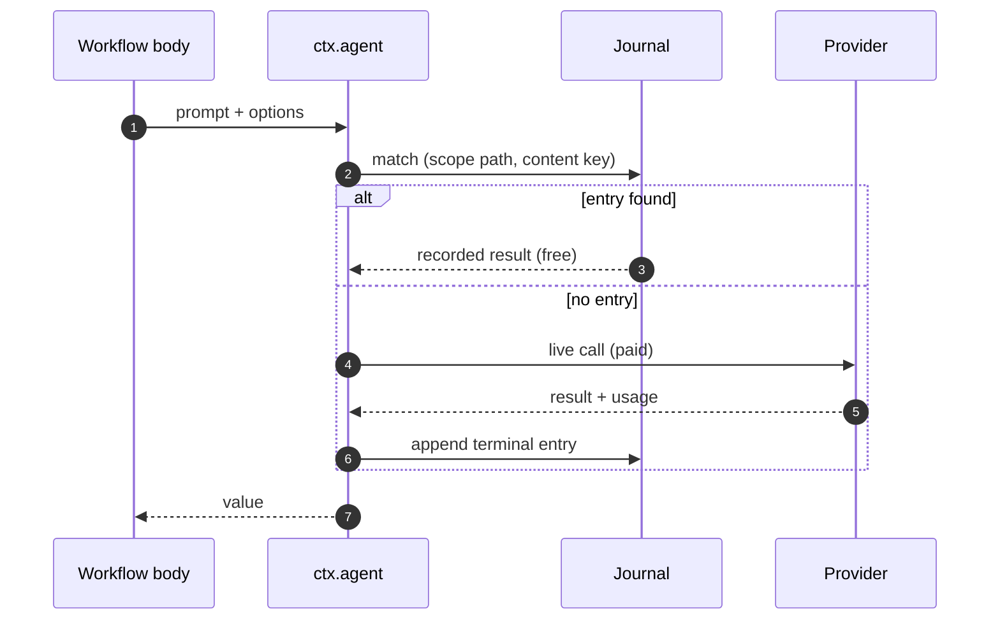

# Quickstart

Ten minutes, one file. You will install Rulvar, define a workflow that fans out three competing agents and judges their answers, run it under an immutable two-dollar budget, and then resume the finished run to watch every completed call come back from the journal at zero cost. That last step is the point of the library: a completed LLM call is never paid for twice.

## What you'll build

A judge panel that:

1. Generates three answers to one question in parallel, each from a different angle.
2. Scores each answer with a structured-output judge call.
3. Runs under an immutable dollar ceiling with a full cost report at the end.
4. Survives a process restart: on resume, finished calls replay from disk instead of hitting the provider again.

## Install

```bash
pnpm add @rulvar/rulvar zod
```

The quickstart file below uses top-level `await`, so your project must be ESM: your `package.json` needs `"type": "module"`, which a fresh `pnpm init` does not add. One command sets it:

```bash
npm pkg set type=module
```

`@rulvar/rulvar` is the umbrella package: it re-exports all of `@rulvar/core` plus the first-class `anthropic` and `openai` adapters, the recommended model defaults, and a terminal progress renderer. If you prefer granular dependencies, `pnpm add @rulvar/core @rulvar/anthropic` gives you the same engine, stores, and workflow primitives, but `recommendedDefaults` and `renderProgress` ship only in the umbrella package: on the granular path you write your routing by hand and render events yourself. See [Installation](/guide/installation) for the full package map.

You need Node.js 22.12.0 or newer, ESM only, and an `ANTHROPIC_API_KEY` (or `OPENAI_API_KEY`; the [OpenAI variant](#swap-in-openai) is at the bottom of this page). Keys are created in the [Claude Console](https://platform.claude.com/settings/keys) or on the [OpenAI API keys page](https://platform.openai.com/api-keys); export yours in the shell that will run the script:

```bash
export ANTHROPIC_API_KEY="your-api-key"
```

The adapter hands it to the official SDK unchanged; [API keys](/guide/providers#api-keys) covers the explicit `apiKey` option and compatible endpoints.

## Create an engine

Everything in Rulvar hangs off an `Engine`: adapters talk to providers, stores make runs durable, and routing decides which model serves which role.

```ts
import {
  createEngine,
  anthropic,
  recommendedDefaults,
  JsonlFileStore,
  FileTranscriptStore,
} from '@rulvar/rulvar';

const engine = createEngine({
  // With no options the adapter uses the official SDK's defaults,
  // which read ANTHROPIC_API_KEY from the environment.
  adapters: [anthropic()],
  stores: {
    journal: new JsonlFileStore({ dir: '.rulvar/journal' }),
    transcripts: new FileTranscriptStore({ dir: '.rulvar/transcripts' }),
  },
  defaults: {
    routing: {
      // Strong defaults for the orchestrate, plan, and summarize
      // roles; hosts override freely.
      ...recommendedDefaults.routing,
      // The role every ctx.agent tool loop runs under.
      loop: 'anthropic:claude-sonnet-5',
      // The recommended extract default targets an OpenAI model, and
      // this engine registers only the anthropic adapter, so route
      // extract to anthropic explicitly. Every ctx.agent call that
      // passes a schema resolves the extract role.
      extract: { model: 'anthropic:claude-sonnet-5', effort: 'low' },
    },
    roleFloors: recommendedDefaults.floors,
  },
});
```

Models are referenced as `'adapterId:model'` strings; per-role routing and the full resolution chain are covered in [Model routing](/guide/model-routing). The `extract` override above is load-bearing, not defensive: every `ctx.agent` call that passes a `schema` resolves the `extract` role up front (whether or not a separate extraction call turns out to be needed), and resolving a role to an unregistered adapter is a typed `ConfigError`. An engine that registers only one adapter must route `extract` to that adapter, as here, or register both adapters and keep the recommended default.

::: warning Durable stores unlock resume
Without a configured journal store the engine falls back to an in-memory store: runs work, but nothing survives a process exit, so a restarted process cannot resume them, and the engine warns loudly. The file-backed stores above are the smallest durable setup; SQLite and custom backends are covered in [Stores](/guide/stores).
:::

## Define the workflow

A workflow is an ordinary async function `(ctx, args) => result` registered through `defineWorkflow`. Every primitive is a method of the injected `ctx`: no globals, no singletons, safe to embed anywhere.

```ts
import { z } from 'zod';
import { defineWorkflow, type Ctx } from '@rulvar/rulvar';

const verdictSchema = z.strictObject({
  score: z.number(),
  rationale: z.string(),
});

interface PanelArgs {
  question: string;
}

const panel = defineWorkflow(
  { name: 'quickstart-panel' },
  async (ctx: Ctx, args: PanelArgs) => {
    const angles = ['practical', 'skeptical', 'creative'];

    const judged = await ctx.parallel(
      angles.map((angle) => async () => {
        // No schema: the agent returns text. estCost is the admission
        // reserve for this call; without it the engine reserves a whole
        // maxOutputTokens turn at the model's price (about a dollar on
        // strong tiers), and three parallel reservations like that would
        // not fit the two-dollar ceiling below.
        const attempt = String(
          await ctx.agent(
            `Answer from a strictly ${angle} point of view, in one paragraph: ${args.question}`,
            { label: `attempt-${angle}`, estCost: 0.05 },
          ),
        );
        // With a schema the return value is typed and validated.
        const verdict = await ctx.agent(
          `Score this answer from 0 to 10 for the question "${args.question}".` +
            `\n\nAnswer to score:\n\n${attempt}`,
          { schema: verdictSchema, label: `judge-${angle}`, estCost: 0.02 },
        );
        return { angle, attempt, score: verdict.score };
      }),
    );

    const ranked = [...judged].sort((a, b) => b.score - a.score);
    return {
      best: ranked[0],
      ranking: ranked.map(({ angle, score }) => ({ angle, score })),
    };
  },
);
```

Two primitives carry this whole page:

- `ctx.agent(prompt, opts)` spawns one agent: a model tool loop that runs until it produces a result. Pass a `schema` (any Standard Schema value, a zod object here) and the call resolves with the validated, typed output. `label` is telemetry only; it names the call in progress lines and never affects identity.
- `ctx.parallel(tasks)` runs task thunks concurrently under the per-run scheduler (12 concurrent model calls by default) and resolves in source order. Each branch is journaled as it completes.

Both compose freely with plain TypeScript: loops, conditionals, `ctx.pipeline` for streaming stages, `ctx.step` for memoizing host computation. See [Workflows](/guide/workflows) and [Agents](/guide/agents).

## Run it under a ceiling

```ts
import { renderProgress } from '@rulvar/rulvar';

const args = { question: 'Should a five-person startup adopt a monorepo?' };

const handle = engine.run(panel, args, {
  runId: 'quickstart-panel-1', // explicit so we can resume it below
  budgetUsd: 2,                // the run ceiling; immutable after start
});

void renderProgress(handle.events); // live progress lines on stderr

const outcome = await handle.result;

console.log(outcome.status);        // 'ok'
console.log(outcome.value?.best);   // { angle, attempt, score }
console.log(outcome.cost.totalUsd); // e.g. 0.0261
console.log(outcome.cost.byModel);  // { 'anthropic:claude-sonnet-5': 0.0261 }
```

Save the three snippets above as one file, `quickstart.ts`, and run it with `npx tsx quickstart.ts` (or any TypeScript runner). If the run aborts with `Top-level await is currently not supported with the "cjs" output format`, your `package.json` is missing the `"type": "module"` line from the [Install](#install) step (naming the file `quickstart.mts` works too).

`budgetUsd` is the run ceiling. No API can raise it after start, and it is enforced by the three-layer budget:

| Layer | When it acts | What it does |
|---|---|---|
| Projected admission | before every spawn | Denies a spawn whose reserve (`estCost`, or a priced worst-case turn) does not fit spend plus committed reserves under every ceiling in its chain |
| Per-turn guard + output bound | before every agent turn | Refuses a turn the sub-account cannot afford and clamps the request's `maxOutputTokens` to what the remaining budget buys |
| Abort ceiling | while streams are live | Severs in-flight streams; the residual overshoot is bounded by one turn per in-flight agent, because a provider bills the tokens it has already generated |

If the ceiling is hit, ctx primitives throw a typed `BudgetExhaustedError` and the run settles with status `'exhausted'`, carrying the full cost report plus the dropped and pending evidence. Exhaustion is never a bare null. Details in [Budgets](/guide/budgets).

The `RunOutcome` you awaited carries `status`, the workflow's return `value`, `dropped` (surfaced losses), `pending` (open external inputs), token `usage`, and `cost`, a `CostReport` with `totalUsd` broken down `byModel`, `byPhase`, `byAgentType`, and `byRole`. Usage on models missing from pricing lands in `cost.unpriced` rather than silently counting as zero.

`handle.events` is a typed `AsyncIterable<WorkflowEvent>` and `handle.on(type, cb)` subscribes to single event types; the ones you will meet first:

| Event | When it fires |
|---|---|
| `run:start` / `run:end` | The run begins (`resumed: true` on resume) and settles (`status`, `totalUsd`). |
| `agent:start` / `agent:end` | Per spawn; `agent:end` carries `usage`, `costUsd`, and the journal `entryRef`. |
| `agent:stream` | Token deltas, for spawns started with `stream: true`. |
| `budget:update` | Spend or committed reserves changed. |
| `external:waiting` | The run suspended on an external input. |

The full catalog lives in [Observability](/guide/observability).

## Resume the run: nothing is paid twice

Every completed effect of the run above was appended to the journal: a content-addressed memoizing log keyed by scope path and content key. Resume the same `runId` and the engine executes the workflow body again, but each `ctx.agent` call is first matched against the journal. A match replays the recorded result; only a miss becomes a live, paid call.

```ts
const resumed = engine.resume('quickstart-panel-1', panel, { args });

void renderProgress(resumed.events);

const outcome = await resumed.result;
const replay = await resumed.preview; // replay accounting, resolves at settle

console.log(replay.hits);   // 6: three attempts and three judges, all from disk
console.log(replay.misses); // 0: no live calls
console.log(replay.reruns); // 0: nothing had to be re-executed
console.log(outcome.cost.totalUsd, outcome.value?.best); // same report, same value
```

Run it and watch the progress lines: the same six agents complete near-instantly, every re-emitted lifecycle event carries `replayed: true`, and your provider dashboard records zero new requests. In-process workflows take the definition and the original `args` again at resume (arguments are not journaled for closures), which is why both are passed here.



Resuming a finished run is the cleanest demonstration, but the invariant is doing real work in three everyday situations:

- **Crash mid-run.** Kill the process while the judges are still streaming, then resume: the finished attempts replay for free and only the unfinished calls run live. A call that was mid-flight at the crash is redispatched live; dedup is provided by the journal, not the scheduler, so completed calls are never paid for twice even across crashes.
- **Edit and re-run.** Add a fourth angle to the array and resume: the three finished branches replay, and exactly one new branch goes live. Matching is scoped forward-matching, so inserting, reordering, or deleting calls never invalidates unrelated completed work.
- **Suspended runs.** A workflow that calls `ctx.awaitExternal` settles as `'suspended'`; resolve the input and resume, and everything before the suspension is free. See [Durability](/guide/durability).

Pass `{ dryRun: true }` to `engine.resume` for a replay-strict preview that performs zero live calls. The same runs are inspectable from the terminal with `rulvar inspect <runId> --store .rulvar/journal` from `@rulvar/cli`; see [CLI](/guide/cli).

## Swap in OpenAI

Adapters are symmetrical: swap the factory and the routing string.

```ts
import { createEngine, openai, JsonlFileStore, FileTranscriptStore } from '@rulvar/rulvar';

const engine = createEngine({
  adapters: [openai()], // reads OPENAI_API_KEY
  stores: {
    journal: new JsonlFileStore({ dir: '.rulvar/journal' }),
    transcripts: new FileTranscriptStore({ dir: '.rulvar/transcripts' }),
  },
  defaults: {
    routing: {
      loop: 'openai:gpt-5.4',
      // Schema-bearing ctx.agent calls resolve the extract role, so
      // any engine that serves them must route it.
      extract: { model: 'openai:gpt-5.4-mini', effort: 'low' },
    },
  },
});
```

You can also register both adapters in one engine and route roles across vendors, or point the OpenAI-compatible factory at Ollama, vLLM, or a gateway. The full matrix, including capability handling for unprobed endpoints, is in [Providers](/guide/providers).

## Next steps

- [Architecture](/guide/architecture): how the engine, journal, and adapters fit together.
- [The journal](/guide/journal): content keys, scope paths, and the replay disposition behind the never-pay-twice invariant.
- [Budgets](/guide/budgets): the three-layer budget, sub-accounts, and the exhausted outcome in depth.
- [Orchestration modes](/guide/orchestration-modes): human scripts, planned scripts, and the dynamic orchestrator on one runtime.
- [Testing](/guide/testing): VCR cassettes for hermetic workflow tests.
- [Examples](/guide/examples): runnable recipes, including the fuller judge panel this page is based on.
- [API reference](/api/@rulvar/core/): every symbol used above, generated from the source.
