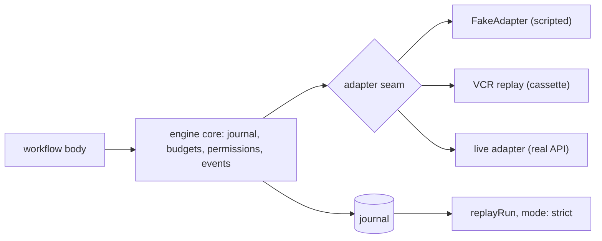

# Testing

`@rulvar/testing` lets you test agent workflows end to end without paying for a single model call: a scripted `FakeAdapter` behind the real engine, VCR cassettes recorded once and replayed hermetically, and replay-strict runs that turn any journal into a deterministic regression test.

```bash
pnpm add -D @rulvar/testing @rulvar/core
```

The snippets on this page import the workflow primitives (`defineWorkflow`, the typed errors, the file stores) from `@rulvar/core` directly, so it must be a dependency of your project too: under pnpm's strict `node_modules` layout a transitive copy is not importable. The [recording example](#recording) additionally uses the `@rulvar/anthropic` adapter.

Everything on this page runs through the full engine. The journal, the scheduler, the [three-layer budget](/guide/budgets), the permission chain, and the event stream are all real; the only thing swapped out is where model responses come from. That is the difference between testing your orchestration logic and mocking around it.

## Three tiers, one seam

Model responses in a test come from one of three places:

| Tier | Responses come from | Cost | Reach for it when |
|---|---|---|---|
| Fake | Responders you script in the test | Free, instant | The default: orchestration logic, budgets, resume, schemas, tool loops |
| Cassette | Recorded provider exchanges, replayed at the adapter seam | Free after one paid recording | Behavior a stub cannot fake: real event streams, refusal shapes, provider quirks |
| Live | The provider APIs | Real money on every run | Scheduled contract tests that catch provider drift; never PR CI |

The fake and cassette tiers both plug into the `ProviderAdapter` seam, the same seam the [live adapters](/guide/providers) implement, so tests are vendor-neutral by construction and nothing in the engine is stubbed. The journal adds a fourth surface: a replay-strict run re-executes a recorded run and fails loudly on any call that would go live, whichever tier originally produced the journal.



The CI posture that falls out: the default test job performs **zero network I/O**. Pull-request tests run on the fake tier or on cassette replay with misses configured to throw; live traffic is confined to scheduled contract tests (last section).

## The test engine

`createTestEngine` builds a real engine wired to a `FakeAdapter` and an in-memory journal store. You declare responders per agent; the engine does everything else it would do in production.

<!-- docs-snippet: testing-fake-adapter -->
```ts
import { defineWorkflow } from '@rulvar/core';
import { createTestEngine } from '@rulvar/testing';

const review = defineWorkflow({ name: 'review' }, async (ctx) => {
  const verdict = await ctx.agent('review the diff', {
    agentType: 'reviewer',
    schema: {
      type: 'object',
      required: ['verdict'],
      properties: { verdict: { type: 'string' } },
    },
  });
  const prose = await ctx.agent('summarize the findings');
  return { verdict, prose };
});

const engine = createTestEngine({
  agents: {
    reviewer: () => ({ verdict: 'pass' }),
    '*': 'stub text',
  },
});

const run = engine.run(review, undefined);
const outcome = await run.result;
// outcome.status === 'ok'
// outcome.value: { verdict: { verdict: 'pass' }, prose: 'stub text' }
// outcome.cost.totalUsd === 0: fake calls are priced at zero by construction
```

How responders resolve:

- **Patterns** match on `agentType`, on `label`, or as a regex over the prompt, checked in declaration order; `'*'` is the fallback. A call nothing matches is a loud typed error telling you to add a fallback, never a silent empty string.
- **Responder forms**: a static string (plain text output), a static object (structured output), or a function of the call. The function receives a `FakeCall` (`prompt`, `agentType`, `label`, and the full wire request `req`) and may be async; a thrown error becomes a terminal agent error.
- Every `agents` key is auto-registered as an empty agent profile, so `agentType: 'reviewer'` resolves without further setup. Pass `profiles`, `budgetDefaults`, or `concurrency` to exercise real configuration.
- **Cancellation behaves like production.** `FakeAdapter` honors the caller's `AbortSignal` under the same contract as live adapters ([adapter authors](/guide/adapter-authors)): an abort ends the stream promptly with no terminal event, a pending async responder is detached rather than awaited, and a request whose signal was already aborted on arrival is never served and never recorded. Tests that cancel a run, cross a deadline, or exhaust a budget observe the same journal shapes as with a production adapter, with no false `agent: ok` terminals.

The engine exposes two extra members for assertions: `engine.fake` is the adapter instance, whose `calls` array records every request served in order, and `engine.store` is the backing `InMemoryStore`, which is how you capture a journal for the replay-strict tests below.

The store the test engine builds is always in-memory. To browse a fake run from the terminal, assemble the same tier on `createEngine` yourself and hand it a file-backed store:

```ts
import { createEngine, JsonlFileStore } from '@rulvar/core';
import { FakeAdapter, FAKE_MODEL_REF } from '@rulvar/testing';

const engine = createEngine({
  adapters: [new FakeAdapter({ agents: { '*': 'stub text' } })],
  stores: { journal: new JsonlFileStore({ dir: './fake-runs' }) },
  // The roles this page's workflows exercise; route others the same way.
  defaults: { routing: { loop: FAKE_MODEL_REF, extract: FAKE_MODEL_REF } },
});
```

The runs it writes are ordinary on-disk journals: `rulvar runs ls --store ./fake-runs` lists them and `rulvar inspect <runId> --store ./fake-runs` walks the entries, exactly as for a production store (see [CLI](/guide/cli)).

### Scripting tool calls and failures

Two marker helpers script the interesting turns:

```ts
import { createTestEngine, fakeToolCalls, fakeWireError } from '@rulvar/testing';

const engine = createTestEngine({
  agents: {
    // First turn requests a tool call; once the tool result is in the
    // transcript, answer for real.
    researcher: (call) =>
      call.req.messages.some((m) => m.role === 'tool')
        ? 'summary: three relevant results'
        : fakeToolCalls({ name: 'search', args: { q: 'rulvar journal' } }),
    // The stream terminates with a typed, retryable wire failure.
    flaky: fakeWireError({
      code: 'rate-limit',
      message: '429 too many requests',
      retryable: true,
      data: { kind: 'rate-limit', retryAfterMs: 1000 },
    }),
  },
});
```

`fakeToolCalls` makes the fake model answer a turn with tool calls; the engine then executes the declared [tools](/guide/tools) through the real permission chain and feeds results back, so approval suspensions and denials are all testable offline. `fakeWireError` terminates the stream with a typed failure, which is how you exercise retry policies, fallbacks, and error-status journal entries without a misbehaving provider.

## Matchers

`@rulvar/testing/matchers` ships matchers for Vitest 4 and Jest. Register once in a setup file:

```ts
// vitest.setup.ts
import { expect } from 'vitest';
import { rulvarMatchers } from '@rulvar/testing/matchers';

expect.extend(rulvarMatchers);
```

```ts
const run = engine.run(review, undefined);

await expect(run).toHaveCalledAgent('reviewer');
await expect(run).toHaveCalledAgent('reviewer', { times: 1 });
await expect(run).toStayUnderBudget({ usd: 5 });
```

Both matchers are async: they await the settled run themselves, so you pass the handle straight from `engine.run`. They operate only on the public surface, the settled outcome and the recorded event stream (`TestRunHandle.eventsSeen`). `toHaveCalledAgent` counts completed agent calls of that `agentType`; `toStayUnderBudget` passes only when `cost.totalUsd` stays strictly under the bound **and** the run did not end `'exhausted'`. The bundle's shapes work with Jest's `expect.extend` too; the shipped type augmentation targets Vitest.

## Testing budget behavior

Fake calls cost zero dollars, so a settled fake run can never spend its way over a ceiling. What you can and should test is the admission layer: reserves committed at spawn time against the run ceiling, which is exactly how real runs are refused before money is spent.

```ts
const engine = createTestEngine({ agents: { '*': 'x' } });

const fanout = defineWorkflow({ name: 'fanout' }, async (ctx) => {
  return ctx.parallel([
    () => ctx.agent('a', { estCost: 0.3 }),
    () => ctx.agent('b', { estCost: 0.3 }),
    () => ctx.agent('c', { estCost: 0.3 }),
  ]);
});

const outcome = await engine.run(fanout, undefined, { budgetUsd: 0.5 }).result;
// outcome.status === 'exhausted', outcome.value === undefined
```

Three concurrent spawns each reserve an estimated 0.30 USD against a 0.50 ceiling; the third is denied and the run reports `'exhausted'` (which always overrides `'error'`), with the full cost report attached. Pair every happy-path `toStayUnderBudget` assertion with an exhaustion-path test like this one; the exhausted outcome is a first-class result your caller must handle, not an exception to swallow. See [Budgets and termination](/guide/budgets) for the semantics being asserted.

## Testing suspension and resume

Durability is public API, so test it through public API: run to a suspension, resolve it, resume, and assert that nothing is paid twice.

```ts
const release = defineWorkflow({ name: 'release' }, async (ctx) => {
  const analysis = await ctx.agent('analyze the release diff', { agentType: 'analyst' });
  const gate = await ctx.awaitExternal<{ approved: boolean }>('release-gate');
  return { analysis, approved: gate.approved };
});

const engine = createTestEngine({ agents: { analyst: 'looks safe' } });

const first = engine.run(release, undefined);
const suspended = await first.result;
// suspended.status === 'suspended'; suspended.pending lists 'release-gate'

await first.resolveExternal('release-gate', { approved: true });

const resumed = engine.resume(first.runId, release);
const outcome = await resumed.result;
// outcome.status === 'ok'
// outcome.value: { analysis: 'looks safe', approved: true }

const preview = await resumed.preview;
// preview.misses === 0 and engine.fake.calls.length === 1:
// the analyst call replayed from the journal; nothing ran twice
```

The resume rebinds the journal to the workflow and forward-matches every call by scope path, content key, and ordinal: the analyst call is served from its journal entry (a replay), the resolved external is read from its resolution entry, and only genuinely new work would go live. `ResumeHandle.preview` gives you the accounting to assert on: `hits`, `misses`, `reruns`, `skipped`, and `orphaned` (journaled operations no live call consumed, that is, deleted calls). A `misses` of zero is the never-pay-twice invariant made checkable in a unit test. Note the order in the snippet: `first.resolveExternal` after `first.result` settled appends the durable resolution without restarting the settled segment, and the `engine.resume` that follows is the run's ONE continuation (see [Resolving a settled run](/guide/durability#resolving-a-settled-run)). See [Durability](/guide/durability) for the mechanics under test.

## Replay-strict runs

`replayRun` is the regression backbone: it executes a workflow against an existing journal in strict mode, where **any** call that would go live throws a typed `JournalMissError`. Zero live calls or loud failure, nothing in between.

```ts
import { JournalMissError } from '@rulvar/core';
import { createTestEngine, replayRun } from '@rulvar/testing';

const engine = createTestEngine({ agents: { analyst: 'looks safe' } });
const recorded = engine.run(release, undefined);
await recorded.result;
const journal = await engine.store.load(recorded.runId);

// The same workflow replays with zero live calls.
const { outcome, preview } = await replayRun(release, undefined, {
  journal,
  profiles: { analyst: {} },
});
// preview.misses === 0; outcome matches the recorded run

// A divergent workflow fails at the exact first would-be-live call.
const edited = defineWorkflow({ name: 'release' }, async (ctx) => {
  await ctx.agent('analyze the release diff', { agentType: 'analyst' });
  await ctx.agent('INSERTED CALL', { agentType: 'analyst' });
  return 'x';
});
await expect(
  replayRun(edited, undefined, { journal, profiles: { analyst: {} } }),
).rejects.toThrow(JournalMissError);
```

Facts worth knowing:

- `journal` accepts raw entries or `{ store, runId }`. `mode: 'strict'` is the default and currently the only mode.
- Entry identity depends on the resolved model spec, so a replay must resolve routing the same way the recording run did. The default is the test engine's fake routing; pass `adapters`, `routing`, and `profiles` when replaying journals recorded against other adapters.
- A journal with open suspensions completes under strict replay with outcome `'suspended'` and zero live calls; it does not hang and does not fail.
- The result carries the same `preview` accounting as a resume, so you can assert `misses === 0` explicitly rather than merely observing that nothing threw.

This is also the recommended triage flow for a field bug: export the production run's journal, reproduce under `replayRun` (deterministically, for free), then commit the minimized journal as a fixture so the fix is regression-guarded forever. On the operations side, `engine.resume(runId, wf, { dryRun: true })` gives the same guarantee for a real store: strict matching, zero live calls, and the first divergence surfaced as a typed `journal_miss` error.

## VCR cassettes

Some behavior only exists on the real wire: exact event streams, provider refusal shapes, stop reasons, token accounting. Cassettes capture it once and replay it forever. A cassette is a redacted JSONL file recorded at the adapter seam: one header line carrying the format version, the identity profile version (`hashVersion`), and the recording timestamp, then one row per exchange keyed by a hash of the canonical wire request. The engine's telemetry namespace is excluded from the key, and each row carries the redacted request, the full event stream, the model, a caps snapshot, the recording adapter's declared `usageSemantics` (when it declares one), and since v1.32.0 the occurrence number its `stream()` call claimed, so replay adapters report the capabilities and stamp the provenance that were true at record time, and serve repeated requests in the order the calls were made.

### Recording

`record` wraps live adapters; the wrapped adapters are drop-in (same ids, providers, caps, and event streams), and every stream that completes with exactly one terminal event appends one redacted row. An aborted or truncated stream (no terminal event) and a stream violating the terminal contract append nothing: a cassette row is always the record of one completed exchange. Identical requests append one row each: a recorded retry (the same request failing, then succeeding) or a repeated case produces multiple rows under one request hash. Each `stream()` call claims a zero based occurrence number for its hash synchronously in the call itself (an aborted or failed call keeps its number and appends nothing, so gaps are valid), the completed row persists it, and replay serves same hash rows in that call order: two concurrent identical calls whose completions landed in the file out of order still replay to the callers that made them. A later `record()` call on the same cassette file is an appending session: it reads and validates the existing file first (a target that was never a cassette, a header recorded under a different `hashVersion`, and a file whose occurrence numbering is already ambiguous all refuse with a typed `ConfigError`), and it seeds every hash counter past the numbers already on disk, so the numbering continues where the file left off instead of restarting at zero. Appending to a group recorded before v1.32.0 leaves that group in its documented file order mode; record the cassette again to adopt call order for it. One recorder session may be active on a cassette at a time: two concurrently constructed recorders seed identically and claim colliding numbers, and replay refuses that collision as ambiguous instead of silently serving either order.

```ts
import { createEngine, JsonlFileStore } from '@rulvar/core';
import { anthropic } from '@rulvar/anthropic';
import { record } from '@rulvar/testing';

const engine = createEngine({
  adapters: record({
    adapters: [anthropic()], // reads ANTHROPIC_API_KEY from the environment
    cassette: 'fixtures/review-session.jsonl',
    // Optional: compose payload-specific masking on top of the built-in policy.
    redact: (value) => value.replaceAll('acme-internal', '[customer]'),
  }),
  stores: { journal: new JsonlFileStore({ dir: '.rulvar' }) },
  defaults: { routing: { loop: 'anthropic:claude-sonnet-5' } },
});
```

Redaction happens **at record time**: secrets never reach the cassette bytes, not even transiently in the committed file's history. The built-in `defaultRedact` policy always runs, masking API-key-shaped strings, bearer tokens, and authorization header values; a custom `redact` hook runs first and the built-in policy is applied over its output. It is deliberately aggressive about credential shapes, and deliberately ignorant of your domain secrets, which is what the custom hook is for.

### Replaying hermetically

```ts
import { replay } from '@rulvar/testing';

const adapters = replay({
  cassette: 'fixtures/review-session.jsonl',
  onMiss: 'throw',
});
```

Hand the replay adapters to `createEngine` exactly as you would live ones. With `onMiss: 'throw'`, any request without a servable row raises a typed `VcrMissError` carrying the request hash: that is the hermetic mode, and the only mode CI should run. `onMiss: 'passthrough'` forwards unrecorded requests to a matching live adapter passed alongside; it exists for local development while a cassette is being built and has no place in CI. Because the engine journals a live served miss under the replay adapter's own declarations, `replay` refuses at construction with a typed `ConfigError` when the cassette rows and the live adapter disagree on `provider` or `usageSemantics`, absent versus present included; an adapter with no recorded rows keeps the live adapter's declarations, so wrapping stays metadata preserving.

Rows sharing one `(adapterId, requestHash)` key form an ordered occurrence list, and every `stream()` call consumes exactly one occurrence, in recorded call order (file order for groups recorded before v1.32.0, whose rows carry no occurrence numbers): a recorded retry replays as the same error-then-success sequence it was, never collapsed into its last exchange. The occurrence is claimed synchronously inside the `stream()` call itself (not at first read), so concurrent identical requests each get their own recorded exchange. A duplicate occurrence inside a fully numbered group refuses the whole cassette with a typed `ConfigError` naming the adapter and hash, because it means two recorder sessions wrote the file concurrently and either order would hand a caller the wrong exchange. A call after the last occurrence is a miss like any other: under `onMiss: 'throw'` the `VcrMissError` carries `recordedOccurrences` saying the hash was recorded but is exhausted, and under `'passthrough'` the call forwards to the live adapter. Cursors live on the replay adapter set, so one `replay()` call serves a cassette's rows once across every run that shares its adapters; build a fresh set to start over.

A replayed run also reproduces the recorded provenance: the adapter `replay` rebuilds declares the `usageSemantics` snapshot stored in the cassette, so the usage bearing journal entries of a replayed run carry the same stamp the recorded run's did (see [providers](/guide/providers) for what the stamp means). Cassettes recorded before v1.31.0 store no snapshot and replay unstamped, which reads exactly like an entry recorded before the stamp existed; record the cassette again on a current engine when the stamp matters to what you assert.

Because cassettes record the `hashVersion` they were produced under, `replay` validates the header against the engine's support window, the same `[CURRENT-1, CURRENT]` window that governs journal resume: a cassette recorded outside it is refused with a typed `ConfigError` instead of silently drifting, while an in-window cassette recorded one profile back replays normally.

The file shape is validated in two layers. `readCassette` checks the full documented form in depth and refuses violations with a `ConfigError` naming the cassette path, the JSONL line, and the field path: the header must carry `kind`, format `v: 1`, an integer `hashVersion`, and a date string `recordedAt`; every row must carry a nonempty `adapterId`, `model`, and `requestHash`, a plain `request` object (never an array), a `caps` object carrying every `ModelCaps` field (with the optional pricing table checked when present), an `events` array whose every element is a member of the canonical `ChatEvent` vocabulary with its required payload and the numeric Usage invariants (a `tool-call-end` must carry its `args`, any JSON value including `null`; a refusal's `stopDetails` and a finish's `providerMetadata`, when present, must be plain objects with their documented field types), and (when present) a string `provider`, a nonempty `usageSemantics`, and a nonnegative integer `occurrence`. Unknown extra fields on a known shape are tolerated for forward compatibility; an unknown event type is refused, because replay would feed it to an engine whose vocabulary provably does not include it. Stream semantics and adapter consistency are deliberately not read time concerns; `replay` enforces them before serving anything: every row must end with exactly one terminal event (what `record` has guaranteed since v1.29.0), all caps snapshots for one `(adapterId, model)` must agree, all rows of one adapter must agree on `provider` and `usageSemantics`, because a replay adapter reports one declaration per adapter, and no fully numbered occurrence group may number the same slot twice. Any violation refuses the whole cassette, since a partially trusted fixture is worse than none. An appending `record()` session runs the same read and the same occurrence integrity check before it appends anything.

### Cassette hygiene

Committed cassettes are fixtures other people's builds depend on. Rules that keep them trustworthy:

- **Keys come from the environment, never from checked-in config.** Recording requires real credentials; the cassette must not.
- **Review before merging.** Read the recorded file back (`readCassette` parses it) and check rows for residual sensitive payloads. Built-in redaction recognizes credential shapes, not your customer data; treat every committed cassette as public.
- **Never rerecord automatically.** A replay failure after a provider change means either real drift (fix the adapter, then rerecord deliberately) or a flaky provider surface (document and quarantine). A CI job that silently rerecords converts regressions into fixture updates.
- **Keep cassette names stable.** The name identifies a scenario; renaming one is a deliberate change to what your suite claims to cover, not a refactor.
- **Rerecord on identity-profile changes.** A cassette whose recorded `hashVersion` has left the support window is refused at `replay` with a typed `ConfigError`; when that happens, rerecording is a reviewed, intentional act.

## The live tier

Live calls have exactly one job in a test suite: catching provider drift before your users do. Run your recorded cassettes against the live provider APIs on a schedule (a weekly cron per adapter is a sensible starting cadence), separate from PR CI and non-blocking for merges, and make failures page a human rather than trigger a rerecord. A live contract failure is information: either the provider changed under you and the adapter needs a fix plus a deliberate rerecording, or the surface is flaky and belongs in quarantine with a note.

Everything else, which is nearly everything, stays on the fake and cassette tiers, where the suite is deterministic, free, and fast. The same discipline extends to quality measurement: [evals](/guide/evals) record judge calls to cassettes too, so PR-triggered eval runs execute with zero live calls.

### Opt-in gating and the bounded smoke

A provider key in the environment is not an opt-in. Live tests spend money, so gate them on an explicit switch on top of the key: `liveTestEnabled` is true only when `RULVAR_LIVE_TESTS=1` AND every named key is present, which keeps an ordinary `vitest run` hermetic even in a shell that happens to export `ANTHROPIC_API_KEY`.

For the smoke itself, `runLiveSmoke` drains one adapter stream per attempt and classifies the terminal event instead of asserting blindly: a stream whose single final terminal is a `finish` passes, a typed retryable error (429 rate limit, 529 overload) gets a bounded retry with linear backoff, and a non-retryable error (authentication, invalid model) fails immediately with the typed `WireError` intact. The provider SPI requires exactly one terminal event per stream, as its final event, and the smoke holds adapters to it: no terminal at all is `'no-terminal'`, multiple terminals or a terminal followed by more events is `'contract-violation'`, and neither is ever retried, because spending again cannot repair a broken adapter contract. A live smoke never converts a real adapter failure or a malformed stream into a pass and never spends more than its attempt bound.

The bound itself is validated, not clamped: `attempts` must be an integer from 1 to `MAX_LIVE_SMOKE_ATTEMPTS` (10), `baseDelayMs` a non-negative integer, and both `baseDelayMs` and the largest scheduled backoff, `baseDelayMs * (attempts - 1)`, must stay within `MAX_LIVE_SMOKE_DELAY_MS` (Node's timer maximum, 2^31 - 1 ms; past it Node clamps the sleep to 1 ms with a `TimeoutOverflowWarning`, which would silently turn a long backoff into an immediate retry). Anything else, `NaN`, `Infinity`, and fractions included, rejects with a typed `ConfigError`, carrying `field`, `value`, and `max` in its `data`, before any stream opens. A helper whose whole contract is a bounded spend refuses configurations that are not.

```ts
import { liveTestEnabled, runLiveSmoke } from '@rulvar/testing';
import { anthropic } from '@rulvar/anthropic';

it.skipIf(!liveTestEnabled('ANTHROPIC_API_KEY'))(
  'live smoke: one small call',
  async () => {
    const outcome = await runLiveSmoke(anthropic({}), {
      model: 'claude-sonnet-5',
      messages: [{ role: 'user', parts: [{ type: 'text', text: 'Reply with the word ok.' }] }],
      maxOutputTokens: 32,
    });
    if (outcome.status !== 'ok') {
      throw new Error(`live smoke did not reach finish: ${JSON.stringify(outcome)}`);
    }
  },
  90_000,
);
```

Rulvar's own repository gates all of its key-gated live suites this way behind a dedicated `pnpm test:live` command, which reports which suites will fire for the keys it finds and never prints key values. Keep live requests small (a one-word reply with a tight `maxOutputTokens` is plenty) and label the command as spending provider budget wherever you document it.

## Next steps

- [Determinism lint](/guide/determinism): keep workflow modules replay-stable so the tests on this page stay meaningful.
- [Durability](/guide/durability): the resume and forward-matching semantics the replay tests assert.
- [Budgets and termination](/guide/budgets): what the exhaustion-path tests exercise.
- [Evals](/guide/evals): measuring output quality on top of the same cassette determinism.
- [API reference for @rulvar/testing](/api/@rulvar/testing/): every symbol used on this page.
