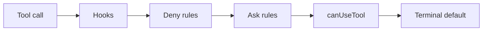

# Tools and permissions

A tool in Rulvar is a typed, contract-hashed capability the model can call. Every dispatch, whether the tool is native, imported from an [MCP server](/guide/mcp), or one of the engine's own opt-in tools such as `escalate`, passes through one layered permission chain, lands in the agent's checkpointed history the same way, and enters spawn identity through the same `toolsetHash`. This page covers defining tools, why tool identity matters for [replay](/guide/journal), the permission chain, approval suspensions, executors, and worktree isolation.

## Defining a tool

`tool({...})` builds a `ToolDef`. Type inference flows from `parameters` into `execute(input, ctx)`, so you never repeat the input shape:

```ts
import { tool, ModelRetry } from '@rulvar/core';
import { z } from 'zod';

export const searchIssues = tool({
  name: 'search_issues',
  description: 'Search the issue tracker and return the top matches.',
  parameters: z.object({
    query: z.string(),
    limit: z.number().int().min(1).max(50).default(10),
  }),
  version: '2',
  risk: 'read',
  async execute({ query, limit }, ctx) {
    const res = await fetch(
      `https://tracker.example.com/search?q=${encodeURIComponent(query)}&limit=${limit}`,
      { signal: ctx.signal },
    );
    if (res.status === 400) {
      // A model-recoverable error: surfaced as an error tool result so the
      // model can correct itself. Bounded to 2 attempts per call chain.
      throw new ModelRetry('Malformed query; use plain keywords, no operators.');
    }
    return await res.json();
  },
});

export const deployService = tool({
  name: 'deploy_service',
  description: 'Deploy a service to production.',
  parameters: z.object({ service: z.string() }),
  risk: 'execute',
  needsApproval: true,
  execute: async ({ service }) => ({ deployed: service }),
});
```

Definition-time failures are typed `ConfigError`s, never first-call surprises: an illegal name (the pattern is `^[a-zA-Z0-9_-]{1,64}$`), a Standard Schema library without a JSON Schema projection, or a schema outside the supported subset all fail inside `tool()`. Two tools with the same name inside one agent's toolset fail at spawn time.

The fields split into contract and policy, and the split is load-bearing:

| Field | In the contract hash | What it does |
|---|---|---|
| `name` | yes | What the model calls; also the rule-matching key. |
| `description` | yes | What the model reads to decide when to call. |
| `parameters` | yes (canonical JSON Schema) | Validated before `execute` runs. |
| `version` | yes | Opaque semantic-version marker; see below. |
| `executor` | no | Where `execute` runs; default `'inprocess'`. |
| `needsApproval` | no | Flips the terminal permission default to ask. |
| `risk` | no | Declarative risk class consumed by rules and presets. |
| `execute` | no | The implementation; never hashed. |

## Schemas: the three forms

`parameters` (and agent output schemas; the machinery is shared) accepts exactly three forms of `SchemaSpec`:

| Form | Example | Inferred input type `Out<S>` |
|---|---|---|
| Standard Schema | a Zod, ArkType, or Valibot schema | the schema's output type |
| `{ jsonSchema, validate }` pair | explicit JSON Schema plus a type guard | the guard's target type |
| bare JSON Schema literal | `{ type: 'object', ... }` | `unknown` |

Every form yields a derived JSON Schema, because the contract hash and the provider tool declaration both need one. Runtime validation of model-produced arguments always happens before `execute` runs: form 1 through the schema library itself, form 2 through your `validate`, form 3 through the vendored eval-free validator (a draft 2020-12 subset: no remote or dynamic `$ref`). A validation failure is surfaced to the model as an error tool result naming the issues; it never throws out of the agent loop.

## Typed handlers and ToolContext

`execute(input, ctx)` receives the validated, typed input and a `ToolContext`:

| Field | Meaning |
|---|---|
| `runId`, `spanId` | The run and the tool span in the run > phase > agent > tool hierarchy. |
| `agent` | `{ agentType, label? }` of the calling agent. |
| `cwd` | The isolation working directory; the host cwd under isolation `'none'`, inside the worktree under worktree isolation. |
| `isolation` | The spawn's declared `IsolationSpec`. |
| `signal` | An `AbortSignal` that fires on cancellation, the budget ceiling, and usage-limit expiry. Long-running tools should observe it. |
| `log(level, msg, data?)` | Emits telemetry log events; never writes journal entries. |

`ToolContext` deliberately exposes no spawn primitives. Tools are leaves of the call-and-return tree; all spawning flows through the `ctx` primitives of a [workflow](/guide/workflows) under admission control. That is what keeps budget attribution and scope identity intact.

The value returned by `execute` must be JSON-serializable; it becomes a tool-result record in the agent's canonical history. A non-serializable value is a typed `NonSerializableValueError`, surfaced to the model as an error tool result.

## Tool identity: toolsetHash and version

The identity of a tool is its contract: the tuple `(name, description, canonical parameters schema, version)`. `toolsetHash` is a sha256 over the canonical JSON array of these tuples sorted by name, and it enters the content key of every agent spawn. The `execute` closure is excluded by construction.

The consequences are exactly what you want for durable runs:

- **Editing an implementation never invalidates a journal.** Fix a bug in `execute`, redeploy, resume: every completed entry still replays.
- **Changing the contract re-keys future spawns.** A different name, description, parameters schema, or version produces a different `toolsetHash`, so a journal recorded against the old contract is never silently replayed against the new one.

`version` is the escape hatch for the gap between the two: an opaque string with no ordering semantics. Bump it when the tool's behavior changes under the same name and a compatible schema (the same call now means something different), and do not bump it for pure refactors that preserve semantics. An absent `version` participates in the contract as absent; no default is synthesized.

The same contract discipline governs imported MCP tools: server-side drift of a description or input schema changes `toolsetHash` for new spawns, which is intended behavior. See [MCP](/guide/mcp) for why you should pin server versions.

## Attaching tools to agents

Toolsets attach per spawn through `AgentOpts.tools` (which wins over the profile default) or per profile through `AgentProfile.tools`. The option accepts `ToolDef` values, `ToolSource` values (what [`mcp()`](/guide/mcp) returns), and registered toolset names, in any mix. A string entry names a toolset registered under engine `defaults.toolsets` and means the same thing everywhere a tools option is taken (direct calls, profiles, and the sandbox dialect); it expands through the same canonical resolution as directly passed values, so the resolved contracts land in `toolsetHash` and the spawn identity identically. An unknown name is a typed `ConfigError` at spawn time, before any provider call; nothing outside the declared registry is reachable by name, and registry values themselves hold only `ToolDef` and `ToolSource` entries (never other names, so registries cannot cycle). The dynamic orchestrator's `toolsetRef` spawn parameter draws from the same registry (see [orchestration modes](/guide/orchestration-modes)):

```ts
import { defineWorkflow } from '@rulvar/core';

const release = defineWorkflow(
  { name: 'release' },
  async (ctx, args: { service: string }) => {
    return ctx.agent(`Run the checks, then deploy ${args.service}.`, {
      agentType: 'operator',
      tools: [searchIssues, deployService],
    });
  },
);
```

The resolved toolset is snapshotted at spawn time, hashed into the spawn's identity, and stays frozen for the agent's lifetime; nothing can mutate an in-flight agent's toolset.

## The permission chain

Every tool dispatch is decided by one fixed-order chain. Evaluation short-circuits: the first decisive verdict wins, and unconfigured layers are skipped.



Configuration lives on the engine (`defaults.permissions`, a `PermissionConfig`) and on agent profiles (`permissions`, an `AgentProfilePermissions`). The layers merge engine-first; the profile's `canUseTool` wins over the engine's since there is a single slot:

```ts
import { createEngine } from '@rulvar/core';
import { anthropic } from '@rulvar/anthropic';

const engine = createEngine({
  adapters: [anthropic()],
  defaults: {
    permissions: {
      hooks: [
        (toolName, input) => {
          if (toolName !== 'http_fetch') return undefined; // no verdict: fall through
          const { url } = input as { url: string };
          return url.startsWith('https://') ? undefined : 'deny';
        },
      ],
      deny: [{ risk: 'destructive' }],
      ask: [{ tool: ['deploy_service', 'send_email'] }, { risk: 'undeclared' }],
    },
    profiles: {
      operator: {
        model: 'anthropic:claude-sonnet-5',
        tools: [searchIssues, deployService],
        permissions: {
          preset: 'standard',
          inheritPermissions: true,
        },
      },
    },
  },
});
```

**Hooks** are closures, run in deterministic registration order, sync or async. `'allow'`, `'deny'`, and `'ask'` are decisive and stop the chain. `{ modifiedInput }` substitutes the input and continues: the modified input is what later layers evaluate and what `execute` eventually receives. `undefined` passes through. The hook above gates your own `http_fetch` tool; Rulvar ships no tool of that name.

**Deny rules and ask rules** are declarative tables with no closures. A rule matches by tool name, by declared risk class (`'undeclared'` matches every tool without declared risk), by argv pattern for shell tools, or by network domain. A match in the deny layer denies; a match in the ask layer asks. Rules never allow: allow only ever results from falling through to `canUseTool` or the terminal default, which is what lets presets compile into the chain without creating a bypass channel. Because closures cannot cross the worker sandbox, a compiled workflow running there carries only these declarative tables; hooks and `canUseTool` are host-side layers (see [orchestration modes](/guide/orchestration-modes)).

**`canUseTool`** is a single optional closure returning `'allow'`, `'deny'`, or `{ modifiedInput }`. An explicit `'allow'` is decisive even for a `needsApproval: true` tool; this is the programmatic override for cases you have already vetted:

```ts
import type { PermissionConfig } from '@rulvar/core';

const permissions: PermissionConfig = {
  canUseTool: async (toolName, input) => {
    if (toolName !== 'deploy_service') return 'allow';
    const { service } = input as { service: string };
    // Explicit allow overrides the needsApproval ask default.
    return service === 'docs-preview' ? 'allow' : 'deny';
  },
};
```

**The terminal default** is allow, unless the tool declares `needsApproval: true`, in which case the verdict is ask.

The three verdicts mean:

| Verdict | Effect |
|---|---|
| allow | `execute` is dispatched through the tool's declared executor. |
| deny | The call never executes. The model sees an error tool result carrying the policy reason and the turn continues; a deny never throws out of the agent loop. |
| ask | The turn checkpoint is written with the pending tool state, a suspended approval entry is journaled, and the agent parks until a resolution arrives. |

## Risk metadata and presets

`risk` is one of `'read' | 'write' | 'network' | 'execute' | 'destructive'`. It is policy input, never identity: it does not enter `toolsetHash`. Native tools should declare it; MCP-imported tools carry no risk unless you supply a risk map on `mcp()`, and undeclared risk is a first-class state that presets treat conservatively.

A profile-level `preset` compiles into ordinary deny and ask rules, appended after your own rules in the same layers, never as a fifth layer. Since a preset "allow" cell simply emits no rule, a `needsApproval: true` tool still asks under every preset:

| Declared risk | `strict` | `standard` | `open` |
|---|---|---|---|
| read | allow | allow | allow |
| write | ask | allow | allow |
| network | ask | ask | allow |
| execute | ask | ask | allow |
| destructive | deny | ask | allow |
| (undeclared) | ask | ask | allow |

`open` compiles to empty tables: it is exactly the chain without a preset. The compiler is exported as `compilePermissionPreset(preset)` if you want to inspect or extend the generated rules.

Two honesty notes, because policy that overpromises is worse than none:

- **Domain rules** (`{ tool, domains }`) are advisory for every tool in the current release: they never change a verdict, and matches surface in the audit fields on `tool:end` events. Rulvar ships no fetch tool today; when it ships one, domain enforcement will live in that tool. Do not treat domain rules as containment.
- **The chain governs dispatch, not side effects.** What a running tool does is bounded by executors and isolation (below), not by rules.

## Shell command matching

Shell allow/ask/deny is matched through a real argv parser, never a string prefix. Patterns are token sequences: a literal matches one identical token, `*` matches exactly one token, `**` matches all remaining tokens and may only appear last. The candidate command is lexed with a POSIX-like lexer (quotes and escapes honored, nothing expanded), split into segments at `;`, `&&`, `||`, `|`, `&`, and newlines, and the verdict composes strictest-across-segments. Any unmatched segment yields ask, never a silent allow:

```ts
import { matchShellCommand } from '@rulvar/core';

matchShellCommand('npm test', { allow: ['npm test', 'npm run *'] });
// 'allow'

matchShellCommand('npm test; rm -rf /', { allow: ['npm test'] });
// 'ask': the second segment matches no allow pattern

matchShellCommand('git push --force', { deny: ['git push --force'] });
// 'deny'
```

Segments containing command substitution, process substitution, or here-docs are unmatchable and always ask. In the chain itself, argv patterns appear in the deny and ask tables as `{ tool: 'shell', argv: 'rm **' }` rules; the full three-table composition including allowlists is available through `matchShellCommand` for use inside a hook.

## Dry-run evaluation

`evaluatePermission` evaluates a chain against a hypothetical call without executing anything, for tests and tooling:

```ts
import { compilePermissionChain, evaluatePermission } from '@rulvar/core';

const chain = compilePermissionChain(
  { deny: [{ risk: 'destructive' }] },   // engine layer
  { preset: 'standard' },                // profile layer
);

const verdict = await evaluatePermission(chain, deployService, { service: 'api' });
// { verdict: 'ask', decidedBy: 'ask-rule', rule: { risk: [...] }, ... }
// deploy_service declares risk 'execute', which the standard preset asks on
```

The result names the verdict, the deciding layer (`'hook'`, `'deny-rule'`, `'ask-rule'`, `'canUseTool'`, or `'default'`), the matched rule if any, and the post-hook input, which is exactly what `execute` would receive.

## Subagent inheritance

Permission configuration is never inherited implicitly. A child agent spawned under an orchestrator gets its own profile's chain (plus the engine layer) unless the profile opts in with `inheritPermissions: true`. The default is false: a locked-down parent does not silently loosen or tighten its children.

## Ask approvals surface to the host

An ask verdict suspends the agent mid-turn, durably. The runtime writes the turn checkpoint first, carrying the tool results already executed this turn and the call awaiting approval, then journals a suspended approval entry keyed by the tool name and the (post-hook) input. When every in-flight branch of a run is parked this way, the run settles with status `'suspended'` and the outcome lists the open suspensions:

```ts
const handle = engine.run(release, { service: 'api' }, { budgetUsd: 5 });

handle.on('approval:pending', (e) => {
  console.log(`approval needed for ${e.toolName}, entry ${e.entryRef}`);
});

const outcome = await handle.result;
if (outcome.status === 'suspended') {
  for (const pending of outcome.pending) {
    await handle.resolveExternal(pending.key, {
      decision: 'allow',
      reason: 'reviewed by ops',
    });
  }
  const resumed = engine.resume(handle.runId, release);
  console.log(await resumed.result);
}
```

The resolution value normalizes to an `ApprovalDecision`, and it fails closed: anything that is not an explicit allow is a deny. Racing resolutions are settled by the first-closing-wins fold, so a live decision and a timeout default can never both apply. The sequence above is safe because a settled handle's `resolveExternal` only appends the durable resolution; it never restarts the closed segment, so the `engine.resume` that follows is the ONE continuation, the approved tool executes exactly once, and the pre-approval turn is never re-paid (see [Resolving a settled run](/guide/durability#resolving-a-settled-run)). On resume the agent continues the same turn from its checkpoint: executed tools are not re-run, paid turns are not re-paid, and an approval that was resolved while the process was down applies immediately without re-suspending. The full resume mechanics live in the [agents guide](/guide/agents) and [durability](/guide/durability).

## Executors

`executor` declares where `execute` runs: `'inprocess'`, `'subprocess'`, or `'container'`, default `'inprocess'`. The declaration is a capability statement consumed by dispatch and by policy; a host that distrusts a tool's declared executor can deny it with an ordinary rule or hook.

The current release enforces only the in-process executor. Registering a tool whose declared executor the engine cannot serve fails with a typed `ConfigError` at registration, not at first call. Subprocess and container executors are planned, not shipped, and until they ship you should treat containment of hostile code as your responsibility: the worker sandbox that runs compiled workflows is a determinism and blast-radius boundary, not a security boundary.

## Worktree isolation

`isolation` declares the environment an agent's tools see, and the resolved value enters spawn identity:

| `IsolationSpec` | Meaning |
|---|---|
| `'none'` | Tools run against the host working directory; no managed lifecycle. |
| `'readonly'` | Tools get the host directory, and the engine compiles a deny rule for tools declaring risk `'write'` or `'destructive'` into the spawn's chain. Tools without risk metadata are not blocked: this is a blast-radius declaration, not containment. |
| `{ kind: 'worktree', ref? }` | A full managed git worktree lifecycle. |

Worktree isolation needs a provider on the engine; `GitWorktreeProvider` is the shipped one:

```ts
import { createEngine, GitWorktreeProvider, defineWorkflow } from '@rulvar/core';

const engine2 = createEngine({
  adapters: [anthropic()],
  defaults: {
    isolation: new GitWorktreeProvider({ keepOnError: true }),
  },
});

const fixTest = defineWorkflow({ name: 'fix-test' }, async (ctx) => {
  const result = await ctx.agent('Fix the failing unit test in packages/core.', {
    agentType: 'operator',
    isolation: { kind: 'worktree' },
    result: 'full',
  });
  const patch = result.artifacts?.find((a) => a.kind === 'patch');
  return { files: patch?.files ?? [], patchRef: patch?.ref };
});
```

The lifecycle has three phases. **Acquire** creates a worktree from `HEAD` (or the given `ref`) of the host repository; a non-git host is a typed `ConfigError`; the agent's tools receive `ctx.cwd` inside the tree. **Collect** snapshots the changed files and a patch; the engine stores the patch in the transcript store and returns its reference as a `kind: 'patch'` artifact on the `AgentResult`. **Dispose** cleans the tree up; `keepOnError: true` retains a failed agent's tree for inspection.

Applying the patch is always your decision: the engine never auto-applies patches to the host tree. And an agent is never resumed into a destroyed environment: if a parked agent's worktree had to be dropped (retained trees count against a pin cap, default 4), resuming it restarts the agent rather than silently continuing against a fresh tree.

## Tool results in the journal

Tool calls inside an agent's loop are not individual journal entries. They live as tool-call and tool-result records in the agent's canonical history, which is checkpointed at every turn boundary; the agent itself is one two-phase journal entry whose content key includes `toolsetHash`. This has three practical consequences:

- **Replay never re-runs tools.** A replayed agent entry serves its recorded result, and a resumed agent continues from its last checkpoint with all executed tool results intact.
- **The at-least-once window is real.** Between a tool's side effect and the next turn-boundary checkpoint, a crash means the tool may run again on resume. Prefer idempotent tools; give effectful ones natural idempotency keys.
- **Verdicts are telemetry, except ask.** Every chain evaluation rides the `tool:end` event with its verdict, deciding layer, matched rule, and advisory matches, but allow and deny verdicts are never journaled; the tool result in the history is the durable trace. Only ask has a journal footprint: the suspended approval entry and its resolutions.

## Next steps

- [MCP](/guide/mcp): importing MCP servers as tool sources, filtering, prefixing, and approval mapping.
- [Agents](/guide/agents): the tool loop, turn checkpoints, and resuming suspended runs.
- [Journal](/guide/journal): content keys, replay dispositions, and what re-keys an entry.
- [API reference](/api/@rulvar/core/): the full `@rulvar/core` surface, including every permission type.
