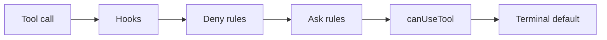

# Tools and permissions

A tool in Rulvar is a typed, contract-hashed capability the model can call. Every dispatch, whether the tool is native, imported from an [MCP server](/guide/mcp), or one of the engine's own opt-in tools such as `escalate`, passes through one layered permission chain, lands in the agent's checkpointed history the same way, and enters spawn identity through the same `toolsetHash`. This page covers defining tools, why tool identity matters for [replay](/guide/journal), the permission chain, approval suspensions, executors, and worktree isolation.

## Defining a tool

`tool({...})` builds a `ToolDef`. Type inference flows from `parameters` into `execute(input, ctx)`, so you never repeat the input shape:

```ts
import { tool, ModelRetry } from '@rulvar/core';
import { z } from 'zod';

export const searchIssues = tool({
  name: 'search_issues',
  description: 'Search the issue tracker and return the top matches.',
  parameters: z.object({
    query: z.string(),
    limit: z.number().int().min(1).max(50).default(10),
  }),
  version: '2',
  risk: 'read',
  async execute({ query, limit }, ctx) {
    const res = await fetch(
      `https://tracker.example.com/search?q=${encodeURIComponent(query)}&limit=${limit}`,
      { signal: ctx.signal },
    );
    if (res.status === 400) {
      // A model-recoverable error: surfaced as an error tool result so the
      // model can correct itself. Bounded to 2 attempts per call chain.
      throw new ModelRetry('Malformed query; use plain keywords, no operators.');
    }
    return await res.json();
  },
});

export const deployService = tool({
  name: 'deploy_service',
  description: 'Deploy a service to production.',
  parameters: z.object({ service: z.string() }),
  risk: 'execute',
  needsApproval: true,
  execute: async ({ service }) => ({ deployed: service }),
});
```

Definition-time failures are typed `ConfigError`s, never first-call surprises: an illegal name (the pattern is `^[a-zA-Z0-9_-]{1,64}$`), a Standard Schema library without a JSON Schema projection, or a schema outside the supported subset all fail inside `tool()`. Two tools with the same name inside one agent's toolset fail at spawn time.

The fields split into contract and policy, and the split is load-bearing:

| Field | In the contract hash | What it does |
|---|---|---|
| `name` | yes | What the model calls; also the rule-matching key. |
| `description` | yes | What the model reads to decide when to call. |
| `parameters` | yes (canonical JSON Schema) | Validated before `execute` runs. |
| `version` | yes | Opaque semantic-version marker; see below. |
| `executor` | no | Where `execute` runs; default `'inprocess'`. |
| `needsApproval` | no | Flips the terminal permission default to ask. |
| `risk` | no | Declarative risk class consumed by rules and presets. |
| `execute` | no | The implementation; never hashed. |

## Schemas: the three forms

`parameters` (and agent output schemas; the machinery is shared) accepts exactly three forms of `SchemaSpec`:

| Form | Example | Inferred input type `Out<S>` |
|---|---|---|
| Standard Schema | a Zod, ArkType, or Valibot schema | the schema's output type |
| `{ jsonSchema, validate }` pair | explicit JSON Schema plus a type guard | the guard's target type |
| bare JSON Schema literal | `{ type: 'object', ... }` | `unknown` |

Every form yields a derived JSON Schema, because the contract hash and the provider tool declaration both need one. Runtime validation of model-produced arguments always happens before `execute` runs: form 1 through the schema library itself, form 2 through your `validate`, form 3 through the vendored eval-free validator (a draft 2020-12 subset: no remote or dynamic `$ref`). A validation failure is surfaced to the model as an error tool result naming the issues; it never throws out of the agent loop.

## Typed handlers and ToolContext

`execute(input, ctx)` receives the validated, typed input and a `ToolContext`:

| Field | Meaning |
|---|---|
| `runId`, `spanId` | The run and the tool span in the run > phase > agent > tool hierarchy. |
| `agent` | `{ agentType, label? }` of the calling agent. |
| `cwd` | The isolation working directory; the host cwd under isolation `'none'`, inside the worktree under worktree isolation. |
| `isolation` | The spawn's declared `IsolationSpec`. |
| `signal` | An `AbortSignal` that fires on cancellation, the budget ceiling, and usage-limit expiry. Long-running tools should observe it. |
| `log(level, msg, data?)` | Emits telemetry log events; never writes journal entries. |

`ToolContext` deliberately exposes no spawn primitives. Tools are leaves of the call-and-return tree; all spawning flows through the `ctx` primitives of a [workflow](/guide/workflows) under admission control. That is what keeps budget attribution and scope identity intact.

The value returned by `execute` must be JSON-serializable; it becomes a tool-result record in the agent's canonical history. A non-serializable value is a typed `NonSerializableValueError`, surfaced to the model as an error tool result.

## Tool identity: toolsetHash and version

The identity of a tool is its contract: the tuple `(name, description, canonical parameters schema, version)`. `toolsetHash` is a sha256 over the canonical JSON array of these tuples sorted by name, and it enters the content key of every agent spawn. The `execute` closure is excluded by construction.

The consequences are exactly what you want for durable runs:

- **Editing an implementation never invalidates a journal.** Fix a bug in `execute`, redeploy, resume: every completed entry still replays.
- **Changing the contract re-keys future spawns.** A different name, description, parameters schema, or version produces a different `toolsetHash`, so a journal recorded against the old contract is never silently replayed against the new one.

`version` is the escape hatch for the gap between the two: an opaque string with no ordering semantics. Bump it when the tool's behavior changes under the same name and a compatible schema (the same call now means something different), and do not bump it for pure refactors that preserve semantics. An absent `version` participates in the contract as absent; no default is synthesized.

The same contract discipline governs imported MCP tools: server-side drift of a description or input schema changes `toolsetHash` for new spawns, which is intended behavior. See [MCP](/guide/mcp) for why you should pin server versions.

### The toolset attestation {#the-toolset-attestation}

Re-keying makes drift *visible* after the fact; it does not stop a drifted toolset from running. For imported tools that is a real exposure: a compromised or upgraded MCP server that swaps a tool's description (the classic tool-poisoning shape) still reaches the model on the next spawn, just under a new content key. An attested profile closes that gap by pinning the hash itself:

```ts
import { attestToolset, resolveToolset } from '@rulvar/core';

// Record the pin once, from a resolution you trust (dev machine, CI):
const resolution = await resolveToolset([searchTool, github], { runId: 'attest' });
const attestation = attestToolset(resolution);
// => { hash: '9f2d…', tools: { search: '1a2b…', github_get_issue: '77aa…' } }

// Declare it on the profile; every spawn is now held to it:
const engine = createEngine({
  adapters: [anthropic()],
  defaults: {
    profiles: {
      researcher: { tools: [searchTool, github], toolsetAttestation: attestation },
    },
  },
});
```

A spawn of an attested profile whose toolset resolves to any other hash refuses with a typed `ConfigError` before any provider call or budget admission. The refusal names the drift when the attestation carries per-tool hashes (`changed: search (attested 1a2b…, resolved 8c9d…)`, `missing: fetch_page`, `unexpected: escalate`); a bare `{ hash }` pin still refuses and lists the resolved per-tool hashes, so a stale pin can be corrected from the refusal itself. `attestToolset()` always records the per-tool hashes; prefer keeping them.

The pin binds the spawn's *resolved* toolset, not the profile's declaration: a call-level `tools` override, a registered name expanding differently, and the opt-in escalate tool all land in the same hash, so each of them drifting is refused the same way. If a change is intended (a deliberate server upgrade, a new tool), re-record the pin with `attestToolset()` and ship the new attestation alongside it. The shape is validated at `createEngine` time: the aggregate hash and every per-tool hash must be 64 lowercase hex characters, and a malformed attestation is a typed error naming the profile path. Unattested profiles keep today's behavior: drift re-keys new spawns silently.

### The authority attestation {#the-authority-attestation}

`toolsetHash` pins exactly what the model sees, and deliberately nothing else: `risk`, `needsApproval`, `executor`, and `executorSpec` never enter it. Those four are *authority* declarations, and every one of them changes what the engine will do without changing the contract: a tool whose `risk` flips from `'read'` to `'write'` stops matching read-only ask rules, a dropped `needsApproval` skips the approval gate, a changed `executor` or `executorSpec` reroutes where and how the work runs. A contract-only pin cannot see any of that.

The attestation therefore carries a second digest (RV1802). `resolveToolset` derives an authority record per tool, `{ contract, risk, needsApproval, executor, executorSpec: sha256(JCS(spec)) }`, and an aggregate `authorityHash` over the records sorted by name, riding `ResolvedToolset` beside the contract hash. `attestToolset()` records both sides, so a pin recorded today binds what the model sees *and* what the tools may do. Enforcement happens at the same pre-wire site: when the contract hash matches but the authority side drifts, the spawn refuses with the drifted field named per tool (`guarded: risk (attested read, resolved write)`), plus `missing` and `unexpected` tools.

Execute bodies remain deliberately unhashable, on both sides: a closure has no stable digest, so `version` stays the lever for behavior drift under an unchanged contract, and the authority record inherits the bump through its `contract` field. Pins recorded before RV1802 carry no `authorityHash`; they keep their documented contract-only posture (authority drift passes them), and re-recording with `attestToolset()` upgrades the pin. For an executable-level guarantee, attest the artifact itself in the host plane: an `executorSpec` naming a pinned image digest puts that pin inside the authority hash.

## Attaching tools to agents

Toolsets attach per spawn through `AgentOpts.tools` (which wins over the profile default) or per profile through `AgentProfile.tools`. The option accepts `ToolDef` values, `ToolSource` values (what [`mcp()`](/guide/mcp) returns), and registered toolset names, in any mix. A string entry names a toolset registered under engine `defaults.toolsets` and means the same thing everywhere a tools option is taken (direct calls, profiles, and the sandbox dialect); it expands through the same canonical resolution as directly passed values, so the resolved contracts land in `toolsetHash` and the spawn identity identically. An unknown name is a typed `ConfigError` at spawn time, before any provider call; nothing outside the declared registry is reachable by name, and registry values themselves hold only `ToolDef` and `ToolSource` entries (never other names, so registries cannot cycle). The dynamic orchestrator's `toolsetRef` spawn parameter draws from the same registry (see [orchestration modes](/guide/orchestration-modes)):

<!-- docs-snippet: tools-registered-names -->
```ts
import { defineWorkflow } from '@rulvar/core';

const release = defineWorkflow(
  { name: 'release' },
  async (ctx, args: { service: string }) => {
    return ctx.agent(`Run the checks, then deploy ${args.service}.`, {
      agentType: 'operator',
      // Concrete definitions, a tool source, and a registered toolset
      // name (a key of createEngine defaults.toolsets), in any mix.
      tools: [searchIssues, deployService, 'release-checks'],
    });
  },
);
```

The resolved toolset is snapshotted at spawn time, hashed into the spawn's identity, and stays frozen for the agent's lifetime; nothing can mutate an in-flight agent's toolset.

## The permission chain

Every tool dispatch is decided by one fixed-order chain. Evaluation short-circuits: the first decisive verdict wins, and unconfigured layers are skipped.


```mermaid
flowchart LR
    C[Tool call] --> H[Hooks]
    H --> D[Deny rules]
    D --> A[Ask rules]
    A --> U[canUseTool]
    U --> T[Terminal default]
```

Configuration lives on the engine (`defaults.permissions`, a `PermissionConfig`) and on agent profiles (`permissions`, an `AgentProfilePermissions`). The layers merge engine-first; the profile's `canUseTool` wins over the engine's since there is a single slot:

```ts
import { createEngine } from '@rulvar/core';
import { anthropic } from '@rulvar/anthropic';

const engine = createEngine({
  adapters: [anthropic()],
  defaults: {
    permissions: {
      hooks: [
        (toolName, input) => {
          if (toolName !== 'http_fetch') return undefined; // no verdict: fall through
          const { url } = input as { url: string };
          return url.startsWith('https://') ? undefined : 'deny';
        },
      ],
      deny: [{ risk: 'destructive' }],
      ask: [{ tool: ['deploy_service', 'send_email'] }, { risk: 'undeclared' }],
    },
    profiles: {
      operator: {
        model: 'anthropic:claude-sonnet-5',
        tools: [searchIssues, deployService],
        permissions: {
          preset: 'standard',
          inheritPermissions: true,
        },
      },
    },
  },
});
```

**Hooks** are closures, run in deterministic registration order, sync or async. `'allow'`, `'deny'`, and `'ask'` are decisive and stop the chain. `{ modifiedInput }` substitutes the input and continues: the modified input is what later layers evaluate and what `execute` eventually receives. `undefined` passes through. The hook above gates your own `http_fetch` tool; Rulvar ships no tool of that name.

**Deny rules and ask rules** are declarative tables with no closures. A rule matches by tool name, by declared risk class (`'undeclared'` matches every tool without declared risk), by argv pattern for shell tools, or by network domain. A match in the deny layer denies; a match in the ask layer asks. Rules never allow: allow only ever results from falling through to `canUseTool` or the terminal default, which is what lets presets compile into the chain without creating a bypass channel. Because closures cannot cross the worker sandbox, a compiled workflow running there carries only these declarative tables; hooks and `canUseTool` are host-side layers (see [orchestration modes](/guide/orchestration-modes)).

**`canUseTool`** is a single optional closure returning `'allow'`, `'deny'`, or `{ modifiedInput }`. An explicit `'allow'` is decisive even for a `needsApproval: true` tool; this is the programmatic override for cases you have already vetted:

```ts
import type { PermissionConfig } from '@rulvar/core';

const permissions: PermissionConfig = {
  canUseTool: async (toolName, input) => {
    if (toolName !== 'deploy_service') return 'allow';
    const { service } = input as { service: string };
    // Explicit allow overrides the needsApproval ask default.
    return service === 'docs-preview' ? 'allow' : 'deny';
  },
};
```

**The terminal default** is allow, unless the tool declares `needsApproval: true`, in which case the verdict is ask.

**`strictApprovals`** (RV1507) is the opt-in monotonic composition for platform profiles. The decisive `'allow'` above is deliberate for tests and trusted hosts, and it is also a fail-open hazard: one blanket `canUseTool` (or one allowing hook) silently retires every `needsApproval` declaration in the toolset. With `strictApprovals: true`, an ALLOW from a hook or from `canUseTool` over a `needsApproval` tool falls through instead of deciding, so the terminal default still asks; `deny` and `ask` keep their power (tightening stays decisive), `{ modifiedInput }` still applies, and tools without the declaration keep the historical composition byte for byte. The flag merges monotonically across the engine and profile layers: either level arms it, a profile cannot loosen an engine-armed mode, and a non-boolean value is a `ConfigError` at compile, so a stray `'true'` string can never silently disarm the mode it names.

The three verdicts mean:

| Verdict | Effect |
|---|---|
| allow | `execute` is dispatched through the tool's declared executor. |
| deny | The call never executes. The model sees an error tool result carrying the policy reason and the turn continues; a deny never throws out of the agent loop. |
| ask | The turn checkpoint is written with the pending tool state, a suspended approval entry is journaled, and the agent parks until a resolution arrives. |

## Risk metadata and presets

`risk` is one of `'read' | 'write' | 'network' | 'execute' | 'destructive'`. It is policy input, never identity: it does not enter `toolsetHash`. Native tools should declare it; MCP-imported tools carry no risk unless you supply a risk map on `mcp()`, and undeclared risk is a first-class state that presets treat conservatively.

A profile-level `preset` compiles into ordinary deny and ask rules, appended after your own rules in the same layers, never as a fifth layer. Since a preset "allow" cell simply emits no rule, a `needsApproval: true` tool still asks under every preset:

| Declared risk | `strict` | `standard` | `open` |
|---|---|---|---|
| read | allow | allow | allow |
| write | ask | allow | allow |
| network | ask | ask | allow |
| execute | ask | ask | allow |
| destructive | deny | ask | allow |
| (undeclared) | ask | ask | allow |

`open` compiles to empty tables: it is exactly the chain without a preset. The compiler is exported as `compilePermissionPreset(preset)` if you want to inspect or extend the generated rules.

Two honesty notes, because policy that overpromises is worse than none:

- **Domain rules** (`{ tool, domains }`) are advisory for every tool in the current release: they never change a verdict, and matches surface in the audit fields on `tool:end` events. Rulvar ships no fetch tool today; when it ships one, domain enforcement will live in that tool. Do not treat domain rules as containment.
- **The chain governs dispatch, not side effects.** What a running tool does is bounded by executors and isolation (below), not by rules.

## Shell command matching

Shell allow/ask/deny is matched through a real argv parser, never a string prefix. Patterns are token sequences: a literal matches one identical token, `*` matches exactly one token, `**` matches all remaining tokens and may only appear last. The candidate command is lexed with a POSIX-like lexer (quotes and escapes honored, nothing expanded), split into segments at `;`, `&&`, `||`, `|`, `&`, and newlines, and the verdict composes strictest-across-segments. Any unmatched segment yields ask, never a silent allow:

```ts
import { matchShellCommand } from '@rulvar/core';

matchShellCommand('npm test', { allow: ['npm test', 'npm run *'] });
// 'allow'

matchShellCommand('npm test; rm -rf /', { allow: ['npm test'] });
// 'ask': the second segment matches no allow pattern

matchShellCommand('git push --force', { deny: ['git push --force'] });
// 'deny'
```

Segments containing command substitution, process substitution, or here-docs are unmatchable and always ask. In the chain itself, argv patterns appear in the deny and ask tables as `{ tool: 'shell', argv: 'rm **' }` rules; the full three-table composition including allowlists is available through `matchShellCommand` for use inside a hook.

## Dry-run evaluation

`evaluatePermission` evaluates a chain against a hypothetical call without executing anything, for tests and tooling:

```ts
import { compilePermissionChain, evaluatePermission } from '@rulvar/core';

const chain = compilePermissionChain(
  { deny: [{ risk: 'destructive' }] },   // engine layer
  { preset: 'standard' },                // profile layer
);

const verdict = await evaluatePermission(chain, deployService, { service: 'api' });
// { verdict: 'ask', decidedBy: 'ask-rule', rule: { risk: [...] }, ... }
// deploy_service declares risk 'execute', which the standard preset asks on
```

The result names the verdict, the deciding layer (`'hook'`, `'deny-rule'`, `'ask-rule'`, `'canUseTool'`, or `'default'`), the matched rule if any, and the post-hook input, which is exactly what `execute` would receive.

## Subagent inheritance

Permission configuration is never inherited implicitly. A child agent spawned under an orchestrator gets its own profile's chain (plus the engine layer) unless the profile opts in with `inheritPermissions: true`. The default is false: a locked-down parent does not silently loosen or tighten its children.

## Ask approvals surface to the host

An ask verdict suspends the agent mid-turn, durably. The runtime writes the turn checkpoint first, carrying the tool results already executed this turn and the call awaiting approval, then journals a suspended approval entry keyed by the tool name and the (post-hook) input. When every in-flight branch of a run is parked this way, the run settles with status `'suspended'` and the outcome lists the open suspensions:

```ts
const handle = engine.run(release, { service: 'api' }, { budgetUsd: 5 });

handle.on('approval:pending', (e) => {
  console.log(`approval needed for ${e.toolName}, entry ${e.entryRef}`);
});

const outcome = await handle.result;
if (outcome.status === 'suspended') {
  for (const pending of outcome.pending) {
    await handle.resolveExternal(pending.key, {
      decision: 'allow',
      reason: 'reviewed by ops',
    });
  }
  const resumed = engine.resume(handle.runId, release);
  console.log(await resumed.result);
}
```

The resolution value normalizes to an `ApprovalDecision`, and it fails closed: anything that is not an explicit allow is a deny. Racing resolutions are settled by the first-closing-wins fold, so a live decision and a timeout default can never both apply. The sequence above is safe because a settled handle's `resolveExternal` only appends the durable resolution; it never restarts the closed segment, so the `engine.resume` that follows is the ONE continuation of the settled run, and the pre-approval turn is never re-paid (see [Resolving a settled run](/guide/durability#resolving-a-settled-run)). Continuation is a run-level guarantee, not an effect-level one: a crash between the approved tool's execution and the next turn-boundary checkpoint still re-runs the tool on the following resume, the at-least-once window the [security policy](https://github.com/o-stepper/rulvar/blob/main/SECURITY.md) documents as a deliberate non-guarantee, so approval bounds WHAT may run while idempotency stays the tool author's job (the [isolated-executor ledger](/guide/isolated-executor#the-guarantee-matrix) is how a host accounts for the attempts). On resume the agent continues the same turn from its checkpoint: tool results already in the checkpoint are not re-executed, paid turns are not re-paid, and an approval that was resolved while the process was down applies immediately without re-suspending. The full resume mechanics live in the [agents guide](/guide/agents) and [durability](/guide/durability).

One more boundary belongs here in plain words: `ResolutionBy` (`'external'`, `'timeout'`, `'class_decision'`, `'operator'`, `'quiescence'`, `'engine_fallback'`) records the CHANNEL a resolution arrived through, not a verified principal. The engine does not authenticate the caller of `resolveExternal`: who may resolve an approval, under which identity, with what signature or separation of duties, is the host's IAM around whatever endpoint exposes the handle, exactly as the security policy treats every other host surface. Journal the approver's identity in the resolution VALUE if your audit needs it; the `by` field will never carry it for you.

### The opt-in approval deadline {#approval-deadline}

By default an ask suspension waits indefinitely: no decision, no progress, exactly as above. Since RV1107 a host can opt into a deadline instead: `permissions.approvalDeadlineMs` (engine-wide under `defaults.permissions`, or per profile, most specific wins) journals an absolute deadline ON the suspension entry, and an approval nobody resolves by then is DENIED by a resolution `by: 'timeout'` through the same first-closing-wins arbiter every live decision uses, so a racing operator allow and the timeout can never both apply. The deny fails closed with a typed reason naming the crossed deadline (`denied by timeout`), and it reaches the model as the denied tool result, exactly like an operator deny. The mechanics are the flavor B escalation deadline's, one suspension kind over: the deadline survives resume because the timer re-arms FROM THE ENTRY (a config change never moves an already-journaled deadline), it is sliced against the Node timer ceiling so a deadline weeks out stays suspended instead of resolving immediately, and a run parked `'suspended'` in a live process still denies at its deadline, the resolution appending durably through the fold so the next resume folds it without waking anything. A zero, negative, or fractional deadline refuses to compile with a typed `ConfigError`; absent config keeps the historical indefinite wait.

Three hardening rules complete the contract (RV1203, RV1204). First, the deadline never changes WHO may resolve or WITH WHAT: a settled run's timed approval still takes the plain `ApprovalDecision` through the detached `resolveExternal`, because the validator is picked by the suspension flavor journaled on the entry, never by the deadline's presence. (In v1.143.0 the detached path guessed the flavor from the deadline, so a timed tool approval rejected the operator's allow as a malformed escalation decision and stayed unresolvable until its deny by timeout; the sixteenth experiment's judge reproduced it.) Second, the interval is bounded by the deadline ceiling: `approvalDeadlineMs`, like the escalation `deadlineMs`, must be a positive integer no larger than one hundred years in milliseconds, so `now + interval` always journals as a valid absolute date instead of dying generic at the `Date` conversion. Third, a journaled `deadlineAt` that does not parse as a date is journal corruption and refuses typed, at `importRun` intake and again before any timer arms; the pre-RV1204 fallback silently resolved such an entry immediately, an instant deny for an approval and an instant default decision for an escalation.

## Executors

`executor` declares where `execute` runs: `'inprocess'`, `'subprocess'`, or `'container'`, default `'inprocess'`. The declaration is a capability statement consumed by dispatch and by policy; a host that distrusts a tool's declared executor can deny it with an ordinary rule or hook.

An in-process tool is an ordinary function call with full host capabilities: an execution convenience, never a sandbox for hostile or model-generated code. A tool whose input is untrusted (a code interpreter, a shell) declares a non-inprocess executor, and its dispatch routes out of process through a `ToolExecutorProvider` registered as `createEngine({ executors })`; an unregistered tag is a typed `ConfigError` at spawn time, before any provider or model call. The [isolated executor guide](/guide/isolated-executor) covers the seam and the shipped reference adapters (`subprocessExecutor`, `containerExecutor`) in `@rulvar/executor`. The worker sandbox that runs compiled workflows is a separate thing: a determinism and blast-radius boundary, not a security boundary.

## Worktree isolation

`isolation` declares the environment an agent's tools see, and the resolved value enters spawn identity:

| `IsolationSpec` | Meaning |
|---|---|
| `'none'` | Tools run against the host working directory; no managed lifecycle. |
| `'readonly'` | Tools get the host directory, and the engine compiles a deny rule for tools declaring risk `'write'` or `'destructive'` into the spawn's chain. Tools without risk metadata are not blocked: this is a blast-radius declaration, not containment. |
| `{ kind: 'worktree', ref? }` | A full managed git worktree lifecycle. |

Worktree isolation needs a provider on the engine; `GitWorktreeProvider` is the shipped one:

```ts
import { createEngine, GitWorktreeProvider, defineWorkflow } from '@rulvar/core';

const engine2 = createEngine({
  adapters: [anthropic()],
  defaults: {
    isolation: new GitWorktreeProvider({ keepOnError: true }),
  },
});

const fixTest = defineWorkflow({ name: 'fix-test' }, async (ctx) => {
  const result = await ctx.agent('Fix the failing unit test in packages/core.', {
    agentType: 'operator',
    isolation: { kind: 'worktree' },
    result: 'full',
  });
  const patch = result.artifacts?.find((a) => a.kind === 'patch');
  return { files: patch?.files ?? [], patchRef: patch?.ref };
});
```

`maxPinnedWorktrees` (default 4) bounds retained trees across park/unpark and
the retention of failed trees; it is a nonnegative integer (zero retains nothing),
validated as a `ConfigError` at construction, because the retention compares
the pinned count against it and an unvalidated NaN dropped every tree as
"cap reached" after performing the acquire effects.

The lifecycle has three phases. **Acquire** creates a worktree from `HEAD` (or the given `ref`) of the host repository; a non-git host is a typed `ConfigError`; the agent's tools receive `ctx.cwd` inside the tree. **Collect** snapshots the changed files and a patch; the engine stores the patch in the transcript store and returns its reference as a `kind: 'patch'` artifact on the `AgentResult`. **Dispose** cleans the tree up; `keepOnError: true` retains a failed agent's tree for inspection.

Applying the patch is always your decision: the engine never auto-applies patches to the host tree. And an agent is never resumed into a destroyed environment: if a parked agent's worktree had to be dropped (retained trees count against a pin cap, default 4), resuming it restarts the agent rather than silently continuing against a fresh tree.

## The repository research toolset

Generic research over a repository is where tool loops burn budget: hand-authored list/search/read tools with offset pagination re-serve shifted pages, unconfined paths wander, and nothing collects evidence in a checkable form. `repositoryResearchToolset({ root })` ships that loop as a standard kit: five `risk: 'read'` tools over a confined directory root, with stable pagination and an evidence collector that refuses fabricated citations at collection time.

```ts
import { repositoryResearchToolset } from "@rulvar/core";

const research = repositoryResearchToolset({
  root: "/work/checkout",
  pageSize: 50, // list/search/evidence rows per page (the default)
  readPageChars: 4000, // one read_file page budget (the default)
  maxFileBytes: 262144, // larger files are refused (the default)
  ignore: ["dist"], // merged over the always-on '.git' and 'node_modules'
});

// Attach research.tools to an agent or profile; read the collected
// evidence host-side after the run settles.
const collected = research.evidence();
```

- `list_files({ dir?, cursor? })` lists files recursively in deterministic byte order, one page at a time with `totalFiles`.
- `search_files({ query, dir?, cursor? })` finds a LITERAL substring (never a regex) in deterministic `(path, line)` order, skipping and counting binary and oversized files.
- `read_file({ path, cursor? })` returns numbered whole-line pages under the character budget.
- `record_evidence({ claim, file, lines?, quote? })` verifies the citation BEFORE recording it: the file must exist under the root, `lines` must be a valid 1-based line or range inside it, and `quote` must appear verbatim INSIDE the cited lines when both are given (RV3206: the whole-file check verified existence but not location, so a quote from the next line over supported a citation it never belonged to), or anywhere in the file when no lines are claimed; a fabricated citation is a typed error result, not an entry. Identical entries dedupe.
- `list_evidence({ cursor? })` pages what has been recorded, so the model can recap its evidence after a compaction.

Three properties carry the design. **Stable cursors**: every cursor is a keyset cursor (the last path, the last `(path, line)`, the last line number) bound to its query identity, so a page boundary never shifts when unrelated entries appear and a cursor replayed against different arguments is a typed error result. **Canonical pages**: a page is a pure function of the filesystem state and the logical window, never of how the window was addressed, so duplicate reads return byte-identical results, which is exactly what the [exploration guards](/guide/agents#exploration-guards) need: `maxRepeatedToolSignature` denies byte-identical repeat calls, and `maxNoNewEvidenceCalls` counts duplicate result digests, so an agent circling over the same pages trips the guard instead of silently exhausting its budget. **Confinement**: paths are root-relative only; absolute paths, `..` escapes, and symlink escapes are typed error results, and symlinked directories are never walked (results are journaled at execution time, so replay never touches the filesystem).

## The progress contract and the structured terminal partial

A budget expiry used to be lossy by construction: the agent hit `maxToolCalls` (or an [exploration guard](/guide/agents#exploration-guards)), settled `limit`, and everything it had established was invisible to the caller; a digest said only `terminal status limit`. The progress contract closes that loss with one stock tool and one engine scan:

```ts
import { progressReportTool, PROGRESS_REPORT_TOOL_NAME } from "@rulvar/core";

// Attach beside the task tools; the description instructs the model to
// report after every research batch.
const tools = [...research.tools, progressReportTool()];
```

`report_progress({ facts, evidence?, questions?, note? })` is stateless and deterministic: the result echoes the counts, so a verbatim repeated report is a duplicate digest to the exploration guards (composition again, exactly like the canonical pages). The contract is the side effect: when an invocation terminates with status `limit`, the engine scans the transcript for the LAST successful `report_progress` call and returns it as `AgentResult.partial` (`{ facts, evidence, questions, note? }`, normalized). A denied or failed call never counts, an invocation that never reported stays byte-identical to before, and the terminal writes a final boundary checkpoint so a replayed or recovered result rebuilds the identical partial from the same message window. Downstream, the orchestrator digest of a limit child appends `partial: {...}` to its summary, `get_child_result` pages the full report, and [acceptance can salvage the child](/guide/orchestration-modes#partial-child-salvage-and-profile-templates). The partial's companion is [the finalization reserve](/guide/agents#the-finalization-reserve): `limits.finalizationReserve` grants the model one summary turn at a tool-budget expiry, so the same limit terminal can carry a model-written final report as `output` beside the last progress report in `partial`. Under an orchestrator that output surfaces too: the digest appends `final: {...}` beside `partial: {...}`, `get_child_result` pages it, and `acceptance.acceptValidatedTerminalOutputOnLimit` lets the policy salvage the child by its validated output.

## Tool results in the journal

Tool calls inside an agent's loop are not individual journal entries. They live as tool-call and tool-result records in the agent's canonical history, which is checkpointed at every turn boundary; the agent itself is one two-phase journal entry whose content key includes `toolsetHash`. This has three practical consequences:

- **Replay never re-runs tools.** A replayed agent entry serves its recorded result, and a resumed agent continues from its last checkpoint with all executed tool results intact.
- **The at-least-once window is real.** Between a tool's side effect and the next turn-boundary checkpoint, a crash means the tool may run again on resume. Prefer idempotent tools; give effectful ones natural idempotency keys.
- **Verdicts are telemetry, except ask.** Every chain evaluation rides the `tool:end` event with its verdict, deciding layer, matched rule, and advisory matches, but allow and deny verdicts are never journaled; the tool result in the history is the durable trace. Only ask has a journal footprint: the suspended approval entry and its resolutions.

## Next steps

- [MCP](/guide/mcp): importing MCP servers as tool sources, filtering, prefixing, and approval mapping.
- [Agents](/guide/agents): the tool loop, turn checkpoints, and resuming suspended runs.
- [Journal](/guide/journal): content keys, replay dispositions, and what re-keys an entry.
- [API reference](/api/@rulvar/core/): the full `@rulvar/core` surface, including every permission type.
