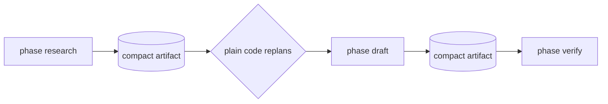

# Workflows and ctx

A rulvar workflow is an ordinary async function `(ctx, args) => result`, registered with `defineWorkflow` and executed by an engine you build with `createEngine`. Every primitive, from spawning agents to fanning out to suspending on human input, is a method of the injected `ctx`. There is no DSL, no graph builder, and no module-level registry: the engine creates a fresh `ctx` per run, so concurrent runs, nested workflows, and test mocking stay safe inside a host application.

Everything a workflow does through `ctx` lands in the journal, the content-addressed log of completed effects. That is what makes workflows durable: a crashed, edited, or suspended run resumes by replaying finished entries instead of paying for them again (the never-pay-twice invariant). This page covers authoring and running workflows; the journal mechanics live in [Journal](/guide/journal) and resume semantics in [Durability](/guide/durability).

## Quick start

rulvar is ESM only and requires Node 22.12.0 or newer; `@rulvar/store-sqlite` additionally needs Node 22.13 or newer, where its `node:sqlite` driver is flag-free (on 22.12 it requires `--experimental-sqlite`). Install the core, a provider adapter, and a durable store:

```bash
pnpm add @rulvar/core @rulvar/anthropic @rulvar/store-sqlite zod
```

```ts
import { z } from 'zod';

import { anthropic } from '@rulvar/anthropic';
import { createEngine, defineWorkflow, type Ctx, type Workflow } from '@rulvar/core';
import { SqliteStore } from '@rulvar/store-sqlite';

const reviewSchema = z.strictObject({
  ok: z.boolean(),
  problems: z.array(z.string()),
});

export interface ReviewArgs {
  diff: string;
}

export const reviewDiff: Workflow<ReviewArgs, { ok: boolean; problems: string[] }> =
  defineWorkflow({ name: 'review-diff' }, async (ctx: Ctx, args: ReviewArgs) => {
    const review = await ctx.agent(
      `Review this diff for correctness problems. Report ok:true only when none remain.\n\n${args.diff}`,
      { schema: reviewSchema, label: 'reviewer' },
    );
    ctx.log('info', 'review finished', { problems: review.problems.length });
    return review;
  });

const engine = createEngine({
  adapters: [anthropic()],
  stores: { journal: new SqliteStore({ path: '.rulvar/journal.db' }) },
  defaults: { routing: { loop: 'anthropic:claude-sonnet-5' } },
});

const myDiff = '--- a/sort.ts\n+++ b/sort.ts\n...';
const handle = engine.run(reviewDiff, { diff: myDiff }, { budgetUsd: 5 });
const outcome = await handle.result;
if (outcome.status === 'ok') {
  console.log(outcome.value);
}
```

`ctx.agent` with a schema resolves directly with the validated, typed output. The `budgetUsd: 5` is the run's dollar ceiling, immutable after start and enforced on three layers; see [Budgets](/guide/budgets).

::: warning Default store
Without `stores.journal`, the engine uses `InMemoryStore`: fine for tests, but nothing survives a process exit, so a restarted process cannot resume, and the engine warns loudly. Use `SqliteStore` (or another durable journal store) for anything you may want to resume. See [Stores](/guide/stores).
:::

## The workflow contract

Three rules define how a workflow body executes:

1. **Single pass.** The body runs exactly once, top to bottom, per process attempt. On resume after a crash, an edit, or a suspension, the body re-executes from the top, and every `ctx` call is matched against the journal by scope path and content key (scoped forward-matching). Completed entries replay; only genuinely new work runs live. There is no per-step re-entry of the body, so a long run never degrades into quadratic re-execution.
2. **No module state.** A workflow module must not hold state that influences execution. Everything the run needs arrives through `args` and `ctx`; everything it produces leaves through the return value and journaled effects.
3. **Closures stay in process.** A `Workflow` value from `defineWorkflow` runs on the in-process runner. Machine-generated scripts are a separate, source-backed `CompiledWorkflow` type that only the worker sandbox will execute; the type split makes feeding a closure to the sandbox impossible at compile time. See [Planner](/guide/planner).

`defineWorkflow` also fixes the error policy. The default `'strict'` means agent failures throw typed errors and a failing `ctx.parallel` branch aborts its siblings. The `'lenient'` policy (what the planner emits for generated scripts) defaults `onError` to `'null'`, and the type system shows the null possibility on every agent call. Either way, no loss is silent: every dropped result is recorded in the outcome's `dropped` list with its full error.

## Runs, outcomes, and the run handle

`engine.run(wf, args, opts?)` starts a run and returns a `RunHandle` immediately:

```ts
const handle = engine.run(reviewDiff, { diff: myDiff }, {
  runId: 'review-42',          // explicit id; otherwise the engine mints a ULID
  budgetUsd: 5,                // run ceiling, immutable after start
  deadlineAt: '2026-08-01T09:00:00Z',
  limits: { maxTurns: 16 },    // merged over engine defaults
});

handle.on('agent:end', (e) => console.log('agent settled', e));
const outcome = await handle.result;
```

The handle carries `runId`, the `result` promise, an `events` async iterable (plus the `on` subscription form) for live telemetry, `cancel(reason?)` for cooperative cancellation, and `resolveExternal(key, value)` for answering suspensions. The settled `RunOutcome` has one of five statuses:

| Status | Meaning |
|---|---|
| `ok` | The body returned; `value` carries the result. |
| `error` | The body threw; `error` carries the wire-safe projection. |
| `cancelled` | Host cancellation or a crossed run deadline. |
| `exhausted` | The budget ceiling blocked further work. Overrides `error`, and always arrives with the full cost report and the dropped and pending evidence. |
| `suspended` | Every in-flight branch is blocked on an external input; `pending` lists the open keys. |

Every outcome, regardless of status, includes `dropped`, `pending`, `usage`, and `cost`. To pick a run back up in a new process, use `engine.resume(runId, wf)`; the binding and replay rules are covered in [Durability](/guide/durability).

## The ctx surface

The canonical authoring surface. Anything not listed here is not part of `ctx`:

| Member | Purpose |
|---|---|
| `ctx.agent(prompt, opts?)` | Spawn a subagent; journaled, budgeted, typed output via `schema`. |
| `ctx.parallel(tasks, opts?)` | Run branches concurrently; results in source order; `settle: true` for per-branch outcomes. |
| `ctx.pipeline(items, ...stages, opts?)` | Stream items through 1 to 6 stages with no inter-stage barrier. |
| `ctx.step(label, fn, opts?)` | Journal an arbitrary host computation so it is never paid twice. |
| `ctx.workflow(child, args, opts?)` | Run a nested workflow with its own journal scope and budget sub-account. |
| `ctx.orchestrate(goal, opts?)` | Nest a dynamic orchestrator agent; see [Orchestration modes](/guide/orchestration-modes). |
| `ctx.awaitExternal(key, opts?)` | Suspend this position until an external resolution arrives. |
| `ctx.phase(name, fn)` | Name a section for observability and cost attribution. |
| `ctx.log(level, msg, data?)` | Emit a telemetry log event; never journaled. |
| `ctx.brief(opts)` | Journaled summarize call producing a compact brief for a child prompt. |
| `ctx.budget.spent()` / `remaining()` | Live spend introspection. |
| `ctx.now()` / `ctx.random(key?)` / `ctx.uuid()` | Deterministic, journaled shims for time, randomness, and ids. |

### Spawning agents with ctx.agent

The full option surface and status model are on [Agents](/guide/agents); the shapes you reach for daily:

```ts
// Plain text out:
const answer = await ctx.agent('Name the fastest comparison sort.');

// Typed output via a schema (Zod, any Standard Schema, or a JSON Schema literal):
const vote = await ctx.agent(prompt, { schema: voteSchema, label: 'judge-1' });

// Full result when you want to branch on status instead of catching:
const full = await ctx.agent(prompt, { schema: voteSchema, result: 'full' });
if (full.status === 'limit') {
  ctx.log('warn', 'judge hit a usage limit', { costUsd: full.costUsd });
}
```

Under the strict policy a failing value-form call throws a typed error; with `onError: 'null'` it resolves `null` and the loss is recorded in the run's `dropped` evidence. `label` is telemetry only and never changes an entry's identity, so relabeling does not invalidate the journal.

### Fan-out with ctx.parallel

`ctx.parallel` runs task thunks concurrently under the scheduler and resolves in source order regardless of completion order. It is a barrier: each branch journals as it completes, and the call resolves when all branches settle. This is the shape behind the adversarial panel recipe:

```ts
const votes = await ctx.parallel(
  Array.from({ length: skeptics }, (_unused, i) => () =>
    ctx.agent(
      `You are skeptic ${i + 1}. Try to REFUTE this claim.\n\nClaim: ${args.claim}`,
      { schema: refutationSchema, label: `skeptic-${i + 1}` },
    ),
  ),
);
const survives = votes.filter((v) => v.refuted).length * 2 < skeptics;
```

Under the strict policy, a thrown branch aborts its siblings by default (`abortSiblings: true`); aborted siblings journal as cancelled and rerun on resume. When partial results are the point, settle instead:

```ts
const settled = await ctx.parallel(tasks, { settle: true });
for (const branch of settled) {
  if (branch.status === 'ok') keep(branch.value);
}
```

`settle: true` disables sibling abortion entirely and yields a discriminated union per branch (`ok`, `error`, `limit`, `cancelled`, `skipped`, `escalated`). A branch that hits a usage limit is a settled outcome, not an error: it never aborts its siblings.

### Streaming stages with ctx.pipeline

`ctx.pipeline` streams items through stages with no inter-stage barrier: item 2 can be in stage 1 while item 1 is already in stage 2. Each stage application journals under its own per-item scope, so a resumed pipeline picks up exactly the items that never finished.

```ts
import { readFile } from 'node:fs/promises';

const summaries = await ctx.pipeline(
  paths,
  (path) => ctx.step(`read-${path}`, () => readFile(path, 'utf8')),
  (text) => ctx.agent(`Summarize in three bullets:\n\n${text}`),
  { onItemError: 'drop' },
);
```

`onItemError` defaults to `'drop'`: a failing item lands in the run's `dropped` list with its full error and the pipeline continues. `'throw'` rejects on the first stage error; `'collect'` returns `{ results, dropped }` so the caller sees both.

### Journaling host work with ctx.step

`ctx.step` records an arbitrary host computation as a journal entry, so it runs live exactly once and replays afterward. Use it for anything effectful or non-deterministic that is not a model call: file reads, database queries, parsing that must stay byte-stable.

```ts
const stats = await ctx.step(
  'collect-stats',
  async () => {
    const raw = await readFile('report.json', 'utf8');
    return JSON.parse(raw) as { files: number };
  },
  { deps: [reportVersion] },
);
```

`deps` enter the entry's content key exactly like React `useMemo` dependencies: change them and the step re-executes live under a new key. `key` overrides label-based identity entirely. The return value must be JSON-serializable; a non-serializable value throws a typed error at the call site rather than corrupting the journal.

### Nested workflows with ctx.workflow

`ctx.workflow(child, args)` runs another workflow as a child. The child gets a nested journal scope and a hierarchical budget sub-account whose spend propagates to every ancestor up to the run root, so a subtree can never quietly outspend the run ceiling. Nesting depth is governed by admission (default depth 1, hard ceiling 4, configured via `budgetDefaults.maxDepth`), and a structural rejection throws a typed error to the caller without tearing down the run.

```ts
const findings = await ctx.workflow(research, { topic: args.topic });

// Or by registered name, resolved against the engine's defaults.workflows registry:
const audit = await ctx.workflow('audit', { findings }, { key: `audit-${args.topic}` });
```

The child's identity in the journal is its registered name plus its args; passing `key` replaces the args in that identity, which is how you disambiguate two calls with identical arguments or keep identity stable while args carry bulky payloads.

### External input with ctx.awaitExternal

`ctx.awaitExternal(key)` suspends the calling position on a journaled entry until something resolves it. The rest of the run keeps going; when every in-flight branch is blocked on suspensions, the run settles with status `suspended` and the outcome's `pending` lists the open keys. Resuming later delivers the recorded values without re-running anything already paid for.

```ts
const decision = await ctx.awaitExternal<{ approved: boolean }>('deploy-approval', {
  schema: approvalSchema,                    // validates the resolution value
  prompt: 'Approve the production deploy?',  // display metadata for operators
});
if (!decision.approved) return { deployed: false };
```

Resolve from the host through the live handle:

```ts
await handle.resolveExternal('deploy-approval', { approved: true });
```

Other channels (the CLI, the server shell's HTTP endpoint) feed the same mechanism. When a `schema` is set, an invalid resolution is rejected with a typed error and the entry stays suspended. `awaitExternal` has no deadline in v1; deadlines exist only on approval suspensions and escalations.

### Phases, logs, and briefs

`ctx.phase(name, fn)` names a section of the run. Phases are cosmetic for identity (renaming a phase never invalidates journal entries) and structural for observability: they open spans, emit `phase:start` events, and bucket the cost report's `byPhase` attribution. Phases may nest; cost attaches to the innermost one.

`ctx.log(level, msg, data?)` emits a telemetry event. It is not journaled, never enters identity, and is not re-emitted on replay.

`ctx.brief(opts)` is a journaled summarize invocation: it distills the content you pass into a compact string meant to ride inside a child's prompt, and because it journals like any agent call, it is free on replay.

```ts
const brief = await ctx.brief({
  content: JSON.stringify(findings),
  instruction: 'Distill what the draft phase must cover, in under 200 words.',
  model: 'anthropic:claude-sonnet-5',
});
```

The call resolves the `summarize` role through the ordinary model chain, so it needs a `defaults.routing.summarize` entry, an `agentType` profile, or an explicit `model` as shown. See [Model routing](/guide/model-routing).

### Budget introspection

```ts
const spent = ctx.budget.spent();      // { usd, usage, agentsSpawned }
const left = ctx.budget.remaining();   // null when the run has no USD ceiling

if (left !== null && left.usd < 1) {
  ctx.log('warn', 'under a dollar left; skipping the optional audit');
}
```

Reading the budget lets a workflow degrade gracefully before the engine enforces the ceiling for it. At the ceiling, every `ctx` primitive throws the same typed exhaustion error and the run settles `exhausted` with full evidence; see [Budgets](/guide/budgets).

### Deterministic time, randomness, and ids

```ts
const startedAt = ctx.now();            // journaled timestamp
const pick = ctx.random('spot-check');  // journaled; the key keeps it stable under reordering
const ticket = ctx.uuid();              // journaled
```

Each call journals its value on first execution and returns the journaled value byte-for-byte on every replay, so branching on time or randomness stays consistent across resumes. `ctx.random` accepts an optional explicit key for stability when surrounding code moves. These shims are why bare `Date.now` and `Math.random` are banned in workflow modules; see the determinism rules below.

## Concurrency and scheduling

The scheduler bounds live model calls without you writing any queuing code:

| Knob | Default | Where |
|---|---|---|
| Concurrent model calls per run | 12 | `createEngine` `concurrency.perRun` |
| Per-provider concurrency | unlimited unless configured | `concurrency.perProvider`, keyed by adapter id |
| Lifetime spawn cap per run | 500 | `budgetDefaults.lifetimeSpawnCap` |
| Nesting depth | 1 (hard ceiling 4) | `budgetDefaults.maxDepth` |
| Child budget fraction | 0.3 of the parent remainder | `budgetDefaults.childBudgetFraction` |

Excess tasks queue on a per-run semaphore; `ctx.parallel` branches and `ctx.pipeline` stage applications all schedule through it. Dispatch is at-least-once: after a crash, an entry that was mid-flight is redispatched on resume, and deduplication comes from the journal, not the scheduler, so at-least-once dispatch never becomes pay-twice.

## The phase chain

The documented default pattern for multi-stage work is the phase chain: a top-level workflow that runs each stage as a phase wrapping a nested workflow, with plain TypeScript between phases deciding what happens next. Replanning happens only at phase boundaries, over compact artifacts, with fresh context for the next phase. Most adaptive needs are served by this pattern alone; the wide fan-out machinery ([Adaptive orchestration](/guide/adaptive-orchestration)) is opt-in for workloads that cannot wait for a phase boundary.



```ts
import { z } from 'zod';

import { defineWorkflow, type Ctx, type Workflow } from '@rulvar/core';

const findingsSchema = z.strictObject({ findings: z.array(z.string()) });

const research: Workflow<{ topic: string }, { findings: string[] }> = defineWorkflow(
  { name: 'research' },
  async (ctx: Ctx, args: { topic: string }) =>
    ctx.agent(`List the load-bearing facts about: ${args.topic}`, { schema: findingsSchema }),
);

const draft: Workflow<{ brief: string }, string> = defineWorkflow(
  { name: 'draft' },
  async (ctx: Ctx, args: { brief: string }) =>
    ctx.agent(`Write the report this brief asks for:\n\n${args.brief}`),
);

export const report: Workflow<{ topic: string }, string> = defineWorkflow(
  { name: 'report' },
  async (ctx: Ctx, args: { topic: string }) => {
    const found = await ctx.phase('research', () =>
      ctx.workflow(research, { topic: args.topic }),
    );

    // Replanning happens HERE, between phases, in plain TypeScript:
    // inspect the compact artifact and decide what the next phase gets.
    if (found.findings.length === 0) {
      return 'Nothing substantive found.';
    }

    const brief = await ctx.brief({
      content: JSON.stringify(found.findings),
      instruction: 'Distill what the draft must cover, in under 200 words.',
      model: 'anthropic:claude-sonnet-5',
    });

    return ctx.phase('draft', () => ctx.workflow(draft, { brief }));
  },
);
```

Why this shape works well:

- **Compact artifacts between phases.** Each phase returns a small typed value (or a `ctx.brief` distillation), not a transcript. The next phase starts with fresh context and only what it needs.
- **Replanning is plain code.** The decision between phases is auditable TypeScript, journaled through the `ctx` calls it makes, not a hidden model decision.
- **Everything stays durable.** Each nested workflow gets its own journal scope and budget sub-account; a crash mid-chain resumes with all completed phases replayed for free.
- **Costs read cleanly.** The cost report buckets spend by phase, so `research` versus `draft` spend is one lookup.

The reference quality patterns (adversarial panels, judge panels, loop-until-dry, completeness critics) all ship as recipes over these same primitives, never as engine flags; see [Examples](/guide/examples).

## Determinism rules for workflow modules

Resume works because a re-executing body produces the same sequence of scope paths and content keys, so every finished call matches its journal entry. Only the sequence of keys must be stable; rulvar deliberately does not wrap your code in a VM to force this. Two things break it:

1. **Non-deterministic values that reach prompts or control flow.** A bare `Date.now()` in a prompt produces a different content key on every attempt, so resume misses the journal and pays for the call again.
2. **Effects outside the journal.** A bare `fetch` is invisible to the engine and simply runs again on every resume.

The rules, enforced by convention, lint, and the `ctx` shims:

| Reaching for | Use instead |
|---|---|
| `Date.now()`, `new Date()` | `ctx.now()` |
| `Math.random()` | `ctx.random(key?)` |
| Ad-hoc ids | `ctx.uuid()` |
| `fetch`, file and database I/O inline | `ctx.step(label, fn)`, or a tool on an agent |
| `process.env` steering control flow | `args` or engine configuration |
| `Promise.all` over `ctx` calls | `ctx.parallel` (journals, schedules, settles) |

`eslint-plugin-rulvar` flags bare `Date.now`, `Math.random`, `new Date`, `fetch`, and `process.env` in workflow modules, plus bare `Promise.all` over `ctx` calls. In development (`NODE_ENV` other than `production`), the in-process runner additionally patches `Date.now` and `Math.random` to warn once per run, pointing at the shims; behavior is preserved. Machine-generated scripts get the strict version of all this: the worker sandbox replaces time and randomness with seeded journaled shims and has no `fetch`, `import`, or `process` in scope at all.

The full contract, including what happens when you edit a workflow between resume attempts, is on [Determinism](/guide/determinism).

## Next steps

- [Agents](/guide/agents): the complete `ctx.agent` option surface, statuses, and profiles.
- [Budgets](/guide/budgets): the three-layer budget, usage limits, and the exhausted outcome.
- [Durability](/guide/durability): resume, run-to-definition binding, and crash recovery.
- [Orchestration modes](/guide/orchestration-modes): where human scripts end and planned or dynamic orchestration begins.
- [Testing](/guide/testing): running workflows on the fake adapter with zero live calls.
- [API reference](/api/@rulvar/core/): every symbol on this page, generated from source.
