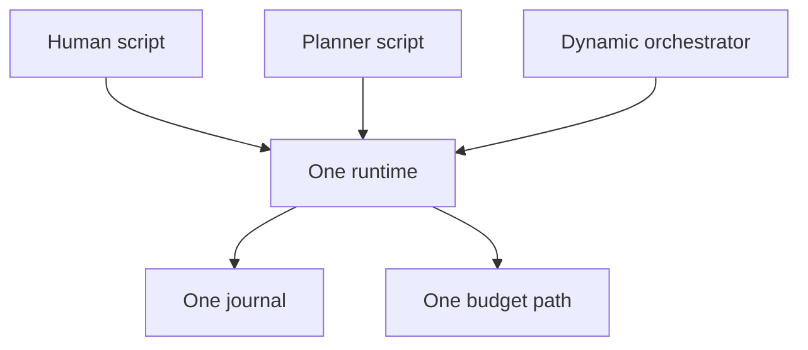

# Design principles

Rulvar is an embeddable TypeScript engine for durable, budget-bounded, testable multi-agent LLM workflows. Its design reduces to seven hard goals, four stances, and a short list of deliberate exclusions. Every goal is backed by a concrete mechanism, not a mission statement, and **if a feature contradicts a principle, the feature loses**.

This page explains the reasoning. The user-facing guarantees that fall out of it are cataloged on [Core invariants](/guide/invariants), and the layer diagram lives in [Architecture](/guide/architecture).

## The seven hard goals

| Goal | Enforcing mechanism |
| --- | --- |
| Vendor neutrality by construction | The `ProviderAdapter` SPI; zero provider SDKs in the core |
| Multi-model at every level | Per-invocation resolution chain and six invocation roles |
| Three modes on one runtime | One engine, one journal, one budget path for all modes |
| Embeddability first | Optional shells on public APIs; terminating guard fallbacks |
| Durability, never pay twice | Content-addressed memoizing journal with scoped forward-matching |
| Budget as a hard invariant | Three enforcement layers with a declared, bounded overshoot |
| Observability and testability | One event stream, fake adapters, cassettes, replay-strict runs |

### Vendor neutrality by construction

`@rulvar/core` imports no provider SDK; its `package.json` declares exactly one runtime dependency, the MCP SDK. Every provider lives exclusively inside its own adapter behind the `ProviderAdapter` SPI: `@rulvar/anthropic` and `@rulvar/openai` are the first-class adapters, `openaiCompatible` covers compatible endpoints (Ollama, vLLM, gateways) under explicit ids, and `@rulvar/bridge-ai-sdk` wraps the ai-sdk ecosystem for the long tail.

Neutrality "by construction" means you cannot accidentally couple a workflow to a vendor: the core has nothing vendor-shaped to couple to. Providers are data you pass in.

```ts
import { createEngine, JsonlFileStore } from '@rulvar/core';
import { anthropic } from '@rulvar/anthropic';
import { openai } from '@rulvar/openai';

const engine = createEngine({
  adapters: [anthropic(), openai()],
  stores: { journal: new JsonlFileStore({ dir: './runs' }) },
});
```

See [Providers](/guide/providers) for adapter details and [Adapter authors](/guide/adapter-authors) for the SPI contract.

### Multi-model at every level

The model is resolved on **every invocation**, not once per agent, through a fixed chain: call override, then agent profile, then workflow defaults, then engine defaults. Within a single agent, the six invocation roles (`loop`, `extract`, `finalize`, `summarize`, `plan`, `orchestrate`) can each route to a different model of a different provider; a history projector owns cross-provider history correctness so the mixing is safe, not hopeful.

```ts
import { defineWorkflow } from '@rulvar/core';

const review = defineWorkflow({ name: 'review' }, async (ctx, args: { diff: string }) => {
  return ctx.agent(`Review this diff for correctness:\n${args.diff}`, {
    routing: {
      loop: 'anthropic:claude-sonnet-5',      // the tool loop
      extract: 'openai:gpt-5.4-mini',         // the cheap structured pull
      summarize: 'anthropic:claude-haiku-4-5' // history compaction
    },
  });
});
```

The reasoning: model choice is an economic decision that changes weekly, so it must be late-bound and layered, never baked into workflow code. Role quality floors keep the flexibility from becoming a footgun: engine config can forbid weak models for critical roles as a hard router constraint no advice can override. Full mechanics: [Model routing](/guide/model-routing).

### Three modes on one runtime

There are exactly three answers to "who decides what runs next": a person (human scripts), a planner model that writes the whole script before anything executes (the flagship hybrid), and an orchestrator agent that decides live with typed spawn tools. All three run on the same subagent runtime, write the same journal, and pass through the same budget path.



Because the modes share one substrate, every guarantee on this page holds identically in every mode; switching modes changes authorship of control flow and nothing else. That is only true because the substrate is singular, which is why the mode set is closed (see [No fourth mode](#no-fourth-mode) below) and why the comparison never becomes a compatibility matrix. See [Orchestration modes](/guide/orchestration-modes).

### Embeddability first

Rulvar lives inside your application. The core requires no server, no database, and no control plane; the default journal store is in-memory, and durable stores are plain values you pass to `createEngine`. The shells (CLI, HTTP server, queue worker in `@rulvar/cli`) are built strictly on the public APIs, and no lower layer depends on them: anything a shell can do, your host process can do.

Embedding forces one hard rule on the adaptive machinery: every guard state has a non-interactive terminating fallback. A run inside a queue worker at 3am has no operator to click a button, so an unanswered approval, a stuck plan, or a guard trip always resolves to a journaled terminating decision rather than a hang. The safe default and the embeddable default coincide by construction.

### Durability, never pay twice

The journal is a **content-addressed memoizing log of completed effects**, not event sourcing. Each entry is identified by its structural scope path, a content key (a hash of the canonical form of the call), and an ordinal. On resume, scoped forward-matching serves completed work from the journal and goes live only for what is genuinely new: inserting one call into an existing workflow costs exactly one live call, and there is no global prefix flip that silently re-bills everything after an edit.

The central invariant is blunt: a completed LLM call is never paid for twice. Crash and resume, edit and rerun, suspend for a week and pick the run back up; completed work replays byte-identically at zero cost. See [Journal](/guide/journal) and [Durability](/guide/durability).

### Budget as a hard invariant

A run's dollar ceiling is enforced in three layers:

1. **Admission before spawn**: a spawn that would push spend plus committed reserves past the ceiling is rejected before it costs anything.
2. **A guard before every agent turn**, checked against the agent's budget sub-account.
3. **An abort signal at the ceiling**: live streams are severed, and the partial usage is journaled as approximate rather than dropped.

Overshoot is declared and bounded: at most one turn per in-flight agent. No tighter bound is honest, because providers bill severed streams. The ceiling itself is immutable after start; no API, including a human approval decision, can top it up mid-run. And exhaustion is never a bare `null`: at the ceiling, `ctx` primitives throw a typed `BudgetExhaustedError`, and the run settles with the `'exhausted'` outcome carrying partial results and a complete cost report.

```ts
const run = engine.run(review, { diff }, { budgetUsd: 5 });
const outcome = await run.result;

if (outcome.status === 'exhausted') {
  // Partial results plus a full cost report; never a silent loss.
  console.log(outcome.cost.totalUsd, outcome.dropped.length);
}
```

See [Budgets](/guide/budgets) for sub-accounts, reserves, and the threshold events.

### Observability and testability out of the box

Every run emits one typed event stream (`RunHandle.events`), attributes every dollar in a `CostReport` (by model, by phase, by agent type, by role), and exports to OpenTelemetry through the shell. Testing is a first-class package, not a wiki page: `@rulvar/testing` ships a fake adapter and test engine, VCR cassettes with secret redaction for hermetic CI, and replay-strict runs that fail on the first would-be-live call, which turns any production journal into a regression test. `@rulvar/evals` runs eval cases, rubric graders, and judge graders through the same engine.

This goal is why the journal doubles as an audit trail: because every decision is journaled before its effects, "what happened and what did it cost" is a pure read, not a reconstruction. See [Observability](/guide/observability), [Testing](/guide/testing), and [Evals](/guide/evals).

## Design stances

Four stances shape the API more than any single feature.

### A library, not a platform

Rulvar is a dependency, not a deployment. There are no module-level globals or singletons at any layer: the adapter registry, the workflow registry, and all configuration are per-engine values, so two engines in one process cannot interfere and your dependency injection story stays yours. Workflows are ordinary async TypeScript functions over an injected `ctx`; there is nothing to host, register with, or phone home to.

### Call-and-return only

The single cross-agent primitive is agent-as-tool: invoke a specialist, get its result back. Handoffs, chat rooms, blackboard coordination, and emergent topologies are rejected on principle, not postponed. The reasoning is structural: budget attribution requires knowing which call site pays for which work, and journal identity requires a deterministic execution tree. Both die the moment control can wander sideways. Call-and-return keeps every piece of work owned by exactly one parent, which is what makes the scope path, the budget roll-up, and replay all coherent.

### Every dynamic decision is a decision entry

Whenever the run decides something at runtime (a plan revision, an admission verdict, an escalation decision, a guard verdict, a knowledge-snapshot pin), that decision is exactly one journal entry, written strictly **before** any of its effects, carrying everything that would otherwise need re-evaluating live. Reads are pure folds over already-journaled state, pinned to a snapshot; derived state is ordered by spawn ordinal, never wall clock.

The payoff is that a resumed run is the same run. Nothing is re-litigated on resume, no decision can silently come out differently the second time, and the journal is a complete causal record of why the run did what it did.

### No fourth mode

The three orchestration modes are a closed set. Every proposed fourth mode so far has been one of the existing three wearing a costume, and admitting one would fracture the "one runtime, one journal, one budget path" invariant into a compatibility matrix. The documented default for most workloads is the humblest shape: a phase chain of `ctx.phase` with nested `ctx.workflow`, replanning only between phases over compact artifacts. The dynamic orchestrator and the [plan extension](/guide/adaptive-orchestration) are opt-in tools for wide fan-out that cannot wait for a phase boundary, not the default posture.

## What Rulvar deliberately leaves out

These are decisions with reasons, not gaps awaiting a release.

| Excluded | Why |
| --- | --- |
| Vector store, cross-run memory | Breaks run reproducibility; one sanctioned, snapshot-pinned exception |
| Handoffs and chat-room topologies | Destroy budget attribution and scope identity |
| A graph or YAML execution core | Code composes, types, diffs, and lints better than graphs |
| Checkpoint-everything snapshot resume | Permanent compatibility surface that defeats cheap edits |
| Engine-level strategy enums | Collaboration patterns are prompts, not runtime semantics |
| Runtime tier promotion | Spend changes must trace to a declared decision |

**No vector store, no cross-run memory.** A run must be reproducible from its journal alone; state that leaks across runs makes replay depend on something the journal does not contain. The sole sanctioned exception is [ModelKnowledge](/guide/model-knowledge), and it is shaped by the same rule: it is opt-in (an engine without the store writes nothing), the run pins its knowledge snapshot in a journaled decision entry before any effect, the runtime holds a read-only handle, and every influence channel ships together with its correction mechanism in the same package.

**No handoffs.** Covered under [call-and-return only](#call-and-return-only): the exclusion is permanent because the invariants it protects are load-bearing, not stylistic.

**No graph or YAML execution core.** Workflows are TypeScript functions, and determinism comes from the journal and the `ctx` shims, not from constraining the language you write in. A graph core would be a second, worse programming language: no types across edges, no composition, no refactoring tools, and a permanently versioned serialization format. Where a constrained machine-readable plan genuinely helps (a planner model emitting structure, an orchestrator revising a task plan), it exists as typed, engine-owned **data** consumed by the ordinary runtime, never as the execution core.

**No checkpoint-everything snapshot resume.** Snapshotting full program state was rejected four times over: it creates a permanent compatibility surface for internal state, costs quadratic writes, pins the workflow definition to the snapshot, and defeats the property that editing a workflow costs one live call rather than an invalidated snapshot chain. Memoizing completed effects gets the same durability with none of those debts; agent transcripts are checkpointed at turn boundaries as separate blobs, so even a crash mid-agent resumes at the same turn.

**No engine-level strategy enums.** There is no `strategy: 'debate'`, no `requireReview: true`. Adversarial panels, judge panels, critic loops, and their relatives ship as recipes and prompt templates built from the ordinary primitives, because that is what they are: prompt patterns over call-and-return. Freezing them into engine flags would turn prompt iteration into breaking API changes and imply the engine can guarantee semantics it cannot.

**No runtime tier promotion.** A model ladder escalates through its declared rungs under journaled acceptance gates, but the engine never silently promotes a run onto a stronger, more expensive model on its own initiative. Every escalation is a journaled decision you can point to. Promotion informed by accumulated evidence is a future candidate only in a form that keeps this property: compiled from eval-measured claims, pinned per run, never a runtime surprise.

## Costs we accepted

Principles are only real when they cost something:

- **Changed content is a live call.** There is no workflow-versioning API; identity is the content itself, so editing a prompt re-pays exactly the edited call. Pin volatile prompts with the call's `key` option when the text varies but the identity should not.
- **Bounded overshoot instead of zero overshoot.** Providers bill severed streams, so Rulvar declares the honest bound (one turn per in-flight agent) rather than pretending to a perfect ceiling.
- **Determinism for human scripts is by convention.** Lint rules, dev-mode warnings, and the `ctx.now()/ctx.random()/ctx.uuid()` shims enforce it; a VM was rejected as hostile to embedding. Machine-written scripts get the stricter worker sandbox.
- **ESM only, Node.js 22.12 or newer.** One module format and a modern floor, over a wider but muddier support matrix.

## Next steps

- [Core invariants](/guide/invariants): the same machinery expressed as user-facing guarantees.
- [Architecture](/guide/architecture): the layers and the twelve components.
- [Orchestration modes](/guide/orchestration-modes): choosing who authors control flow.
- [Glossary](/reference/glossary): the canonical vocabulary used across the docs.
- [API reference](/api/@rulvar/core/): the full public surface of the core.
