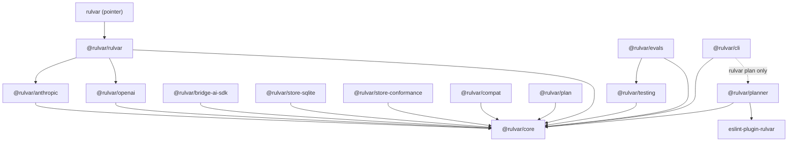

# Packages

Rulvar ships as fourteen packages from a single monorepo: thirteen under the `@rulvar` npm scope, plus `eslint-plugin-rulvar`, which follows the ESLint plugin naming convention. The packages release lockstep at one version, currently <!-- version:lockstep -->1.5.2<!-- /version -->, with a single exemption: `@rulvar/compat` is versioned independently and currently sits at <!-- version:compat -->0.1.0<!-- /version -->. Every package is ESM only, requires Node.js >= 22.12.0, and is licensed Apache-2.0.

A fifteenth npm name exists: the unscoped `rulvar`, a pointer package that re-exports the umbrella so a bare install still lands on the real library. Documentation and install commands always use the scoped names.

::: tip
Looking for the generated TypeScript signatures? Every package has an index in the [API reference](/api/); each package name in the table below links to its index.
:::

## Choosing an install

There are two install paths. The umbrella is the batteries-included single install; the a la carte path picks exactly the pieces you need:

```bash
# Batteries included: core, both first-class adapters, the progress renderer
pnpm add @rulvar/rulvar

# A la carte: engine, one adapter, a durable store
pnpm add @rulvar/core @rulvar/anthropic @rulvar/store-sqlite
```

`@rulvar/rulvar` re-exports the entire `@rulvar/core` surface plus both first-class adapters, so a minimal engine is one import:

```ts
import { createEngine, anthropic, openai, recommendedDefaults } from '@rulvar/rulvar';

const engine = createEngine({
  adapters: [anthropic(), openai()],
  defaults: {
    routing: recommendedDefaults.routing,
    roleFloors: recommendedDefaults.floors,
  },
});
```

The umbrella is also the only package that names concrete strong default models for the orchestrate and plan roles (`recommendedDefaults`). `@rulvar/core` deliberately names no models; see [Model routing](/guide/model-routing). For a full walkthrough, start with [Installation](/guide/installation).

## The layer model at a glance

The Layer column in the table below uses the labels of the architecture's layer model. Dependencies point strictly downward: a package in one layer never imports anything from a layer above it. The full model is on [Architecture](/guide/architecture).

| Label | Name | What lives there |
|---|---|---|
| L0 | contracts | Message and part types, the journal entry form, usage and error types, and the SPI interfaces (provider adapter, journal and transcript stores, model knowledge store, script runner, tool source, isolation provider) |
| L1 | leaves | Provider adapters and stores; they depend only on the L0 contracts |
| L2 | kernel | The journal kernel (content keys, scope paths, the replay predicate, the budget ledger) and the model router with the capability and price registry |
| L3 | execution | The tool system, the MCP bus, and the agent runtime |
| L4 | orchestration | The run engine, ctx primitives, the concurrency scheduler, the three-layer budget, the event stream, and the dynamic orchestrator |
| L5 | authoring | Script runners and the plan agent |
| L6 | shells | CLI, HTTP server, queue worker, test harness, and evals, built strictly on the public API |

## The package table

| Package | Layer | Purpose | Key exports | Depends on |
|---|---|---|---|---|
| [`@rulvar/rulvar`](/api/@rulvar/rulvar/) | umbrella | The batteries-included single install: re-exports the whole `@rulvar/core` surface, both first-class adapters, and the terminal progress renderer; the sole home of the named strong default models for the orchestrate and plan roles | everything from `@rulvar/core`, `anthropic`, `openai`, `renderProgress`, `recommendedDefaults` | `@rulvar/core`, `@rulvar/anthropic`, `@rulvar/openai` |
| [`@rulvar/core`](/api/@rulvar/core/) | L0 to L5 | The engine: L0 contracts and SPI interfaces, the journal kernel, the model router and capability registry, the agent runtime, the tool system and MCP bus, ctx primitives and the run engine, the dynamic orchestrator, the in-memory and JSONL stores, the file-backed model knowledge store, the event stream. Zero provider SDK dependencies | `createEngine`, `defineWorkflow`, `tool`, `mcp`, `orchestrate`, `InMemoryStore`, `JsonlFileStore`, `replayDisposition` | `@modelcontextprotocol/sdk` (the MCP bus); a vendored JSON Schema validator |
| [`@rulvar/anthropic`](/api/@rulvar/anthropic/) | L1 | First-class Anthropic adapter over the official SDK: thinking-block replay with signatures, cache hint compilation, pause_turn continuation, typed refusal outcomes, usage normalization | `anthropic` | `@rulvar/core`, `@anthropic-ai/sdk` |
| [`@rulvar/openai`](/api/@rulvar/openai/) | L1 | First-class adapter for the OpenAI Responses API (reasoning items, strict json_schema), plus the factory for any OpenAI-compatible endpoint with an explicit id and baseURL | `openai`, `openaiCompatible` | `@rulvar/core`, `openai` |
| [`@rulvar/bridge-ai-sdk`](/api/@rulvar/bridge-ai-sdk/) | L1 | Wraps any Vercel AI SDK language model as a Rulvar provider adapter, covering the long tail of providers; performs a specification-version check at runtime. The highest-churn package by design | `bridgeAiSdk` | `@rulvar/core`, `@ai-sdk/provider` |
| [`@rulvar/store-sqlite`](/api/@rulvar/store-sqlite/) | L1 | SQLite journal store implementing the storage SPI with the lease capability and a fencing epoch, on the builtin node:sqlite driver; the reference implementation for community stores | `SqliteStore` | `@rulvar/core` |
| [`@rulvar/store-conformance`](/api/@rulvar/store-conformance/) | L6 | The executable conformance kit for store adapters: append atomicity, total per-run order, read-your-writes, payload opacity, lease fencing, and golden fold-state fixtures | `journalStoreConformance`, `leasableStoreConformance`, `registerConformance` | `@rulvar/core` |
| [`@rulvar/compat`](/api/@rulvar/compat/) | L2 extension | Frozen key-derivation profiles for journal hashVersions that leave the engine's support window, attached at engine construction via `extraDerivers`. Independently versioned | `deriverV0Synthetic` | `@rulvar/core` |
| [`@rulvar/plan`](/api/@rulvar/plan/) | L4 extension | The adaptive orchestration extension for the dynamic orchestrator: PlanRunner, the run ledger, escalation extensions, and model ladder configuration; built entirely on the public core API | `planRunner`, `orchestratePlanned`, `buildPlanTools` | `@rulvar/core` |
| [`@rulvar/planner`](/api/@rulvar/planner/) | L5 | The flagship hybrid mode: the plan agent, script compilation with an import allowlist, the worker sandbox runner with seeded journaled globals, and the lint-driven self-repair loop | `plan`, `runPlanned`, `compileScript`, `WorkerSandboxRunner`, `apiCard` | `@rulvar/core`, `eslint-plugin-rulvar`, `eslint` |
| [`eslint-plugin-rulvar`](/api/eslint-plugin-rulvar/) | tooling | Determinism lint rules for workflow modules (ban bare Date.now, Math.random, new Date, fetch, and process.env; ban Promise.all over ctx calls), emitting structured JSON diagnostics for the planner's self-repair loop | default plugin export, `rules`, `workflowsConfig`, `toJsonDiagnostics` | `eslint` >= 9 (peer) |
| [`@rulvar/testing`](/api/@rulvar/testing/) | L6 | The test harness: a fake adapter and test engine for fast typed unit tests, VCR cassettes with secret redaction, replay-strict runs, and matchers for Vitest and Jest | `createTestEngine`, `FakeAdapter`, `record`, `replay`, `replayRun` | `@rulvar/core` |
| [`@rulvar/evals`](/api/@rulvar/evals/) | L6 | The eval framework: eval cases with golden outputs, rubric and judge graders running through the engine, matrix sweeps, and the canary fingerprint | `runEvalSuite`, `runEvalMatrix`, `goldenGrader`, `rubricGrader`, `judgeGrader`, `canaryFingerprint` | `@rulvar/core`, `@rulvar/testing` |
| [`@rulvar/cli`](/api/@rulvar/cli/) | L6 | The ops shell: the `rulvar` binary (run, resume, runs, inspect, plan, kb), TUI progress, the embeddable HTTP server with SSE events and external-input resolution, the queue worker over a leasable store, and the OTel exporter | `runCli`, `createServer`, `createWorker`, `toOtel` | `@rulvar/core`; `@opentelemetry/api` (optional peer); `@rulvar/planner` (loaded dynamically by the plan command only) |
| `rulvar` (unscoped) | pointer | A minimal pointer on npm whose entry module re-exports `@rulvar/rulvar`, so a bare install still resolves to the real umbrella at a matching version | re-export of `@rulvar/rulvar` | `@rulvar/rulvar` |

## Dependency graph

Solid arrows are declared runtime dependencies; the dotted arrow is a dynamic import performed only by the `rulvar plan` command. Internal dependencies are declared with the pnpm workspace protocol and resolve to the exact lockstep version at publish time.



Four rules keep this graph honest, and they are enforced permanently, not just at major releases:

- The core never imports a plugin. Nothing in `@rulvar/core` references an adapter, a store package, a runner package, or a shell.
- Plugins import only the L0 contracts and never each other. A provider SDK appears exclusively inside its own adapter, which is why `@anthropic-ai/sdk` and the `openai` package never enter your dependency tree unless you install that adapter.
- Orchestration packages (`@rulvar/plan`, `@rulvar/planner`) and shells (`@rulvar/cli`, `@rulvar/testing`, `@rulvar/evals`, `@rulvar/store-conformance`) build exclusively from the public API. If a shell needed a private hook, the public seam would be considered defective and fixed; there are no private imports to lean on, and the same public surface is available to your code.
- No module state exists at any layer. Every registry (adapters, capabilities and prices, key derivers, agent profiles, workflows) hangs off the engine instance you construct. This is also why every package publishes ESM only: two module instances would duplicate registry state and break content-addressed replay identity.

## Lockstep versioning

All packages, including `eslint-plugin-rulvar` despite its unscoped name, release together at one version; the current release is <!-- version:lockstep -->1.5.2<!-- /version -->. Lockstep buys a simple compatibility rule: a set of `@rulvar` packages at the same version is the tested configuration. When you upgrade, upgrade them together. The unscoped `rulvar` pointer tracks the umbrella's version.

The sole exemption is `@rulvar/compat`, currently 0.1.0. Its job is to accrete frozen key-derivation profiles when a journal hashVersion leaves the engine's support window, so old journals stay resumable; that cadence follows the journal's compatibility history, not the engine's feature releases, and pinning it to the engine version would produce meaningless version churn in both directions. You attach its profiles at engine construction through the `extraDerivers` option. See [Journal compatibility](/guide/journal-compatibility) for when you need it and [Versioning](/reference/versioning) for the full policy; per-release notes are in the [Changelog](/reference/changelog).

## @rulvar/plan versus @rulvar/planner

The two names are close by design; both preserve established vocabulary. They solve different problems and neither depends on the other.

| Package | What it is | What it is not |
|---|---|---|
| `@rulvar/plan` | The adaptive orchestration extension for dynamic runs: PlanRunner treats the task plan as typed, engine-owned data with journaled revisions, reuse, escalations, and model ladders. See [PlanRunner and extensions](/guide/adaptive-orchestration) | Not the hybrid planning mode; it contains no plan agent and no sandbox |
| `@rulvar/planner` | The flagship hybrid mode: a planner model writes a workflow script against the sanctioned ctx dialect, the package lints and repairs it from structured diagnostics, compiles it, and executes it deterministically in the worker sandbox. See [The planner](/guide/planner) | Not PlanRunner; it contains no task-plan machinery |

The one-line mnemonic: `@rulvar/planner` plans before the run (it writes the script); `@rulvar/plan` replans during the run (it revises the task plan).

::: warning The unscoped name is a pointer
The bare `rulvar` package on npm exists only so that a bare install does not strand you on a dead name: it depends on `@rulvar/rulvar` and re-exports it. Always install and import the scoped packages; every install command in this documentation uses the `@rulvar/<name>` form.
:::
