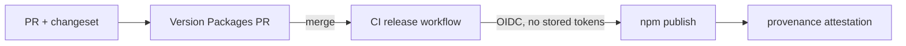

# Versioning and releases

Rulvar follows semver with one deliberate simplification: every package releases together under one identical version. There is exactly one exemption, and it exists to protect frozen data. This page explains the policy, what a release contains, and what an upgrade means for your code and for your journals.

| Line | Current version | Policy |
|---|---|---|
| The fixed group (thirteen packages) | <!-- version:lockstep -->1.29.0<!-- /version --> | Lockstep: identical versions, released together |
| `@rulvar/compat` | <!-- version:compat -->0.1.1<!-- /version --> | Independent: releases when a frozen profile moves in, or for rare packaging-only fixes |

## Lockstep semver across the fixed group

Every publishable Rulvar package except `@rulvar/compat` belongs to one fixed group and publishes at the identical version, even when a package has no changes of its own in a given release. The group is:

`@rulvar/core`, `@rulvar/plan`, `@rulvar/planner`, `@rulvar/anthropic`, `@rulvar/openai`, `@rulvar/bridge-ai-sdk`, `@rulvar/store-sqlite`, `@rulvar/store-conformance`, `@rulvar/testing`, `@rulvar/evals`, `@rulvar/cli`, the umbrella `@rulvar/rulvar`, and `eslint-plugin-rulvar`.

See [Packages](/reference/packages) for what each one does.

Two names in that list deserve a note:

- **`eslint-plugin-rulvar` is lockstep despite the unscoped name.** ESLint's plugin resolution requires the `eslint-plugin-` prefix, so the package cannot live under the `@rulvar` scope, but it versions and releases in the fixed group like every other member.
- **The unscoped `rulvar` name on npm is only a pointer.** The library publishes under the `@rulvar` scope; depend on `@rulvar/rulvar` (or the individual packages), never on the bare name. The pointer is versioned outside the changesets fixed group, but each release republishes it to match the umbrella, so `rulvar@X` resolves to `@rulvar/rulvar@X`.

Lockstep is what makes the compatibility story simple. There is no matrix of which `@rulvar/core` works with which `@rulvar/plan`: matching versions work together, mixed versions across the scope are unsupported, and each release can state its journal compatibility in one sentence. The packages are developed that way too, in one repository against one spec and one test gate, so independent versions would advertise an independence that does not exist.

::: warning Upgrade the whole scope together
Bump every fixed-group package to the same version in one move. A partially upgraded install (say `@rulvar/plan` one minor behind `@rulvar/core`) is not a supported configuration.
:::

## The sole exemption: @rulvar/compat

[`@rulvar/compat`](/api/@rulvar/compat/) is the only package outside lockstep, and its version (<!-- version:compat -->0.1.1<!-- /version --> today, while the group is at <!-- version:lockstep -->1.29.0<!-- /version -->) is not a mistake.

The package holds frozen `KeyDeriver` profiles: the identity-derivation code and data for journal `hashVersion`s that have aged out of the engine's support window. A frozen profile's entire value is that it never changes. If lockstep force-bumped it on every release, an unchanged frozen profile would keep reappearing under new version numbers, which falsely suggests the one thing a frozen profile must never do. So `@rulvar/compat` releases only when a profile actually leaves the support window and moves into the package, with one narrow exception: a packaging-only fix (0.1.1 added the README the 0.1.0 artifact never shipped) may release with `dist` byte-identical to its predecessor.

No real profile has aged out yet at `CURRENT_HASH_VERSION = 2`, so today the package exports only `deriverV0Synthetic`, a synthetic out-of-window profile that exists to exercise and test the compatibility path end to end. When a real profile retires, it will be published under the same pattern. See [Journal compatibility](/guide/journal-compatibility) for how to wire a frozen profile back in.

Immutability between compat releases is enforced, not assumed. A published compat version can never be repacked differently: CI packs `packages/compat` and compares the result byte for byte against a committed canonical manifest of the published artifact, the release workflow re-verifies that manifest against the npm registry itself before anything publishes, and the install smoke installs the registry artifact next to the current `@rulvar/core` to prove the frozen profile still interoperates. Any change to the bytes `pnpm pack` would publish requires a new compat version. This is also why the package pins its `@rulvar/core` dependency to the exact version it was frozen against instead of using a workspace range: a workspace rewrite would silently retarget the frozen artifact's dependency on every lockstep release.

## The journal support window

Package versions govern the API. Your journals, the durable record of paid work, are governed by a separate number: each journal entry carries a `hashVersion` naming the identity-derivation profile it was written under. The engine reads and resumes entries with `hashVersion` in the window `[CURRENT-1, CURRENT]`, two versions deep. `CURRENT_HASH_VERSION` is 2, and the version 1 and version 2 profiles (`deriverV1`, `deriverV2` in [`@rulvar/core`](/api/@rulvar/core/)) are both in the window and always on.

**This window, not the package version, is the compatibility promise to plan operations against.** Inside it, upgrading Rulvar never costs you a journal: replay of an unchanged workflow performs zero live calls, per the never-pay-twice invariant.

The release rules that protect the window:

- A `hashVersion` bump happens only when identity derivation, replay semantics, or the entry kinds and statuses registry change in a way an in-window engine could not interpret. Additive optional telemetry fields never force a bump; unknown fields are preserved opaquely.
- A bump ships as at minimum a minor release, never a patch, and ships atomically in the same release as its cause, so no already-published release ever wrote journals the bump invalidates.
- Every bump ships with three artifacts: a compat note in the changelog, a frozen fixture of the previous profile, and contract tests for the new one.

When a journal falls outside the window, resume refuses with a typed `JournalCompatibilityError` before any live call, any append, and any budget reserve; the refusal is side-effect free. `HASH_VERSION_TOO_OLD` means the journal predates the window, and the fix is enabling the named frozen profile from `@rulvar/compat`:

```ts
import { createEngine, JsonlFileStore } from "@rulvar/core";
import { anthropic } from "@rulvar/anthropic";
import { deriverV0Synthetic } from "@rulvar/compat";

const engine = createEngine({
  adapters: [anthropic()],
  stores: { journal: new JsonlFileStore({ dir: "./runs" }) },
  // The only window extender: frozen profiles, enabled explicitly.
  extraDerivers: [deriverV0Synthetic],
});
```

`HASH_VERSION_TOO_NEW` means the journal contains entries from a newer engine (a partial downgrade or a stale worker). Downgrade is unsupported, and this typed refusal is the honest failure mode: upgrade Rulvar. The full mechanics, including the load-time scan, queue-mode fencing, and a worked example, live in [Journal compatibility](/guide/journal-compatibility).

One consequence worth internalizing: there is no offline journal migration tool, by construction. Content keys are hashes, and their preimages are not stored in the journal, so entries cannot be rewritten to a newer profile. The engine instead matches every entry under the entry's own profile, or refuses with the typed error. A silent miss that quietly re-runs (and re-bills) your history is ruled out by design.

## Changesets-driven releases

Releases are mechanical, built on [Changesets](https://github.com/changesets/changesets) in fixed mode:

1. Every user-visible change lands with a changeset file in its PR; CI enforces its presence. Breaking-change notes go in the changeset body, so they flow into the changelog without manual assembly.
2. A standing "Version Packages" PR on the main branch accumulates pending changesets. It bumps every fixed-group package to the same next version, rewrites workspace dependency ranges, and writes the per-package `CHANGELOG.md` files.
3. Merging that PR triggers the publish workflow.



Changelogs are per package, and because the group is fixed, the version headers are identical across every package: pick any package and its `CHANGELOG.md` tells you what its release contained. The [Changelog](/reference/changelog) page aggregates all of them.

Within a release section you will find up to three special headings:

| Heading | Contents |
|---|---|
| `BREAKING` | Every breaking change, each with a migration note (next section) |
| `Journal` | Additive changes to journaled schemas (new optional fields, new telemetry events), so operators of long-lived runs can scan them quickly |
| Compat note | On a `hashVersion` bump: which profile is now current, the resulting support window, and whether any profile moved to `@rulvar/compat` |

## Breaking changes and migration notes

Post-1.0, Rulvar keeps standard semver:

- **Major releases** are the only place breaking changes ship: API removals, config renames, changed semantics, and dependency major bumps that surface in Rulvar's own types.
- **`@internal` exports are outside the contract.** A root export carrying the `@internal` TSDoc tag is deliberately absent from the API reference, and any release may change or remove it without a breaking-change note. The policy's first use case is already resolved: the cassette-recording plumbing that `@rulvar/testing` once carried on its root left the barrel entirely in v1.24.0 (it lives on an unexported internal dist entry the repository's own recorder scripts import by file path), so today no root export carries the tag. Everything in the [API reference](/api/) is the contract; an exported symbol you cannot find there is either `@internal` by declaration or a bug worth reporting.
- **Minor releases** are additive: new features, new options, widened unions behind defaults, and `hashVersion` bumps (which are additive for anyone inside the window).
- **Patch releases** are fixes only: no new features, no behavior changes, no schema or identity changes. A patch that changes any journaled byte is misclassified by definition.

Every breaking change appears under a `BREAKING` heading in the changelog and carries a migration note with three parts:

1. **What breaks**: the API, config key, or behavior affected.
2. **How it fails**: at compile time, as a typed runtime error, or as changed semantics you must look for.
3. **The exact change you make**: the new call, the renamed key, or the opt-out flag, named literally.

The note is written so you can act on it without reading the diff. Where a breaking change has an opt-out, the note names it; where an exhaustive switch stops compiling, the note says which union widened.

Deprecations follow a fixed lifecycle: a deprecated API is marked with `@deprecated` JSDoc naming its replacement, keeps working for the remainder of the current major, and is removed no earlier than the next major. Deprecation never breaks replay. API lifecycle and journal lifecycle are governed independently: journals written through a deprecated (or even removed) API remain readable for as long as their `hashVersion` is in the support window.

One package deserves a standing caveat: `@rulvar/bridge-ai-sdk` tracks the `@ai-sdk/provider` major line and is documented as the highest-churn package in the group. Provider-interface major bumps are the likeliest driver of future Rulvar majors, and they are never smuggled into minors.

## Support statement

- Fixes land on the latest minor of the current major. There are no long-term support branches.
- Journal compatibility follows the `hashVersion` window `[CURRENT-1, CURRENT]`, extended only by explicitly enabling `@rulvar/compat` derivers. Plan operations against the window, not against package versions.
- v1.0.0 is the first published release. The `0.x` sections you may see in changelogs were internal pre-release milestones and never shipped to npm.

## Provenance and trusted publishing

Packages publish from CI via npm trusted publishing. The release workflow authenticates to the registry with a short-lived OIDC identity token; there are no long-lived npm tokens to leak or rotate. Publishing this way generates [provenance attestations](https://docs.npmjs.com/generating-provenance-statements) automatically: a signed, publicly verifiable link from each published tarball back to the exact source commit and the CI workflow that built it.

You can verify the attestations for everything in your tree:

```bash
npm audit signatures
```

Each package's page on npmjs.com also shows the provenance badge per version. One historical caveat: v1.0.0 was published manually before the CI pipeline went live and carries no attestation; every release from v1.1.0 onward is provenance-attested.

## Upgrading

Rulvar is ESM only and requires Node 22.12.0 or newer; see [Installation](/guide/installation). To upgrade, bump the whole scope together:

```bash
pnpm up "@rulvar/*@latest" eslint-plugin-rulvar@latest
pnpm install
pnpm build && pnpm typecheck && pnpm test
```

Then:

1. **Read the [changelog](/reference/changelog) entry** for the target version. Scan the `BREAKING` heading (majors only) and the `Journal` heading if you operate long-lived runs.
2. **Rebuild and typecheck.** Strict TypeScript surfaces most contract changes at compile time; the migration notes tell you what each new error means.
3. **Resume as usual.** In-window journals, including runs suspended across the upgrade, replay on the new version with zero live calls. If resume refuses with `JournalCompatibilityError`, the error's `hint` names the exact `@rulvar/compat` export to enable.
